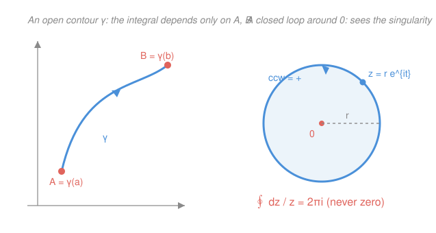

# Complex Analysis · Lesson 4.1: Contour integrals

> ⏱ ~15 min · Module 4: Cauchy's theory of integration · Builds on: [1.1 Complex numbers and the geometry of $\mathbb{C}$](01-01-complex-numbers-geometry.md), [3.2 The elementary functions as power series](03-02-elementary-functions-series.md) · Unlocks: [4.2 The Cauchy–Goursat theorem](04-02-cauchy-goursat-theorem.md)

## Why this matters

Everything explosive about complex analysis — recovering a function from its boundary values, evaluating real integrals that defeat every real method, counting a polynomial's roots by walking a loop around them — is built on one operation: integrating a function along a *path* in the plane. The definition itself is humble (it's a real integral in disguise). The payoff is not: for a large class of functions the answer forgets the path entirely and depends only on the endpoints — and when it *doesn't*, the leftover is a pure count of the singularities the loop encircled. This lesson sets up the machine; the next four cash it out.

## The idea

A real integral $\int_a^b f\,dx$ sweeps along the number line from $a$ to $b$. In the plane there's no single road from one point to another, so you must first *choose a path* $\gamma$ and then integrate along it. Pick a parametrization — a moving point $\gamma(t)$ that traces the path as $t$ runs over $[a,b]$ — substitute it in, and the whole thing collapses to an ordinary integral in the single real variable $t$. No new calculus, just bookkeeping.

Here is the twist that makes it worth the trouble. For a "nice" function (one with an antiderivative), the path washes out: any two routes with the same start and end give the same answer, and a *closed* loop gives zero. But some functions have no antiderivative on the region you're looping around — the star example is $1/z$, whose would-be antiderivative $\log z$ can't be pinned to a single value as you circle the origin. For those, a closed loop returns something nonzero, and that number counts what's trapped inside. That single fact — a loop integral that refuses to vanish — is the seed of the entire residue calculus.

## The formal version

**Contour.** A **contour** (or path) is a piecewise-smooth map $\gamma:[a,b]\to\mathbb{C}$ — continuous, and made of finitely many pieces on each of which $\gamma'(t)$ exists and is continuous. Its **length** is $L=\int_a^b|\gamma'(t)|\,dt$.

> In words: a contour is a curve you can trace with a moving point, possibly with a few corners; its length is the total distance that point travels.

**The contour integral.** For $f$ continuous on (a set containing) $\gamma$,
$$\int_\gamma f(z)\,dz \;=\; \int_a^b f(\gamma(t))\,\gamma'(t)\,dt.$$

> In words: feed the moving point $\gamma(t)$ into $f$, multiply by the velocity $\gamma'(t)$, and integrate over the parameter. The $\gamma'(t)$ is the change-of-variables factor — the "$dz$" made honest — and forgetting it is the classic mistake.

Two structural facts fall straight out of the definition. **Orientation:** reversing the direction of travel, $\tilde\gamma(t)=\gamma(a+b-t)$, flips the sign, $\int_{\tilde\gamma}f\,dz=-\int_\gamma f\,dz$ (the velocity reverses). **Convention:** a closed contour is always traversed **counterclockwise** — the *positive* orientation — unless stated otherwise.

**Fundamental theorem for contour integrals.** Suppose $F$ is holomorphic on a domain $D$ containing $\gamma$, with $F'=f$ there. Then
$$\int_\gamma f(z)\,dz \;=\; F(\gamma(b))-F(\gamma(a)).$$

> In words: if $f$ has an antiderivative, the integral only sees the endpoints — so it is **path-independent**, and **zero around any closed loop** (where $\gamma(a)=\gamma(b)$).

*Proof.* On each smooth piece the chain rule gives $\frac{d}{dt}F(\gamma(t))=F'(\gamma(t))\,\gamma'(t)=f(\gamma(t))\,\gamma'(t)$. So the integrand is an exact $t$-derivative, and the real Fundamental Theorem of Calculus (applied to the real and imaginary parts separately) gives $\int_a^b \frac{d}{dt}F(\gamma(t))\,dt=F(\gamma(b))-F(\gamma(a))$. Across a piecewise path the interior endpoint values telescope, leaving only the two ends. $\blacksquare$

**The ML-inequality.** With $M=\max_{z\in\gamma}|f(z)|$ and $L=\text{length}(\gamma)$,
$$\left|\int_\gamma f(z)\,dz\right|\;\le\; M\,L.$$

> In words: the integral is no bigger than "worst-case height $\times$ length of road." Crude, but it's exactly what makes integrals over huge or tiny arcs provably vanish — the workhorse of Module 6.

*Proof.* Using $\left|\int_a^b g(t)\,dt\right|\le\int_a^b|g(t)|\,dt$ for complex-valued $g$,
$$\left|\int_\gamma f\,dz\right|=\left|\int_a^b f(\gamma(t))\gamma'(t)\,dt\right|\le\int_a^b|f(\gamma(t))|\,|\gamma'(t)|\,dt\le M\int_a^b|\gamma'(t)|\,dt=ML.\ \blacksquare$$

**The pivotal computation.** Around the circle $|z-z_0|=r$ (counterclockwise), for integer $n$,
$$\oint_{|z-z_0|=r}(z-z_0)^n\,dz=\begin{cases}2\pi i,& n=-1,\\[2pt] 0,& n\neq -1.\end{cases}$$

> In words: of all the pure powers, only $1/(z-z_0)$ leaves a residue around the loop — and it always leaves exactly $2\pi i$, independent of the radius. Every other power integrates to nothing.

*Proof.* Parametrize $z=z_0+re^{it}$, $t\in[0,2\pi]$; then $dz=ire^{it}\,dt$ (using $\frac{d}{dt}e^{it}=ie^{it}$ from [3.2](03-02-elementary-functions-series.md)), and $(z-z_0)^n=r^ne^{int}$. So
$$\oint (z-z_0)^n\,dz=\int_0^{2\pi}r^ne^{int}\cdot ire^{it}\,dt=i\,r^{n+1}\int_0^{2\pi}e^{i(n+1)t}\,dt.$$
If $n\neq-1$, $e^{i(n+1)t}$ runs through whole periods and integrates to $0$. If $n=-1$, the integrand is just $i$, and $\int_0^{2\pi}i\,dt=2\pi i$. $\blacksquare$

The $n=-1$ case, $\oint_{|z|=r}\frac{dz}{z}=2\pi i$, is the one to burn in. It is **nonzero around a closed loop** — which, by the Fundamental Theorem above, is only possible because **$1/z$ has no single-valued antiderivative** on the punctured plane $\mathbb{C}\setminus\{0\}$. Its natural antiderivative is $\log z$, and $\log z$ gains $2\pi i$ every time you circle the origin (the multivaluedness from Lesson 1.3) — that gain *is* the integral.

## Picture

## Worked examples

**Example 1 (mechanical — crank the definition).** Compute $\int_\gamma \bar z\,dz$ along the straight segment from $0$ to $1+i$. Parametrize $\gamma(t)=(1+i)t$, $t\in[0,1]$, so $\gamma'(t)=1+i$ and $\overline{\gamma(t)}=(1-i)t$. Then
$$\int_\gamma \bar z\,dz=\int_0^1 (1-i)t\,(1+i)\,dt=(1-i)(1+i)\int_0^1 t\,dt=2\cdot\tfrac12=1.$$
Pure bookkeeping: substitute, keep the $\gamma'(t)=1+i$ factor, integrate in $t$. (Note $\bar z$ is *not* holomorphic — it has no antiderivative — so we had no choice but to grind it out, and the answer will depend on the path.)

**Example 2 (why you'd care — path-independence, and its failure).** Now integrate a holomorphic function. Since $\frac{d}{dz}\frac{z^2}{2}=z$, the Fundamental Theorem applies to $f(z)=z$ on *all* of $\mathbb{C}$: along **any** path from $0$ to $1+i$,
$$\int_\gamma z\,dz=\left[\frac{z^2}{2}\right]_0^{1+i}=\frac{(1+i)^2}{2}=\frac{2i}{2}=i.$$
No parametrization needed — the endpoints decide everything, and a closed path would give $0$. Contrast this with the star of the module: $1/z$ is holomorphic on $\mathbb{C}\setminus\{0\}$ but has *no* antiderivative there, so the theorem is silent, and indeed $\oint_{|z|=1}\frac{dz}{z}=2\pi i\neq 0$. Same-looking integrands, opposite verdicts — and the difference is exactly "does an antiderivative exist on the region I'm using?"

## Watch out

- You might think $dz$ is just "$dt$," but $dz=\gamma'(t)\,dt$ — the velocity factor is part of the substitution. Drop it and every integral is wrong. (In Example 1 it supplied the crucial $1+i$.)
- You might think the Fundamental-Theorem shortcut ("plug endpoints into $F$") always applies, but it needs a *single-valued* antiderivative on a domain containing the whole path. For $1/z$ around $0$ there is none — $\log z$ won't hold still — so the shortcut fails and the loop integral is $2\pi i$, not $0$.
- You might think orientation is cosmetic, but reversing the path negates the answer. Closed contours are counterclockwise-positive by convention; a clockwise loop around $0$ gives $-2\pi i$. Always fix the direction before you trust a sign.

## One-liner

> Integrating along a path is a real integral in disguise, $\int_\gamma f\,dz=\int_a^b f(\gamma(t))\gamma'(t)\,dt$ — and it forgets the path exactly when an antiderivative exists, which is why $\oint dz/z=2\pi i$ is the whole game.

## Problems

**P1 (🟢)** Compute $\displaystyle\int_\gamma z^2\,dz$ along the straight segment from $0$ to $2i$, directly from the definition. Then confirm your answer using an antiderivative.

**P2 (🟡)** Evaluate $\displaystyle\oint_{|z|=1}\left(3z^2+\frac{2}{z}\right)dz$ (counterclockwise). Which term does the work, and why does the other vanish?

**P3 (🔴, optional)** Let $\Gamma_R$ be the circle $|z|=R$ (counterclockwise), $R>1$. Using the ML-inequality and the reverse triangle inequality, show that
$$\left|\oint_{\Gamma_R}\frac{dz}{z^2+1}\right|\le\frac{2\pi R}{R^2-1}\xrightarrow[R\to\infty]{}0.$$
This "the big arc contributes nothing" move is the backbone of evaluating real integrals in Module 6.

Solutions

**P1** Parametrize $\gamma(t)=2it$, $t\in[0,1]$, so $\gamma'(t)=2i$ and $z^2=(2it)^2=-4t^2$. Then
$$\int_\gamma z^2\,dz=\int_0^1(-4t^2)(2i)\,dt=-8i\int_0^1 t^2\,dt=-8i\cdot\tfrac13=-\tfrac{8i}{3}.$$
Check with the antiderivative $F(z)=z^3/3$ (valid everywhere, since $z^2$ is entire): $\left[\frac{z^3}{3}\right]_0^{2i}=\frac{(2i)^3}{3}=\frac{-8i}{3}$. ✓ Matches — and being holomorphic, *any* path from $0$ to $2i$ gives the same value.

**P2** By linearity, split the integral. For the first term, $z^2$ is the power $n=2\neq-1$, so $\oint_{|z|=1}z^2\,dz=0$. For the second, $\oint_{|z|=1}\frac{2}{z}\,dz=2\oint_{|z|=1}\frac{dz}{z}=2\cdot 2\pi i=4\pi i$. Total:
$$\oint_{|z|=1}\left(3z^2+\frac{2}{z}\right)dz=3\cdot 0+4\pi i=4\pi i.$$
The $1/z$ term does all the work: $z^2$ has the antiderivative $z^3/3$, so its loop integral is forced to zero, while $1/z$ has none on $\mathbb{C}\setminus\{0\}$ and leaves the $2\pi i$ residue.

**P3** On $\Gamma_R$ we have $|z|=R$, so by the reverse triangle inequality $|z^2+1|\ge|z^2|-|1|=R^2-1>0$ (using $R>1$). Hence the integrand is bounded by
$$M=\max_{|z|=R}\left|\frac{1}{z^2+1}\right|\le\frac{1}{R^2-1}.$$
The circle has length $L=2\pi R$. ML gives $\left|\oint_{\Gamma_R}\frac{dz}{z^2+1}\right|\le ML=\frac{2\pi R}{R^2-1}$. As $R\to\infty$ the bound behaves like $2\pi/R\to 0$, so the integral is squeezed to $0$. (This is exactly how, in Module 6, one throws away the semicircular arc and keeps only the real-axis piece.)

## Flashback

**From Lesson 1.1 (geometry of $\mathbb{C}$ — polar form):** Contour integrals live or die on good parametrizations, and every parametrization is 1.1's geometry in motion. Write a parametrization $\gamma(t)$, $t\in[0,1]$, for each: (a) the straight segment from $2$ to $2i$; (b) the circle of radius $3$ centered at $1-i$, traversed counterclockwise. Then give the velocity $\gamma'(t)$ for each.

Solution

(a) A segment from $z_0$ to $z_1$ is the convex combination $\gamma(t)=(1-t)z_0+tz_1$. With $z_0=2$, $z_1=2i$:
$$\gamma(t)=(1-t)\cdot 2+t\cdot 2i=2-2t+2it,\qquad \gamma'(t)=-2+2i=2(i-1).$$
(At $t=0$ it sits at $2$, at $t=1$ at $2i$, and the constant velocity confirms it's a straight line.)

(b) A circle of radius $\rho$ about center $c$, counterclockwise, is $c+\rho e^{i\theta}$ with $\theta$ sweeping $0\to 2\pi$ — the polar form from 1.1. To use $t\in[0,1]$, set $\theta=2\pi t$. With $c=1-i$, $\rho=3$:
$$\gamma(t)=(1-i)+3e^{2\pi i t},\qquad \gamma'(t)=3\cdot 2\pi i\,e^{2\pi i t}=6\pi i\,e^{2\pi i t}.$$
The chain rule pulls out the extra $2\pi$ because we compressed a full turn into $t\in[0,1]$. (Traversing $\theta:0\to2\pi$ instead gives the cleaner $\gamma'=3ie^{i\theta}$ — the form used in the pivotal $\oint dz/z$ computation above.)

## Connections

- **Backward:** the integral is nothing but 1.1's parametrizations fed through a substitution; the $e^{it}$ machinery (and its derivative $ie^{it}$) that made $\oint dz/z=2\pi i$ come out clean is the Euler-formula work of [3.2](03-02-elementary-functions-series.md). The multivaluedness of $\log z$ that *forces* that answer to be nonzero is Lesson 1.3.
- **Forward:** [4.2](04-02-cauchy-goursat-theorem.md) proves the deep converse — that a holomorphic function integrates to *zero* around any closed contour (so it always has a local antiderivative), turning "$1/z$ is special" into "$1/z$ is special *precisely because* $0$ is a hole." The Cauchy integral formula (4.3) is then this same $\oint dz/z=2\pi i$ dressed up.
- **Sideways (physics):** a contour integral $\int_\gamma f\,dz$ is the complex cousin of a line integral / work integral $\int_\gamma \mathbf{F}\cdot d\mathbf{r}$; "path-independent iff an antiderivative exists" is exactly "conservative field iff a potential exists," and $\oint dz/z=2\pi i$ is the circulation around a vortex that no potential can kill.
