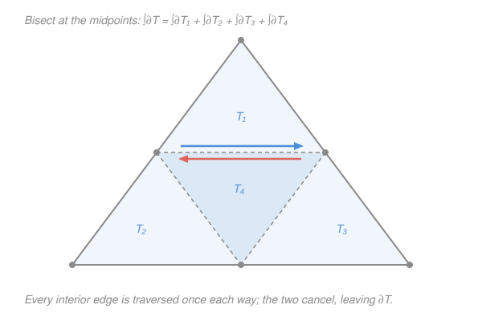

# Complex Analysis · Lesson 4.2: The Cauchy–Goursat theorem

> ⏱ ~15 min · Module 4: Cauchy's theory of integration · Builds on: [4.1 Contour integrals](04-01-contour-integrals.md), [2.2 The Cauchy–Riemann equations](02-02-cauchy-riemann-equations.md) · Unlocks: [4.3 The Cauchy integral formula](04-03-cauchy-integral-formula.md)

## Why this matters

This is the theorem the rest of the course stands on. Everything downstream — recovering a function from its boundary values, that holomorphic functions are secretly infinitely differentiable, the entire residue machine that evaluates real integrals no real method can touch — is a corollary of one clean fact: **a holomorphic function integrates to zero around any closed loop.** In [4.1](04-01-contour-integrals.md) you saw a closed-loop integral vanish *whenever you already held an antiderivative*. Cauchy–Goursat removes that condition: holomorphy alone forces it, with no antiderivative in hand. That's a far stronger and stranger claim, and its proof is the intellectual heart of complex analysis.

## The idea

Recall the two facts from [4.1](04-01-contour-integrals.md). First: if $f=F'$ for some holomorphic $F$, then $\oint_\gamma f\,dz = 0$ around any closed $\gamma$, because you just plug the same endpoint into $F$ twice and subtract. Second — the warning sign — $\oint_{|z|=1} \frac{dz}{z} = 2\pi i \neq 0$.

Those look like they contradict a "loops give zero" rule. They don't, and the reason is the whole story. $1/z$ is holomorphic *almost* everywhere — everywhere except the single point $z=0$, which sits **inside** the loop. That one puncture is enough to break everything. Cauchy–Goursat says: if $f$ is holomorphic on the *entire filled-in region* the loop encloses — no punctures, no bad points, nothing missing — then the integral is $0$. Full stop.

So the theorem is really a statement about **holes**. A loop integral can only be nonzero if the loop lassoes a place where $f$ misbehaves. No enclosed misbehavior, no integral. The $2\pi i$ from $1/z$ isn't a counterexample — it's the *measurement* of the hole at the origin, and in Module 6 that measurement becomes the residue.

## The formal version

First, the one word we need.

**Simply connected.** A domain (open, connected set) $D \subseteq \mathbb{C}$ is **simply connected** if every closed loop in $D$ can be shrunk continuously to a point without ever leaving $D$.

> In words: $D$ has no holes. A disk is simply connected; a punctured disk $\{0<|z|<1\}$ and an annulus $\{1<|z|<2\}$ are **not** — a loop around the missing center is snagged and can't contract.

**Theorem (Cauchy–Goursat).** Let $f$ be holomorphic on a simply connected domain $D$, and let $\gamma$ be any piecewise-smooth closed contour lying in $D$. Then

$$\oint_\gamma f(z)\,dz = 0.$$

> In words: on a region with no holes, holomorphy alone makes every closed-loop integral vanish — you never have to exhibit an antiderivative first.

The proof comes in two moves: kill the integral over a **triangle**, then bootstrap from triangles to the whole region by *building* an antiderivative.

**Lemma (Goursat's triangle).** If $f$ is holomorphic on an open set containing a solid triangle $T$, then $\oint_{\partial T} f(z)\,dz = 0$, where $\partial T$ is the triangle's boundary traversed once.

*Proof.* Join the midpoints of the three sides. This cuts $T$ into four congruent sub-triangles $T_1,T_2,T_3,T_4$, each similar to $T$ at half scale (the picture below). Orient every boundary counterclockwise. Then

$$\oint_{\partial T} f = \sum_{j=1}^{4}\oint_{\partial T_j} f.$$

Why: each of the three new interior segments is shared by two sub-triangles, which traverse it in **opposite** directions, so those contributions cancel; what survives is exactly the outer boundary $\partial T$.

By the triangle inequality, one of the four pieces carries at least a quarter of the total size. Call it $T^{(1)}$:

$$\left|\oint_{\partial T} f\right| \le 4\left|\oint_{\partial T^{(1)}} f\right|.$$

Now repeat the bisection on $T^{(1)}$, and again, forever, always keeping the sub-triangle with the largest integral. This produces a nested sequence of solid triangles $T \supseteq T^{(1)} \supseteq T^{(2)} \supseteq \cdots$ with

$$\left|\oint_{\partial T} f\right| \le 4^n\left|\oint_{\partial T^{(n)}} f\right|, \qquad L_n = \frac{L}{2^n},\quad d_n = \frac{d}{2^n},$$

where $L=\text{perimeter}(T)$, $d=\text{diameter}(T)$, and $L_n,d_n$ are those of $T^{(n)}$. These are closed, nested, shrinking sets: by the **nested-sets / completeness** principle from `real-analysis` (nested nonempty compact sets with diameters $\to 0$ have exactly one common point), there is a unique point $z_* \in \bigcap_n T^{(n)}$.

Here is where holomorphy is spent, and only here. $f$ is complex-differentiable at $z_*$, which means

$$f(z) = f(z_*) + f'(z_*)(z - z_*) + \eta(z)\,(z-z_*), \qquad \eta(z)\to 0 \text{ as } z\to z_*.$$

> In words: near $z_*$, $f$ is its own tangent line plus an error that dies faster than linearly. The term $\eta(z)(z-z_*)$ is the little-$o$ remainder — this is *the definition* of the derivative from [2.1](02-01-complex-differentiability.md), rearranged.

Integrate this around $\partial T^{(n)}$. The constant $f(z_*)$ and the linear part $f'(z_*)(z-z_*)$ are polynomials in $z$ — they have obvious antiderivatives ($f(z_*)z$ and $\tfrac{1}{2}f'(z_*)(z-z_*)^2$), so by the [4.1](04-01-contour-integrals.md) antiderivative fact each integrates to **zero** around the closed loop. Only the remainder survives:

$$\oint_{\partial T^{(n)}} f(z)\,dz = \oint_{\partial T^{(n)}} \eta(z)(z-z_*)\,dz.$$

Bound it with the ML-inequality from [4.1](04-01-contour-integrals.md). On $\partial T^{(n)}$ every point is within $d_n$ of $z_*$, so $|z-z_*|\le d_n$; and given $\varepsilon>0$, for $n$ large enough $|\eta(z)|<\varepsilon$ everywhere on $T^{(n)}$. With path-length $L_n$,

$$\left|\oint_{\partial T^{(n)}} f\right| \le \varepsilon\, d_n\, L_n = \varepsilon \cdot \frac{d}{2^n}\cdot\frac{L}{2^n} = \frac{\varepsilon\, dL}{4^n}.$$

Feed this back into the amplification:

$$\left|\oint_{\partial T} f\right| \le 4^n \cdot \frac{\varepsilon\, dL}{4^n} = \varepsilon\, dL.$$

The $4^n$ from the bisection and the $4^n$ from the shrinking geometry cancel *exactly*. Since $\varepsilon>0$ was arbitrary and $d,L$ are fixed, $\left|\oint_{\partial T} f\right| = 0$. $\blacksquare$

**From triangles to the theorem.** Fix a base point $z_0 \in D$ and define

$$F(z) = \int_{z_0}^{z} f(w)\,dw$$

along any path in $D$ (take $D$ convex, e.g. a disk, so a straight segment always works; the general simply connected case is stitched from such pieces). This is **well-defined** — independent of the path — precisely *because* the triangle lemma makes the integral over any two segment-paths agree: their difference bounds a triangle, whose integral is $0$. A short estimate then shows $F'(z) = f(z)$, so $f$ has an antiderivative on $D$. And once an antiderivative exists, [4.1](04-01-contour-integrals.md) closes the case: $\oint_\gamma f = 0$ for every closed $\gamma$. $\blacksquare$

**Deformation / path independence.** Two immediate restatements, both used constantly downstream:

- *Path independence:* if $\gamma_1,\gamma_2$ share endpoints and $f$ is holomorphic on a simply connected region containing both, then $\int_{\gamma_1} f = \int_{\gamma_2} f$.
- *Contour deformation:* a contour may be continuously deformed through any region where $f$ stays holomorphic without changing the integral.

> In words: only the *homotopy class* of the path matters, not its exact shape. You can slide, bulge, or reshape a contour freely as long as you never drag it across a bad point. This is the engine that makes Module 6 work — you fatten a nasty contour into a convenient circle around each singularity.

## Picture

## Worked examples

**Example 1 (mechanical — the theorem in one line).** Compute $\oint_{|z|=1} \big(z^2 + e^z + \cos z\big)\,dz$.

Each of $z^2$, $e^z$, $\cos z$ is holomorphic on all of $\mathbb{C}$ (entire), hence holomorphic on the disk the unit circle bounds — a simply connected region with no bad points anywhere inside. Cauchy–Goursat applies directly:

$$\oint_{|z|=1} \big(z^2 + e^z + \cos z\big)\,dz = 0.$$

No antiderivative computed, no parametrization, no arithmetic. That is the point of the theorem: holomorphy on the enclosed region is the entire argument.

**Example 2 (why you'd care — deformation reads off the one hole).** Compute $\oint_{C} \frac{dz}{z}$ where $C$ is the boundary of the square with corners $\pm 2 \pm 2i$, counterclockwise.

Parametrizing a square is unpleasant. Instead: $1/z$ is holomorphic *everywhere except $z=0$*, and the only bad point enclosed by the square is that origin. The region between the square $C$ and the unit circle $|z|=1$ contains **no** singularity of $1/z$, so I can deform $C$ inward to the circle without changing the integral:

$$\oint_{C}\frac{dz}{z} = \oint_{|z|=1}\frac{dz}{z} = 2\pi i,$$

the last value computed by parametrization in [4.1](04-01-contour-integrals.md) ($z=e^{i\theta}$). The answer is nonzero, and Cauchy–Goursat tells you *exactly why the theorem doesn't apply*: the enclosed region is not hole-free. The $2\pi i$ is the signature of the puncture at $0$ — Module 6 will name it the residue.

## Watch out

- You might think "$f$ holomorphic *on the contour* is enough." It is not — the theorem needs holomorphy on the **whole filled-in region** the loop encloses. A single interior bad point breaks it: that's the entire difference between Example 1 (zero) and Example 2 ($2\pi i$).
- You might think simple connectedness is a technicality. It's load-bearing. On an annulus $\{1<|z|<2\}$, $1/z$ *is* holomorphic on the whole domain, yet $\oint_{|z|=1.5}\frac{dz}{z}=2\pi i\neq 0$ — because the annulus has a hole and the loop can't contract. No simple connectedness, no conclusion.
- You might think Cauchy's theorem always required $f'$ to be continuous — Cauchy's own 1825 proof did, via Green's theorem. **Goursat's** contribution was removing that hypothesis: the bisection argument above uses only that $f$ is differentiable *once*, never that $f'$ is continuous. That's not pedantry — it's what lets Lesson 4.4 (Liouville, Morera, and the FTA) prove the astonishing fact that holomorphic $\Rightarrow$ *infinitely* differentiable. Assuming smooth $f'$ up front would make that circular.

## One-liner

> A holomorphic function integrates to zero around any loop that encloses no bad point — and Goursat proves it by bisecting a triangle until differentiability at a single limit point squeezes the integral to nothing.

## Problems

**P1 (🟢)** Evaluate $\displaystyle\oint_{|z|=3}\frac{e^{z}}{z^2+25}\,dz$ and justify the value in one sentence. (Where are the bad points, and are any inside $|z|=3$?)

**P2 (🟡)** Let $\gamma$ be the boundary of the rectangle with corners $\pm 1$ and $\pm 1 + i$, counterclockwise. Compute $\displaystyle\oint_\gamma \frac{dz}{z-3}$. Then explain what would change if the constant were $z - \tfrac{1}{2}$ instead of $z-3$.

**P3 (🔴, optional)** Show that $\displaystyle\oint_{|z|=2}\frac{dz}{z^2-1} = 0$, *without* computing either residue individually. (Hint: $\frac{1}{z^2-1}=\frac{1}{2}\!\left(\frac{1}{z-1}-\frac{1}{z+1}\right)$, and deformation lets you handle each pole on its own circle.)

Solutions

**P1** The integrand fails to be holomorphic only where the denominator vanishes: $z^2+25=0 \Rightarrow z=\pm 5i$. Both have modulus $5$, so both lie **outside** $|z|=3$. Hence $\frac{e^z}{z^2+25}$ is holomorphic on the entire closed disk bounded by $|z|=3$ — a hole-free region — and by Cauchy–Goursat the integral is $\boxed{0}$.

**P2** The only bad point of $\frac{1}{z-3}$ is $z=3$. The rectangle has corners $\pm 1, \pm 1 + i$, so it lives in $-1\le\operatorname{Re}z\le 1$, $0\le\operatorname{Im}z\le 1$ — and $z=3$ is far outside it. The integrand is holomorphic on the whole enclosed region, so

$$\oint_\gamma \frac{dz}{z-3} = 0.$$

If the constant were $z-\tfrac12$, the bad point would be $z=\tfrac12$, which **does** lie inside the rectangle ($\operatorname{Re}=\tfrac12\in[-1,1]$, $\operatorname{Im}=0\in[0,1]$ — on the base edge; nudge it to $z=\tfrac12+\tfrac{i}{2}$ to sit cleanly in the interior). Then Cauchy–Goursat no longer applies, and deforming to a small circle about $\tfrac12$ gives $2\pi i$, not $0$. The location of the singularity relative to the contour is the whole game.

**P3** Split with the hint:

$$\oint_{|z|=2}\frac{dz}{z^2-1} = \frac{1}{2}\oint_{|z|=2}\frac{dz}{z-1} - \frac{1}{2}\oint_{|z|=2}\frac{dz}{z+1}.$$

Both poles $z=1$ and $z=-1$ lie inside $|z|=2$. Deform $|z|=2$ onto a tiny circle around each pole (legal: the deformation only crosses hole-free territory). For the first term, $\frac{1}{z-1}$ around a small loop about $z=1$ integrates to $2\pi i$ — it's a translated copy of $\oint\frac{dw}{w}=2\pi i$ with $w=z-1$. Same for the second about $z=-1$: also $2\pi i$. Therefore

$$\frac{1}{2}(2\pi i) - \frac{1}{2}(2\pi i) = 0.$$

The two punctures contribute equal and opposite amounts and cancel — even though the function is genuinely singular inside the contour. (This previews the residue theorem: the total is a *sum over enclosed holes*, and here the sum happens to be zero.)

## Flashback

**From Lesson 4.1 (Contour integrals — computing $\oint (z-z_0)^n\,dz$):** Let $C$ be the circle $|z - z_0| = R$ traversed once counterclockwise. Compute $\displaystyle\oint_C (z-z_0)^n\,dz$ for every integer $n$ (positive, negative, and zero), and state which single value of $n$ is the odd one out.

Solution

Parametrize $z = z_0 + R e^{i\theta}$, $\theta\in[0,2\pi]$, so $dz = iR e^{i\theta}\,d\theta$ and $(z-z_0)^n = R^n e^{in\theta}$:

$$\oint_C (z-z_0)^n\,dz = \int_0^{2\pi} R^n e^{in\theta}\cdot iR e^{i\theta}\,d\theta = iR^{n+1}\int_0^{2\pi} e^{i(n+1)\theta}\,d\theta.$$

If $n \neq -1$, then $n+1\neq 0$ and $\int_0^{2\pi} e^{i(n+1)\theta}\,d\theta = \left[\frac{e^{i(n+1)\theta}}{i(n+1)}\right]_0^{2\pi} = 0$, since $e^{i(n+1)2\pi}=1$. So the integral is $0$.

If $n = -1$, the integrand collapses to $e^{0}=1$ and $\int_0^{2\pi} 1\,d\theta = 2\pi$, giving $iR^{0}\cdot 2\pi = 2\pi i$.

$$\oint_C (z-z_0)^n\,dz = \begin{cases} 2\pi i, & n=-1,\\ 0, & n\neq -1.\end{cases}$$

The odd one out is $\mathbf{n=-1}$. Every non-negative power is entire, so Cauchy–Goursat *predicts* those zeros without any computation; every power $n\le -2$ also gives zero despite the singularity, because it has an antiderivative $\frac{(z-z_0)^{n+1}}{n+1}$ on the punctured plane. Only $n=-1$ lacks a single-valued antiderivative (its would-be antiderivative is $\log$, which is multivalued) — and that lone survivor, $2\pi i$, is the seed of the entire residue calculus.

## Connections

- **Backward:** this completes the arc from [4.1](04-01-contour-integrals.md). There, $\oint f = 0$ *required* an antiderivative you had to produce; here, holomorphy on a hole-free region *manufactures* one for you. The proof spends complex-differentiability from [2.1](02-01-complex-differentiability.md) at exactly one point, and leans on the nested-sets/completeness principle imported from `real-analysis`.
- **Forward:** [4.3](04-03-cauchy-integral-formula.md) applies deformation to the specific integrand $\frac{f(z)}{z-a}$ to recover $f(a)$ from boundary values, and Lesson 4.4 (Liouville, Morera, and the FTA) uses Goursat's *not* assuming continuous $f'$ to prove holomorphic $\Rightarrow$ infinitely differentiable — with Liouville and the Fundamental Theorem of Algebra falling out after. All of Module 6's residue calculus is deformation plus the $n=-1$ survivor from the Flashback.
- **Sideways:** the deformation principle is the complex cousin of "a conservative field's line integral depends only on endpoints" from vector calculus — path independence is exactly the statement that a holomorphic $f$ behaves like a conservative field, with the Cauchy–Riemann equations of [2.2](02-02-cauchy-riemann-equations.md) playing the role of the zero-curl condition.
