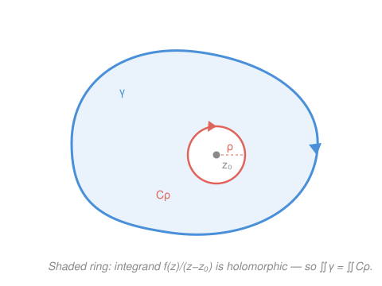

# Complex Analysis · Lesson 4.3: The Cauchy integral formula

> ⏱ ~15 min · Module 4: Cauchy's theory of integration · Builds on: [4.1 Contour integrals](04-01-contour-integrals.md), [4.2 The Cauchy–Goursat theorem](04-02-cauchy-goursat-theorem.md) · Unlocks: [4.4 Consequences: Liouville, Morera, and the FTA](04-04-consequences-liouville-morera.md)

## Why this matters

Here is the single most improbable fact in the subject. Take a holomorphic function and draw any small loop. The values of $f$ on that loop — just the boundary, a one-dimensional rim — **completely determine** every value of $f$ inside. Not approximately: exactly, by a formula. Nothing in real calculus is remotely this rigid; a smooth real function can do whatever it likes in the interior of an interval regardless of its endpoints. In [4.2](04-02-cauchy-goursat-theorem.md) you proved holomorphic functions integrate to zero around closed loops. This lesson cashes that theorem into a machine that (a) reconstructs interior values from boundary data, and (b) converts "evaluate $f$ at a point" into "integrate around a loop" and back — the trade that powers every residue computation to come.

## The idea

Cauchy–Goursat says a holomorphic integrand around a closed loop gives zero. But watch what happens if we *manufacture* a singularity: divide $f(z)$ by $z - z_0$. Now the integrand $\frac{f(z)}{z-z_0}$ blows up at the one point $z_0$, and the loop can no longer be collapsed to nothing — it snags on that puncture.

The key move is **deformation**. In the region strictly *between* your big loop $\gamma$ and a tiny circle $C_\rho$ hugging $z_0$, the integrand is perfectly holomorphic (no puncture there — $z_0$ has been cut out). So by the antiderivative/deformation logic of [4.2](04-02-cauchy-goursat-theorem.md), the integral over $\gamma$ equals the integral over the tiny circle. And on a tiny circle around $z_0$, $f$ barely changes — it's essentially the constant $f(z_0)$. Integrating that constant times $\frac{1}{z-z_0}$ around the circle gives exactly $2\pi i$ (you computed $\oint \frac{dz}{z-z_0} = 2\pi i$ back in [4.1](04-01-contour-integrals.md)). Divide by $2\pi i$ and you've recovered $f(z_0)$ from a loop integral. That's the whole idea; the formula below is just this sentence made exact.

## The formal version

**Cauchy integral formula.** Let $f$ be holomorphic on and inside a positively-oriented (counterclockwise) simple closed contour $\gamma$, and let $z_0$ be any point *inside* $\gamma$. Then

$$f(z_0) = \frac{1}{2\pi i} \oint_\gamma \frac{f(z)}{z - z_0}\, dz.$$

> In words: the value of $f$ at an interior point is a specific weighted average of its values around the boundary — the boundary data alone pins down the interior.

Here $\oint_\gamma$ is the contour integral over $\gamma$ traversed once counterclockwise; $f$ holomorphic "on and inside" means complex-differentiable at every point of $\gamma$ and its enclosed region; "inside" means $z_0$ lies in the bounded region $\gamma$ encloses.

**Proof.** Fix $z_0$ inside $\gamma$. For small $\rho > 0$, let $C_\rho$ be the circle of radius $\rho$ centered at $z_0$, oriented counterclockwise, small enough to lie inside $\gamma$. The integrand $g(z) = \frac{f(z)}{z - z_0}$ is holomorphic everywhere on the closed region between $\gamma$ and $C_\rho$ (its only singularity, $z_0$, has been excised). By the deformation principle from [4.2](04-02-cauchy-goursat-theorem.md),

$$\oint_\gamma \frac{f(z)}{z-z_0}\,dz = \oint_{C_\rho} \frac{f(z)}{z-z_0}\,dz \qquad (\star)$$

for every such $\rho$. Now split the right side by adding and subtracting the constant $f(z_0)$ in the numerator:

$$\oint_{C_\rho} \frac{f(z)}{z-z_0}\,dz = f(z_0)\underbrace{\oint_{C_\rho} \frac{dz}{z-z_0}}_{=\,2\pi i} \;+\; \oint_{C_\rho} \frac{f(z) - f(z_0)}{z - z_0}\,dz.$$

The first integral is $2\pi i$ — the benchmark computation from [4.1](04-01-contour-integrals.md), independent of $\rho$. So

$$\oint_{C_\rho} \frac{f(z)}{z-z_0}\,dz = 2\pi i\, f(z_0) + \oint_{C_\rho} \frac{f(z) - f(z_0)}{z - z_0}\,dz. \qquad (\star\star)$$

It remains to show the last integral vanishes as $\rho \to 0$. Bound it with the **ML-inequality** from [4.1](04-01-contour-integrals.md) ($\left|\oint_C h\right| \le M \cdot L$, where $M$ bounds $|h|$ on $C$ and $L$ is the arc length). Since $f$ is continuous at $z_0$: given $\varepsilon > 0$ there is $\delta > 0$ with $|f(z) - f(z_0)| < \varepsilon$ whenever $|z - z_0| < \delta$. Take $\rho < \delta$. On $C_\rho$ every point satisfies $|z - z_0| = \rho$, so the integrand is bounded by

$$\left|\frac{f(z) - f(z_0)}{z - z_0}\right| = \frac{|f(z)-f(z_0)|}{\rho} < \frac{\varepsilon}{\rho} =: M,$$

and the length of $C_\rho$ is $L = 2\pi\rho$. Hence

$$\left| \oint_{C_\rho} \frac{f(z) - f(z_0)}{z - z_0}\,dz \right| \le M \cdot L = \frac{\varepsilon}{\rho}\cdot 2\pi\rho = 2\pi\varepsilon.$$

Since $\varepsilon > 0$ was arbitrary and the left side of $(\star)$ doesn't depend on $\rho$ at all, the extra term in $(\star\star)$ must be $0$. Combining $(\star)$ and $(\star\star)$:

$$\oint_\gamma \frac{f(z)}{z-z_0}\,dz = 2\pi i\, f(z_0). \qquad \blacksquare$$

**Mean value property.** Take $\gamma$ to be the circle of radius $r$ centered at $z_0$, parametrized $z = z_0 + re^{i\theta}$, $\theta\in[0,2\pi]$, so $dz = ire^{i\theta}\,d\theta$ and $z - z_0 = re^{i\theta}$. Substituting into the formula, the $re^{i\theta}$ factors cancel:

$$f(z_0) = \frac{1}{2\pi i}\int_0^{2\pi} \frac{f(z_0 + re^{i\theta})}{re^{i\theta}}\, i r e^{i\theta}\,d\theta = \frac{1}{2\pi}\int_0^{2\pi} f(z_0 + re^{i\theta})\,d\theta.$$

> In words: the value of $f$ at the center of a circle is exactly the *average* of its values around that circle — for every radius $r$.

Taking real parts, $u = \operatorname{Re} f$ obeys the same averaging law — which is precisely the mean value property of harmonic functions you met in [2.3](02-03-harmonic-functions-conformality.md). Holomorphy hands harmonicity its defining rigidity for free.

## Picture

## Worked examples

**Example 1 (mechanical — the machine in action).** Evaluate $\displaystyle\oint_{|z|=2} \frac{e^z}{z-1}\,dz$.

The contour is the circle $|z| = 2$, counterclockwise. Match the integrand to the template $\frac{f(z)}{z - z_0}$: here $f(z) = e^z$ and $z_0 = 1$. Is $z_0 = 1$ inside $|z| = 2$? Yes, $|1| = 1 < 2$. Is $f(z) = e^z$ holomorphic on and inside the circle? Yes, everywhere. So the formula applies directly:

$$\oint_{|z|=2} \frac{e^z}{z-1}\,dz = 2\pi i\, f(1) = 2\pi i\, e^1 = 2\pi i\, e.$$

No antiderivative, no parametrization — just read off $f(z_0)$. Likewise $\displaystyle\oint_{|z|=1}\frac{\cos z}{z}\,dz$: here $f(z) = \cos z$, $z_0 = 0$ (inside $|z|=1$), giving $2\pi i\,\cos 0 = 2\pi i$.

**Example 2 (why you'd care — location is everything).** Evaluate the *same* integrand as before but around a smaller loop: $\displaystyle\oint_{|z|=\frac12} \frac{e^z}{z-1}\,dz$.

Now check $z_0 = 1$ against the contour $|z| = \frac12$. We need $|1| < \frac12$ — false. The point $z_0 = 1$ lies *outside* the loop. So the integral formula does **not** apply. But something better does: with $z_0$ excluded, the integrand $\frac{e^z}{z-1}$ is holomorphic *everywhere on and inside* $|z| = \frac12$ (its only singularity sits out at $z=1$). By Cauchy–Goursat ([4.2](04-02-cauchy-goursat-theorem.md)), a holomorphic integrand around a closed loop integrates to zero:

$$\oint_{|z|=\frac12} \frac{e^z}{z-1}\,dz = 0.$$

Same function, same denominator — the answer flips from $2\pi i\,e$ to $0$ purely because the singularity moved from inside the loop to outside it. The formula and Cauchy–Goursat are two faces of one coin: enclosed singularity $\Rightarrow$ $2\pi i f(z_0)$; no enclosed singularity $\Rightarrow$ $0$.

## Watch out

- You might think $z_0$ just needs to be "near" the loop, but it must be **strictly inside**. Outside gives $0$ (Example 2, by Cauchy–Goursat); *on* $\gamma$ makes the integrand's singularity sit on the path itself, and the formula simply doesn't apply — the integral is improper and needs separate treatment.
- You might think orientation is cosmetic, but it carries a sign. The formula assumes $\gamma$ is traversed **counterclockwise** (positively). A clockwise loop reverses the sign: $\oint_{\gamma^-}\frac{f(z)}{z-z_0}dz = -2\pi i\,f(z_0)$. Always confirm the direction before quoting the answer.
- You might think any singularity of the integrand is fair game, but the **only** singularity allowed inside $\gamma$ is the manufactured pole $z - z_0$ in the denominator. $f$ itself must be holomorphic on the whole enclosed region. If $f$ hides its own blow-up inside — e.g. $\oint \frac{1/(z-3)}{z-1}dz$ around a loop containing *both* $1$ and $3$ — the plain formula fails; you'd split it up (residues, Module 6) instead.

## One-liner

> Divide a holomorphic $f$ by $z - z_0$, loop counterclockwise around $z_0$, and the integral coughs up exactly $2\pi i\,f(z_0)$ — the boundary knows every interior value.

## Problems

**P1 (🟢)** Evaluate $\displaystyle\oint_{|z|=3} \frac{z^2 + 1}{z - 2}\,dz$.

**P2 (🟡)** Evaluate $\displaystyle\oint_{|z|=1} \frac{\sin z}{z - 4}\,dz$, and *separately* $\displaystyle\oint_{|z|=5} \frac{\sin z}{z - 4}\,dz$. Explain in one sentence why the two answers differ.

**P3 (🔴, optional)** Use the mean value property to prove a baby version of the **maximum modulus principle**: if $f$ is holomorphic on and inside a disk centered at $z_0$, then $|f(z_0)|$ cannot exceed the maximum of $|f|$ on the bounding circle. (Hint: take absolute values inside the averaging integral.)

Solutions

**P1** Template match: $f(z) = z^2 + 1$, $z_0 = 2$. Check $|2| = 2 < 3$, so $z_0$ is inside $|z|=3$; and $f$ is a polynomial, holomorphic everywhere. Apply the formula:

$$\oint_{|z|=3}\frac{z^2+1}{z-2}\,dz = 2\pi i\, f(2) = 2\pi i\,(2^2 + 1) = 2\pi i \cdot 5 = 10\pi i.$$

**P2** For the first, $f(z) = \sin z$, $z_0 = 4$. Is $4$ inside $|z| = 1$? No, $|4| = 4 > 1$. With the singularity outside, the integrand is holomorphic on and inside $|z|=1$, so by Cauchy–Goursat

$$\oint_{|z|=1}\frac{\sin z}{z-4}\,dz = 0.$$

For the second, the loop is $|z| = 5$, and now $|4| = 4 < 5$, so $z_0 = 4$ *is* inside. The formula gives

$$\oint_{|z|=5}\frac{\sin z}{z-4}\,dz = 2\pi i\,\sin 4.$$

They differ because the singularity at $z = 4$ lies outside the small loop but inside the large one — enclosing the pole is exactly what turns the integral on: no pole enclosed $\Rightarrow 0$, pole enclosed $\Rightarrow 2\pi i f(z_0)$.

**P3** By the mean value property, for the circle of radius $r$ centered at $z_0$,

$$f(z_0) = \frac{1}{2\pi}\int_0^{2\pi} f(z_0 + re^{i\theta})\,d\theta.$$

Take absolute values and pull the modulus inside the integral (triangle inequality for integrals, $\left|\int h\right| \le \int |h|$):

$$|f(z_0)| = \left|\frac{1}{2\pi}\int_0^{2\pi} f(z_0 + re^{i\theta})\,d\theta\right| \le \frac{1}{2\pi}\int_0^{2\pi} |f(z_0 + re^{i\theta})|\,d\theta.$$

Let $M = \max_{\theta} |f(z_0 + re^{i\theta})|$, the largest value of $|f|$ on the circle. Then the integrand is $\le M$ everywhere, so

$$|f(z_0)| \le \frac{1}{2\pi}\int_0^{2\pi} M\,d\theta = \frac{1}{2\pi}\cdot M \cdot 2\pi = M.$$

So $|f(z_0)| \le M = \max_{\text{circle}} |f|$: the center's modulus never beats the boundary's. (The full maximum modulus principle sharpens this — equality forces $f$ constant — but the averaging inequality is the whole engine.)

## Flashback

**From Lesson 4.2 (The Cauchy–Goursat theorem):** Let $\gamma$ be the counterclockwise square with corners $\pm 2 \pm 2i$. Evaluate $\displaystyle\oint_\gamma \left(z^3 - \frac{1}{z - 5}\right) dz$, and justify each piece from Cauchy–Goursat — *without* using the integral formula.

Solution

Split the integral: $\oint_\gamma z^3\,dz - \oint_\gamma \frac{1}{z-5}\,dz$.

The first integrand $z^3$ is a polynomial — holomorphic on all of $\mathbb{C}$, in particular on and inside the square. By Cauchy–Goursat ([4.2](04-02-cauchy-goursat-theorem.md)), $\oint_\gamma z^3\,dz = 0$. (Equivalently, $z^3$ has the antiderivative $\frac{z^4}{4}$, so any closed-loop integral vanishes.)

The second integrand $\frac{1}{z-5}$ has its only singularity at $z = 5$. The square reaches out to $x = 2$, so $z = 5$ lies well outside it; on and inside the square the integrand is holomorphic. Cauchy–Goursat again gives $\oint_\gamma \frac{1}{z-5}\,dz = 0$.

Both pieces vanish, so

$$\oint_\gamma \left(z^3 - \frac{1}{z-5}\right) dz = 0 - 0 = 0.$$

The lesson: a holomorphic integrand around a closed loop is $0$ regardless of the loop's shape — the square never encloses a singularity here, so there's nothing to snag on. (Had the pole been *inside*, e.g. $\frac{1}{z-1}$, the second piece would instead give $2\pi i$ by the formula — the exact contrast this lesson is built on.)

## Connections

- **Backward:** this is [4.2](04-02-cauchy-goursat-theorem.md)'s Cauchy–Goursat theorem plus one manufactured pole. The deformation step $(\star)$, the $\oint\frac{dz}{z-z_0}=2\pi i$ benchmark from [4.1](04-01-contour-integrals.md), and the ML-inequality bound are all reused verbatim — the formula is those three tools composed.
- **Forward:** [4.4](04-04-consequences-liouville-morera.md) differentiates this formula under the integral sign to get $f^{(n)}(z_0) = \frac{n!}{2\pi i}\oint \frac{f(z)}{(z-z_0)^{n+1}}dz$ — instantly proving holomorphic functions are *infinitely* differentiable, then Cauchy's estimates, Liouville, and the Fundamental Theorem of Algebra. The residue theorem of Module 6 is this formula generalized to many enclosed singularities at once (Boss problem 4 splits $\frac{1}{z(z-1)}$ exactly this way).
- **Sideways (physics/PDE):** the mean value property makes $u = \operatorname{Re} f$ harmonic — the same averaging law that governs steady-state temperature and electrostatic potential ([2.3](02-03-harmonic-functions-conformality.md)), and the reason a harmonic function has no interior maxima. This is the analytic root of the Dirichlet problem you'll solve conformally in Module 7.
