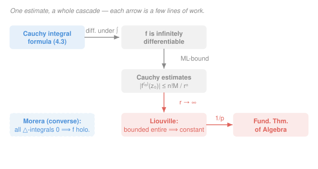

# Complex Analysis · Lesson 4.4: Consequences — Liouville, Morera, and the FTA

> ⏱ ~15 min · Module 4: Cauchy's theory of integration · Builds on: [4.3 The Cauchy integral formula](04-03-cauchy-integral-formula.md) · Unlocks: Module 5 — [5.1 Taylor series: holomorphic = analytic](05-01-taylor-series-analyticity.md)

## Why this matters

The Cauchy integral formula ([4.3](04-03-cauchy-integral-formula.md)) already told you something outrageous: a holomorphic function's interior values are pinned down by its boundary values. This lesson cashes that in. From that one formula, differentiated under the integral sign, comes a chain of theorems that would each be a headline result on the reals — *every* holomorphic function is infinitely differentiable, a bounded entire function must be constant, and — the crown jewel — **every polynomial has a complex root**. The astonishing part is how *short* each step is. Once boundary controls interior, the rest is almost free.

## The idea

Look at [4.3](04-03-cauchy-integral-formula.md)'s formula:

$$f(z_0) = \frac{1}{2\pi i}\oint_\gamma \frac{f(z)}{z - z_0}\,dz.$$

The variable $z_0$ appears only in that clean $\frac{1}{z-z_0}$ factor — everything else is fixed data on the curve $\gamma$. So to differentiate $f$ at $z_0$, you don't need $f$ to be differentiable in any way you'd have to check; you just differentiate the *fraction* with respect to $z_0$, right under the integral sign. And you can do it again, and again, forever — each derivative just pushes the power up by one. One consequence lands immediately: **being differentiable once forces being differentiable infinitely often.** On the real line that's absurd (think of $x^2\sin(1/x)$, differentiable once with a discontinuous derivative). In $\mathbb{C}$ it's automatic.

The second idea is even cheaper. That same formula, applied to the *derivatives*, bounds them. If $|f|$ is no bigger than $M$ on a circle of radius $r$, the $n$th derivative at the center is at most $\frac{n!\,M}{r^n}$ — a big circle with a bounded function forces small derivatives. Push $r$ to infinity for a function bounded on *all* of $\mathbb{C}$ and the first derivative is squeezed to zero: the function can't change. That's Liouville. And a function that can never be zero, if it's a polynomial, would hand you exactly such a bounded entire function — contradiction. That's the Fundamental Theorem of Algebra. The whole cascade is one estimate, reused.

## The formal version

Throughout, $\gamma$ is a positively oriented (counterclockwise) circle $|z - z_0| = r$, $f$ is holomorphic on and inside it, and "entire" means holomorphic on all of $\mathbb{C}$.

**Generalized Cauchy integral formula (derivatives).** For every integer $n\ge 0$,

$$f^{(n)}(z_0) = \frac{n!}{2\pi i}\oint_\gamma \frac{f(z)}{(z - z_0)^{n+1}}\,dz.$$

> In words: to get the $n$th derivative at the center, integrate $f$ against $\frac{1}{(z-z_0)^{n+1}}$ around the boundary — you never touch $f$'s own derivatives, only the kernel's.

This comes from differentiating [4.3](04-03-cauchy-integral-formula.md) under the integral sign in $z_0$: $\frac{d}{dz_0}\frac{1}{z-z_0} = \frac{1}{(z-z_0)^2}$, then $\frac{2}{(z-z_0)^3}$, and in general $\frac{n!}{(z-z_0)^{n+1}}$ (the factorial is the accumulated chain-rule constant). The integrand stays continuous because $z$ runs on $\gamma$ while $z_0$ sits strictly inside, so $z-z_0$ never vanishes — differentiation under the integral is legal.

**Major consequence — infinite differentiability.** If $f$ is holomorphic on an open set, then $f'$ is holomorphic there too; hence $f$ has derivatives of *all* orders, each holomorphic.

> In words: one complex derivative forces infinitely many. There is no "differentiable exactly $k$ times" in $\mathbb{C}$ — it's zero or all.

(This also retroactively justifies a loose end from [2.3](02-03-harmonic-functions-conformality.md): we assumed $u,v$ had continuous second partials to prove them harmonic. Now we know a holomorphic $f = u + iv$ automatically has all derivatives, so $u,v$ are $C^\infty$ — the assumption was free all along.)

**Cauchy estimates.** If $|f(z)|\le M$ for all $z$ on the circle $|z - z_0| = r$, then

$$\bigl|f^{(n)}(z_0)\bigr| \le \frac{n!\,M}{r^n}.$$

> In words: bound $f$ on a circle and every derivative at the center is bounded too — and the bound *decays* as the circle grows.

*Proof.* Apply the ML-inequality (from [4.1](04-01-contour-integrals.md): $\bigl|\oint_\gamma g\bigr|\le (\max_\gamma|g|)\cdot\text{length}(\gamma)$) to the derivative formula. On $\gamma$ we have $|z - z_0| = r$, so $\bigl|\frac{f(z)}{(z-z_0)^{n+1}}\bigr|\le \frac{M}{r^{n+1}}$, and $\text{length}(\gamma) = 2\pi r$. Therefore

$$\bigl|f^{(n)}(z_0)\bigr| = \frac{n!}{2\pi}\left|\oint_\gamma \frac{f(z)}{(z-z_0)^{n+1}}\,dz\right| \le \frac{n!}{2\pi}\cdot\frac{M}{r^{n+1}}\cdot 2\pi r = \frac{n!\,M}{r^n}. \qquad\blacksquare$$

**Liouville's theorem.** A bounded entire function is constant.

> In words: if $f$ is holomorphic everywhere and $|f|\le M$ across the *whole* plane, $f$ can't wiggle at all.

*Proof.* Fix any $z_0\in\mathbb{C}$. Since $f$ is entire, the $n=1$ Cauchy estimate holds on *every* circle around $z_0$, with the same global bound $M$: for all $r>0$,

$$|f'(z_0)| \le \frac{M}{r}.$$

The left side doesn't depend on $r$, so let $r\to\infty$: the right side goes to $0$, forcing $f'(z_0) = 0$. This holds for every $z_0$, so $f'\equiv 0$ on $\mathbb{C}$, hence $f$ is constant. $\blacksquare$

**Fundamental Theorem of Algebra.** Every non-constant polynomial $p(z) = a_n z^n + \cdots + a_1 z + a_0$ (with $n\ge 1$, $a_n\ne 0$) has a root in $\mathbb{C}$.

> In words: you never have to leave $\mathbb{C}$ to solve a polynomial — the roots are always already there.

*Proof.* Suppose not: $p(z)\ne 0$ for all $z$. Then $g(z) = \frac{1}{p(z)}$ is entire (a quotient of holomorphic functions with non-vanishing denominator). I claim $g$ is bounded. As $|z|\to\infty$,

$$|p(z)| = |z|^n\left|a_n + \frac{a_{n-1}}{z} + \cdots + \frac{a_0}{z^n}\right| \longrightarrow \infty,$$

because the bracket $\to |a_n| > 0$ while $|z|^n\to\infty$ (this is exactly where $n\ge 1$, i.e. $p$ non-constant, is used). So there is an $R$ with $|g(z)| = \frac{1}{|p(z)|} \le 1$ whenever $|z|\ge R$. On the remaining closed disk $|z|\le R$ — which is compact — the continuous function $|g|$ attains a finite max. Bounded outside, bounded inside, so $g$ is bounded on all of $\mathbb{C}$. By Liouville, $g$ is constant, hence $p$ is constant — contradicting $n\ge 1$. So $p$ must have a root. $\blacksquare$

(Dividing out that root and repeating shows a degree-$n$ polynomial has exactly $n$ roots counted with multiplicity — the full statement.)

**Morera's theorem (converse of Cauchy–Goursat).** If $f$ is continuous on an open set $D$ and $\oint_{\partial T} f(z)\,dz = 0$ for every triangle $T\subset D$, then $f$ is holomorphic on $D$.

> In words: Cauchy–Goursat ([4.2](04-02-cauchy-goursat-theorem.md)) said holomorphic $\Rightarrow$ triangle-integrals vanish; Morera says the vanishing is enough to *recover* holomorphy from mere continuity.

The vanishing integrals let you build a local antiderivative $F$ (its derivative is $f$), and $F$, being holomorphic, is infinitely differentiable by the result above — so its derivative $f$ is holomorphic too. Morera is the standard tool for proving that a *limit* of holomorphic functions, or a function *defined by an integral*, is itself holomorphic: you don't check differentiability directly, you just check that triangle-integrals vanish (often by swapping limit/integral).

## Picture

## Worked examples

**Example 1 (mechanical — the derivative formula as an integral machine).** Evaluate

$$\oint_{|z|=1} \frac{\cos z}{z^{3}}\,dz.$$

Match to the derivative formula with $z_0 = 0$, $n+1 = 3$ so $n = 2$, and $f(z) = \cos z$ (entire, so certainly holomorphic on and inside $|z|=1$):

$$f^{(2)}(0) = \frac{2!}{2\pi i}\oint_{|z|=1}\frac{\cos z}{z^{3}}\,dz \quad\Longrightarrow\quad \oint_{|z|=1}\frac{\cos z}{z^{3}}\,dz = \frac{2\pi i}{2!}\,f''(0).$$

Since $f''(z) = -\cos z$, we get $f''(0) = -1$, so the integral is $\frac{2\pi i}{2}(-1) = -\pi i$. The formula turned a contour integral into a single derivative evaluation.

**Example 2 (why you'd care — Liouville kills a fantasy).** Could there be a non-constant entire function $f$ with $|f(z)|\le 7$ for all $z$? No — Liouville forbids it outright. Contrast the two ways this can fail if you drop a hypothesis: $e^z$ is entire but *not* bounded (it blows up as $x\to+\infty$), and $\frac{1}{z}$ is bounded on $|z|\ge 1$ but *not* entire (it explodes at $0$). Liouville needs **both** conditions on **all** of $\mathbb{C}$ at once; each alone buys nothing. This is also the engine behind the FTA: the whole proof is manufacturing a bounded entire function ($1/p$) and letting Liouville collapse it.

## Watch out

- You might think Liouville just needs "bounded," but it needs **entire *and* bounded on all of $\mathbb{C}$**. $\sin z$ is bounded on the real axis yet entire and wildly unbounded off it ($\sin(iy) = i\sinh y\to\infty$); $\frac{1}{z}$ is bounded away from the origin but isn't entire. Drop either hypothesis and the conclusion dies.
- You might think the FTA proof works for any $p$, but it needs $p$ **non-constant** ($n\ge 1$). That's the only reason $|p(z)|\to\infty$, which is what makes $1/p$ bounded near infinity. For constant $p$, $1/p$ is trivially constant already and there's nothing to prove — and no root need exist.
- You might think one vanishing triangle-integral gives Morera, but you need $\oint_{\partial T} f = 0$ for **every** triangle in the domain, plus $f$ **continuous**. A single triangle, or a discontinuous $f$, isn't enough — the antiderivative construction needs the full family.
- You might think "infinitely differentiable" is a mild upgrade, but on $\mathbb{R}$ it's genuinely false: differentiable-once does not imply differentiable-twice. In $\mathbb{C}$ the jump from one derivative to all of them is the defining miracle — don't import real-variable intuition here.

## One-liner

> Differentiate the Cauchy formula under the integral and you get every derivative at once, an estimate that bounds them, Liouville from letting the radius run to infinity, and the Fundamental Theorem of Algebra for free.

## Problems

**P1 (🟢)** Evaluate $\displaystyle\oint_{|z|=2}\frac{e^{z}}{(z-1)^{2}}\,dz$ using the generalized Cauchy integral formula.

**P2 (🟡)** Suppose $f$ is entire and satisfies $|f(z)|\le 5\sqrt{|z|}$ for all $z$. Prove $f$ is constant. (Hint: bound $|f'(z_0)|$ using a circle of radius $r$ and let $r\to\infty$.)

**P3 (🔴, optional)** Suppose $f$ is entire and its *real part* satisfies $\operatorname{Re}f(z)\le 0$ for all $z$. Prove $f$ is constant. (Hint: $g = e^{f}$ is entire; what does the real-part bound say about $|g|$?)

Solutions

**P1** Here $z_0 = 1$ lies inside $|z|=2$, and $\frac{1}{(z-1)^2}$ matches $\frac{1}{(z-z_0)^{n+1}}$ with $n = 1$; take $f(z) = e^z$ (entire). The derivative formula gives

$$f'(1) = \frac{1!}{2\pi i}\oint_{|z|=2}\frac{e^z}{(z-1)^2}\,dz \quad\Longrightarrow\quad \oint_{|z|=2}\frac{e^z}{(z-1)^2}\,dz = 2\pi i\, f'(1).$$

Since $f'(z) = e^z$, $f'(1) = e$, so the integral is $\boxed{2\pi i\, e}$.

**P2** Fix $z_0$ and apply the $n=1$ Cauchy estimate on the circle $|z - z_0| = r$. On that circle $|z|\le |z_0| + r$, so the bound is $M = 5\sqrt{|z_0| + r}$. Then

$$|f'(z_0)| \le \frac{M}{r} = \frac{5\sqrt{|z_0| + r}}{r}.$$

As $r\to\infty$, the numerator grows like $\sqrt{r}$ while the denominator grows like $r$, so the quotient behaves like $\frac{5}{\sqrt{r}}\to 0$. Hence $f'(z_0) = 0$ for every $z_0$, so $f'\equiv 0$ and $f$ is constant. (The point: any growth bound *slower than linear* still crushes $f'$ to zero. Linear growth is the exact threshold — it permits the non-constant $f(z)=z$.) $\blacksquare$

**P3** Let $g(z) = e^{f(z)}$. As a composition of entire functions, $g$ is entire. Its modulus is

$$|g(z)| = \bigl|e^{f(z)}\bigr| = e^{\operatorname{Re}f(z)}$$

(using $|e^{w}| = e^{\operatorname{Re}w}$). Since $\operatorname{Re}f(z)\le 0$ everywhere, $|g(z)| = e^{\operatorname{Re}f(z)}\le e^{0} = 1$ for all $z$. So $g$ is a bounded entire function; by Liouville, $g$ is constant. Then $g = e^{f}$ constant and non-zero forces $f$ constant (if $e^f$ is constant, differentiating gives $f'e^f = 0$, and $e^f\ne 0$, so $f' = 0$). $\blacksquare$

## Flashback

**From Lesson 4.3 (The Cauchy integral formula):** Evaluate $\displaystyle\oint_{|z|=1}\frac{\sin z}{z}\,dz$ using the Cauchy integral formula, and confirm the answer is $0$ — say why in one sentence.

Solution

Take $f(z) = \sin z$ (entire, hence holomorphic on and inside $|z|=1$) and $z_0 = 0$, which lies inside the contour. The Cauchy integral formula says

$$f(0) = \frac{1}{2\pi i}\oint_{|z|=1}\frac{\sin z}{z}\,dz \quad\Longrightarrow\quad \oint_{|z|=1}\frac{\sin z}{z}\,dz = 2\pi i\,f(0) = 2\pi i\,\sin 0 = 0.$$

It's $0$ because $\sin z$ vanishes at the center of the circle — the formula reads the integral straight off the value $f(0)=0$. (Note this is *not* Cauchy–Goursat: $\frac{\sin z}{z}$ isn't obviously holomorphic at $0$, but the singularity is removable and the formula handles it cleanly.) $\blacksquare$

## Connections

- **Backward:** every theorem here is [4.3](04-03-cauchy-integral-formula.md)'s formula differentiated or estimated, using the ML-inequality from [4.1](04-01-contour-integrals.md) and the antiderivative machinery of [4.2](04-02-cauchy-goursat-theorem.md). Morera is literally the converse of Cauchy–Goursat.
- **Forward:** infinite differentiability is the gateway to [5.1](05-01-taylor-series-analyticity.md) — since all derivatives exist, you can *write down* the Taylor series $\sum \frac{f^{(n)}(z_0)}{n!}(z-z_0)^n$, and the Cauchy estimates are exactly what proves it converges to $f$. "Holomorphic = analytic" is the payoff waiting one lesson away.
- **Sideways (algebra):** the FTA is why $\mathbb{C}$ is *algebraically closed* — the fact that lets `linalg-refresher` guarantee every matrix has an eigenvalue and splits its characteristic polynomial. An analysis theorem underwrites a cornerstone of algebra.
- **Sideways (physics/engineering):** Liouville-style "bounded + analytic ⟹ trivial" arguments recur in proving uniqueness of solutions to Laplace's equation (bounded harmonic functions on all of $\mathbb{R}^2$ are constant) — the steady-state and potential problems you'll meet again in Module 7's conformal mapping.
