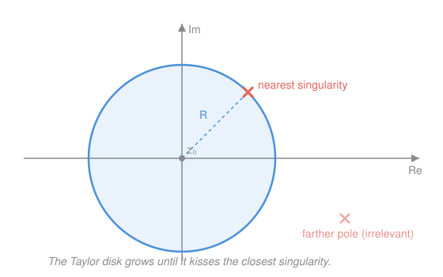

# Complex Analysis · Lesson 5.1: Taylor series: holomorphic = analytic

> ⏱ ~15 min · Module 5: Series and singularities · Builds on: [4.3 The Cauchy integral formula](04-03-cauchy-integral-formula.md), [3.1 Complex power series and analytic functions](03-01-power-series-analytic.md) · Unlocks: [5.2 Laurent series](05-02-laurent-series.md)

## Why this matters

In [3.1](03-01-power-series-analytic.md) you saw that a convergent power series is holomorphic — differentiate it term by term forever. This lesson proves the staggering **converse**: *every* holomorphic function, differentiable just once on an open disk, is secretly a convergent power series there. Nothing like this holds for real functions — a real function can be differentiable once and nowhere else, or smooth yet not equal to any Taylor series. In $\mathbb{C}$, "differentiable once" quietly means "infinitely differentiable and equal to your own Taylor series." **Holomorphic** and **analytic** turn out to be the same word. From that single fact fall two more: the radius of a Taylor series is exactly the distance to the nearest place the function breaks (finally explaining a mystery from real calculus), and a holomorphic function is pinned down everywhere by its values on any tiny arc — the rigidity that powers analytic continuation.

## The idea

Cauchy's integral formula ([4.3](04-03-cauchy-integral-formula.md)) already says something outrageous: the value of $f$ at an interior point $z$ is a weighted average of its values on a surrounding circle,

$$f(z) = \frac{1}{2\pi i}\oint_\gamma \frac{f(w)}{w-z}\,dw.$$

The whole interior behaviour is encoded in the boundary values, transmitted through the kernel $\frac{1}{w-z}$. So *everything* about $f$ near $z_0$ is hiding inside that one fraction — and a fraction is something we know how to expand. Freeze the boundary point $w$ and let $z$ roam near the centre $z_0$. Then $\frac{1}{w-z}$ is a geometric series in the small quantity $\frac{z-z_0}{w-z_0}$. Feed that series back through the integral, collect powers of $(z-z_0)$, and out drops a power series for $f$. The coefficients are integrals over the circle — and they turn out to be exactly $\frac{f^{(n)}(z_0)}{n!}$, the Taylor coefficients. The power series was never a lucky coincidence for $e^z$ or $\sin z$; it's forced on *any* holomorphic function by the geometry of that averaging kernel.

## The formal version

**Taylor's theorem (complex).** Let $f$ be holomorphic on the open disk $D(z_0,R)=\{z:|z-z_0|<R\}$. Then for every $z$ in that disk,

$$f(z)=\sum_{n=0}^{\infty} a_n\,(z-z_0)^n, \qquad a_n=\frac{f^{(n)}(z_0)}{n!}=\frac{1}{2\pi i}\oint_{\gamma_r}\frac{f(w)}{(w-z_0)^{n+1}}\,dw,$$

where $\gamma_r$ is any circle $|w-z_0|=r$ with $r<R$, traversed once counter-clockwise. The series converges for all $|z-z_0|<R$.

> In words: a function differentiable once on a disk equals its own Taylor series on that whole disk — and the coefficients can be read off either by differentiating at the centre or by integrating around any circle inside.

**Proof.** Fix $z$ with $|z-z_0|<R$, and pick a radius $r$ with $|z-z_0|<r<R$; let $\gamma_r$ be the circle $|w-z_0|=r$. By the Cauchy integral formula,

$$f(z)=\frac{1}{2\pi i}\oint_{\gamma_r}\frac{f(w)}{w-z}\,dw.$$

Now expand the kernel. Write $w-z=(w-z_0)-(z-z_0)$ and factor out $w-z_0$:

$$\frac{1}{w-z}=\frac{1}{(w-z_0)-(z-z_0)}=\frac{1}{w-z_0}\cdot\frac{1}{1-\dfrac{z-z_0}{w-z_0}}.$$

For $w$ on $\gamma_r$ we have $|w-z_0|=r$ while $|z-z_0|<r$, so the ratio

$$q:=\frac{z-z_0}{w-z_0}\qquad\text{satisfies}\qquad |q|=\frac{|z-z_0|}{r}<1.$$

The geometric series $\frac{1}{1-q}=\sum_{n=0}^\infty q^n$ therefore converges, and

$$\frac{1}{w-z}=\frac{1}{w-z_0}\sum_{n=0}^{\infty}\left(\frac{z-z_0}{w-z_0}\right)^{n}=\sum_{n=0}^{\infty}\frac{(z-z_0)^n}{(w-z_0)^{n+1}}.$$

Multiply by $\frac{f(w)}{2\pi i}$ and integrate over $\gamma_r$. The convergence is **uniform in $w$** on $\gamma_r$: the term $\frac{(z-z_0)^n}{(w-z_0)^{n+1}}$ is bounded in modulus by $\frac{1}{r}\left(\frac{|z-z_0|}{r}\right)^n$, and $\sum_n \frac1r\big(\tfrac{|z-z_0|}{r}\big)^n$ is a convergent geometric series of constants (this is the Weierstrass $M$-test from `real-analysis`). Uniform convergence lets us swap $\oint$ and $\sum$:

$$f(z)=\frac{1}{2\pi i}\oint_{\gamma_r}f(w)\sum_{n=0}^{\infty}\frac{(z-z_0)^n}{(w-z_0)^{n+1}}\,dw=\sum_{n=0}^{\infty}\left(\frac{1}{2\pi i}\oint_{\gamma_r}\frac{f(w)}{(w-z_0)^{n+1}}\,dw\right)(z-z_0)^n.$$

That is exactly $\sum a_n (z-z_0)^n$ with $a_n=\frac{1}{2\pi i}\oint_{\gamma_r}\frac{f(w)}{(w-z_0)^{n+1}}\,dw$. Finally, the generalized Cauchy integral formula for derivatives ([4.4](04-04-consequences-liouville-morera.md)) identifies that same integral as $\frac{f^{(n)}(z_0)}{n!}$. Since $z$ was arbitrary in the disk, the expansion holds throughout $D(z_0,R)$. $\blacksquare$

**Corollary (holomorphic $\iff$ analytic).** A function is holomorphic on an open set iff it is analytic there (locally equal to a convergent power series). In particular a holomorphic function is automatically infinitely differentiable.

> In words: in $\mathbb{C}$ the two words mean the same thing — one derivative buys you all of them, plus the series.

**Corollary (radius = distance to nearest singularity).** If $f$ is holomorphic on a region and $z_0$ is a point of it, the radius of convergence of its Taylor series at $z_0$ equals the distance from $z_0$ to the nearest point where $f$ fails to be holomorphic (its nearest **singularity**).

> In words: the series reaches out exactly as far as it can before it hits trouble — no further, and never less. Taylor's theorem gives "at least that far"; the series must diverge past the singularity because a convergent power series *is* holomorphic on its whole disk ([3.1](03-01-power-series-analytic.md)), and $f$ isn't.

**The identity theorem.** Let $f,g$ be holomorphic on a connected open set (a **domain**) $\Omega$. If the set $\{z\in\Omega: f(z)=g(z)\}$ has a limit point inside $\Omega$, then $f=g$ on all of $\Omega$.

> In words: if two holomorphic functions agree on any set that bunches up somewhere inside the domain — a tiny arc, or a sequence converging to an interior point — they agree everywhere. A holomorphic function is rigid: its values on a whisker of the plane determine it completely.

*Why it's true (via isolated zeros).* Let $h=f-g$, holomorphic on $\Omega$, and suppose its zero set has a limit point $p\in\Omega$. Expand $h(z)=\sum_{n\ge 0}c_n(z-p)^n$ near $p$. If some coefficient is nonzero, let $m$ be the smallest index with $c_m\neq 0$; then $h(z)=(z-p)^m g_0(z)$ with $g_0(p)=c_m\neq 0$, and $g_0$ is continuous, so $g_0\neq 0$ on a small disk around $p$. That forces $h$ to be nonzero for all $z\neq p$ near $p$ — the zeros of $h$ are **isolated** — contradicting that $p$ is a limit of zeros. Hence *every* $c_n=0$, so $h\equiv 0$ on a neighbourhood of $p$. A connectedness argument (the set where all Taylor coefficients vanish is both open and closed in $\Omega$) then spreads $h\equiv 0$ across all of $\Omega$. $\blacksquare$

## Picture

## Worked examples

**Example 1 (mechanical — a series forced by invisible poles).** Expand $f(z)=\dfrac{1}{1+z^2}$ about $z_0=0$. Rather than differentiate repeatedly, reuse the geometric series with $-z^2$ in place of the variable:

$$\frac{1}{1+z^2}=\frac{1}{1-(-z^2)}=\sum_{n=0}^{\infty}(-z^2)^n=\sum_{n=0}^{\infty}(-1)^n z^{2n}=1-z^2+z^4-z^6+\cdots.$$

What is its radius of convergence? The series is geometric with ratio $-z^2$, so it converges iff $|z^2|<1$, i.e. $|z|<1$: radius $R=1$. Now look at *where $f$ breaks*: $1+z^2=0$ at $z=\pm i$, both at distance $1$ from the origin. The radius is the distance to the nearest singularity — on the nose. On the real line $\frac{1}{1+x^2}$ is perfectly smooth and bounded everywhere, so its stubborn refusal to converge past $|x|=1$ looked like sorcery in real calculus (`calc-refresher`, `real-analysis`). The complex viewpoint reveals the culprits: poles at $\pm i$ sitting just off the real axis, invisible from the line but fully in charge of the radius.

**Example 2 (why you'd care — the identity theorem forces identities).** You know $\sin$ and $\cos$ satisfy $\sin^2 x+\cos^2 x=1$ for all *real* $x$. Does it hold for all *complex* $z$? Let $h(z)=\sin^2 z+\cos^2 z-1$. Both $\sin$ and $\cos$ are entire (holomorphic on all of $\mathbb{C}$), so $h$ is entire. And $h$ vanishes on the entire real axis $\mathbb{R}$ — a set with limit points everywhere inside the domain $\mathbb{C}$. By the identity theorem, $h\equiv 0$ on all of $\mathbb{C}$: the Pythagorean identity extends automatically to every complex number, no recomputation needed. This is the everyday engine of complex analysis — *any* polynomial identity in the elementary functions, once true on the real line, is true in the whole plane, because the real line is far more than a set with a limit point.

## Watch out

- You might think agreeing at a bunch of points forces two functions to be equal, but the limit point must be **inside** the domain — isolated agreements are not enough. $\sin(\pi z)$ vanishes at every integer, yet it is not the zero function: the integers have *no* limit point in $\mathbb{C}$ (they march off to infinity without bunching up). No accumulation, no conclusion.
- You might think the radius of a Taylor series is about how "nice" the function looks on the real line, but it is set by the nearest singularity **anywhere in the plane** — possibly off the real axis, as with $\frac{1}{1+z^2}$'s poles at $\pm i$. A function can be flawless on all of $\mathbb{R}$ and still have radius $1$.
- You might think "analytic at a point" and "holomorphic on a domain" are different strengths of assumption, but holomorphy anywhere on an open set makes $f$ analytic at *every* point of it — the local one-derivative hypothesis silently upgrades to a global power-series representation around each centre. There is no weaker or stronger version to keep track of.

## One-liner

> Every function differentiable once on a disk is its own convergent Taylor series there — holomorphic *is* analytic — the radius reaches exactly to the nearest singularity, and values on any little arc pin the function down everywhere.

## Problems

**P1 (🟢)** Find the Taylor series of $f(z)=\dfrac{1}{2-z}$ about $z_0=0$ using the geometric series, and state its radius of convergence. Confirm the radius equals the distance from $0$ to the nearest singularity of $f$.

**P2 (🟡)** Without computing any series, find the radius of convergence of the Taylor expansion of $g(z)=\dfrac{z}{z^2+4z+5}$ about the point $z_0=0$. (Locate the singularities first.)

**P3 (🔴, optional)** Suppose $f$ is entire and $f\!\left(\tfrac1n\right)=\tfrac{1}{n^2}$ for every positive integer $n$. Prove that $f(z)=z^2$ for all $z\in\mathbb{C}$. Then explain why the hypothesis $f\!\left(\tfrac1n\right)=\tfrac{1}{n^2}$ pins $f$ down but $f(n)=n^2$ (values at the integers) would *not*.

Solutions

**P1** Factor the $2$ to expose a geometric series in $z/2$:

$$\frac{1}{2-z}=\frac{1}{2}\cdot\frac{1}{1-\frac{z}{2}}=\frac{1}{2}\sum_{n=0}^{\infty}\left(\frac{z}{2}\right)^n=\sum_{n=0}^{\infty}\frac{z^n}{2^{n+1}}=\frac12+\frac{z}{4}+\frac{z^2}{8}+\cdots.$$

It converges iff $\left|\frac{z}{2}\right|<1$, i.e. $|z|<2$, so $R=2$. The only singularity of $f$ is the pole at $z=2$, at distance $2$ from $0$ — matching the radius exactly.

**P2** The singularities of $g$ are the zeros of the denominator: $z^2+4z+5=0$ gives $z=\frac{-4\pm\sqrt{16-20}}{2}=\frac{-4\pm\sqrt{-4}}{2}=-2\pm i$. (The numerator $z$ is irrelevant — it only affects the coefficients, not where the function blows up.) Both poles lie at distance $|-2\pm i|=\sqrt{(-2)^2+(\pm1)^2}=\sqrt{5}$ from the origin. The nearest singularity is at distance $\sqrt5$, so the radius of convergence is $R=\sqrt{5}$.

**P3** The points $\frac1n$ satisfy $\frac1n\to 0$, so $\{\frac1n:n\ge1\}$ has the limit point $0$, and $0\in\mathbb{C}$ is inside the domain (all of $\mathbb{C}$). Let $h(z)=f(z)-z^2$; it is entire, and $h\!\left(\frac1n\right)=\frac{1}{n^2}-\frac{1}{n^2}=0$ for all $n$. So the zero set of $h$ contains a sequence with an interior limit point. By the identity theorem, $h\equiv 0$, i.e. $f(z)=z^2$ everywhere. 

Why the integers would fail: $\{n:n\ge1\}$ has **no limit point in $\mathbb{C}$** — the points spread apart to infinity and never accumulate. The identity theorem's hypothesis is not met, so matching $z^2$ at the integers imposes no global constraint. Indeed $f(z)=z^2+\sin(\pi z)$ is entire and also satisfies $f(n)=n^2$ for every integer $n$, yet is not $z^2$ — the extra term $\sin(\pi z)$ is exactly a nonzero entire function vanishing on $\mathbb{Z}$, the standing counterexample from *Watch out*.

## Flashback

**From Lesson 3.1 (Complex power series and analytic functions — radius of convergence):** Find the radius of convergence of the power series $\displaystyle\sum_{n=1}^{\infty}\frac{(z-3i)^n}{n\,4^n}$, and name the largest open disk on which it defines a holomorphic function.

Solution

Use the Cauchy–Hadamard / ratio computation on the coefficients $a_n=\frac{1}{n\,4^n}$. The ratio test on $\left|\frac{a_{n+1}}{a_n}\right|=\frac{n\,4^n}{(n+1)4^{n+1}}=\frac{n}{4(n+1)}\to\frac14$ gives radius $R=1/\frac14=4$. (Equivalently, $\limsup |a_n|^{1/n}=\lim\frac{1}{(n\,4^n)^{1/n}}=\frac14$ since $n^{1/n}\to1$, and $R=1/\frac14=4$.) The centre is $z_0=3i$, so the series converges and is holomorphic on the open disk $D(3i,4)=\{z:|z-3i|<4\}$. Term-by-term differentiation ([3.1](03-01-power-series-analytic.md)) keeps the same radius $4$, consistent with today's theorem that this disk reaches exactly to wherever the sum's nearest singularity sits.

## Connections

- **Backward:** this is the exact converse of [3.1](03-01-power-series-analytic.md) (power series are holomorphic), and the proof is the payoff of Module 4 — it runs entirely on the Cauchy integral formula [4.3](04-03-cauchy-integral-formula.md) and the derivative formula from [4.4](04-04-consequences-liouville-morera.md). The one analytic tool imported from `real-analysis` is the Weierstrass $M$-test for the uniform-convergence swap of $\sum$ and $\oint$.
- **Forward:** [5.2](05-02-laurent-series.md) repeats this expansion trick on an *annulus* instead of a disk, allowing negative powers of $(z-z_0)$ — the Laurent series that reads off the type of a singularity. "Zeros are isolated" and the factorization $h(z)=(z-z_0)^m g_0(z)$ become the definition of a zero's **order** in Lesson 5.3, and the mirror-image analysis of poles.
- **Sideways:** the radius-equals-nearest-singularity fact resolves the `calc-refresher`/`real-analysis` puzzle of why $\frac{1}{1+x^2}$'s real Taylor series stalls at $|x|=1$ despite the function being smooth on all of $\mathbb{R}$ — the poles at $\pm i$ were always the reason. The identity theorem is the rigidity underneath analytic continuation: a holomorphic function has at most one holomorphic extension to a larger domain, because any two would agree on the original set and hence everywhere.
