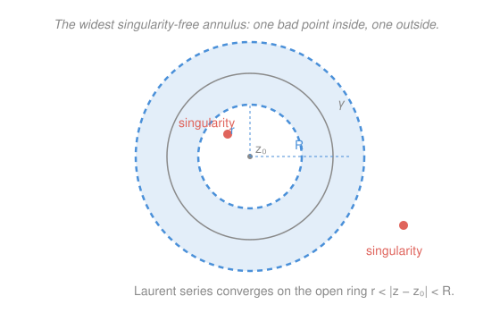

# Complex Analysis · Lesson 5.2: Laurent series

> ⏱ ~15 min · Module 5: Series and singularities · Builds on: [5.1 Taylor series: holomorphic = analytic](05-01-taylor-series-analyticity.md) · Unlocks: [5.3 Zeros and singularities](05-03-zeros-and-singularities.md)

## Why this matters

Taylor series ([5.1](05-01-taylor-series-analyticity.md)) are gorgeous but pampered: they only work where the function is holomorphic, on a *disk*. The moment there's a singularity — a pole, a blow-up, the interesting part — the Taylor picture goes dark, because a disk around the trouble spot always swallows the trouble. Laurent series fix this by allowing *negative* powers of $(z-z_0)$. That one move lets you expand a function on a *ring* around a singularity and read off, in closed form, exactly how it blows up. And buried in the expansion is a single coefficient, $a_{-1}$, that turns the entire theory of contour integration into arithmetic — the residue. This lesson is the hinge into Module 6.

## The idea

A Taylor series says "near here, $f$ looks like a polynomial." But a function like $\frac{1}{z}$ near $0$ is *not* polynomial-ish — it explodes. No sum of $1, z, z^2,\dots$ can ever explode at $0$; they're all perfectly finite there. So we hand ourselves new building blocks: $\frac{1}{z}, \frac{1}{z^2}, \frac{1}{z^3},\dots$, terms that *do* blow up at $0$ in a controlled way. Mix positive and negative powers freely and you can match a function's growth on a ring that avoids the singularity itself.

Why a *ring* and not a disk? Because a disk centered at $z_0$ must contain $z_0$, and if that's where $f$ misbehaves you're stuck. Punch out a small hole around $z_0$ and expand on the leftover annulus $r < |z-z_0| < R$ instead — the widest ring you can draw before hitting the *next* singularity (see the Picture). On that ring $f$ is holomorphic, and it turns out it always has a two-sided series there.

One warning up front, because it trips everyone: the series is *tied to the ring*. The same $f$, expanded about the same $z_0$ but on a *different* ring, gives a *different* series. That's not a bug — the ring tells you which region you're describing, and the centerpiece example below makes the three faces of one function vivid.

## The formal version

**Laurent's theorem.** Let $f$ be holomorphic on the open annulus $A=\{z : r<|z-z_0|<R\}$ (allowing $r=0$ or $R=\infty$). Then for all $z\in A$,

$$f(z)=\sum_{n=-\infty}^{\infty} a_n\,(z-z_0)^n,\qquad a_n=\frac{1}{2\pi i}\oint_\gamma \frac{f(w)}{(w-z_0)^{\,n+1}}\,dw,$$

where $\gamma$ is any positively-oriented circle $|w-z_0|=\rho$ with $r<\rho<R$. The series converges absolutely on $A$ and uniformly on compact subsets, and the coefficients $a_n$ are **unique**.

> In words: on a ring where $f$ is holomorphic, $f$ *is* a two-sided power series — positive powers and negative powers — and the coefficients don't depend on which circle in the ring you integrate over.

**Principal part.** The negative-power piece

$$\underbrace{\sum_{n<0} a_n\,(z-z_0)^n}_{\text{principal part}} \;+\; \underbrace{\sum_{n\ge0} a_n\,(z-z_0)^n}_{\text{holomorphic (Taylor-like) part}}$$

is the **principal part** of $f$ at $z_0$. It is the entire record of *how $f$ blows up*: the holomorphic part is finite at $z_0$, so all the singular behavior lives in those negative powers.

> In words: split the series into "safe" nonnegative powers and "singular" negative powers; the negative-power bundle is the principal part, and it alone knows about the singularity.

**The residue.** The coefficient $a_{-1}$ has a name — the **residue** of $f$ at $z_0$ — because it is the only term that survives integration. From [4.1](04-01-contour-integrals.md), on any circle $\gamma$ around $z_0$,

$$\oint_\gamma (z-z_0)^n\,dz=\begin{cases}2\pi i,& n=-1,\\[2pt]0,& n\ne -1,\end{cases}$$

so integrating the whole series term by term collapses to $\oint_\gamma f(z)\,dz = 2\pi i\,a_{-1}$. Hold that thought — it is the seed of the residue theorem in [6.1](06-01-residue-theorem.md).

> In words: every power except $\frac{1}{z-z_0}$ integrates to zero around a loop, so a whole contour integral reduces to one Laurent coefficient.

**Proof sketch (why it's true).** Fix $z$ in the ring. Trap it between two concentric circles $C_R$ (outer, radius just under $R$) and $C_r$ (inner, radius just over $r$), both in $A$. Cauchy's integral formula on this ring-shaped region gives

$$f(z)=\frac{1}{2\pi i}\oint_{C_R}\frac{f(w)}{w-z}\,dw-\frac{1}{2\pi i}\oint_{C_r}\frac{f(w)}{w-z}\,dw.$$

On $C_R$ we have $|z-z_0|<|w-z_0|$, so expand $\frac{1}{w-z}$ in powers of $\frac{z-z_0}{w-z_0}$ exactly as in [5.1](05-01-taylor-series-analyticity.md) — this produces the nonnegative powers $a_n(z-z_0)^n$, $n\ge0$. On $C_r$ the inequality flips, $|w-z_0|<|z-z_0|$, so expand $\frac{1}{w-z}$ the *other* way, in powers of $\frac{w-z_0}{z-z_0}$ — this produces the negative powers. Both geometric series converge (each ratio has modulus $<1$), and matching term against the integral formula gives the stated $a_n$. Uniqueness follows because integrating $(z-z_0)^{-n-1}$ times the series against $\gamma$ picks out $a_n$ and nothing else. $\blacksquare$

## Picture

## Worked examples

In practice you **never** compute $a_n$ from its integral. Instead you *manipulate known series* — above all the geometric series

$$\frac{1}{1-u}=\sum_{n\ge0}u^n\qquad(|u|<1),$$

and the whole game is choosing the algebra so that the ratio $u$ has modulus $<1$ on your target ring.

**Example 1 (the centerpiece — one function, three rings).** Take

$$f(z)=\frac{1}{(z-1)(z-2)}.$$

Partial fractions first (multiply out to check): $A=\frac{1}{1-2}=-1$, $B=\frac{1}{2-1}=1$, so

$$f(z)=\frac{1}{z-2}-\frac{1}{z-1}.$$

The singularities sit at $z=1$ and $z=2$. About $z_0=0$ they carve the plane into three rings: $|z|<1$, then $1<|z|<2$, then $|z|>2$. Each demands its own geometric expansion, because "which power of $z$ is small" changes as you cross a singularity. Two reusable expansions do all the work:

$$\frac{1}{z-1}=\begin{cases}\displaystyle -\frac{1}{1-z}=-\sum_{n\ge0}z^{n}, & |z|<1,\\[10pt] \displaystyle \frac{1}{z}\cdot\frac{1}{1-\tfrac1z}=\sum_{n\ge1}z^{-n}, & |z|>1,\end{cases}\qquad \frac{1}{z-2}=\begin{cases}\displaystyle -\frac{1}{2}\cdot\frac{1}{1-\tfrac z2}=-\sum_{n\ge0}\frac{z^{n}}{2^{n+1}}, & |z|<2,\\[10pt] \displaystyle \frac{1}{z}\cdot\frac{1}{1-\tfrac2z}=\sum_{n\ge1}2^{\,n-1}z^{-n}, & |z|>2.\end{cases}$$

Now assemble $f=\frac{1}{z-2}-\frac{1}{z-1}$ ring by ring:

**Ring $|z|<1$** — both terms use their "$|z|$ small" branch:

$$f(z)=-\sum_{n\ge0}\frac{z^{n}}{2^{n+1}}+\sum_{n\ge0}z^{n}=\sum_{n\ge0}\left(1-\frac{1}{2^{n+1}}\right)z^{n}=\tfrac12+\tfrac34 z+\tfrac78 z^2+\cdots.$$

All nonnegative powers — no principal part. That's forced: $f$ is holomorphic on the disk $|z|<1$, so this is just its Taylor series.

**Ring $1<|z|<2$** — now $\frac{1}{z-1}$ flips to its "$|z|$ large" branch, while $\frac{1}{z-2}$ keeps the "$|z|<2$" branch:

$$f(z)=-\sum_{n\ge0}\frac{z^{n}}{2^{n+1}}\;-\;\sum_{n\ge1}z^{-n}.$$

A genuine Laurent series: principal part $-\sum_{n\ge1}z^{-n}=-\tfrac1z-\tfrac1{z^2}-\cdots$, holomorphic part $-\sum_{n\ge0}\frac{z^n}{2^{n+1}}$.

**Ring $|z|>2$** — both terms flip to their "$|z|$ large" branches:

$$f(z)=\sum_{n\ge1}2^{\,n-1}z^{-n}-\sum_{n\ge1}z^{-n}=\sum_{n\ge1}\left(2^{\,n-1}-1\right)z^{-n}=\frac{1}{z^2}+\frac{3}{z^3}+\frac{7}{z^4}+\cdots.$$

Pure principal part — and notice the $n=1$ term vanishes ($2^0-1=0$), so $a_{-1}=0$ out here. (That is exactly $-(\text{sum of both residues})=-(-1+1)=0$: far enough out, the two poles' residues cancel.) **Same $f$, same center, three different series** — the ring you name is the region you describe.

**Example 2 (all principal part — a first essential singularity).** Substitute $w=\tfrac1z$ into $e^{w}=\sum_{n\ge0}\frac{w^n}{n!}$:

$$e^{1/z}=\sum_{n\ge0}\frac{1}{n!}\,z^{-n}=1+\frac1z+\frac{1}{2!\,z^2}+\frac{1}{3!\,z^3}+\cdots,\qquad 0<|z|<\infty.$$

This converges for every $z\ne0$, and its principal part has *infinitely many* negative powers — the negative tail never terminates. That is the signature of an **essential singularity** (formalized in [5.3](05-03-zeros-and-singularities.md)): not a pole of some finite order, but an infinitely deep one. Here $a_{-1}=1$, so $\oint_{|z|=1}e^{1/z}\,dz=2\pi i$ — a nonzero loop integral extracted from a single coefficient, with no antiderivative in sight.

## Watch out

- You might think a function has *a* Laurent series about $z_0$. It has *one per annulus* — Example 1's $f$ has three about $0$. Always name the ring before you write the series; a "Laurent series" with no ring attached is ambiguous.
- You might think "principal part" means the important/leading part. It means precisely the **negative-power terms** — the ones carrying the singularity. The nonnegative powers are the tame, finite-at-$z_0$ remainder.
- You might think the series converges on the closed ring. Convergence is on the **open** annulus $r<|z-z_0|<R$; the bounding circles are where the *next* singularity or divergence lives, so boundaries are excluded — just like a Taylor radius is an open disk.
- You might reach for the coefficient integral $a_n=\frac{1}{2\pi i}\oint\cdots$. Almost never do that by hand; manipulate a known geometric or exponential series instead. The integral formula is for *theory* (it proves uniqueness), not for computation.

## One-liner

> A Laurent series is a Taylor series allowed to blow up — negative powers on a ring — and its coefficient $a_{-1}$, the residue, is the one term a contour integral can feel.

## Problems

**P1 (🟢)** Find the Laurent series of $f(z)=\dfrac{e^{z}}{z^{3}}$ on $0<|z|$. Write out the principal part explicitly and state the residue $a_{-1}$.

**P2 (🟡)** For $f(z)=\dfrac{1}{z(z-1)}$, find the Laurent series about $0$ on **each** of the two annuli $0<|z|<1$ and $|z|>1$. In each case give $a_{-1}$, and explain in one sentence why the two residues differ.

**P3 (🔴, optional)** Find the Laurent series of $f(z)=z^{2}e^{1/z}$ on $0<|z|$. Read off the residue $a_{-1}$ directly from the coefficient, and say what kind of singularity $f$ has at $0$ and why. (This is how [6.1](06-01-residue-theorem.md) will have you compute residues at essential singularities — there's no pole formula to fall back on.)

Solutions

**P1** Start from $e^{z}=\sum_{n\ge0}\frac{z^{n}}{n!}$ and divide by $z^{3}$:

$$f(z)=\frac{1}{z^{3}}\sum_{n\ge0}\frac{z^{n}}{n!}=\sum_{n\ge0}\frac{z^{\,n-3}}{n!}=\frac{1}{z^{3}}+\frac{1}{z^{2}}+\frac{1}{2\,z}+\frac{1}{6}+\frac{z}{24}+\cdots.$$

Principal part: $\dfrac{1}{z^{3}}+\dfrac{1}{z^{2}}+\dfrac{1}{2z}$. The residue is the $\frac1z$ coefficient, $a_{-1}=\frac{1}{2!}=\boxed{\tfrac12}$. (Three negative powers, then it stops — a pole of order $3$, in the language of [5.3](05-03-zeros-and-singularities.md).)

**P2** Partial fractions: $\frac{1}{z(z-1)}=\frac{-1}{z}+\frac{1}{z-1}$ (since $A=\frac{1}{0-1}=-1$, $B=\frac{1}{1}=1$).

*Ring $0<|z|<1$:* use $\frac{1}{z-1}=-\frac{1}{1-z}=-\sum_{n\ge0}z^{n}$:

$$f(z)=-\frac1z-\sum_{n\ge0}z^{n}=-\frac1z-1-z-z^{2}-\cdots,\qquad a_{-1}=-1.$$

*Ring $|z|>1$:* use $\frac{1}{z-1}=\frac1z\cdot\frac{1}{1-\frac1z}=\sum_{n\ge1}z^{-n}$:

$$f(z)=-\frac1z+\sum_{n\ge1}z^{-n}=-\frac1z+\frac1z+\frac1{z^{2}}+\frac1{z^{3}}+\cdots=\sum_{n\ge2}z^{-n},\qquad a_{-1}=0.$$

The residues differ because $a_{-1}$ is the coefficient in a *specific* expansion, not a fixed number attached to the function on all of $\mathbb C$: on the inner ring only the pole at $0$ is "inside," contributing residue $-1$; on the outer ring the loop encloses *both* poles at $0$ and $1$, whose residues ($-1$ and $+1$) cancel to $0$. (This previews the residue theorem's bookkeeping in [6.1](06-01-residue-theorem.md).)

**P3** Multiply the $e^{1/z}$ series from Example 2 by $z^{2}$:

$$z^{2}e^{1/z}=z^{2}\sum_{n\ge0}\frac{1}{n!}z^{-n}=\sum_{n\ge0}\frac{z^{\,2-n}}{n!}=z^{2}+z+\frac12+\frac{1}{6\,z}+\frac{1}{24\,z^{2}}+\cdots.$$

The $\frac1z$ term appears when $2-n=-1$, i.e. $n=3$, so $a_{-1}=\frac{1}{3!}=\boxed{\tfrac16}$. Because the negative-power tail runs on forever (every $n\ge3$ contributes a term), $f$ has an **essential singularity** at $0$ — multiplying by $z^{2}$ trims the first two negative powers but can't kill an infinite tail. Reading $a_{-1}$ straight off the coefficient is the only available move; there's no finite-order-pole formula here.

## Flashback

**From Lesson 5.1 (Taylor series; radius = distance to nearest singularity):** Find the Taylor series of $f(z)=\dfrac{1}{z^{2}+4}$ about $z_0=0$, and state its radius of convergence — first by locating the nearest singularity, then confirm it from the series.

Solution

Factor out the constant and use the geometric series with $u=-\left(\frac z2\right)^{2}=-\frac{z^{2}}{4}$:

$$f(z)=\frac{1}{4}\cdot\frac{1}{1+\left(\frac z2\right)^{2}}=\frac14\sum_{n\ge0}(-1)^{n}\left(\frac z2\right)^{2n}=\sum_{n\ge0}\frac{(-1)^{n}}{4^{\,n+1}}\,z^{2n}=\frac14-\frac{z^{2}}{16}+\frac{z^{4}}{64}-\cdots.$$

*Nearest singularity:* $z^{2}+4=0$ at $z=\pm2i$, each a distance $2$ from the origin, so by [5.1](05-01-taylor-series-analyticity.md)'s theorem the radius is $R=2$. *From the series:* the geometric expansion needs $\left|\frac{z^{2}}{4}\right|<1$, i.e. $|z|<2$ — same answer. $\blacksquare$

## Connections

- **Backward:** this is [5.1](05-01-taylor-series-analyticity.md) with the leash off — allow negative powers and the disk becomes a ring. The proof reuses [5.1](05-01-taylor-series-analyticity.md)'s geometric expansion of $\frac{1}{w-z}$ verbatim on the outer circle, and runs it in reverse on the inner one; the coefficient integrals are [4.3](04-03-cauchy-integral-formula.md)'s Cauchy machine.
- **Forward:** [5.3](05-03-zeros-and-singularities.md) classifies singularities entirely by the principal part — no negative powers (removable), finitely many (pole), infinitely many (essential, as in $e^{1/z}$). Then [6.1](06-01-residue-theorem.md) cashes in $a_{-1}$: every contour integral becomes $2\pi i$ times a sum of residues.
- **Sideways:** the residue $a_{-1}$ is the discrete analogue of the physicist's "charge enclosed" — a loop integral seeing only what's caught inside it. In signal processing and control theory the same two-sided expansion, with $z$ the delay operator, is the Laurent/Z-transform, where the ring of convergence decides whether a filter is causal and stable.
