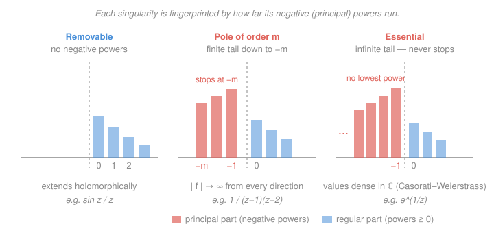

# Complex Analysis · Lesson 5.3: Zeros and singularities

> ⏱ ~15 min · Module 5: Series and singularities · Builds on: [5.2 Laurent series](05-02-laurent-series.md), [5.1 Taylor series: holomorphic = analytic](05-01-taylor-series-analyticity.md) · Unlocks: Module 6 — [6.1 The residue theorem](06-01-residue-theorem.md)

## Why this matters

The residue calculus you're about to unleash in Module 6 — evaluating real integrals that laugh at real methods — is entirely a game of poles. But before you can compute a residue you have to *find* the bad points of a function and *name* their type. The stunning thing is that the Laurent series from [5.2](05-02-laurent-series.md) already contains the whole diagnosis: its principal part is a fingerprint. Count the negative-power terms and you know instantly whether a singularity is a fixable illusion, a clean pole with a residue waiting to be read off, or something genuinely wild. This lesson turns that count into a classification.

## The idea

Zoom in on a function near a point where it misbehaves. Its Laurent expansion there splits into two halves: the ordinary part $\sum_{n\ge 0} a_n(z-z_0)^n$ (the tame Taylor-like piece) and the **principal part** $\sum_{n\ge 1} a_{-n}(z-z_0)^{-n}$ (the negative powers, which blow up as $z\to z_0$). Everything hangs on how much principal part there is:

- **None at all** — no negative powers. The "singularity" was a mirage; the function was secretly holomorphic there and you just wrote it badly. *Removable.*
- **A finite tail** — negative powers down to $(z-z_0)^{-m}$ and no further. A clean, honest blow-up: $|f|\to\infty$ from every direction, at a definite rate. *A pole of order $m$.*
- **An infinite tail** — negative powers forever. No rate, no limit, chaos: near the point the function's values smear out to cover essentially the whole plane. *Essential.*

That's the entire taxonomy. Three cases, decided by one number: how far down the negative powers go. Zeros are the mirror image — instead of counting how deep the blow-up runs, you count how many derivatives vanish before the function finally lifts off zero.

## The formal version

Throughout, $z_0\in\mathbb{C}$ and $f$ is holomorphic on a **punctured disk** $0<|z-z_0|<R$ (an isolated singularity: a bad point with a clean ring of good points around it).

**Zeros and their order.** Let $f$ be holomorphic at $z_0$ with $f(z_0)=0$. We say $z_0$ is a **zero of order (multiplicity) $m$** if
$$f(z)=(z-z_0)^m\,g(z),\qquad g\text{ holomorphic near }z_0,\ g(z_0)\neq 0.$$
Equivalently, in terms of derivatives,
$$f(z_0)=f'(z_0)=\cdots=f^{(m-1)}(z_0)=0,\qquad f^{(m)}(z_0)\neq 0.$$

> In words: $z_0$ is a zero of order $m$ if you can factor out exactly $m$ copies of $(z-z_0)$ and leave behind something nonzero — equivalently, the Taylor series starts at the $(z-z_0)^m$ term.

**Isolated zeros (from [5.1](05-01-taylor-series-analyticity.md)).** If $f$ is holomorphic and not identically zero near $z_0$, its zeros are **isolated**: each sits alone in a small disk containing no other zero.

> In words: nontrivial holomorphic functions can't have zeros piling up on each other — a consequence of the identity theorem. This is what makes "order" well defined and what will make poles isolated too.

**Classification of an isolated singularity** by the Laurent series $f(z)=\sum_{n=-\infty}^{\infty}a_n(z-z_0)^n$ on $0<|z-z_0|<R$:

- **Removable** — the principal part vanishes ($a_n=0$ for all $n<0$). Then $f$ extends to a holomorphic function at $z_0$ (just set $f(z_0)=a_0$).
- **Pole of order $m$** — finitely many negative terms, the lowest being $a_{-m}(z-z_0)^{-m}$ with $a_{-m}\neq 0$ (and $a_n=0$ for $n<-m$). A pole of order $1$ is **simple**.
- **Essential** — infinitely many $a_n$ with $n<0$ are nonzero.

> In words: read down the negative powers. Stop at zero of them → removable; stop at $-m$ → pole of order $m$; never stop → essential.

**Riemann's removable singularity theorem.** If $f$ is holomorphic and **bounded** on $0<|z-z_0|<R$, then $z_0$ is removable.

> In words: if $f$ merely stays finite near a puncture, the puncture wasn't real — you can fill it in and stay holomorphic. Boundedness alone forces every negative coefficient to be $0$.

**Behavior at a pole.** If $z_0$ is a pole (of any order $m\ge 1$), then $|f(z)|\to\infty$ as $z\to z_0$.

> In words: at a pole the function blows up cleanly and unconditionally — approach from any direction and the modulus runs to infinity.

**Casorati–Weierstrass.** If $z_0$ is essential, then for every $r$ with $0<r<R$, the image $f(\{0<|z-z_0|<r\})$ is **dense** in $\mathbb{C}$.

> In words: no matter how tightly you crop around an essential singularity, $f$ still comes arbitrarily close to *every* complex number — the antithesis of a pole's orderly march to $\infty$. (The far deeper **Picard theorem** says $f$ actually *attains* every complex value, with at most one exception, infinitely often — stated here, not proved.)

**Meromorphic functions.** $f$ is **meromorphic** on a domain if it is holomorphic there except for isolated poles (no essential singularities allowed).

> In words: meromorphic = holomorphic apart from a scattering of clean poles. Rational functions, $\tan z$, and $1/\sin z$ are the standard examples — the natural habitat of the residue theorem.

**Order-counting shortcuts.** These follow by factoring out the leading powers:

- If $h$ has a zero of order $k$ at $z_0$, then $1/h$ has a **pole of order $k$** there.
- For a quotient $g/h$ where $g$ has a zero of order $j$ and $h$ a zero of order $k$ at $z_0$: if $k>j$, there's a pole of order $k-j$; if $k=j$, the point is removable; if $k<j$, it's a zero of order $j-k$.

> In words: poles and zeros net against each other. Subtract the numerator's zero-order from the denominator's; a positive result is the pole order, zero cancels to something regular, negative means the numerator won and you have a zero.

## Picture

## Worked examples

**Example 1 (mechanical — classify from the series).** Take $f(z)=\dfrac{\sin z}{z}$ at $z_0=0$. The denominator vanishes, so naively you'd fear a pole. But expand the numerator ($\sin z = z - \frac{z^3}{6}+\frac{z^5}{120}-\cdots$) and divide term by term:
$$\frac{\sin z}{z}=\frac{z-\frac{z^3}{6}+\frac{z^5}{120}-\cdots}{z}=1-\frac{z^2}{6}+\frac{z^4}{120}-\cdots.$$
The principal part is *empty* — no negative powers survive. So $0$ is **removable**: set $f(0)=1$ and $f$ is holomorphic everywhere. (This is also Riemann's theorem in action: $\frac{\sin z}{z}\to 1$ is bounded near $0$, so removability was guaranteed before we computed a thing.) The numerator's own zero at $0$ exactly cancelled the denominator's — order $1$ minus order $1$ equals $0$.

**Example 2 (poles by order-counting).** Consider $f(z)=\dfrac{1}{(z-1)(z-2)}$. The denominator has simple zeros (order $1$) at $z=1$ and $z=2$, and the numerator is a nonzero constant. By the shortcut, each is a **simple pole**. To *see* the Laurent principal part at $z=1$, write $\frac{1}{z-2}=\frac{1}{(z-1)-1}=-\frac{1}{1-(z-1)}=-\big(1+(z-1)+(z-1)^2+\cdots\big)$ near $z=1$, so
$$f(z)=\frac{1}{z-1}\cdot\frac{1}{z-2}=\frac{-1}{z-1}\big(1+(z-1)+\cdots\big)=\frac{-1}{z-1}-1-(z-1)-\cdots.$$
Exactly one negative power, $\dfrac{-1}{z-1}$ — a simple pole, and its coefficient $a_{-1}=-1$ is the *residue* you'll harvest in [6.1](06-01-residue-theorem.md). As $z\to 1$, $|f|\to\infty$ from every direction, the signature of a pole.

**Example 3 (the wild one).** Consider $f(z)=e^{1/z}$ at $z_0=0$. From [5.2](05-02-laurent-series.md), substitute $w=1/z$ into $e^w=\sum_{n\ge 0}\frac{w^n}{n!}$:
$$e^{1/z}=\sum_{n=0}^{\infty}\frac{1}{n!\,z^{n}}=1+\frac{1}{z}+\frac{1}{2z^2}+\frac{1}{6z^3}+\cdots.$$
*Infinitely many* negative powers — an **essential** singularity. Casorati–Weierstrass predicts wild behavior, and here it is bare-handed: along the positive real axis $z\to 0^+$ gives $e^{1/z}\to\infty$; along the negative real axis $z\to 0^-$ gives $e^{1/z}\to 0$; and along the imaginary axis $|e^{1/z}|=1$. No single limit exists — instead the values sweep densely across $\mathbb{C}$ as you shrink the neighborhood. Compare Example 2: a pole would have forced *one* verdict ($\infty$) from all directions.

## Watch out

- You might think a zero of the denominator is automatically a pole, but you must check the numerator first. $\frac{\sin z}{z}$ has a denominator zero at $0$ yet is *removable*, not a pole — the numerator vanished there too and cancelled it. Always net the orders (denominator zero-order minus numerator zero-order); only a positive result is a genuine pole.
- You might think "the limit doesn't exist, so it's a pole," but a pole demands the *specific* failure $|f|\to\infty$ from **every** direction. At an essential singularity the limit also fails to exist — but in the opposite way: values stay bounded along some directions and blow up along others (Example 3). "No limit" splits into two very different diagnoses; the Laurent tail tells them apart.
- You might think classification is about the value $f(z_0)$ or how $f$ looks globally, but it's strictly local: the type is read off the **Laurent expansion about that one point**, on a punctured disk around it. The *same* function can have a pole at one point, an essential singularity at another, and be holomorphic elsewhere — each verdict is independent.

## One-liner

> The principal part of the Laurent series is a fingerprint: no negative powers means removable, a finite negative tail down to $-m$ means a pole of order $m$, and an infinite tail means essential — with poles blowing up cleanly and essential singularities going gloriously insane.

## Problems

**P1 (🟢)** Classify the singularity of $f(z)=\dfrac{e^z-1}{z^2}$ at $z_0=0$. If it's a pole, give its order; if removable, give the value that fills it in.

**P2 (🟡)** Locate and classify *every* singularity of $f(z)=\dfrac{z}{\sin z}$ in the complex plane, giving the order of each pole. (Use order-counting; you needn't compute full Laurent series.)

**P3 (🔴, optional)** Show that $f(z)=\cos\!\big(\tfrac{1}{z}\big)$ has an essential singularity at $0$. Then, exhibiting explicit sequences $z_n\to 0$, produce one along which $f(z_n)\to 1$ and one along which $f(z_n)\to \infty$ — concretely witnessing Casorati–Weierstrass's promise that $f$ refuses to settle.

Solutions

**P1** Expand the numerator: $e^z-1=z+\frac{z^2}{2}+\frac{z^3}{6}+\cdots$, which has a zero of order $1$ at $0$. Divide by $z^2$:
$$\frac{e^z-1}{z^2}=\frac{z+\frac{z^2}{2}+\frac{z^3}{6}+\cdots}{z^2}=\frac{1}{z}+\frac{1}{2}+\frac{z}{6}+\cdots.$$
Exactly one negative power, so $0$ is a **simple pole** (order $1$). Order-counting agrees: denominator zero-order $2$ minus numerator zero-order $1$ equals $1$. (Its residue is the coefficient of $1/z$, namely $1$.)

**P2** The denominator $\sin z$ has zeros exactly at $z=k\pi$, $k\in\mathbb{Z}$, each simple (since $\cos(k\pi)=\pm1\neq 0$, so $(\sin z)'\neq0$ there). The numerator $z$ has a zero of order $1$ only at $z=0$.

- At $z=0$: numerator zero-order $1$, denominator zero-order $1$, net $1-1=0$ → **removable** (indeed $\frac{z}{\sin z}\to 1$).
- At $z=k\pi$ for each $k\neq 0$: numerator is nonzero, denominator zero-order $1$, net pole of order $1$ → a **simple pole**.

So $f$ is meromorphic with simple poles at $z=k\pi$ for every nonzero integer $k$, and no singularity at $0$.

**P3** Substitute $w=1/z$ into $\cos w=\sum_{n\ge0}\frac{(-1)^n w^{2n}}{(2n)!}$:
$$\cos\!\Big(\frac1z\Big)=\sum_{n=0}^{\infty}\frac{(-1)^n}{(2n)!\,z^{2n}}=1-\frac{1}{2z^2}+\frac{1}{24z^4}-\cdots,$$
which has infinitely many negative powers → **essential** at $0$.

*Approaching $1$:* take $z_n=\frac{1}{2\pi n}\to 0$. Then $\frac{1}{z_n}=2\pi n$ and $\cos(2\pi n)=1$ for all $n$, so $f(z_n)=1\to 1$.

*Approaching $\infty$:* take $z_n=\frac{1}{i n}=-\frac{i}{n}\to 0$. Then $\frac1{z_n}=in$ and $\cos(in)=\cosh(n)=\frac{e^n+e^{-n}}{2}\to\infty$, so $|f(z_n)|\to\infty$. Two sequences into the same point $0$, two utterly different destinations — exactly the "no limit, values everywhere" behavior Casorati–Weierstrass guarantees. (A pole could never do this; it would force *both* sequences to $\infty$.)

## Flashback

**From Lesson 5.2 (Laurent series):** Find the Laurent series of $f(z)=\dfrac{1}{z(z-3)}$ valid on the annulus $0<|z|<3$, and read off its principal part at $z=0$. What type of singularity does $f$ have at $0$?

Solution

Partial fractions: $\dfrac{1}{z(z-3)}=\dfrac{1}{3}\left(\dfrac{1}{z-3}-\dfrac{1}{z}\right)$ (from $\frac{1}{z(z-3)}=\frac{A}{z}+\frac{B}{z-3}$ with $A=-\frac13$, $B=\frac13$). On $0<|z|<3$ we have $|z/3|<1$, so expand the regular piece as a geometric series:
$$\frac{1}{z-3}=\frac{-1}{3}\cdot\frac{1}{1-\frac{z}{3}}=-\frac{1}{3}\sum_{n=0}^{\infty}\Big(\frac{z}{3}\Big)^{n}=-\sum_{n=0}^{\infty}\frac{z^{n}}{3^{n+1}}.$$
Therefore
$$f(z)=\frac{1}{3}\left(-\sum_{n=0}^{\infty}\frac{z^{n}}{3^{n+1}}-\frac{1}{z}\right)=-\frac{1}{3z}-\sum_{n=0}^{\infty}\frac{z^{n}}{3^{n+2}}=-\frac{1}{3z}-\frac{1}{9}-\frac{z}{27}-\cdots.$$
The principal part is the single term $-\dfrac{1}{3z}$: one negative power, so $0$ is a **simple pole**, with residue $a_{-1}=-\tfrac13$. (Order-counting confirms it instantly: denominator zero-order $1$ at $z=0$, numerator nonzero.)

## Connections

- **Backward:** this lesson is pure payoff on [5.2](05-02-laurent-series.md) — the principal part you learned to *compute* there is now the thing you *read* to classify. The "zeros are isolated" fact rests on the identity theorem from [5.1](05-01-taylor-series-analyticity.md), and it's what lets poles be isolated and orders be well defined.
- **Forward:** the coefficient $a_{-1}$ of a pole — glimpsed in Examples 2, P1, and the Flashback — is the **residue**, the entire engine of [6.1](06-01-residue-theorem.md) and the real-integral machine of [6.2](06-02-computing-residues-real-integrals.md). Counting zeros and poles by order feeds directly into the argument principle and Rouché's theorem in [6.3](06-03-argument-principle-rouche.md).
- **Sideways:** meromorphic functions are the complex-analytic model of `real-analysis`'s rational functions — poles are where the graph shoots to $\pm\infty$ made rigorous and directional. And the "order of vanishing" you count here is the same bookkeeping that governs multiplicities of roots in algebra and the behavior of transfer functions in signal processing and control theory, where pole locations decide stability.
