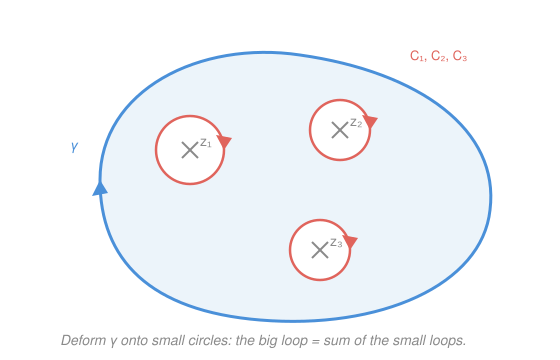

# Complex Analysis · Lesson 6.1: The residue theorem

> ⏱ ~15 min · Module 6: The residue calculus · Builds on: [5.3](05-03-zeros-and-singularities.md), [5.2](05-02-laurent-series.md), [4.2](04-02-cauchy-goursat-theorem.md) · Unlocks: [6.2](06-02-computing-residues-real-integrals.md)

## Why this matters

This is the payoff the whole course has been building toward: a theorem that turns a contour integral — an infinite limit of sums along a curve — into *arithmetic*. You locate the finitely many places where the integrand misbehaves, read one number off each, add them up, multiply by $2\pi i$. Done. In [6.2](06-02-computing-residues-real-integrals.md) this same machine will evaluate real integrals like $\int_{-\infty}^\infty \frac{dx}{x^4+1}$ that no real-variable technique cracks cleanly. But the engine is here, and it is almost embarrassingly simple once you see *why* it works.

## The idea

Go back to the one integral we can compute by hand, from [4.1](04-01-contour-integrals.md): around a loop enclosing $z_0$,

$$\oint_C (z-z_0)^n\,dz = \begin{cases} 2\pi i, & n=-1,\\ 0, & n\neq -1. \end{cases}$$

Every power integrates to **zero around a closed loop — except one**. The single survivor is $(z-z_0)^{-1}$.

Now recall from [5.2](05-02-laurent-series.md) that near an isolated singularity a function *is* a sum of powers, its Laurent series $f(z)=\sum_{n=-\infty}^\infty a_n (z-z_0)^n$. Integrate that sum term by term around a small loop and every term dies — every one but the $a_{-1}(z-z_0)^{-1}$ term, which contributes $a_{-1}\cdot 2\pi i$. So the entire integral collapses to a single coefficient. That coefficient is so important it gets a name: the **residue**. It's the one piece of a function that "leaves a trace" when you loop around a singularity.

And if the loop encloses several singularities? Deform the big loop until it hugs each singularity in a tiny separate circle (legal, because between the singularities $f$ is perfectly holomorphic and [4.2](04-02-cauchy-goursat-theorem.md) lets you slide contours freely). The big integral becomes the sum of the little ones — one residue apiece. Hard integral → sum of numbers.

## The formal version

**Residue.** Let $f$ have an isolated singularity at $z_0$, with Laurent series $f(z)=\sum_{n=-\infty}^{\infty}a_n(z-z_0)^n$ valid on a punctured disk $0<|z-z_0|<R$. The **residue** of $f$ at $z_0$ is

$$\operatorname{Res}(f,z_0)=a_{-1},$$

the coefficient of $(z-z_0)^{-1}$. Equivalently, for a positively-oriented (counterclockwise) circle $C$ around $z_0$ small enough to enclose no other singularity,

$$\operatorname{Res}(f,z_0)=\frac{1}{2\pi i}\oint_{C}f(z)\,dz.$$

> In words: the residue is the single Laurent coefficient $a_{-1}$ — equivalently, the value of the loop integral stripped of its $2\pi i$.

**The residue theorem.** Let $f$ be holomorphic on and inside a positively-oriented simple closed contour $\gamma$, *except* for isolated singularities $z_1,\dots,z_k$ lying strictly inside $\gamma$. Then

$$\oint_\gamma f(z)\,dz = 2\pi i\sum_{j=1}^{k}\operatorname{Res}(f,z_j).$$

> In words: the integral around the whole loop equals $2\pi i$ times the sum of the residues at the singularities the loop encloses — nothing else about $f$ matters.

**Proof.** Around each $z_j$ draw a small positively-oriented circle $C_j$, with radius small enough that the circles are disjoint and all lie inside $\gamma$. On the region $\Omega$ bounded *outside* by $\gamma$ and *inside* by the $C_j$ (a disk with $k$ holes punched out), $f$ is holomorphic — every singularity has been excised. The Cauchy–Goursat theorem in its deformation form ([4.2](04-02-cauchy-goursat-theorem.md)) says the integral over the full boundary of $\Omega$ is zero. Traversing that boundary so $\Omega$ stays on the left means going counterclockwise around $\gamma$ and *clockwise* around each $C_j$, so

$$\oint_\gamma f\,dz - \sum_{j=1}^k \oint_{C_j} f\,dz = 0 \quad\Longrightarrow\quad \oint_\gamma f\,dz = \sum_{j=1}^k \oint_{C_j} f\,dz.$$

But each $C_j$ encloses exactly one singularity, so by the definition above $\oint_{C_j}f\,dz = 2\pi i\operatorname{Res}(f,z_j)$. Summing gives the theorem. $\blacksquare$

**A note on winding.** For a *simple* loop, each enclosed singularity is circled once and counts once — that's the only case we need. If instead $\gamma$ wound around $z_j$ a total of $n$ times (say a triple loop), that singularity's contribution would be multiplied by $n$, the **winding number**. The general statement reads $\oint_\gamma f = 2\pi i\sum_j n(\gamma,z_j)\operatorname{Res}(f,z_j)$; we keep $n=1$ throughout and defer the rest.

## Picture

## Worked examples

**Example 1 (mechanical — the Boss-problem-4 integral, by residues).** Recompute

$$\oint_{|z|=2}\frac{e^z}{z(z-1)}\,dz.$$

The integrand's only singularities are at $z=0$ and $z=1$ (where the denominator vanishes), and both lie inside $|z|=2$. Each is a **simple pole** — the denominator has a simple zero there and the numerator $e^z$ doesn't vanish. For a simple pole we can read $a_{-1}$ straight off the Laurent series without any special formula: near $z=0$,

$$f(z)=\frac{a_{-1}}{z}+a_0+\cdots \;\Longrightarrow\; z\,f(z)=a_{-1}+a_0 z+\cdots \;\Longrightarrow\; \operatorname{Res}(f,0)=\lim_{z\to 0} z\,f(z).$$

So multiply through by the vanishing factor and take the limit:

$$\operatorname{Res}(f,0)=\lim_{z\to0} z\cdot\frac{e^z}{z(z-1)}=\frac{e^0}{0-1}=-1,\qquad \operatorname{Res}(f,1)=\lim_{z\to1}(z-1)\cdot\frac{e^z}{z(z-1)}=\frac{e^1}{1}=e.$$

By the residue theorem,

$$\oint_{|z|=2}\frac{e^z}{z(z-1)}\,dz = 2\pi i\big(\operatorname{Res}(f,0)+\operatorname{Res}(f,1)\big)=2\pi i(e-1).$$

That matches the partial-fractions + Cauchy-integral-formula answer from Boss problem 4 — same number, a fraction of the work. (The systematic residue-at-a-pole formulas get their own treatment in [6.2](06-02-computing-residues-real-integrals.md); here the limit *is* the formula.)

**Example 2 (why you'd care — the residue is not the whole principal part).** Evaluate

$$\oint_{|z|=1}\frac{\sin z}{z^2}\,dz.$$

You might reach for the "$\lim z\,f$" trick, but $\frac{\sin z}{z^2}$ is not a simple pole, so go back to the definition and expand. Using $\sin z = z-\frac{z^3}{6}+\frac{z^5}{120}-\cdots$ (from [5.2](05-02-laurent-series.md)),

$$\frac{\sin z}{z^2}=\frac{1}{z^2}\Big(z-\frac{z^3}{6}+\cdots\Big)=\frac{1}{z}-\frac{z}{6}+\cdots.$$

The coefficient of $z^{-1}$ is $a_{-1}=1$, so $\operatorname{Res}=1$ and the integral is $2\pi i$. Notice the singularity at $0$ is only a *simple* pole even though we divided by $z^2$ — because $\sin z$ contributes a zero on top. The residue is the number sitting on $z^{-1}$ specifically; you get it by reading the series, and no shortcut replaces that when the pole isn't simple. This "expand and read $a_{-1}$" move is the one that will survive to essential singularities, where no pole formula exists at all (P3).

## Watch out

- You might think every singularity inside the picture counts, but only those **strictly inside** $\gamma$ do. A singularity *on* the contour makes the integral undefined (the contour runs through a blow-up); one *outside* contributes nothing. Always check each singularity against the curve before summing.
- You might think orientation is bookkeeping, but a **clockwise** loop flips the sign: $\oint_{-\gamma}f = -2\pi i\sum\operatorname{Res}$. The theorem as stated assumes counterclockwise. If a problem hands you a clockwise contour, negate.
- You might think the residue is the whole principal part of the Laurent series, but it is **only the $a_{-1}$ coefficient**. In Example 2 the principal part was just $\frac1z$, but a double pole like $\frac{1}{z^2}+\frac{3}{z}$ has principal part $\frac{1}{z^2}+\frac{3}{z}$ while $\operatorname{Res}=3$ — the $z^{-2}$ term is real, but it integrates to zero and never counts. Likewise a **removable** singularity has $\operatorname{Res}=0$ (no negative powers at all), whereas an **essential** one generally does not.

## One-liner

> A closed integral is $2\pi i$ times the sum of residues inside — and a residue is just the one Laurent coefficient, $a_{-1}$, that refuses to integrate away.

## Problems

**P1 (🟢)** Evaluate $\displaystyle\oint_{|z|=3}\frac{2z-1}{z^2-z}\,dz$. (Factor the denominator, check both singularities are inside, take simple-pole limits.)

**P2 (🟡)** Let $C$ be the circle $|z-i|=1$ traversed **clockwise**. Evaluate $\displaystyle\oint_{C}\frac{dz}{z^2+1}$. Be explicit about which pole is enclosed and what the orientation does.

**P3 (🔴, optional)** Evaluate $\displaystyle\oint_{|z|=1} e^{1/z}\,dz$. The singularity at $0$ is essential, so no pole formula applies — expand the Laurent series and read off $a_{-1}$. Why does this show a residue can be nonzero at an essential singularity?

Solutions

**P1** Factor: $z^2-z=z(z-1)$, so the singularities are $z=0$ and $z=1$, both with $|z|<3$ — both inside. Both are simple poles (simple zeros of the denominator, numerator nonzero there). Take limits:

$$\operatorname{Res}(f,0)=\lim_{z\to0}z\cdot\frac{2z-1}{z(z-1)}=\frac{-1}{-1}=1,\qquad \operatorname{Res}(f,1)=\lim_{z\to1}(z-1)\cdot\frac{2z-1}{z(z-1)}=\frac{2(1)-1}{1}=1.$$

Sum of residues $=2$, so $\displaystyle\oint_{|z|=3}\frac{2z-1}{z^2-z}\,dz = 2\pi i\cdot 2 = 4\pi i.$

**P2** Factor $z^2+1=(z-i)(z+i)$: poles at $i$ and $-i$. Check against $C=\{|z-i|=1\}$: $|i-i|=0<1$, so $i$ is inside; $|-i-i|=|{-2i}|=2>1$, so $-i$ is **outside** and does not count. Residue at the enclosed simple pole:

$$\operatorname{Res}\!\left(\tfrac{1}{z^2+1},\,i\right)=\lim_{z\to i}(z-i)\cdot\frac{1}{(z-i)(z+i)}=\frac{1}{2i}.$$

Counterclockwise this would give $2\pi i\cdot\frac{1}{2i}=\pi$. But $C$ is **clockwise**, so negate:

$$\oint_C \frac{dz}{z^2+1} = -\pi.$$

**P3** Expand using $e^w=\sum_{n\ge0}\frac{w^n}{n!}$ with $w=1/z$, valid for all $z\neq0$:

$$e^{1/z}=\sum_{n=0}^{\infty}\frac{1}{n!\,z^n}=1+\frac{1}{z}+\frac{1}{2!\,z^2}+\frac{1}{3!\,z^3}+\cdots.$$

The coefficient of $z^{-1}$ is $a_{-1}=1$, so $\operatorname{Res}(e^{1/z},0)=1$ and

$$\oint_{|z|=1}e^{1/z}\,dz = 2\pi i\cdot 1 = 2\pi i.$$

This is exactly the "expand and read $a_{-1}$" move: the singularity is essential (infinitely many negative powers, an infinite principal part), so the pole-limit trick from P1 is meaningless — yet the residue is a perfectly definite number, $1$. It confirms the Watch-out point: a removable singularity forces $\operatorname{Res}=0$, but an essential one generally does not.

## Flashback

**From Lesson 5.2 (Laurent series):** Find the Laurent series of $f(z)=\dfrac{1}{z^2(z-1)}$ on the annulus $0<|z|<1$, state its principal part, and read off $\operatorname{Res}(f,0)$.

Solution

On $0<|z|<1$ we have $|z|<1$, so expand $\frac{1}{z-1}$ as a geometric series in $z$:

$$\frac{1}{z-1}=-\frac{1}{1-z}=-\sum_{n=0}^{\infty}z^n=-(1+z+z^2+\cdots).$$

Multiply by $\frac{1}{z^2}$:

$$f(z)=\frac{1}{z^2}\cdot\big(-(1+z+z^2+\cdots)\big)=-\frac{1}{z^2}-\frac{1}{z}-1-z-z^2-\cdots.$$

The **principal part** is $-\dfrac{1}{z^2}-\dfrac{1}{z}$, and the residue is the coefficient of $z^{-1}$: $\operatorname{Res}(f,0)=a_{-1}=-1$. (Note the $z^{-2}$ term is part of the principal part but *not* the residue — precisely the trap from the third Watch-out bullet.)

## Connections

- **Backward:** the whole theorem rests on two earlier facts — the term-by-term integral $\oint_C(z-z_0)^n\,dz$ from [4.1](04-01-contour-integrals.md) (only $n=-1$ survives) and the contour-deformation freedom of [4.2](04-02-cauchy-goursat-theorem.md) (slide $\gamma$ onto small circles). The classification of [5.3](05-03-zeros-and-singularities.md) tells you which singularities even *have* a Laurent series to read.
- **Forward:** [6.2](06-02-computing-residues-real-integrals.md) supplies fast formulas for $\operatorname{Res}$ at poles (so you rarely expand a full series) and turns the theorem loose on real integrals — trigonometric integrals on $|z|=1$ and improper integrals via semicircular contours. [6.3](06-03-argument-principle-rouche.md) applies it to $f'/f$ to *count* zeros and poles.
- **Sideways:** the residue is the complex-analytic ancestor of the "pick out one coefficient" idea everywhere — reading a Fourier coefficient by integrating against $e^{-in\theta}$ is the same $\oint$-kills-all-but-one mechanism, and in physics the residue at a pole of a propagator or response function encodes the strength of a resonance.
