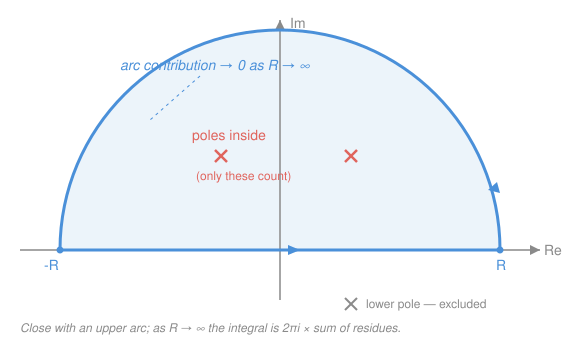

# Complex Analysis · Lesson 6.2: Computing residues and real integrals

> ⏱ ~15 min · Module 6: The residue calculus · Builds on: [6.1 The residue theorem](06-01-residue-theorem.md) · Unlocks: [6.3 The argument principle and Rouché's theorem](06-03-argument-principle-rouche.md)

## Why this matters

Lesson [6.1](06-01-residue-theorem.md) delivered a stunning promise: a contour integral equals $2\pi i$ times a sum of residues. But it left two IOUs. First, "residue = the $a_{-1}$ Laurent coefficient" is a definition, not a method — expanding a Laurent series by hand is miserable. Second, the theorem is about *closed complex contours*, yet the integrals you actually meet in physics and probability are **real** ones over $[0,2\pi]$ or $(-\infty,\infty)$. This lesson pays both IOUs: fast formulas that read off residues from $f$ directly, and two closing tricks that turn a real integral — some of which have *no elementary antiderivative* — into a contour integral you crush by residues.

## The idea

A residue is one number attached to an isolated singularity, and near a pole $f$ is almost a simple algebraic beast: $f(z)\approx \dfrac{a_{-1}}{z-z_0}+(\text{stuff that's finite at }z_0)$. To extract $a_{-1}$ you don't need the whole series — just multiply by $(z-z_0)$ to kill the blow-up and read off what survives. That single move gives every residue formula below; higher-order poles just need you to differentiate away the extra powers first.

The real-integral magic is a change of scenery. A real integral is stuck on the real line, where you have only real-variable tools. But $\int_0^{2\pi}$ is secretly a trip **around the unit circle** (let the angle $\theta$ become the point $e^{i\theta}$), and $\int_{-\infty}^\infty$ is the *bottom edge* of a huge semicircle — close it with an arc, and if the arc contributes nothing, the real integral you wanted equals the contour integral you can do. You trade a hard real problem for a residue count.

## The formal version

Throughout, $z_0$ is an isolated singularity of $f$ and $\operatorname{Res}(f,z_0)=a_{-1}$ is the coefficient of $(z-z_0)^{-1}$ in the Laurent expansion (Lesson [5.3](05-03-zeros-and-singularities.md)).

**Simple pole.** If $z_0$ is a pole of order $1$,
$$\operatorname{Res}(f,z_0)=\lim_{z\to z_0}(z-z_0)\,f(z).$$
> In words: multiply by $(z-z_0)$ to cancel the single blow-up, then just plug in $z_0$.

*Why:* near a simple pole $f(z)=\dfrac{a_{-1}}{z-z_0}+a_0+a_1(z-z_0)+\cdots$, so $(z-z_0)f(z)=a_{-1}+a_0(z-z_0)+\cdots\to a_{-1}$.

**Quotient with a simple pole.** If $f=g/h$ with $g,h$ holomorphic near $z_0$, $g(z_0)\neq0$, and $h$ has a **simple zero** at $z_0$ (so $h(z_0)=0$, $h'(z_0)\neq0$), then
$$\operatorname{Res}(f,z_0)=\frac{g(z_0)}{h'(z_0)}.$$
> In words: for a fraction whose denominator just barely vanishes, the residue is top-over-derivative-of-bottom.

*Proof.* Use the simple-pole formula and the definition of $h'$:
$$\operatorname{Res}(f,z_0)=\lim_{z\to z_0}(z-z_0)\frac{g(z)}{h(z)}=\lim_{z\to z_0}\frac{g(z)}{\dfrac{h(z)-h(z_0)}{z-z_0}}=\frac{g(z_0)}{h'(z_0)},$$
since $h(z_0)=0$ makes $h(z)=h(z)-h(z_0)$, and the denominator's limit is exactly $h'(z_0)\neq0$. $\blacksquare$

**Pole of order $m$.** If $z_0$ is a pole of order $m$,
$$\operatorname{Res}(f,z_0)=\frac{1}{(m-1)!}\lim_{z\to z_0}\frac{d^{\,m-1}}{dz^{\,m-1}}\Big[(z-z_0)^m f(z)\Big].$$
> In words: multiply by $(z-z_0)^m$ to clear the whole pole, differentiate $m-1$ times to slide the $a_{-1}$ term into the constant slot, divide by $(m-1)!$, then plug in.

*Why:* $(z-z_0)^m f(z)=a_{-m}+\cdots+a_{-1}(z-z_0)^{m-1}+a_0(z-z_0)^m+\cdots$ is holomorphic; differentiating $m-1$ times sends the $a_{-1}(z-z_0)^{m-1}$ term to $(m-1)!\,a_{-1}$ and kills everything below it. (For $m=1$ this is the simple-pole formula, with $0!=1$ and zero derivatives.)

## Picture

## Worked examples

**Example 1 (mechanical — one of each formula).**

- *Simple pole.* $f(z)=\dfrac{1}{z^2+4}=\dfrac{1}{(z-2i)(z+2i)}$ at $z_0=2i$. With $g=1$, $h=z^2+4$, $h'=2z$: $\operatorname{Res}=\dfrac{1}{2z}\Big|_{2i}=\dfrac{1}{4i}=-\dfrac{i}{4}$.
- *Order-2 pole.* $f(z)=\dfrac{\cos z}{z^2}$ at $z_0=0$ (order $m=2$). Clear the pole: $(z-0)^2 f=\cos z$; differentiate once: $\dfrac{d}{dz}\cos z=-\sin z$; divide by $(2-1)!=1$ and plug in: $\operatorname{Res}=-\sin 0=0$. (A double pole can still have zero residue — the $a_{-1}$ slot happens to be empty.)

**Example 2 (Application 1 — a trigonometric integral).** Evaluate $\displaystyle I=\int_0^{2\pi}\frac{d\theta}{2+\cos\theta}$. No real substitution tames this cleanly. Set $z=e^{i\theta}$, so as $\theta$ runs $0\to2\pi$, $z$ traverses the unit circle $|z|=1$ once counterclockwise. Then (from Euler's formula, Lesson [1.3](01-03-exponential-log-trig.md))
$$\cos\theta=\frac{z+z^{-1}}{2},\qquad \sin\theta=\frac{z-z^{-1}}{2i},\qquad d\theta=\frac{dz}{iz}.$$
Substitute:
$$2+\cos\theta=2+\frac{z+z^{-1}}{2}=\frac{z^2+4z+1}{2z},\qquad
I=\oint_{|z|=1}\frac{1}{\frac{z^2+4z+1}{2z}}\cdot\frac{dz}{iz}=\frac{2}{i}\oint_{|z|=1}\frac{dz}{z^2+4z+1}.$$
The denominator $z^2+4z+1$ has zeros $z=-2\pm\sqrt3$. Only $z_+=-2+\sqrt3\approx-0.27$ lies **inside** $|z|=1$ ($z_-=-2-\sqrt3\approx-3.73$ is outside, so it doesn't count). It's a simple pole; with $h'=2z+4$,
$$\operatorname{Res}\Big(\tfrac{1}{z^2+4z+1},z_+\Big)=\frac{1}{2z_++4}=\frac{1}{2(-2+\sqrt3)+4}=\frac{1}{2\sqrt3}.$$
By the residue theorem, $I=\dfrac{2}{i}\cdot 2\pi i\cdot\dfrac{1}{2\sqrt3}=\dfrac{2\pi}{\sqrt3}.$ (Positive, as it must be — the integrand is a positive function.)

**Example 3 (Application 2 — an improper integral; this is Boss problem 6).** Evaluate $\displaystyle J=\int_{-\infty}^{\infty}\frac{dx}{x^4+1}$. There's no friendly real antiderivative. Consider $f(z)=\dfrac{1}{z^4+1}$ on the closed contour $\gamma_R$ = the segment $[-R,R]$ on the real axis followed by the upper semicircular arc $C_R$ of radius $R$ (the Picture). For $R>1$ it encloses exactly the poles of $f$ in the **upper** half-plane.

The poles are the fourth roots of $-1=e^{i\pi}$: $z_k=e^{i(\pi+2\pi k)/4}$, i.e. $e^{i\pi/4},\,e^{i3\pi/4},\,e^{i5\pi/4},\,e^{i7\pi/4}$. The upper-half-plane ones are $z_1=e^{i\pi/4}$ and $z_2=e^{i3\pi/4}$. Each is simple; with $g=1$, $h=z^4+1$, $h'=4z^3$, and using $z_k^4=-1\Rightarrow z_k^3=-1/z_k$,
$$\operatorname{Res}(f,z_k)=\frac{1}{4z_k^3}=\frac{z_k}{4z_k^4}=\frac{z_k}{-4}=-\frac{z_k}{4}.$$
So the enclosed residues sum to $-\tfrac14(z_1+z_2)=-\tfrac14\big(\tfrac{\sqrt2}{2}(1+i)+\tfrac{\sqrt2}{2}(-1+i)\big)=-\tfrac14(\sqrt2\,i)=-\dfrac{\sqrt2\,i}{4}$, and the residue theorem gives
$$\oint_{\gamma_R} f\,dz=2\pi i\left(-\frac{\sqrt2\,i}{4}\right)=\frac{\pi\sqrt2}{2}=\frac{\pi}{\sqrt2}.$$
Now split the contour and let $R\to\infty$. **The arc vanishes:** on $C_R$, $|z|=R$ so $|z^4+1|\ge R^4-1$, hence $|f|\le\dfrac{1}{R^4-1}$; the arc has length $\pi R$, so by the ML-inequality (Lesson [4.1](04-01-contour-integrals.md))
$$\left|\int_{C_R}f\,dz\right|\le \pi R\cdot\frac{1}{R^4-1}\xrightarrow{R\to\infty}0.$$
This is the payoff of the degree gap: denominator degree $4\ge$ numerator degree $0$ **plus 2**, so length $\pi R$ times a $O(1/R^2)$ bound (or better) dies. What remains is the real-axis piece, which converges to $J$. Therefore
$$J=\int_{-\infty}^\infty\frac{dx}{x^4+1}=\frac{\pi}{\sqrt2}.$$

**Jordan's lemma (Fourier-type integrals).** For integrals carrying an oscillating factor $e^{iax}$ with $a>0$, the arc dies *even when $f$ decays only like $1/R$* — too slowly for the ML bound above. On the upper arc, $z=Re^{i\theta}$ with $0\le\theta\le\pi$ has $\operatorname{Im}z=R\sin\theta\ge0$, so
$$|e^{iaz}|=e^{-a\,\operatorname{Im}z}=e^{-aR\sin\theta}\le 1,$$
and the factor is *exponentially small* over most of the arc.

> **Jordan's lemma.** If $f(z)\to0$ uniformly on the upper arc as $R\to\infty$ and $a>0$, then $\displaystyle\int_{C_R} f(z)\,e^{iaz}\,dz\to0$.

> In words: an upward-closing oscillation $e^{iaz}$ suppresses the arc for you, so you only need $f\to0$ — not the degree-$+2$ decay.

*Use it:* $\displaystyle\int_{-\infty}^\infty\frac{\cos x}{x^2+1}\,dx$. Attach the oscillation: consider $\dfrac{e^{iz}}{z^2+1}$ ($a=1$). The only upper pole of $\dfrac{1}{(z-i)(z+i)}$ is $z=i$, simple, with residue $\dfrac{e^{iz}}{2z}\big|_{i}=\dfrac{e^{-1}}{2i}$. By Jordan's lemma the arc drops, so
$$\int_{-\infty}^\infty\frac{e^{ix}}{x^2+1}\,dx=2\pi i\cdot\frac{e^{-1}}{2i}=\frac{\pi}{e}.$$
Take real parts: $\displaystyle\int_{-\infty}^\infty\frac{\cos x}{x^2+1}\,dx=\frac{\pi}{e}$ (and the imaginary part gives $\int\frac{\sin x}{x^2+1}\,dx=0$, correctly — the integrand is odd). For the answer to be the genuine integral, the real integral must actually **converge** in the sense of `calc-refresher` / `real-analysis` improper integrals; here $1/(x^2+1)$ decays fast enough, so it does.

## Watch out

- You might think every pole of the function counts. For an upper semicircle, **only poles in the upper half-plane are enclosed** — lower-half poles contribute nothing to that contour. (Sum over the *inside* only.)
- You might think the arc "obviously" vanishes. It does **not** for free — you must justify it every time, either by the degree gap (denominator degree $\ge$ numerator $+2$) or by Jordan's lemma when an $e^{iax}$ is present. Skipping this step is the classic way to get a wrong finite answer for a divergent integral.
- You might think you always close upward. For $e^{iax}$ the choice depends on the sign of $a$: close in the **upper** half-plane when $a>0$ (so $e^{iaz}$ decays), but in the **lower** half-plane when $a<0$ — and then you pick up the lower poles, traversed clockwise (a sign flip). The trig substitution $z=e^{i\theta}$, meanwhile, only works when the integrand is a **rational function of $\cos\theta$ and $\sin\theta$**.

## One-liner

> To residue is to multiply-and-plug-in; to integrate the real line is to close a contour, throw away the arc (after proving it vanishes), and count the poles you trapped.

## Problems

**P1 (🟢)** Compute the residues: (a) of $\dfrac{e^{z}}{z^2+9}$ at $z=3i$; (b) of $\dfrac{e^{z}}{z^3}$ at $z=0$. State the pole's order in each case before you compute.

**P2 (🟡)** Evaluate $\displaystyle\int_0^{2\pi}\frac{d\theta}{5+4\cos\theta}$ by the $z=e^{i\theta}$ substitution. Identify which pole lands inside $|z|=1$.

**P3 (🔴, optional)** Evaluate $\displaystyle\int_{-\infty}^{\infty}\frac{dx}{(x^2+1)^2}$ by closing in the upper half-plane. You'll meet a pole of order $2$ — use the order-$m$ formula — and you must still argue the arc vanishes.

Solutions

**P1** (a) $z=3i$ is a **simple** pole of $\dfrac{e^z}{z^2+9}=\dfrac{e^z}{(z-3i)(z+3i)}$. With $g=e^z$, $h=z^2+9$, $h'=2z$:
$$\operatorname{Res}=\frac{e^z}{2z}\Big|_{3i}=\frac{e^{3i}}{6i}=\frac{\cos3+i\sin3}{6i}=\frac{\sin3-i\cos3}{6}.$$
(b) $z=0$ is a pole of **order $3$** of $\dfrac{e^z}{z^3}$. Clear it: $z^3 f=e^z$; the order-$m$ formula with $m=3$ wants $\dfrac{1}{2!}\dfrac{d^2}{dz^2}e^z\big|_0=\dfrac{1}{2}e^0=\dfrac12$. (Check against the series: $e^z/z^3=\sum z^{n-3}/n!$, and the $z^{-1}$ term is $n=2$, coefficient $1/2!$. ✓)

**P2** Set $z=e^{i\theta}$, so $\cos\theta=\tfrac{z+z^{-1}}{2}$ and $d\theta=\tfrac{dz}{iz}$. Then
$$5+4\cos\theta=5+2(z+z^{-1})=\frac{2z^2+5z+2}{z},\qquad
\int_0^{2\pi}\frac{d\theta}{5+4\cos\theta}=\frac{1}{i}\oint_{|z|=1}\frac{dz}{2z^2+5z+2}.$$
The zeros of $2z^2+5z+2$ are $z=\dfrac{-5\pm3}{4}$, i.e. $z=-\tfrac12$ (inside) and $z=-2$ (outside). Only $z=-\tfrac12$ counts; with $h'=4z+5$,
$$\operatorname{Res}\Big(\tfrac{1}{2z^2+5z+2},-\tfrac12\Big)=\frac{1}{4(-\tfrac12)+5}=\frac13.$$
Thus the integral $=\dfrac1i\cdot2\pi i\cdot\dfrac13=\dfrac{2\pi}{3}$.

**P3** Take $f(z)=\dfrac{1}{(z^2+1)^2}=\dfrac{1}{(z-i)^2(z+i)^2}$ on the upper semicircular contour. The only upper pole is $z=i$, of **order $2$**. Order-$m$ formula with $m=2$:
$$\operatorname{Res}(f,i)=\frac{1}{1!}\frac{d}{dz}\Big[(z-i)^2 f\Big]_{z=i}=\frac{d}{dz}\Big[\frac{1}{(z+i)^2}\Big]_{z=i}=\left[-\frac{2}{(z+i)^3}\right]_{z=i}=-\frac{2}{(2i)^3}=-\frac{2}{-8i}=\frac{1}{4i}=-\frac{i}{4}.$$
So $\oint_{\gamma_R}f\,dz=2\pi i\left(-\tfrac{i}{4}\right)=\dfrac{\pi}{2}$. **Arc:** on $|z|=R$, $|(z^2+1)^2|\ge(R^2-1)^2$, so $|f|\le(R^2-1)^{-2}$ and $\big|\int_{C_R}f\big|\le \pi R\,(R^2-1)^{-2}=O(1/R^3)\to0$ (denominator degree $4\ge0+2$). Hence
$$\int_{-\infty}^{\infty}\frac{dx}{(x^2+1)^2}=\frac{\pi}{2}.$$

## Flashback

**From Lesson 6.1 (The residue theorem):** Evaluate $\displaystyle\oint_{|z|=3}\frac{dz}{z^2(z-1)}$ as $2\pi i\sum\operatorname{Res}$, being explicit about which singularities lie inside the circle and their orders.

Solution

Both singularities lie inside $|z|=3$: $z=0$ (a pole of **order $2$**) and $z=1$ (**simple**). Compute residues.

At $z=1$ (simple): $\operatorname{Res}=\lim_{z\to1}(z-1)\dfrac{1}{z^2(z-1)}=\dfrac{1}{z^2}\Big|_{1}=1.$

At $z=0$ (order $2$): $\operatorname{Res}=\dfrac{1}{1!}\dfrac{d}{dz}\Big[z^2\cdot\dfrac{1}{z^2(z-1)}\Big]_{0}=\dfrac{d}{dz}\Big[\dfrac{1}{z-1}\Big]_0=\left[-\dfrac{1}{(z-1)^2}\right]_0=-1.$

Sum $=1+(-1)=0$, so $\displaystyle\oint_{|z|=3}\frac{dz}{z^2(z-1)}=2\pi i\cdot0=0.$ The residues cancel — a reminder that "poles inside" does not mean "nonzero answer." $\blacksquare$

## Connections

- **Backward:** this lesson operationalizes [6.1](06-01-residue-theorem.md)'s residue theorem (the $2\pi i\sum\operatorname{Res}$ machine) and reuses the pole/order classification from [5.3](05-03-zeros-and-singularities.md) and the ML-inequality from [4.1](04-01-contour-integrals.md).
- **Forward:** the "top-over-derivative-of-bottom" residue $g(z_0)/h'(z_0)$ reappears in [6.3](06-03-argument-principle-rouche.md), where integrating $f'/f$ counts zeros and poles via their residues.
- **Sideways:** the Jordan-lemma evaluation $\int \cos x/(x^2+1)\,dx=\pi/e$ is a **Fourier transform** — exactly the machinery `prob-stat-refresher` uses for characteristic functions and `signals`/physics use for frequency response. The convergence caveat is the `calc-refresher` / `real-analysis` improper-integral test doing quiet guard duty underneath.
