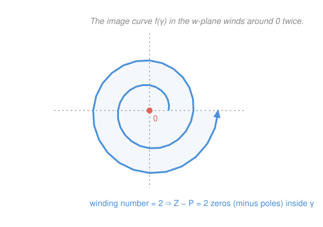

# Complex Analysis · Lesson 6.3: The argument principle and Rouché's theorem

> ⏱ ~15 min · Module 6: The residue calculus · Builds on: [6.1 The residue theorem](06-01-residue-theorem.md), [5.3 Zeros and singularities](05-03-zeros-and-singularities.md) · Unlocks: Module 7 — [7.1 Möbius transformations](07-01-mobius-transformations.md)

## Why this matters

Sometimes you don't want a root — you just want to *count* them. Is a control system stable, i.e. does its characteristic polynomial keep every zero out of the right half-plane? How many resonances of a circuit fall inside a frequency band? Does a small change to a system's parameters break the root count that was keeping it safe? Each of these is a question about how many zeros (or poles) sit inside a region, and the residue theorem answers all of them at once — through a single, beautifully chosen function. The payoff is a machine that turns an integral into an *integer*: the number of things enclosed. And once you have it, the Fundamental Theorem of Algebra falls out cleaner than the Liouville route of [4.4](04-04-consequences-liouville-morera.md), and you can trap all the roots of a polynomial inside a disk without solving for a single one.

## The idea

Here is the trick that makes everything work. Take any meromorphic function $f$ and feed the residue theorem not $f$ itself, but the special combination $f'/f$. Something magical happens: the residues stop being arbitrary numbers and become **counts**.

Why? Near a zero of order $m$, $f$ looks like $(z-z_0)^m$, so $\log f$ looks like $m\log(z-z_0)$, and differentiating gives $f'/f \approx m/(z-z_0)$ — a simple pole whose residue is exactly the multiplicity $m$. Near a pole of order $p$, the same computation gives residue $-p$. So integrating $f'/f$ around a loop and dividing by $2\pi i$ tallies up $(\text{zeros}) - (\text{poles})$ inside, each counted as many times as its order.

There's a second way to *see* the same number, and it's the one worth carrying in your head. Since $f'/f = (\log f)'$, integrating it measures the total change in $\log f$ as $z$ walks around the loop. The modulus $|f|$ comes back to where it started (the loop is closed), so all the change is in the **argument** — how much the output angle $\arg f$ wound around. Divide by $2\pi$ and you get an honest integer: the number of times the image curve $f(\gamma)$ circles the origin. Every enclosed zero drags the image around $0$ once more; every enclosed pole unwinds it once. Counting zeros becomes *watching a curve spin*.

## The formal version

Throughout, $\gamma$ is a positively oriented (counterclockwise) simple closed contour, and "inside" means the region it bounds.

**The argument principle.** Let $f$ be meromorphic on and inside $\gamma$, with no zeros and no poles *on* $\gamma$ itself. Let $Z$ be the number of zeros and $P$ the number of poles inside $\gamma$, **each counted with multiplicity/order**. Then

$$\frac{1}{2\pi i}\oint_\gamma \frac{f'(z)}{f(z)}\,dz \;=\; Z - P.$$

> In words: the integral of $f'/f$ around a loop counts the zeros minus the poles caught inside, weighted by their orders. $f$ must be nonzero and finite on the boundary curve, or the integral isn't even defined.

*Proof.* By the residue theorem [6.1](06-01-residue-theorem.md), the left side equals the sum of the residues of $f'/f$ at its poles inside $\gamma$ — and these sit exactly at the zeros and poles of $f$. Compute each.

*At a zero of order $m$:* write $f(z)=(z-z_0)^m g(z)$ with $g$ holomorphic and $g(z_0)\neq 0$ (the factorization from [5.3](05-03-zeros-and-singularities.md)). Then

$$f'(z)=m(z-z_0)^{m-1}g(z)+(z-z_0)^m g'(z),\qquad\text{so}\qquad \frac{f'(z)}{f(z)}=\frac{m}{z-z_0}+\frac{g'(z)}{g(z)}.$$

Since $g(z_0)\neq 0$, the term $g'/g$ is holomorphic near $z_0$, so $f'/f$ has a **simple pole with residue $+m$**.

*At a pole of order $p$:* write $f(z)=(z-z_0)^{-p}h(z)$ with $h$ holomorphic, $h(z_0)\neq 0$. The identical computation gives

$$\frac{f'(z)}{f(z)}=\frac{-p}{z-z_0}+\frac{h'(z)}{h(z)},$$

a simple pole with residue $-p$. Summing all residues: each zero contributes $+(\text{its order})$ and each pole $-(\text{its order})$, giving $Z-P$. $\blacksquare$

**The geometric reading (winding number).** Because $\dfrac{f'}{f}=\dfrac{d}{dz}\log f(z)$, the integral is the net change of $\log f$ around $\gamma$:

$$\frac{1}{2\pi i}\oint_\gamma \frac{f'}{f}\,dz \;=\; \frac{1}{2\pi i}\,\Delta_\gamma\big(\log f\big)\;=\;\frac{1}{2\pi}\,\Delta_\gamma\big(\arg f\big)\;=\; n\big(f\circ\gamma,\,0\big),$$

the **winding number** of the image curve $f(\gamma)$ about the origin. (The $\log|f|$ part cancels: $|f|$ returns to its start, so $\Delta_\gamma \log|f| = 0$; only the argument accumulates.)

> In words: $Z-P$ also equals the number of times the output curve $f(\gamma)$ loops around $0$. The image winds around the origin once per enclosed zero, and unwinds once per enclosed pole.

**Rouché's theorem.** Let $f$ and $g$ be holomorphic on and inside $\gamma$, with

$$|g(z)| < |f(z)| \qquad\text{for every } z \text{ on } \gamma.$$

Then $f$ and $f+g$ have the **same number of zeros** inside $\gamma$ (counted with multiplicity).

> In words: if $g$ is strictly smaller than $f$ everywhere on the boundary, then adding $g$ can't change how many zeros $f$ has inside. A perturbation you can dominate on the edge can't create or destroy roots in the middle.

*Proof.* First, both functions are zero-free on $\gamma$: $|f|>|g|\ge 0$ forces $f\neq 0$, and $|f+g|\ge |f|-|g|>0$ forces $f+g\neq 0$. So the argument principle applies to both (they're holomorphic, hence $P=0$), and their zero counts are winding numbers. Consider the ratio

$$F(z)=\frac{f(z)+g(z)}{f(z)}=1+\frac{g(z)}{f(z)}.$$

On $\gamma$ we have $\left|\dfrac{g}{f}\right|<1$, so $F(\gamma)$ lies entirely inside the disk $|w-1|<1$ — a disk that does **not** contain or surround the origin. A curve trapped in that disk can't wind around $0$, so $n(F\circ\gamma,0)=0$. But by the argument principle that winding number is $Z_F-P_F$, where the zeros of $F$ are the zeros of $f+g$ and the poles of $F$ are the zeros of $f$. Hence

$$0 = Z_{f+g}-Z_f,\qquad\text{i.e.}\qquad Z_{f+g}=Z_f. \qquad\blacksquare$$

(Intuition to keep: slide along the family $f+tg$ for $t\in[0,1]$. Since $|tg|\le|g|<|f|$ on $\gamma$, no member ever vanishes on the boundary, so the integer zero-count can't jump partway — the dominant term $f$ dictates the winding the whole way.)

## Picture

## Worked examples

**Example 1 (the Fundamental Theorem of Algebra, cleanly).** Let $p(z)=z^n+a_{n-1}z^{n-1}+\cdots+a_1 z+a_0$ be monic of degree $n\ge 1$. Split it as $f(z)=z^n$ and $g(z)=a_{n-1}z^{n-1}+\cdots+a_0$. On a large circle $|z|=R$,

$$|f(z)|=R^n,\qquad |g(z)|\le |a_{n-1}|R^{n-1}+\cdots+|a_0| \;\le\; C\,R^{n-1}\ \ (\text{for } R\ge 1,\ C=\textstyle\sum_k|a_k|).$$

For $R$ large enough ($R>C$), $R^n > C R^{n-1}\ge |g|$, so $|g|<|f|$ on the circle. Rouché says $p=f+g$ has the same number of zeros inside $|z|=R$ as $f(z)=z^n$ — which has exactly $n$ (a zero of order $n$ at the origin). So $p$ has $n$ zeros, counted with multiplicity: **every degree-$n$ polynomial has $n$ roots in $\mathbb{C}$.** No Liouville, no contradiction — just "the leading term dominates far out," which is the honest reason the theorem is true.

**Example 2 (trapping the roots of $z^4+z+1$).** Where do the four roots of $p(z)=z^4+z+1$ live? Rouché brackets them without solving anything.

*Outer wall — all four inside $|z|=\tfrac32$.* Take $f(z)=z^4$, $g(z)=z+1$. On $|z|=\tfrac32$,

$$|f|=\left(\tfrac32\right)^4=\frac{81}{16}=5.06,\qquad |g|=|z+1|\le |z|+1=\tfrac52=2.5.$$

Since $2.5<5.06$, we have $|g|<|f|$ on the whole circle, so $p=f+g$ has the same number of zeros in $|z|<\tfrac32$ as $z^4$ — namely **four**. All roots are caught.

*Inner wall — none inside $|z|=\tfrac12$.* Now regroup: take $f(z)=1$ (the constant), $g(z)=z^4+z$. On $|z|=\tfrac12$,

$$|g|=|z^4+z|\le |z|^4+|z|=\tfrac{1}{16}+\tfrac12=\tfrac{9}{16}=0.5625 \;<\; 1=|f|.$$

So $p=f+g$ has the same number of zeros in $|z|<\tfrac12$ as the constant $1$ — namely **zero**. Combining the two walls: **all four roots of $z^4+z+1$ lie in the annulus $\tfrac12<|z|<\tfrac32$**, found by two inequalities and never a quartic formula.

## Watch out

- You might think you count zeros "one per zero," but the argument principle counts them **with multiplicity**: a double root counts twice, a pole of order $3$ subtracts $3$. If you forget orders, an integral of $6\pi i$ will look like "3 zeros" when it might be one triple zero — the integral can't tell you *how* the count is distributed, only the weighted total.
- You might think Rouché works with $\le$, but the inequality must be **strict** ($|g|<|f|$) at **every** point of $\gamma$, and $f$ must be nonzero on $\gamma$. A single boundary point where $|g|=|f|$ can hide a zero *on* the curve, and then the whole argument-principle setup collapses (the integrand blows up on the contour). Always check the inequality on the entire circle, worst case included.
- You might get a fractional answer for a winding number — that's impossible, so it means you miscounted a boundary crossing or the contour passed through a zero/pole. The count $Z-P$ is an **integer** by construction; a non-integer is a signal that a root sits on $\gamma$ or you mis-tracked how many times the image crossed a ray from $0$.

## One-liner

> Feed the residue theorem $f'/f$ and its residues become a headcount — $\tfrac{1}{2\pi i}\oint f'/f = Z-P$, equal to how many times the image $f(\gamma)$ winds around $0$ — and Rouché adds that a perturbation you dominate on the boundary can't change the tally inside.

## Problems

**P1 (🟢)** Let $f(z)=\dfrac{(z-1)^3}{z^2}$ and let $\gamma$ be the circle $|z|=2$ (counterclockwise). Compute $\displaystyle\frac{1}{2\pi i}\oint_\gamma \frac{f'(z)}{f(z)}\,dz$ directly from the argument principle, and state the value of $\oint_\gamma \frac{f'}{f}\,dz$ itself.

**P2 (🟡)** How many zeros does $p(z)=z^4-6z+3$ have in the annulus $1<|z|<2$? (Use Rouché twice — once on each bounding circle — and subtract. Watch the inequalities carefully.)

**P3 (🔴, optional)** Prove the **Cauchy root bound**: every zero of a monic polynomial $p(z)=z^n+a_{n-1}z^{n-1}+\cdots+a_0$ lies in the disk $|z|<1+M$, where $M=\max_{0\le k\le n-1}|a_k|$. (Hint: dominate the lower-order terms by a geometric series on $|z|=R$, and find how large $R$ must be for Rouché to give all $n$ zeros inside.)

Solutions

**P1** The argument principle gives $Z-P$ with orders counted, for zeros/poles inside $|z|=2$. The only zero is $z=1$ (order $3$), which lies inside, so $Z=3$. The only pole is $z=0$ (order $2$), also inside, so $P=2$. Hence

$$\frac{1}{2\pi i}\oint_\gamma \frac{f'}{f}\,dz = Z-P = 3-2 = 1,\qquad\text{so}\qquad \oint_\gamma \frac{f'}{f}\,dz = 2\pi i.$$

(Sanity check via the geometric reading: as $z$ traverses $|z|=2$ once, the image $f(\gamma)$ winds around $0$ a net **once** — the three loops from the triple zero minus the two unwindings from the double pole.)

**P2** Two Rouché applications.

*On $|z|=2$:* take $f(z)=z^4$, $g(z)=-6z+3$. Then $|f|=2^4=16$ and $|g|\le 6\cdot 2+3=15<16$. So $p$ has the same number of zeros in $|z|<2$ as $z^4$: **4 zeros** in $|z|<2$.

*On $|z|=1$:* the term $-6z$ is now the big one. Take $f(z)=-6z$, $g(z)=z^4+3$. Then $|f|=6$ and $|g|\le |z|^4+3=1+3=4<6$. So $p$ has the same number of zeros in $|z|<1$ as $-6z$: **1 zero** in $|z|<1$.

Subtracting the two disks: the annulus $1<|z|<2$ contains $4-1=\boxed{3}$ zeros. (Both inequalities are strict on their circles, and one can check $p$ has no zero exactly on $|z|=1$ or $|z|=2$, so the brackets are clean.)

**P3** On the circle $|z|=R$ with $R>1$, split $p=f+g$ with $f(z)=z^n$ and $g(z)=a_{n-1}z^{n-1}+\cdots+a_0$. Bound $g$ using $|a_k|\le M$ and a geometric sum:

$$|g(z)|\le M\big(R^{n-1}+R^{n-2}+\cdots+1\big)=M\cdot\frac{R^n-1}{R-1} < M\cdot\frac{R^n}{R-1}.$$

We want $|g|<|f|=R^n$, and it suffices that $\dfrac{M}{R-1}\le 1$, i.e. $R\ge 1+M$. So for any $R>1+M$ we have $|g|<|f|$ on $|z|=R$, and Rouché gives that $p$ has the same number of zeros in $|z|<R$ as $z^n$ — namely all $n$ of them. Since this holds for every $R$ just above $1+M$, **every** root satisfies $|z|<1+M$. (This is exactly the flavor of Example 1, made quantitative: the leading term wins as soon as the radius clears $1+M$.)

## Flashback

**From Lesson 5.3 (Zeros and singularities):** Classify the singularity of $f(z)=\dfrac{1-\cos z}{z^4}$ at $z_0=0$. If it is a pole, give its order and its residue.

Solution

Expand the numerator from its Taylor series: $\cos z = 1-\dfrac{z^2}{2}+\dfrac{z^4}{24}-\cdots$, so

$$1-\cos z = \frac{z^2}{2}-\frac{z^4}{24}+\frac{z^6}{720}-\cdots,$$

a zero of order $2$ at $0$. Divide by $z^4$:

$$f(z)=\frac{1-\cos z}{z^4}=\frac{1}{2z^2}-\frac{1}{24}+\frac{z^2}{720}-\cdots.$$

The principal part is the single term $\dfrac{1}{2z^2}$ — the lowest power is $z^{-2}$ and it stops there — so $0$ is a **pole of order $2$**. (Order-counting confirms it: denominator zero-order $4$ minus numerator zero-order $2$ equals $2$.) The residue is the coefficient of $z^{-1}$, which is **$0$**: only even powers of $z$ appear, so there is no $1/z$ term. A pole with residue zero is perfectly ordinary — order and residue are independent facts.

## Connections

- **Backward:** this lesson is the residue theorem of [6.1](06-01-residue-theorem.md) aimed at one special integrand, $f'/f$, and it lives entirely on the zero/pole orders you learned to read off the Laurent series in [5.3](05-03-zeros-and-singularities.md) — "order $m$" and "order $p$" become the literal residues $+m$ and $-p$.
- **Forward:** counting-by-winding is the seed of the topology in Module 7. [7.1](07-01-mobius-transformations.md) studies maps that send circles and lines to circles and lines, and the winding-number viewpoint here is what makes "this map takes the unit circle around the origin once" a precise, checkable statement.
- **Sideways:** the "roots staying in a region under perturbation" idea is exactly stability analysis in signal processing and control theory and control theory — the Nyquist stability criterion *is* the argument principle applied to a transfer function, counting right-half-plane poles by watching a curve wind around a point. And the Cauchy root bound (P3) is the complex-analytic cousin of the coefficient bounds used in numerical root-finding.
