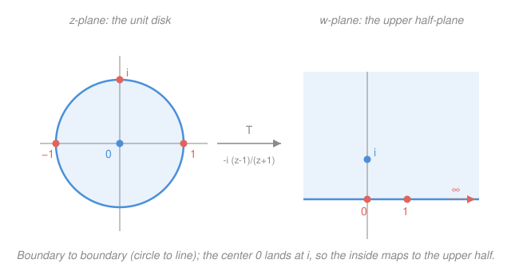

# Complex Analysis · Lesson 7.1: Möbius transformations

> ⏱ ~15 min · Module 7: Conformal mapping · Builds on: [2.3 Harmonic functions and conformality](02-03-harmonic-functions-conformality.md), [1.2 Functions, limits, and continuity](01-02-functions-limits-continuity.md) · Unlocks: [7.2 Conformal maps and the Riemann mapping theorem](07-02-conformal-maps-riemann.md)

## Why this matters

You now know that holomorphic maps preserve angles ([2.3](02-03-harmonic-functions-conformality.md)) — so the way to solve a hard-shaped physics problem is to *bend* its region into an easy one with a conformal map and carry the answer back. But which maps? You need a supply of them, flexible enough to reshape a disk into a half-plane and concrete enough to write down. The **Möbius transformations** — ratios of linear functions — are the workhorses: the simplest non-trivial conformal maps, yet so pliable that naming where just *three* points go pins the entire map, and they turn every circle-or-line into another circle-or-line. This is the toolkit [7.2](07-02-conformal-maps-riemann.md) will point at the Dirichlet problem.

## The idea

Take the humblest thing past a straight line: a ratio of two linear expressions,
$$w = \frac{az+b}{cz+d}.$$
That single formula is astonishingly capable, and three features make it so.

**It lives on the sphere, not the plane.** The denominator vanishes at $z=-d/c$, so the map sends that point to $\infty$ — and it sends $\infty$ back to $a/c$. Rather than a defect, this is the whole trick: on the Riemann sphere $\hat{\mathbb{C}}=\mathbb{C}\cup\{\infty\}$ from [1.2](01-02-functions-limits-continuity.md), $\infty$ is an ordinary point, and a Möbius map is a genuine bijection of the sphere onto itself, no exceptions.

**It's built from three moves you already trust.** Every Möbius map is a composition of *translations* ($z\mapsto z+b$), *rotate-and-scalings* ($z\mapsto az$), and the one new ingredient, *inversion* ($z\mapsto 1/z$). Each of those is holomorphic with nonzero derivative — hence conformal by [2.3](02-03-harmonic-functions-conformality.md) — so their composition is conformal too. Möbius maps preserve angles for free.

**It respects "circles-and-lines" as one family.** On the sphere a straight line is just a circle that happens to pass through $\infty$. Möbius maps shuffle this combined family — call the members **circlines** — onto itself: circles and lines go to circles or lines, possibly trading types. That's why you can straighten a circular boundary into a flat one.

Put the last two together and you get the punchline: **three points determine the map.** A circline is fixed by three of its points, angles are preserved, and there is exactly one Möbius map taking any three points where you please — so you *design* the map you need by choosing three targets.

## The formal version

**Definition (Möbius / fractional linear transformation).** For constants $a,b,c,d\in\mathbb{C}$ with $ad-bc\neq0$,
$$w=T(z)=\frac{az+b}{cz+d},$$
extended to the sphere $\hat{\mathbb{C}}$ by $T(-d/c)=\infty$ and $T(\infty)=a/c$ (and $T(\infty)=\infty$ if $c=0$).

> In words: a ratio of two linear functions, read as a self-map of the sphere so that "hitting $\infty$" and "coming from $\infty$" are legal, ordinary values.

The condition $ad-bc\neq0$ is not decoration. If $ad=bc$ the numerator is a constant multiple of the denominator, $T$ collapses to a constant, and it's no map at all. Call $ad-bc$ the **determinant** — the name is about to earn itself.

**Proposition (bijection, with Möbius inverse).** $T$ is a bijection of $\hat{\mathbb{C}}$; its inverse is again Möbius,
$$T^{-1}(w)=\frac{dw-b}{-cw+a},$$
with the same determinant $ad-bc\neq0$.

> In words: solving $w=(az+b)/(cz+d)$ for $z$ just swaps the diagonal entries and flips the sign of the off-diagonal ones — and the result is another map of the same kind.

*Proof.* Solve for $z$: $w(cz+d)=az+b\Rightarrow z(wc-a)=b-dw\Rightarrow z=\dfrac{-dw+b}{cw-a}=\dfrac{dw-b}{-cw+a}$. This formula is Möbius (its determinant is $da-bc\neq0$) and undoes $T$, so $T$ is invertible, hence a bijection. $\blacksquare$

**Building blocks.** Every Möbius map is a composition of translations $z\mapsto z+\beta$, rotate-and-scalings $z\mapsto \alpha z$ ($\alpha\neq0$), and the inversion $z\mapsto 1/z$.

*Proof (the $c\neq0$ case).* Divide out:
$$\frac{az+b}{cz+d}=\frac{a}{c}+\frac{b-\frac{ad}{c}}{cz+d}=\frac{a}{c}-\frac{ad-bc}{c}\cdot\frac{1}{cz+d}.$$
Reading right to left, $z$ is put through: $z\mapsto cz+d$ (scale then translate) $\mapsto \tfrac{1}{cz+d}$ (invert) $\mapsto -\tfrac{ad-bc}{c}\cdot(\cdot)$ (scale) $\mapsto \tfrac{a}{c}+(\cdot)$ (translate). If $c=0$ the map is just $z\mapsto (a/d)z+(b/d)$, a scale-and-translate. $\blacksquare$

Each block is holomorphic with nonzero derivative on the sphere, so:

**Corollary.** Every Möbius map is conformal at every point of $\hat{\mathbb{C}}$.

**Group structure (why they compose so cleanly).** Attach to $T(z)=\frac{az+b}{cz+d}$ the matrix $\begin{pmatrix}a&b\\c&d\end{pmatrix}$. Composing two Möbius maps corresponds to **multiplying** their matrices, and the identity map is the identity matrix.

> In words: Möbius maps are secretly $2\times2$ matrices in disguise, and "do one map then another" is just matrix multiplication — that's why inverses and compositions come out Möbius every time.

*Proof.* Let $T_1=\frac{a_1z+b_1}{c_1z+d_1}$, $T_2=\frac{a_2w+b_2}{c_2w+d_2}$. Substituting $w=T_1(z)$ and clearing the inner fraction gives numerator and denominator whose coefficients are exactly the entries of $\begin{pmatrix}a_2&b_2\\c_2&d_2\end{pmatrix}\begin{pmatrix}a_1&b_1\\c_1&d_1\end{pmatrix}$. $\blacksquare$

The determinant of the product is the product of determinants — all nonzero — so the composite is again a legitimate Möbius map. Scaling all four coefficients by the same nonzero $\lambda$ leaves $T$ unchanged, so the matrix is defined only up to a scalar; normalizing $ad-bc=1$ makes these the group $\mathrm{SL}_2(\mathbb{C})/\{\pm I\}$, but you don't need that name to use the multiplication.

**Theorem (circlines are preserved).** A Möbius map sends every circline (circle or straight line) to a circline.

*Proof.* Any circline is the solution set of
$$A\,z\bar z+\bar\beta\,z+\beta\,\bar z+D=0,\qquad A,D\in\mathbb{R},\ \beta\in\mathbb{C},$$
a circle when $A\neq0$ and a line when $A=0$ (the equation is real, being $A|z|^2+2\,\mathrm{Re}(\beta\bar z)+D$). Translations and rotate-and-scalings map circles to circles and lines to lines outright, so only **inversion** needs checking. Put $z=1/w$ and multiply through by $w\bar w$:
$$A+\bar\beta\,\bar w+\beta\,w+D\,w\bar w=0,\quad\text{i.e.}\quad D\,w\bar w+\beta\,w+\bar\beta\,\bar w+A=0.$$
Same shape, with $A$ and $D$ swapped — a circline. (Note the swap: a circle through the origin, $D=0$, becomes a line, $A$-coefficient $0$ — exactly a circle turning into a "circle through $\infty$.") Since every Möbius map is a composition of these blocks, it preserves circlines. $\blacksquare$

> In words: only inversion is in doubt, and the algebra shows $1/z$ turns the general circle-or-line equation into another one of the same form — so no Möbius map can ever bend a circline into anything else.

**Cross-ratio and the three-point theorem.** Define the **cross-ratio** of four distinct points
$$(z,z_1,z_2,z_3)=\frac{(z-z_1)(z_2-z_3)}{(z-z_3)(z_2-z_1)}.$$
As a function of $z$, this is *the* Möbius map sending $z_1\mapsto0,\ z_2\mapsto1,\ z_3\mapsto\infty$.

**Theorem.** The cross-ratio is invariant under every Möbius map $M$: $(Mz,Mz_1,Mz_2,Mz_3)=(z,z_1,z_2,z_3)$. Consequently there is a **unique** Möbius map sending any three distinct points $z_1,z_2,z_3$ to any three distinct $w_1,w_2,w_3$, found by solving
$$(w,w_1,w_2,w_3)=(z,z_1,z_2,z_3).$$

*Proof.* Let $S(z)=(z,z_1,z_2,z_3)$, the map sending $z_1,z_2,z_3\mapsto0,1,\infty$. Given Möbius $M$, the composite $S\circ M^{-1}$ sends $Mz_1,Mz_2,Mz_3\mapsto0,1,\infty$, so it *is* the cross-ratio map $w\mapsto(w,Mz_1,Mz_2,Mz_3)$; evaluating at $w=Mz$ gives invariance. For the construction, uniqueness follows because a Möbius map fixing $0,1,\infty$ must be the identity: $T(z)=z$ clears to $cz^2+(d-a)z-b=0$, a polynomial with more than two roots only if all coefficients vanish, forcing $c=b=0,\ a=d$. So no two Möbius maps can agree on three points without being equal. $\blacksquare$

> In words: the cross-ratio is the one number four points carry that every Möbius map leaves alone — so to build the map you want, write "new cross-ratio = old cross-ratio" and solve for $w$.

## Picture

## Worked examples

**Example 1 (mechanical — read off the sphere-data and invert).** Take $T(z)=\dfrac{z+2}{z-1}$. Determinant $=(1)(-1)-(2)(1)=-3\neq0$, so it's legitimate. The special values: the denominator dies at $z=1$, so $T(1)=\infty$; and $T(\infty)=a/c=1/1=1$. The inverse swaps the diagonal and flips signs off it:
$$T^{-1}(w)=\frac{-w-2}{-w+1}\cdot\frac{1}{1}=\frac{dw-b}{-cw+a}=\frac{(-1)w-2}{-(1)w+1}=\frac{w+2}{w-1},$$
which here equals $T$ itself — $T$ is an involution. As a sanity check, $T(0)=\frac{2}{-1}=-2$ and $T(-2)=\frac{0}{-3}=0$: the pair $(0,-2)$ is swapped, consistent with $T\circ T=\text{id}$.

**Example 2 (the payoff — Boss problem 7, part 1: disk $\to$ half-plane).** Build the Möbius map sending $1,i,-1\mapsto0,1,\infty$ and see what it does to the unit disk.

Write "target cross-ratio = source cross-ratio," with $(w_1,w_2,w_3)=(0,1,\infty)$. Because $w_3=\infty$, the two factors involving it, $\frac{w_2-w_3}{w-w_3}=\frac{1-\infty}{w-\infty}$, cancel to $1$, so the left side collapses to $(w,0,1,\infty)=w$. The right side is a plain plug-in:
$$w=(z,1,i,-1)=\frac{(z-1)(i-(-1))}{(z-(-1))(i-1)}=\frac{(z-1)(i+1)}{(z+1)(i-1)}.$$
Simplify the constant $\dfrac{i+1}{i-1}$ (multiply top and bottom by $\overline{i-1}=-1-i$): numerator $(i+1)(-1-i)=-(i+1)^2=-(2i)=-2i$, denominator $(i-1)(-1-i)=2$, giving $-i$. Hence
$$\boxed{\,T(z)=-i\,\frac{z-1}{z+1}\,}.$$
Verify the three: $T(1)=-i\cdot0=0$ ✓, $T(-1)=-i\cdot\frac{-2}{0}=\infty$ ✓, and $T(i)=-i\cdot\frac{i-1}{i+1}=-i\cdot i=1$ ✓ (since $\frac{i-1}{i+1}=i$).

Now the geometry. The three source points $1,i,-1$ lie on the **unit circle**, and their images $0,1,\infty$ all lie on the **real axis** (a line = circline through $\infty$). By circline preservation the unit circle maps *onto* the real axis. That leaves only the question of *which side* the inside goes to — and, per the warning below, you must test an interior point rather than assume. Take the center $z=0$:
$$T(0)=-i\cdot\frac{-1}{1}=i,$$
which sits in the **upper** half-plane $\{\operatorname{Im}w>0\}$. So the interior of the unit disk maps to the upper half-plane. One Möbius map has straightened a circular boundary into a straight one — precisely the reshaping [7.2](07-02-conformal-maps-riemann.md) needs to solve a Dirichlet problem. (See Boss problem 7 in [the syllabus](../syllabus.md).)

## Watch out

- You might think any $\frac{az+b}{cz+d}$ is a Möbius map, but you **need $ad-bc\neq0$**. If $ad=bc$ the numerator is a scalar multiple of the denominator and $T$ is a *constant* — every $z$ maps to one point, no bijection, no conformality. Check the determinant first.
- You might think a Möbius map carries the *inside* of a circle to the inside of its image, but it **need not**. It might send the interior to the exterior, or (as in Example 2) to one side of a line. The map only guarantees boundary-to-boundary; **always test one interior point** to see which region is which.
- You might think "circline" is loose talk, but a line genuinely *is* a circle — one passing through $\infty$ on the sphere. That's why a circle through the origin can become a straight line under inversion: it's the same object, re-seated so its $\infty$-point moves. "Circles OR lines" is one family, not two.
- You might think $\infty$ is a special or forbidden value, but on $\hat{\mathbb{C}}$ it is an **ordinary point** the map acts on like any other. "$T(-d/c)=\infty$" and "$T(\infty)=a/c$" are honest equalities, not shorthand for a blow-up.

## One-liner

> A Möbius map $\frac{az+b}{cz+d}$ is a conformal bijection of the Riemann sphere built from shifts, rotate-scalings, and $1/z$; it turns circles-and-lines into circles-and-lines, and you pin it down completely by naming where three points go.

## Problems

**P1 (🟢)** For $T(z)=\dfrac{2z-1}{z+3}$: confirm it is a genuine Möbius map, find $T(\infty)$ and the point sent to $\infty$, and write $T^{-1}(w)$.

**P2 (🟡)** Find the Möbius map sending $0,1,\infty\mapsto -1,i,1$. Then determine the image of the real axis under it, and say (with a test point) which side the upper half-plane $\{\operatorname{Im}z>0\}$ goes to.

**P3 (🔴, optional)** Using the map $T(z)=-i\dfrac{z-1}{z+1}$ from Example 2 (unit disk $\to$ upper half-plane), find the images of the two diameters of the unit disk lying along the real and imaginary axes. Identify each image circline and explain, from conformality, why the two images meet at the same angle the two diameters did.

Solutions

**P1** Determinant $=(2)(3)-(-1)(1)=6+1=7\neq0$ ✓, so it is Möbius. $T(\infty)=a/c=2/1=2$. The denominator $z+3$ vanishes at $z=-3$, so $T(-3)=\infty$. Inverse (swap diagonal, negate off-diagonal):
$$T^{-1}(w)=\frac{dw-b}{-cw+a}=\frac{3w+1}{-w+2}.$$
Check: $T^{-1}(2)=\frac{7}{0}=\infty$ (undoes $T(\infty)=2$) ✓ and $T^{-1}(\infty)=\frac{3}{-1}=-3$ (undoes $T(-3)=\infty$) ✓.

**P2** Set $(w,-1,i,1)=(z,0,1,\infty)$. The right side has $z_3=\infty$, so it collapses to $(z,0,1,\infty)=z$. The left side, with all points finite:
$$z=(w,-1,i,1)=\frac{(w-(-1))(i-1)}{(w-1)(i-(-1))}=\frac{(w+1)(i-1)}{(w-1)(i+1)}.$$
Solve for $w$. Let $k=\dfrac{i+1}{i-1}=-i$ (computed in Example 2), so $z=\dfrac{1}{k}\cdot\dfrac{w+1}{w-1}=\dfrac{w+1}{k(w-1)}$, giving $kz(w-1)=w+1$, i.e. $w(kz-1)=kz+1$, so
$$w=T^{-1}\!\text{-style solve}=\frac{kz+1}{kz-1}=\frac{-iz+1}{-iz-1}=\frac{iz-1}{iz+1}$$
(multiplying top and bottom by $-1$). Call this $S(z)=\dfrac{iz-1}{iz+1}$. Check the three: $S(0)=\frac{-1}{1}=-1$ ✓, $S(\infty)=\frac{i}{i}=1$ ✓, $S(1)=\frac{i-1}{i+1}=i$ ✓.

Image of the real axis: the three source points $0,1,\infty$ all lie on the real axis, and their images $-1,i,1$ — where $-1,1$ are on the unit circle and $i$ is too — determine a circline through $-1,i,1$, which is the **unit circle** $|w|=1$. So $S$ maps the real axis onto the unit circle. Which side is the upper half-plane? Test $z=i$ (in $\{\operatorname{Im}z>0\}$): $S(i)=\frac{i\cdot i-1}{i\cdot i+1}=\frac{-1-1}{-1+1}=\frac{-2}{0}=\infty$. That lands *outside* the unit disk, so the upper half-plane maps to the **exterior** $|w|>1$. (A clean illustration of the "test an interior point — it may go outside" warning.)

**P3** $T(z)=-i\frac{z-1}{z+1}$, disk $\to$ upper half-plane, boundary circle $\to$ real axis.

*Real diameter* (segment of the real axis, $-1\le z\le1$): it lies on the real-axis circline, which passes through the boundary points $z=1\mapsto0$ and $z=-1\mapsto\infty$. Since $-1\mapsto\infty$ is on it, the image is a **straight line** through $T(1)=0$; find one more image, $T(0)=i$, so the line runs through $0$ and $i$ — the **imaginary axis** in the $w$-plane. (The diameter's interior, $-1<z<1$, maps to the upper part $\{it:t>0\}$, since $T(0)=i$.)

*Imaginary diameter* ($z=it$, $-1\le t\le1$): its endpoints are $z=i\mapsto1$ and $z=-i\mapsto T(-i)=-i\frac{-i-1}{-i+1}=-i\cdot(i)=1$… recompute: $\frac{-i-1}{-i+1}=\frac{-(i+1)}{1-i}$; multiply by $\frac{1+i}{1+i}$: numerator $-(i+1)(1+i)=-(i+i^2+1+i)=-(2i)= -2i$, denominator $(1-i)(1+i)=2$, so the ratio is $-i$, and $T(-i)=-i\cdot(-i)=i^2=-1$. So $i\mapsto1$ and $-i\mapsto-1$: the image circline passes through $1$ and $-1$ on the real axis, and through the interior image $T(0)=i$. Three points $1,-1,i$ determine the **unit circle** $|w|=1$; the diameter's interior (a bounded arc through $T(0)=i$) is the **upper unit semicircle**.

*The angle.* In the disk the two diameters cross at the center $z=0$ at a right angle. Since $T'(0)\neq0$ ($T$ is conformal everywhere on the sphere), angles are preserved, so the images must also meet at $90^\circ$ at $T(0)=i$. Indeed the imaginary axis (image of the real diameter) meets the unit circle $|w|=1$ (image of the imaginary diameter) at $w=i$ exactly perpendicularly — the vertical line is orthogonal to the circle at its top. Conformality delivered the right angle without any further computation.

## Flashback

**From Lesson 2.3 (Harmonic functions and conformality):** Show $u(x,y)=y^3-3x^2y$ is harmonic, find a harmonic conjugate $v$, and identify the resulting holomorphic $f=u+iv$ as a familiar function of $z$.

Solution

Harmonic check: $u_x=-6xy,\ u_{xx}=-6y$; $u_y=3y^2-3x^2,\ u_{yy}=6y$. Sum $u_{xx}+u_{yy}=0$ ✓.

Integrate the Cauchy–Riemann equations for $v$. From $v_y=u_x=-6xy$, integrate in $y$ (holding $x$ fixed):
$$v=-3xy^2+g(x).$$
Pin $g$ with the other equation $v_x=-u_y$. Here $-u_y=-(3y^2-3x^2)=-3y^2+3x^2$, while $v_x=-3y^2+g'(x)$. Matching forces $g'(x)=3x^2$, so $g(x)=x^3+C$. Hence
$$v=x^3-3xy^2+C.$$
Assemble $f=u+iv=(y^3-3x^2y)+i(x^3-3xy^2)+iC$. Recognize the pattern: $iz^3=i(x+iy)^3=i\big[(x^3-3xy^2)+i(3x^2y-y^3)\big]=(y^3-3x^2y)+i(x^3-3xy^2)$. So
$$f(z)=iz^3+iC,$$
the conjugate reconstructing $iz^3$ up to the promised additive constant. (As a bonus for this module: $f'(z)=3iz^2$ vanishes only at $z=0$, so $f$ is conformal everywhere except the origin.)

## Connections

- **Backward:** the "conformal because holomorphic with $f'\neq0$" engine is straight from [2.3](02-03-harmonic-functions-conformality.md), applied to the three building blocks; the sphere $\hat{\mathbb{C}}$ that lets $\infty$ be an ordinary point — and lets a line be a circle — was set up in [1.2](01-02-functions-limits-continuity.md). Multiplication-as-rotation-and-scaling (why $z\mapsto\alpha z$ is conformal) traces back to Lesson 1.1.
- **Forward:** [7.2](07-02-conformal-maps-riemann.md) uses exactly the disk-to-half-plane map built here to *transport* a harmonic function onto an easy region and solve the **Dirichlet problem** (steady-state temperature) — the Riemann mapping theorem promises such a conformal map always exists, and Möbius maps are the ones you can write by hand.
- **Sideways:** the matrix picture makes Möbius maps a first, concrete encounter with a **Lie group** ($\mathrm{SL}_2(\mathbb{C})$ up to sign) — the same group-of-symmetries idea that organizes rotations in classical mechanics and Lorentz transformations in special relativity, where fractional-linear maps of the sphere reappear as the action on the "celestial sphere" of directions.
