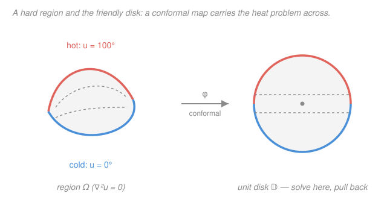

# Complex Analysis · Lesson 7.2: Conformal maps and the Riemann mapping theorem

> ⏱ ~15 min · Module 7: Conformal mapping · Builds on: [7.1 Möbius transformations](07-01-mobius-transformations.md), [2.3 Harmonic functions and conformality](02-03-harmonic-functions-conformality.md) · Unlocks: potential theory & PDE, `topology`, physics (`quantum-mechanics`, fluid flow, `relativity`)

## Why this matters

This is the course's last lesson, and it is where holomorphy finally cashes out as **geometry you can steer**. Here is the whole trick in one breath: a genuinely hard physics problem — the steady-state temperature inside some awkwardly shaped plate — becomes trivial the moment you bend the plate into a disk. And you're *allowed* to bend it, because a holomorphic map preserves the two things the problem depends on: **angles** (Lesson 2.3) and **harmonicity** (Laplace's equation). Solve the easy version on the disk, carry the answer back through the same map, and you have solved the hard one. Complex analysis has spent six modules building rigidity; this lesson spends it, in physics.

## The idea

A holomorphic map with nonzero derivative is, up close, a rotate-and-scale ([2.3](02-03-harmonic-functions-conformality.md)) — it never tears, never folds, never creases an angle. So it is the perfect **change of coordinates** for any problem that only cares about angles and equilibrium.

Two regions are "the same" for such problems if some holomorphic bijection carries one onto the other. The astonishing fact — the **Riemann mapping theorem** — is that *almost every* simply connected region (no holes) is, in this sense, the same as the unit disk. A wedge, a strip, a half-plane, the inside of a wiggly amoeba: up to conformal equivalence there is essentially **one** such region, and it's the disk.

That turns a hopeless-looking heat problem into a three-step recipe:

1. **Map** your ugly region $\Omega$ to the unit disk $\mathbb{D}$ with a conformal $\varphi$.
2. **Solve** Laplace's equation on the disk, where the answer is either obvious or handed to you by a formula.
3. **Pull back** through $\varphi$ — because harmonicity survives the trip, the pulled-back function solves the original problem.

The rest of this lesson makes each step precise, gives you a small toolbox of standard maps, and then runs the recipe end-to-end.

## The formal version

**Conformal equivalence.** Regions $\Omega_1,\Omega_2\subseteq\mathbb{C}$ are **conformally equivalent** if there is a bijective holomorphic map $f:\Omega_1\to\Omega_2$. Such an $f$ automatically has $f'\neq0$ everywhere, and its inverse $f^{-1}$ is also holomorphic.

> In words: a holomorphic one-to-one correspondence. You get $f'\neq0$ and a holomorphic inverse *for free* — a holomorphic bijection can never have a vanishing derivative (a zero of $f'$ would make $f$ locally $k$-to-one, breaking injectivity), so the map is conformal both ways.

**An atlas of standard maps.** Memorize these four — they are the building blocks. For each, $f'=0$ marks where conformality fails.

| Map | Sends | Fails at |
|---|---|---|
| Möbius $w=\dfrac{z-i}{z+i}$ (see [7.1](07-01-mobius-transformations.md)) | upper half-plane $\leftrightarrow$ unit disk | never ($f'\neq0$) |
| $w=z^2$ | first quadrant $\to$ upper half-plane; upper half-plane $\to$ plane minus a slit | $z=0$ (doubles angles) |
| $w=e^z$ | strip $\{0<\operatorname{Im}z<\pi\}\to$ upper half-plane | never ($e^z\neq0$), but only injective on strips of height $<2\pi$ |
| Joukowski $w=\tfrac12\!\left(z+\tfrac1z\right)$ | exterior of unit disk $\to$ exterior of the segment $[-1,1]$ | $z=\pm1$ (airfoil edges) |

> In words: Möbius maps swap disk and half-plane; squaring folds a corner open (a quarter-turn wedge becomes a half-plane); the exponential unrolls a strip into a half-plane; Joukowski wraps a circle onto a slit — the map that turns a circle into an **airfoil** and launched conformal aerodynamics.

**The Riemann Mapping Theorem.** Let $\Omega\subsetneq\mathbb{C}$ be a simply connected region that is *not* all of $\mathbb{C}$. Then $\Omega$ is conformally equivalent to the open unit disk $\mathbb{D}=\{|z|<1\}$. Moreover, fixing an interior point $z_0\in\Omega$ and requiring $\varphi(z_0)=0$ with $\varphi'(z_0)>0$ pins the map down **uniquely**.

> In words: up to conformal equivalence there is only *one* simply connected proper region, and it is the disk. Nail down where one interior point goes and which way the map points there, and the map is forced.

Two exclusions are essential. **All of $\mathbb{C}$ is out**: a conformal bijection $\mathbb{C}\to\mathbb{D}$ would be a bounded entire function, hence constant by Liouville ([4.4](04-04-consequences-liouville-morera.md)) — no bijection. And the theorem is **pure existence**: it guarantees $\varphi$ exists but hands you no formula, and $\varphi$ is rarely elementary. For the standard regions you use the atlas above; for a generic blob, $\varphi$ is an abstraction you know is *there*.

**Harmonicity is conformally invariant.** If $u$ is harmonic on a region $V$ and $\varphi$ is holomorphic into $V$, then $u\circ\varphi$ is harmonic.

> In words: pull a harmonic function back through a holomorphic map and it stays harmonic. This is the whole engine of Step 3.

*Proof.* Work locally on a small disk where $\varphi$ maps into $V$. There $u$, being harmonic on a (simply connected) disk, has a harmonic conjugate ([2.3](02-03-harmonic-functions-conformality.md)), so $u=\operatorname{Re}F$ for some holomorphic $F$. Then $u\circ\varphi=\operatorname{Re}(F\circ\varphi)$, and a composition of holomorphic functions is holomorphic — so $u\circ\varphi$ is the real part of a holomorphic function, hence harmonic. $\blacksquare$

**The Dirichlet problem and the Poisson formula.** The *Dirichlet problem* on $\Omega$ asks: find $u$ harmonic inside $\Omega$ with prescribed values on the boundary $\partial\Omega$ (a steady-state temperature or electrostatic potential from its boundary readings). On the disk it is *solved outright*: if $u=g$ on $|z|=1$, then for $|z|<1$,
$$u(z)=\frac{1}{2\pi}\int_0^{2\pi}\frac{1-|z|^2}{|e^{i\theta}-z|^2}\,g(e^{i\theta})\,d\theta.$$

> In words: the value at an interior point is a *weighted average* of the boundary data — the harmonic cousin of the Cauchy integral formula ([4.3](04-03-cauchy-integral-formula.md)), which recovered a holomorphic function's interior from its boundary. Cauchy's $\frac{1}{2\pi i}\oint$ becomes Poisson's $\frac{1}{2\pi}\int$ with a real averaging kernel.

## Picture

## Worked examples

**Example 1 (mechanical — angles fold open under $z^2$).** Take the first quadrant $Q=\{x>0,\ y>0\}$, a wedge of opening angle $\tfrac\pi2$. In polar form $z=re^{i\theta}$ the quadrant is $0<\theta<\tfrac\pi2$. Apply $w=z^2=r^2e^{i2\theta}$: the modulus is harmless, but the argument **doubles**, so $\theta\in(0,\tfrac\pi2)$ becomes $2\theta\in(0,\pi)$. The image is exactly the upper half-plane. A right-angle corner has been ironed flat into a straight edge. The one bad point is $z=0$, where $w'=2z=0$ and the corner's angle isn't preserved but multiplied — precisely why the fold happens *there* and nowhere else.

**Example 2 (the payoff — heat in a wedge, solved by transport).** A metal wedge occupies the first quadrant. Its two edges are held at fixed temperatures: the positive $x$-axis at $0°$, the positive $y$-axis at $100°$. Find the steady-state temperature $u(x,y)$ inside. A direct attack on Laplace's equation in this corner is unpleasant — so we transport.

*Step 1 — map to the half-plane.* By Example 1, $w=\varphi(z)=z^2$ carries the quadrant conformally to the upper half-plane. Track the boundary: the positive $x$-axis ($\theta=0$) maps to the positive real $w$-axis; the positive $y$-axis ($\theta=\tfrac\pi2$) maps to the ray $2\theta=\pi$, i.e. the *negative* real $w$-axis. So in the $w$-plane we must solve: upper half-plane, $0°$ on the positive real axis, $100°$ on the negative real axis.

*Step 2 — solve on the half-plane.* Here the answer is visible. Write $w=\rho e^{i\phi}$ with $\phi=\arg w\in[0,\pi]$. The function
$$U(w)=\frac{100}{\pi}\,\phi=\frac{100}{\pi}\arg w$$
is harmonic (it is $\tfrac{100}{\pi}\operatorname{Im}\log w$, the imaginary part of a holomorphic function), equals $0$ when $\phi=0$ (positive axis) and $100$ when $\phi=\pi$ (negative axis). It marches linearly through the angle from one edge to the other — the unique bounded solution.

*Step 3 — pull back.* Compose: $u(z)=U(\varphi(z))=U(z^2)=\frac{100}{\pi}\arg(z^2)=\frac{100}{\pi}\cdot2\arg z=\frac{200}{\pi}\arg z=\frac{200}{\pi}\arctan\!\frac{y}{x}.$

By the invariance theorem $u$ is harmonic on the quadrant. Check the boundary: on the positive $x$-axis $\arg z=0\Rightarrow u=0$ ✓; on the positive $y$-axis $\arg z=\tfrac\pi2\Rightarrow u=\frac{200}{\pi}\cdot\tfrac\pi2=100$ ✓. The isotherms $u=\text{const}$ are the rays $\arg z=\text{const}$ — a fan of straight lines from the corner. A problem with no obvious closed form fell out in three lines, because we solved it on a region where the answer was staring at us and let the map carry it home.

## Watch out

- **The Riemann map is existence, not a formula.** RMT promises $\varphi$ exists; it does not compute it, and $\varphi$ is almost never elementary. In practice you *build* $\varphi$ from the atlas (Möbius, $z^2$, $e^z$, Joukowski, compositions) — the theorem is your license that a map is worth hunting for, not the map itself.
- **The exclusions are not fine print.** $\mathbb{C}$ itself is *not* conformally equivalent to $\mathbb{D}$ (Liouville, [4.4](04-04-consequences-liouville-morera.md)), and neither is any region **with a hole** — an annulus is not equivalent to a disk, and two annuli are equivalent only when their radius ratios match. Simple connectivity is doing real work; where it fails, the whole recipe fails.
- **You must land somewhere you can actually solve.** Transport only helps if the target is a disk, half-plane, or strip where you *know* the harmonic solution (by symmetry or by Poisson). Mapping an ugly region to another ugly region buys nothing.
- **Conformality still dies where $f'=0$.** At such points angles are multiplied, not preserved (Example 1's corner) — so a map is conformal only on the set where its derivative is nonzero. A "conformal equivalence" is bijective precisely because it dodges these points entirely.

## One-liner

> Every simply connected region that isn't all of $\mathbb{C}$ is secretly the unit disk — so bend your hard Laplace problem onto the disk, solve it there, and pull the harmonic answer back through the map.

## Problems

**P1 (🟢)** Verify directly that $u(x,y)=\dfrac{200}{\pi}\arctan\dfrac{y}{x}$ from Example 2 is harmonic (compute $u_{xx}+u_{yy}$), without appealing to the invariance theorem.

**P2 (🟡)** A metal wedge occupies the sector $0<\arg z<\tfrac{3\pi}{4}$. The edge $\arg z=0$ is held at $0°$ and the edge $\arg z=\tfrac{3\pi}{4}$ at $60°$. Find the steady-state temperature inside. (Hint: what power $z^\alpha$ opens this wedge into the upper half-plane? Then reuse the angle solution.)

**P3 (🔴, optional)** Let $\Omega$ be the horizontal strip $\{0<\operatorname{Im}z<\pi\}$, with the bottom edge ($\operatorname{Im}z=0$) held at $0°$ and the top edge ($\operatorname{Im}z=\pi$) at $100°$. (a) Solve the Dirichlet problem *directly* on the strip — the geometry makes the answer obvious. (b) Now confirm the transport method agrees: $w=e^z$ maps the strip to the upper half-plane; solve there with the angle solution and pull back. Show the two answers match.

Solutions

**P1** Let $u=\frac{200}{\pi}\arctan\frac{y}{x}$; drop the constant $\frac{200}{\pi}$ and show $\theta=\arctan\frac{y}{x}$ is harmonic. First partials, using $\frac{d}{dt}\arctan t=\frac{1}{1+t^2}$ and $\frac{\partial}{\partial x}\frac{y}{x}=-\frac{y}{x^2}$, $\frac{\partial}{\partial y}\frac{y}{x}=\frac1x$:
$$\theta_x=\frac{1}{1+(y/x)^2}\cdot\!\left(-\frac{y}{x^2}\right)=\frac{-y}{x^2+y^2},\qquad \theta_y=\frac{1}{1+(y/x)^2}\cdot\frac1x=\frac{x}{x^2+y^2}.$$
Second partials (quotient rule, with $r^2=x^2+y^2$):
$$\theta_{xx}=\frac{\partial}{\partial x}\frac{-y}{r^2}=\frac{-y\cdot(-2x)}{r^4}=\frac{2xy}{r^4},\qquad \theta_{yy}=\frac{\partial}{\partial y}\frac{x}{r^2}=\frac{x\cdot(-2y)}{r^4}=\frac{-2xy}{r^4}.$$
Sum: $\theta_{xx}+\theta_{yy}=0$. Harmonic ✓. (This is the imaginary part of $\log z$, so of course it is — but the direct check confirms the invariance theorem earned its keep.)

**P2** The wedge has opening angle $\tfrac{3\pi}{4}$. To open it to the half-plane (angle $\pi$) we need a power that multiplies arguments by $\frac{\pi}{3\pi/4}=\frac43$: take $w=\varphi(z)=z^{4/3}$, i.e. $\arg w=\frac43\arg z$, which sends $\arg z\in(0,\tfrac{3\pi}{4})$ to $\arg w\in(0,\pi)$. The positive edge maps to the positive real axis ($0°$), the far edge to the negative real axis ($60°$). Solve on the half-plane with the linear-in-angle solution scaled to $60°$:
$$U(w)=\frac{60}{\pi}\arg w.$$
Pull back:
$$u(z)=U(z^{4/3})=\frac{60}{\pi}\cdot\frac43\arg z=\frac{80}{\pi}\arg z=\frac{80}{\pi}\arctan\frac{y}{x}.$$
Check: $\arg z=0\Rightarrow u=0$ ✓; $\arg z=\tfrac{3\pi}{4}\Rightarrow u=\frac{80}{\pi}\cdot\frac{3\pi}{4}=60$ ✓. (General wedge of angle $\beta$ with edge temperatures $0$ and $T$: $u=\frac{T}{\beta}\arg z$ — the map washes out entirely and leaves a clean formula.)

**P3** (a) *Direct.* On the strip, symmetry says the temperature can't depend on the horizontal coordinate $x$ — only on the height $y=\operatorname{Im}z$. A harmonic function of $y$ alone satisfies $u_{yy}=0$, so $u$ is linear in $y$: $u=ay+b$. Boundary conditions $u(y{=}0)=0$ and $u(y{=}\pi)=100$ give $b=0$, $a=\frac{100}{\pi}$. So
$$u(z)=\frac{100}{\pi}\,y=\frac{100}{\pi}\operatorname{Im}z.$$
(b) *Transport.* The map $w=e^z=e^x e^{iy}$ sends the strip $0<y<\pi$ to the upper half-plane, with $\arg w=y$. The bottom edge $y=0$ goes to the positive real axis ($0°$), the top edge $y=\pi$ to the negative real axis ($100°$). Solve there with the angle solution $U(w)=\frac{100}{\pi}\arg w$, and pull back:
$$u(z)=U(e^z)=\frac{100}{\pi}\arg(e^z)=\frac{100}{\pi}\cdot y=\frac{100}{\pi}\operatorname{Im}z.$$
Identical to (a) ✓. The exponential unrolls the strip exactly so that "linear in height" and "linear in angle" are the *same* statement.

## Flashback

**From Lesson 7.1 (Möbius transformations):** Build the Möbius transformation $T$ sending $2,\,i,\,-2$ to $0,\,1,\,\infty$ respectively, using the cross-ratio construction. Then verify $T(i)=1$.

Solution

The map sending $z_1,z_2,z_3\mapsto 0,1,\infty$ is
$$T(z)=\frac{(z-z_1)(z_2-z_3)}{(z-z_3)(z_2-z_1)}.$$
With $z_1=2,\ z_2=i,\ z_3=-2$:
$$T(z)=\frac{(z-2)\,(i+2)}{(z+2)\,(i-2)}.$$
Simplify the constant $\frac{i+2}{i-2}$ by multiplying top and bottom by $\overline{i-2}=-i-2$: the denominator becomes $(i-2)(-i-2)=-(i^2-4)=5$, the numerator $(i+2)(-i-2)=-(i+2)^2=-(3+4i)=-3-4i$. So
$$T(z)=\frac{-3-4i}{5}\cdot\frac{z-2}{z+2}.$$
Checks: $T(2)=0$ ✓ (numerator kills it), $T(-2)=\infty$ ✓ (pole). For $z=i$: $\frac{i-2}{i+2}=\frac{-3+4i}{5}$ (same conjugate trick), so
$$T(i)=\frac{-3-4i}{5}\cdot\frac{-3+4i}{5}=\frac{(-3)^2+(4)^2}{25}=\frac{9+16}{25}=1.\ \checkmark$$
The cross-ratio is exactly the recipe for pinning a Möbius map by its action on three points — the same three-point control you'd use to send the boundary of a region wherever the atlas needs it.

## Connections

- **The arc of the whole course.** We began in [1.1](01-01-complex-numbers-geometry.md) reading multiplication in $\mathbb{C}$ as **rotation-and-scaling** — pure geometry. Holomorphy (Module 2) made that geometry infinitesimally rigid; the Cauchy integral formula (Module 4) pinned a function to its boundary; Taylor and Laurent series (Module 5) revealed every holomorphic function as its own power series with readable singularities; residues (Module 6) turned that into a machine for real integrals. This lesson closes the loop: the rotation-and-scaling of Lesson 1.1, integrated over a whole region, *is* conformal geometry — and it solves partial differential equations. The geometry we started with was the point all along.
- **Forward — potential theory and PDE.** The Dirichlet problem you just solved is the doorway to **harmonic/potential theory**: electrostatics, steady heat, incompressible ideal flow, all governed by Laplace's equation, all attackable by conformal transport in two dimensions. The Poisson formula is your first boundary-value Green's function.
- **Forward — `topology`.** "Disk versus annulus" is not an analytic distinction but a **topological** one: simple connectivity (no holes) is exactly the hypothesis RMT needs, and the reason an annulus resists is a hole you cannot conformally remove. The winding number that appeared informally in the residue theorem (Module 6) is the same topological invariant, and it graduates to a first-class object in `topology`.
- **Sideways — physics.** Conformal maps are load-bearing across physics: **fluid flow** around a wing (the Joukowski airfoil is literally a circle mapped conformally), 2-D **electrostatics and heat**, the conformal symmetry that structures field theories feeding into `quantum-mechanics`, and the conformal (angle-preserving) structure of light cones and Penrose diagrams in `relativity`. Two-dimensional holomorphic geometry is one of the most reused tools in mathematical physics — and you now own it.
