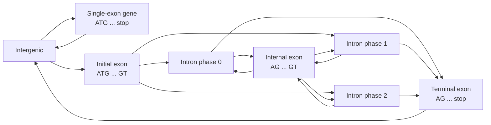

# Computational Biology · Lesson 3.6: Gene finding

> ⏱ ~15 min · Module 3: Probabilistic models — HMMs & gene finding · Builds on: [1.1](01-01-sequences-alphabets-databases.md) (reading frames and random ORFs), [3.2](03-02-viterbi-decoding.md) (Viterbi), [3.4](03-04-training-hmms-baum-welch.md) (training), [molecular-cell-biology 4.3](../../molecular-cell-biology/lessons/04-03-rna-processing-mrna-life-cycle.md) (splicing) · Unlocks: [4.1](04-01-sequencing-reads-and-errors.md) (genomics from reads), [5.1](05-01-rna-seq-quantification-normalization.md) (RNA-seq as gene evidence)

## Why this matters

A newly sequenced genome is a few billion letters with no labels. The first question anyone asks is where the genes are. Experiments can't check every candidate, so the answer starts as a computational prediction. Every gene annotation you look up began as one, corrected later by transcript evidence.

[1.1](01-01-sequences-alphabets-databases.md) showed that ORF length alone fails: random DNA produces about 770 open frames of 100+ codons per megabase. Real gene finders win by modelling **what coding sequence looks like statistically**, and by encoding the **grammar** of a gene — start, exons, introns with splice signals, stop — as the state structure of an HMM. Decoding that HMM with Viterbi gives the most probable annotation of the whole sequence at once.

## The idea

**Coding DNA has a three-base rhythm.** The genetic code, amino-acid preferences and codon bias make base composition depend on position within the codon. G is common at the first codon position, for instance. A model with separate base distributions for codon positions 1, 2 and 3 scores a stretch much higher in its true frame than in the other two, or than a non-coding model does. That **coding potential** is far more informative than the absence of stops.

**Prokaryotic genes are mostly simple:** an ATG (or GTG/TTG) start, often a ribosome-binding site a few bases upstream, one uninterrupted open frame with coding statistics, and a stop. An HMM with a non-coding state, a start signal and a 3-periodic coding cycle (codon position 1→2→3→1…) finds them well. Most prokaryotic genomes are about 85–90 percent coding, so the prior favours genes.

**Eukaryotic genes are hard.** Exons are short, separated by introns that can be thousands of bases long. Introns begin with GT and end with AG (the **splice donor** and **acceptor** consensus cores), but GT and AG are everywhere. And an intron can interrupt a codon: the reading frame must carry across it, so the model has to remember the **intron phase** (0, 1 or 2 bases into the codon).

**Why a plain HMM isn't enough.** A state with a self-loop gives a geometric length distribution, whose most likely length is 1 ([3.1](03-01-markov-chains-to-hmms.md)). Real exons are almost never a handful of bases long. **Generalized HMMs** (GHMMs, as in Genscan) let each state emit a whole segment whose length is drawn from any distribution you like. Decoding still works by a Viterbi-like DP over segment boundaries.

## The formal version

**Periodic (inhomogeneous) coding model.** Let $p_c(b)$ be the probability of base $b$ at codon position $c \in \{1, 2, 3\}$, and let $q(b)$ be a non-coding background. For a stretch $x_1\ldots x_n$ read in frame $f \in \{0, 1, 2\}$ (so base $i$ occupies codon position $c(i) = ((i - 1 - f) \bmod 3) + 1$),

$$S_f(x) = \sum_{i=1}^{n}\log_2\frac{p_{c(i)}(x_i)}{q(x_i)}.$$

This is the [coding potential](../reference.md#coding-potential). *In words: score each base by how much more likely it is at its codon position in coding sequence than in background, and add up.* Real gene finders use fifth-order periodic Markov chains (each base conditioned on the previous five, separately for each codon position). The zero-order version here shows the principle.

**Gene structure as a state grammar.** States include intergenic, single-exon gene, initial exon, internal exon, terminal exon, and introns of phase 0, 1 and 2, on both strands. Allowed transitions encode biology:

- initial exons start with ATG, terminal exons end with a stop, and no exon contains an in-frame stop;
- introns start with a donor signal (GT…) and end with an acceptor (…AG);
- an intron of phase $\phi$ must be followed by an exon that begins at codon position $\phi + 1$;
- the total coding length of a gene is a multiple of 3.

**Intron phase.** If the coding bases before an intron total $\ell$, its phase is $\phi = \ell \bmod 3$.

**Generalized HMM.** Each state $k$ emits a segment of length $d$ with probability $\rho_k(d)$ and content probability $P_k(x_{\text{seg}})$. Decoding maximizes over segmentations:

$$V_k(i) = \max_{d,\ j}\Big[V_j(i-d) + \log a_{jk} + \log\rho_k(d) + \log P_k(x_{i-d+1..i})\Big].$$

This is the [generalized HMM](../reference.md#generalized-hmm). *In words: the best parse ending with a segment of type $k$ at position $i$ tries every segment length and every previous segment type.* Capping $d$ keeps the cost manageable. Real decoders also restrict candidate boundaries to plausible signals such as GT, AG, ATG and stops.

## Picture

This is the forward-strand half of a Genscan-style state grammar; a mirror copy handles the reverse strand. Each box is a GHMM state that emits a whole segment with its own length distribution and content model. The three intron states exist because the model must remember the reading frame across an intron: an exon that follows a phase-1 intron has to begin with the second base of a split codon. Following arrows from Intergenic back to Intergenic spells out one complete gene. Viterbi over this grammar picks the most probable such path through the whole contig — how many genes, and where every exon starts and stops.

## Worked examples

**Example 1 (mechanical): which frame is coding?** A toy coding model, with background $q = 0.25$ for every base:

| codon position | A | C | G | T |
|---|---|---|---|---|
| 1 | 0.28 | 0.20 | 0.35 | 0.17 |
| 2 | 0.30 | 0.23 | 0.17 | 0.30 |
| 3 | 0.20 | 0.30 | 0.30 | 0.20 |

As log₂-odds:

| codon position | A | C | G | T |
|---|---|---|---|---|
| 1 | 0.16 | −0.32 | 0.49 | −0.56 |
| 2 | 0.26 | −0.12 | −0.56 | 0.26 |
| 3 | −0.32 | 0.26 | 0.26 | −0.32 |

Score `ATGGCTGAAGCC` in frame 0, codons ATG GCT GAA GCC:

- ATG: $0.16 + 0.26 + 0.26 = 0.69$
- GCT: $0.49 - 0.12 - 0.32 = 0.04$
- GAA: $0.49 + 0.26 - 0.32 = 0.43$
- GCC: $0.49 - 0.12 + 0.26 = 0.63$

Total $S_0 = \mathbf{1.79}$ bits. The same bases read in frame 1 (first base at codon position 3) score $S_1 = -0.72$, and in frame 2 $S_2 = -1.75$. Frame 0 wins by 2.5 bits over 12 bases, and a real gene is hundreds of bases long, so the evidence grows accordingly. Frame 0 also translates to M A E A with no stop, consistent with a gene start.

**Example 2 (why you'd care): lengths the model must get right.** Suppose an exon state had a self-loop tuned to a mean length of 150 bases, so its length is geometric with $p = 1/150$ of stopping at each base. Then

$$P(L < 50) = 1 - \left(1 - \tfrac{1}{150}\right)^{49} = \mathbf{0.28}, \qquad P(L \ge 300) = \left(1 - \tfrac{1}{150}\right)^{299} = \mathbf{0.14},$$

and the single most likely length is **1**. The model expects more than a quarter of all exons to be shorter than 50 bases, which is far more short exons than real genes have. Real internal exons cluster sharply around 100–200 bases. A plain HMM would happily predict tiny exons wherever a GT and an AG sit close together. A GHMM plugs in the observed length histogram for $\rho(d)$, and those spurious micro-exons become improbable.

## Watch out

- **You might predict** genes from the longest ORFs — **but actually** random sequence makes long ORFs in abundance ([1.1](01-01-sequences-alphabets-databases.md)), especially in GC-rich genomes, and the opposite strand of a real gene often carries a long spurious ORF. Coding statistics, not length, separate them.
- **You might forget** intron phase — **but actually** the reading frame continues across introns. A predicted exon structure whose coding lengths don't sum to a multiple of 3, or whose next exon starts at the wrong codon position, is not a gene model at all (Problem 3).
- **You might trust** ab initio predictions as annotation — **but actually** they miss small exons, alternative splicing and untranslated regions, and they perform worst on genomes unlike their training set. Modern pipelines combine them with transcript evidence from RNA-seq ([5.1](05-01-rna-seq-quantification-normalization.md)) and protein homology ([3.5](03-05-profile-hmms.md)).

## One-liner

> Gene finders score coding potential with codon-position-specific statistics and decode a state grammar of exons, phased introns and splice signals with Viterbi — generalized so that exon lengths follow real distributions instead of an HMM's geometric default.

## Problems

**P1 (🟢)** Using Example 1's log-odds table, score `GCAGTAGCC` in frames 0, 1 and 2. Which frame looks coding, and does that frame contain a stop codon?

**P2 (🟡)** An intron state with a self-loop has a geometric length distribution with mean 2,000 bases. (a) What is the probability of an intron shorter than 100 bases? (b) What is the median length? (c) Real introns have a minimum length of about 60–70 bases, set by the splicing machinery. How would a GHMM encode that, and what would it do to predictions?

**P3 (🔴)** A predicted three-exon gene starts at ATG. Its exons contain 100, 83 and 121 coding bases. (a) Compute the phase of each intron. (b) Is this a valid gene model? (c) The prediction is revised so the last exon has 120 coding bases. Is it valid now? (d) Under the revised model, at which codon position does the second exon begin?

Solutions

**P1** Bases G C A G T A G C C (positions 1–9).

*Frame 0* (positions 1,2,3 repeating; codons GCA GTA GCC): GCA $0.49 - 0.12 - 0.32 = 0.05$; GTA $0.49 + 0.26 - 0.32 = 0.43$; GCC $0.49 - 0.12 + 0.26 = 0.63$. **$S_0 = 1.10$.**

*Frame 1* (base 1 at position 3, then 1, 2, 3, …): G@3 $0.26$; C@1 $-0.32$, A@2 $0.26$, G@3 $0.26$; T@1 $-0.56$, A@2 $0.26$, G@3 $0.26$; C@1 $-0.32$, C@2 $-0.12$. **$S_1 = -0.01$** (to rounding).

*Frame 2* (base 1 at position 2): G@2 $-0.56$, C@3 $0.26$; A@1 $0.16$, G@2 $-0.56$, T@3 $-0.32$; A@1 $0.16$, G@2 $-0.56$, C@3 $0.26$; C@1 $-0.32$. **$S_2 = -1.46$** (to rounding).

**Frame 0** looks coding. Its codons GCA GTA GCC are Ala, Val, Ala — **no stop**.

**P2** (a) $p = 1/2000$: $P(L < 100) = 1 - (1 - 1/2000)^{99} = 1 - e^{99 \ln(0.9995)} \approx 1 - e^{-0.0495} = \mathbf{0.048}$.

(b) Median $m$ solves $(1 - 1/2000)^m = 0.5$: $m = \ln 0.5 / \ln 0.9995 \approx \mathbf{1{,}386}$ bases.

(c) Set $\rho(d) = 0$ for $d$ below the minimum (about 60–70 bases) and use the empirical histogram above it. Predictions would no longer contain impossible short introns. Pairs of exons separated by a few dozen bases would have to be merged into one exon or explained some other way — frame shifts or sequencing errors, rather than tiny introns.

**P3** (a) Intron 1 follows 100 coding bases: phase $100 \bmod 3 = \mathbf{1}$. Intron 2 follows $100 + 83 = 183$: phase $183 \bmod 3 = \mathbf{0}$.

(b) Total coding length $100 + 83 + 121 = 304$, and $304 \bmod 3 = 1$. **Not valid**: the terminal exon can't end on a complete stop codon.

(c) $100 + 83 + 120 = 303 = 3 \times 101$. **Valid** in length (101 codons including the stop), provided the last three bases are a stop and no earlier in-frame stop occurs.

(d) Intron 1 has phase 1: the first exon ended one base into a codon. The second exon therefore **begins at codon position 2**, completing the split codon with its first two bases.

## Flashback

**From Lesson 3.4 (Training HMMs):** Under the GC model, the posterior probabilities of state H at the three positions of `GAT` are 0.590, 0.353 and 0.340. (a) Give the expected emission counts from H. (b) Give the Baum–Welch re-estimate of $e_H(\cdot)$ with no pseudocounts. (c) Give it with pseudocount 1 per base. (d) Which estimate would you use, and why?

Solution

(a) One letter per position, so $E_H(\text{G}) = 0.590$, $E_H(\text{A}) = 0.353$, $E_H(\text{T}) = 0.340$, $E_H(\text{C}) = 0$. Total $1.283$.

(b) Divide by 1.283: G $\mathbf{0.460}$, A $\mathbf{0.275}$, T $\mathbf{0.265}$, C $\mathbf{0}$.

(c) Add 1 to each count; the total becomes 5.283. G $1.590/5.283 = \mathbf{0.301}$, A $\mathbf{0.256}$, T $\mathbf{0.254}$, C $1/5.283 = \mathbf{0.189}$.

(d) **(c).** Three letters can't justify declaring C impossible in a GC-rich state — the biology says the opposite. Without pseudocounts, one Baum–Welch step on a tiny sequence memorizes it ([3.4](03-04-training-hmms-baum-welch.md) Example 2). The pseudocounted estimate barely moves from uniform, which is the honest summary of three bases of evidence.

## Connections

- **Backward:** random ORF statistics are [1.1](01-01-sequences-alphabets-databases.md)'s; decoding is [3.2](03-02-viterbi-decoding.md)'s Viterbi over segments; parameters come from [3.4](03-04-training-hmms-baum-welch.md)'s training on known genes; the spliceosome and its 5′ and 3′ splice sites are [molecular-cell-biology 4.3](../../molecular-cell-biology/lessons/04-03-rna-processing-mrna-life-cycle.md)'s, and this lesson adds the GT…AG consensus a gene finder actually reads.
- **Forward:** RNA-seq reads mapped to the genome ([4.2](04-02-read-mapping-bwt-fm-index.md), [5.1](05-01-rna-seq-quantification-normalization.md)) provide the direct exon evidence that modern annotation combines with ab initio prediction; profile HMM searches ([3.5](03-05-profile-hmms.md)) add protein-homology evidence.
- **Sideways:** a GHMM is a hidden semi-Markov model, the same device used in speech recognition for phoneme durations; the phase bookkeeping across introns is modular arithmetic on a three-state cycle — the ring $\mathbb{Z}/3$ of [number-theory](../../number-theory/syllabus.md) doing real work.
