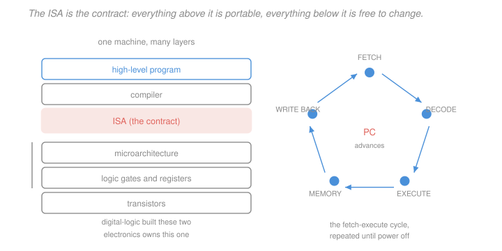

# Computer Architecture · Lesson 1.1: The ISA contract and the stored-program machine

> ⏱ ~15 min · Module 1: The instruction set and assembly · Builds on: [`digital-logic` 4.4 (datapaths and a simple CPU)](../../digital-logic/lessons/04-04-datapaths-and-a-simple-cpu.md) · Unlocks: 1.2 (registers, memory, and instruction formats)

## Why this matters

You finished [`digital-logic`](../../digital-logic/syllabus.md) able to build a datapath and an FSM that steers it. What you could not do is say why *that* datapath, or what makes one processor able to run another's software. The answer is a single document — the **instruction set architecture** — and it is the most consequential interface in computing.

Its consequences are commercial, not just technical. An x86 binary from 1995 still runs on a chip designed in 2026 that shares essentially no circuitry with the original, because both honour the same contract. Apple moved Macs from PowerPC to x86 to ARM, and each time the question "will my software run" was a question about ISAs. This lesson is about what exactly that contract fixes, and — just as important — what it deliberately leaves free.

## The idea

Draw a horizontal line through a computer. Above it: programs, compilers, operating systems. Below it: gates, wires, clock edges.

The line is the ISA. It is a promise about **what the machine does**, never about **how**. It names the registers, defines every instruction's effect, and fixes how instructions are encoded as bits. It says nothing about how many cycles anything takes, whether instructions overlap, or how big the cache is — those are **microarchitecture**, and they are free to change with every chip.

That split is the whole trick. Software can be written once against the contract; hardware can be redesigned from scratch underneath it. Confusing the two levels is the most common conceptual error in this subject, and the rest of the course keeps returning to which side of the line a question lives on.

The second idea is older and stranger: **instructions are just numbers in the same memory as data.** That is the stored-program concept, and it is why a compiler can write a program, why a program can be loaded from disk, and why a buffer overflow can execute your input as code.

## The formal version

> **Definition (ISA).** The instruction set architecture is the set of facts a programmer must know to write a correct program: the architectural registers, the memory model, every instruction's semantics, the instruction encodings, and the exception and privilege model.

> **Definition (microarchitecture).** The microarchitecture is any implementation choice not fixed by the ISA — pipeline depth, cache sizes, branch predictors, issue width, the number of ALUs.

*In words:* the ISA is what you must know; the microarchitecture is what you may exploit for speed but must never depend on for correctness.

| Fixed by the ISA | Free to the microarchitecture |
|---|---|
| number and width of architectural registers | number of *physical* registers |
| what `add` computes | how many cycles `add` takes |
| the bit encoding of every instruction | whether instructions execute in order |
| the memory model and addressing modes | cache size, associativity, hierarchy |
| exception and interrupt behaviour | pipeline depth, branch prediction |

**The stored-program machine.** Instructions and data share one memory. Execution is a loop over a single piece of state, the **program counter** (PC), holding the address of the next instruction:

$$\text{PC} \rightarrow \textbf{fetch} \rightarrow \textbf{decode} \rightarrow \textbf{execute} \rightarrow \textbf{memory} \rightarrow \textbf{write back} \rightarrow \text{PC} \mathrel{+}= 4$$

Those five stages are not arbitrary — they are the divisions that will become the pipeline in [3.3](03-03-pipelining-and-the-pipelined-datapath.md). Every instruction in a RISC ISA passes through the same sequence, which is precisely what makes overlapping them possible.

**RISC versus CISC.** Two design philosophies, and the disagreement is about where complexity should live.

| | RISC (RISC-V, ARM) | CISC (x86) |
|---|---|---|
| instruction count | small, ~50 core | large, ~1000+ |
| instruction length | fixed, 32 bits | variable, 1 to 15 bytes |
| memory operands | loads and stores only | most instructions can address memory |
| operands per instruction | 3 registers | 2, often one in memory |
| decoding | trivial | requires its own pipeline stages |

The historical argument was that CISC put complex operations in hardware to make compilers' lives easier. The modern resolution is that **the distinction is now largely internal**: x86 chips decode their complex instructions into RISC-like internal operations and execute those. The ISA stayed CISC for compatibility; the microarchitecture went RISC for speed — which is the ISA/microarchitecture split doing exactly what it was designed to do.

**Why this course uses RISC-V.** It is a clean, open, fixed-length RISC ISA designed for teaching as well as production. Fixed 32-bit instructions mean you can decode one by hand in a minute, which you will do throughout Module 1.

**The three places a program's state lives**, fastest and smallest first: **registers** (32 of them, single-cycle access), **memory** (billions of bytes, tens to hundreds of cycles away), and **storage** (disk, effectively forever away). Module 4 is entirely about managing the second gap.

## Picture

The highlighted band is the only layer that is a *promise*. Everything above it is written against that promise; everything below it may be rebuilt freely so long as the promise holds. The ring on the right is the loop the machine has been running since it was switched on, and the PC at its centre is the single register that makes it a *stored-program* machine rather than a fixed calculator.

## Worked examples

**Example 1 (mechanical): which side of the line?** Classify each claim as an ISA fact or a microarchitecture fact.

| Claim | Which | Why |
|---|---|---|
| "There are 32 general-purpose registers." | **ISA** | a program names them; changing this breaks binaries |
| "There are 180 physical registers." | micro | register renaming ([5.2](05-02-instruction-level-parallelism.md)) hides these entirely |
| "`add x3, x1, x2` puts the sum in `x3`." | **ISA** | the instruction's defined effect |
| "`add` completes in one cycle." | micro | timing is never in the contract |
| "The L1 cache is 32 KiB, 8-way." | micro | invisible to correctness ([4.1](04-01-caches-and-locality.md)) |
| "Instructions are 32 bits and word-aligned." | **ISA** | you cannot decode without it |
| "Branches are predicted with a 2-bit counter." | micro | affects speed only ([3.5](03-05-control-hazards-and-branch-prediction.md)) |

The test to apply: **would a correct program ever notice?** If yes, it is architectural. If it only runs faster or slower, it is microarchitectural.

**Example 2 (why you'd care): the same contract, two machines.** Suppose two chips implement RISC-V. Chip A is a simple single-cycle design at 500 MHz. Chip B is a 5-stage pipelined design at 2 GHz with a cache.

Run the identical binary on both. Both produce **bit-identical results**, because both honour the same ISA. Chip B may be twenty times faster; that difference is entirely microarchitectural, and this course's Modules 3–5 are the catalogue of how B earns it.

Now the reverse. Take an ARM binary and run it on the RISC-V chip: it fails immediately, because the bytes decode to different instructions or to nothing at all. Not "runs slowly" — *cannot run*. That is the difference between a performance property and a contract property, and it is why an ISA change is a commercial event while a microarchitecture change is a product cycle.

One consequence worth carrying into Module 5: because timing is *not* in the contract, a program that is correct can still be catastrophically slow, and nothing in the ISA warns you. Reading a 2D array down its columns instead of across its rows can cost a factor of ten on real hardware ([4.1](04-01-caches-and-locality.md)) while executing exactly the same instructions in exactly the same order. Performance lives entirely below the line, which is precisely why architects study it and why the analysis in this course is worth doing.

## Watch out

- **You might think** a faster chip must have a better instruction set — **but actually** almost all performance differences between modern chips at the same ISA are microarchitectural. Two RISC-V chips can differ by 50x in speed while implementing an identical contract.
- **You might think** CISC instructions are inherently slower — **but actually** modern x86 decodes them into internal RISC-like operations, so the outside is CISC and the inside is not. The ISA is a compatibility decision; the execution engine is an independent one.
- **You might think** "the program counter holds the current instruction" — **but actually** it holds the *address* of an instruction, and on most machines it has already advanced to the next one by the time the current one executes. That off-by-one matters in [1.4](01-04-branches-loops-control-flow.md), where branch targets are computed relative to it.

## One-liner

> The ISA is the line between what a program may depend on and what a chip may change: it fixes registers, semantics and encodings, says nothing about time, and the stored-program loop that runs it is one register — the PC — advancing through memory that holds instructions and data alike.

## Problems

**P1 (🟢)** Classify each as ISA or microarchitecture, one word each, and give a one-clause reason: (a) the number of bits in an immediate field; (b) the number of pipeline stages; (c) whether unaligned loads are permitted; (d) the branch predictor's accuracy; (e) which register holds the return address by convention.

**P2 (🟡)** A vendor ships a new chip that is fully binary-compatible with the previous one but 40 percent faster on the same clock frequency. Name three specific microarchitectural changes that could produce this, and explain why none of them required recompiling any software.

**P3 (🔴, optional)** A company proposes adding one instruction to its ISA: `fused-multiply-add`, computing `a*b + c` in one instruction. Give two concrete benefits and two concrete costs, and state precisely what breaks for existing binaries and what does not.

Solutions

**P1**

| | Answer | Reason |
|---|---|---|
| (a) immediate field width | **ISA** | it determines which constants are encodable, so a program can observe it |
| (b) pipeline stages | **micro** | affects only timing; no program result changes |
| (c) unaligned loads permitted | **ISA** | a program that does one either works or faults — a correctness-visible difference |
| (d) branch predictor accuracy | **micro** | mispredictions cost cycles, never correctness |
| (e) register holding the return address | **ISA**, *but* by convention | see below |

(e) deserves the extra clause, because it is the one that catches people. `jal` writing the return address to `x1` is fixed by the ISA — that is the instruction's defined effect. But the *convention* that `x1` is "the return address register" across separately compiled functions is an **ABI** (application binary interface) decision, one layer above the ISA. The hardware would happily let you use `x5`; what breaks is linking against code compiled by someone else. This distinction returns in [1.5](01-05-procedures-stack-calling-convention.md), where the entire calling convention is ABI rather than ISA.

**P2** Three changes, each purely microarchitectural:

1. **A deeper or better-balanced pipeline, or wider issue.** Going from single-issue to 2-wide superscalar ([5.2](05-02-instruction-level-parallelism.md)) can approach 2x on instruction-level-parallel code. The ISA is untouched: the same instructions execute in the same architectural order, just overlapped more aggressively.
2. **A better branch predictor.** Raising prediction accuracy from 90 to 97 percent removes most of the flush penalty from [3.5](03-05-control-hazards-and-branch-prediction.md). On branch-heavy code this alone can be worth 20 percent or more.
3. **A larger or lower-latency cache hierarchy.** Doubling L2 or adding an L3 cuts the average memory access time ([4.2](04-02-associativity-misses-write-policy.md)). Memory-bound programs gain most, and again the ISA cannot see it.

*Why no recompilation.* Every one of these changes how *fast* instructions complete, never *what* they compute. The binary's bytes decode to the same instructions with the same architectural effects, so the sequence of register and memory states the program passes through is unchanged. The chip is only allowed to make these changes because the ISA never promised timing in the first place — the contract's silence on speed is exactly what buys the freedom.

Worth noting the converse: this is why a vendor *cannot* fix a slow instruction by redefining what it computes. That would be an ISA change, and old binaries would break.

**P3** *Two benefits.*

1. **Fewer instructions and fewer cycles.** `a*b + c` in one instruction rather than two removes an instruction fetch, a decode, and a register write, and the multiply-add hardware can be shorter than a multiplier followed by a separate adder. On dense linear algebra — which is dominated by exactly this pattern — the gain is large, which is why every serious floating-point ISA has FMA.
2. **Better numerical accuracy.** A *fused* multiply-add rounds **once**, at the end, rather than rounding the product and then the sum. That single retained rounding makes some algorithms measurably more accurate, and is the reason the operation is specified in IEEE-754 rather than left as an optimisation ([2.3](02-03-floating-point-ieee-754.md)).

*Two costs.*

1. **Encoding space.** A three-input arithmetic instruction needs `rs1`, `rs2`, `rs3` and `rd` — four register fields, 20 bits of the 32 — which does not fit the R-type layout of [1.2](01-02-registers-memory-instruction-formats.md) and forces a new format (RISC-V uses R4-type for exactly this). Opcode space is a genuinely scarce resource, and every instruction added forecloses others.
2. **Permanent implementation burden.** Every future chip claiming this ISA must implement it forever, including small embedded parts where the multiplier is pure area cost. The contract is one-way: you can stop optimising an instruction, but you can never remove it.

*What breaks and what does not.* **Nothing breaks for existing binaries.** Adding an instruction uses previously undefined encoding space, so every old program's bytes still decode to exactly what they decoded to before, with identical effects. Old code runs unchanged; it simply never benefits until recompiled.

The breakage runs the *other* direction, and this is the part worth being precise about: a **new** binary using FMA will not run on **old** chips, where that encoding is undefined and traps as an illegal instruction. So adding an instruction is backward-compatible but not forward-compatible, which is why real ISAs handle this with versioned extensions (RISC-V's `M`, `F`, `A` and so on) and why shipping software either targets a baseline or dispatches at run time on detected features. And note the numerical subtlety: because FMA rounds once where separate operations round twice, a recompiled program can produce *different* floating-point results than before — bit-identical output is not guaranteed across the change, even though both answers are correctly rounded for their respective operations.

## Connections

- **Backward:** [`digital-logic` 4.4](../../digital-logic/lessons/04-04-datapaths-and-a-simple-cpu.md) built a datapath and an FSM controller and executed an instruction with them. That machine had no *named* instruction set — this lesson supplies the missing contract, and [1.2](01-02-registers-memory-instruction-formats.md) makes it concrete in bits.
- **Forward:** the five-stage fetch-execute loop becomes the literal pipeline of [3.3](03-03-pipelining-and-the-pipelined-datapath.md). The ISA/microarchitecture split organises the whole course: Modules 1–2 are the contract, Modules 3–5 are the implementation freedom it creates.
- **Sideways:** the stored-program idea — instructions as data — is what makes a compiler possible at all, and is the same self-reference that [`theory-of-computation` 4.1](../../theory-of-computation/lessons/04-01-diagonalization-and-the-halting-problem.md) exploits when a machine takes another machine's description as input. It is also the root of an entire class of security failures, where data supplied by an attacker is reached by the PC and executed.
