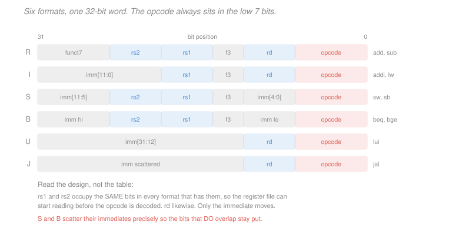

# Computer Architecture · Lesson 1.2: Registers, memory, and instruction formats

> ⏱ ~15 min · Module 1: The instruction set and assembly · Builds on: [1.1 (the ISA contract)](01-01-isa-contract-stored-program.md) · Unlocks: 1.3 (arithmetic and data transfer), 1.4 (branches and loops)

## Why this matters

[1.1](01-01-isa-contract-stored-program.md) said the ISA fixes the encodings. This lesson makes that concrete: you will take a 32-bit hex word and say exactly which instruction it is, which registers it names, and what constant it carries.

That is not a party trick. Hand-decoding is how you read a disassembly when the debugger disagrees with the source, how you tell whether a jump target is what you think, and how you spot that a "random" crash address is actually a valid instruction shifted by one byte. It is also the fastest route to seeing that the RISC-V format table is not arbitrary — every apparently odd choice in it buys something specific in hardware.

## The idea

Thirty-two registers, each 32 bits, plus a memory addressed one byte at a time. Every instruction is exactly 32 bits and must say: what operation, which registers, and possibly a constant.

Thirty-two registers need 5 bits to name ($2^5 = 32$). Two source registers and one destination is 15 bits. The operation needs about 10. That leaves roughly 7 bits for a constant — nowhere near enough for a useful number. So RISC-V does the obvious thing: **it uses different layouts for different jobs**. Instructions needing three registers get three register fields and no constant; instructions needing a constant sacrifice a register field to make room.

The design insight — the thing worth actually taking away — is that the fields **do not move between formats when they do not have to**. `rs1` sits in bits 19:15 in *every* format that has a first source register. `rd` sits in bits 11:7 in every format that writes one. That is not tidiness. It means the hardware can start reading the register file *before it knows what instruction it is looking at*, which removes a decode step from the critical path.

Everything strange about the S and B formats — the scattered immediate bits — is the price paid to keep that property.

## The formal version

**The register file.** 32 registers `x0` through `x31`, each 32 bits wide.

> **`x0` is hardwired to zero.** Writes to it are discarded; reads always return 0.

That looks like a wasted register and is one of the best decisions in the ISA. It makes a large family of pseudo-instructions free: `mv x5, x6` is `add x5, x6, x0`; `li x5, 0` is `add x5, x0, x0`; `beqz x5, L` is `beq x5, x0, L`. One hardwired constant eliminates the need for a dozen real instructions.

**Memory.** Byte-addressed: each address names one byte. A 32-bit word occupies 4 consecutive bytes, so consecutive words sit at addresses differing by 4 — which is why array indexing always multiplies by 4 in [1.3](01-03-arithmetic-logic-data-transfer.md).

> **Endianness.** RISC-V is **little-endian**: the least significant byte goes at the lowest address. The word `0x12345678` stored at address 0x1000 occupies:

| address | 0x1000 | 0x1001 | 0x1002 | 0x1003 |
|---|---|---|---|---|
| byte | `0x78` | `0x56` | `0x34` | `0x12` |

Nothing is more correct about either convention; what matters is that the two ends of a network connection agree, which is why network protocols specify big-endian ("network byte order") regardless of the machines involved.

**The six formats.** All are 32 bits, and the low 7 bits are always the opcode.

| Format | Layout (high bits to low) | Used by |
|---|---|---|
| **R** | `funct7[7] rs2[5] rs1[5] funct3[3] rd[5] opcode[7]` | `add`, `sub`, `and`, `or`, `sll` |
| **I** | `imm[12] rs1[5] funct3[3] rd[5] opcode[7]` | `addi`, `lw`, `jalr` |
| **S** | `imm[11:5] rs2[5] rs1[5] funct3[3] imm[4:0] opcode[7]` | `sw`, `sb` |
| **B** | `imm[12\|10:5] rs2[5] rs1[5] funct3[3] imm[4:1\|11] opcode[7]` | `beq`, `bne`, `bge` |
| **U** | `imm[31:12] rd[5] opcode[7]` | `lui`, `auipc` |
| **J** | `imm[20\|10:1\|11\|19:12] rd[5] opcode[7]` | `jal` |

The opcodes you will meet in this course:

| opcode | binary | meaning |
|---|---|---|
| `0x33` | `0110011` | R-type arithmetic |
| `0x13` | `0010011` | arithmetic with immediate |
| `0x03` | `0000011` | loads |
| `0x23` | `0100011` | stores |
| `0x63` | `1100011` | branches |
| `0x6F` | `1101111` | `jal` |
| `0x37` | `0110111` | `lui` |

**Why `funct3` and `funct7` exist.** Seven opcode bits could name only 128 instructions, and many encodings are reserved. So related operations *share* an opcode and are distinguished by `funct3` (and, for R-type, `funct7`). `add` and `sub` are both opcode `0x33` with `funct3 = 000`; they differ only in `funct7` (`0000000` versus `0100000`). This keeps opcode space free and — more usefully — means the ALU control logic in [3.2](03-02-single-cycle-control.md) can look at a small fixed set of bits.

**Immediates are always sign-extended.** A 12-bit immediate covers $[-2048, +2047]$. Sign extension means bit 11 is copied into bits 31:12, so `0xFFF` is $-1$, not $4095$.

**The register ABI names.** Hardware sees only `x0`–`x31`; the calling convention of [1.5](01-05-procedures-stack-calling-convention.md) assigns roles, and assembly is normally written with those names.

| ABI | Register | Role |
|---|---|---|
| `zero` | `x0` | hardwired zero |
| `ra` | `x1` | return address |
| `sp` | `x2` | stack pointer |
| `t0`–`t2` | `x5`–`x7` | temporaries |
| `s0`–`s1` | `x8`–`x9` | saved registers |
| `a0`–`a7` | `x10`–`x17` | arguments and return values |

## Picture

Look down the columns, not across the rows. `rs1` occupies the same bits in R, I, S and B. `rs2` occupies the same bits in R, S and B. `rd` occupies the same bits in R, I, U and J. Only the immediate is chopped up — and it is chopped up *precisely so those columns stay aligned*.

## Worked examples

**Example 1 (mechanical): encode `add x3, x1, x2`.** R-type, so `funct7 rs2 rs1 funct3 rd opcode`.

- `funct7 = 0000000` (this is `add`, not `sub`)
- `rs2 = x2 = 00010`, `rs1 = x1 = 00001`
- `funct3 = 000`, `rd = x3 = 00011`
- `opcode = 0110011`

Concatenating: `0000000 00010 00001 000 00011 0110011`. Regrouping into nibbles:
$$\texttt{0000 0000 0010 0000 1000 0001 1011 0011} = \texttt{0x002081B3} .$$

Now `sub x1, x2, x3`, which differs in `funct7` and in the register numbers: `0100000 00011 00010 000 00001 0110011` = `0x403100B3`. **The only difference between `add` and `sub` is one bit of `funct7`** — bit 30.

**Example 2 (why you'd care): decode `0xFEC28393` cold.** You have a hex word and no source. Work from the low bits up.

*Step 1 — opcode.* The low 7 bits. $\texttt{0x93} = \texttt{10010011}$, so the low 7 are `0010011` = `0x13`: **arithmetic with immediate**, an I-type.

*Step 2 — lay out the I fields.* Write the full 32 bits:
$$\texttt{1111 1110 1100 0010 1000 0011 1001 0011}$$
Split as `imm[11:0] | rs1[5] | funct3[3] | rd[5] | opcode[7]`:

| field | bits | value |
|---|---|---|
| `imm[11:0]` | `111111101100` | $-20$ (sign-extended) |
| `rs1` | `00101` | `x5` = `t0` |
| `funct3` | `000` | `addi` |
| `rd` | `00111` | `x7` = `t2` |
| `opcode` | `0010011` | I-type arithmetic |

*Step 3 — read it out.* `addi x7, x5, -20`, or in ABI names `addi t2, t0, -20`.

The immediate is where people go wrong. `111111101100` looks like $4076$ if you read it unsigned. It is sign-extended, so the leading 1 means negative: invert and add one to get $000000010100 = 20$, hence $-20$. **A leading 1 in the top immediate bit always means a negative constant**, and mistaking that is the single most common hand-decoding error.

Two habits worth building from this. Always identify the opcode first — it tells you the format, and without the format the other fields are meaningless. And always check the sign bit of the immediate before converting, because an off-by-4096 error in a branch offset points at an address that looks plausible and is not.

## Watch out

- **You might think** `x0` is a normal register you should avoid using — **but actually** it is hardwired and is meant to be used constantly. Writing to it is legal and is how RISC-V expresses "discard this result"; `jal x0, label` is an unconditional jump that throws the return address away.
- **You might think** the scattered S and B immediates are a historical accident — **but actually** they are deliberate. Keeping `rs1`, `rs2` and `funct3` in fixed positions across formats lets the register file and ALU control start work before decoding completes. The immediate is the one field with no such constraint, so it absorbs all the irregularity.
- **You might think** a 12-bit immediate holds values up to 4095 — **but actually** it is signed, so the range is $[-2048, 2047]$. To build a larger constant you need `lui` to set the top 20 bits and then `addi` for the low 12 — and even that has a subtlety, since `addi`'s sign extension can borrow from the upper half.

## One-liner

> Thirty-two registers with `x0` nailed to zero, byte-addressed little-endian memory, and six 32-bit formats whose register fields never move — because holding `rs1` and `rd` in fixed bits lets the hardware read them before it knows what the instruction is.

## Problems

**P1 (🟢)** Encode `or x12, x10, x11` as a 32-bit hex word. (`or` is R-type, opcode `0x33`, `funct3 = 110`, `funct7 = 0000000`.) Show the six fields in binary before combining.

**P2 (🟡)** Decode `0x00C4A303`. Give the instruction in the form `mnemonic rd, imm(rs1)`, name the format, and state the decimal value of the immediate. (`funct3 = 010` with a load opcode means `lw`.)

**P3 (🔴, optional)** The word `0xFE242E23` is an S-type store. Extract the two immediate halves, reassemble them, and give the signed offset and the full instruction. Then explain in one or two sentences why S-type splits its immediate this way rather than placing all 12 bits contiguously.

Solutions

**P1** R-type layout is `funct7 rs2 rs1 funct3 rd opcode`.

| field | value | binary |
|---|---|---|
| `funct7` | 0 | `0000000` |
| `rs2` | `x11` | `01011` |
| `rs1` | `x10` | `01010` |
| `funct3` | `or` | `110` |
| `rd` | `x12` | `01100` |
| `opcode` | R-type | `0110011` |

Concatenated: `0000000 01011 01010 110 01100 0110011`. Regrouping into nibbles:
$$\texttt{0000 0000 1011 0101 0110 0110 0011 0011} = \boxed{\texttt{0x00B56633}}$$

**P2** *Opcode first.* $\texttt{0x03} = \texttt{0000011}$ — a **load**, so I-type.

*Full bit pattern* of `0x00C4A303`:
$$\texttt{0000 0000 1100 0100 1010 0011 0000 0011}$$

*Fields* as `imm[11:0] | rs1 | funct3 | rd | opcode`:

| field | bits | value |
|---|---|---|
| `imm[11:0]` | `000000001100` | $+12$ |
| `rs1` | `01001` | `x9` |
| `funct3` | `010` | `lw` (32-bit load) |
| `rd` | `00110` | `x6` |
| `opcode` | `0000011` | load |

The immediate's top bit is 0, so it is positive and no sign extension is needed: $\texttt{1100}_2 = 12$.

$$\boxed{\texttt{lw x6, 12(x9)}} \qquad \text{I-type, immediate} = +12$$

In ABI names, `lw t1, 12(s1)` — load the word 12 bytes past the address in `s1`, which for a word-aligned array is element index 3.

**P3** *Bit pattern* of `0xFE242E23`:
$$\texttt{1111 1110 0010 0100 0010 1110 0010 0011}$$

*S-type fields* are `imm[11:5] | rs2 | rs1 | funct3 | imm[4:0] | opcode`:

| field | bits | value |
|---|---|---|
| `imm[11:5]` | `1111111` | high 7 bits |
| `rs2` | `00010` | `x2` (the value being stored) |
| `rs1` | `01000` | `x8` (the base address) |
| `funct3` | `010` | `sw` |
| `imm[4:0]` | `11100` | low 5 bits |
| `opcode` | `0100011` | store |

*Reassembling the immediate.* Concatenate high then low: `1111111` followed by `11100` gives
$$\texttt{111111111100} .$$
The top bit is 1, so it is negative. Two's complement: invert to `000000000011`, add one to get `000000000100` $= 4$, so the value is $-4$.

$$\boxed{\texttt{sw x2, -4(x8)}}$$

*Why the split.* Because `rs2` must stay in bits 24:20 and `rs1` in bits 19:15, exactly where they sit in the R-type format. The store instruction needs both source registers *and* a 12-bit immediate, and after the two register fields, `funct3` and the opcode are placed, the only bits left over are 31:25 (seven bits) and 11:7 (five bits) — which are not adjacent. The immediate is simply poured into whatever space remains.

The payoff is concrete: the register file can begin reading `rs1` and `rs2` from fixed bit positions in the very first moments of decode, for R, S and B instructions alike, with no multiplexing and no wait for the opcode to be interpreted. Immediates, by contrast, are needed slightly later (at the ALU, not the register file), and the extra wiring to reassemble a split immediate is a few multiplexers off the critical path. **The irregularity is pushed onto the field that can afford it.** The B format goes further for the same reason, and its odd bit ordering is chosen so that B and S share as much wiring as possible — [1.4](01-04-branches-loops-control-flow.md) returns to why B also drops the immediate's low bit.

## Connections

- **Backward:** [1.1](01-01-isa-contract-stored-program.md) argued the ISA fixes encodings; this is that claim made concrete. The register file itself is [`digital-logic` 4.1](../../digital-logic/lessons/04-01-registers-and-shift-registers.md)'s bank of parallel-load registers with a decoder selecting one, and the hardwired `x0` is a wire, not a stored bit.
- **Forward:** [1.3](01-03-arithmetic-logic-data-transfer.md) and [1.4](01-04-branches-loops-control-flow.md) put these formats to work. The fixed positions of `rs1` and `rd` are exactly what lets the single-cycle datapath of [3.1](03-01-single-cycle-datapath.md) wire the register file directly to instruction bits, and the `funct3`/`funct7` split is what [3.2](03-02-single-cycle-control.md)'s ALU control decodes.
- **Sideways:** fixed-length instructions are the reason a RISC decoder is a handful of wires while an x86 decoder is a pipeline stage of its own — you always know where the next instruction starts. That single property is what makes the superscalar fetch of [5.2](05-02-instruction-level-parallelism.md) tractable.
