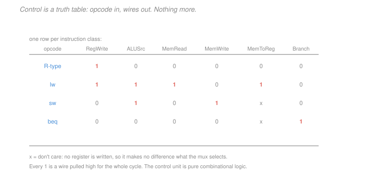

# Computer Architecture · Lesson 3.2: Single-cycle control

> ⏱ ~15 min · Module 3: The processor · Builds on: [3.1 (the single-cycle datapath)](03-01-single-cycle-datapath.md) · Unlocks: 3.3 (pipelining), 3.5 (branch prediction)

## Why this matters

[3.1](03-01-single-cycle-datapath.md) built the datapath and left every multiplexer's select line dangling. This lesson connects them, and the pleasant surprise is how little machinery it takes: the entire control unit is a small combinational function from opcode bits to wire values. No state, no sequencing, no memory.

That is worth seeing explicitly, because it makes the [1.1](01-01-isa-contract-stored-program.md) ISA/microarchitecture split concrete at the gate level. The `funct3` and `funct7` fields that [1.2](01-02-registers-memory-instruction-formats.md) described as "opcode economy" turn out to be exactly the bits the ALU control needs, and the fixed field positions turn out to be what lets control be this simple.

## The idea

Every multiplexer in the datapath is a question, and the instruction's opcode is enough to answer all of them.

*Does this instruction write a register?* R-type and loads yes; stores and branches no. *Is the ALU's second operand a register or an immediate?* R-type register; everything else immediate. *Does memory get read, written, or neither?* *Does the write-back value come from the ALU or from memory?* *Might the PC take a branch target?*

Six yes/no questions, four instruction classes. Write the answers in a table and you have specified the control unit completely — the table **is** the logic, and a hardware compiler turns it into gates directly.

One refinement: knowing "this is an R-type" is not enough to tell the ALU whether to add or subtract or AND. So control is split in two. A **main control unit** looks at the opcode and produces the datapath signals plus a 2-bit hint called `ALUOp`; a small **ALU control** combines that hint with `funct3` and `funct7` to pick the actual operation. This split keeps the main table tiny and confines the arithmetic decoding to one small block.

## The formal version

**The control signals.**

| Signal | 1 means | 0 means |
|---|---|---|
| `RegWrite` | write the result into `rd` | no register write |
| `ALUSrc` | second ALU operand is the immediate | second operand is `rs2` |
| `MemRead` | data memory drives its output | — |
| `MemWrite` | data memory stores `rs2` | — |
| `MemToReg` | write back the memory value | write back the ALU result |
| `Branch` | this is a branch; PC may take the target | PC gets `PC+4` |

**The truth table.** One row per instruction class, derived directly from how each flows through [3.1](03-01-single-cycle-datapath.md)'s datapath.

| opcode | `RegWrite` | `ALUSrc` | `MemRead` | `MemWrite` | `MemToReg` | `Branch` | `ALUOp` |
|---|---|---|---|---|---|---|---|
| R-type (`0110011`) | 1 | 0 | 0 | 0 | 0 | 0 | `10` |
| `lw` (`0000011`) | 1 | 1 | 1 | 0 | 1 | 0 | `00` |
| `sw` (`0100011`) | 0 | 1 | 0 | 1 | **x** | 0 | `00` |
| `beq` (`1100011`) | 0 | 0 | 0 | 0 | **x** | 1 | `01` |

**Don't-care entries are not laziness.** `MemToReg` selects what value reaches the register file's write port. For `sw` and `beq`, `RegWrite = 0`, so nothing is written and the multiplexer's selection is unobservable. Marking it `x` lets the logic synthesiser choose whichever value simplifies the gates — a real optimisation, and the reason don't-cares are written down rather than filled in arbitrarily.

**The PC logic.** A branch is taken only if it *is* a branch and the condition holds:
$$\texttt{PCSrc} = \texttt{Branch} \ \wedge\ \texttt{Zero}$$
where `Zero` is the ALU's output flag from subtracting the two registers. One AND gate decides between `PC+4` and `PC + immediate`.

Note the ordering: the ALU must finish its comparison before `PCSrc` is known, and only then can the PC be updated. That serial dependence is harmless here — everything happens in one long cycle — but it is exactly what becomes the control hazard of [3.5](03-05-control-hazards-and-branch-prediction.md) once the datapath is cut into stages.

**ALU control.** The 2-bit `ALUOp` says what *kind* of operation is needed; `funct3` and `funct7` say which one.

| `ALUOp` | Meaning | ALU operation |
|---|---|---|
| `00` | address calculation (`lw`, `sw`) | **add**, regardless of funct bits |
| `01` | branch comparison (`beq`) | **subtract**, regardless of funct bits |
| `10` | R-type — look at the funct fields | decode below |

For `ALUOp = 10`:

| `funct7` | `funct3` | Operation |
|---|---|---|
| `0000000` | `000` | add |
| `0100000` | `000` | sub |
| `0000000` | `111` | and |
| `0000000` | `110` | or |

This is where [1.2](01-02-registers-memory-instruction-formats.md)'s claim pays off. `add` and `sub` share an opcode and a `funct3`, differing only in bit 30 of `funct7` — so the ALU control needs to examine exactly **ten bits** (`funct7` plus `funct3`) plus the 2-bit `ALUOp`, never the full instruction. A small, fast, fixed-size decode.

**Control is combinational.** No flip-flops, no state. Instruction bits go in one side, wire values come out the other, continuously, all cycle long. That is only possible because every instruction completes in one cycle — a multi-cycle machine like [`digital-logic` 4.4](../../digital-logic/lessons/04-04-datapaths-and-a-simple-cpu.md)'s needs a genuine FSM, with state tracking which step it is on.

**Adding an instruction** means adding a row. `andi` (I-type, opcode `0010011`) would be `RegWrite=1, ALUSrc=1, MemRead=0, MemWrite=0, MemToReg=0, Branch=0`, with a new `ALUOp` encoding directing the ALU control to read `funct3` while ignoring `funct7`. No datapath change at all — the hardware already has every path this needs.

## Picture

Read a column rather than a row and you see what each wire is for: `ALUSrc` is high for exactly the instructions carrying an immediate; `MemToReg` is high only for `lw`, the only instruction whose result comes from memory. The two `x` entries mark the cases where `RegWrite` is 0, so the question does not arise.

## Worked examples

**Example 1 (mechanical): derive every signal for `lw x5, 12(x6)`.** Work from what the instruction must do.

| Question | Answer | Signal |
|---|---|---|
| Does it write a register? | yes, `x5` | `RegWrite = 1` |
| Is the ALU's second operand an immediate? | yes, `+12` | `ALUSrc = 1` |
| Does it read memory? | yes | `MemRead = 1` |
| Does it write memory? | no | `MemWrite = 0` |
| Where does the written-back value come from? | memory | `MemToReg = 1` |
| Is it a branch? | no | `Branch = 0` |
| What must the ALU do? | add base and offset | `ALUOp = 00` → **add** |

Note that `ALUOp = 00` forces an add *regardless of `funct3`* — for a load, `funct3` encodes the access width (`010` for `lw`, `000` for `lb`), not an ALU operation. The ALU control must therefore ignore `funct3` in this case, which is exactly why `ALUOp` exists rather than feeding the funct bits straight through.

**Example 2 (why you'd care): adding `addi` costs nothing but a table row.** Suppose the ISA lacks `addi` and you want it. What hardware changes?

*Datapath:* **none.** `addi` needs to read one register, add a sign-extended immediate, and write a register. The immediate path through the sign-extend unit and the `ALUSrc` multiplexer already exists for `lw` and `sw`. The write-back path from the ALU already exists for R-type. Every wire is already there.

*Control:* one new row.

| opcode | `RegWrite` | `ALUSrc` | `MemRead` | `MemWrite` | `MemToReg` | `Branch` |
|---|---|---|---|---|---|---|
| `addi` (`0010011`) | 1 | 1 | 0 | 0 | 0 | 0 |

It is the `lw` row with `MemRead` and `MemToReg` turned off — because `addi` is a load that stops at the ALU.

Contrast this with a genuinely new capability. Adding `lwadd` from [3.1](03-01-single-cycle-datapath.md)'s P3 — load, then add a second register to the loaded value — requires a **second ALU pass after memory**, which no existing path provides. That needs new hardware, lengthens the critical path to 1000 ps, and slows every instruction by 25 percent.

The general lesson worth carrying: **an instruction is cheap when it reuses existing datapath paths and expensive when it needs a new one.** This is why RISC ISAs grow by adding operations that fit the existing shape (more ALU functions, more branch conditions) and resist ones that change the flow. It is also why the six formats of [1.2](01-02-registers-memory-instruction-formats.md) were designed before the instruction list was finalised — the format determines what the datapath must support.

## Watch out

- **You might think** a don't-care means the signal is unused — **but actually** the wire still carries some value; it just cannot affect anything observable, because `RegWrite = 0` gates the write. Marking it `x` is an instruction to the synthesiser, not a claim that the wire is absent.
- **You might think** the control unit needs to know the whole instruction — **but actually** it reads only the 7 opcode bits, and the ALU control reads only 10 more. That small fixed input is what keeps control off the critical path, and it depends entirely on [1.2](01-02-registers-memory-instruction-formats.md)'s fixed field positions.
- **You might think** this control unit is an FSM like [`digital-logic` 4.4](../../digital-logic/lessons/04-04-datapaths-and-a-simple-cpu.md)'s — **but actually** it has no state at all, precisely because every instruction finishes in one cycle. Reintroduce multi-cycle behaviour (as pipelining and cache misses do) and sequencing logic comes back with it.

## One-liner

> Control is a truth table from opcode to wires, with a two-bit hint handed to a small ALU decoder that reads `funct3` and `funct7` — pure combinational logic, made possible by every instruction finishing in one cycle and by the register fields never moving between formats.

## Problems

**P1 (🟢)** Give all six control signals for `sub x7, x8, x9`, plus the `ALUOp` value and the ALU operation the ALU control will select. State which signal being 0 makes one of the others a don't-care.

**P2 (🟡)** A new instruction `swi rs2, imm(rs1)` stores `rs2` to `rs1 + imm` **and** writes the computed address into `rs1` (an auto-update store). Give its control signals, and state whether the existing datapath can support it. If not, name precisely what must be added.

**P3 (🔴, optional)** Suppose a design error ties `MemToReg` permanently to 0. (a) Which instruction classes still work correctly, and which break? (b) Describe the observable symptom in a program. (c) Now suppose instead `ALUSrc` is tied to 1 — which classes break, and what is the symptom?

Solutions

**P1** `sub x7, x8, x9` is R-type, opcode `0110011`.

| Signal | Value | Reason |
|---|---|---|
| `RegWrite` | **1** | the result goes into `x7` |
| `ALUSrc` | **0** | the second operand is `rs2 = x9`, a register |
| `MemRead` | **0** | no memory access |
| `MemWrite` | **0** | no memory access |
| `MemToReg` | **0** | the written-back value is the ALU result |
| `Branch` | **0** | not a branch |
| `ALUOp` | **`10`** | R-type: consult the funct fields |

*ALU operation.* With `ALUOp = 10`, the ALU control reads `funct7 = 0100000` and `funct3 = 000`, which selects **subtract**. (The same `funct3` with `funct7 = 0000000` would be add — one bit apart, as [1.2](01-02-registers-memory-instruction-formats.md) noted.)

*Which 0 creates a don't-care.* **`MemRead = 0`** — with data memory not driving its output, the value on the memory side of the `MemToReg` multiplexer is meaningless. But here `MemToReg` is genuinely 0 rather than `x`, because `RegWrite = 1`: a register **is** being written, so the multiplexer's selection matters and must be 0 to route the ALU result. This is the reverse of the `sw` and `beq` rows, where `RegWrite = 0` makes `MemToReg` a true don't-care.

The general rule: `MemToReg` is a don't-care exactly when `RegWrite = 0`, never merely because memory is unused.

**P2** *Control signals.* The instruction does two things — a store and a register write.

| Signal | Value | Reason |
|---|---|---|
| `RegWrite` | 1 | `rs1` is updated with the computed address |
| `ALUSrc` | 1 | the ALU adds the immediate to `rs1` |
| `MemRead` | 0 | it stores, it does not load |
| `MemWrite` | 1 | `rs2` goes to memory |
| `MemToReg` | 0 | the written-back value is the ALU result (the address) |
| `Branch` | 0 | — |
| `ALUOp` | `00` | add, for the address |

*Can the existing datapath support it?* **Almost, but not quite** — and the obstruction is a specific one worth naming.

Every *data path* needed already exists: the ALU computes `rs1 + imm` (as for `sw`), memory writes `rs2` (as for `sw`), and the ALU result reaches the register file write port through the `MemToReg` multiplexer (as for R-type). No new functional unit, no new wire, no change to the critical path — the ALU result is available well before the write-back, so the path is no longer than `sw`'s.

What is missing is the **write-address**. In [3.1](03-01-single-cycle-datapath.md)'s datapath, the register file's write-address port is hardwired to the `rd` field, bits 11:7. But `swi` is S-type, and S-type has **no `rd` field** — bits 11:7 hold `imm[4:0]` instead. The instruction needs to write `rs1`, whose number sits in bits 19:15.

So the required addition is: **a multiplexer on the register file's write-address input**, selecting between the `rd` field and the `rs1` field, plus one new control signal to drive it.

That is a genuinely small change — one mux, one wire — but it is not free, and it illustrates the lesson's point from a new angle. Example 2 said instructions are cheap when they reuse existing paths; this one reuses every *data* path and still needs hardware, because it violates a structural assumption baked into the **encoding**: that the destination register is always in bits 11:7. That assumption is exactly the field-alignment property [1.2](01-02-registers-memory-instruction-formats.md) identified as the reason control can be fast, and `swi` is the kind of instruction that erodes it. Real ISAs with auto-update addressing modes (ARM, PowerPC) pay this cost; RISC-V declines to, which is why it has no such instruction.

**P3** *(a) `MemToReg` tied to 0.* This multiplexer selects the write-back value: 0 means "ALU result", 1 means "memory data".

| Class | Needs `MemToReg` | Still works? |
|---|---|---|
| R-type | 0 | **yes** — already 0 |
| `sw` | x | **yes** — `RegWrite = 0`, nothing written |
| `beq` | x | **yes** — same |
| `lw` | **1** | **broken** |

Only **`lw` breaks.**

*(b) The symptom.* A load writes the wrong value into its destination register — specifically, it writes the **computed address** instead of the data at that address. So `lw x5, 8(x6)` with `x6 = 0x1000` leaves `x5 = 0x1008` rather than the contents of that location.

In a running program this is spectacular and fast: every value read from memory is replaced by its own address. Array elements become pointers, loop counters loaded from the stack become stack addresses, and the program almost certainly faults quickly when one of those addresses is used as data. Crucially the failure is **deterministic and total** — every load is wrong, every time — which makes it far easier to diagnose than an intermittent fault. Stores, branches and arithmetic all behave perfectly, which localises the bug immediately to the load path.

*(c) `ALUSrc` tied to 1.* This selects the ALU's second operand: 1 means immediate, 0 means `rs2`.

| Class | Needs `ALUSrc` | Still works? |
|---|---|---|
| `lw` | 1 | **yes** |
| `sw` | 1 | **yes** |
| R-type | **0** | **broken** |
| `beq` | **0** | **broken** |

Two classes break, and their symptoms differ.

**R-type** instructions compute `rs1 + immediate` instead of `rs1 op rs2`. But an R-type instruction has no immediate field — bits 31:20 hold `funct7` and `rs2`, which the sign-extend unit will interpret as a 12-bit constant. So `add x3, x1, x2` computes `x1` plus some junk constant derived from the instruction's own encoding. Deterministic, repeatable, and completely wrong.

**`beq`** subtracts that same junk immediate from `rs1` instead of comparing `rs1` with `rs2`, so the `Zero` flag is essentially arbitrary. Branches are taken or not according to a value that has nothing to do with the intended comparison — so control flow becomes nonsense while individual arithmetic operations *look* structurally plausible.

Comparing the two faults: the `MemToReg` failure is confined to one instruction class and produces an obvious signature (values equal to addresses). The `ALUSrc` failure corrupts the two most common instruction classes at once and breaks control flow, so the machine will not execute more than a few instructions of real code. Neither is subtle — which is generally true of control faults, and is why control logic is verified by exhaustive comparison against the truth table rather than by testing.

## Flashback

**From Lesson 3.1 (the single-cycle datapath):** Using component delays of instruction memory 250 ps, register read 120 ps, ALU 180 ps, data memory 250 ps, register write 120 ps, compute the critical path for `lw`, `sw`, R-type and `beq`. Give the cycle time, the clock frequency, and the percentage of its cycle that a `beq` wastes.

Solution

Summing the components each class traverses in series:

| Instruction | Path | Delay |
|---|---|---|
| `beq` | 250 + 120 + 180 | $\mathbf{550}$ ps |
| R-type | 250 + 120 + 180 + 120 | $\mathbf{670}$ ps |
| `sw` | 250 + 120 + 180 + 250 | $\mathbf{800}$ ps |
| `lw` | 250 + 120 + 180 + 250 + 120 | $\mathbf{920}$ ps |

*Cycle time* is set by the worst case:
$$T = 920 \text{ ps} .$$

*Clock frequency:*
$$f = \frac{1}{920\times10^{-12}} \approx \boxed{1.087 \text{ GHz}} .$$

*Waste in a `beq` cycle.* A branch needs 550 ps and is given 920:
$$\frac{920 - 550}{920} = \frac{370}{920} = 0.4022 \approx \boxed{40.2\% \text{ of its cycle idle}} .$$

Two observations. The waste is worse here than in [3.1](03-01-single-cycle-datapath.md)'s example (40 percent versus 37.5 percent) because the memories are relatively slower in this parameter set — and memory is exactly the component that has grown slowest relative to logic over the history of the field, which is why the gap this design wastes has widened rather than narrowed.

Second, notice that the ALU at 180 ps is now a *minor* contributor: the two memory accesses alone account for 500 of the 920 ps. Following [2.1](02-01-alu-addition-subtraction-overflow.md)'s critical-path discipline, further work on the adder would be nearly pointless here — the memory is the thing to attack, which is precisely what Module 4's caches do.

## Connections

- **Backward:** every signal here drives a multiplexer introduced in [3.1](03-01-single-cycle-datapath.md), and the ALU control reads exactly the `funct3`/`funct7` bits that [1.2](01-02-registers-memory-instruction-formats.md) introduced as opcode economy. Unlike [`digital-logic` 4.4](../../digital-logic/lessons/04-04-datapaths-and-a-simple-cpu.md)'s FSM controller, this one is stateless.
- **Forward:** in [3.3](03-03-pipelining-and-the-pipelined-datapath.md) these same signals must be *carried down the pipeline* alongside the instruction, since an instruction in MEM needs its `MemWrite` value four stages after decode computed it. The `PCSrc = Branch AND Zero` dependence becomes [3.5](03-05-control-hazards-and-branch-prediction.md)'s control hazard once fetch happens before the ALU has decided.
- **Sideways:** a truth table compiled directly into gates is the standard hardware-design flow, and the don't-care entries feed the same minimisation machinery as the Karnaugh maps of [`digital-logic` 2.1](../../digital-logic/lessons/02-01-karnaugh-maps.md) — this is where that technique earns its keep on a real design rather than a textbook example.
