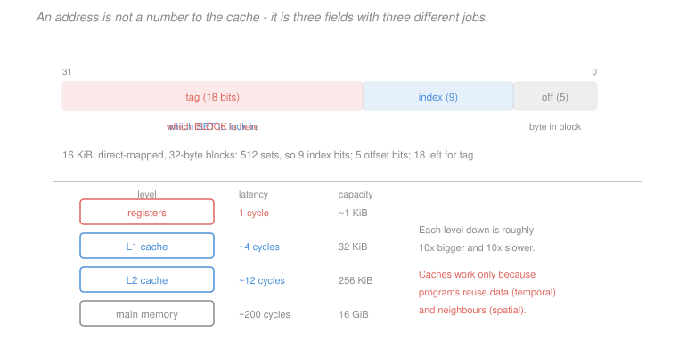

# Computer Architecture · Lesson 4.1: Caches and the principle of locality

> ⏱ ~15 min · Module 4: The memory hierarchy · Builds on: [3.4 (data hazards)](03-04-data-hazards-forwarding-stalls.md) · Unlocks: 4.2 (associativity and the three C's), 4.3 (virtual memory)

## Why this matters

Module 3 assumed memory answers in one cycle. It does not. A DRAM access costs 100 to 300 cycles, and the gap has widened every year since 1980 — processors got roughly 50 percent faster per year for two decades while DRAM latency improved about 7 percent. That divergence is the **memory wall**, and it is the single largest performance problem in computing.

Caches are the answer, and they work for a reason that is not obvious: a small fast memory should not help much, because it can only hold a tiny fraction of the data. It helps enormously because programs do not access memory randomly. Understanding *why* is what lets you write code that is ten times faster while executing exactly the same instructions.

## The idea

Programs exhibit **locality**, in two forms.

**Temporal locality**: a location just accessed is likely to be accessed again soon. Loop counters, the top of the stack, a hot data structure.

**Spatial locality**: a location near one just accessed is likely to be accessed soon. Walking an array, executing straight-line code, reading fields of a struct.

Neither is a law — you can write a program that violates both — but essentially all real programs have them, because loops and arrays and sequential code are how programs are written.

So: keep a small, fast copy of recently used data close to the processor. Temporal locality means the copy gets reused. And when fetching from memory, fetch a whole **block** of neighbouring bytes rather than one word, because spatial locality means the neighbours will be wanted shortly. The block is the unit of transfer, and its size is the knob that trades one kind of locality against the other.

The address then has to be split into three fields answering three questions: which block is this, where might it be stored, and which byte within it.

## The formal version

**Terminology.** A **block** (or line) is the unit of transfer, typically 32 or 64 bytes. A **hit** finds the data in the cache; a **miss** does not and must go to the next level. The **hit rate** is the fraction of accesses that hit; the **miss rate** is $1 - \text{hit rate}$. The **miss penalty** is the extra cycles a miss costs.

**Direct-mapped placement.** Each memory block maps to exactly one cache location:
$$\text{index} = \left(\frac{\text{address}}{\text{block size}}\right) \bmod \text{number of blocks} .$$

Because many memory blocks share an index, each cache entry stores a **tag** — the high address bits — plus a **valid bit** saying whether it holds anything at all.

**Splitting the address.** For a cache of $S$ bytes with $B$-byte blocks, direct-mapped:

$$\text{offset bits} = \log_2 B , \qquad \text{index bits} = \log_2\!\left(\frac{S}{B}\right) , \qquad \text{tag bits} = 32 - \text{index} - \text{offset} .$$

*Worked instance.* A 16 KiB direct-mapped cache with 32-byte blocks:
$$\text{offset} = \log_2 32 = 5, \qquad \text{blocks} = \frac{16384}{32} = 512, \qquad \text{index} = \log_2 512 = 9,$$
$$\text{tag} = 32 - 9 - 5 = 18 .$$

**Reading the fields' jobs.** The **offset** selects a byte inside the block and never leaves the cache. The **index** picks which entry to examine — it is a lookup, not a comparison. The **tag** is compared against the stored tag to decide hit or miss. Only the tag comparison can fail.

**Miss rate from spatial locality.** Walking an array of 4-byte elements with a 32-byte block:
$$\frac{32 \text{ bytes/block}}{4 \text{ bytes/element}} = 8 \text{ elements per block} ,$$
so one miss brings in eight elements and the next seven hit:
$$\text{miss rate} = \frac18 = 12.5\% .$$

The pattern generalises: for a **unit-stride** walk, miss rate is $\dfrac{\text{element size}}{\text{block size}}$.

**Average memory access time.** The single most useful formula in this module:

> $$\mathrm{AMAT} = \text{hit time} + \text{miss rate}\times\text{miss penalty}$$

*Instance.* Hit time 1 cycle, miss rate 12.5 percent, penalty 100 cycles:
$$\mathrm{AMAT} = 1 + 0.125(100) = 13.5 \text{ cycles} .$$

Note how brutal the arithmetic is: a 12.5 percent miss rate turns a 1-cycle memory into a 13.5-cycle one. **Miss rate matters far more than hit time**, because the penalty is two orders of magnitude larger — which is why L1 caches are kept small and fast and the fight against misses happens at levels below.

**The block-size trade-off.** Bigger blocks exploit spatial locality better, lowering the miss rate — up to a point. Past it, three effects reverse the gain: fewer blocks fit, so more of them are evicted; the miss penalty grows because more bytes must be transferred; and bytes are fetched that are never used. Miss rate as a function of block size is U-shaped, with the minimum usually at 32–128 bytes.

**Multi-level caches.** Rather than one compromise cache, use several:

| Level | Typical size | Typical latency |
|---|---|---|
| L1 (split I and D) | 32 KiB each | 4 cycles |
| L2 | 256 KiB–1 MiB | 12 cycles |
| L3 (shared) | 8–32 MiB | 40 cycles |
| DRAM | GiB | 200+ cycles |

L1 is optimised for **latency** (small and fast); lower levels for **miss rate** (large and slower). The L1 split into separate instruction and data caches is exactly the structural requirement [3.1](03-01-single-cycle-datapath.md) identified — the pipeline fetches an instruction and accesses data in the same cycle.

## Picture



The three fields do three different things, and confusing them is the usual source of error: the offset never leaves the cache, the index is an array subscript, and only the tag is ever compared. The hierarchy below shows why the effort is worth it — each step down is about ten times larger and ten times slower, and the cache's job is to keep you at the top of it.

## Worked examples

**Example 1 (mechanical): split an address and classify accesses.** A 4 KiB direct-mapped cache with 16-byte blocks, 32-bit addresses.

$$\text{offset} = \log_2 16 = 4, \qquad \text{blocks} = \frac{4096}{16} = 256, \qquad \text{index} = 8, \qquad \text{tag} = 32-8-4 = 20 .$$

Now trace accesses to addresses `0x1000`, `0x1004`, `0x2000`, `0x1000`:

| Address | tag | index | offset | Result |
|---|---|---|---|---|
| `0x1000` | `0x00001` | `0x00` | 0 | **miss** (cold) — loads the block |
| `0x1004` | `0x00001` | `0x00` | 4 | **hit** — same block |
| `0x2000` | `0x00002` | `0x00` | 0 | **miss** — same index, different tag: evicts the first |
| `0x1000` | `0x00001` | `0x00` | 0 | **miss** — the block was just evicted |

Three misses in four accesses. The third and fourth are instructive: `0x1000` and `0x2000` differ by exactly $2^{12} = 4096$, the cache size, so they land on the same index and fight over one entry. That is a **conflict miss**, and it is the pathology [4.2](04-02-associativity-misses-write-policy.md) fixes with associativity.

**Example 2 (why you'd care): the same loop, ten times slower.** Sum a $1024\times1024$ matrix of 4-byte `int`s, 64-byte blocks.

*Row-major traversal*, `A[i][j]` with `j` innermost. In C, `A[i][j]` and `A[i][j+1]` are adjacent in memory, so consecutive accesses are consecutive addresses:
$$\text{elements per block} = \frac{64}{4} = 16, \qquad \text{miss rate} = \frac{1}{16} = 6.25\% .$$
$$\mathrm{AMAT} = 1 + 0.0625(200) = 13.5 \text{ cycles} .$$

*Column-major traversal*, `A[j][i]` with `i` innermost. Now consecutive accesses are 4096 bytes apart — a whole row. Every access lands in a different block, and by the time the traversal returns to the next element of the first row, that block has long been evicted:
$$\text{miss rate} \approx 100\% , \qquad \mathrm{AMAT} = 1 + 1.0(200) = 201 \text{ cycles} .$$

$$\frac{201}{13.5} = \boxed{14.9\times \text{ slower}}$$

**Identical instructions, identical instruction count, identical results.** The only difference is the order of two nested loops, and it costs a factor of fifteen.

Three things follow. This is the sharpest possible demonstration of [1.1](01-01-isa-contract-stored-program.md)'s point that performance lives entirely below the ISA — nothing in the contract distinguishes these two programs. It is why **loop interchange** is a standard compiler optimisation and why numerical libraries are written with memory layout as the primary consideration. And it explains why the fix is *blocking* (tiling): restructure the computation to work on sub-matrices small enough to stay resident, converting capacity misses into hits.

## Watch out

- **You might think** a cache helps because it is faster — **but actually** it helps because of *locality*. A program with no locality gets no benefit at all: the cache is faster per access but every access misses, so you pay the hit time *plus* the full penalty on every reference, which is worse than no cache.
- **You might think** the index selects data — **but actually** it selects a *place to look*, and the tag comparison decides whether what is there is what you wanted. Many different addresses share an index; that is the whole reason tags exist.
- **You might think** bigger blocks are always better for spatial locality — **but actually** the relationship is U-shaped. Past the optimum, fewer blocks fit, the penalty grows, and you fetch bytes you never use. A 4 KiB block would be catastrophic.

## One-liner

> Caches work because programs reuse data and their neighbours, not because they are fast — so the address splits into a tag to compare, an index to look up and an offset to select, and $\mathrm{AMAT} = \text{hit time} + \text{miss rate}\times\text{penalty}$ is dominated by the miss rate.

## Problems

**P1 (🟢)** A 32 KiB direct-mapped cache has 64-byte blocks and 32-bit addresses. Give the offset, index and tag widths, and the number of blocks. Then give the steady-state miss rate for a unit-stride walk over an array of 8-byte `double`s, and the AMAT with a 2-cycle hit time and a 150-cycle penalty.

**P2 (🟡)** For an 8 KiB direct-mapped cache with 32-byte blocks, classify each access as hit or miss and give the reason: `0x0000`, `0x0010`, `0x2000`, `0x0000`, `0x0020`. State which pair of addresses conflicts and why.

**P3 (🔴, optional)** A loop walks an array with stride $s$ elements (4-byte elements, 64-byte blocks). (a) Give the miss rate as a function of $s$ for $s = 1, 2, 4, 16, 32$. (b) At what stride does the miss rate saturate at 100 percent, and why does increasing the stride beyond that point not make things worse? (c) The array is 1 MiB and the cache is 32 KiB. Explain why a stride-16 walk might still perform far worse than the formula predicts.

<details>
<summary>Solutions</summary>

**P1** *Address split.*
$$\text{offset} = \log_2 64 = \boxed{6} , \qquad \text{blocks} = \frac{32768}{64} = \boxed{512} ,$$
$$\text{index} = \log_2 512 = \boxed{9} , \qquad \text{tag} = 32 - 9 - 6 = \boxed{17} .$$

*Miss rate for a unit-stride walk over 8-byte doubles.*
$$\text{doubles per block} = \frac{64}{8} = 8 \quad\Longrightarrow\quad \text{miss rate} = \frac18 = \boxed{12.5\%} .$$
One miss brings in eight doubles; the following seven accesses hit.

*AMAT.*
$$\mathrm{AMAT} = 2 + 0.125(150) = 2 + 18.75 = \boxed{20.75 \text{ cycles}} .$$

Note the shape of that number: the hit time contributes 2 and the misses contribute 18.75 — nearly ten times as much, from a miss rate of only one in eight. This is the lesson's central point in one calculation, and it is why doubling the L1 hit time to halve the miss rate is usually a good trade.

**P2** An 8 KiB direct-mapped cache with 32-byte blocks:
$$\text{offset} = 5, \qquad \text{blocks} = \frac{8192}{32} = 256, \qquad \text{index} = 8, \qquad \text{tag} = 19 .$$

The index is address bits 12:5, the offset bits 4:0.

| Address | binary (low 16) | tag bits | index | offset | Result |
|---|---|---|---|---|---|
| `0x0000` | `0000 0000 0000 0000` | 0 | `0x00` | 0 | **miss** — cold, loads block |
| `0x0010` | `0000 0000 0001 0000` | 0 | `0x00` | 16 | **hit** — same block (offset 16 < 32) |
| `0x2000` | `0010 0000 0000 0000` | **1** | `0x00` | 0 | **miss** — same index, different tag; evicts |
| `0x0000` | | 0 | `0x00` | 0 | **miss** — was just evicted by `0x2000` |
| `0x0020` | `0000 0000 0010 0000` | 0 | `0x01` | 0 | **miss** — cold, different index |

Four misses, one hit.

*Which pair conflicts.* **`0x0000` and `0x2000`.** They differ by $\texttt{0x2000} = 8192$ bytes, which is exactly the cache size — so they have identical index bits (both `0x00`) but different tags, and a direct-mapped cache has only one place to put either. They evict each other on every alternation.

This is the classic **conflict miss**, and note it has nothing to do with capacity: the cache holds 256 blocks and this trace touches only three. A 2-way set-associative cache of the same size would hold both and turn the last two misses into hits, which is exactly [4.2](04-02-associativity-misses-write-policy.md)'s argument.

The `0x0020` access is worth a second look — it differs from `0x0000` by only 32 bytes, which is one block, so it lands on index `0x01` and does not conflict with anything. Adjacent-but-different blocks are fine; it is addresses separated by a multiple of the cache size that collide.

**P3** *(a) Miss rate by stride.* With 4-byte elements and 64-byte blocks, a block holds 16 elements. A stride-$s$ walk touches every $s$-th element, so it uses $\lceil 16/s \rceil$ elements per block it loads:
$$\text{miss rate} = \min\!\left(\frac{s}{16},\ 1\right)$$

| stride $s$ | elements used per block | miss rate |
|---|---|---|
| 1 | 16 | $1/16 = 6.25\%$ |
| 2 | 8 | $2/16 = 12.5\%$ |
| 4 | 4 | $4/16 = 25\%$ |
| 16 | 1 | $16/16 = \mathbf{100\%}$ |
| 32 | 1 | $\mathbf{100\%}$ |

*(b) Saturation.* The miss rate reaches 100 percent at $s = 16$, the number of elements per block. At that stride, consecutive accesses are exactly 64 bytes apart, so each lands in a **different block** and every access misses.

Increasing the stride further cannot make the miss rate worse **because it is already 1** — you cannot miss more than once per access. What *does* keep getting worse is the **efficiency**: at stride 16 you use 4 of every 64 bytes fetched (6.25 percent); at stride 32 you use 4 of every 128 bytes fetched across two blocks, so the memory bandwidth wasted per useful byte doubles even though the miss rate is unchanged. Miss rate stops being the right metric past saturation; **bytes fetched per byte used** is the one that keeps degrading.

*(c) Why stride-16 may be far worse than predicted.* Two effects the simple formula ignores.

**Conflict misses from power-of-two strides.** A stride of 16 elements is 64 bytes; walking with that stride through a 1 MiB array touches addresses at regular power-of-two spacing. In a 32 KiB direct-mapped cache (512 blocks), addresses 32 KiB apart share an index — so elements $\texttt{A[0]}$, $\texttt{A[8192]}$, $\texttt{A[16384]}$ and so on all map to the same set and evict each other. Power-of-two strides are pathological for direct-mapped caches, which is why array dimensions are often padded to avoid them (declaring `A[1024][1025]` rather than `A[1024][1024]` is a real and widely used trick).

**TLB misses.** The array is 1 MiB and pages are typically 4 KiB, so it spans 256 pages. A stride-16 walk moves 64 bytes per access, crossing a page boundary every 64 accesses — and if the TLB holds only 64 entries, the walk cycles through more pages than the TLB can hold, so translations start missing too ([4.3](04-03-virtual-memory-and-the-tlb.md)). Each TLB miss costs a page-table walk on top of the cache miss.

The general lesson: **the simple miss-rate formula assumes an infinite, fully-associative cache and free translation.** Real strided access patterns interact with associativity, cache size and the TLB in ways that can multiply the predicted cost several times over, and power-of-two strides are the worst case for all three at once.

</details>

## Flashback

**From Lesson 3.4 (data hazards — forwarding and stalls):** For this sequence with full forwarding, list every RAW dependence with its distance, say how each is resolved, and give the total cycles in a 5-stage pipeline.
```
lw   x1, 0(x2)
lw   x3, 4(x2)
add  x4, x1, x3
sub  x5, x4, x1
```

<details>
<summary>Solution</summary>

*Dependences.*

| Dependence | Register | Distance | Resolution |
|---|---|---|---|
| `lw x1` → `add` | `x1` | 2 | MEM/WB → EX forwarding, **no stall** |
| `lw x3` → `add` | `x3` | 1 | **load-use: forward + 1 stall** |
| `add` → `sub` | `x4` | 1 | EX/MEM → EX forwarding, no stall |
| `lw x1` → `sub` | `x1` | 3 | no forwarding needed — write in the first half of the cycle, read in the second |

*Cycles.* Four instructions ideally take $5 + (4-1) = 8$; one load-use stall adds one:
$$\boxed{9 \text{ cycles}}$$

Two details worth drawing out.

The **first** load creates no stall even though `add` depends on it, because the two loads sit between them — at distance 2 the value has reached MEM/WB by the time `add` needs it. Only the **second** load, immediately before `add`, causes the bubble. This is why [3.4](03-04-data-hazards-forwarding-stalls.md)'s scheduling advice works: separating a load from its consumer by even one instruction eliminates the stall entirely, and here the code has *accidentally* done that for `x1` while failing to do it for `x3`.

The `lw x1` → `sub` dependence at distance 3 needs no forwarding hardware at all. The writer is in WB while the reader is in ID, and the "write in the first half, read in the second" convention from [3.3](03-03-pipelining-and-the-pipelined-datapath.md) means the register file already returns the new value. Distance 3 and beyond are free.

Connecting to this lesson: that single stall assumed both loads **hit** in the cache. If either misses, the penalty is not one cycle but a hundred or more, and no forwarding path or compiler schedule can cover it — which is why Module 4 exists, and why [5.2](05-02-instruction-level-parallelism.md)'s out-of-order execution becomes necessary to find enough independent work to fill a 200-cycle hole.

</details>

## Connections

- **Backward:** the memory access that [3.1](03-01-single-cycle-datapath.md) drew as a single block and [3.3](03-03-pipelining-and-the-pipelined-datapath.md) gave one pipeline stage turns out to be the most expensive thing in the machine. The split L1 instruction and data caches are the structural requirement [3.1](03-01-single-cycle-datapath.md) identified. The array-walking pattern whose locality this exploits is [1.3](01-03-arithmetic-logic-data-transfer.md)'s shift-add-load idiom.
- **Forward:** [4.2](04-02-associativity-misses-write-policy.md) attacks the conflict misses Example 1 exposed, and classifies misses into the three C's. [4.3](04-03-virtual-memory-and-the-tlb.md) adds address translation, which is itself cached for the same reason. The AMAT formula feeds directly into [5.1](05-01-measuring-performance-cpi-amdahl.md)'s CPI calculation, where memory stalls become the dominant term for most real programs.
- **Sideways:** the locality principle is not specific to hardware — it is why databases buffer pages, why web caches work, and why operating systems keep a page cache. Anywhere a fast small store fronts a slow large one, the same two forms of locality and the same AMAT arithmetic apply, and [`operating-systems`](../../operating-systems/syllabus.md) will meet them again one level up.
