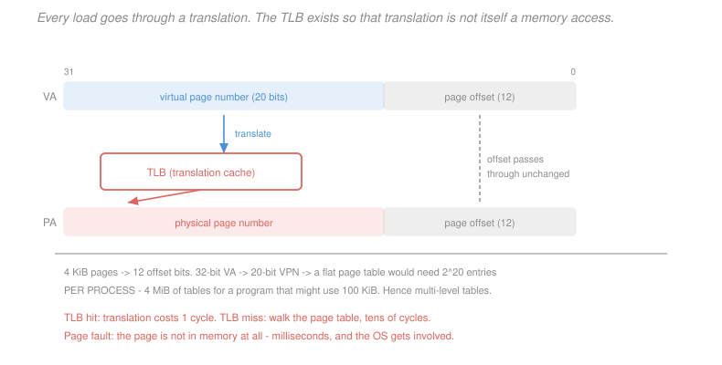

# Computer Architecture · Lesson 4.3: Virtual memory and the TLB

> ⏱ ~15 min · Module 4: The memory hierarchy · Builds on: [3.5 (control hazards)](03-05-control-hazards-and-branch-prediction.md), [4.2 (associativity and write policy)](04-02-associativity-misses-write-policy.md) · Unlocks: 4.4 (storage and I/O), 5.1 (measuring performance)

## Why this matters

Every address your program uses is a lie. The `0x1000` in a load instruction is not where the data sits in DRAM; it is a **virtual** address that hardware translates on every single access.

That indirection buys three things at once, and each would justify it alone: programs get a private address space so one cannot read or corrupt another; a program can use more memory than physically exists; and code can be compiled to fixed addresses without knowing where it will be loaded. Virtual memory is what makes multiprogramming, process isolation and dynamic linking possible.

The cost is a translation on every access — and if that translation itself required a memory lookup, every load would cost two. The TLB is the cache that prevents this, and it is why the whole scheme is affordable.

## The idea

Chop the address space into fixed-size **pages**, typically 4 KiB. A **page table** maps each virtual page to a physical page, or records that it is not in memory at all.

Splitting the address is the same trick as [4.1](04-01-caches-and-locality.md)'s cache: the low bits select a byte *within* a page and pass through translation untouched; the high bits name the page and get translated. With 4 KiB pages, the low 12 bits are the offset and the top 20 are the **virtual page number**.

The problem is that the page table lives in memory, so a naive implementation doubles every memory access — one to read the translation, one to read the data. Unacceptable.

The fix is the lesson of [4.1](04-01-caches-and-locality.md) applied one level up: **cache the translations.** Page-table entries have excellent locality, because a program touching one address on a page will touch that page again shortly. A small, fast, highly associative cache of recent translations — the **TLB** — hits well over 99 percent of the time, so translation usually costs nothing.

## The formal version

**Address split.** With page size $P$:
$$\text{offset bits} = \log_2 P , \qquad \text{VPN bits} = 32 - \log_2 P .$$

*Instance.* 4 KiB pages, 32-bit addresses:
$$\text{offset} = \log_2 4096 = 12, \qquad \text{VPN} = 20 .$$

Translation maps the 20-bit VPN to a physical page number; the 12-bit offset is copied through unchanged. **Pages are aligned**, which is why the offset never needs translating.

**Page table entries** hold the physical page number plus control bits:

| Bit | Meaning |
|---|---|
| valid | is this page in physical memory? |
| dirty | has it been written since being loaded? |
| reference | has it been touched recently? (for replacement) |
| protection | readable, writable, executable |

The protection bits are how a page can be made read-only or non-executable — the hardware basis for memory safety, and for the `W^X` policy that mitigates code injection.

**Page tables are enormous.** A flat table needs one entry per virtual page:
$$2^{20} \text{ entries} \times 4 \text{ bytes} = 4 \text{ MiB} \quad\textbf{per process} ,$$
for a program that may use 100 KiB. Since the address space is mostly empty, the table is mostly wasted.

> **Multi-level page tables.** Split the VPN into pieces. A two-level scheme splits 20 bits into 10 and 10: the first indexes a directory of 1024 entries; each entry points to a second-level table of 1024 entries covering 4 MiB of address space.

Unused regions have a null directory entry and **no second-level table at all**, so a small program needs one directory plus a couple of tables — roughly 12 KiB instead of 4 MiB. The cost is more memory references on a walk: two-level needs two, and 64-bit systems use four levels needing four.

**The TLB.**

> A small cache of recent virtual-to-physical translations, typically 64–512 entries, **fully associative** or highly associative.

Fully associative is unusual and deliberate. The TLB is tiny, so comparing all entries is affordable — and a conflict miss here would be far more expensive than in a data cache, since it triggers a full page-table walk. This is [4.2](04-02-associativity-misses-write-policy.md)'s trade evaluated at a different point: when the penalty is enormous and the structure is small, maximum associativity is worth its cost.

**The three outcomes of an access.**

| Outcome | Cost | Handled by |
|---|---|---|
| **TLB hit** | ~0 extra cycles | hardware |
| **TLB miss, page in memory** | tens of cycles (page-table walk) | hardware or OS |
| **Page fault** | milliseconds | **OS** — must fetch from disk |

The scale difference is the thing to internalise. A page fault is roughly $10^6$ times more expensive than a TLB hit, which is why the OS deschedules the process rather than waiting.

**Virtually indexed, physically tagged.** A subtlety worth knowing. Translation and cache lookup are both on the critical path, and doing them in series is slow. The standard trick: **index the L1 cache with the page offset** — which does not require translation — while the TLB translates the VPN in parallel, then compare the physical tag.

This works only if the cache index fits inside the page offset:
$$\frac{\text{cache size}}{\text{associativity}} \le \text{page size} .$$

With 4 KiB pages, an 8-way L1 can be at most 32 KiB. **That constraint is the reason L1 caches have been stuck near 32 KiB for two decades** — not manufacturing cost, but a structural interaction between page size and cache indexing.

**Context switches.** Each process has its own page table, so switching processes invalidates the TLB — a real cost, and why modern designs tag TLB entries with an address-space identifier so entries survive a switch.

## Picture

The vertical dashed line is the important part: **the offset is not translated.** Only the page number goes through the TLB, which is why pages must be aligned and why the offset width determines the page size. Everything below the figure is the cost table — a TLB hit is free, a walk is tens of cycles, and a page fault is a different universe.

## Worked examples

**Example 1 (mechanical): translate an address.** A system has 4 KiB pages and this TLB:

| VPN | PPN | valid |
|---|---|---|
| `0x00003` | `0x0012` | 1 |
| `0x0000A` | `0x0007` | 1 |
| `0x00010` | `0x0025` | 0 |

Translate virtual address `0x0000A7F4`.

*Step 1 — split.* With 12 offset bits, the low three hex digits are the offset and the rest is the VPN:
$$\text{VPN} = \texttt{0x0000A}, \qquad \text{offset} = \texttt{0x7F4} .$$

*Step 2 — look up.* VPN `0x0000A` is present and valid, mapping to PPN `0x0007`. **TLB hit.**

*Step 3 — concatenate.* Physical page `0x0007` shifted up 12 bits, plus the unchanged offset:
$$\text{PA} = \texttt{0x00007} \ll 12 \ \vert\ \texttt{0x7F4} = \boxed{\texttt{0x000077F4}}$$

Now translate `0x00010123`. VPN `0x00010` is in the TLB but its **valid bit is 0** — the entry is stale, so this is a TLB miss requiring a page-table walk. If the page table also shows it invalid, it is a **page fault** and the OS must load the page from disk.

Note that the offset `0x7F4` = 2036 is less than 4096, as it must be — an offset that overflowed the page size would mean the split was done wrong.

**Example 2 (why you'd care): TLB reach and why big pages exist.** A TLB with 64 entries and 4 KiB pages can map
$$64 \times 4\text{ KiB} = 256 \text{ KiB}$$
of memory without a miss. That is its **reach**, and it is small.

Now consider a program walking a 100 MiB array sequentially. It touches
$$\frac{100 \times 2^{20}}{4096} = 25600 \text{ pages} ,$$
far beyond a 64-entry TLB — so the TLB thrashes, missing on every new page. With 4096 bytes per page and, say, 4-byte elements, one TLB miss occurs per 1024 accesses. At 30 cycles per walk:
$$\text{added cycles per access} = \frac{30}{1024} \approx 0.029 ,$$
which sounds negligible. But for a **stride-1024** walk touching one element per page, there is a TLB miss on *every* access:
$$\text{added cost} = 30 \text{ cycles per access} ,$$
often exceeding the cache miss cost itself.

**Huge pages** fix this. Switching to 2 MiB pages raises the reach to
$$64 \times 2\text{ MiB} = 128 \text{ MiB} ,$$
a **512x improvement**, and the entire 100 MiB array now fits in the TLB. Databases, scientific codes and virtual-machine hosts routinely enable huge pages for exactly this reason, and the gains on large-footprint workloads are commonly 10–30 percent.

The costs are real too: internal fragmentation (a process needing 100 KiB is given 2 MiB), longer page-fault latency, and less flexible memory management. It is a genuine trade, decided per workload rather than universally — which is why operating systems expose it as a tunable rather than a default.

## Watch out

- **You might think** the page offset gets translated along with the rest — **but actually** it passes through untouched, which is precisely what makes pages aligned and lets the L1 cache be indexed before translation finishes. Translating the offset would break both properties.
- **You might think** a TLB miss and a page fault are the same event — **but actually** they differ by six orders of magnitude. A TLB miss means the translation is not cached but the page is in memory (tens of cycles, hardware-handled). A page fault means the page is on disk (milliseconds, OS-handled, the process is descheduled).
- **You might think** L1 caches stay small because larger ones cost too much — **but actually** the binding constraint is usually $\text{size}/\text{associativity} \le \text{page size}$, needed for virtually-indexed physically-tagged lookup. That is why L1 grew in *associativity* rather than capacity as transistor budgets rose.

## One-liner

> Every access translates a virtual page number to a physical one while the offset passes through untouched — and since the page table lives in memory, a TLB caches recent translations so the indirection is usually free, with a miss costing tens of cycles and a page fault costing millions.

## Problems

**P1 (🟢)** A system has 8 KiB pages and 32-bit virtual addresses. (a) Give the offset and VPN widths. (b) Translate `0x0004C3A8` given a TLB entry mapping VPN `0x00026` to PPN `0x0011`. (c) How many entries would a flat page table need?

**P2 (🟡)** A TLB has 128 entries and the system uses 4 KiB pages. (a) Give the TLB reach. (b) A program's working set is 8 MiB — how many pages, and will it fit in the TLB? (c) With 2 MiB huge pages, give the new reach and say whether the working set fits.

**P3 (🔴, optional)** A machine has a 99.5 percent TLB hit rate, a 30-cycle page-table walk, and a page-fault rate of $10^{-7}$ per access with a 5 ms service time at 2 GHz. (a) Compute the average translation cost in cycles. (b) Which term dominates, and by how much? (c) Comment on what this implies about where to spend engineering effort.

Solutions

**P1** *(a) Address split.* With 8 KiB pages:
$$\text{offset} = \log_2 8192 = \boxed{13 \text{ bits}}, \qquad \text{VPN} = 32 - 13 = \boxed{19 \text{ bits}} .$$

*(b) Translate `0x0004C3A8`.* Write the address in binary to split at bit 13 — hex digits do not align with a 13-bit boundary, so this needs care:
$$\texttt{0x0004C3A8} = \texttt{0000 0000 0000 0100 1100 0011 1010 1000}_2$$

The low **13** bits are the offset:
$$\text{offset} = \texttt{0 0011 1010 1000}_2 = \texttt{0x03A8} = 936 ,$$
and the top 19 bits are the VPN:
$$\text{VPN} = \texttt{000 0000 0000 0010 0110}_2 = \texttt{0x00026} \ \checkmark$$

That matches the given TLB entry, so it is a **hit** with PPN `0x0011`. The physical address is the PPN shifted up 13 bits, OR the offset:
$$\text{PA} = (\texttt{0x00011} \ll 13) \ \vert\ \texttt{0x03A8} = \texttt{0x22000} + \texttt{0x3A8} = \boxed{\texttt{0x000223A8}}$$

*(c) Flat page table entries.* One per virtual page:
$$2^{19} = \boxed{524{,}288 \text{ entries}} ,$$
which at 4 bytes each is 2 MiB per process — still far too large to allocate eagerly, which is why multi-level tables are used even with 8 KiB pages.

**P2** *(a) TLB reach.*
$$128 \times 4 \text{ KiB} = 512 \text{ KiB} = \boxed{0.5 \text{ MiB}}$$

*(b) An 8 MiB working set.*
$$\frac{8 \times 2^{20}}{4096} = 2048 \text{ pages} .$$
The TLB holds 128 entries, so it covers $128/2048 = 6.25$ percent of the working set. **It does not fit** — by a factor of 16 — so a program touching the whole set repeatedly will thrash the TLB, missing on most accesses to newly-touched pages.

*(c) With 2 MiB huge pages.*
$$\text{reach} = 128 \times 2 \text{ MiB} = \boxed{256 \text{ MiB}} ,$$
and the working set now occupies
$$\frac{8 \text{ MiB}}{2 \text{ MiB}} = 4 \text{ pages} .$$
**It fits comfortably**, using 4 of 128 entries. The TLB miss rate drops to essentially zero after the first four touches.

This is a 512x reach improvement from one configuration change, and it costs nothing in this case because the working set is a contiguous 8 MiB — no internal fragmentation to speak of. It is exactly the situation where huge pages are an easy win, and why database and JVM tuning guides recommend them for large heaps.

**P3** *(a) Average translation cost.* Three outcomes with three costs. Working in cycles at 2 GHz, a 5 ms fault is
$$5\times 10^{-3} \text{ s} \times 2\times 10^9 \text{ cycles/s} = 10^7 \text{ cycles} .$$

| Outcome | Probability | Cost | Contribution |
|---|---|---|---|
| TLB hit | $0.995$ | 0 | $0$ |
| TLB miss, walk | $0.005 - 10^{-7} \approx 0.005$ | 30 | $0.15$ |
| page fault | $10^{-7}$ | $10^7$ | $1.0$ |

$$\text{average} = 0 + 0.15 + 1.0 = \boxed{1.15 \text{ cycles per access}}$$

*(b) Which term dominates.* The **page-fault term**, at 1.0 cycles against the walk's 0.15 — about **6.7 times larger** — despite page faults being 50,000 times rarer than TLB misses ($10^{-7}$ against $5\times10^{-3}$).

The reason is the cost asymmetry: a fault costs $10^7$ cycles against a walk's 30, a ratio of about 330,000, which overwhelms the 50,000x difference in frequency by a factor of about 6.7.

*(c) Where to spend effort.* This is the useful part, and the naive reading is wrong.

The arithmetic says page faults dominate, so it *looks* like fault handling deserves the attention. But notice how small the total is: **1.15 cycles of average translation overhead**, against memory accesses that cost 4–200 cycles anyway ([4.1](04-01-caches-and-locality.md), [4.2](04-02-associativity-misses-write-policy.md)). Translation is not the bottleneck at all — the whole mechanism is doing its job.

The right conclusions are two, and they are about *sensitivity* rather than current cost:

1. **Guard the page-fault rate above all.** At $10^{-7}$ it contributes 1 cycle; at $10^{-5}$ it would contribute 100 cycles and dominate everything in the machine. The fault term is a cliff, not a slope, which is why operating systems work so hard to avoid thrashing and why adding physical memory to a swapping system produces such dramatic improvements. A doubling of the TLB, by contrast, could at best recover 0.15 cycles.
2. **The TLB is already good enough.** Improving the hit rate from 99.5 to 99.9 percent would save $0.004\times 30 = 0.12$ cycles — real but tiny. Effort there is better spent on the *reach* problem of Example 2, where a workload with poor TLB behaviour sees miss rates far worse than 0.5 percent and huge pages deliver 10–30 percent.

The general principle, and it recurs in [5.1](05-01-measuring-performance-cpi-amdahl.md): **a term that is currently small but has enormous per-event cost is a risk to be bounded, not an optimisation target.** Compute the sensitivity, not just the current contribution.

## Flashback

**From Lesson 3.5 (control hazards and branch prediction):** A machine has 22 percent branches, a 3-cycle misprediction penalty, and a 2-bit predictor achieving 92 percent accuracy. (a) Give the CPI. (b) An inner loop of 5 iterations is entered 200 times — count the mispredictions and the rate for a 1-bit and a 2-bit predictor. (c) Explain why the 1-bit predictor does worse than always-taken here.

Solution

*(a) CPI.* The misprediction rate is $1 - 0.92 = 0.08$:
$$\mathrm{CPI} = 1 + b\,m\,p = 1 + 0.22(0.08)(3) = 1 + 0.0528 = \boxed{1.0528}$$

*(b) Mispredictions on the loop.* The loop branch executes $200 \times 5 = 1000$ times, taken 4 times and not taken once per traversal.

**1-bit predictor.** Two misses per traversal — the exit (predicted taken, actually exits) and then the first iteration of the *next* traversal (the bit now says not-taken, but the loop is taken). The very first traversal has no predecessor to mispredict:
$$200\times 2 - 1 = 399 , \qquad \text{rate} = \frac{399}{1000} = \boxed{39.9\%}$$

**2-bit predictor** (starting strongly-taken). The exit miss moves the counter from strongly-taken to weakly-taken, which **still predicts taken**, so the next traversal's first iteration is correct:
$$200 , \qquad \text{rate} = \frac{200}{1000} = \boxed{20\%}$$

*(c) Why 1-bit loses to always-taken.* A static always-taken policy is wrong exactly once per traversal — on the exit — giving 200 mispredictions and a 20 percent rate, **identical to the 2-bit predictor and half the 1-bit predictor's**.

The 1-bit predictor's extra miss is entirely self-inflicted. After the exit, its single bit records "not taken", which is the correct prediction for exactly one branch execution that will not occur for a long time. When the loop is re-entered, that stale bit causes a second misprediction before the predictor recovers. It is *adapting to noise* — treating a single anomalous outcome as a change in behaviour.

The 2-bit counter's hysteresis is precisely the fix: requiring two consecutive surprises before changing the prediction means one anomalous iteration cannot flip it. That is why [3.5](03-05-control-hazards-and-branch-prediction.md) described the second bit as fixing a specific pathology rather than as a refinement.

And note the loop length matters, exactly as [3.5](03-05-control-hazards-and-branch-prediction.md) P2 showed: at 5 iterations the rates are 39.9 and 20 percent, a gap of 20 points; at 100 iterations they would be 2.0 and 1.0 percent, a gap of one point. **Short loops are where prediction is hardest**, because the one anomalous iteration is a large share of the total.

## Connections

- **Backward:** the TLB is [4.1](04-01-caches-and-locality.md)'s caching idea applied to translations, and its fully-associative organisation is [4.2](04-02-associativity-misses-write-policy.md)'s trade evaluated where the miss penalty is huge and the structure is tiny. The stack region of [1.5](01-05-procedures-stack-calling-convention.md) is one of the mappings a page table maintains, grown on demand by the page-fault handler.
- **Forward:** [4.4](04-04-storage-and-io.md) covers the disk that a page fault reaches, and why its latency forces the OS to deschedule rather than wait. The page-fault cost feeds [5.1](05-01-measuring-performance-cpi-amdahl.md)'s CPI accounting as the largest single stall a program can suffer.
- **Sideways:** virtual memory is the hardware mechanism [`operating-systems`](../../operating-systems/syllabus.md) builds process isolation on — the protection bits here are what make a segmentation fault a fault rather than a silent corruption, and the same page tables implement copy-on-write, memory-mapped files and shared libraries. It is the clearest case in the course of a hardware feature existing to serve an operating-system abstraction.
