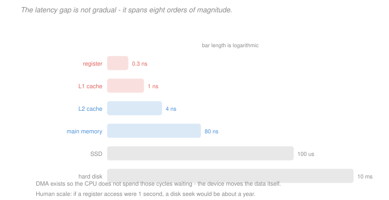

# Computer Architecture · Lesson 4.4: Storage and I/O

> ⏱ ~15 min · Module 4: The memory hierarchy · Builds on: [4.2 (associativity and write policy)](04-02-associativity-misses-write-policy.md) · Unlocks: 5.1 (measuring performance), 5.2 (instruction-level parallelism)

## Why this matters

[4.3](04-03-virtual-memory-and-the-tlb.md) ended with a page fault reaching "disk" and costing milliseconds. This lesson is about what sits out there, and about the mechanisms that keep the processor from wasting those millions of cycles waiting.

The numbers are the point. Registers to disk spans roughly eight orders of magnitude in latency — a range so large that the strategies for coping with it are qualitatively different at each end. A cache miss is handled by hardware in nanoseconds; a disk access is handled by the *operating system*, which deschedules the process entirely and runs something else. Understanding where those regime boundaries fall is what makes system-level performance reasoning possible.

## The idea

The memory hierarchy does not stop at DRAM. Below it sit solid-state drives and, further still, spinning disks — each roughly a thousand times slower and a thousand times cheaper per byte than the level above.

Two numbers describe any level, and they behave very differently. **Latency** is how long one access takes. **Bandwidth** is how much data moves per second. Latency has improved slowly and grudgingly across the history of computing; bandwidth has improved enormously. That divergence shapes every design decision down here: you cannot make an access faster, so you arrange to need fewer of them and to make each one bigger.

The second idea is about who does the waiting. Having the processor poll a device for milliseconds is an obvious waste. **Interrupts** let it do other work and be told when the device is ready. **DMA** goes further and removes the processor from the transfer entirely — the device writes directly into memory and interrupts once at the end.

## The formal version

**The full hierarchy**, with representative numbers:

| Level | Latency | Bandwidth | Capacity | Cost per GB |
|---|---|---|---|---|
| register | 0.3 ns | — | ~1 KiB | — |
| L1 cache | 1 ns | 1 TB/s | 32 KiB | — |
| L2 cache | 4 ns | 500 GB/s | 256 KiB | — |
| L3 cache | 20 ns | 200 GB/s | 16 MiB | — |
| DRAM | 80 ns | 50 GB/s | 32 GiB | ~4 dollars |
| SSD (NVMe) | 100 microseconds | 5 GB/s | 2 TiB | ~0.10 dollars |
| hard disk | 10 ms | 200 MB/s | 20 TiB | ~0.02 dollars |

Two ratios worth memorising: DRAM is about **100x** slower than L1, and an SSD is about **1000x** slower than DRAM.

**Latency versus bandwidth.** The distinction matters because they are improved by different means and hit different limits.

$$\text{transfer time} = \text{latency} + \frac{\text{bytes}}{\text{bandwidth}}$$

For small transfers the first term dominates and bandwidth is irrelevant; for large ones the reverse. A disk with 10 ms latency and 200 MB/s bandwidth takes 10.02 ms for 4 KiB and 15 ms for 1 MB — **250 times the data for 1.5 times the time.** That is why disks are read in large blocks and why the OS reads ahead.

**Disk mechanics.** A hard disk's latency decomposes into three parts:
$$T_{\text{access}} = \underbrace{T_{\text{seek}}}_{\text{move the arm}} + \underbrace{T_{\text{rotation}}}_{\text{wait for the sector}} + \underbrace{T_{\text{transfer}}}_{\text{read the bytes}}$$

Average rotational latency is half a revolution: at 7200 rpm, one revolution is $60/7200 = 8.33$ ms, so the average wait is **4.17 ms**. Seek time is typically 4–10 ms. Both are *mechanical*, which is why disk latency stopped improving decades ago while capacity kept growing.

**SSDs** have no moving parts, so no seek or rotation — latency is dominated by flash-controller overhead. But they have their own asymmetry: reads are fast, writes are slower, and flash can only be **erased in large blocks**, so a small write may force a read-modify-erase-write cycle. Wear levelling and garbage collection make SSD write latency variable in a way DRAM never is.

**Connecting devices.** Three mechanisms, in increasing order of sophistication:

> **Polling.** The processor repeatedly reads a status register until the device is ready. Simple, and wastes every cycle spent looping.
> **Interrupts.** The device raises a signal; the processor stops, saves state, runs a handler, and resumes. Costs a context switch — hundreds of cycles — but frees the processor meanwhile.
> **DMA.** The processor programs a DMA controller with an address, a length and a direction, then goes away. The controller moves the data and interrupts once at completion.

DMA is what makes high-bandwidth I/O possible. Without it, transferring 1 MB at 4 bytes per instruction would cost 262,144 loads and stores; with it, the cost is a few instructions to set up plus one interrupt.

**Memory-mapped I/O.** Rather than special instructions, device registers are assigned physical addresses, and ordinary `lw`/`sw` ([1.3](01-03-arithmetic-logic-data-transfer.md)) read and write them. RISC-V uses this exclusively — there are no I/O instructions in the ISA.

This is elegant and has one trap: those addresses **must not be cached**, since a device register's value can change without the processor writing it, and a write must actually reach the device rather than sitting dirty in a cache. Page-table bits from [4.3](04-03-virtual-memory-and-the-tlb.md) mark such pages uncacheable.

**Why a page fault deschedules the process.** At 2 GHz, a 10 ms disk access is $2\times 10^7$ cycles. Spinning would waste twenty million cycles; the OS instead saves the process's state, runs something else, and resumes it when the data arrives. **That policy choice is forced by the latency ratio**, and it is the boundary between hardware-handled and software-handled misses.

**Amdahl's I/O corollary.** Speeding up computation does nothing for a program dominated by I/O. A workload spending 90 percent of its time waiting on disk gains at most 11 percent from an infinitely fast processor — which is why storage improvements often matter more than CPU improvements, and why the SSD transition changed real-world performance more than several processor generations did.

## Picture

The bars are logarithmic, which is the only way to draw this at all — on a linear scale the register bar would be invisible if the disk bar fit on the page. The caption's analogy is worth holding: scaled so a register access takes one second, an L1 hit takes 3 seconds, DRAM takes 4 minutes, an SSD takes 4 days, and a disk seek takes about **a year**.

## Worked examples

**Example 1 (mechanical): disk access time.** A 7200 rpm disk has an average seek of 5 ms and a transfer rate of 150 MB/s. Compute the time to read 8 KiB.

*Rotational latency* — half a revolution on average:
$$\frac{60 \text{ s/min}}{7200 \text{ rpm}} = 8.333 \text{ ms per revolution}, \qquad \frac{8.333}{2} = 4.167 \text{ ms} .$$

*Transfer time:*
$$\frac{8192 \text{ bytes}}{150\times 10^6 \text{ bytes/s}} = 54.6 \text{ microseconds} = 0.055 \text{ ms} .$$

*Total:*
$$5 + 4.167 + 0.055 = \boxed{9.22 \text{ ms}}$$

**The transfer is 0.6 percent of the time.** Over 99 percent is spent positioning — mechanical delay that no amount of data-rate improvement touches. This is why reading 64 KiB instead of 8 KiB costs almost nothing extra (9.60 ms, a 4 percent increase for 8 times the data) and why filesystems use large blocks and aggressive read-ahead.

**Example 2 (why you'd care): where the time actually goes.** A program makes $10^9$ memory accesses. The L1 miss rate is 2 percent, the L2 local miss rate is 20 percent, and one access in $10^6$ causes a page fault. Latencies: L1 1 cycle, L2 12 cycles, DRAM 200 cycles, disk 10 ms at 2 GHz ($2\times10^7$ cycles).

Compute the contribution of each level per access:

| Level | Fraction of accesses | Cost | Cycles per access |
|---|---|---|---|
| L1 hit | 1.0 (always paid) | 1 | $1.0$ |
| L2 access | $0.02$ | 12 | $0.24$ |
| DRAM access | $0.02\times0.20 = 0.004$ | 200 | $0.80$ |
| page fault | $10^{-6}$ | $2\times10^7$ | $\mathbf{20.0}$ |

$$\text{total} = 1.0 + 0.24 + 0.80 + 20.0 = 22.04 \text{ cycles per access}$$

**Page faults are 91 percent of the total memory time**, from one access in a million.

That is the lesson of this module in one number. The entire cache hierarchy — three levels, enormously sophisticated, the subject of [4.1](04-01-caches-and-locality.md) and [4.2](04-02-associativity-misses-write-policy.md) — contributes 2.04 cycles, and a single rare event contributes twenty.

Two consequences follow. **Avoiding page faults dominates every other memory optimisation**, which is why "does the working set fit in RAM?" is the first question to ask about a slow program, and why adding memory to a swapping system produces order-of-magnitude improvements that no cache tuning can match. And **the sensitivity is extreme**: at $10^{-5}$ faults per access the term becomes 200 cycles and nothing else matters at all; at $10^{-8}$ it becomes 0.2 cycles and the caches dominate again. A term this leveraged must be bounded, not merely measured — the same conclusion [4.3](04-03-virtual-memory-and-the-tlb.md) P3 reached from the translation side.

## Watch out

- **You might think** a faster disk interface fixes slow storage — **but actually** for small random accesses the bottleneck is seek and rotation, which are mechanical. Upgrading the interface raises bandwidth and leaves latency untouched, so random-access workloads see almost no benefit. Switching to an SSD does help, because it removes the mechanism entirely.
- **You might think** memory-mapped device registers can be cached like ordinary memory — **but actually** they must be marked uncacheable. A cached device register would return a stale status value, and a write-back cache might never deliver a command at all.
- **You might think** interrupts are always better than polling — **but actually** for a very fast device the interrupt overhead (hundreds of cycles of context switch) can exceed the wait. High-performance network drivers poll deliberately, and Linux's NAPI switches between the two based on load.

## One-liner

> Below DRAM the hierarchy continues for another four orders of magnitude, latency improves far more slowly than bandwidth, and the gap is wide enough that hardware handles a cache miss while the operating system deschedules the process for a page fault.

## Problems

**P1 (🟢)** A 10,000 rpm disk has an average seek of 4 ms and transfers at 200 MB/s. Compute the average rotational latency and the total time to read 16 KiB. What percentage of the access is spent actually transferring data?

**P2 (🟡)** A program transfers 4 MiB from a device. (a) Using programmed I/O with 4-byte transfers and 2 instructions per transfer at 1 GHz with CPI 1, how long does it take and how many instructions execute? (b) Using DMA with 50 setup instructions and one interrupt costing 500 cycles, how many CPU cycles are consumed? (c) Give the ratio.

**P3 (🔴, optional)** A workload spends 70 percent of its time computing and 30 percent waiting on disk. (a) Give the maximum speedup from an infinitely fast processor. (b) Give the speedup from replacing the disk with an SSD 100 times faster. (c) Which upgrade should be bought first, and what does this say about optimisation priorities?

Solutions

**P1** *Rotational latency.* One revolution at 10,000 rpm:
$$\frac{60}{10000} = 6.0 \text{ ms}, \qquad \text{average} = \frac{6.0}{2} = \boxed{3.0 \text{ ms}} .$$

*Transfer time* for 16 KiB at 200 MB/s:
$$\frac{16384}{200\times10^6} = 8.192\times 10^{-5} \text{ s} = 0.0819 \text{ ms} .$$

*Total:*
$$4 + 3.0 + 0.0819 = \boxed{7.08 \text{ ms}}$$

*Percentage transferring:*
$$\frac{0.0819}{7.08} = 0.01157 = \boxed{1.16\%}$$

So **98.8 percent of the access is positioning overhead.** The practical reading is the one from Example 1: since the fixed cost is paid regardless, reading more per access is nearly free. Doubling to 32 KiB would take 7.16 ms — a 1.2 percent increase for twice the data. This is exactly why filesystems use 4–64 KiB blocks rather than matching the 512-byte sector size, and why sequential throughput on a disk is orders of magnitude better than random.

**P2** *(a) Programmed I/O.* The transfer moves 4 MiB in 4-byte units:
$$\frac{4\times 2^{20}}{4} = 1{,}048{,}576 \text{ transfers} .$$
At 2 instructions each:
$$2 \times 1{,}048{,}576 = \boxed{2{,}097{,}152 \text{ instructions}} .$$
With CPI 1 at 1 GHz, each cycle is 1 ns:
$$2{,}097{,}152 \text{ cycles} = \boxed{2.097 \text{ ms}} ,$$
and **every one of those cycles is the CPU doing the copying** — it can do nothing else.

*(b) DMA.* The processor executes 50 setup instructions and handles one interrupt:
$$50 + 500 = \boxed{550 \text{ cycles}}$$
The transfer itself proceeds without the processor, which is free to run other work for its duration.

*(c) Ratio.*
$$\frac{2{,}097{,}152}{550} = \boxed{3813\times \text{ fewer CPU cycles}}$$

That is the case for DMA in one number. Note carefully what it does and does not claim: DMA does not make the *transfer* faster — the device's bandwidth is unchanged — it makes the transfer nearly **free to the processor**. The wall-clock time may be similar; what changes is that 2 million cycles of CPU time are recovered for useful work.

This is why every high-bandwidth device uses DMA, and why programmed I/O survives only for tiny transfers where the 50-instruction setup would dominate.

**P3** *(a) Infinitely fast processor.* Amdahl's law with the disk portion unaffected:
$$S = \frac{1}{(1 - 0.70) + \dfrac{0.70}{\infty}} = \frac{1}{0.30} = \boxed{3.33\times}$$

*(b) A 100x faster disk.* Now the compute portion is unaffected and the I/O portion shrinks by 100:
$$S = \frac{1}{0.70 + \dfrac{0.30}{100}} = \frac{1}{0.70 + 0.003} = \frac{1}{0.703} = \boxed{1.42\times}$$

*(c) Which to buy first.* On these numbers the **processor** upgrade is worth more — $3.33\times$ against $1.42\times$ — because compute is 70 percent of the time and is the larger target.

But the more useful answer is about method rather than this particular arithmetic, and there are three points worth making.

**The ranking follows entirely from the 70/30 split, and that split is the thing to measure first.** Reverse it to 30 percent compute and 70 percent I/O and the answers invert: an infinite processor gives $1/0.70 = 1.43\times$ while the 100x disk gives $1/(0.30+0.007) = 3.26\times$. Neither upgrade is universally right; the profile decides.

**Amdahl's law bounds both, and the bound is unforgiving.** Even an infinitely fast processor cannot exceed $3.33\times$ here, so a program that needs a 10x improvement will not get it from *any* processor. That is a design-level conclusion — it says restructure the algorithm to do less I/O, not buy faster hardware.

**Diminishing returns arrive quickly.** The 100x disk captured $1.42\times$ of a theoretical maximum of $1/0.70 = 1.43\times$ — it is already at 99 percent of what any storage improvement could ever deliver. Buying a 1000x faster disk would yield $1.427\times$. Once a component's contribution is nearly eliminated, further improvement to it is worthless, which is [2.1](02-01-alu-addition-subtraction-overflow.md)'s critical-path lesson generalised and is what [5.1](05-01-measuring-performance-cpi-amdahl.md) states formally.

## Flashback

**From Lesson 4.2 (associativity, misses, and write policy):** A 128 KiB cache has 64-byte blocks and is 4-way set-associative. (a) Give the number of sets and the offset, index and tag widths for 32-bit addresses. (b) A program's misses are 5 percent compulsory, 70 percent conflict and 25 percent capacity — state which single change would help most and why. (c) Name a source-level change that could address the dominant category at no hardware cost.

Solution

*(a) Address split.*
$$\text{sets} = \frac{131072}{64\times 4} = \frac{131072}{256} = \boxed{512}$$
$$\text{offset} = \log_2 64 = \boxed{6}, \qquad \text{index} = \log_2 512 = \boxed{9}, \qquad \text{tag} = 32 - 9 - 6 = \boxed{17}$$

*(b) Which change helps most.* Conflict misses are **70 percent** of the total, and the fix for conflict misses is **higher associativity** ([4.2](04-02-associativity-misses-write-policy.md)'s three C's table). Going from 4-way to 8-way or 16-way would eliminate a large share of them.

The alternatives are poorly targeted. A **bigger cache** attacks capacity misses, which are 25 percent — and by Amdahl's reasoning, even eliminating them entirely caps the gain at a quarter of the miss cost. **Larger blocks or prefetching** attack compulsory misses at 5 percent, which is negligible. Both are more expensive than raising associativity and address the smaller categories.

*(c) A source-level change.* **Padding array dimensions to avoid power-of-two strides.**

A 70 percent conflict share is the signature of exactly this problem, as [4.1](04-01-caches-and-locality.md) P3 described. With 512 sets and 64-byte blocks, addresses $512 \times 64 = 32768$ bytes apart map to the same set. An array declared `double A[512][512]` has rows of $512\times 8 = 4096$ bytes, so accessing a column touches addresses 4096 apart — and every 8th one collides in the same set, thrashing a 4-way cache immediately.

Declaring `double A[512][520]` instead makes the row stride 4160 bytes, which is not a divisor-friendly multiple of the set span, so successive column elements scatter across different sets. **One character of source change, no hardware, and most of the conflict misses disappear.**

The other standard source-level fix is **blocking** (tiling) — restructuring the loops to work on sub-matrices small enough to stay resident — which converts both conflict *and* capacity misses into hits, at the cost of a more complex loop nest. Between them, padding and blocking address the majority of what a hardware associativity increase would fix, which is why numerical library authors care about memory layout as much as about arithmetic.

## Connections

- **Backward:** this extends [4.1](04-01-caches-and-locality.md)'s hierarchy below DRAM and gives the page fault of [4.3](04-03-virtual-memory-and-the-tlb.md) a concrete cost. Memory-mapped I/O uses [1.3](01-03-arithmetic-logic-data-transfer.md)'s ordinary `lw` and `sw`, with the uncacheable marking coming from [4.3](04-03-virtual-memory-and-the-tlb.md)'s page-table bits.
- **Forward:** [5.1](05-01-measuring-performance-cpi-amdahl.md) formalises the Amdahl reasoning used in P3 and Example 2. The enormous latency of a memory access is the motivation for [5.2](05-02-instruction-level-parallelism.md)'s out-of-order execution, which exists to find independent work to run during a stall the compiler could not schedule around.
- **Sideways:** the interrupt-versus-polling trade and DMA belong as much to [`operating-systems`](../../operating-systems/syllabus.md) as to architecture — this lesson provides the hardware mechanisms, and the policies built on them (I/O scheduling, buffer caching, asynchronous interfaces) are that course's subject. The latency numbers here are the ones every systems programmer eventually memorises.
