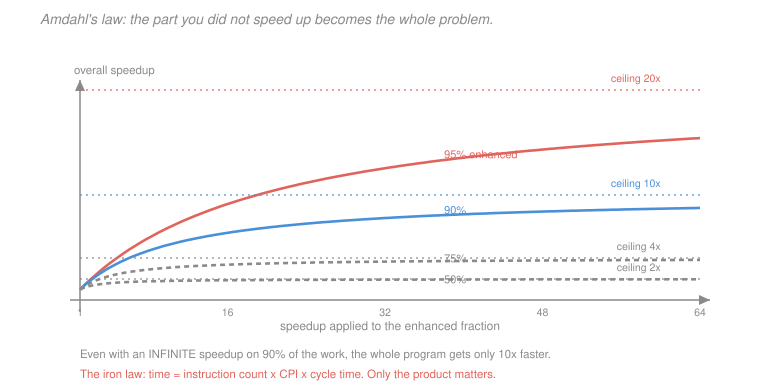

# Computer Architecture · Lesson 5.1: Measuring performance — CPI and Amdahl's law

> ⏱ ~15 min · Module 5: Parallelism and performance · Builds on: [4.3 (virtual memory and the TLB)](04-03-virtual-memory-and-the-tlb.md) · Unlocks: 5.2 (instruction-level parallelism), 5.3 (multiprocessors)

## Why this matters

Every module so far has produced performance claims — a lookahead adder is 4x faster, pipelining gives 4x throughput, a cache turns 200 cycles into 13.5. This lesson supplies the accounting that makes such claims comparable, and the law that says when they stop mattering.

The reason to be careful is that the obvious metrics all lie. Clock frequency lies, because a machine can do less per cycle. Instruction count lies, because [2.2](02-02-multiplication-and-division.md) showed a program executing *more* instructions running three times faster. CPI lies, because inserting `nop`s improves it. Only one quantity is meaningful, and the useful skill is knowing which factor of it a given change actually moves.

## The idea

Execution time decomposes into exactly three factors, and every optimisation in this course moves one of them.

$$\text{time} = \underbrace{\text{instructions}}_{\text{ISA, compiler}} \times \underbrace{\frac{\text{cycles}}{\text{instruction}}}_{\text{microarchitecture}} \times \underbrace{\frac{\text{seconds}}{\text{cycle}}}_{\text{circuits, process}}$$

This is the **iron law**, and it is an identity — the units cancel to seconds. Its value is that the three factors are influenced by different people: the compiler and ISA determine the first, the microarchitecture the second, the circuit design and manufacturing process the third.

The trap is that they are **not independent**. Making one better routinely makes another worse, which is why quoting any single factor is meaningless. Pipelining cuts cycle time and raises CPI. A richer instruction set cuts instruction count and may raise cycle time. A reciprocal-multiply transformation raises instruction count and cuts CPI.

Amdahl's law is the second half of the story. It says that improving part of a program is bounded by the part you did not improve — and the bound is far more punishing than intuition suggests.

## The formal version

> **The iron law.**
> $$T = \mathrm{IC} \times \mathrm{CPI} \times T_{\text{cycle}} = \frac{\mathrm{IC}\times\mathrm{CPI}}{f}$$
> where $\mathrm{IC}$ is the **dynamic** instruction count, $\mathrm{CPI}$ is cycles per instruction, and $f$ is the clock frequency.

Note **dynamic**, not static: what executes, not what appears in the listing. [1.4](01-04-branches-loops-control-flow.md)'s $7n+4$ was a dynamic count.

**CPI from an instruction mix.** When instruction classes have different costs:
$$\mathrm{CPI} = \sum_i f_i\,\mathrm{CPI}_i$$
with $f_i$ the fraction of dynamic instructions of class $i$.

*Instance.* 50 percent ALU (CPI 1), 30 percent load/store (CPI 2), 20 percent branch (CPI 3):
$$\mathrm{CPI} = 0.5(1)+0.3(2)+0.2(3) = 0.5+0.6+0.6 = 1.7 .$$
For $10^9$ instructions at 2 GHz:
$$T = \frac{10^9 \times 1.7}{2\times 10^9} = 0.85 \text{ s} .$$

**CPI from stalls.** The more useful decomposition in practice:
$$\mathrm{CPI} = \mathrm{CPI}_{\text{ideal}} + \text{stalls per instruction}$$

Collecting the stall sources from Modules 3 and 4:

| Source | Contribution | From |
|---|---|---|
| load-use hazards | $f_{\text{load-use}}$ | [3.4](03-04-data-hazards-forwarding-stalls.md) |
| branch mispredictions | $b\,m\,p$ | [3.5](03-05-control-hazards-and-branch-prediction.md) |
| cache misses | $\text{accesses/instr}\times\text{miss rate}\times\text{penalty}$ | [4.1](04-01-caches-and-locality.md) |
| page faults | $\text{fault rate}\times\text{fault cost}$ | [4.3](04-03-virtual-memory-and-the-tlb.md) |

This is the form to use when diagnosing a slow program: compute each term and see which dominates.

**Why MIPS is a bad metric.** Millions of instructions per second,
$$\mathrm{MIPS} = \frac{f}{\mathrm{CPI}\times 10^6} ,$$
is not comparable across ISAs — a CISC instruction does more work than a RISC one — nor across programs on the same machine, since CPI varies. A compiler that adds `nop`s improves MIPS. Use execution time on a real workload.

> **Amdahl's law.** If a fraction $p$ of execution time is improved by a factor $s$:
> $$\text{speedup} = \frac{1}{(1-p) + \dfrac{p}{s}} , \qquad \text{ceiling} = \lim_{s\to\infty}\frac{1}{1-p} = \frac{1}{1-p} .$$

The ceiling is the part worth internalising. Improving 90 percent of a program infinitely gives $10\times$; improving 50 percent infinitely gives $2\times$.

| $p$ | ceiling | speedup at $s=4$ | speedup at $s=100$ |
|---|---|---|---|
| $0.50$ | $2.0\times$ | $1.60\times$ | $1.98\times$ |
| $0.75$ | $4.0\times$ | $2.29\times$ | $3.88\times$ |
| $0.90$ | $10\times$ | $3.08\times$ | $9.17\times$ |
| $0.95$ | $20\times$ | $3.48\times$ | $16.8\times$ |
| $0.99$ | $100\times$ | $3.88\times$ | $50.2\times$ |

**The practical corollary: make the common case fast.** Effort should go where the time is. This is also the argument against optimising anything already small — [2.1](02-01-alu-addition-subtraction-overflow.md)'s adder stopped paying once it was no longer the critical path, which is Amdahl's law applied to a circuit.

**Benchmarking.** Compare execution time on programs resembling your workload. Use the **geometric mean** to summarise ratios across a suite (the arithmetic mean of speedups is sensitive to which machine is the baseline; the geometric mean is not). Beware of benchmarks the vendor optimised for specifically.

## Picture

Every curve flattens, and flattens early. The 90 percent curve has reached $3.08\times$ by the time the enhanced portion is 4 times faster, and needs an *infinite* improvement to reach 10. **The distance between a curve and its ceiling closes slowly; the distance between ceilings is enormous.** Which is why the productive question is always "what fraction am I addressing?" rather than "how much faster is this part?"

## Worked examples

**Example 1 (mechanical): CPI from a stall budget.** A 5-stage pipeline has ideal CPI 1. Measurements:

- 30 percent of instructions are loads or stores; the data cache misses 4 percent of the time with a 100-cycle penalty.
- Every instruction is fetched; the instruction cache misses 1 percent with the same penalty.
- 20 percent are branches, mispredicted 8 percent of the time, penalty 2 cycles.
- 10 percent suffer a load-use stall of 1 cycle.

$$\text{data-cache stalls} = 0.30\times 0.04\times 100 = 1.20$$
$$\text{instruction-cache stalls} = 1.00\times 0.01\times 100 = 1.00$$
$$\text{branch stalls} = 0.20\times 0.08\times 2 = 0.032$$
$$\text{load-use stalls} = 0.10\times 1 = 0.10$$

$$\mathrm{CPI} = 1 + 1.20 + 1.00 + 0.032 + 0.10 = \boxed{3.33}$$

**The machine spends 70 percent of its cycles stalled**, and the memory system accounts for 2.20 of the 2.33 stall cycles — 94 percent of all stalls. The branch predictor, despite Module 3 devoting a lesson to it, contributes 0.032 cycles, about 1 percent.

That ranking is typical and is the reason Module 4 is the longest module in the course. Notice also that the *instruction* cache contributes nearly as much as the data cache, despite a four-times-lower miss rate — because every instruction is fetched while only 30 percent touch data.

**Example 2 (why you'd care): optimising the wrong thing.** Take Example 1's machine. Two proposals compete.

*Proposal A: a perfect branch predictor.* Eliminates 0.032 cycles:
$$\mathrm{CPI} = 3.33 - 0.032 = 3.298, \qquad \text{speedup} = \frac{3.33}{3.298} = 1.010 \quad (1.0\%) .$$

*Proposal B: halve the data-cache miss rate*, from 4 percent to 2 percent:
$$\text{new data stalls} = 0.30\times0.02\times100 = 0.60, \qquad \mathrm{CPI} = 3.33 - 0.60 = 2.73 ,$$
$$\text{speedup} = \frac{3.33}{2.73} = 1.220 \quad (22\%) .$$

Proposal B is **22 times more valuable**, and the reason is entirely Amdahl's law: branches are 1 percent of the stall time, so even perfecting them is bounded at 1 percent.

Now the sharper version. Suppose Proposal A is free and Proposal B requires doubling the L1 cache, which raises the hit time from 1 to 2 cycles. That extra cycle is paid on **every** instruction's fetch and on 30 percent of them again for data:
$$\text{added} = 1.00\times 1 + 0.30\times 1 = 1.30 \text{ cycles} ,$$
$$\mathrm{CPI} = 2.73 + 1.30 = 4.03 ,$$
which is **worse than the original 3.33**. The miss-rate improvement is entirely consumed by the hit-time regression.

This is the iron law's real lesson. Proposal B looked like a clear win when only one factor was considered, and became a 21 percent *loss* once the coupled cost was included. **Any change must be evaluated on total time, never on the component it targets** — which is why architects simulate whole workloads rather than reasoning about individual mechanisms, and why [4.1](04-01-caches-and-locality.md)'s remark that L1 caches are kept small and fast is a conclusion rather than a convention.

## Watch out

- **You might think** a higher clock frequency means a faster machine — **but actually** it is one factor of three. A 3 GHz machine with CPI 2 is slower than a 2 GHz machine with CPI 1. This was the substance of the "megahertz myth" marketing arguments of the early 2000s, and the industry's move to quoting benchmark scores rather than frequency.
- **You might think** reducing instruction count always helps — **but actually** [2.2](02-02-multiplication-and-division.md)'s reciprocal-multiply raised instruction count and tripled the speed, while [3.1](03-01-single-cycle-datapath.md)'s fused `lwadd` lowered it and made the program 19 percent slower. Only the product is meaningful.
- **You might think** Amdahl's law is pessimistic — **but actually** it is exact, and the pessimism is real. Its practical use is as a **screening test**: before optimising anything, measure what fraction of time it occupies, and if that fraction is small, stop.

## One-liner

> Time is instruction count times CPI times cycle time, and the three factors trade against each other — so evaluate every change on total time, and use Amdahl's law first to check that the part you are about to optimise is large enough to be worth it.

## Problems

**P1 (🟢)** A program has an instruction mix of 40 percent ALU (CPI 1), 35 percent load/store (CPI 3), 15 percent branch (CPI 2) and 10 percent multiply (CPI 5). (a) Give the average CPI. (b) For $2\times 10^9$ instructions at 3 GHz, give the execution time. (c) Which class contributes most to CPI?

**P2 (🟡)** A machine has CPI 2.5. Loads and stores are 35 percent of instructions and miss 5 percent of the time with an 80-cycle penalty. (a) How many of the 2.5 cycles are data-cache stalls? (b) A new cache halves the miss rate but adds 1 cycle to every data access. Give the new CPI and say whether it is an improvement. (c) At what miss-rate reduction would the change break even?

**P3 (🔴, optional)** A program spends 40 percent of its time in a routine you can parallelise perfectly across $n$ cores. (a) Give the speedup at $n = 4$, $16$ and $\infty$. (b) You could instead spend the same effort making the *serial* 60 percent twice as fast — compare that against $n=16$. (c) Generalise: at what parallel fraction $p$ does 16-way parallelism beat a 2x serial improvement?

Solutions

**P1** *(a) Average CPI.*
$$\mathrm{CPI} = 0.40(1) + 0.35(3) + 0.15(2) + 0.10(5) = 0.40 + 1.05 + 0.30 + 0.50 = \boxed{2.25}$$

*(b) Execution time.*
$$T = \frac{\mathrm{IC}\times\mathrm{CPI}}{f} = \frac{2\times10^9 \times 2.25}{3\times 10^9} = \frac{4.5\times10^9}{3\times10^9} = \boxed{1.5 \text{ s}}$$

*(c) Largest contributor.* **Load/store, at 1.05 cycles** — 47 percent of the total CPI, from only 35 percent of instructions. Multiply contributes 0.50 despite being just 10 percent of instructions, because its CPI is 5.

The ranking is $1.05 > 0.50 > 0.40 > 0.30$, and the useful observation is that it does **not** follow the frequency ordering: ALU instructions are the most common (40 percent) and contribute the third most, because each is cheap. Contribution is frequency times cost, and optimising the most *frequent* class is not the same as optimising the most *expensive* one.

**P2** *(a) Data-cache stall cycles.*
$$\text{stalls} = 0.35 \times 0.05 \times 80 = \boxed{1.40 \text{ cycles per instruction}}$$
That is 56 percent of the total CPI of 2.5 — the memory system dominates, as in Example 1.

*(b) The new cache.* Halving the miss rate to 2.5 percent:
$$\text{new stalls} = 0.35\times 0.025\times 80 = 0.70 \quad\text{(a saving of } 0.70\text{)} .$$
But every data access now costs 1 extra cycle, and 35 percent of instructions make one:
$$\text{added} = 0.35 \times 1 = 0.35 .$$
$$\mathrm{CPI}_{\text{new}} = 2.5 - 0.70 + 0.35 = \boxed{2.15}$$
$$\text{speedup} = \frac{2.5}{2.15} = 1.163 \quad\Longrightarrow\quad \boxed{\text{yes, a } 16.3\% \text{ improvement}}$$

*(c) Break-even.* Let the new miss rate be $m$. The change breaks even when the stall saving equals the added hit-time cost:
$$0.35\times 80 \times (0.05 - m) = 0.35 \times 1$$
$$28(0.05 - m) = 0.35 \quad\Longrightarrow\quad 0.05 - m = 0.0125 \quad\Longrightarrow\quad m = \boxed{0.0375} .$$

So the miss rate must fall from 5 percent to below **3.75 percent** — a reduction of at least 25 percent — for the extra hit cycle to be worth paying. Halving to 2.5 percent comfortably clears that bar; a reduction to only 4 percent would make the change a net loss.

This is the general form of Example 2's cautionary calculation, and it is the trade every cache designer faces: **miss-rate improvements must be weighed against hit-time regressions**, and the break-even threshold depends on the miss penalty and the access frequency.

**P3** *(a) Speedups with $p = 0.40$.*
$$n=4: \quad \frac{1}{0.60 + \frac{0.40}{4}} = \frac{1}{0.70} = \boxed{1.43\times}$$
$$n=16: \quad \frac{1}{0.60 + \frac{0.40}{16}} = \frac{1}{0.625} = \boxed{1.60\times}$$
$$n=\infty: \quad \frac{1}{0.60} = \boxed{1.67\times}$$

Note how quickly this saturates: 16 cores deliver $1.60\times$ against an absolute ceiling of $1.67\times$ — 96 percent of everything parallelism could ever achieve. Going to 1000 cores would yield $1.666\times$.

*(b) Versus a 2x serial improvement.* Halving the time of the 60 percent serial portion:
$$\text{speedup} = \frac{1}{\frac{0.60}{2} + 0.40} = \frac{1}{0.30+0.40} = \frac{1}{0.70} = \boxed{1.43\times}$$

So 16-way parallelism ($1.60\times$) **beats** the 2x serial improvement ($1.43\times$) — but by less than 12 percent, which is a much closer contest than "16 cores versus 2x" sounds. And the 2x serial improvement is a single-threaded change requiring no concurrency, no synchronisation and no parallel debugging.

*(c) The general threshold.* Set the two speedups equal, with parallel fraction $p$ and serial fraction $1-p$:
$$\underbrace{\frac{1}{(1-p) + \frac{p}{16}}}_{\text{16-way parallel}} = \underbrace{\frac{1}{\frac{1-p}{2} + p}}_{\text{2x on the serial part}}$$

Equating denominators:
$$(1-p) + \frac{p}{16} = \frac{1-p}{2} + p$$
$$\frac{1-p}{2} = p - \frac{p}{16} = \frac{15p}{16}$$
$$8(1-p) = 15p \quad\Longrightarrow\quad 8 = 23p \quad\Longrightarrow\quad p = \frac{8}{23} = \boxed{0.348}$$

**Above a parallel fraction of about 35 percent, 16-way parallelism wins; below it, the 2x serial improvement wins.**

That threshold is remarkably low, and it cuts both ways. It means parallelism beats a substantial serial speedup even for programs that are only about a third parallel — encouraging. But it also means that for the large class of programs *below* one third parallel, throwing 16 cores at the problem is worse than making the serial path twice as fast, and worse still when the coordination costs that Amdahl's idealised model ignores are included.

This is the calculation that governed the industry's shift to multicore around 2005: single-core improvements had become very expensive (the power and pipeline-depth walls of [3.3](03-03-pipelining-and-the-pipelined-datapath.md)), which raised the effective cost of the "2x serial" option and made parallelism the better bet even at modest parallel fractions. [5.3](05-03-multiprocessors-cache-coherence.md) takes up what that shift cost in complexity.

## Flashback

**From Lesson 4.3 (virtual memory and the TLB):** A system has 16 KiB pages and 32-bit virtual addresses. (a) Give the offset and VPN widths. (b) A TLB has 96 entries — give its reach. (c) A program's working set is 6 MiB; state how many pages that is and whether the TLB covers it.

Solution

*(a) Address split.* With 16 KiB pages:
$$\text{offset} = \log_2 16384 = \boxed{14 \text{ bits}}, \qquad \text{VPN} = 32-14 = \boxed{18 \text{ bits}} .$$

*(b) TLB reach.*
$$96 \times 16 \text{ KiB} = 1536 \text{ KiB} = \boxed{1.5 \text{ MiB}}$$

*(c) The working set.*
$$\frac{6 \times 2^{20}}{16384} = \frac{6291456}{16384} = \boxed{384 \text{ pages}} .$$

The TLB holds 96 entries against 384 pages, covering $96/384 = 25$ percent of the working set. **It does not fit**, so a program touching the whole set repeatedly will miss on roughly three quarters of its first-touch accesses to each page and will thrash if the access pattern cycles through the full set.

Two connections worth drawing to this lesson.

The larger 16 KiB page size already helps considerably — with 4 KiB pages the same 96-entry TLB would reach only 384 KiB and the working set would be 1536 pages, a coverage of 6 percent rather than 25. Page size is a lever on TLB reach, which is [4.3](04-03-virtual-memory-and-the-tlb.md)'s huge-pages argument in miniature.

And the cost belongs in this lesson's stall budget. If TLB misses occur on, say, 2 percent of accesses at 30 cycles each, that contributes $0.02\times 30 = 0.6$ cycles to CPI — comparable to a data-cache miss term and far larger than the branch-misprediction term of Example 1. It is a real line item, frequently omitted from stall budgets because it is invisible to most profilers, and it is exactly the kind of term Amdahl's law says to measure before optimising anything else.

## Connections

- **Backward:** the iron law's three factors are what Modules 2 through 4 have each been moving — [2.1](02-01-alu-addition-subtraction-overflow.md)'s adder and [3.3](03-03-pipelining-and-the-pipelined-datapath.md)'s pipelining attack cycle time, [3.4](03-04-data-hazards-forwarding-stalls.md) and [3.5](03-05-control-hazards-and-branch-prediction.md) and all of Module 4 attack CPI, and the ISA design of Module 1 sets instruction count. Example 1's stall budget collects every hazard the course has introduced into one number.
- **Forward:** [5.2](05-02-instruction-level-parallelism.md) attacks CPI below 1 by issuing several instructions per cycle, and [5.3](05-03-multiprocessors-cache-coherence.md) attacks the problem from outside the iron law entirely by adding cores — where Amdahl's law returns as the binding constraint on how much that can help.
- **Sideways:** Amdahl's law is not about computers. It is arithmetic about improving part of any whole, and applies identically to a manufacturing line, a build pipeline or a research programme. The discipline it enforces — measure the fraction before optimising the part — is the most transferable idea in this course.
