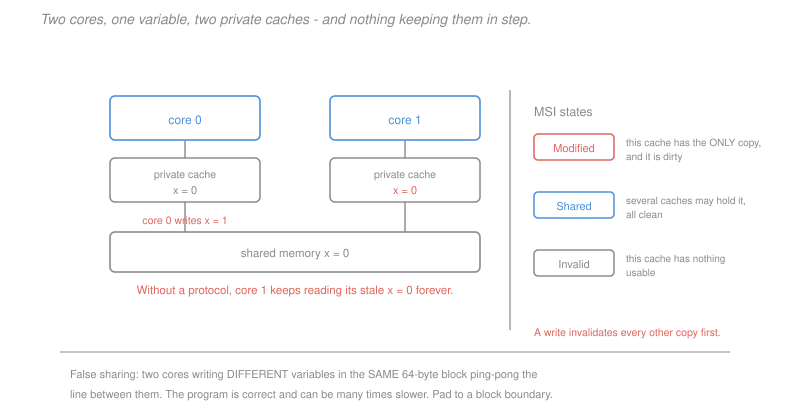

# Computer Architecture · Lesson 5.3: Multiprocessors and cache coherence (a taste)

> ⏱ ~15 min · Module 5: Parallelism and performance · Builds on: [5.1 (measuring performance)](05-01-measuring-performance-cpi-amdahl.md), [4.2 (write policy)](04-02-associativity-misses-write-policy.md) · Unlocks: this is the course's final lesson

## Why this matters

Around 2005 the industry stopped making cores faster and started making more of them. [5.2](05-02-instruction-level-parallelism.md) explained why: the ILP wall meant wider cores bought little, and the power wall meant higher frequencies were unaffordable. Multiple cores were the remaining option.

That decision created a problem the single-core machine never had. Each core has its own private cache ([4.1](04-01-caches-and-locality.md)), and write-back caching ([4.2](04-02-associativity-misses-write-policy.md)) means memory is no longer authoritative. Two cores can hold the same address with different values, and nothing in what we have built so far prevents it.

Coherence is the hardware that does prevent it — invisible when it works, and the source of performance failures that look like nothing else in this course, because the program is *correct* and merely slow by a factor of ten.

## The idea

Two cores read `x`, each caching a copy. Core 0 writes `x = 1`. Its own cache is updated. Core 1's copy still says 0, and core 1 has no way to know.

**Coherence** is the guarantee that this cannot persist: a read must eventually return the most recent write. The standard mechanism is **invalidation** — before a core writes, it tells every other core to discard its copy. Afterwards exactly one cache holds the line, and it is the only place the current value exists.

Implementing that needs a **protocol**: rules assigning each cached line a state, and transitions driven by local accesses and by messages from other cores. In a small system every core watches a shared bus — **snooping** — and reacts to what it sees.

The performance consequence is the important part. Coherence traffic is invisible in the source code, and the worst case is a variable two cores both write, which ping-pongs between their caches with a full miss penalty each time. Worse, this happens even when the two cores are writing *different* variables that share a cache block — **false sharing**, which is a correctness non-issue and a performance disaster.

## The formal version

**Shared memory.** All cores address one physical memory. Communication happens through ordinary loads and stores rather than explicit messages, which is what makes shared-memory programming convenient and what makes coherence necessary.

> **Coherence.** A memory system is coherent if a read of a location returns the value of the most recent write to it, writes to a single location are seen in the same order by all cores, and a write eventually becomes visible.

Coherence is about **one location**. **Consistency** — the ordering guarantees across *different* locations — is a separate and harder question, sketched below.

**The MSI protocol.** The minimal invalidation protocol gives each cache line one of three states:

| State | Meaning | Others may hold it? | Memory current? |
|---|---|---|---|
| **Modified** | this cache has the only copy, dirty | no | no |
| **Shared** | clean copy, possibly one of several | yes | yes |
| **Invalid** | no usable data | — | — |

Transitions, driven by local requests and snooped bus traffic:

| Event | From | To | Action |
|---|---|---|---|
| local read | I | S | fetch from memory or another cache |
| local write | I or S | M | **invalidate all other copies**, then write |
| snoop a read request | M | S | write back, supply the data |
| snoop a write request | M or S | I | invalidate; write back if Modified |

The rule enforcing coherence is the second row: **a write must invalidate every other copy before proceeding.** After it, the writer's line is the unique valid copy.

Real protocols extend this. **MESI** adds *Exclusive* — clean and uniquely held — so a core that reads then writes a line nobody else has can skip the invalidation broadcast entirely, a common and worthwhile case. **MOESI** adds *Owned*, letting a dirty line be shared without an immediate write-back.

**Snooping and its limit.** Every core watches every transaction. Simple and effective up to perhaps 8–16 cores, at which point the shared bus saturates — every core sees every message, so traffic grows with the square of the core count. Larger systems use **directory-based** coherence, keeping a directory of which caches hold each line and sending point-to-point messages, which scales but adds latency.

**The costs of sharing.**

*True sharing* — two cores genuinely using the same variable. Each write invalidates the other's copy, so the line bounces back and forth, costing a coherence miss (comparable to an L2 or memory access) every time. Unavoidable if the algorithm needs the sharing; reducible by restructuring so cores work on private data and combine at the end.

> **False sharing.** Two cores write *different* variables that happen to occupy the same cache line. No data is actually shared, but the hardware works in units of blocks, so the line ping-pongs exactly as if they were.

This is the pathology worth recognising by sight. Two threads incrementing `counter[0]` and `counter[1]` in an `int` array will destroy each other's cache lines, and the code is perfectly correct — it simply runs many times slower than the same code with the counters padded apart.

**Memory consistency, briefly.** Coherence orders accesses to one location; consistency orders accesses to *different* locations. **Sequential consistency** — everything appears in some global interleaving of program orders — is the intuitive model and is too slow to implement directly, because it forbids the store buffering and reordering every processor relies on.

Real machines implement **relaxed** models and provide **fence** instructions to impose ordering where it matters. x86 is relatively strong (total store order); ARM and RISC-V are weak. This is why lock-free code is genuinely difficult and why concurrent data structures must be written against a specified memory model rather than intuition.

**Amdahl's law returns.** From [5.1](05-01-measuring-performance-cpi-amdahl.md), a program that is 90 percent parallel is capped at $10\times$ no matter how many cores you add. The serial fraction — including synchronisation and coherence traffic, which *grow* with core count — is what bounds multicore scaling, and it is why doubling cores so rarely doubles throughput.

## Picture



The left half is the problem in its simplest form: three copies of `x`, one write, and no mechanism connecting them. The right half is the minimal solution — three states, with a write required to invalidate every other copy first. The note at the bottom is the practical hazard, and the one most likely to cost you real time.

## Worked examples

**Example 1 (mechanical): trace an MSI sequence.** Two cores, one line containing `x`. Initially both are Invalid and memory holds `x = 0`.

| Step | Action | Core 0 state | Core 1 state | Bus activity |
|---|---|---|---|---|
| 1 | core 0 reads `x` | I → **S** | I | read request; memory supplies |
| 2 | core 1 reads `x` | S | I → **S** | read request; supplied |
| 3 | core 0 writes `x = 1` | S → **M** | S → **I** | **invalidate** broadcast |
| 4 | core 1 reads `x` | M → **S** | I → **S** | read request; **core 0 writes back and supplies** |
| 5 | core 1 writes `x = 2` | S → **I** | S → **M** | invalidate broadcast |

Two things to read off. At step 4, memory was **stale** — core 0 held the only current copy in Modified state, so it had to supply the data itself. This is cache-to-cache transfer, and it is why coherent systems must snoop rather than simply reading memory.

And notice steps 3 and 5: each write invalidated the other core's copy. Alternating writes from two cores mean the line moves back and forth, one coherence miss per write. **This is the true-sharing cost**, and it is what makes a shared counter such a poor idea.

**Example 2 (why you'd care): false sharing costs a factor of ten.** Four threads each increment their own counter in an array:

```c
int counter[4];                      /* 4 ints = 16 bytes */
/* thread t runs:  for (i=0;i<10000000;i++) counter[t]++; */
```

There is **no shared data** — each thread touches a different element, and the program is correct with no synchronisation at all. But all four `int`s fit in one 64-byte cache line ([4.1](04-01-caches-and-locality.md)), so every increment by any thread invalidates the line in the other three caches.

Each increment becomes a coherence miss, costing perhaps 100 cycles instead of 1. With $4\times10^7$ total increments:
$$\text{ideal} \approx 4\times 10^7 \text{ cycles} , \qquad \text{with false sharing} \approx 4\times 10^9 \text{ cycles} .$$

Roughly **100x slower**, and adding cores makes it *worse* rather than better — the classic signature of false sharing is a parallel program that slows down as threads are added.

*The fix* is padding each counter onto its own cache line:

```c
struct { int value; char pad[60]; } counter[4];   /* 64 bytes each */
```

Now each thread's counter is in a distinct line, no invalidations occur, and the program scales linearly. **Sixty wasted bytes per counter buys a hundredfold speedup.**

Three things to carry from this. The bug is **invisible in the source** — nothing in the C code suggests sharing, and no amount of reading the algorithm reveals it; you need to know the cache line size. It is also **invisible to correctness testing**, since the answers are right. And the diagnostic is distinctive: a parallel program that scales *negatively* with thread count is almost always false sharing or lock contention. Padding hot per-thread data to a cache line is standard practice in concurrent code for exactly this reason, and is why C++ provides `hardware_destructive_interference_size`.

## Watch out

- **You might think** coherence makes shared-memory programming safe — **but actually** it guarantees only that a read eventually sees the most recent write to *that location*. It says nothing about ordering across different locations, which is the consistency model, and nothing about atomicity — `counter++` is a read-modify-write and still needs an atomic instruction or a lock.
- **You might think** false sharing requires the threads to share data — **but actually** the entire point is that they do not. The hardware's unit of coherence is a cache block, not a variable, so unrelated data in one block is treated as shared.
- **You might think** more cores always means more throughput — **but actually** Amdahl's law bounds it by the serial fraction, and coherence traffic and synchronisation *grow* with core count, so scaling can be flat or negative. Measuring speedup against thread count is the only reliable way to know.

## One-liner

> Private caches plus write-back means two cores can disagree about one address, so a write must invalidate every other copy first — and because the unit of coherence is a block rather than a variable, two cores writing neighbouring variables pay the full cost of sharing something they do not share.

## Problems

**P1 (🟢)** Under MSI, give the state of each core's copy after each step. Two cores, one line, both starting Invalid: (1) core 1 reads; (2) core 0 reads; (3) core 1 writes; (4) core 0 reads. State which step requires a write-back.

**P2 (🟡)** Eight threads each update a private accumulator held in a `double` array `acc[8]`, with 64-byte cache lines. (a) How many accumulators share a line? (b) Explain the performance problem and estimate the slowdown if a coherence miss costs 80 cycles against a 1-cycle hit. (c) Give a fix and its memory cost.

**P3 (🔴, optional)** A program is 92 percent parallelisable. (a) Give the speedup at 8, 32 and infinite cores. (b) Coherence overhead adds 0.5 percent of the original serial time per core beyond the first. Recompute at 8 and 32 cores. (c) Find the core count that maximises speedup, and comment.

<details>
<summary>Solutions</summary>

**P1**

| Step | Action | Core 0 | Core 1 | Notes |
|---|---|---|---|---|
| start | — | I | I | memory current |
| 1 | core 1 reads | I | **S** | memory supplies |
| 2 | core 0 reads | **S** | S | both hold clean copies |
| 3 | core 1 writes | **I** | **M** | invalidate broadcast; core 0's copy discarded |
| 4 | core 0 reads | **S** | **M → S** | core 1 supplies and **writes back** |

**Step 4 requires the write-back.** At the start of step 4, core 1 holds the line in Modified state — it is dirty, and memory is stale. When core 0 requests a read, core 1 must both supply the data and update memory, after which both caches hold it Shared and memory is current again.

Step 3 is the other one worth noting: core 1 already had the line in Shared, so its write did not need to fetch anything — it needed only to **invalidate** core 0's copy before upgrading to Modified. That upgrade-without-fetch is common enough that MESI adds the Exclusive state to skip even the invalidation broadcast when no other core holds the line.

**P2** *(a) Accumulators per line.* A `double` is 8 bytes, and a line is 64 bytes:
$$\frac{64}{8} = \boxed{8 \text{ accumulators per line}} .$$
So all eight threads' accumulators occupy **exactly one cache line**.

*(b) The problem and the slowdown.* This is maximal false sharing. Every thread writes its own `double`, so there is no logical sharing whatsoever — but all eight writes target the same 64-byte block, and coherence operates on blocks. Each write invalidates the line in the other seven caches, so essentially every update becomes a coherence miss.

$$\text{slowdown} \approx \frac{80 \text{ cycles}}{1 \text{ cycle}} = \boxed{\text{about } 80\times} $$

And it is worse than that figure suggests in one respect: with eight cores contending for a single line, the line's transfers serialise, so the threads are effectively taking turns. **Adding threads makes it slower**, which is the diagnostic signature.

*(c) The fix and its cost.* Pad each accumulator to its own cache line:

```c
struct padded { double value; char pad[56]; };   /* 64 bytes */
struct padded acc[8];
```

*Memory cost:* $8 \times 64 = 512$ bytes instead of $8\times 8 = 64$ bytes — **448 bytes wasted, an 8x increase** on a structure that is negligible in absolute terms. Trading half a kilobyte for an 80x speedup is not a close call.

An alternative with no memory cost at all: have each thread accumulate into a **local variable** and write to the shared array once at the end. That eliminates the sharing during the loop entirely, is usually the better fix, and is what a compiler will sometimes do automatically if it can prove the array element is not otherwise observed.

**P3** *(a) Amdahl with $p = 0.92$.*
$$n=8: \quad \frac{1}{0.08 + \frac{0.92}{8}} = \frac{1}{0.08+0.115} = \frac{1}{0.195} = \boxed{5.13\times}$$
$$n=32: \quad \frac{1}{0.08+\frac{0.92}{32}} = \frac{1}{0.08+0.02875} = \frac{1}{0.10875} = \boxed{9.20\times}$$
$$n=\infty: \quad \frac{1}{0.08} = \boxed{12.5\times}$$

*(b) With coherence overhead.* The overhead adds $0.005(n-1)$ to the total time:
$$S(n) = \frac{1}{0.08 + \frac{0.92}{n} + 0.005(n-1)}$$

$$n=8: \quad \frac{1}{0.08+0.115+0.035} = \frac{1}{0.230} = \boxed{4.35\times} \quad (\text{was } 5.13)$$
$$n=32: \quad \frac{1}{0.08+0.02875+0.155} = \frac{1}{0.26375} = \boxed{3.79\times} \quad (\text{was } 9.20)$$

**At 32 cores the overhead has made things worse than at 8** — the program is slower with four times the hardware.

*(c) The optimum.* Minimise the denominator $D(n) = 0.08 + \frac{0.92}{n} + 0.005(n-1)$:
$$\frac{dD}{dn} = -\frac{0.92}{n^2} + 0.005 = 0 \quad\Longrightarrow\quad n^2 = \frac{0.92}{0.005} = 184 \quad\Longrightarrow\quad n = 13.6 .$$

Checking integer values:
$$S(13) = \frac{1}{0.08+0.0708+0.060} = \frac{1}{0.2108} = 4.744 , \qquad S(14) = \frac{1}{0.08+0.0657+0.065} = \frac{1}{0.2107} = 4.746 .$$

$$\boxed{n = 14 \text{ cores, speedup } 4.75\times}$$

*Comment.* Three things, and the third is the general one.

The optimum is **14 cores**, and beyond it adding hardware actively hurts. The peak speedup of $4.75\times$ is barely a third of Amdahl's already-modest $12.5\times$ ceiling — overhead has cost more than the serial fraction did.

The shape matters: speedup rises, peaks, and *declines*. That is qualitatively different from Amdahl's law alone, which is monotonic and merely saturates. **Real parallel systems have an optimal core count, not an asymptote**, and running past it is a measurable loss rather than merely a waste.

And the overhead term here is generous. Real coherence and synchronisation costs often grow faster than linearly in core count — snooping traffic grows quadratically, as this lesson noted — so the peak arrives sooner and the decline is steeper. This is why parallel scaling must be *measured* rather than assumed, why strong-scaling studies plot speedup against thread count to find the knee, and ultimately why the multicore transition solved the power problem without solving the performance problem: the hardware became parallel far more easily than the software did.

</details>

## Flashback

**From Lesson 5.1 (measuring performance — CPI and Amdahl's law):** A machine has ideal CPI 1. Instructions are 25 percent loads/stores with a 3 percent data-cache miss rate and 120-cycle penalty; every instruction is fetched with a 0.5 percent instruction-cache miss rate at the same penalty; 18 percent are branches mispredicted 6 percent of the time with a 2-cycle penalty. (a) Give the CPI. (b) Which term dominates? (c) Which single improvement would you pursue?

<details>
<summary>Solution</summary>

*(a) The stall budget.*
$$\text{data-cache} = 0.25\times 0.03\times 120 = 0.90$$
$$\text{instruction-cache} = 1.00\times 0.005\times 120 = 0.60$$
$$\text{branch} = 0.18\times 0.06\times 2 = 0.0216$$
$$\mathrm{CPI} = 1 + 0.90 + 0.60 + 0.0216 = \boxed{2.52}$$

*(b) Which dominates.* The **data-cache term at 0.90 cycles** — 36 percent of the total CPI, and the largest single contributor. The instruction cache follows at 0.60 (24 percent), and branches contribute 0.0216, under 1 percent.

Taken together the memory system accounts for $0.90+0.60 = 1.50$ cycles, which is **99 percent of all stall time** (1.50 of the 1.52 cycles above the ideal 1). Branch prediction contributes almost nothing, despite [3.5](03-05-control-hazards-and-branch-prediction.md) devoting a full lesson to it — the predictor is simply doing its job well enough that the residual is negligible.

*(c) Which improvement to pursue.* The **data cache**, since it is the largest term — but with [5.1](05-01-measuring-performance-cpi-amdahl.md)'s caution attached.

Halving the data-cache miss rate to 1.5 percent saves 0.45 cycles:
$$\mathrm{CPI} = 2.52 - 0.45 = 2.07 , \qquad \text{speedup} = \frac{2.52}{2.07} = 1.22\times .$$
Perfecting the branch predictor saves 0.0216 cycles:
$$\mathrm{CPI} = 2.52-0.0216 = 2.50 , \qquad \text{speedup} = 1.009\times .$$

The cache improvement is worth about **24 times more**, and the ratio is just the ratio of the terms — which is Amdahl's law used as a screening test rather than as a formula.

But the caution from [5.1](05-01-measuring-performance-cpi-amdahl.md)'s Example 2 applies directly. If halving the miss rate requires a larger cache adding one cycle to every access, the added cost is
$$1.00\times 1 \ (\text{every instruction is fetched}) \ + \ 0.25\times 1 \ (\text{data accesses}) = 1.25 \text{ cycles} ,$$
far more than the 0.45 saved: CPI would rise to $2.07+1.25 = 3.32$, turning a 22 percent gain into 32 percent *more* time. **Evaluate on total time, never on the targeted component.**

One term deserves a mention it usually does not get: the instruction cache at 0.60 cycles is two thirds the size of the data term, despite a **six times lower** miss rate, purely because every instruction is fetched while only a quarter touch data. Improvements to instruction fetch — better code layout, smaller hot loops, avoiding megamorphic call sites — attack a substantial term that most programmers never consider.

</details>

## Connections

- **Backward:** the problem exists because [4.1](04-01-caches-and-locality.md) gave each core a private cache and [4.2](04-02-associativity-misses-write-policy.md) made it write-back, so memory stopped being authoritative. False sharing is a direct consequence of the block being the unit of transfer, and the scaling limit is [5.1](05-01-measuring-performance-cpi-amdahl.md)'s Amdahl's law with an overhead term. Multicore exists because of the walls [5.2](05-02-instruction-level-parallelism.md) described.
- **Sideways:** coherence and consistency are the hardware foundation on which [`operating-systems`](../../operating-systems/syllabus.md) builds locks, and on which [`distributed-systems`](../../distributed-systems/syllabus.md) builds its own far weaker guarantees — the shift from a coherent shared memory to a network of independent machines is exactly the loss of the guarantee this lesson provides, which is why distributed consensus is hard and a shared variable is easy.

## Closing the course

You started with gates and registers from [`digital-logic`](../../digital-logic/syllabus.md) and a question they could not answer: what makes this pile of hardware run a *program*?

**Module 1** gave the answer — the ISA, a contract fixing registers, semantics and encodings while deliberately saying nothing about time. That silence is what every later module exploited. **Module 2** built the arithmetic underneath it and found the first architectural lesson: the adder's delay sets the clock, so the critical path is the only thing worth optimising.

**Module 3** built the processor twice. The single-cycle design was correct and structurally doomed — one clock covering the slowest instruction, so no slow instruction could ever be added. Pipelining fixed it by separating the stages in time, and paid for it with three hazards, each needing its own machinery. **Module 4** confronted the fact that memory is a hundred times slower than the processor, and found that caches work not because they are fast but because programs have locality. **Module 5** collected it all into the iron law, and then into the walls that ended the single-core era.

Two habits are worth keeping. **Ask which factor of $\mathrm{IC}\times\mathrm{CPI}\times T$ a change actually moves**, because every optimisation in this course improved one and usually worsened another, and only the product means anything. And **ask what fraction of time a component occupies before optimising it** — Amdahl's law appeared as a circuit-level observation in [2.1](02-01-alu-addition-subtraction-overflow.md), a pipeline argument in [3.3](03-03-pipelining-and-the-pipelined-datapath.md), a memory argument in [4.4](04-04-storage-and-io.md), and a multicore bound here, and it is the same arithmetic every time.

Deliberately left out: GPU and accelerator microarchitecture, physical implementation and VLSI timing (which belong to [`electronics`](../../electronics/syllabus.md)), and the operating-system side of everything Module 4 touched. The natural next step is [`operating-systems`](../../operating-systems/syllabus.md), which takes the page tables, interrupts, DMA and privilege model built here and constructs processes, scheduling and file systems on top — you now know exactly what "the hardware" is that an OS manages.
