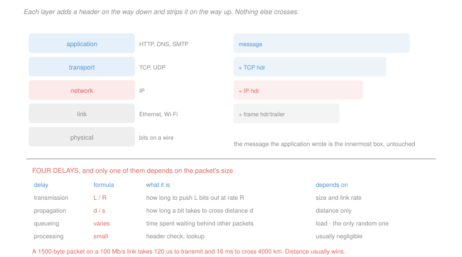

# Networking · Lesson 1.1: What a network is — packet switching and layers

> ⏱ ~15 min · Module 1: The Internet and the application layer · Builds on: [`programming-foundations` 1.4 (counting operations)](../../programming-foundations/lessons/01-04-big-o-counting-operations.md) · Unlocks: 1.2 (HTTP), 2.1 (transport)

## Why this matters

There is no wire from your laptop to a server in Frankfurt. There is a sequence of about fifteen hops, owned by a dozen companies that have never coordinated, running equipment from different decades, and none of them knows what your message means or where it is ultimately going.

That it works at all is the achievement, and it rests on two ideas. **Packet switching** breaks every conversation into small independent pieces so that a link can be shared without anyone reserving it. **Layering** divides the problem so that each layer trusts the one below without knowing how it works.

The course descends that stack from the top. This lesson establishes the vocabulary and, more usefully, the arithmetic: how long a message actually takes, and which term in the sum you should be looking at.

## The idea

**Circuit switching** reserves capacity for the length of a conversation, the way the telephone network did. You get a guaranteed rate and you hold it whether or not you are talking, so an idle conversation wastes the whole reservation.

**Packet switching** sends independent chunks with a destination on each, and every link is shared on demand. Nothing is reserved, nothing is guaranteed, and idle conversations cost nothing. When two packets want one link at once, the router **queues** one — which is where variable delay and loss come from, and both are the price of the sharing.

The trade is worth stating numerically because it is not close. A 1 Mb/s link serving users who need 100 kb/s when active can carry exactly 10 circuit-switched users, however idle they are. If each user is active only 10 percent of the time, packet switching serves 35 of them with a probability under one in two thousand that demand ever exceeds the link. **Statistical multiplexing is worth roughly a factor of the duty cycle**, and P3 works it out.

**Layering.** Each layer offers a service to the one above and uses the one below:

| layer | what it adds | examples |
|---|---|---|
| application | whatever the programs mean by it | HTTP, DNS, SMTP |
| transport | process-to-process delivery; reliability if you ask | TCP, UDP |
| network | host-to-host delivery across the whole path | IP |
| link | delivery across one hop | Ethernet, Wi-Fi |
| physical | bits onto the medium | copper, fibre, radio |

**Encapsulation** is how that is implemented: each layer wraps what it receives from above in its own header and hands it down. Your message travels inside a segment inside a datagram inside a frame, and each header is stripped by its counterpart on the way up. A router reads only the network header; it neither sees nor cares about the transport header inside.

The **end-to-end principle** explains the shape: put function where you can, at the edges, and keep the middle simple. IP promises nothing but best-effort delivery, and everything anyone wants beyond that — reliability, ordering, congestion control, encryption — is built at the endpoints. This is why the Internet absorbed the web, video and everything since without changing the middle.

## The formal version

> **Nodal delay.** Four terms, added at every hop:
> $$d_{\text{nodal}} = d_{\text{proc}} + d_{\text{queue}} + d_{\text{trans}} + d_{\text{prop}}$$

$$d_{\text{trans}} = \frac{L}{R} \quad (\text{bits} \div \text{bits per second}), \qquad d_{\text{prop}} = \frac{d}{s} \quad (\text{metres} \div \text{metres per second})$$

In words: transmission is how long it takes to *push the bits out*, and propagation is how long the first bit takes to *arrive*. They are unrelated. Transmission depends on packet size and link rate and not at all on distance; propagation depends on distance and not at all on size or rate.

Confusing them is the most common error in the subject, so fix the scale now. A 1500-byte packet on a 100 Mb/s link takes

$$d_{\text{trans}} = \frac{12{,}000\text{ bits}}{10^8\text{ bit/s}} = 120\ \mu\text{s}, \qquad d_{\text{prop}} = \frac{4{,}000\text{ km}}{2.5\times 10^8\text{ m/s}} = 16\text{ ms}$$

Propagation is 133 times larger, and no amount of extra bandwidth touches it. **Bandwidth is something you can buy; latency is bounded by the speed of light.**

> **Store and forward.** A packet switch receives a packet *entirely* before forwarding it, so a path of $N$ links costs $N$ transmission times rather than one.

> **Traffic intensity.** With average arrival rate $a$ packets per second, packet length $L$ and link rate $R$:
> $$\rho = \frac{La}{R}$$
> Queueing delay is small for $\rho$ well below 1 and grows without bound as $\rho \to 1$.

In words: a link that is 99 percent utilised is not one percent worse than a link that is 50 percent utilised. The divergence is the M/M/1 result from [`operations-research` 4.2](../../operations-research/lessons/04-02-the-mm1-queue.md) — mean queue length is $\rho/(1-\rho)$, so $\rho = 0.5$ queues one packet and $\rho = 0.99$ queues ninety-nine.

> **Throughput** across a path is set by the **bottleneck link** — the minimum rate along it. Adding capacity anywhere else changes nothing.

## Picture

## Worked examples

**Example 1 — where the time actually goes.** A 500 KB file crosses a path with a 100 Mb/s bottleneck and a 40 ms round-trip time, in 1500-byte packets.

$$\text{transmission of the whole file} = \frac{500 \times 1024 \times 8}{10^8} = 41\ \text{ms}$$

The propagation, one way, is 20 ms. So the file takes roughly 20 ms for the first bit to arrive plus 41 ms to stream out, about 61 ms — provided the sender is allowed to keep transmitting. If instead it stops and waits for an acknowledgement after every packet, the 342 packets each cost a full round trip:

$$342 \times 40\ \text{ms} = 13.7\ \text{s}$$

A factor of 220, on identical hardware. This is exactly why [2.2](02-02-building-reliable-data-transfer.md) is about pipelining and why TCP has a window.

**Example 2 — store and forward across three links.** A 1 MB file is sent as a single packet across three links of 2 Mb/s each, with negligible propagation.

$$3 \times \frac{8\times 10^6}{2\times 10^6} = 3\times 4 = 12\ \text{s}$$

Now break it into 1,000 packets of 1 KB. The first packet takes $3\times 4$ ms to reach the far end, and after that one packet completes every 4 ms because the three links work in parallel on different packets:

$$3\times 4\ \text{ms} + 999\times 4\ \text{ms} = 12 + 3{,}996 = 4.0\ \text{s}$$

Three times faster, from **pipelining across the hops**. The general form for $N$ links and $P$ packets is $(N + P - 1)\,L/R$, and it is the same shape as an instruction pipeline: the first item pays the full depth and every item after it costs one stage.

## Watch out

- **You might think a faster link reduces propagation delay.** It does not. Rate changes how fast bits leave; distance and the speed of light decide when the first one arrives. A gigabit link to the Moon still has a 1.3-second one-way delay.
- **You might think packet switching is always better.** It has no guarantees. Circuit switching gives a reserved rate with no queueing and no loss, which is why it survives wherever a hard bound matters more than efficiency. The Internet chose efficiency and then spent decades rebuilding guarantees at the edges.
- **You might think throughput is the average of the link rates.** It is the **minimum**. A 10 Gb/s backbone behind a 20 Mb/s home link gives you 20 Mb/s, and the only number worth measuring is the bottleneck's.

## One-liner

> Packets are independent chunks sharing every link on demand, layers let each level ignore the ones below, and the arithmetic that matters is that transmission depends on size, propagation on distance, and queueing on how close to full the link is.

## Problems

**P1 (🟢)** A 2 KB packet crosses a 50 Mb/s link of length 1,200 km, with signals travelling at $2.5\times 10^8$ m/s. (a) Give the transmission delay and the propagation delay. (b) State which dominates and by what factor. (c) The link is upgraded to 500 Mb/s. Give both delays again and the percentage reduction in their sum.

**P2 (🟡)** A router's outbound link runs at 10 Mb/s and packets average 1,250 bytes. (a) Give the traffic intensity when packets arrive at 800 per second, and at 990 per second. (b) Using $\rho/(1-\rho)$ for the mean number waiting, give the mean queue length in each case. (c) The operator wants to double the arrival rate from 800 per second and hold the mean queue length no worse than it is now. Give the link rate required, and state in one sentence why the answer is not simply double.

**P3 (🔴, optional)** A 2 Mb/s link serves users who each need 200 kb/s while active and are active 15 percent of the time. (a) Give the number of users a circuit-switched design supports. (b) Under packet switching with 30 users, give the probability that more than 10 are active at once, and say what happens when they are. (c) Give the largest number of users for which that probability stays below 1 percent, and state the property of the workload that the whole gain depends on.

Solutions

**P1** *(a) The two delays.*
$$d_{\text{trans}} = \frac{2 \times 1024 \times 8}{50\times 10^6} = \frac{16{,}384}{5\times 10^7} = \boxed{328\ \mu\text{s}}$$
$$d_{\text{prop}} = \frac{1.2\times 10^6}{2.5\times 10^8} = \boxed{4.8\ \text{ms}}$$

*(b) Which dominates.*
$$\frac{4{,}800}{328} = \boxed{14.6\times}, \text{ propagation}$$

*(c) At 500 Mb/s.*
$$d_{\text{trans}} = \frac{16{,}384}{5\times 10^8} = 32.8\ \mu\text{s}, \qquad d_{\text{prop}} = \boxed{4.8\ \text{ms, unchanged}}$$
$$\text{sum before} = 5.128\ \text{ms}, \quad \text{after} = 4.833\ \text{ms}, \quad \text{reduction} = \frac{0.295}{5.128} = \boxed{5.8\%}$$

Ten times the link rate bought 5.8 percent. That ratio is the whole argument for why latency-sensitive applications are not helped by bandwidth, and why the interesting optimisations in this course are about **reducing the number of round trips** rather than the size of the pipe.

**P2** *(a) Traffic intensity.* Each packet is $1{,}250\times 8 = 10{,}000$ bits, so the link serves $10^7/10^4 = 1{,}000$ packets per second.
$$\rho_{800} = \frac{800}{1{,}000} = \boxed{0.80}, \qquad \rho_{990} = \frac{990}{1{,}000} = \boxed{0.99}$$

*(b) Mean queue length.*
$$\frac{0.80}{0.20} = \boxed{4 \text{ packets}}, \qquad \frac{0.99}{0.01} = \boxed{99 \text{ packets}}$$

A 24 percent increase in load, a 25-fold increase in queueing. That is the shape of the M/M/1 curve from [`operations-research` 4.2](../../operations-research/lessons/04-02-the-mm1-queue.md), and it is why network operators plan for utilisations around 50 percent and treat 90 percent as an emergency.

*(c) Doubling the arrival rate at the same queue length.* Hold $\rho = 0.80$ with $a = 1{,}600$ packets per second:
$$R = \frac{La}{\rho} = \frac{10{,}000 \times 1{,}600}{0.80} = \boxed{20 \text{ Mb/s}}$$

Which *is* double — and the point of the question is why that is a coincidence rather than a rule. Doubling the rate works only because the target is stated as a fixed **utilisation**. If the target were instead a fixed *delay* while the traffic mix changed, or if the packet size changed with the rate, the scaling would not be linear at all, because delay is a function of $\rho/(1-\rho)$ and that function is violently non-linear near 1. Restating a delay goal as a utilisation goal is the standard move, and it is only safe while you are far from saturation.

**P3** *(a) Circuit switching.*
$$\frac{2\times 10^6}{200\times 10^3} = \boxed{10 \text{ users}}$$
Ten users, permanently, whether they are transmitting or not.

*(b) Thirty users under packet switching.* The link supports 10 simultaneous active users, so overload means more than 10 of the 30 are active. With $p = 0.15$ and $n = 30$:
$$P(\text{more than }10) = \sum_{k=11}^{30}\binom{30}{k}(0.15)^k(0.85)^{30-k} = \boxed{0.0029}$$

Under three tenths of a percent of the time. *What happens then* is not failure: packets queue, delay rises, and if the burst persists the buffers fill and packets are dropped. Packet switching degrades rather than refusing, which is the other half of the trade against circuit switching's hard admission control.

*(c) The largest safe population.* Computing the tail for increasing $n$:

| $n$ | $P(\text{more than }10\text{ active})$ |
|---|---|
| 30 | 0.0029 |
| 33 | 0.0068 |
| 34 | 0.0087 |
| 35 | 0.0110 |

$$\boxed{n = 34}$$ is the largest with the probability below 1 percent — a 3.4-fold gain over circuit switching's 10, which is close to the $1/0.15 = 6.7$ that the duty cycle alone would suggest, reduced by the safety margin the tail bound buys.

*The property it all depends on:* the users' **low duty cycle and independence**. A random 15 percent of 34 users averages 5.1 active with small fluctuation, so the peak demand sits far below the sum of the peaks. If the users were correlated — everyone joining the same call at nine o'clock — the binomial is the wrong model and the argument collapses, since 34 simultaneously active users need 6.8 Mb/s on a 2 Mb/s link. **Statistical multiplexing is a bet on independence**, and every real network failure of this kind is that bet losing.

## Connections

- **Backward:** the counting discipline is [`programming-foundations` 1.4](../../programming-foundations/lessons/01-04-big-o-counting-operations.md)'s, applied to time on a wire rather than operations on a machine.
- **Forward:** [1.2](01-02-the-web-and-http.md) counts round trips for a real page load, which is Example 1's lesson in its most practical form. Queueing returns as the signal TCP reacts to in [2.4](02-04-tcp-congestion-control.md), and store-and-forward is what every router in [3.1](03-01-forwarding-routing-and-the-ip-datagram.md) is doing.
- **Sideways:** the pipelining calculation in Example 2 is the instruction pipeline of [`computer-architecture` 3.3](../../computer-architecture/lessons/03-03-pipelining-and-the-pipelined-datapath.md) with links in place of stages, down to the $(N + P - 1)$ formula. The queueing divergence is [`operations-research` 4.2](../../operations-research/lessons/04-02-the-mm1-queue.md), and it is the same cliff that appears as thrashing in [`operating-systems` 3.4](../../operating-systems/lessons/03-04-page-replacement-and-thrashing.md) — a server crossing utilisation 1 and the queue growing without bound.
