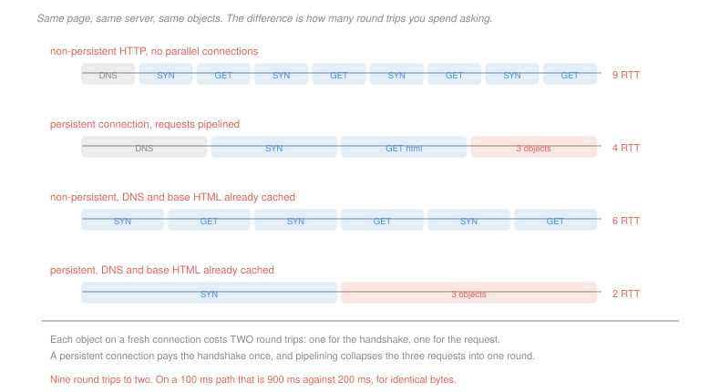

# Networking · Lesson 1.2: The Web and HTTP

> ⏱ ~15 min · Module 1: The Internet and the application layer · Builds on: [1.1 (packet switching and layers)](01-01-packet-switching-and-layers.md) · Unlocks: 1.3 (DNS), 2.3 (TCP)

## Why this matters

HTTP is the protocol you already use, and it is a good place to start because it is almost embarrassingly simple: a text request, a text response, and nothing remembered in between.

What makes it worth a lesson is that the simplicity has a cost, and the entire evolution of the web — persistent connections, pipelining, cookies, caches, content delivery networks, HTTP/2 — is a sequence of attempts to pay that cost down. Every one of them is an answer to the same question from [1.1](01-01-packet-switching-and-layers.md): *how do we spend fewer round trips?*

Counting round trips is the skill. A page that loads in 200 ms and one that loads in 2 seconds usually differ by nothing but the number of times somebody had to ask.

## The idea

An HTTP exchange is a request and a response over a TCP connection:

```
GET /index.html HTTP/1.1
Host: example.com
If-Modified-Since: Tue, 09 Sep 2026 11:00:00 GMT
```

```
HTTP/1.1 200 OK
Content-Length: 4213
Last-Modified: Wed, 10 Sep 2026 08:12:00 GMT

<html>...
```

The response's status code carries the whole outcome: `200` here, `304 Not Modified` if the conditional request above found nothing new, `404` if the object is gone, `301` for a permanent redirect.

**HTTP is stateless.** The server keeps nothing between requests, which is what let one server handle enormous numbers of clients and what makes any server interchangeable with any other. It is also why a shopping cart needs a mechanism bolted on — **cookies**, an identifier the server sets and the browser returns on every subsequent request, so state lives in a database keyed by that identifier rather than in the connection.

**The cost of a fresh connection is two round trips**, and this is the number to carry. One for TCP's handshake ([2.3](02-03-tcp-segments-connections-flow-control.md)), one for the request and its response. So:

- **Non-persistent HTTP** opens and closes a connection per object. Ten objects cost twenty round trips.
- **Persistent HTTP** — the default since 1.1 — reuses one connection. Ten objects cost one handshake plus ten request rounds.
- **Pipelining** sends the requests without waiting for each response, collapsing those ten rounds into one.

**Caching** attacks the problem from the other direction, by not asking at all:

- The **browser cache** holds objects locally, revalidating with a conditional `GET` that costs one round trip and no data when the answer is `304`.
- A **web cache** (proxy) sits at an institution's edge and serves everybody's hits, which reduces both delay and the load on the access link — and P2 shows the second effect is the larger one.
- A **content delivery network** goes further and moves the copy geographically closer, attacking the propagation delay that [1.1](01-01-packet-switching-and-layers.md) showed you cannot otherwise reduce.

## The formal version

> **Page-load time in round trips**, for a base page referencing $n$ objects on the same server, with transmission time negligible and one RTT per exchange:

$$T_{\text{non-persistent}} = \underbrace{1}_{\text{DNS}} + \underbrace{2}_{\text{base}} + 2n$$
$$T_{\text{persistent, pipelined}} = \underbrace{1}_{\text{DNS}} + \underbrace{1}_{\text{handshake}} + \underbrace{1}_{\text{base}} + \underbrace{1}_{\text{all } n \text{ objects}}$$

In words: without persistence every object costs a handshake and a request; with it you pay the handshake once and can ask for everything at once.

For three objects that is 9 round trips against 4. On a 100 ms path, 900 ms against 400 ms, for identical bytes.

**Parallel connections** are the other classic remedy: open $k$ connections at once and fetch $\lceil n/k\rceil$ batches of objects, each batch costing 2 round trips. Browsers did this for years, with $k$ around six. It works, and it is antisocial — $k$ connections get roughly $k$ times the share of a congested bottleneck ([2.4](02-04-tcp-congestion-control.md)), so the fix for one page's latency is a tax on everyone else's.

> **Head-of-line blocking.** In HTTP/1.1 pipelining, responses must come back **in request order**. One slow object stalls every response queued behind it, however fast those are.

This is why pipelining was specified, implemented, and then disabled by default in every major browser. HTTP/2's answer is **multiplexing**: many independent streams over one connection, with responses interleaved in any order, so a slow object delays only itself. That is the single biggest structural change in the protocol's history, and it exists to fix one queueing pathology.

## Picture



## Worked examples

**Example 1 — the same page, four ways.** A page references three small objects on one server, one RTT per exchange, transmission negligible.

| scenario | round trips |
|---|---|
| non-persistent, no parallelism | $1 + 2 + 2(3) = 9$ |
| persistent, pipelined | $1 + 1 + 1 + 1 = 4$ |
| non-persistent, DNS and base HTML cached | $2(3) = 6$ |
| persistent, DNS and base HTML cached | $1 + 1 = 2$ |

Two observations that generalise. First, **persistence helps most when there are many objects**, because it removes a per-object cost — at 30 objects it is 63 round trips against 4. Second, caching the base page does *not* remove the need for a connection: the referenced objects still have to come from somewhere, so the persistent-cached case is 2 rather than 0.

**Example 2 — where a cache actually pays.** An institution has a 100 Mb/s access link to the Internet. Its users generate 60 requests per second for objects averaging 1.25 Mbit. The round trip into the Internet and back averages 1.8 seconds; the local network is negligible.

*Without a cache.* All 60 requests per second cross the access link:

$$\rho = \frac{60 \times 1.25\times 10^6}{10^8} = 0.75, \qquad d_{\text{access}} = \frac{L/R}{1-\rho} = \frac{12.5\ \text{ms}}{0.25} = 50\ \text{ms}$$
$$\text{average response} = 1.8 + 0.050 = 1.85\ \text{s}$$

*With a cache at a 45 percent hit rate.* Only 55 percent of requests leave:

$$\rho = 0.55 \times 0.75 = 0.4125, \qquad d_{\text{access}} = \frac{12.5}{0.5875} = 21.3\ \text{ms}$$
$$\text{average} = 0.45(0.001) + 0.55(1.8 + 0.0213) = \boxed{1.00\ \text{s}}$$

A 46 percent reduction from a 45 percent hit rate — and notice *why*. Only 0.45 of the gain is served locally. The rest comes from the access link's queueing delay falling from 50 ms to 21 ms, because a cache reduces **load**, not just latency, and load is the term that behaves non-linearly. Buying a faster access link would have cost money; the cache reduced the traffic instead.

## Watch out

- **You might think a 304 response is a wasted request.** It costs one round trip and transfers no body, against a full download. For a large object that is an enormous saving; for a tiny one on a long path it can be slower than just fetching it, which is why cache-control headers that avoid revalidation entirely exist.
- **You might think statelessness is a limitation.** It is the property that lets any of a thousand servers answer any request, which is what makes web scaling straightforward. Cookies do not add state to HTTP; they add a *key* so the state can live somewhere shared.
- **You might think pipelining and multiplexing are the same idea.** Pipelining sends requests early and still forces responses back in order. Multiplexing removes the ordering constraint. The difference is precisely head-of-line blocking, and it is the reason one was abandoned and the other adopted.

## One-liner

> Every fresh connection costs two round trips and HTTP remembers nothing between them, so persistence, pipelining, caching, content delivery networks and HTTP/2 are all the same optimisation: ask fewer times, and ask closer to home.

## Problems

**P1 (🟢)** A page references eight objects, all on one server. One RTT per exchange, transmission negligible, nothing cached. (a) Give the load time in round trips with non-persistent HTTP and no parallelism. (b) Give it with persistent HTTP and pipelining. (c) Give it with non-persistent HTTP over four parallel connections, and state which of the three you would deploy and the one cost of that choice.

**P2 (🟡)** A campus has a 50 Mb/s access link. Users generate 25 requests per second for objects averaging 1 Mbit, and the round trip into the Internet averages 2.0 seconds. Local delay is negligible; model the access-link delay as $(L/R)/(1-\rho)$. (a) Give the traffic intensity, access delay and average response time with no cache. (b) Give all three with a cache at a 40 percent hit rate. (c) The alternative proposal is to upgrade the link to 100 Mb/s with no cache. Give the average response time under that plan and say which option you would choose, with the reason.

**P3 (🔴, optional)** (a) For each problem, name the HTTP mechanism that solves it and state in one clause what it costs: a user's shopping cart is empty on every page; ten objects each pay a handshake; a large unchanged image is re-downloaded hourly; a European user waits 150 ms per round trip to a server in Oregon. (b) An HTTP/1.1 pipelined connection requests four objects whose server-side generation times are 500 ms, 10 ms, 10 ms and 10 ms. Give the time at which each response is delivered, and the same figures if the connection is HTTP/2 multiplexed. (c) Name the phenomenon in (b) and state which layer of [1.1](01-01-packet-switching-and-layers.md)'s stack it also occurs in.

<details>
<summary>Solutions</summary>

**P1** *(a) Non-persistent, no parallelism.*
$$1 + 2 + 2(8) = \boxed{19 \text{ RTT}}$$

*(b) Persistent, pipelined.*
$$1 + 1 + 1 + 1 = \boxed{4 \text{ RTT}}$$

*(c) Non-persistent over four parallel connections.* DNS is 1, the base page is 2, and the eight objects go in $\lceil 8/4\rceil = 2$ batches of four, each batch costing a handshake and a request:
$$1 + 2 + 2(2) = \boxed{7 \text{ RTT}}$$

*Which to deploy:* **persistent with pipelining or multiplexing**, at 4 round trips. It is the fastest of the three and it uses one connection.

*The one cost:* under HTTP/1.1 pipelining, the ordering constraint means a single slow object stalls everything behind it — P3(b) makes that concrete — so in practice you want HTTP/2 multiplexing rather than 1.1 pipelining to get the 4 without the risk. Note also what parallel connections really buy: 7 round trips, better than 19, at the price of taking four times the share of a congested bottleneck, which is a cost borne by other users rather than by you.

**P2** *(a) No cache.* Objects are $10^6$ bits and the link is $5\times 10^7$ bit/s, so $L/R = 20$ ms.
$$\rho = \frac{25\times 10^6}{5\times 10^7} = \boxed{0.50}, \qquad d_{\text{access}} = \frac{20}{1 - 0.50} = \boxed{40\ \text{ms}}$$
$$\text{average response} = 2.0 + 0.040 = \boxed{2.04\ \text{s}}$$

*(b) With a 40 percent hit rate.*
$$\rho = 0.60\times 0.50 = \boxed{0.30}, \qquad d_{\text{access}} = \frac{20}{0.70} = \boxed{28.6\ \text{ms}}$$
$$\text{average} = 0.40(0) + 0.60(2.0 + 0.0286) = \boxed{1.22\ \text{s}}$$

*(c) The 100 Mb/s upgrade instead.* Now $L/R = 10$ ms and $\rho = 25\times 10^6/10^8 = 0.25$:
$$d_{\text{access}} = \frac{10}{0.75} = 13.3\ \text{ms}, \qquad \text{average} = 2.0 + 0.0133 = \boxed{2.01\ \text{s}}$$

**Choose the cache.** Doubling the link bought 1.5 percent; the cache bought 40 percent.

The reason is worth stating plainly: at $\rho = 0.5$ the access link contributes 40 ms out of 2,040, so **the link was never the problem**. The 2.0 seconds of Internet round trip is the whole cost, and the only way to reduce it is to not make the round trip — which is what a cache does and what more bandwidth cannot. This is [1.1](01-01-packet-switching-and-layers.md)'s lesson in commercial form: when latency dominates, capacity is the wrong purchase.

**P3** *(a) Mechanism, and its cost.*

| problem | mechanism | cost |
|---|---|---|
| cart empty on every page | **cookies** | a tracking identifier the browser returns everywhere, with the privacy consequences that follow |
| ten objects each pay a handshake | **persistent connections** | the server holds idle connections open, consuming memory and descriptors |
| large unchanged image re-downloaded | **conditional GET**, revalidating with `If-Modified-Since` | one round trip per object even when nothing changed |
| European user 150 ms from Oregon | **a content delivery network** | operational cost and cache-consistency complexity, since the copy can be stale |

*(b) Four objects with generation times 500, 10, 10, 10 ms.*

**HTTP/1.1 pipelined.** All four requests go out at $t = 0$; responses must be returned in request order, so nothing may be sent before object 1 is ready.

| object | ready at | delivered at |
|---|---|---|
| 1 | 500 ms | **500 ms** |
| 2 | 10 ms | **500 ms** |
| 3 | 10 ms | **500 ms** |
| 4 | 10 ms | **500 ms** |

**HTTP/2 multiplexed.** Responses interleave freely on independent streams, so each is delivered when it is ready:

| object | delivered at |
|---|---|
| 2, 3, 4 | **10 ms** |
| 1 | **500 ms** |

Three of the four objects arrive fifty times sooner, and the page can begin rendering at 10 ms instead of 500. Nothing about the server, the network or the bytes changed — only the rule about ordering.

*(c) The phenomenon and where else it appears.* **Head-of-line blocking**: the item at the front of a queue holds up everything behind it, regardless of whether those items are ready.

It also occurs at the **transport layer**, inside TCP itself. TCP delivers a byte stream in order, so a single lost segment stalls delivery of every later segment that has already arrived, until the retransmission completes. That is why HTTP/2's fix is incomplete — it removes head-of-line blocking *between streams at the application layer* while leaving it in place at the transport layer underneath, and it is precisely why HTTP/3 abandoned TCP for a protocol built on UDP with per-stream reliability. The pathology is the same one twice, at two layers, and fixing it at one does not fix it at the other.

</details>

## Connections

- **Backward:** the round-trip accounting is [1.1](01-01-packet-switching-and-layers.md)'s propagation delay, and the cache calculation in Example 2 is its traffic-intensity formula applied to an access link.
- **Forward:** [1.3](01-03-dns-the-internets-directory.md) explains where the first round trip in every count above comes from, and how caching removes it. The two round trips a fresh connection costs are the handshake of [2.3](02-03-tcp-segments-connections-flow-control.md), and the antisocial behaviour of parallel connections is a fairness question answered in [2.4](02-04-tcp-congestion-control.md).
- **Sideways:** head-of-line blocking is the convoy effect of [`operating-systems` 1.5](../../operating-systems/lessons/01-05-cpu-scheduling.md) — one long job at the front of a queue delaying every short job behind it — and the remedies are the same in both settings: allow reordering, or use separate queues. A web cache is the buffer cache of [`operating-systems` 4.4](../../operating-systems/lessons/04-04-io-and-disk-scheduling.md) at a different scale, with the same property that reducing load matters more than reducing latency.
