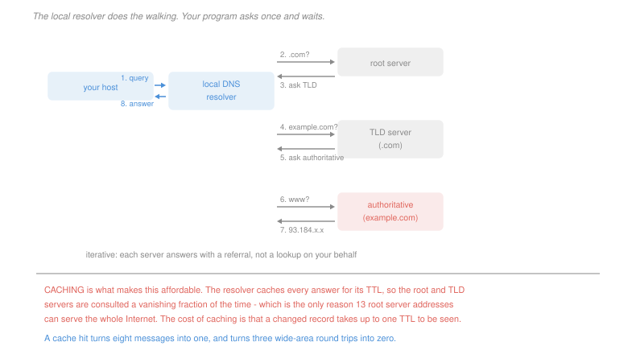

# Networking · Lesson 1.3: DNS, the Internet's directory

> ⏱ ~15 min · Module 1: The Internet and the application layer · Builds on: [1.2 (HTTP)](01-02-the-web-and-http.md), [1.1 (delay)](01-01-packet-switching-and-layers.md) · Unlocks: 2.1 (transport), 3.2 (IP addressing)

## Why this matters

Every page load in [1.2](01-02-the-web-and-http.md) began with one round trip labelled "DNS", and it was doing something remarkable: turning a name into an address by consulting a database distributed over millions of servers, with no central copy, in about the time it takes light to cross an ocean.

Two things make it worth studying beyond the mechanics. It is the cleanest example in the course of **hierarchy plus caching** solving a scaling problem that neither solves alone — the root servers would collapse in minutes without the caching, and the caching would be useless without the hierarchy telling it what to cache.

And DNS is a **layer of indirection** that turned out to be worth far more than name lookup. Content delivery networks, load balancing, failover and blue-green deployment are all implemented by answering the same question differently, which is a good reminder that indirections get used for things their designers never intended.

## The idea

Names are hierarchical, read right to left: `www.example.com` is the host `www` inside the zone `example.com` inside the top-level domain `com`.

The servers mirror that hierarchy:

- **Root servers** know the top-level domains. There are 13 root *addresses*, served by hundreds of physical machines.
- **Top-level domain servers** know the authoritative servers for each zone in `com`, `org`, `uk` and the rest.
- **Authoritative servers** hold the actual records for a zone. Whoever runs `example.com` runs these.
- **Local resolvers** belong to your network or your provider and do the work on your behalf.

Two query styles, and the split matters:

> **Recursive** — the client asks one server for the final answer and waits. Your host does this, once, to its local resolver.
>
> **Iterative** — the server answers with a *referral* to the next server down. The local resolver does this, walking root, then TLD, then authoritative.

So your program issues one query and gets one answer; the resolver behind it makes three. The reason for the split is load: making the root servers do recursive work for the whole Internet is impossible, while making every laptop walk the hierarchy is merely wasteful.

**Caching is what makes it affordable.** Every answer carries a **time to live**, and the resolver caches it for that long. Since TLD referrals change almost never, a resolver's cache answers nearly every query without touching the root at all — the root sees a vanishing fraction of the world's lookups. That is the whole reason 13 root addresses suffice.

The records themselves come in types:

| type | maps | example |
|---|---|---|
| `A` / `AAAA` | name to an IPv4 / IPv6 address | `example.com` → `93.184.x.x` |
| `NS` | zone to its authoritative server's name | `example.com` → `ns1.example.com` |
| `CNAME` | alias to a canonical name | `www.example.com` → `example.map.cdn.net` |
| `MX` | domain to its mail server | for [1.4](01-04-email-and-peer-to-peer.md)'s SMTP |

## The formal version

> **DNS runs over UDP** on port 53, with one datagram out and one back.

The reason is [1.1](01-01-packet-switching-and-layers.md)'s arithmetic. A TCP query would cost a handshake before the question could even be asked, tripling the cost of a lookup that is a single small exchange. Losing a datagram costs one timeout and a retry, which is cheaper on average than paying a handshake every time. DNS falls back to TCP only when a response is too large for a datagram.

> **Cache hit rate.** With a record of time to live $T$ and a steady query rate $q$ per unit time against one resolver, the resolver must refetch once per $T$:
> $$\text{misses per unit time} = \frac{1}{T}, \qquad \text{hit rate} = 1 - \frac{1}{qT}$$

In words: the hit rate depends on the *product* of query rate and TTL, so a popular name with a short TTL can still cache well and an unpopular name with a long one may not.

**The TTL trade is the central operational decision** and it is a genuine conflict:

| long TTL | short TTL |
|---|---|
| high hit rate, low load, fast lookups | low hit rate, more queries, slower lookups |
| a change takes up to $T$ to propagate | a change propagates in seconds |

A site that never moves sets days. A site that must fail over to a standby within a minute sets 60 seconds and pays for it on every lookup. P2 quantifies both ends.

**DNS as indirection.** Because the answer is computed per query, the authoritative server can answer *differently* depending on who asked. A content delivery network returns the address of a nearby cache; a load balancer returns whichever server is healthy; a deployment returns the new cluster. None of this is in the protocol — it falls out of the fact that a name resolves to whatever the operator says today.

## Picture

## Worked examples

**Example 1 — counting messages, cold and warm.** A host resolves `www.example.com` with an empty resolver cache.

| step | message |
|---|---|
| 1 | host → local resolver: "www.example.com?" |
| 2–3 | resolver → root, root → referral to the `com` servers |
| 4–5 | resolver → `com`, referral to `example.com`'s authoritative server |
| 6–7 | resolver → authoritative, the `A` record comes back |
| 8 | local resolver → host: the address |

**Eight messages, four exchanges**, three of them wide-area. Now the same query a minute later: the resolver has the record cached, so it is **two messages, one exchange, entirely local** — typically under a millisecond against tens or hundreds.

And note the intermediate case, which is the common one in practice. A *different* name in the same zone, say `img.example.com`, still misses on the `A` record but hits on the cached referrals for `com` and `example.com`. That is **four messages**, and it is why the first page load of a session is slow and the rest are not.

**Example 2 — what a TTL costs and buys.** A name receives 500 queries per hour at one resolver.

| TTL | misses per hour | hit rate | time for a change to propagate |
|---|---|---|---|
| 86,400 s (1 day) | 0.04 | 99.99% | up to 24 hours |
| 3,600 s (1 hour) | 1 | 99.8% | up to 1 hour |
| 60 s | 60 | 88.0% | up to 1 minute |

The revealing row is the middle one. Dropping from a day to an hour costs **0.19 percentage points of hit rate** — one extra miss per hour out of 500 queries — and cuts the propagation delay by a factor of 24. Dropping further to 60 s costs 12 points, which is a real expense.

That is the shape of the trade in general: the hit rate is $1 - 1/(qT)$, so it flattens hard once $qT$ is large and collapses once $qT$ approaches 1. **Most operators set TTLs far longer than they need to**, and the calculation above is how you find the shortest one whose cost is still negligible.

## Watch out

- **You might think there is a DNS server that knows everything.** There is no complete copy anywhere. The root knows only who runs each top-level domain, and the answer to any query is assembled by walking down.
- **You might think a short TTL is safer.** It is faster to change and it makes you *more* dependent on your DNS infrastructure being reachable, because every client re-queries constantly. Several large outages have been made worse by short TTLs: caches expired during the incident and clients could no longer resolve anything at all.
- **You might think the local resolver is part of your host.** It is usually your provider's or your employer's, which is why it can see every name you look up, and why encrypted-DNS proposals exist.

## One-liner

> A hierarchy tells you where to ask and caching means you almost never have to, and because the answer is computed per query rather than stored, the same lookup became the Internet's load balancer.

## Problems

**P1 (🟢)** A host with an empty local resolver cache loads a page whose objects come from `www.shop.com`, `img.shop.com` and `cdn.other.net`. Assume iterative resolution from the resolver and no records cached anywhere. (a) Give the number of wide-area exchanges the resolver performs for each of the three names, in order. (b) Give the total. (c) State which cached records made the second name cheaper than the first, and by how many exchanges.

**P2 (🟡)** A name receives 1,200 queries per hour at a resolver. (a) Give the miss count per hour and the hit rate for TTLs of 30 s, 300 s and 7,200 s. (b) The operator must be able to fail over to a standby address within 5 minutes. Give the longest TTL that meets it and the hit rate it yields. (c) Give the shortest TTL that costs no more misses per hour than a one-day TTL would, and state what that says about the choice in (b).

**P3 (🔴, optional)** (a) For each goal, state whether DNS alone can achieve it and name the record type or mechanism: send European users to a European server; move a service to a new provider without changing any client; direct mail for `example.com` to a third-party provider; make a service survive its own authoritative servers going offline. (b) A company runs a 24-hour TTL and its data centre fails. Give the sequence of what clients experience over the following day, and state the property of caching that causes it. (c) The company reduces the TTL to 60 s. Construct the new failure mode this introduces, and state the standard mitigation.

Solutions

**P1** *(a) Wide-area exchanges per name, in order.*

| name | exchanges | what is needed |
|---|---|---|
| `www.shop.com` | **3** | root (referral to `com`), `com` (referral to `shop.com`), authoritative (the `A` record) |
| `img.shop.com` | **1** | root and `com` referrals are cached, and so is `shop.com`'s authoritative server — only the `A` record is missing |
| `cdn.other.net` | **2** | the root referral is cached; `net` and `other.net` are not, so the TLD and authoritative queries remain |

*(b) Total.*
$$3 + 1 + 2 = \boxed{6 \text{ wide-area exchanges}}$$

Against the naive count of $3\times 3 = 9$.

*(c) What made the second name cheap.* The cached **root referral to `com`** and the cached **`com` referral to `shop.com`'s authoritative server** — the `NS` records — saved **2 exchanges**.

That is the general pattern and it is why the hierarchy pays: the *upper* levels of the tree are shared by every name beneath them, so they are cached almost immediately and almost permanently, while only the leaf record has to be fetched. The third name shows the same effect partially, sharing the root but not `net`.

**P2** *(a) Misses and hit rate at 1,200 queries per hour.* The resolver refetches once per TTL, so misses per hour is $3600/T$.

| TTL | misses per hour | hit rate |
|---|---|---|
| 30 s | 120 | $1 - 120/1200 = \boxed{90.0\%}$ |
| 300 s | 12 | $1 - 12/1200 = \boxed{99.0\%}$ |
| 7,200 s | 0.5 | $\boxed{99.96\%}$ |

*(b) Failover within 5 minutes.* Clients may cache for up to one TTL, so the TTL must not exceed the failover budget:
$$T \le 300\ \text{s}, \qquad \text{hit rate at } T = 300\ \text{s} = \boxed{99.0\%}$$

*(c) The shortest TTL that costs nothing.* A one-day TTL yields $3600/86400 = 0.042$ misses per hour, essentially zero. To match "no more misses than that" exactly would require an infinite TTL, so the useful question is the shortest TTL whose miss count is *negligible against the query rate* — say under 1 percent of queries, which needs

$$\frac{3600/T}{1200}\le 0.01 \;\Longrightarrow\; T \ge 300\ \text{s}$$

$$\boxed{T = 300 \text{ s}}$$

*What that says about (b):* the 5-minute failover requirement and the "costs essentially nothing" threshold land on **the same TTL**. So the operator can have both — a 99 percent hit rate and five-minute failover — and the day-long TTL they might have set by default was buying 0.96 percentage points of hit rate in exchange for 24 hours of failover latency. Doing this calculation is the difference between choosing a TTL and inheriting one.

**P3** *Accept criterion for (c): any failure mode in which the increased query rate or the loss of the authoritative servers becomes the outage, with a named mitigation.*

*(a) What DNS can and cannot do.*

| goal | DNS alone? | mechanism |
|---|---|---|
| European users to a European server | **yes** | the authoritative server answers the `A` query differently based on the resolver's location — the whole basis of content delivery networks |
| move a service to a new provider transparently | **yes** | change the `A` record, or point a `CNAME` at the provider's name so they control the address |
| mail for `example.com` to a third party | **yes** | an `MX` record, which is exactly what the type exists for |
| survive the authoritative servers going offline | **no** | DNS has no answer for this. Once cached records expire, clients cannot resolve at all. The mitigation is outside the protocol: multiple authoritative servers in independent networks, ideally under separate operators |

The fourth row is the important one. The first three are all the same trick — the answer is computed, so it can be any answer — and the fourth is a case where indirection provides nothing, because the indirection itself is the thing that failed.

*(b) A 24-hour TTL and a data-centre failure.*

| time | what clients experience |
|---|---|
| 0 | the data centre fails; every cached record still points at it |
| 0 to 24 h | clients with the record cached connect to a dead address and time out. Changing the `A` record has **no effect on them** |
| gradually | as each resolver's cached record expires, its users move to the new address, one resolver at a time |
| 24 h | the last cache expires and everybody is migrated |

*The property that causes it:* **a cache cannot be invalidated by the origin.** DNS caching is expiry-based, not invalidation-based — the resolver decides when to ask again, and nothing gives the authoritative server a way to say "that answer is now wrong." The TTL is a promise you made in advance and cannot withdraw.

*(c) The 60-second failure mode.* Reducing the TTL to 60 s multiplies the query rate against the authoritative servers by a factor of about 5 in the P2(a) sense, and creates a new dependency: **every client now needs DNS to be reachable every minute.** The failure mode is therefore an outage of the authoritative servers themselves — or of the network path to them, or a denial-of-service against them ([4.4](04-04-network-security-tls-firewalls-attacks.md)). With a 24-hour TTL such an outage is invisible for a day; with 60 seconds the whole service disappears in about a minute, even though the service itself is perfectly healthy.

That is a genuine reversal, not a smaller version of the same risk: a long TTL makes you fragile to *your own change propagation*, and a short one makes you fragile to *your DNS infrastructure*.

*The standard mitigation:* **serve-stale**. A resolver that cannot reach the authoritative server keeps using the expired record rather than failing, on the reasoning that a possibly stale answer beats no answer. Combined with several authoritative servers in independent networks, it lets an operator run a short TTL for fast failover while remaining tolerant of the DNS layer being briefly unreachable.

## Flashback

**From Lesson 1.1 (packet switching and layers):** A 9,000-byte file crosses two links in series: the first is 10 Mb/s over 20 km, the second 1 Mb/s over 500 km, with signals at $2\times 10^8$ m/s and store-and-forward at the router. (a) Give the total time to deliver the file as one packet. (b) Give the path's throughput and name the bottleneck. (c) The 1 Mb/s link is upgraded to 10 Mb/s. Give the new total time and the percentage improvement.

Solution

*(a) One packet, store and forward.* The file is $9{,}000\times 8 = 72{,}000$ bits.

| term | value |
|---|---|
| transmission, link 1 | $72{,}000 / 10^7 = 7.2$ ms |
| propagation, link 1 | $20{,}000 / (2\times 10^8) = 0.1$ ms |
| transmission, link 2 | $72{,}000 / 10^6 = 72$ ms |
| propagation, link 2 | $500{,}000 / (2\times 10^8) = 2.5$ ms |

$$\text{total} = 7.2 + 0.1 + 72 + 2.5 = \boxed{81.8\ \text{ms}}$$

The router must receive the whole packet before forwarding it, which is why the two transmission times add rather than overlap.

*(b) Throughput and bottleneck.*
$$\min(10, 1) = \boxed{1 \text{ Mb/s}}, \text{ the second link}$$

*(c) After the upgrade.*
$$7.2 + 0.1 + 7.2 + 2.5 = \boxed{17.0\ \text{ms}}, \qquad \text{improvement} = \frac{81.8 - 17.0}{81.8} = \boxed{79.2\%}$$

Compare with P1 in [1.1](01-01-packet-switching-and-layers.md), where a tenfold link upgrade bought 5.8 percent. The difference is which term dominated: there, propagation over 1,200 km swamped a sub-millisecond transmission time; here, 72 ms of transmission on a slow link swamps 2.6 ms of propagation. **The same upgrade is transformative or pointless depending entirely on which term was largest**, which is why the first thing to do with any path is to work out the four terms and look at their sizes before deciding what to buy.

## Connections

- **Backward:** the DNS round trip that opens every page-load count in [1.2](01-02-the-web-and-http.md) is this lesson's subject, and the argument for UDP over TCP is [1.1](01-01-packet-switching-and-layers.md)'s round-trip arithmetic applied to a single small exchange.
- **Forward:** [2.1](02-01-transport-services-multiplexing-and-udp.md) explains what "runs over UDP on port 53" actually means and why a request-response protocol is the case UDP fits. The addresses DNS returns are the subject of [3.2](03-02-ip-addressing-subnets-cidr-and-nat.md), and DNS is itself an attack surface in [4.4](04-04-network-security-tls-firewalls-attacks.md).
- **Sideways:** hierarchy plus caching solving a scale problem neither solves alone is the same structure as the multi-level page table plus TLB in [`operating-systems` 3.2](../../operating-systems/lessons/03-02-paging-and-the-os-page-table.md), and the expiry-versus-invalidation distinction in P3 is exactly the cache-coherence question of [`computer-architecture` 5.3](../../computer-architecture/lessons/05-03-multiprocessors-cache-coherence.md) — where the hardware *can* invalidate, at a cost DNS is not willing to pay across the whole Internet.
