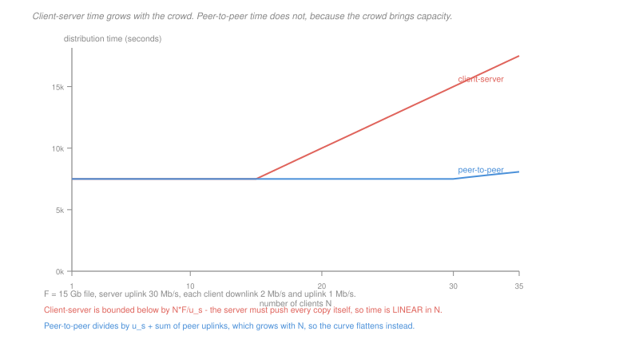

# Networking · Lesson 1.4: Email and the peer-to-peer model

> ⏱ ~15 min · Module 1: The Internet and the application layer · Builds on: [1.2 (HTTP)](01-02-the-web-and-http.md), [1.3 (DNS)](01-03-dns-the-internets-directory.md) · Unlocks: 2.1 (transport)

## Why this matters

Two applications, chosen because each breaks an assumption the web quietly installed.

**Email** breaks the pull assumption. HTTP is a client asking for something; SMTP is a server *pushing* a message to another server that never asked. The difference sounds cosmetic and it drives everything about how mail is delivered, queued, retried and abused.

**Peer-to-peer** breaks the client-server assumption, and this is the one with the general lesson. In client-server, every new user is a cost — one more download the server must supply. In peer-to-peer, every new user brings capacity as well as demand, so the system's ability to serve grows with the load on it. That is a rare property, and it is worth understanding exactly when it holds.

## The idea

**SMTP is a push protocol.** Your client hands the message to your provider's mail server, which looks up the recipient domain's `MX` record ([1.3](01-03-dns-the-internets-directory.md)), opens a connection to that server, and pushes. No one requested the message.

Two consequences follow directly. Delivery is **store-and-forward at the application layer**: if the receiving server is down, yours queues the message and retries for days, so mail tolerates outages that would simply fail a web request. And because anyone may push to anyone, the protocol has no natural way to refuse unwanted mail, which is why every anti-spam mechanism is a later bolt-on rather than part of the design.

Reading your mail is a *separate* protocol — IMAP or POP — because the message is sitting on your server, and retrieving it is a pull. Mail therefore uses push between servers and pull at the last hop, and the split is the clue: **push when the sender knows who should receive it, pull when the receiver decides when to look.**

**Peer-to-peer.** In the client-server model one server holds the file and uploads a copy to each of $N$ clients. Its uplink is a hard bound: $N$ copies must leave it, so the time to serve everyone is at best $NF/u_s$, **linear in $N$**.

In peer-to-peer, a peer that has received a chunk can upload it to others. The system's total upload capacity is $u_s + \sum_i u_i$, which *grows* with $N$. Adding a user adds both a demand and a supply, and the two nearly cancel.

**BitTorrent** is the design that makes this work, and its two mechanisms are the interesting part:

- **Chunks.** The file is split into pieces (typically 256 KB) so a peer can start uploading after receiving one piece rather than the whole file. Without this, nobody can help until they are finished, and the swarm never starts.
- **Rarest first.** A peer requests the chunk that fewest of its neighbours have, which keeps the rare chunks spreading and avoids the state where one piece exists in a single copy and everybody is waiting for it.
- **Tit-for-tat.** A peer uploads preferentially to the four neighbours currently sending it data fastest, and periodically "optimistically unchokes" a random other peer to discover better partners. This is what makes free-riding unprofitable: contribute nothing and the peers with capacity stop sending to you.

## The formal version

> **Distribution time**, for a file of size $F$ to $N$ clients, with server uplink $u_s$, minimum client downlink $d_{\min}$ and client uplinks $u_i$:

$$D_{\text{cs}} = \max\left\{\frac{NF}{u_s},\ \frac{F}{d_{\min}}\right\}$$

$$D_{\text{p2p}} = \max\left\{\frac{F}{u_s},\ \frac{F}{d_{\min}},\ \frac{NF}{u_s + \sum_{i=1}^{N} u_i}\right\}$$

In words: each is bounded by three things — how fast the server can push, how fast the slowest client can pull, and how fast the total upload capacity can produce $N$ copies. The difference is entirely in the third term.

Read what happens as $N$ grows. In $D_{\text{cs}}$ the first term is $N F/u_s$, which grows without bound. In $D_{\text{p2p}}$ the third term is

$$\frac{NF}{u_s + N u} \;\xrightarrow[N\to\infty]{}\; \frac{F}{u}$$

a **finite limit**. The peer-to-peer distribution time approaches a ceiling set by one peer's uplink and never exceeds it, however large the swarm.

That asymptote is the whole content of the model. Client-server time is linear in the crowd; peer-to-peer time is bounded.

**Where it does not hold.** The argument assumes peers upload while they download and stay after finishing, and that the content is the same for everyone. A service that is personalised per user, or where peers leave the instant they are done, gets none of this. It is a property of *bulk distribution of identical content*, not of decentralisation in general.

## Picture

## Worked examples

**Example 1 — the two curves.** A 15 Gb file, server uplink 30 Mb/s, every client with a 2 Mb/s downlink and a 1 Mb/s uplink.

| $N$ | $D_{\text{cs}}$ | $D_{\text{p2p}}$ | what binds P2P |
|---|---|---|---|
| 1 | 7,500 s | 7,500 s | $F/d_{\min}$ — the client's own downlink |
| 10 | 7,500 s | 7,500 s | $F/d_{\min}$ |
| 100 | 50,000 s | 11,538 s | $NF/(u_s + Nu)$ |
| 1,000 | 500,000 s | 14,563 s | $NF/(u_s + Nu)$ |

At $N = 1{,}000$ the client-server design takes nearly six days and the peer-to-peer design takes four hours. And notice the ceiling: $F/u = 15{,}000$ s, so no swarm however large exceeds 4 hours 10 minutes.

The crossover is where $NF/u_s$ rises above $F/d_{\min}$:

$$\frac{NF}{u_s} > \frac{F}{d_{\min}} \;\Longleftrightarrow\; N > \frac{u_s}{d_{\min}} = \frac{30}{2} = 15$$

Below 15 clients the server's uplink is not the constraint and the two designs are identical. **Peer-to-peer buys nothing until the server is the bottleneck**, which is the honest version of the claim and the reason it is used for popular content and nothing else.

**Example 2 — why chunks are not an optimisation.** Suppose BitTorrent distributed whole files instead of pieces, with one seed and 100 peers who all start together.

For the first $F/u_s$ seconds, the seed uploads to one peer at a time. No peer can help, because a peer holds nothing until its download completes. So the swarm's total upload capacity is $u_s$ — the same as client-server — until the first peer finishes, and only then does it become $2u_s$, and so on.

$$\text{copies after time } t \approx 2^{\,t u_s / F}$$

which is exponential and therefore eventually fast, but the *first* doubling takes a full file transfer, and with $F/u_s = 500$ s that is over eight minutes before any parallelism exists at all.

With 256 KB chunks the first chunk completes in about 0.07 seconds and that peer can immediately serve it. **The whole benefit of peer-to-peer arrives at the granularity of the piece**, not the file, which is why chunking is the design and not a detail.

## Watch out

- **You might think peer-to-peer is always faster.** Below the crossover it is identical, and for unpopular content it is worse — a swarm with one seed and one peer is client-server with extra steps.
- **You might think SMTP delivers to your inbox.** It delivers to your *server*. Your client then pulls with IMAP, which is why mail arrives while your laptop is closed and why the two protocols have entirely different failure modes.
- **You might think tit-for-tat is about fairness.** It is about incentive compatibility. A free-rider is not punished for being unfair; they are simply not chosen, because the algorithm allocates upload to whoever is currently useful. That it produces something fairness-shaped is a consequence, not a goal.

## One-liner

> Client-server time grows linearly with the crowd because every copy leaves one uplink, while peer-to-peer time approaches a ceiling because each new user brings capacity as well as demand — provided the content is identical and peers upload while they download.

## Problems

**P1 (🟢)** A 20 Gb file is distributed from a server with a 50 Mb/s uplink to clients each having a 5 Mb/s downlink and a 2 Mb/s uplink. (a) Give $D_{\text{cs}}$ and $D_{\text{p2p}}$ for $N = 10$ and for $N = 500$. (b) For each of the four figures, name which of the three terms binds. (c) Give the limit of $D_{\text{p2p}}$ as $N$ grows without bound.

**P2 (🟡)** Using the same parameters as P1. (a) Give the smallest $N$ at which the client-server time exceeds the single-client floor $F/d_{\min}$. (b) Give the smallest $N$ at which $D_{\text{cs}}$ is at least twice $D_{\text{p2p}}$. (c) A product manager proposes peer-to-peer for a service delivering personalised video to about 40 concurrent viewers. Give the two reasons it will not help, one from your arithmetic and one from the model's assumptions.

**P3 (🔴, optional)** (a) A BitTorrent swarm has one seed and 50 peers. Construct the failure that occurs if peers request chunks **uniformly at random** rather than rarest first, and name the state the swarm ends in. (b) Construct the failure that occurs if a peer uploads to whoever asks, with no tit-for-tat, and state what a rational peer then does. (c) For each of SMTP, IMAP and HTTP, say whether it is push or pull, and state the one property of the recipient that determines which is correct.

Solutions

**P1** *(a) The four figures.* $F = 20$ Gb $= 2\times 10^{10}$ bits, $u_s = 5\times 10^7$, $d_{\min} = 5\times 10^6$, $u = 2\times 10^6$.

$$\frac{F}{u_s} = 400\ \text{s}, \qquad \frac{F}{d_{\min}} = 4{,}000\ \text{s}$$

**$N = 10$:**
$$D_{\text{cs}} = \max\left\{\frac{10F}{u_s},\ \frac{F}{d_{\min}}\right\} = \max\{4{,}000,\ 4{,}000\} = \boxed{4{,}000\ \text{s}}$$
$$D_{\text{p2p}} = \max\left\{400,\ 4{,}000,\ \frac{10F}{5\times 10^7 + 10(2\times 10^6)}\right\} = \max\{400,\ 4{,}000,\ 2{,}857\} = \boxed{4{,}000\ \text{s}}$$

**$N = 500$:**
$$D_{\text{cs}} = \max\{200{,}000,\ 4{,}000\} = \boxed{200{,}000\ \text{s}}$$
$$D_{\text{p2p}} = \max\left\{400,\ 4{,}000,\ \frac{500F}{5\times 10^7 + 10^9}\right\} = \max\{400,\ 4{,}000,\ 9{,}524\} = \boxed{9{,}524\ \text{s}}$$

*(b) The binding term in each.*

| case | value | binding term |
|---|---|---|
| $D_{\text{cs}}$, $N=10$ | 4,000 s | a tie — $NF/u_s$ and $F/d_{\min}$ are both 4,000 |
| $D_{\text{p2p}}$, $N=10$ | 4,000 s | $F/d_{\min}$, the client's own downlink |
| $D_{\text{cs}}$, $N=500$ | 200,000 s | $NF/u_s$, the server's uplink |
| $D_{\text{p2p}}$, $N=500$ | 9,524 s | $NF/(u_s + Nu)$, the swarm's aggregate uplink |

*(c) The limit.*
$$\lim_{N\to\infty}\frac{NF}{u_s + Nu} = \frac{F}{u} = \frac{2\times 10^{10}}{2\times 10^6} = \boxed{10{,}000\ \text{s}}$$

So the peer-to-peer time never exceeds 10,000 seconds however large the swarm, while the client-server time is unbounded. At $N = 500$ it is already at 95 percent of that ceiling.

**P2** *(a) Smallest $N$ where the server's uplink binds.*
$$\frac{NF}{u_s} > \frac{F}{d_{\min}} \;\Longleftrightarrow\; N > \frac{u_s}{d_{\min}} = \frac{50}{5} = 10 \;\Longrightarrow\; \boxed{N = 11}$$

*(b) Smallest $N$ with $D_{\text{cs}}\ge 2 D_{\text{p2p}}$.* For $N > 10$ the client-server time is $NF/u_s = 400N$ seconds. The peer-to-peer time is $\max\{4{,}000,\ NF/(5\times 10^7 + 2\times 10^6 N)\}$.

While P2P is still floored at 4,000 s, the condition is $400N \ge 8{,}000$, so $N \ge 20$. Check that P2P is indeed still 4,000 at $N = 20$:
$$\frac{20F}{5\times 10^7 + 4\times 10^7} = \frac{4\times 10^{11}}{9\times 10^7} = 4{,}444\ \text{s} > 4{,}000$$

So the third term has already taken over, and the condition becomes
$$400N \ge 2\left(\frac{2\times 10^{10} N}{5\times 10^7 + 2\times 10^6 N}\right) \;\Longleftrightarrow\; 400\bigl(5\times 10^7 + 2\times 10^6 N\bigr) \ge 4\times 10^{10}$$
$$2\times 10^{10} + 8\times 10^8 N \ge 4\times 10^{10} \;\Longrightarrow\; N \ge 25$$

$$\boxed{N = 25}$$

Verifying: $D_{\text{cs}} = 10{,}000$ s and $D_{\text{p2p}} = \max\{4{,}000,\ 5\times 10^{11}/10^8\} = 5{,}000$ s, a ratio of exactly 2.

*(c) Why it will not help the personalised-video service.*

1. **From the arithmetic.** At $N = 40$ the client-server time is $400\times 40 = 16{,}000$ s and the peer-to-peer time is $\max\{4{,}000,\ 6{,}154\} = 6{,}154$ s — a real gain in this model, but the model's crossover at $N = 11$ tells you the whole benefit here is modest and the swarm is small enough that a second server would do the same job with none of the complexity. Peer-to-peer's advantage grows with $N$, and 40 is barely past the crossover.

2. **From the assumptions, and this one is fatal.** The content is **personalised**, so no two viewers want the same bytes. A peer therefore holds nothing any other peer wants, the aggregate-uplink term $NF/(u_s + Nu)$ does not apply at all, and the swarm degenerates into $N$ independent client-server transfers. Every gain in the model comes from peers serving *identical* content, and that assumption is not merely violated here — it is the opposite of the product.

**P3** *Accept criterion for (a) and (b): a described sequence ending in a named degenerate state. Any construction with the right structure is correct.*

*(a) Uniform-random chunk selection.* The seed uploads chunk after chunk; peers request uniformly, so common chunks are requested as often as rare ones.

| stage | what happens |
|---|---|
| early | the seed has uploaded, say, chunks 1 to 40 of 100; those spread quickly because everyone requests them |
| middle | chunks 41 to 100 exist in one or two copies. A uniform request is 60 percent likely to ask for something almost nobody has |
| late | almost every peer holds the same large common set and is missing a few rare chunks. Requests for those queue behind the handful of peers that hold them |
| end | the seed departs while some chunk exists in **zero** copies among the remaining peers |

The state is the **last-piece problem**, and in its terminal form the swarm is *dead*: every peer is missing at least one chunk, no peer can complete, and no peer can supply what is missing. Rarest-first prevents it by construction — a chunk held by one peer is the first thing everyone asks for, so the copy count of the rarest chunk rises fastest, and the distribution of copy counts stays flat instead of splitting into common and rare.

*(b) No tit-for-tat.* A peer that uploads to whoever asks makes contributing optional.

| stage | what happens |
|---|---|
| 1 | a peer discovers it can download at full speed while uploading nothing |
| 2 | rational peers adopt the same policy, since uploading costs bandwidth and buys nothing |
| 3 | the swarm's aggregate uplink collapses toward $u_s$ alone |
| 4 | the third term $NF/(u_s + \sum u_i)$ reverts to $NF/u_s$ |

**A rational peer free-rides**, and the equilibrium is that everyone does. The swarm's distribution time degenerates to exactly the client-server figure, so the entire advantage disappears — not gradually, but as the stable outcome that self-interest selects. Tit-for-tat makes contribution the dominant strategy instead: upload bandwidth is allocated to whoever is currently sending you the most, so withholding costs you your download rate directly. This is a mechanism-design result rather than a networking one, and it is the reason BitTorrent worked where earlier file-sharing systems did not.

*(c) Push or pull.*

| protocol | direction | why |
|---|---|---|
| SMTP | **push** | the sender knows the recipient and the recipient's server is always on, so waiting to be asked would delay delivery indefinitely |
| IMAP | **pull** | your laptop is intermittently connected, so the server cannot push to it; you ask when you are there |
| HTTP | **pull** | the server has no idea which of billions of clients wants which page, and clients are intermittent |

*The determining property:* **whether the recipient is continuously available and known in advance to the sender.** A mail server is both, so push works. A laptop or a browser is neither, so pull is the only option — and this is exactly why "push notifications" to a phone are not push at all in the protocol sense, but a long-lived connection the device opened outbound and holds open, so that the server can write down it when it has something to say.

## Flashback

**From Lesson 1.2 (the Web and HTTP):** A page's base HTML is on the origin server and its six images are on a content delivery network at a different hostname. The RTT to the origin is 160 ms and to the nearby CDN edge is 20 ms. DNS lookups cost one RTT to the relevant server and nothing is cached. (a) Give the page-load time with persistent, pipelined connections to each host. (b) Give it if all seven objects were served from the origin instead. (c) State the fraction of the saving that comes from the CDN's shorter RTT rather than from fewer round trips.

Solution

*(a) Split between origin and CDN.*

**Origin, for the base page:** DNS (1) + handshake (1) + request (1) = 3 round trips at 160 ms:
$$3 \times 160 = 480\ \text{ms}$$

**CDN, for the six images:** a second DNS lookup (1) + handshake (1) + one pipelined request round (1) = 3 round trips at 20 ms:
$$3 \times 20 = 60\ \text{ms}$$

The image fetch cannot begin until the HTML has been parsed, so the two are sequential:
$$\boxed{540\ \text{ms}}$$

*(b) All seven objects from the origin.* One host, so one DNS lookup and one connection: DNS (1) + handshake (1) + base (1) + one pipelined round for six images (1) = 4 round trips at 160 ms:
$$4\times 160 = \boxed{640\ \text{ms}}$$

*(c) Where the saving comes from.* The total saving is $640 - 540 = 100$ ms.

Count the round trips. Serving everything from the origin costs 4 round trips; the split costs 6 (three to each host), because the CDN needs its own DNS lookup and its own handshake. So the CDN version makes **two more** round trips and is still faster:

$$\text{if those 6 round trips were all at 160 ms} = 960\ \text{ms}$$

$$\text{saving from shorter RTT} = 960 - 540 = 420\ \text{ms}$$
$$\text{cost of the extra round trips} = 640 - 960 = -320\ \text{ms}$$

$$\text{net} = 420 - 320 = 100\ \text{ms}$$

So **all of the saving, and more, comes from the shorter RTT** — the extra DNS lookup and handshake are a 320 ms penalty that the proximity has to overcome first.

That is a genuinely useful conclusion and it is why sharding assets across many hostnames, which was standard advice in the HTTP/1.1 era, became bad advice: each extra hostname costs a DNS lookup and a handshake, and unless it also buys you a much closer server or many more parallel connections, it loses. It is [1.2](01-02-the-web-and-http.md)'s central question again — count the round trips, and then check what each one costs.

## Connections

- **Backward:** SMTP finds the recipient's server with the `MX` record of [1.3](01-03-dns-the-internets-directory.md), and the distribution-time formulas are [1.1](01-01-packet-switching-and-layers.md)'s bottleneck argument applied to a whole system rather than a path.
- **Forward:** [2.1](02-01-transport-services-multiplexing-and-udp.md) explains how a peer maintains dozens of simultaneous connections and how the operating system tells them apart. BitTorrent's many parallel flows are also the fairness question of [2.4](02-04-tcp-congestion-control.md) in its sharpest form.
- **Sideways:** tit-for-tat is the repeated prisoner's dilemma, and [`game-theory-refresher` 2.3](../../game-theory-refresher/lessons/02-03-repeated-games-folk-theorem.md) gives the result that makes it work — cooperation is sustainable when the interaction repeats and defection is punished. The last-piece problem in P3 is a coupon-collector phenomenon, and rarest-first is the scheduling rule that prevents a distribution from developing a tail.
