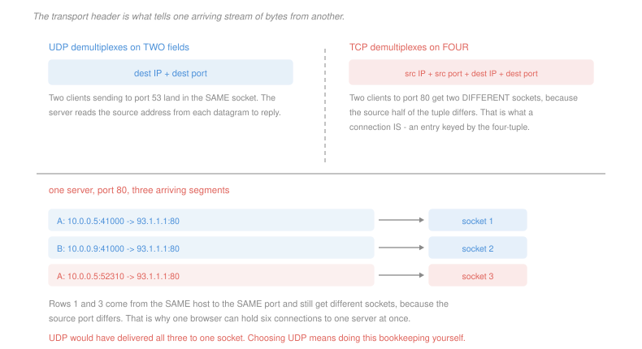

# Networking · Lesson 2.1: Transport services, multiplexing, and UDP

> ⏱ ~15 min · Module 2: The transport layer · Builds on: [1.3 (DNS)](01-03-dns-the-internets-directory.md), [1.1 (layers)](01-01-packet-switching-and-layers.md) · Unlocks: 2.2 (reliable transfer), 2.3 (TCP)

## Why this matters

IP delivers to a *host*. Your laptop is running a browser, a mail client, four terminal sessions and a music stream, and the arriving bits have to reach the right one.

That is the transport layer's minimum job and it is the whole of UDP: take IP's host-to-host delivery and make it process-to-process. Everything else TCP offers — reliability, ordering, flow control, congestion control — is optional, and this lesson is about the case where you decline it.

Declining is not perversity. The most important protocols on the modern Internet — DNS, video conferencing, QUIC and therefore HTTP/3 — all run over UDP, and they do so for reasons this lesson makes precise.

## The idea

**Multiplexing** is gathering data from many sockets at the sender and adding headers. **Demultiplexing** is reading those headers at the receiver and delivering to the right socket. The header field that does it is the **port number**, 16 bits, so 65,536 of them per host.

The two transport protocols demultiplex on different keys, and the difference is more consequential than it looks:

> **UDP demultiplexes on two fields**: the destination IP address and the destination port.
>
> **TCP demultiplexes on four**: source IP, source port, destination IP, destination port.

So two clients sending to a server's UDP port 53 land in the **same** socket, and the server reads each datagram's source address to know who to answer. Two clients connecting to TCP port 80 get **different** sockets, because the source half of the tuple differs.

That four-tuple *is* what a connection is: an entry in a table, keyed by four numbers, holding sequence state. It is also why one browser can hold six simultaneous connections to one server — same three fields, six different source ports.

**What UDP gives you** is the port numbers, a length, and an optional checksum. Nothing else. No handshake, no acknowledgement, no retransmission, no ordering, no rate control. A datagram may be lost, duplicated or delivered out of order, and you will not be told.

**Why anyone chooses it:**

- **No connection setup.** DNS ([1.3](01-03-dns-the-internets-directory.md)) would triple its cost paying for a handshake to ask one question.
- **No retransmission delay.** For live audio, a packet that arrives 300 ms late is worse than useless — you needed it 300 ms ago, and the retransmission occupies the network on its way to being discarded.
- **No head-of-line blocking.** TCP's in-order delivery means one lost segment stalls everything behind it ([1.2](01-02-the-web-and-http.md) P3). An application with independent messages does not want that coupling.
- **You want your own rate control.** TCP's congestion response is fixed; a video codec may prefer to reduce quality rather than rate.
- **No per-connection state.** A server holding a million TCP connections holds a million table entries. A UDP server holds one socket.

The honest framing: **UDP is not "TCP without the good parts", it is the transport layer with the reliability decisions handed back to the application.** QUIC — the protocol under HTTP/3 — is the clearest case: it runs over UDP and reimplements reliability, ordering and congestion control on top, *per stream*, precisely so that one lost packet stalls one stream instead of all of them.

## The formal version

> **The Internet checksum.** Treat the data as a sequence of 16-bit words. Add them with **one's complement** arithmetic — any carry out of the top bit is added back into the bottom. The checksum is the bitwise complement of that sum.

The receiver adds everything including the checksum; the result should be all ones. In words: sum the words, wrap the carries, flip the bits.

$$\text{sender: } c = \overline{\textstyle\sum_{\text{1's comp}} w_i} \qquad \text{receiver: } c + \textstyle\sum_{\text{1's comp}} w_i = \texttt{1111111111111111}$$

It is chosen for being cheap in software, not for being strong, and its weakness is easy to state and easy to construct: **any pair of errors that cancels in the sum is invisible.** Add 1 to one word and subtract 1 from another and the sum is unchanged. P2 builds one.

That weakness is tolerable because the checksum is a *last* line of defence. The link layer's cyclic redundancy check ([4.1](04-01-framing-and-error-detection.md)) is far stronger and catches almost everything on the wire; the transport checksum exists to catch corruption that happened *inside a router*, where no link-layer check covers it. It is a cheap check for a rare event, and it is deliberately weak.

> **UDP's checksum is optional in IPv4 and mandatory in IPv6.** Nothing in UDP does anything about a failed check except discard the datagram.

## Picture

## Worked examples

**Example 1 — computing and checking a checksum.** Three 16-bit words:

$$w_1 = \texttt{0110011001100000}, \quad w_2 = \texttt{0101010101010101}, \quad w_3 = \texttt{1000111100001100}$$

Add the first two:
$$\texttt{0110011001100000} + \texttt{0101010101010101} = \texttt{1011101110110101}$$

Add the third. This overflows 16 bits, so the carry wraps around and is added back at the bottom:
$$\texttt{1011101110110101} + \texttt{1000111100001100} = \texttt{1}\,\texttt{0100101011000001} \;\to\; \texttt{0100101011000010}$$

Complement to get the checksum:
$$c = \overline{\texttt{0100101011000010}} = \texttt{1011010100111101}$$

*The receiver's check:*
$$\texttt{0100101011000010} + \texttt{1011010100111101} = \texttt{1111111111111111}$$

All ones, so the check passes. The receiver never needs to know the checksum's value in advance — it adds everything and looks for that one pattern.

**Example 2 — which socket, and why it matters.** A server at `93.1.1.1` listens on TCP port 80 and UDP port 53. Four segments arrive:

| # | segment | goes to |
|---|---|---|
| 1 | TCP, from `10.0.0.5:41000` to `93.1.1.1:80` | connection socket A |
| 2 | TCP, from `10.0.0.9:41000` to `93.1.1.1:80` | connection socket **B** — the source IP differs |
| 3 | TCP, from `10.0.0.5:52310` to `93.1.1.1:80` | connection socket **C** — the source port differs |
| 4 | UDP, from anywhere to `93.1.1.1:53` | **the one** UDP socket, always |

Segments 1 and 3 come from the same host to the same port and land in different sockets. Segment 4, and every other datagram sent to port 53 from anywhere on Earth, lands in one socket.

The consequence for the server's code is total. The TCP server gets a separate socket per client with its own buffered, ordered byte stream. The UDP server gets a single socket and must read the source address out of every datagram itself and keep whatever per-client state it needs in its own data structures. **UDP does not remove the bookkeeping; it moves it into your program.**

## Watch out

- **You might think a port identifies a process.** It identifies a *socket*, and the operating system maps sockets to processes. A process can hold many, and after `fork` two processes can share one ([`operating-systems` 4.1](../../operating-systems/lessons/04-01-files-directories-and-inodes.md)).
- **You might think UDP is unreliable and TCP is reliable, full stop.** TCP is reliable *if it completes*; it can still fail, and a connection reset loses everything in flight. UDP is not lossy on purpose — most datagrams arrive — it simply makes no promise and tells you nothing.
- **You might think the checksum protects the data.** It detects some corruption. It is not integrity in the security sense: an attacker who changes the data recomputes the checksum in a microsecond. That distinction is [4.4](04-04-network-security-tls-firewalls-attacks.md)'s subject and it is worth keeping straight from the start.

## One-liner

> The transport layer's minimum job is getting bytes to the right socket, UDP does exactly that and nothing else, and the protocols that chose it did so to avoid a handshake, a retransmission delay, or a coupling between independent messages.

## Problems

**P1 (🟢)** A host at `200.1.1.1` runs a TCP server on port 8080 and a UDP server on port 9000. State which socket each arriving segment is delivered to, and give the reason in one clause: (a) TCP from `10.1.1.2:60000`; (b) TCP from `10.1.1.2:60001`; (c) TCP from `10.1.1.3:60000`; (d) UDP from `10.1.1.2:60000` to port 9000; (e) UDP from `10.1.1.7:34000` to port 9000. Then give the number of distinct sockets involved.

**P2 (🟡)** Two 16-bit words are $w_1 = \texttt{1010101010101010}$ and $w_2 = \texttt{0100110011001100}$. (a) Compute their one's complement sum and the resulting checksum. (b) Verify the receiver's check. (c) Construct a **two-bit** corruption of the data — one bit in each word — that the checksum fails to detect, and state the general rule your construction follows.

**P3 (🔴, optional)** (a) For each application, say whether UDP or TCP is the right choice and give the deciding property in one clause: a DNS lookup; a bank transfer; a live voice call; a file download; a multiplayer game's position updates; a video stream you are watching on demand. (b) HTTP/3 runs over UDP and reimplements reliability inside QUIC. Give the specific failure of running HTTP over TCP that this fixes, using a concrete instance of two independent objects and one lost packet. (c) State what QUIC must therefore implement itself that it would have got free from TCP, and name the one thing it gets that TCP could not have given it at all.

Solutions

**P1**

| | delivered to | reason |
|---|---|---|
| (a) TCP from `10.1.1.2:60000` | connection socket **1** | a new four-tuple, so a new connection socket |
| (b) TCP from `10.1.1.2:60001` | connection socket **2** | same host, different source port, so a different four-tuple |
| (c) TCP from `10.1.1.3:60000` | connection socket **3** | different source IP, so a different four-tuple |
| (d) UDP to port 9000 | **the UDP socket** | UDP keys on destination IP and port only |
| (e) UDP to port 9000 | **the same UDP socket** | likewise — the source is irrelevant to demultiplexing |

$$\text{distinct sockets} = 3 \text{ connection sockets} + 1 \text{ UDP socket} + 1 \text{ TCP listening socket} = \boxed{5}$$

The listening socket is easy to forget and worth counting: it is a real socket bound to port 8080 that accepts connections and never carries data, and each accepted connection produces a separate socket beside it.

**P2** *(a) The sum and checksum.*
$$\texttt{1010101010101010} + \texttt{0100110011001100} = \texttt{1111011101110110}$$
No carry out of the top bit, so nothing wraps.
$$c = \overline{\texttt{1111011101110110}} = \boxed{\texttt{0000100010001001}}$$

*(b) The receiver's check.*
$$\texttt{1111011101110110} + \texttt{0000100010001001} = \boxed{\texttt{1111111111111111}}$$
All ones, so the check passes.

*(c) An undetectable two-bit corruption.* Pick a bit position where the two words differ, so that one flip can go down and the other up by the same amount. Bit position 1 (value 2) works: $w_1$ has a 1 there and $w_2$ has a 0.

| | original | corrupted | change |
|---|---|---|---|
| $w_1$ | $\texttt{10101010101010}\mathbf{1}\texttt{0}$ | $\texttt{10101010101010}\mathbf{0}\texttt{0}$ | $-2$ |
| $w_2$ | $\texttt{01001100110011}\mathbf{0}\texttt{0}$ | $\texttt{01001100110011}\mathbf{1}\texttt{0}$ | $+2$ |

$$\text{new sum} = \texttt{1010101010101000} + \texttt{0100110011001110} = \texttt{1111011101110110}$$

**Identical to the original sum**, so the checksum still matches and the receiver accepts two corrupted words as correct.

*The general rule:* **any set of errors whose net effect on the one's complement sum is zero is invisible.** The simplest instance is a pair of flips at the same bit position in two different words, in opposite directions — the classic case being two bytes swapped between words, which changes the data and not the sum at all.

This is not a subtle flaw; it is the direct consequence of using addition, which is why the Internet checksum is understood as a cheap sanity check rather than a serious error detector, and why the link layer runs a cyclic redundancy check ([4.1](04-01-framing-and-error-detection.md)) underneath it.

**P3** *(a) The right transport, and why.*

| application | choice | deciding property |
|---|---|---|
| DNS lookup | **UDP** | one small request and one small reply — a handshake would triple the cost |
| bank transfer | **TCP** | every byte must arrive exactly once and in order, and a retransmission delay is irrelevant beside correctness |
| live voice call | **UDP** | a late packet is worthless, so retransmission wastes capacity to deliver something that will be discarded |
| file download | **TCP** | completeness matters, order matters, and there is no deadline |
| game position updates | **UDP** | each update supersedes the last, so a lost one should be skipped rather than resent |
| on-demand video stream | **TCP** | it is buffered ahead by seconds, so retransmission has time to complete and correctness is free |

The last two rows are the interesting contrast: both are video-ish and they differ entirely on whether there is a buffer deep enough for a retransmission to land in time.

*(b) The failure HTTP/3 fixes.* Two independent objects, an image and a stylesheet, are being fetched over one HTTP/2 connection on TCP. A single packet carrying part of the image is lost.

| layer | what happens |
|---|---|
| HTTP/2 | the two objects are separate streams and are logically independent |
| TCP | the connection is **one byte stream**, delivered strictly in order |
| result | the stylesheet's bytes have arrived and are sitting in the receiver's buffer, and TCP **will not hand them up** until the image's lost segment is retransmitted, a full round trip later |

So HTTP/2 removed head-of-line blocking between streams at the application layer and the transport layer put it straight back. QUIC's streams are independent *all the way down*: a lost packet stalls only the stream whose bytes it carried, and the stylesheet is delivered immediately.

*(c) What QUIC must build, and what it gains.*

It must reimplement, itself, everything TCP would have supplied: **sequence numbers and acknowledgements, retransmission and timers, flow control, and congestion control** — the whole of Lessons [2.2](02-02-building-reliable-data-transfer.md) to [2.4](02-04-tcp-congestion-control.md), in user space, over UDP.

*The thing TCP could not have given it:* **deployability**. Per-stream reliability could in principle be added to TCP, and it cannot in practice, because TCP is implemented in every operating system kernel and inspected by every middlebox on the path — firewalls and network address translators that drop segments they do not recognise ([3.2](03-02-ip-addressing-subnets-cidr-and-nat.md), [4.4](04-04-network-security-tls-firewalls-attacks.md)). A new transport protocol number would be dropped by the network; a change to TCP's semantics would take a decade to reach clients. UDP is already forwarded everywhere and QUIC lives in the application, so it ships with the browser and can change on a six-week release cycle.

That is the real reason HTTP/3 is built the way it is, and it is a fact about the deployed Internet rather than about protocol design — the end-to-end principle of [1.1](01-01-packet-switching-and-layers.md) reasserting itself against a middle that stopped being simple.

## Flashback

**From Lesson 1.3 (DNS):** A resolver has an empty cache and receives queries for `a.site.com`, then `b.site.com`, then `a.site.com` again, then `c.other.org`. TTLs are long enough that nothing expires during the sequence. (a) Give the number of wide-area exchanges for each query in order. (b) Give the total and compare it with the count if nothing were cached at all. (c) The third query is answered in about 1 ms and the first took about 300 ms. State the two distinct reasons for the gap.

Solution

*(a) Exchanges per query.*

| query | exchanges | what is missing |
|---|---|---|
| `a.site.com` | **3** | root, `com`, then `site.com`'s authoritative server |
| `b.site.com` | **1** | root and `com` referrals cached, and `site.com`'s `NS` record cached — only the `A` record is new |
| `a.site.com` again | **0** | the `A` record itself is cached, so the answer is served locally |
| `c.other.org` | **2** | the root's list of top-level domains is cached from the first query, so the root is skipped; `org` and `other.org` are both new |

*(b) Total, against no caching.*
$$3 + 1 + 0 + 2 = \boxed{6} \qquad \text{against } 4\times 3 = \boxed{12}$$

Caching halved it, and the saving is concentrated in the shared upper levels of the hierarchy — exactly the structure [1.3](01-03-dns-the-internets-directory.md) Example 1 described.

*(c) The two reasons for 300 ms against 1 ms.*

1. **Zero wide-area exchanges instead of three.** The first query made three sequential round trips to servers that may be on other continents; the third made none.
2. **The remaining work is local.** The one millisecond is a query to the local resolver over the local network, where the round trip is a fraction of a millisecond, against tens or hundreds of milliseconds per wide-area hop.

The two are worth separating because they scale differently. The first is a *count* and shrinks as the cache warms; the second is a *distance* and is fixed by where the resolver sits. That second term is why providers run resolvers close to their customers, and why moving one further away raises every uncached lookup even though the count is unchanged.

## Connections

- **Backward:** DNS's choice of UDP in [1.3](01-03-dns-the-internets-directory.md) is now explained by the header this lesson describes, and the port field is what makes [1.2](01-02-the-web-and-http.md)'s six parallel browser connections distinguishable.
- **Forward:** [2.2](02-02-building-reliable-data-transfer.md) builds, from scratch, the reliability that UDP declines, and [2.3](02-03-tcp-segments-connections-flow-control.md) shows what TCP does with it. The checksum's weakness is the motivation for the cyclic redundancy check in [4.1](04-01-framing-and-error-detection.md).
- **Sideways:** a socket is a file descriptor, and the per-process table that maps a small integer to a connection is the descriptor structure of [`operating-systems` 4.1](../../operating-systems/lessons/04-01-files-directories-and-inodes.md). The choice to hand reliability back to the application is the end-to-end principle of [1.1](01-01-packet-switching-and-layers.md) taken seriously, and QUIC is the strongest modern example of it.
