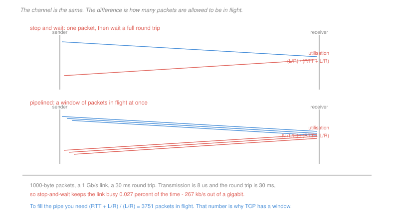

# Networking · Lesson 2.2: Building reliable data transfer

> ⏱ ~15 min · Module 2: The transport layer · Builds on: [2.1 (transport services and UDP)](02-01-transport-services-multiplexing-and-udp.md), [1.4 (distribution time)](01-04-email-and-peer-to-peer.md) · Unlocks: 2.3 (TCP), 2.4 (congestion control)

## Why this matters

The channel underneath you corrupts bits, loses packets entirely, and reorders what survives. On top of that you must deliver every byte, exactly once, in order.

This is the most satisfying construction in the course because it is built from four mechanisms and each one is forced by a specific failure. Nothing is arbitrary: remove any of the four and there is a concrete scenario that breaks.

The second half is about speed, and it contains the number that explains TCP's entire design. A protocol that sends one packet and waits uses **0.027 percent** of a gigabit link. Everything about windows follows from that.

## The idea

Build it up by failure:

**The channel corrupts bits.** Add a **checksum**, and have the receiver acknowledge with an ACK or a NAK. The sender resends on a NAK.

**The acknowledgement itself can be corrupted.** Now the sender does not know what happened, so it resends — and the receiver may get a duplicate it cannot recognise. Add a **sequence number**. One bit is enough for stop-and-wait: alternating 0 and 1 lets the receiver say "I already have this one" and re-acknowledge instead of delivering twice.

**The channel loses packets entirely.** No response at all, so nothing triggers a resend. Add a **timeout**: choose a duration, and if no acknowledgement arrives, retransmit. Note what this forces — the timeout must be a guess, and a guess that is too short causes unnecessary duplicates, which is exactly why sequence numbers were already needed.

That is the whole of reliable transfer: **checksum, acknowledgement, sequence number, timer.** Every reliable protocol ever built has these four, and the interesting differences are all in the fifth question: how many packets may be in flight at once.

**Stop-and-wait is unusable on a fast, long path.** Send one packet, wait a full round trip, send the next. The link is idle for almost all of it:

$$U = \frac{L/R}{\text{RTT} + L/R}$$

With 1000-byte packets on a 1 Gb/s link and a 30 ms round trip, $L/R = 8\ \mu$s against 30 ms, so $U = 0.027\%$ — 267 kb/s of usable throughput out of a gigabit. The protocol is three thousand times slower than the wire.

**Pipelining** fixes it by allowing $N$ packets in flight, multiplying utilisation by $N$ until the pipe is full. Two ways to handle the loss of one packet in a window:

> **Go-Back-N.** The receiver accepts only in-order packets and discards anything else, acknowledging cumulatively — an ACK for $n$ means "everything up to $n$ arrived". On a timeout the sender retransmits the whole window from the lost packet.
>
> **Selective Repeat.** The receiver buffers out-of-order packets and acknowledges each individually. The sender retransmits only what was actually lost, with a timer per packet.

Go-Back-N has a trivial receiver and wastes the network. Selective Repeat wastes nothing and needs a buffer plus per-packet timers. TCP is a hybrid, closer to Selective Repeat in behaviour with cumulative acknowledgements like Go-Back-N.

## The formal version

> **Utilisation with a window of $N$:**
> $$U = \frac{N \cdot L/R}{\text{RTT} + L/R}, \qquad \text{capped at } 1$$
> The window that just fills the pipe is
> $$N^{*} = \left\lceil\frac{\text{RTT} + L/R}{L/R}\right\rceil$$

In words: you need enough packets in flight to cover the whole round trip, because that is how long it takes before an acknowledgement lets you send another.

The quantity $\text{RTT}\times R$ is the **bandwidth-delay product** — how many bits fit in the pipe — and it is the single most useful number in transport design. It is why a window field of 16 bits became a problem on fast links, and why TCP needed a window-scaling option.

> **The sequence-number space constraint.** With a sequence space of size $M$:
> $$\text{Go-Back-N: } N \le M - 1, \qquad \text{Selective Repeat: } N \le M/2$$

Selective Repeat needs the tighter bound, and the reason is precise: the receiver's window advances independently of the sender's, so if the two windows can overlap by more than half the space, a **retransmitted old packet is indistinguishable from a new one**. P3 constructs the ambiguity, and it is worth doing, because the bound looks arbitrary until you see the two scenarios that the receiver cannot tell apart.

## Picture

## Worked examples

**Example 1 — how bad stop-and-wait is, and what fixes it.** 1000-byte packets, a 1 Gb/s link, a 30 ms round trip.

$$\frac{L}{R} = \frac{8{,}000}{10^9} = 8\ \mu\text{s}, \qquad U = \frac{8\times 10^{-6}}{0.030 + 8\times 10^{-6}} = 2.67\times 10^{-4} = \boxed{0.027\%}$$

$$\text{throughput} = 0.000267 \times 10^9 = 267\ \text{kb/s}$$

A gigabit link delivering a quarter of a megabit. To fill it:

$$N^{*} = \left\lceil\frac{0.030008}{8\times 10^{-6}}\right\rceil = \boxed{3{,}751 \text{ packets in flight}}$$

Equivalently, the bandwidth-delay product is $10^9\times 0.030 = 3\times 10^7$ bits, or 3.75 MB — that much data must be *unacknowledged and in the air* to keep the link busy. A protocol whose window field could not express 3.75 MB would be unable to use the link at all, which is exactly the situation TCP found itself in as links got faster.

**Example 2 — the cost of Go-Back-N's simplicity.** Eight packets, a window of 4, and packet 3 is lost on its first transmission only. The sender keeps its window full at all times, and a timeout on the oldest unacknowledged packet retransmits the entire current window.

*Go-Back-N.*

| step | event |
|---|---|
| 1 | send 1, 2, 3, 4 — 3 is lost |
| 2 | receiver delivers 1 and 2; **discards** 4 as out of order and re-acknowledges 2 |
| 3 | window slides, sender transmits 5 and 6; receiver **discards both** |
| 4 | timeout on 3; sender retransmits 3, 4, 5, 6 |
| 5 | all arrive; sender transmits 7, 8 |

$$\text{transmissions} = 6 + 6 = \boxed{12}$$

*Selective Repeat.*

| step | event |
|---|---|
| 1 | send 1, 2, 3, 4 — 3 is lost |
| 2 | receiver delivers 1 and 2, **buffers** 4, acknowledges each individually |
| 3 | timer for 3 expires; sender retransmits **only 3** |
| 4 | 3 arrives; receiver delivers 3 and the buffered 4 together |
| 5 | remaining packets 5 to 8 sent once each |

$$\text{transmissions} = 8 + 1 = \boxed{9}$$

Three wasted transmissions out of twelve, from one lost packet. The waste grows with the window: Go-Back-N discards and resends up to $N-1$ correctly received packets per loss, so a protocol tuned for a large bandwidth-delay product is exactly the one that can least afford Go-Back-N. **That is why every modern protocol buffers out of order**, and why TCP added selective acknowledgement.

## Watch out

- **You might think a NAK is necessary.** It is not. A receiver that re-acknowledges the last correctly received packet conveys the same information, and TCP works this way — a duplicate ACK is a NAK in disguise, and [2.4](02-04-tcp-congestion-control.md) turns three of them into a loss signal.
- **You might think a timeout that is too long is the dangerous case.** Too long is merely slow. Too *short* is worse: it injects duplicate packets into an already-loaded network, which is the classic way a congested network collapses.
- **You might think one sequence-number bit is a toy.** It is exactly enough for stop-and-wait, because at most one packet is unacknowledged. The window size is what forces a larger space, and the relationship between the two is P3's subject.

## One-liner

> Reliability is four mechanisms — checksum, acknowledgement, sequence number, timer — each forced by a specific failure, and everything after that is about how many packets you dare have in flight.

## Problems

**P1 (🟢)** 1,500-byte packets on a 100 Mb/s link with a 60 ms round trip. (a) Give the transmission time and the stop-and-wait utilisation. (b) Give the throughput stop-and-wait achieves. (c) Give the window size needed to fill the link, and the bandwidth-delay product in bytes.

**P2 (🟡)** Ten packets are sent with a window of 5. Packets 4 and 8 are each lost on their first transmission; nothing else is lost and no acknowledgements are lost. Use the same model as Example 2: the sender keeps its window full, and a timeout on the oldest unacknowledged packet retransmits the whole current window. (a) Give the total number of packet transmissions under Go-Back-N, with the trace. (b) Give it under Selective Repeat. (c) Give the ratio, and state how it would change if the window were 10 instead of 5.

**P3 (🔴, optional)** A Selective Repeat protocol uses a sequence-number space of $\{0,1,2,3\}$ and a window of 3. (a) Construct two scenarios — as ordered lists of events — that the receiver cannot distinguish, one in which a packet numbered 0 is a retransmission and one in which it is new data. (b) State what the receiver does wrong in the first scenario. (c) Give the largest window that is safe for this sequence space, prove the general bound $N \le M/2$, and state the corresponding bound for Go-Back-N with a one-sentence reason for the difference.

Solutions

**P1** *(a) Transmission time and utilisation.*
$$\frac{L}{R} = \frac{1{,}500\times 8}{10^8} = \frac{12{,}000}{10^8} = \boxed{120\ \mu\text{s}}$$
$$U = \frac{120\times 10^{-6}}{0.060 + 120\times 10^{-6}} = \frac{1.2\times 10^{-4}}{6.012\times 10^{-2}} = \boxed{0.200\%}$$

*(b) Throughput.*
$$0.001996 \times 10^8 = \boxed{199.6\ \text{kb/s}}$$

Two hundred kilobits per second on a hundred-megabit link — a factor of 500 wasted.

*(c) Window to fill the link, and the bandwidth-delay product.*
$$N^{*} = \left\lceil\frac{0.060120}{1.2\times 10^{-4}}\right\rceil = \lceil 501\rceil = \boxed{501 \text{ packets}}$$
$$\text{BDP} = 10^8 \times 0.060 = 6\times 10^6 \text{ bits} = \boxed{750\ \text{kB}}$$

Three quarters of a megabyte must be in flight and unacknowledged at all times to keep this quite ordinary link busy. That figure is why TCP's original 16-bit window field, capping the window at 64 kB, became a hard limit as links got faster, and why window scaling exists.

**P2** *(a) Go-Back-N, window 5, packets 4 and 8 lost once each.*

| step | event | transmissions |
|---|---|---|
| 1 | send 1–5; **4 is lost**, so 5 is discarded as out of order | 5 |
| 2 | acknowledgements for 1–3 slide the base to 4; the window is now 4–8, so the sender transmits 6, 7, 8 | 3 |
| 3 | **8 is lost**; 6 and 7 arrive and are discarded, since the receiver still expects 4 | — |
| 4 | timeout on 4; the sender retransmits the whole window 4, 5, 6, 7, 8 | 5 |
| 5 | all five arrive — this is 4's and 8's second transmission — and the receiver delivers 4 through 8 | — |
| 6 | base slides to 9; the sender transmits 9, 10 | 2 |

$$5 + 3 + 5 + 2 = \boxed{15 \text{ transmissions}}$$

*(b) Selective Repeat.* Every packet is sent once; 4 and 8 are each sent one extra time, and nothing else is discarded because the receiver buffers.
$$10 + 2 = \boxed{12 \text{ transmissions}}$$

*(c) The ratio, and the effect of a larger window.*
$$\frac{15}{12} = \boxed{1.25}$$

With a window of 10 the ratio gets **worse for Go-Back-N**, not better. A larger window means more packets are in flight behind the lost one when the loss is detected, and every one of them is discarded and resent. In the limit the sender retransmits the entire window per loss, so Go-Back-N's waste is roughly $N$ packets per loss while Selective Repeat's is 1.

That is the sharp version of the trade: Go-Back-N's cost is **proportional to the window**, and the window has to be large precisely when the bandwidth-delay product is large. The protocol is cheapest to implement exactly where it is most expensive to run.

**P3** *Accept criterion: two event sequences that produce the same received packet with the same sequence number, one a duplicate and one new, with the receiver's window state shown. Any pair with that structure is correct.*

*(a) The two indistinguishable scenarios.* Sequence space $\{0,1,2,3\}$, window 3. The receiver starts expecting $\{0,1,2\}$.

**Scenario A — the 0 is a retransmission.**

| step | event | receiver's window |
|---|---|---|
| 1 | sender transmits 0, 1, 2 | $\{0,1,2\}$ |
| 2 | all three arrive; receiver delivers them and sends ACKs | advances to $\{3,0,1\}$ |
| 3 | **all three ACKs are lost** | $\{3,0,1\}$ |
| 4 | sender's timer for 0 expires; it retransmits **0** | $\{3,0,1\}$ |
| 5 | packet 0 arrives | 0 is **inside** the window |

**Scenario B — the 0 is new data.**

| step | event | receiver's window |
|---|---|---|
| 1 | sender transmits 0, 1, 2 | $\{0,1,2\}$ |
| 2 | all three arrive; receiver delivers them and sends ACKs | advances to $\{3,0,1\}$ |
| 3 | **all three ACKs arrive**; the sender's window advances | $\{3,0,1\}$ |
| 4 | sender transmits 3, 0, 1 as **new** data; 3 is lost | $\{3,0,1\}$ |
| 5 | packet 0 arrives | 0 is **inside** the window |

At step 5 the receiver sees a packet numbered 0 with its window at $\{3,0,1\}$ in both cases. The packet's header is identical. Nothing distinguishes them.

*(b) What goes wrong.* In Scenario A the receiver **accepts an old, already-delivered packet as new data**, buffers it, and eventually delivers its contents a second time. The byte stream handed to the application is corrupted — a duplicate inserted in the middle — and no later mechanism detects it, because from the receiver's point of view nothing went wrong.

*(c) The safe window, and the bound.*

$$\boxed{N = 2}$$ for $M = 4$.

*Proof of $N \le M/2$.* Sender and receiver windows both have size $N$ and both advance only forward. Consider the receiver's window at any moment, occupying $N$ consecutive numbers starting at $r$. The sender's window can be as far *behind* as $r - N$ — that is the case where every acknowledgement was lost, so the sender still has its oldest unacknowledged packet outstanding. A retransmission from that old window carries a number in $\{r-N, \ldots, r-1\}$.

For the receiver never to mistake such a retransmission for new data, that old range must not intersect its current window $\{r, \ldots, r+N-1\}$ **modulo $M$**. The two ranges together span $2N$ consecutive numbers, so they are disjoint modulo $M$ exactly when

$$2N \le M \;\Longleftrightarrow\; N \le \frac{M}{2} \qquad \blacksquare$$

With $M = 4$ and $N = 3$, the ranges span 6 numbers in a space of 4 and must overlap, which is precisely the collision constructed in part (a).

*Go-Back-N's bound is $N \le M-1$*, which is looser by almost a factor of two. The reason is that a Go-Back-N receiver keeps **no window at all** — it holds a single expected sequence number and discards everything else, so it can never confuse a retransmission with new data; it simply rejects anything that is not exactly what it is waiting for. The one number it must be able to represent is "everything up to $n$", and reserving one value of the space to distinguish a full window from an empty one gives $M-1$.

The general moral is worth keeping: **Selective Repeat's buffering is what costs it the sequence space.** The receiver gained the ability to accept out-of-order packets, and with it the possibility of accepting the wrong one.

## Flashback

**From Lesson 1.4 (email and the peer-to-peer model):** A 9 Gb file is distributed from a server with a 60 Mb/s uplink. Each client has a 6 Mb/s downlink and a 3 Mb/s uplink. (a) Give $D_{\text{cs}}$ and $D_{\text{p2p}}$ for $N = 20$. (b) Give the smallest $N$ at which the server's uplink becomes the binding constraint for the client-server design. (c) Give the ceiling that $D_{\text{p2p}}$ approaches as $N$ grows, and state the assumption that would make it false.

Solution

*(a) At $N = 20$.* $F = 9\times 10^9$, $u_s = 6\times 10^7$, $d_{\min} = 6\times 10^6$, $u = 3\times 10^6$.

$$\frac{F}{u_s} = 150\ \text{s}, \qquad \frac{F}{d_{\min}} = 1{,}500\ \text{s}$$

$$D_{\text{cs}} = \max\left\{\frac{20 F}{u_s},\ 1{,}500\right\} = \max\{3{,}000,\ 1{,}500\} = \boxed{3{,}000\ \text{s}}$$

$$D_{\text{p2p}} = \max\left\{150,\ 1{,}500,\ \frac{20F}{6\times 10^7 + 20(3\times 10^6)}\right\} = \max\{150,\ 1{,}500,\ 1{,}500\} = \boxed{1{,}500\ \text{s}}$$

Twice as fast, and note that the peer-to-peer figure is a tie between the client downlink and the aggregate uplink — the swarm has exactly enough capacity to saturate every client's download.

*(b) When the server's uplink binds.*
$$\frac{NF}{u_s} > \frac{F}{d_{\min}} \;\Longleftrightarrow\; N > \frac{u_s}{d_{\min}} = \frac{60}{6} = 10 \;\Longrightarrow\; \boxed{N = 11}$$

Below 11 clients the two designs are identical, because the clients' own downlinks are the constraint and no amount of extra upload capacity helps.

*(c) The ceiling, and what would break it.*
$$\lim_{N\to\infty}\frac{NF}{u_s + Nu} = \frac{F}{u} = \frac{9\times 10^9}{3\times 10^6} = \boxed{3{,}000\ \text{s}}$$

So the peer-to-peer time rises from 1,500 s and approaches 3,000 s, never exceeding it, while the client-server time grows without bound — at $N = 1{,}000$ it is 150,000 s.

*The assumption that would make it false:* that **peers upload while they download and remain in the swarm**. The term $\sum_i u_i$ counts every peer's uplink, and a peer that leaves the moment its download completes, or that is behind a connection which blocks incoming requests, contributes nothing. If the average peer contributes a fraction $\phi$ of its uplink, the ceiling becomes $F/(\phi u)$ — at $\phi = 0.1$ that is 30,000 seconds, an order of magnitude worse, and still bounded, which is the interesting part. **The ceiling degrades gracefully with participation and does not disappear**, which is why real swarms work despite substantial free-riding, and why the tit-for-tat mechanism of [1.4](01-04-email-and-peer-to-peer.md) only has to keep $\phi$ respectable rather than perfect.

## Connections

- **Backward:** this builds exactly what UDP declined in [2.1](02-01-transport-services-multiplexing-and-udp.md), starting from its checksum. The utilisation argument is [1.1](01-01-packet-switching-and-layers.md)'s transmission-against-propagation comparison in its most consequential form.
- **Forward:** [2.3](02-03-tcp-segments-connections-flow-control.md) is this machinery with byte-oriented sequence numbers, cumulative acknowledgement and one adaptive timer, and [2.4](02-04-tcp-congestion-control.md) sets the window from the network's behaviour rather than from the receiver's buffer.
- **Sideways:** the sequence-space argument in P3 is modular arithmetic doing real work — two intervals of length $N$ must be disjoint modulo $M$ — of the kind in [`discrete-mathematics` 4.3](../../discrete-mathematics/lessons/04-03-modular-arithmetic-and-congruences.md). The duplicate-detection problem is the same one distributed systems face under the name of exactly-once delivery, where the answer is likewise a sequence number and an idempotent receiver.
