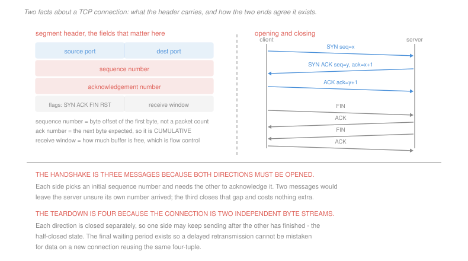

# Networking · Lesson 2.3: TCP — segments, connections, and flow control

> ⏱ ~15 min · Module 2: The transport layer · Builds on: [2.2 (reliable data transfer)](02-02-building-reliable-data-transfer.md), [2.1 (multiplexing)](02-01-transport-services-multiplexing-and-udp.md) · Unlocks: 2.4 (congestion control), 3.1 (the network layer)

## Why this matters

[2.2](02-02-building-reliable-data-transfer.md) built reliability out of four mechanisms in the abstract. TCP is what those mechanisms look like when a real protocol has to carry them for thirty years across every network anyone has built.

Three of its choices are worth understanding precisely, because each is a decision that could plausibly have gone the other way. Sequence numbers count **bytes**, not packets. Acknowledgements are **cumulative**, not individual. And the connection is opened with **three** messages and closed with **four**, which sounds like an accident and is not.

The reward for getting these straight is that you can read a packet capture, and reading a packet capture is how network problems are actually diagnosed.

## The idea

**A TCP connection is a pair of byte streams**, one in each direction, between two sockets identified by the four-tuple of [2.1](02-01-transport-services-multiplexing-and-udp.md). It is not a sequence of messages — TCP will split what you write and coalesce what you write separately, and any application needing message boundaries must impose them itself.

The header fields that matter:

| field | meaning |
|---|---|
| sequence number | the byte offset of this segment's **first byte** in the stream |
| acknowledgement number | the byte number the sender of this segment **expects next** |
| receive window | how much free buffer the sender of this segment has |
| flags | `SYN`, `ACK`, `FIN`, `RST` |

Read the second row carefully. An acknowledgement is **cumulative**: "I expect byte 1450 next" means every byte before 1450 arrived. It does not say anything about bytes *after* a gap, which is why an out-of-order segment produces a *duplicate* acknowledgement of the last in-order byte rather than an acknowledgement of the new data. That duplicate is TCP's only signal that something is missing, and [2.4](02-04-tcp-congestion-control.md) makes decisive use of it.

**Flow control** is one line: the receiver advertises its free buffer space in every segment, and the sender never has more unacknowledged data in flight than that. It stops a fast sender overwhelming a slow receiver, and it is entirely distinct from congestion control, which stops a fast sender overwhelming the *network*. The two limits apply simultaneously and the sender obeys the smaller.

**The timeout has to be estimated**, because the right value varies by orders of magnitude between a link across a room and one across an ocean, and changes minute to minute with queueing. TCP measures round trips and smooths them.

## The formal version

> **Round-trip estimation.** With $\alpha = 1/8$ and $\beta = 1/4$:
> $$\text{Est} \leftarrow (1-\alpha)\,\text{Est} + \alpha\,\text{Sample}$$
> $$\text{Dev} \leftarrow (1-\beta)\,\text{Dev} + \beta\left|\text{Sample} - \text{Est}\right|$$
> $$\text{Timeout} = \text{Est} + 4\,\text{Dev}$$

In words: track a smoothed average and a smoothed measure of how much samples wander, and set the timeout well above the average by a margin that grows when the path is erratic.

The safety margin is the interesting part. A timeout that fires early retransmits data that was merely late, adding load to a network that is probably already congested — the failure mode named in [2.2](02-02-building-reliable-data-transfer.md). Four deviations is deliberately conservative, and it is why TCP prefers to detect loss from duplicate acknowledgements when it can: that signal arrives in one round trip instead of waiting out a timer.

> **The three-way handshake.** Client sends `SYN` with its initial sequence number $x$. Server replies `SYN ACK` with its own $y$ and acknowledges $x+1$. Client sends `ACK` of $y+1$.

Why three and not two? Because **both directions must be opened**, and each side needs to know that its own initial sequence number arrived. Two messages leave the server having announced $y$ with no confirmation that anyone heard it. The third message costs nothing extra — it can carry data — and it closes that gap.

There is a second reason, and it is the one that matters in practice: without the third message a **delayed duplicate** of an old `SYN` could open a connection the client never asked for, and the server would sit holding state and possibly sending data to a host that is not listening. Requiring the client to complete the exchange proves the client is really there, right now.

> **The four-way teardown.** Each direction is closed independently: `FIN`, `ACK`, then `FIN`, `ACK` the other way.

The connection is two independent streams, so one side can stop sending while still receiving — the half-closed state. The closing side then waits before releasing the four-tuple, so that a delayed retransmission from the old connection cannot be mistaken for data on a new connection reusing the same ports. That wait is why a busy server accumulates sockets in a waiting state, and why it is not a bug.

## Picture

## Worked examples

**Example 1 — reading sequence and acknowledgement numbers.** Host A sends three segments to B, starting at sequence number 1000. B is sending nothing of its own.

| # | A sends | bytes covered | B replies |
|---|---|---|---|
| 1 | seq = 1000, 100 bytes | 1000–1099 | ack = **1100** |
| 2 | seq = 1100, 200 bytes | 1100–1299 | **lost in the network** |
| 3 | seq = 1300, 150 bytes | 1300–1449 | ack = **1100** again |

Segment 3 arrives with a gap in front of it. B buffers it, and because acknowledgements are cumulative it can only repeat "I expect 1100" — a **duplicate acknowledgement**. It cannot say "I have 1300 to 1449 as well", which is precisely the information that would be useful, and precisely what the selective-acknowledgement option was later added to convey.

A retransmits segment 2. Now B has everything:

| # | A sends | B replies |
|---|---|---|
| 4 | seq = 1100, 200 bytes | ack = **1450** |

One acknowledgement jumps from 1100 to 1450, covering the retransmission *and* the segment B had been holding. **Cumulative acknowledgement means one arriving segment can acknowledge a great deal at once**, which is what makes the scheme robust to lost acknowledgements: losing the ack for 1100 costs nothing if the ack for 1450 arrives.

**Example 2 — setting the timeout.** Start with Est = 100 ms and Dev = 10 ms, and take five samples.

| sample | Est after | Dev after | Timeout |
|---|---|---|---|
| 110 | 101.25 | 10.00 | 141.3 |
| 105 | 101.72 | 8.44 | 135.5 |
| 95 | 100.88 | 8.01 | 132.9 |
| **180** | 110.77 | 25.79 | **213.9** |
| 100 | 109.42 | 22.03 | 197.6 |

The fourth row is the point. One sample at 180 ms moved the estimate by only 10 ms — the smoothing is heavy, by design — but moved the deviation from 8 to 26, and the *timeout* from 133 ms to 214 ms.

That asymmetry is the mechanism working. The estimate should not chase a single outlier, and the timeout should immediately become more forgiving when the path starts behaving unpredictably, because unpredictability is exactly when a premature retransmission is most damaging. **The deviation term reacts fast and the mean reacts slowly**, and getting that the wrong way round produces a protocol that retransmits hardest precisely when the network is least able to absorb it.

## Watch out

- **You might think an acknowledgement number is the last byte received.** It is the **next byte expected**, one past the end. Off-by-one errors here are the classic way to misread a capture.
- **You might think flow control and congestion control are the same.** Flow control protects the *receiver's buffer* and is advertised explicitly in the window field. Congestion control protects the *network* and is inferred, never told. A sender obeys both and is limited by the smaller.
- **You might think a TCP connection preserves your write boundaries.** It does not. Two writes of 10 bytes may arrive as one segment of 20, or as segments of 3 and 17. Any protocol above TCP that needs framing must carry its own length or delimiter, which is why HTTP has `Content-Length`.

## One-liner

> Sequence numbers count bytes, acknowledgements say what is expected next and therefore only ever report a gap by repeating themselves, and the connection takes three messages to open because both directions must be opened and each side needs proof its own number arrived.

## Problems

**P1 (🟢)** Host A sends four segments to B beginning at sequence number 5000, of 500, 300, 400 and 200 bytes. The second segment is lost; nothing else is. B sends no data of its own. (a) Give the sequence number of each segment and the acknowledgement number B returns for each arrival, in order. (b) Give the acknowledgement B sends after A retransmits the lost segment. (c) State how many duplicate acknowledgements B sends and what A can conclude from them.

**P2 (🟡)** A TCP connection has Est = 200 ms and Dev = 20 ms. Samples arrive: 210, 190, 400, 205. Use $\alpha = 1/8$, $\beta = 1/4$ and Timeout = Est + 4 Dev. (a) Give Est, Dev and the timeout after each sample. (b) Give the percentage change in Est and in the timeout caused by the 400 ms sample. (c) State which of the two reacts faster and give the design reason.

**P3 (🔴, optional)** (a) Give a concrete failure that occurs if TCP opened connections with two messages instead of three, describing the sequence of events including a delayed duplicate `SYN`. (b) The three-way handshake creates a vulnerability of its own: a server allocates connection state on receiving the `SYN`, before the client has proved anything. Name the attack, give the resource that is exhausted, and estimate how many half-open connections an attacker sustains at 10,000 spoofed `SYN`s per second if the server holds each for 75 seconds. (c) Describe the standard defence and state the property of the handshake that makes it possible.

Solutions

**P1** *(a) Sequence and acknowledgement numbers.*

| # | seq | bytes covered | arrives? | B's acknowledgement |
|---|---|---|---|---|
| 1 | 5000 | 5000–5499 | yes | **5500** |
| 2 | 5500 | 5500–5799 | **lost** | — |
| 3 | 5800 | 5800–6199 | yes, buffered | **5500** (duplicate) |
| 4 | 6200 | 6200–6399 | yes, buffered | **5500** (duplicate) |

*(b) After the retransmission.* A retransmits seq = 5500 with 300 bytes. B now holds 5000 through 6399 contiguously:

$$\text{acknowledgement} = \boxed{6400}$$

One acknowledgement covers the retransmitted segment and both buffered segments — a jump of 900 bytes.

*(c) Duplicate acknowledgements, and what they mean.* **Two** duplicates, from segments 3 and 4.

What A can conclude is precise and worth stating carefully: **a segment is missing, and the network is still delivering**. The second half is the useful part. A timeout means nothing is getting through; duplicate acknowledgements mean later segments are arriving perfectly well and exactly one is absent. That is a much less alarming diagnosis, and [2.4](02-04-tcp-congestion-control.md) responds to the two signals completely differently for this reason. (TCP waits for **three** duplicates before retransmitting, so two is not yet enough to act on — the third guards against simple reordering, which also produces duplicates and requires no response at all.)

**P2** *(a) The four updates.* Dev is updated before Est, using the old Est.

| sample | $\lvert\text{Sample} - \text{Est}\rvert$ | Dev | Est | Timeout |
|---|---|---|---|---|
| 210 | 10 | $0.75(20) + 0.25(10) = \boxed{17.50}$ | $0.875(200) + 0.125(210) = \boxed{201.25}$ | $\boxed{271.3}$ |
| 190 | 11.25 | $0.75(17.50)+0.25(11.25) = \boxed{15.94}$ | $0.875(201.25)+0.125(190) = \boxed{199.84}$ | $\boxed{263.6}$ |
| **400** | 200.16 | $0.75(15.94)+0.25(200.16) = \boxed{61.99}$ | $0.875(199.84)+0.125(400) = \boxed{224.86}$ | $\boxed{472.8}$ |
| 205 | 19.86 | $0.75(61.99)+0.25(19.86) = \boxed{51.46}$ | $0.875(224.86)+0.125(205) = \boxed{222.38}$ | $\boxed{428.2}$ |

*(b) The effect of the 400 ms sample.*
$$\Delta\text{Est} = \frac{224.86 - 199.84}{199.84} = \boxed{+12.5\%}$$
$$\Delta\text{Timeout} = \frac{472.8 - 263.6}{263.6} = \boxed{+79.4\%}$$

*(c) Which reacts faster, and why.* **The timeout**, by a factor of more than six, and the cause is the deviation term: $\beta = 1/4$ is twice $\alpha = 1/8$, and the deviation is then multiplied by 4 before being added.

The design reason is asymmetric risk. A timeout that fires too early retransmits data that was merely delayed, which injects duplicate traffic into a network that is very likely already congested — the collapse mode of [2.2](02-02-building-reliable-data-transfer.md). A timeout that is too long merely delays recovery from a genuine loss, and TCP has a faster path for the common case anyway in duplicate acknowledgements.

So the protocol is built to **back off quickly and return slowly**: one erratic sample widens the margin immediately, and it narrows again only as the path proves itself calm over many samples. Notice that this is the same asymmetry as the congestion window's in [2.4](02-04-tcp-congestion-control.md) — cautious increase, sharp decrease — appearing here in the timer rather than the window.

**P3** *Accept criterion for (a): a sequence in which a stale `SYN` arriving at the server causes it to establish state for a connection the client is not part of, with the consequence named.*

*(a) The two-message failure.* Suppose the handshake were `SYN` then `SYN ACK`, with the connection considered open on the server's reply.

| step | event |
|---|---|
| 1 | a client sends a `SYN` for a connection; the segment is delayed for a long time in the network |
| 2 | the client times out, gives up, and the application moves on. The client has no connection |
| 3 | the delayed `SYN` finally arrives at the server |
| 4 | the server replies `SYN ACK` and **considers the connection established**, allocating buffers and state |
| 5 | the server begins delivering to its application whatever data was carried, or waits, holding resources |
| 6 | the client receives the unexpected `SYN ACK` for a connection it has abandoned |

The server has a live connection to a host that is not participating. It holds buffers indefinitely, may hand a duplicate of an old request to its application — imagine that request was "transfer funds" — and the client cannot correct it except by sending a reset.

The third message removes the whole class: the server does not establish anything until it has heard from the client *after* announcing its own sequence number, which is only possible if the client is present and current.

*(b) The attack this creates.* **The SYN flood**, a denial-of-service attack.

The exhausted resource is the server's **backlog queue of half-open connections** — the table of connections that have received a `SYN` and are waiting for the third message. Each entry holds the client's address, the server's chosen sequence number and a timer.

$$\text{sustained half-open entries} = 10{,}000\ \text{s}^{-1} \times 75\ \text{s} = \boxed{750{,}000}$$

Against a typical backlog of a few thousand, the queue is full within a fraction of a second and every legitimate `SYN` afterwards is dropped. Note what the attacker does *not* need: no bandwidth to speak of, since a `SYN` is 40 bytes and 10,000 per second is 3.2 Mb/s, and no ability to receive replies at all, since the source addresses are spoofed and the `SYN ACK`s go to strangers.

*(c) The defence, and what makes it possible.* **SYN cookies.** The server allocates **no state** on receiving a `SYN`. Instead it chooses its initial sequence number $y$ to be a cryptographic function of the four-tuple, a coarse timestamp and a secret known only to itself:

$$y = H(\text{src IP}, \text{src port}, \text{dst IP}, \text{dst port}, t, \text{secret})$$

It sends the `SYN ACK` and forgets the exchange entirely. When a third message arrives acknowledging $y+1$, the server recomputes $H$ from the arriving segment's four-tuple and checks that it matches; if it does, the client must genuinely have received the `SYN ACK`, and the server allocates state *then*.

*The property that makes it work:* **the third message carries back the server's own sequence number.** That single echoed field lets the server authenticate the exchange without having remembered anything, so the state can live in the sequence number instead of in a table. Cost is a small loss of expressiveness — options negotiated in the `SYN` cannot be stored, so a few must be re-derived or dropped — which is why cookies are typically enabled only once the backlog is under pressure.

## Flashback

**From Lesson 2.1 (transport services, multiplexing, and UDP):** A server at `50.1.1.1` runs a TCP service on port 443 and a UDP service on port 5000. (a) Two segments arrive, both TCP to port 443, one from `10.0.0.2:33000` and one from `10.0.0.2:33001`. State how many sockets are involved and why. (b) Two datagrams arrive, both UDP to port 5000, from different hosts. State how many sockets and why. (c) The UDP service must reply to each sender. State where it gets the address from and what it must maintain that the TCP service gets for free.

Solution

*(a) Two TCP segments from the same host.* **Two connection sockets.** TCP demultiplexes on the full four-tuple, and the two segments differ in the source port, so they are two different connections. The destination host, destination port and source host being identical is irrelevant.

(Three sockets exist in total if the listening socket on port 443 is counted, since it is a real socket that accepts connections and never carries data.)

*(b) Two UDP datagrams from different hosts.* **One socket.** UDP demultiplexes on the destination IP and port only, so every datagram sent to `50.1.1.1:5000` from anywhere on Earth is delivered to the same socket, in whatever order it happens to arrive.

*(c) Replying, and the bookkeeping.* The UDP service reads the **source address and port out of each datagram** as it receives it — the receive call returns them alongside the data — and sends its reply back to that address explicitly.

What it must maintain, and TCP would have given free:

- **Per-client state**, in its own data structures keyed by the source address, since one socket carries every client's traffic interleaved
- **Message-to-client association**, because two datagrams arriving back to back are probably from different clients
- **Anything resembling a session**, including sequence numbers, retransmission and ordering, if the application needs them

That is the trade of [2.1](02-01-transport-services-multiplexing-and-udp.md) at its most concrete: the TCP service gets a private, ordered, reliable byte stream per client with no code at all, and the UDP service gets one socket and a pile of bookkeeping — which it accepts in exchange for no handshake, no head-of-line blocking, and no per-connection kernel state. QUIC, which does exactly this, is the modern demonstration that the bookkeeping is worth it when you need what it buys.

## Connections

- **Backward:** the four mechanisms of [2.2](02-02-building-reliable-data-transfer.md) appear here as byte sequence numbers, cumulative acknowledgements, an adaptive timer and the checksum inherited from [2.1](02-01-transport-services-multiplexing-and-udp.md). The four-tuple that identifies the connection is [2.1](02-01-transport-services-multiplexing-and-udp.md)'s demultiplexing key.
- **Forward:** [2.4](02-04-tcp-congestion-control.md) adds a second limit on the sender beside the receive window, and turns the duplicate acknowledgement of Example 1 into its fastest loss signal. The `SYN` flood of P3 returns among the attacks in [4.4](04-04-network-security-tls-firewalls-attacks.md).
- **Sideways:** the exponentially weighted estimate of the round trip is the same smoothing TCP's designers borrowed from control practice, and [`control-systems` 1.1](../../control-systems/lessons/01-01-feedback-and-the-control-problem.md) frames why a fast-reacting deviation term and a slow-reacting mean give a stable loop. SYN cookies are the standard trick of storing state in a token the client returns, which is exactly how a stateless web service handles sessions and how a signed cookie works in [1.2](01-02-the-web-and-http.md).
