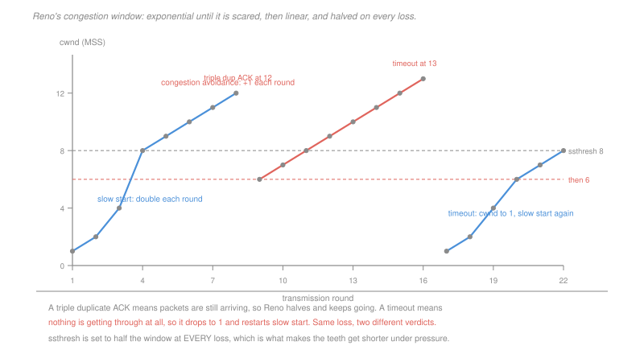

# Networking · Lesson 2.4: TCP congestion control

> ⏱ ~15 min · Module 2: The transport layer · Builds on: [2.3 (TCP)](02-03-tcp-segments-connections-flow-control.md), [2.2 (pipelining)](02-02-building-reliable-data-transfer.md) · Unlocks: 3.1 (the network layer)

## Why this matters

Flow control stops you overwhelming the receiver. Nothing so far stops you overwhelming the *network*, and in October 1986 the link between two buildings at Berkeley collapsed from 32 kb/s to 40 bit/s — a factor of 800 — because every sender was retransmitting into a queue that was already full.

That is **congestion collapse**, and the fix Van Jacobson shipped in 1988 is still, in outline, what runs on every machine today. It is remarkable for what it does not have: no signal from the network, no coordination between senders, no central authority. Each sender infers congestion from its own losses and adjusts, and out of a few million independent adjustments comes a stable, roughly fair allocation.

It is the most successful distributed algorithm ever deployed, and it is four rules.

## The idea

The sender keeps a **congestion window**, `cwnd`, limiting unacknowledged data in flight. Its actual limit is the smaller of `cwnd` and the receiver's advertised window from [2.3](02-03-tcp-segments-connections-flow-control.md) — the network's constraint and the receiver's, whichever binds.

There is no congestion signal, so TCP uses the only evidence it has: **loss**. And it reads two kinds of loss completely differently.

> **Three duplicate acknowledgements** mean one segment is missing and later ones are arriving perfectly well. The path is working; a packet was dropped.
>
> **A timeout** means nothing has been acknowledged for a long time. The path may be severely congested or broken.

The response is proportionate to the diagnosis, and that asymmetry is the design:

**Slow start.** Begin at `cwnd = 1 MSS` and **double** every round trip. It is called slow because it starts small; the growth is exponential and it finds the available rate in logarithmic time. It ends when `cwnd` reaches a threshold, `ssthresh`, or when a loss occurs.

**Congestion avoidance.** Above `ssthresh`, add **one MSS per round trip** instead of doubling. Probe gently, because you are now near the rate that worked last time.

**On a triple duplicate acknowledgement** — TCP Reno — set `ssthresh` to half the current window, set `cwnd` to that same halved value, and continue in congestion avoidance. This is **fast recovery**: no return to 1, because the path demonstrably still delivers.

**On a timeout**, set `ssthresh` to half the window, set `cwnd` to **1**, and restart slow start. The harsh response is for the harsh diagnosis.

The result is the **sawtooth**: linear climb, halving, linear climb. TCP is permanently probing for more capacity and permanently backing off when it finds the limit, and it never settles, because there is nothing to settle on — the available capacity changes whenever anyone else starts or stops.

## The formal version

> **AIMD — additive increase, multiplicative decrease.** Increase by a constant, decrease by a factor.

The choice of *which* operations to combine is not arbitrary, and it is the reason TCP is fair. Consider two flows sharing a bottleneck of capacity $C$, with rates $x_1$ and $x_2$.

Under **additive increase**, both gain $a$: the difference $x_1 - x_2$ is **unchanged**.

Under **multiplicative decrease**, both are scaled by $b$: the difference becomes $b(x_1 - x_2)$, so it **shrinks by the factor $b$**.

Every congestion event therefore halves the gap between the two flows while the increase phase leaves it alone. The difference decays geometrically to zero, and the allocation converges to an equal share regardless of where it started. P3 traces it.

Now test the alternatives. Under **multiplicative increase and multiplicative decrease**, both phases scale both flows, so the *ratio* $x_1/x_2$ is invariant — it never converges, and whoever starts ahead stays ahead forever. Additive increase with additive decrease keeps the difference constant in both phases and likewise never converges. **AIMD is the only one of the four combinations that converges to fairness**, and that is why it is the one in use.

> **Average throughput of the sawtooth.** If the window oscillates between $W/2$ and $W$:
> $$\text{throughput} \approx \frac{0.75\, W \cdot \text{MSS}}{\text{RTT}}$$

> **Throughput against loss rate.** For a loss probability $L$:
> $$\text{throughput} \approx \frac{1.22\,\text{MSS}}{\text{RTT}\sqrt{L}}$$

Two consequences fall out of that second formula, and both are load-bearing.

**Throughput falls only as $\sqrt{L}$**, so achieving a very high rate requires an absurdly small loss rate. At a 10 Gb/s rate with 1500-byte segments and a 100 ms round trip, the required loss probability is around $2\times 10^{-10}$ — one segment in five billion. Standard TCP simply cannot fill a fast long path, which is why CUBIC replaced Reno's linear growth with a cubic function that climbs aggressively when far from the last known limit.

**Throughput is inversely proportional to RTT.** Two flows sharing one bottleneck, one with a 20 ms round trip and one with 100 ms, do **not** get equal shares — the short-RTT flow gets about five times more. TCP's fairness is fairness among equals, and it is systematically biased toward nearby servers.

## Picture

## Worked examples

**Example 1 — tracing the window.** A Reno sender starts at `cwnd = 1 MSS` with `ssthresh = 8`. At `cwnd = 12` a triple duplicate acknowledgement occurs; eight rounds later, a timeout.

| round | cwnd | phase | rule that fired |
|---|---|---|---|
| 1 | 1 | slow start | |
| 2 | 2 | slow start | double |
| 3 | 4 | slow start | double |
| 4 | 8 | congestion avoidance | reached `ssthresh`, switch to linear |
| 5–7 | 9, 10, 11 | congestion avoidance | add 1 per round |
| 8 | 12 | — | **triple duplicate ACK**: `ssthresh` ← 6, `cwnd` ← 6 |
| 9–16 | 6, 7, 8, 9, 10, 11, 12, 13 | congestion avoidance | add 1 per round |
| 16 | 13 | — | **timeout**: `ssthresh` ← 6, `cwnd` ← 1 |
| 17 | 1 | slow start | restart |
| 18–20 | 2, 4, 6 | slow start | double, until `cwnd` reaches `ssthresh` = 6 |
| 21+ | 7, 8, … | congestion avoidance | |

Two things to notice. `ssthresh` is set to half the window at **both** loss events, so it is a memory of where trouble was last found. And the two events produce completely different windows afterwards — 6 against 1 — from the same halving of `ssthresh`, because the diagnosis differed.

**Example 2 — what the sawtooth is worth.** A connection with a 100 ms round trip, 1,460-byte segments, whose window oscillates between 12 and 24 MSS.

$$\text{throughput} \approx \frac{0.75 \times 24 \times 1460 \times 8}{0.100} = \frac{0.75\times 24\times 11{,}680}{0.1} = 2.1\ \text{Mb/s}$$

Now suppose the path is a 1 Gb/s link. To use it, the window would have to average $10^9\times 0.1 / (1460\times 8) = 8{,}562$ segments, and by the loss formula that needs

$$L \approx \left(\frac{1.22\times 11{,}680}{0.1\times 10^9}\right)^2 = (1.425\times 10^{-4})^2 = 2.0\times 10^{-8}$$

One loss in fifty million segments, sustained. On a real path that is unattainable, which is the concrete form of the statement that Reno cannot fill a long fast pipe. **The protocol's own recovery rule becomes the bottleneck**, and no amount of link capacity helps, because after each halving it takes 4,281 round trips — over seven minutes — to climb back.

## Watch out

- **You might think slow start is slow.** It doubles every round trip, which is the fastest thing TCP ever does. It is slow only in where it *starts*.
- **You might think a timeout and three duplicate acknowledgements are the same event.** They are the same *outcome* with opposite diagnoses, and TCP's response differs by a factor of six in the resulting window. Conflating them is the standard way to get a trace wrong.
- **You might think TCP fairness means equal shares.** It means equal shares *among flows with equal round-trip times*. Different RTTs give proportionally different shares, and an application opening six connections gets roughly six times one connection's share — which is what browsers did for years, and why they stopped.

## One-liner

> With no signal from the network, TCP infers congestion from loss, doubles until it is worried and then adds one, and halves on every loss — and additive increase with multiplicative decrease is the only combination of the four that converges to an equal share.

## Problems

**P1 (🟢)** A Reno sender starts at `cwnd = 1 MSS` with `ssthresh = 16`. Slow start proceeds until a triple duplicate acknowledgement at `cwnd = 20`. Seven rounds later a timeout occurs. (a) Give `cwnd` for every round up to and including the timeout round. (b) Give `ssthresh` after each of the two loss events. (c) Give the round at which the sender re-enters congestion avoidance after the timeout.

**P2 (🟡)** A connection uses 1,500-byte segments over a path with a 50 ms round trip. (a) Give the average throughput if the window oscillates between 20 and 40 MSS. (b) Using the loss formula, give the throughput at loss rates of $10^{-4}$ and $10^{-6}$. (c) A second connection shares the same bottleneck but has a 200 ms round trip. Give the ratio of their throughputs, state whether this is fair, and name the property of the AIMD rule that causes it.

**P3 (🔴, optional)** Two flows share a bottleneck of capacity 10 units. Rates start at $(7, 1)$. The increase rule adds 1 to each flow per round; when the total reaches or exceeds 10, both flows are scaled by $\tfrac12$. (a) Trace the rates for the first three congestion events, giving the pair and the absolute difference at each. (b) State what happens to the difference at an increase step and at a decrease step, and conclude what the rates converge to. (c) Repeat the argument for a rule that *multiplies* by 1.5 on increase instead of adding 1, show what is invariant, and state which of the four increase-decrease combinations converge.

Solutions

**P1** *(a) The window, round by round.*

| round | cwnd | phase |
|---|---|---|
| 1 | 1 | slow start |
| 2 | 2 | slow start |
| 3 | 4 | slow start |
| 4 | 8 | slow start |
| 5 | 16 | reaches `ssthresh`, switches to congestion avoidance |
| 6 | 17 | congestion avoidance |
| 7 | 18 | congestion avoidance |
| 8 | 19 | congestion avoidance |
| 9 | **20** | **triple duplicate ACK** |
| 10 | 10 | congestion avoidance, after halving |
| 11 | 11 | |
| 12 | 12 | |
| 13 | 13 | |
| 14 | 14 | |
| 15 | 15 | |
| 16 | **16** | **timeout**, seven rounds after the first loss |

*(b) `ssthresh` after each event.*
$$\text{after the triple duplicate ACK: } \frac{20}{2} = \boxed{10}$$
$$\text{after the timeout: } \frac{16}{2} = \boxed{8}$$

*(c) Re-entering congestion avoidance.* After the timeout, `cwnd` is 1 and `ssthresh` is 8, so slow start doubles: round 17 gives 1, 18 gives 2, 19 gives 4, 20 gives 8.

$$\boxed{\text{round } 20}$$ is where `cwnd` reaches `ssthresh` and the sender switches back to adding one per round.

Note the recovery cost of the two events. The triple duplicate cost 10 units of window and 10 rounds to climb back; the timeout cost 15 units and takes 4 rounds of doubling to reach 8 and then linear growth beyond. Slow start's exponential phase is what keeps a timeout from being catastrophic.

**P2** *(a) Average throughput of the sawtooth.* Segments are $1{,}500\times 8 = 12{,}000$ bits.
$$\text{throughput} \approx \frac{0.75\times 40\times 12{,}000}{0.050} = \frac{360{,}000}{0.05} = \boxed{7.2\ \text{Mb/s}}$$

*(b) From the loss rate.*
$$L = 10^{-4}: \quad \frac{1.22\times 12{,}000}{0.050\sqrt{10^{-4}}} = \frac{14{,}640}{0.05\times 10^{-2}} = \boxed{29.3\ \text{Mb/s}}$$
$$L = 10^{-6}: \quad \frac{14{,}640}{0.05\times 10^{-3}} = \boxed{292.8\ \text{Mb/s}}$$

A hundredfold reduction in loss buys a tenfold increase in throughput — the square root at work, and the reason very fast paths need a very quiet network.

*(c) Two flows with different round trips.*
$$\frac{\text{throughput}_1}{\text{throughput}_2} = \frac{1/0.050}{1/0.200} = \boxed{4}$$

The 50 ms flow gets four times the share of the 200 ms flow on the same bottleneck.

*Is it fair?* By any ordinary meaning, **no**. Both flows are obeying the protocol correctly and one receives four times as much of a shared resource, for no reason but its distance from the server.

*The property that causes it:* **the increase is one MSS per round trip**, so the *rate* of increase is inversely proportional to the RTT. A flow with a short round trip probes upward four times as often, reaches a higher window between losses, and therefore claims more of the bottleneck. The multiplicative decrease is fair — both halve — and the additive increase is not, because "additive per round trip" means different things to flows with different clocks.

This is a known and unfixed property of TCP. It is one of the motivations behind BBR, which paces by an estimated bottleneck bandwidth and round trip rather than by a per-RTT window increment, and therefore does not inherit the bias.

**P3** *(a) The first three congestion events.*

| step | rates | sum | difference |
|---|---|---|---|
| start | $(7, 1)$ | 8 | 6 |
| increase | $(8, 2)$ | 10 — **at capacity** | 6 |
| **decrease** | $(4, 1)$ | 5 | **3** |
| increase | $(5, 2)$ | 7 | 3 |
| increase | $(6, 3)$ | 9 | 3 |
| increase | $(7, 4)$ | 11 — **over capacity** | 3 |
| **decrease** | $(3.5, 2)$ | 5.5 | **1.5** |
| increase | $(4.5, 3)$ | 7.5 | 1.5 |
| increase | $(5.5, 4)$ | 9.5 | 1.5 |
| increase | $(6.5, 5)$ | 11.5 — **over capacity** | 1.5 |
| **decrease** | $(3.25, 2.5)$ | 5.75 | **0.75** |

Differences at the three events: $\boxed{3,\ 1.5,\ 0.75}$.

*(b) What each step does to the difference, and the conclusion.*

$$\text{increase: } (x_1 + a) - (x_2 + a) = x_1 - x_2 \qquad \textbf{unchanged}$$
$$\text{decrease: } b x_1 - b x_2 = b(x_1 - x_2) \qquad \textbf{scaled by } b = \tfrac12$$

So the difference is untouched by every increase and halved by every decrease. After $k$ congestion events it is $6\cdot 2^{-k}$, which tends to zero.

$$\lim_{k\to\infty}\left|x_1 - x_2\right| = 0$$

The rates converge to **an equal share**, and since the sum oscillates around the capacity, each settles near $C/2 = 5$. Note that neither flow knows the other exists, knows the capacity, or knows its own share — convergence comes entirely from the shape of the two operations.

*(c) Multiplicative increase instead.* Now increase multiplies by $c = 1.5$ and decrease multiplies by $b = 0.5$. Trace from $(7,1)$:

| step | rates | sum | ratio $x_1/x_2$ |
|---|---|---|---|
| start | $(7, 1)$ | 8 | **7.000** |
| increase | $(10.5, 1.5)$ | 12 | **7.000** |
| decrease | $(5.25, 0.75)$ | 6 | **7.000** |
| increase | $(7.875, 1.125)$ | 9 | **7.000** |
| increase | $(11.81, 1.69)$ | 13.5 | **7.000** |
| decrease | $(5.91, 0.84)$ | 6.75 | **7.000** |

*What is invariant:* **the ratio**. Both operations scale both flows, so
$$\frac{c\,x_1}{c\,x_2} = \frac{x_1}{x_2}, \qquad \frac{b\,x_1}{b\,x_2} = \frac{x_1}{x_2}$$
and the ratio can never change. The flow that started with seven times the rate keeps seven times the rate forever, however long the protocol runs.

*Which of the four combinations converge:*

| increase | decrease | converges to fairness? | why |
|---|---|---|---|
| additive | multiplicative | **yes** | difference preserved then shrunk |
| additive | additive | no | difference preserved by both operations |
| multiplicative | multiplicative | no | ratio preserved by both operations |
| multiplicative | additive | no | ratio grows under increase, difference shrinks under decrease, and the ratio effect dominates — the leading flow pulls further ahead |

**Only additive increase with multiplicative decrease converges.** That is Chiu and Jain's 1989 result, and it is the reason the rule has the shape it does — not efficiency, not simplicity, but the fact that it is the only member of the family that shares a bottleneck fairly with no communication between the participants.

## Flashback

**From Lesson 2.2 (building reliable data transfer):** A sender uses 1,200-byte packets on a 500 Mb/s link with a 40 ms round trip. (a) Give the transmission time, the stop-and-wait utilisation and the throughput it achieves. (b) Give the window needed to fill the link. (c) TCP's window field is 16 bits, capping the window at 65,535 bytes without the scaling option. State whether that suffices here, with the arithmetic.

Solution

*(a) Stop-and-wait on a fast long path.*
$$\frac{L}{R} = \frac{1{,}200\times 8}{5\times 10^8} = \frac{9{,}600}{5\times 10^8} = \boxed{19.2\ \mu\text{s}}$$
$$U = \frac{19.2\times 10^{-6}}{0.040 + 19.2\times 10^{-6}} = \boxed{0.048\%}$$
$$\text{throughput} = 0.00048\times 5\times 10^8 = \boxed{240\ \text{kb/s}}$$

A half-gigabit link delivering a quarter of a megabit — a factor of 2,083 wasted.

*(b) The window that fills it.*
$$N^{*} = \left\lceil\frac{0.0400192}{19.2\times 10^{-6}}\right\rceil = \lceil 2{,}084.3\rceil = \boxed{2{,}085 \text{ packets}}$$

*(c) Does a 16-bit window field suffice?* The window must hold the bandwidth-delay product:
$$\text{BDP} = 5\times 10^8 \times 0.040 = 2\times 10^7 \text{ bits} = 2.5\times 10^6 \text{ bytes} = 2.5\ \text{MB}$$

$$\text{16-bit maximum} = 65{,}535 \text{ bytes} = 65.5\ \text{kB}$$

$$\frac{2{,}500{,}000}{65{,}535} = 38.1$$

**It does not suffice — it is short by a factor of 38.** Without window scaling, this connection could keep at most 65.5 kB in flight, giving

$$\frac{65{,}535\times 8}{0.040} = 13.1\ \text{Mb/s}$$

on a 500 Mb/s link, or 2.6 percent of it. The receiver would be throttling the sender to a fortieth of the available capacity while advertising the largest window it can express.

This is a real limitation with a real fix: the window-scaling option negotiated in the `SYN` of [2.3](02-03-tcp-segments-connections-flow-control.md) multiplies the advertised window by a power of two, up to a factor of $2^{14}$. It is also a good illustration of why protocol fields are hard to size — 65 kB was extravagant in 1981 and became the binding constraint within fifteen years, and the fix had to be an option negotiated at connection setup, because the field itself could never be widened.

## Connections

- **Backward:** the window here is the pipelining window of [2.2](02-02-building-reliable-data-transfer.md), now sized by the network instead of chosen; the duplicate acknowledgement it reacts to is the cumulative-acknowledgement consequence from [2.3](02-03-tcp-segments-connections-flow-control.md); and the congestion it responds to is the queueing delay of [1.1](01-01-packet-switching-and-layers.md) about to become loss.
- **Forward:** the queues that overflow are inside the routers of [3.1](03-01-forwarding-routing-and-the-ip-datagram.md), and the multiple-access protocols of [4.2](04-02-multiple-access-ethernet-and-switching.md) solve the same problem — many senders, one shared resource, no coordinator — with a different backoff rule.
- **Sideways:** this is a distributed feedback control loop, and [`control-systems` 1.1](../../control-systems/lessons/01-01-feedback-and-the-control-problem.md) supplies the vocabulary: loss is the error signal, `cwnd` the control variable, and the sawtooth a limit cycle rather than a failure to settle. The convergence argument in P3 is a contraction-mapping proof, and the fairness result is a piece of mechanism design of the same kind as BitTorrent's tit-for-tat in [1.4](01-04-email-and-peer-to-peer.md).
