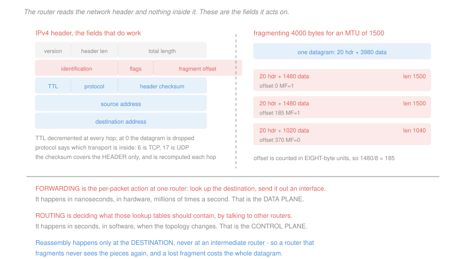

# Networking · Lesson 3.1: Forwarding, routing, and the IP datagram

> ⏱ ~15 min · Module 3: The network layer · Builds on: [2.3 (TCP)](02-03-tcp-segments-connections-flow-control.md), [1.1 (layers)](01-01-packet-switching-and-layers.md) · Unlocks: 3.2 (addressing), 3.3 (routing algorithms)

## Why this matters

Everything so far assumed a packet could get from one host to another. This module is about how, and it begins with a distinction that organises the entire layer.

**Forwarding** is what a router does to a packet: read the destination, look it up, send it out an interface. It happens in nanoseconds, in hardware, millions of times per second. **Routing** is deciding what those lookup tables should say, by exchanging information with other routers. It happens in seconds, in software, when something changes.

Same layer, two entirely different problems with different time scales, different implementations and different failure modes. This lesson covers the fast one and the packet format it acts on; [3.3](03-03-routing-algorithms-link-state-and-distance-vector.md) covers the slow one.

## The idea

**IP's service model is best effort, and that phrase means exactly nothing is promised.** A datagram may be lost, delayed arbitrarily, delivered out of order or duplicated. There is no acknowledgement, no retransmission, no ordering, no rate guarantee.

That is a design decision and not a shortcoming. Every guarantee IP declines is one that endpoints can supply if they want it, and the ones that do not want it — DNS, voice, QUIC — are not made to pay ([2.1](02-01-transport-services-multiplexing-and-udp.md)). It is the end-to-end principle of [1.1](01-01-packet-switching-and-layers.md), and it is why the middle of the Internet could stay simple enough to scale.

**The header fields that do work:**

| field | what it is for |
|---|---|
| total length | the datagram's size, since the link may carry other things |
| identification, flags, fragment offset | reassembling a datagram that had to be split |
| time to live | decremented at every hop, dropped at zero — the loop killer |
| protocol | which transport is inside: 6 for TCP, 17 for UDP |
| header checksum | recomputed at **every hop**, because TTL changed |
| source, destination | 32 bits each |

Two of those repay a closer look.

**TTL exists because routing loops happen.** While the control plane is converging after a change, two routers can each believe the other is the next hop, and a packet between them would circulate forever, consuming capacity permanently. TTL bounds the damage at a fixed number of hops. It is a blunt mechanism guarding against a transient inconsistency, and the fact that IP needs it at all tells you something true: **the forwarding tables are not guaranteed to be consistent with each other at any instant.**

**The checksum covers the header only**, not the data. Recomputing a checksum over 1500 bytes at every hop would be expensive; recomputing it over 20 is cheap, and it must be recomputed because TTL changed. Data integrity is the endpoints' problem, checked once by the transport checksum of [2.1](02-01-transport-services-multiplexing-and-udp.md).

**Fragmentation.** Different links have different maximum frame sizes — the **MTU**. When a datagram is larger than the outgoing link's MTU, an IPv4 router splits it, copying the header into each piece and setting the offset and the more-fragments flag. Reassembly happens **only at the destination**, never in between.

That last rule has consequences, and IPv6 removed router fragmentation entirely because of them. P3 works out why.

## The formal version

> **Fragmenting a datagram of total length $T$ with a header of $h$ bytes for an MTU of $M$:** each fragment carries at most
> $$D = 8\left\lfloor\frac{M - h}{8}\right\rfloor \text{ bytes of data}$$
> because the fragment offset field counts in **8-byte units**. Offsets are $0, D/8, 2D/8, \ldots$, and every fragment but the last has the more-fragments flag set.

> **Traceroute** exploits TTL directly: send a datagram with TTL = 1 and the first router discards it and returns an ICMP time-exceeded message, revealing its address. TTL = 2 reveals the second, and so on.

It is a diagnostic built entirely out of a mechanism designed for something else, which is worth noticing — TTL was put there to kill loops, and it turned out to be a way to map the Internet.

**The forwarding table** maps destination addresses to output interfaces. It is not a list of hosts — there are billions — but a list of **address prefixes**, and the matching rule is longest-prefix. That is [3.2](03-02-ip-addressing-subnets-cidr-and-nat.md)'s subject, and it is the mechanism that keeps a router's table at hundreds of thousands of entries rather than billions.

## Picture

## Worked examples

**Example 1 — fragmenting a datagram.** A 4,000-byte datagram with a 20-byte header must cross a link with an MTU of 1,500.

$$D = 8\left\lfloor\frac{1500 - 20}{8}\right\rfloor = 8\lfloor 185 \rfloor = 1{,}480 \text{ bytes of data per fragment}$$

The datagram carries $4000 - 20 = 3980$ bytes of data:

| fragment | data bytes | total length | offset | more fragments |
|---|---|---|---|---|
| 1 | 1,480 | 1,500 | 0 | 1 |
| 2 | 1,480 | 1,500 | $1480/8 = 185$ | 1 |
| 3 | 1,020 | 1,040 | $2960/8 = 370$ | 0 |

Check: $1480 + 1480 + 1020 = 3980$. All three share the same identification field, which is how the destination knows they belong together, and the offsets tell it where each piece goes.

Note the overhead. One 20-byte header became three, so the bytes on the wire rose from 4,000 to 4,040 — one percent, which is nothing. The cost of fragmentation is not overhead; it is what P3 is about.

**Example 2 — reading a traceroute.** A path of 12 routers, probing with three datagrams per TTL value.

$$\text{probes sent} = 12 \times 3 = 36, \qquad \text{ICMP replies expected} = 36$$

Each probe with TTL = $n$ dies at the $n$-th router, which returns a time-exceeded message from **its own address**. The three probes per hop give three round-trip samples, which is why traceroute prints three times per line.

Two things the output can show that surprise people, and both follow from the mechanism:

- **A line of asterisks** does not mean the path is broken. It means that router chose not to send ICMP replies, or rate-limited them. Packets are passing through it perfectly well — you simply cannot see it.
- **A round-trip time that decreases** going down the list is normal. Each line is a separate measurement to a separate router at a separate moment, not a cumulative sum, so queueing at the moment of the probe can make hop 7 look slower than hop 8.

The general point: traceroute measures **the path taken by ICMP replies from each router**, which is not necessarily the forward path and not necessarily stable between probes.

## Watch out

- **You might think best effort means unreliable in practice.** Most datagrams arrive. Best effort is a statement about what is *promised*, and the promise is nothing, which is what lets the layer be simple and fast.
- **You might think a router reassembles fragments.** Only the destination does. A router that fragments a datagram never sees those pieces again, so it has no idea whether its choice worked.
- **You might think the header checksum protects the payload.** It covers the header alone. A router corrupting your data is invisible to IP and is caught, if at all, by the transport checksum.

## One-liner

> Forwarding is the fast per-packet lookup and routing is the slow computation of what to look up, IP promises nothing so that endpoints may promise what they choose, and TTL exists because the forwarding tables are never guaranteed to agree.

## Problems

**P1 (🟢)** A 2,400-byte datagram with a 20-byte header must cross a link with an MTU of 700. (a) Give the maximum data bytes per fragment. (b) Give the number of fragments, and for each its data size, total length, offset and more-fragments flag. (c) Give the total bytes on the wire and the overhead as a percentage.

**P2 (🟡)** Classify each operation as data plane or control plane, and give its time scale in one clause: (a) decrementing TTL; (b) recomputing shortest paths after a link fails; (c) looking up a destination prefix; (d) exchanging reachability information with a neighbouring router; (e) recomputing the header checksum; (f) installing a new entry in the forwarding table. Then state which of the six a router must perform at line rate and what that implies about where it is implemented.

**P3 (🔴, optional)** IPv6 removed fragmentation by routers entirely; a router that receives a too-large datagram drops it and returns an error, and the source is expected to discover the path MTU itself. (a) A 4,000-byte datagram is fragmented into 3 pieces on a path where each fragment is independently lost with probability 0.02. Give the probability the datagram fails to arrive, and compare with the 0.02 it would face unfragmented. (b) Give the same figure if the fragment size were 576 bytes instead, and state the general relationship. (c) Give two further reasons beyond loss amplification that fragmentation by routers is a bad design, one about the router and one about what else is on the path.

Solutions

**P1** *(a) Data per fragment.*
$$D = 8\left\lfloor\frac{700-20}{8}\right\rfloor = 8\left\lfloor 85 \right\rfloor = \boxed{680 \text{ bytes}}$$

*(b) The fragments.* The datagram carries $2400 - 20 = 2380$ data bytes, and $2380 = 3(680) + 340$.

| fragment | data | total length | offset | MF |
|---|---|---|---|---|
| 1 | 680 | 700 | 0 | 1 |
| 2 | 680 | 700 | $680/8 = 85$ | 1 |
| 3 | 680 | 700 | $1360/8 = 170$ | 1 |
| 4 | 340 | 360 | $2040/8 = 255$ | 0 |

$$\boxed{4 \text{ fragments}}$$

*(c) Bytes on the wire and overhead.*
$$700 + 700 + 700 + 360 = \boxed{2{,}460 \text{ bytes}}$$
$$\text{overhead} = \frac{2460 - 2400}{2400} = \boxed{2.5\%}$$

Three extra headers of 20 bytes each, on a 2,400-byte datagram. Small, and it is not the reason fragmentation is a problem.

**P2**

| | plane | time scale |
|---|---|---|
| (a) decrementing TTL | **data** | per packet, nanoseconds |
| (b) recomputing shortest paths after a failure | **control** | per topology change, seconds |
| (c) looking up a destination prefix | **data** | per packet, nanoseconds |
| (d) exchanging reachability with a neighbour | **control** | per update or per timer, seconds to minutes |
| (e) recomputing the header checksum | **data** | per packet, nanoseconds |
| (f) installing a forwarding-table entry | **control** — it is the *output* of the control plane, written into the data plane's table | per change, milliseconds |

*Which must run at line rate, and what follows.* **(a), (c) and (e)** — everything that touches every packet. On a 100 Gb/s interface with small packets that is well over a hundred million packets per second, giving each packet a budget of a few nanoseconds.

What that implies is the central architectural fact of a router: those three operations are implemented in **dedicated hardware** — a forwarding engine with the table in fast memory, often a specialised chip — while (b), (d) and (f) run as ordinary software on a general-purpose processor beside it. The two halves communicate only when the table changes.

It also explains a whole class of behaviour. A router under a routing-protocol storm can be perfectly fine at forwarding, because the control processor is separate. A router whose forwarding table has overflowed its fast memory falls back to software and drops to a fraction of its rated throughput, which is why the growth of the global routing table ([3.4](03-04-routing-in-the-internet-ospf-and-bgp.md)) is a hardware-purchasing concern and not merely an accounting one.

**P3** *(a) Three fragments, each lost with probability 0.02.* Reassembly needs **every** fragment, so the datagram survives only if all three do:
$$P(\text{failure}) = 1 - (1 - 0.02)^3 = 1 - 0.98^3 = 1 - 0.941192 = \boxed{0.0588}$$

$$\frac{0.0588}{0.02} = \boxed{2.94\times \text{ the unfragmented loss rate}}$$

*(b) With 576-byte fragments.* Data per fragment is $8\lfloor 556/8\rfloor = 552$ bytes, and $3980$ data bytes need
$$\left\lceil\frac{3980}{552}\right\rceil = 8 \text{ fragments}$$
$$P(\text{failure}) = 1 - 0.98^{8} = 1 - 0.8508 = \boxed{0.1492}$$

Nearly a fifteen percent loss rate on a path whose per-packet loss is two percent.

*The general relationship:* with $k$ fragments and per-fragment loss $p$,
$$P(\text{datagram lost}) = 1 - (1-p)^k \approx kp \text{ for small } p$$

**Loss is amplified by a factor of the fragment count**, because the datagram is an all-or-nothing unit and its pieces are independent. And the amplification is worse than it looks in a system with retransmission: the transport layer must resend the *whole* datagram, so one lost 576-byte fragment costs 4,000 bytes of retransmission.

*(c) Two further reasons.*

**About the router.** Fragmentation is expensive at exactly the wrong moment. It requires the router to allocate buffers, copy headers and construct new packets — per-packet work far beyond a table lookup, done in software on the slow path — and it is triggered by a large datagram arriving on a busy interface, which is when the router can least afford it. It also means the router can never know whether its decision worked, since it never sees the fragments again and reassembly happens at the destination.

**About what else is on the path.** Only the **first** fragment carries the transport header, so only the first has port numbers. Every firewall, load balancer and network-address translator on the path filters or rewrites based on ports ([3.2](03-02-ip-addressing-subnets-cidr-and-nat.md), [4.4](04-04-network-security-tls-firewalls-attacks.md)), and for fragments 2 onward that information simply is not there. Such devices must either buffer and reassemble themselves — expensive, and a denial-of-service target in its own right — or make a decision with incomplete information. Attacks based on overlapping and malformed fragments exploited exactly this gap for years.

IPv6's answer moves the work to the source, which can fragment once for the whole path, knows whether it succeeded, and produces pieces that all carry the same information. The cost is that the source must **discover** the path MTU, by sending large and reacting to the errors — a mechanism that itself fails when a misconfigured firewall drops the error messages, which is a genuine and common operational problem. The design is better and it is not free.

## Flashback

**From Lesson 2.3 (TCP):** A TCP connection has Est = 120 ms and Dev = 15 ms, with $\alpha = 1/8$, $\beta = 1/4$ and Timeout = Est + 4 Dev. Samples of 130 ms and then 300 ms arrive. (a) Give Est, Dev and the timeout after each. (b) A segment is then lost and three duplicate acknowledgements arrive. State what TCP does and why it does not wait for the timeout. (c) State which of the two loss signals would follow if instead the path went down completely, and what the sender's window becomes.

Solution

*(a) The two updates.* Dev uses the old Est.

| sample | $\lvert\text{Sample}-\text{Est}\rvert$ | Dev | Est | Timeout |
|---|---|---|---|---|
| 130 | 10 | $0.75(15)+0.25(10) = \boxed{13.75}$ | $0.875(120)+0.125(130) = \boxed{121.25}$ | $\boxed{176.3\ \text{ms}}$ |
| 300 | 178.75 | $0.75(13.75)+0.25(178.75) = \boxed{55.00}$ | $0.875(121.25)+0.125(300) = \boxed{143.59}$ | $\boxed{363.6\ \text{ms}}$ |

The one outlier moved Est by 18 percent and the timeout by 106 percent, which is the deviation term doing its job.

*(b) Three duplicate acknowledgements.* TCP performs a **fast retransmit**: it resends the missing segment immediately, sets `ssthresh` to half the current window, sets `cwnd` to that halved value, and continues in congestion avoidance.

*Why not wait for the timeout:* the duplicates are themselves evidence that **later segments are arriving**. The path is working, one packet was dropped, and waiting out a 364 ms timer would idle the connection for no reason — the information needed to act arrived after one round trip. This is the whole value of the duplicate-acknowledgement signal: it is a loss report that is both faster and more informative than a timer expiring.

*(c) If the path went down.* No segments arrive, so no acknowledgements of any kind come back and there are no duplicates to count. The only signal left is the **timeout**, and the response is the severe one:

$$\text{ssthresh} \leftarrow \frac{\text{cwnd}}{2}, \qquad \text{cwnd} \leftarrow \boxed{1\ \text{MSS}}$$

followed by slow start. Note the design symmetry with part (b): the signal that carries more information gets the gentler response, and the signal that carries none gets the harshest. TCP is inferring the state of a network that never tells it anything, and the strength of its reaction tracks the strength of its evidence.

## Connections

- **Backward:** the best-effort service model is what [2.2](02-02-building-reliable-data-transfer.md) and [2.3](02-03-tcp-segments-connections-flow-control.md) had to build reliability on top of, and the protocol field in the header is what tells the destination which of them to hand the payload to.
- **Forward:** [3.2](03-02-ip-addressing-subnets-cidr-and-nat.md) explains how a destination address becomes a table lookup, and [3.3](03-03-routing-algorithms-link-state-and-distance-vector.md) is the control plane that fills the table — including why the transient inconsistency that TTL guards against exists at all.
- **Sideways:** the data-plane and control-plane split is the same separation as a processor's datapath and its control unit in [`computer-architecture` 3.1](../../computer-architecture/lessons/03-01-single-cycle-datapath.md) — a fast path doing the same thing repeatedly, and a slower mechanism deciding what that thing should be. The loss-amplification arithmetic in P3 is the reliability-of-a-series-system calculation, identical to a chain of components that all must work.
