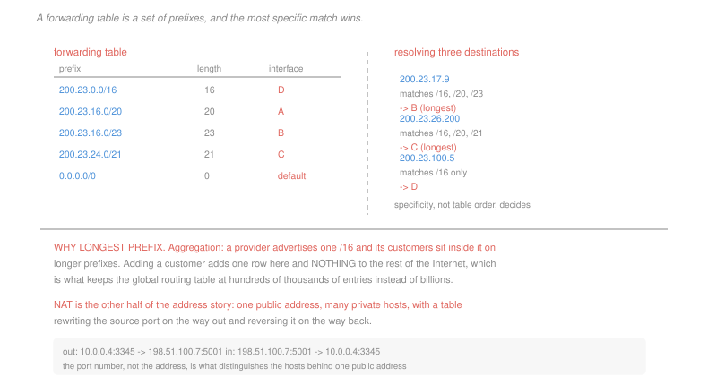

# Networking · Lesson 3.2: IP addressing, subnets, CIDR, and NAT

> ⏱ ~15 min · Module 3: The network layer · Builds on: [3.1 (the IP datagram)](03-01-forwarding-routing-and-the-ip-datagram.md), [2.4 (congestion control)](02-04-tcp-congestion-control.md) · Unlocks: 3.3 (routing algorithms), 3.4 (BGP)

## Why this matters

A router's forwarding table cannot list hosts. There are billions of them, and the table has to be searched in nanoseconds ([3.1](03-01-forwarding-routing-and-the-ip-datagram.md)).

The resolution is that addresses are **hierarchical and aggregatable**: a router far away knows only "everything starting with these 16 bits goes that way", and the detail is filled in as the packet gets closer. One line in a distant table stands for millions of hosts, and adding a customer to a provider's network changes nothing anywhere else.

The second half of the lesson is about what happened when the addresses ran out. Network address translation is universally deployed, genuinely useful, and a violation of the layering that everything else in this course depends on — which makes it the most instructive piece of pragmatism in the subject.

## The idea

An IPv4 address is 32 bits, written as four decimal bytes. It splits into a **network part** and a **host part**, and the split is given by a **prefix length**: `200.23.16.0/23` means the first 23 bits identify the network and the remaining 9 identify a host within it.

$$\text{addresses in a } /p = 2^{32-p}, \qquad \text{usable hosts} = 2^{32-p} - 2$$

The two lost addresses are the all-zeros network address and the all-ones broadcast address.

**Subnetting** is splitting a block into smaller blocks by lengthening the prefix. **CIDR** — classless inter-domain routing — is the general form: any prefix length is allowed, and the routing system carries prefixes rather than the fixed classes that preceded it.

**Longest-prefix matching** is the forwarding rule. A destination may match several table entries, and the **most specific** wins:

| prefix | interface |
|---|---|
| `10.0.0.0/8` | A |
| `10.20.0.0/16` | B |
| `10.20.0.0/20` | D |
| `10.20.30.0/24` | C |
| `0.0.0.0/0` | default |

An address of `10.20.30.44` matches four of these and goes out C. The default route `0.0.0.0/0` matches everything and is the entry of last resort.

Why this rule and not table order? **Because it makes aggregation possible.** A provider advertises one `/16` to the world; when a customer moves in, the provider adds a longer prefix locally and the rest of the Internet learns nothing. Without longest-prefix matching, every exception would have to be visible globally, and the routing table would be the size of the address space.

**DHCP** hands out addresses on demand — a host broadcasts a discovery, a server offers an address with a lease, and the host uses it until the lease expires. It is why you do not configure an address when you join a network.

**Network address translation** is the response to running out of addresses. A router holds one public address and a private network behind it. On the way out it rewrites the source address to its own and the source *port* to a unique value, recording the mapping; on the way back it reverses the rewrite.

| direction | before | after |
|---|---|---|
| out | `10.0.0.4:3345 → 93.1.1.1:80` | `198.51.100.7:5001 → 93.1.1.1:80` |
| in | `93.1.1.1:80 → 198.51.100.7:5001` | `93.1.1.1:80 → 10.0.0.4:3345` |

The port number is what distinguishes the hosts, which is why a 16-bit field intended for demultiplexing between processes ([2.1](02-01-transport-services-multiplexing-and-udp.md)) ended up as the mechanism that let the Internet outgrow its address space.

## The formal version

> **The address exhaustion arithmetic.**
> $$\text{IPv4 space} = 2^{32} = 4.29\times 10^9, \qquad \text{IPv6 space} = 2^{128} = 3.4\times 10^{38}$$

Eight billion people with four connected devices each need $3.2\times 10^{10}$ addresses — seven and a half times the entire IPv4 space, before counting servers, routers or the large blocks that were allocated wastefully in the 1980s and never returned. IPv6's space is $7.9\times 10^{28}$ times larger, which is enough that the design question became how to allocate it *legibly* rather than how to conserve it.

**What NAT breaks**, and this is the part worth being precise about:

> A host behind a NAT **has no address that anyone outside can reach**. It can initiate connections; it cannot receive them.

That single asymmetry has consequences everywhere. Peer-to-peer systems ([1.4](01-04-email-and-peer-to-peer.md)) cannot have peers connect to each other directly and need a rendezvous server and hole-punching tricks. Running a server at home requires explicit port forwarding. And **protocols that carry addresses inside their payloads break outright** — the NAT rewrote the header and did not know to rewrite the body, so the address the application announces is one nobody can reach.

That last point is the layering violation stated exactly. A device at the network layer is inspecting and rewriting transport headers, and to fix the protocols it breaks it must inspect application payloads too. Every layer boundary in [1.1](01-01-packet-switching-and-layers.md) is crossed, and the cost is that a NAT must be taught about each protocol individually.

It is also worth being fair about it. NAT extended IPv4's life by decades, provides a crude default-deny for inbound traffic that many treat as security, and requires no change to anything else. It is the most successful violation of a design principle in the history of the field, and both halves of that sentence are true.

## Picture

## Worked examples

**Example 1 — subnetting a block.** An organisation holds `172.16.32.0/20` and needs subnets supporting at least 500 hosts each.

$$2^{h} - 2 \ge 500 \;\Longrightarrow\; h \ge 9 \;\Longrightarrow\; \text{prefix} = 32 - 9 = /23$$

$$\text{usable hosts per subnet} = 2^9 - 2 = 510, \qquad \text{subnets} = 2^{23-20} = 8$$

| subnet | first host | last host | broadcast |
|---|---|---|---|
| `172.16.32.0/23` | 172.16.32.1 | 172.16.33.254 | 172.16.33.255 |
| `172.16.34.0/23` | 172.16.34.1 | 172.16.35.254 | 172.16.35.255 |
| … | | | |
| `172.16.46.0/23` | 172.16.46.1 | 172.16.47.254 | 172.16.47.255 |

Note the waste built into the choice: 510 usable addresses for a requirement of 500, and if the real departments have 300, 500 and 40 hosts, the 40-host subnet still consumes 512 addresses. **Fixed-length subnetting rounds every requirement up to a power of two**, which is exactly the internal fragmentation of [`operating-systems` 3.1](../../operating-systems/lessons/03-01-address-spaces-and-allocation.md) in a different currency. Variable-length subnetting — using different prefix lengths for different subnets — is the fix, and it is possible only because CIDR allows any prefix length.

**Example 2 — resolving by longest prefix.** Using the table above.

| destination | matches | wins |
|---|---|---|
| `10.20.30.44` | `/8`, `/16`, `/24` | **C**, the `/24` |
| `10.20.5.1` | `/8`, `/16`, `/20` | **D**, the `/20` |
| `10.20.31.5` | `/8`, `/16` | **B**, the `/16` |
| `10.99.1.1` | `/8` | **A** |
| `172.16.5.5` | `/0` only | **default** |

The second and third rows are the ones to check. `10.20.5.1` is inside `10.20.0.0/20`, which spans `10.20.0.0` to `10.20.15.255`. `10.20.31.5` is *not* — 31 is above 15 — so the `/20` does not match it and the `/16` wins.

The general procedure is mechanical: write the prefix's range as [network address, network address + $2^{32-p} - 1$] and test membership. Doing it by eye on the dotted-decimal form is where the errors come from.

## Watch out

- **You might think longest prefix means the entry listed last, or first.** It means the numerically longest prefix. Table order is irrelevant, and a router is free to store the entries in whatever structure searches fastest.
- **You might think a `/24` gives you 256 usable addresses.** It gives 254. The network and broadcast addresses are reserved, and forgetting them is the classic off-by-two.
- **You might think NAT is a firewall.** Its inbound default-deny is a side effect of having no mapping, not a policy. It filters nothing about outbound traffic, inspects nothing, and a host behind it that initiates a connection to an attacker is entirely exposed.

## One-liner

> Addresses are hierarchical so that a distant router can hold one line for a million hosts, longest-prefix matching is what makes that aggregation possible, and network address translation bought IPv4 an extra thirty years by crossing every layer boundary in the stack.

## Problems

**P1 (🟢)** An organisation holds `192.168.8.0/21` and needs subnets of at least 120 hosts each. (a) Give the prefix length, the usable hosts per subnet and the number of subnets. (b) Give the network address, first host, last host and broadcast address of the third subnet. (c) One department needs only 20 hosts. Give the prefix length that would fit it, and the number of addresses wasted by using the uniform size from (a) instead.

**P2 (🟡)** A router's table holds `172.16.0.0/12` → A, `172.16.0.0/16` → B, `172.16.128.0/17` → C, `172.16.128.0/20` → D, and `0.0.0.0/0` → default. Give the interface chosen for each destination, with the matching prefixes: (a) `172.16.129.4`; (b) `172.16.144.9`; (c) `172.16.5.5`; (d) `172.20.1.1`; (e) `10.1.1.1`. Then state the range of the `/20` entry explicitly.

**P3 (🔴, optional)** A NAT router holds the public address `198.51.100.7`. (a) Trace the translation table as three internal hosts each open one connection: `10.0.0.4:3345` and `10.0.0.9:3345` both to `93.1.1.1:80`, then `10.0.0.4:5566` to `8.8.8.8:53` over UDP. Give the table after each. (b) A fourth host runs a server on `10.0.0.11:8080` and a client outside tries to reach it. State exactly what fails and why, and name the mechanism that makes it work. (c) A protocol carries the client's own address in its message body and asks the server to connect back. State what happens through a NAT, name the layering rule violated, and give the general term for the workaround NAT vendors ship.

Solutions

**P1** *(a) Prefix, hosts, subnets.*
$$2^h - 2 \ge 120 \;\Longrightarrow\; 2^h \ge 122 \;\Longrightarrow\; h = 7$$
$$\text{prefix} = 32 - 7 = \boxed{/25}, \qquad \text{usable} = 2^7 - 2 = \boxed{126}, \qquad \text{subnets} = 2^{25-21} = \boxed{16}$$

*(b) The third subnet.* Subnets are 128 addresses apart: `192.168.8.0/25`, `192.168.8.128/25`, `192.168.9.0/25`, …

| | address |
|---|---|
| network | **192.168.9.0** |
| first host | **192.168.9.1** |
| last host | **192.168.9.126** |
| broadcast | **192.168.9.127** |

*(c) A 20-host department.*
$$2^h - 2 \ge 20 \;\Longrightarrow\; h = 5 \;\Longrightarrow\; \boxed{/27}, \text{ giving } 30 \text{ usable}$$
$$\text{waste} = 128 - 32 = \boxed{96 \text{ addresses}}$$

Three quarters of the block, unusable by anyone else because subnets must be contiguous and aligned. With sixteen departments of varying size the total waste is substantial, which is the argument for variable-length subnetting: give each department the shortest prefix that fits it, and the aggregate saving is often more than half the block.

**P2**

| destination | matching prefixes | wins |
|---|---|---|
| (a) `172.16.129.4` | `/12`, `/16`, `/17`, `/20` | **D**, the `/20` |
| (b) `172.16.144.9` | `/12`, `/16`, `/17` | **C**, the `/17` |
| (c) `172.16.5.5` | `/12`, `/16` | **B**, the `/16` |
| (d) `172.20.1.1` | `/12` | **A** |
| (e) `10.1.1.1` | `/0` only | **default** |

*The `/20`'s range.* A `/20` spans $2^{12} = 4{,}096$ addresses:
$$\texttt{172.16.128.0} \text{ to } \texttt{172.16.143.255}$$

That is what separates (a) from (b): `172.16.129.4` is inside it, `172.16.144.9` is one block past the end. The `/17` spans `172.16.128.0` to `172.16.255.255`, so it catches (b) and the `/16` spans the whole of `172.16.x.x`, catching (c). Each longer prefix carves a more specific exception out of the one above it, which is exactly the structure aggregation produces.

**P3** *(a) The translation table.*

After `10.0.0.4:3345 → 93.1.1.1:80`:

| protocol | internal | external | remote |
|---|---|---|---|
| TCP | `10.0.0.4:3345` | `198.51.100.7:5001` | `93.1.1.1:80` |

After `10.0.0.9:3345 → 93.1.1.1:80` — note the internal port is identical, so the NAT must assign a different external one:

| protocol | internal | external | remote |
|---|---|---|---|
| TCP | `10.0.0.4:3345` | `198.51.100.7:5001` | `93.1.1.1:80` |
| TCP | `10.0.0.9:3345` | `198.51.100.7:**5002**` | `93.1.1.1:80` |

After `10.0.0.4:5566 → 8.8.8.8:53` over UDP:

| protocol | internal | external | remote |
|---|---|---|---|
| TCP | `10.0.0.4:3345` | `198.51.100.7:5001` | `93.1.1.1:80` |
| TCP | `10.0.0.9:3345` | `198.51.100.7:5002` | `93.1.1.1:80` |
| UDP | `10.0.0.4:5566` | `198.51.100.7:5003` | `8.8.8.8:53` |

The second row is the mechanism in one line: **the external port is what distinguishes the hosts**, since the external address is the same for all of them. The theoretical limit is the port space, about 65,000 simultaneous mappings, and in practice far fewer because ports are held after a connection closes.

*(b) An inbound connection to `10.0.0.11:8080`.* The outside client sends a segment to `198.51.100.7:8080`. The NAT looks the destination port up in its table, **finds no mapping**, and has no way to know which of the private hosts it was meant for — so it drops the segment.

The failure is not a policy decision. The address `10.0.0.11` is private and unroutable, it appears nowhere outside, and a mapping is created only by an *outbound* packet. The host has no reachable identity at all.

*The mechanism that makes it work:* **static port forwarding**, a manually configured permanent row in the table saying that anything arriving on `198.51.100.7:8080` goes to `10.0.0.11:8080`. Automated variants exist — UPnP and NAT-PMP let a host request the row itself — and they are exactly as dangerous as they sound, since any program on the network can then open a hole through the boundary.

*(c) A protocol that carries its own address in the payload.*

| step | what happens |
|---|---|
| 1 | the client at `10.0.0.4` writes "connect back to me at `10.0.0.4:4000`" into the message body |
| 2 | the NAT rewrites the IP header's source address and the transport header's source port |
| 3 | it does **not** touch the body, because that is application data it has no business reading |
| 4 | the server receives a request naming `10.0.0.4:4000` — a private address, unroutable from where it sits |
| 5 | the server's connection attempt fails or, worse, reaches a different machine that happens to hold that private address on its own network |

*The rule violated:* **layer independence** — a layer may read and act on its own header and must treat everything above it as opaque. NAT already breaks this by rewriting transport ports at the network layer; making the protocol work requires it to break it again, one layer higher, by parsing and rewriting application payloads.

*The general term for the workaround:* an **application-level gateway** (also called a NAT helper or connection-tracking module). The NAT is taught to recognise a specific protocol, parse its messages, rewrite the embedded addresses, and pre-create the mappings the callback will need.

Two things follow, and both are the real cost of the design. Every such protocol needs its own module, written and maintained by the NAT vendor, so a new protocol does not work until the boxes in the path are updated — which is a decade. And a NAT parsing application payloads is running a protocol parser on hostile input in the network path, which has been a source of security vulnerabilities in its own right. It is also why modern protocols avoid putting addresses in payloads entirely, and why the ones that must — voice and video signalling — layer elaborate discovery machinery on top to find out what their public address actually is.

## Flashback

**From Lesson 2.4 (TCP congestion control):** A Reno sender starts at `cwnd = 1 MSS` with `ssthresh = 4`. A triple duplicate acknowledgement occurs at `cwnd = 10`, and four rounds later a timeout occurs. (a) Give `cwnd` for each round through the timeout. (b) Give `ssthresh` after each loss event. (c) State the round at which the sender returns to congestion avoidance after the timeout, and the total rounds lost to the two events compared with uninterrupted linear growth.

Solution

*(a) The window, round by round.*

| round | cwnd | phase |
|---|---|---|
| 1 | 1 | slow start |
| 2 | 2 | slow start |
| 3 | 4 | reaches `ssthresh`, switch to congestion avoidance |
| 4 | 5 | congestion avoidance |
| 5 | 6 | |
| 6 | 7 | |
| 7 | 8 | |
| 8 | 9 | |
| 9 | **10** | **triple duplicate ACK** |
| 10 | 5 | congestion avoidance after halving |
| 11 | 6 | |
| 12 | 7 | |
| 13 | **8** | **timeout**, four rounds after the first loss |

*(b) The thresholds.*
$$\text{after the triple duplicate: } \frac{10}{2} = \boxed{5}, \qquad \text{after the timeout: } \frac{8}{2} = \boxed{4}$$

*(c) Return to congestion avoidance, and the cost.* After the timeout `cwnd` is 1 and `ssthresh` is 4, so slow start gives round 14 = 1, round 15 = 2, round 16 = 4 — at which point `cwnd` equals `ssthresh`.

$$\boxed{\text{round } 16}$$

*The cost against uninterrupted growth.* Had nothing been lost, the window would have continued from 10 at round 9 by adding one per round: 11, 12, 13, 14, 15, 16, 17 at round 16. Instead it is 4.

$$\text{window at round 16: } 4 \text{ against } 17, \qquad \text{a deficit of } \boxed{13\ \text{MSS}}$$

Expressed as time, recovering that deficit takes another 13 rounds of linear growth, so the two loss events cost roughly 20 round trips of full-rate transmission. On a 100 ms path that is two seconds. This is the concrete reason loss is expensive to TCP out of all proportion to the one packet actually dropped — the packet costs a retransmission, and the *reaction* costs seconds.

## Connections

- **Backward:** the forwarding table this lesson fills is the data-plane structure of [3.1](03-01-forwarding-routing-and-the-ip-datagram.md), and NAT's use of the port field repurposes the demultiplexing key of [2.1](02-01-transport-services-multiplexing-and-udp.md).
- **Forward:** [3.3](03-03-routing-algorithms-link-state-and-distance-vector.md) computes the entries; [3.4](03-04-routing-in-the-internet-ospf-and-bgp.md) explains how prefixes propagate between organisations and why aggregation is the only thing keeping the global table finite.
- **Sideways:** longest-prefix matching is a search over a trie, and the rounding-up waste in Example 1 is the internal fragmentation of [`operating-systems` 3.1](../../operating-systems/lessons/03-01-address-spaces-and-allocation.md) — fixed-size allocation units applied to requests of varying size, with the same fix of allowing variable sizes. NAT's rewriting of an identifier to reuse a scarce namespace is the same trick as virtual memory's address translation, and it breaks in the same place: anything that stores the untranslated identifier somewhere the translator cannot see.
