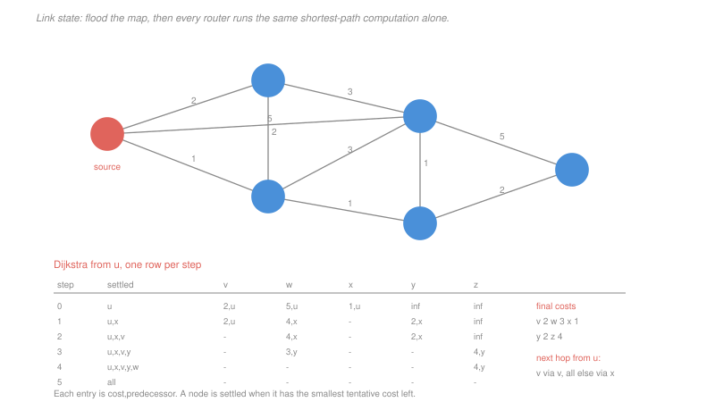

# Networking · Lesson 3.3: Routing algorithms — link-state and distance-vector

> ⏱ ~15 min · Module 3: The network layer · Builds on: [3.1 (forwarding and routing)](03-01-forwarding-routing-and-the-ip-datagram.md), [3.2 (addressing)](03-02-ip-addressing-subnets-cidr-and-nat.md) · Unlocks: 3.4 (OSPF and BGP)

## Why this matters

The two routing algorithms in use are Dijkstra's shortest-path algorithm and Bellman-Ford. You already know both from [`algorithms` 3.3](../../algorithms/lessons/03-03-dijkstras-shortest-paths.md) and [3.4](../../algorithms/lessons/03-04-bellman-ford-and-floyd-warshall.md), and this lesson does not re-derive them.

What is new is the setting, and the setting changes everything. There is **no global view** — no machine holds the graph. There is **no synchronisation** — nodes compute whenever they hear something. The graph **changes while you are computing on it**. And a node's answer depends on answers other nodes are simultaneously revising.

Under those conditions Bellman-Ford acquires a failure mode it does not have as a textbook algorithm, and understanding it is the point of the lesson. A single link failure can make two routers spend twenty-eight rounds gradually agreeing that a destination is far away, forwarding packets in a loop the whole time.

## The idea

**Link state.** Every router floods a description of its own links to every other router. Each then holds an identical copy of the whole graph and runs **Dijkstra** locally, alone, producing its own forwarding table.

- Complete information, so no node can be misled by a neighbour's stale summary.
- Convergence is fast, since every node computes on the same map at once.
- Cost is $O(n^2)$ or $O(n\log n)$ per node, and the flooding is $O(nE)$ messages.
- Every node must learn about every link, which is why the scheme is used *inside* an organisation and not across the Internet.

**Distance vector.** Each router knows only the cost to its direct neighbours and the distance *vectors* they advertise. It applies the Bellman-Ford update

$$D_x(y) = \min_{v \in N(x)}\left\{c(x,v) + D_v(y)\right\}$$

and if its own vector changes, it tells its neighbours. This is **distributed, iterative and asynchronous**: no node has the graph, no node knows when a round begins, and the process runs forever with no termination condition.

- Each node exchanges only with its neighbours, so it scales in message volume.
- It converges to correct shortest paths when costs are stable.
- **Good news travels fast; bad news travels slowly**, and that asymmetry is the whole problem.

## The formal version

> **Count to infinity.** When a link's cost rises or a link fails, distance vector can enter a state in which two nodes each believe the other has a short path to the destination, and their estimates creep upward one step at a time until they exceed the true cost.

The mechanism is that $D_v(y)$ tells $x$ a *distance* and not a *path*. If $v$'s route to $y$ happens to go through $x$, then $x$ computing $c(x,v) + D_v(y)$ is measuring a path that comes straight back through itself, and neither node can tell.

**Poisoned reverse** is the standard repair: if $x$ routes to $y$ through $v$, then $x$ advertises to $v$ that its distance to $y$ is infinite. The lie removes exactly the loop that causes the count.

It is not a complete fix. Poisoned reverse breaks two-node loops and **loops of three or more nodes still occur**, because $x$ poisons only the neighbour it routes through, and a path around a longer cycle is not suppressed. This is why distance-vector protocols also carry a maximum metric — RIP's infinity is 16 — which bounds the counting at the price of a network diameter of 15 hops.

| | link state | distance vector |
|---|---|---|
| what is known | the whole topology | neighbours' distances only |
| computation | Dijkstra, locally | Bellman-Ford, distributed |
| messages | flood to everyone | exchange with neighbours |
| convergence | fast, and predictable | fast for improvements, slow for failures |
| pathologies | flooding overhead, oscillation with load-based costs | count to infinity, routing loops |
| used as | OSPF, IS-IS | RIP, and BGP's path-vector descendant |

BGP's fix for the count deserves naming here because it is elegant: it advertises **the entire AS path**, not just a distance. A router receiving a path that already contains its own AS discards it immediately. Carrying the path costs bandwidth and removes the ambiguity that causes counting, which [3.4](03-04-routing-in-the-internet-ospf-and-bgp.md) takes up.

## Picture

## Worked examples

**Example 1 — Dijkstra to a forwarding table.** The graph has edges $uv{=}2$, $ux{=}1$, $uw{=}5$, $vx{=}2$, $vw{=}3$, $xw{=}3$, $xy{=}1$, $wy{=}1$, $wz{=}5$, $yz{=}2$. Run from $u$.

| step | settled | v | w | x | y | z |
|---|---|---|---|---|---|---|
| 0 | u | 2,u | 5,u | **1,u** | ∞ | ∞ |
| 1 | u,x | **2,u** | 4,x | — | 2,x | ∞ |
| 2 | u,x,v | — | 4,x | — | **2,x** | ∞ |
| 3 | u,x,v,y | — | **3,y** | — | — | 4,y |
| 4 | u,x,v,y,w | — | — | — | — | **4,y** |

Each cell is cost and predecessor; the bold entry is the one settled next.

Step 2 is worth checking. Having settled $v$ at cost 2, the update through $v$ offers $w$ a cost of $2 + 3 = 5$, which is *worse* than the 4 already found through $x$, so nothing changes. Step 3 is where $w$ improves, to $3$ via $y$.

$$\text{costs from } u: \quad v{=}2,\ w{=}3,\ x{=}1,\ y{=}2,\ z{=}4$$

To get **next hops**, walk each predecessor chain back to $u$:

| destination | path | next hop |
|---|---|---|
| v | $u \to v$ | **v** |
| x | $u \to x$ | **x** |
| y | $u \to x \to y$ | **x** |
| w | $u \to x \to y \to w$ | **x** |
| z | $u \to x \to y \to z$ | **x** |

Four of five destinations leave through $x$, and that is the forwarding table: a next hop per destination, with the costs discarded. **The router does not store the paths**, only the first step of each — which is all forwarding needs, and is why a routing table is small even when the graph is not.

**Example 2 — one distance-vector update.** Node $w$ has neighbours $u$ (cost 5), $v$ (3), $x$ (3), $y$ (1) and $z$ (5), and has just received their vectors.

| destination | $u$: $5 + D_u$ | $v$: $3 + D_v$ | $x$: $3 + D_x$ | $y$: $1 + D_y$ | $z$: $5 + D_z$ | result |
|---|---|---|---|---|---|---|
| u | $5+0 = 5$ | $3+2 = 5$ | $3+1 = 4$ | $1+2 = \mathbf{3}$ | $5+4 = 9$ | **3 via y** |
| v | $5+2 = 7$ | $3+0 = \mathbf{3}$ | $3+2 = 5$ | $1+3 = 4$ | $5+5 = 10$ | **3 via v** |
| x | $5+1 = 6$ | $3+2 = 5$ | $3+0 = 3$ | $1+1 = \mathbf{2}$ | $5+3 = 8$ | **2 via y** |
| y | $5+2 = 7$ | $3+3 = 6$ | $3+1 = 4$ | $1+0 = \mathbf{1}$ | $5+2 = 7$ | **1 via y** |
| z | $5+4 = 9$ | $3+5 = 8$ | $3+3 = 6$ | $1+2 = \mathbf{3}$ | $5+0 = 5$ | **3 via y** |

Two results are worth noticing because they are the reason the algorithm is not trivial. **To reach $x$, $w$ should go via $y$ at cost 2, not over its own direct link to $x$ at cost 3.** Same for $u$: via $y$ at 3, not the direct link at 5. A direct link is not necessarily the best route to the node at its far end, and a node that assumed otherwise would be wrong four times in this small graph.

## Watch out

- **You might think link state is simply better.** It requires every router to know every link, which is fine for a few hundred routers in one organisation and impossible for the Internet. It also reveals your internal topology to everyone in the routing domain, which organisations will not do across a boundary.
- **You might think count to infinity is a bug in Bellman-Ford.** The algorithm is correct on a static graph with global information. The pathology comes from running it distributed on a graph that changes, where a distance carries no evidence of the path it describes.
- **You might think a low "infinity" is a hack.** It is a deliberate trade: RIP's 16 bounds the counting to a handful of rounds and costs you any network more than 15 hops across. Choosing the constant is choosing how long a failure takes to converge.

## One-liner

> Link state floods the map and each router runs Dijkstra alone; distance vector exchanges distances with neighbours and runs Bellman-Ford forever — and because a distance carries no evidence of its path, bad news can circulate upward one hop at a time.

## Problems

**P1 (🟢)** Using the graph of Example 1, run Dijkstra from **$x$**. (a) Give the step-by-step table of tentative costs and predecessors. (b) Give the final cost to each node. (c) Give $x$'s forwarding table as a next hop per destination.

**P2 (🟡)** Node $y$ has neighbours $x$ (cost 1), $w$ (1) and $z$ (2), and receives their true least-cost vectors from the same graph. (a) Compute $D_y(\cdot)$ for every destination, showing each minimum. (b) Give $y$'s next hop for each. (c) Identify any destination for which $y$'s best route is not over the direct link to it, and state what that shows.

**P3 (🔴, optional)** Three routers in a line: $X$ — $Y$ with cost 4, and $Y$ — $Z$ with cost 1. All routes to $X$ are stable. The link $X$–$Y$ then rises in cost to 60. (a) Give $D_Y(X)$ and $D_Z(X)$ before the change, and construct the first four update rounds after it, as an ordered list. (b) Give the number of rounds before the estimates reach the true cost, and state what the routers do with packets for $X$ in the meantime. (c) State what poisoned reverse changes here, give the resulting convergence time, and construct the reason it does not fix a loop of three routers.

Solutions

**P1** *(a) Dijkstra from $x$.* $x$'s links: $u{=}1$, $v{=}2$, $w{=}3$, $y{=}1$.

| step | settled | u | v | w | y | z |
|---|---|---|---|---|---|---|
| 0 | x | **1,x** | 2,x | 3,x | 1,x | ∞ |
| 1 | x,u | — | 2,x | 3,x | **1,x** | ∞ |
| 2 | x,u,y | — | **2,x** | 2,y | — | 3,y |
| 3 | x,u,y,v | — | — | **2,y** | — | 3,y |
| 4 | x,u,y,v,w | — | — | — | — | **3,y** |

At step 0 both $u$ and $y$ have cost 1; settling either first is valid, and $u$ is taken here by alphabetical tie-break. At step 2, settling $y$ improves $w$ from 3 to $1 + 1 = 2$ and gives $z$ its first finite value, $1 + 2 = 3$.

*(b) Final costs from $x$.*
$$u = 1, \quad v = 2, \quad w = 2, \quad y = 1, \quad z = 3$$

*(c) $x$'s forwarding table.* Follow the predecessors back:

| destination | path | next hop |
|---|---|---|
| u | $x\to u$ | **u** |
| v | $x\to v$ | **v** |
| y | $x\to y$ | **y** |
| w | $x\to y\to w$ | **y** |
| z | $x\to y\to z$ | **y** |

Note that $w$ is reached via $y$ at cost 2 even though $x$ has a direct link to $w$ costing 3 — the same phenomenon as Example 2, from the other end.

**P2** *(a) The updates at $y$.* Neighbours $x$ (1), $w$ (1), $z$ (2), with true least costs $D_x = (u{:}1, v{:}2, w{:}2, z{:}3)$, $D_w = (u{:}3, v{:}3, x{:}2, z{:}3)$, $D_z = (u{:}4, v{:}5, w{:}3, x{:}3)$.

| destination | via $x$: $1 + D_x$ | via $w$: $1 + D_w$ | via $z$: $2 + D_z$ | minimum |
|---|---|---|---|---|
| u | $1+1 = \mathbf{2}$ | $1+3 = 4$ | $2+4 = 6$ | **2** |
| v | $1+2 = \mathbf{3}$ | $1+3 = 4$ | $2+5 = 7$ | **3** |
| w | $1+2 = 3$ | $1+0 = \mathbf{1}$ | $2+3 = 5$ | **1** |
| x | $1+0 = \mathbf{1}$ | $1+2 = 3$ | $2+3 = 5$ | **1** |
| z | $1+3 = 4$ | $1+3 = 4$ | $2+0 = \mathbf{2}$ | **2** |

*(b) Next hops.*

| destination | u | v | w | x | z |
|---|---|---|---|---|---|
| next hop | **x** | **x** | **w** | **x** | **z** |

*(c) Where the direct link is not the best route.* Every destination that $y$ has a direct link to — $w$, $x$ and $z$ — is best reached over that link here, at costs 1, 1 and 2.

So on this graph the answer is **none**, and that is worth stating rather than hunting for an exception. What it shows is that the property is a fact about the *costs*, not a rule either way: in Example 2 node $w$ found two destinations better reached indirectly, and $y$ finds none, on the same graph. A router cannot assume either. The Bellman-Ford minimum must be taken over all neighbours every time, including the neighbour that *is* the destination, precisely because the answer is sometimes one and sometimes the other.

**P3** *Accept criterion for (a): a round-by-round list showing each router's estimate rising by 2 per round, with the reason each value was computed. Any presentation with that structure is correct.*

*(a) Before, and the first four rounds after.*

Before the change:
$$D_Y(X) = 4 \text{ via the direct link}, \qquad D_Z(X) = 5 \text{ via } Y$$

The cost $X$–$Y$ rises to 60. $Y$ recomputes:

| round | who | computation | result |
|---|---|---|---|
| 1 | $Y$ | $\min\{60 \text{ direct},\ 1 + D_Z(X) = 1 + 5\}$ | $D_Y(X) = \mathbf{6}$ **via $Z$** |
| 2 | $Z$ | $1 + D_Y(X) = 1 + 6$ | $D_Z(X) = \mathbf{7}$ via $Y$ |
| 3 | $Y$ | $\min\{60,\ 1 + 7\}$ | $D_Y(X) = \mathbf{8}$ via $Z$ |
| 4 | $Z$ | $1 + 8$ | $D_Z(X) = \mathbf{9}$ via $Y$ |

The error is visible in round 1. $Z$'s advertised distance of 5 was a route **through $Y$ itself**, and $Y$ has no way to see that, because a distance vector reports a number and not a path. $Y$ adopts a route to $X$ whose next hop is $Z$, whose next hop is $Y$.

*(b) Rounds to converge, and what happens meanwhile.* Each round adds 2 to the pair, starting from 6, and $Y$ stops using $Z$ once $1 + D_Z(X)$ exceeds the direct cost of 60:

$$\boxed{28 \text{ rounds}}$$

ending with $D_Y(X) = 60$ over the direct link and $D_Z(X) = 61$ via $Y$.

*What happens to packets for $X$ in the meantime:* they **loop between $Y$ and $Z$** until their TTL expires ([3.1](03-01-forwarding-routing-and-the-ip-datagram.md)). $Y$ forwards them to $Z$, $Z$ forwards them back to $Y$, and every packet consumes capacity on that link roughly 60 times before being discarded. With updates every 30 seconds, as RIP sends them, 28 rounds is **fourteen minutes** of a persistent forwarding loop — which is why the maximum metric exists, and why a network of any size cannot use plain distance vector.

*(c) What poisoned reverse changes.* $Z$'s route to $X$ goes through $Y$, so under poisoned reverse $Z$ advertises **to $Y$** that its distance to $X$ is infinite, while telling everyone else the true 5.

Now when the link cost rises, $Y$ computes
$$\min\{60 \text{ direct},\ 1 + \infty\} = 60$$
and adopts the direct link **immediately**. $Z$ then hears 60 and sets $D_Z(X) = 61$.

$$\boxed{\text{one round}}$$

*Why it does not fix a three-router loop.* Poisoned reverse suppresses only the advertisement back to **the neighbour you route through**. Consider $X$ reachable through a cycle $Y \to Z \to W \to Y$:

| router | routes to $X$ via | poisons |
|---|---|---|
| $Y$ | $Z$ | tells $Z$ only that its distance is ∞ |
| $Z$ | $W$ | tells $W$ only |
| $W$ | $Y$ | tells $Y$ only |

Now the link from $Y$ to $X$ fails. $Y$ needs a new route and asks its neighbours. $W$ advertises its distance to $Y$ honestly — $W$ does not route through $Y$'s *lost* link, it routes through $Y$, and it poisons $Y$; but $Z$ does not poison $Y$, because $Z$ routes through $W$. So $Y$ can learn a route from $Z$, whose route runs through $W$, whose route runs through $Y$ — a three-hop cycle that no single poisoning suppresses, and the count begins again around the larger loop.

The general statement: **poisoned reverse eliminates cycles of length two and nothing longer**, because each node hides its route from exactly one neighbour, and a longer cycle is never entirely hidden from any of its members. Eliminating cycles of all lengths requires carrying the path itself, which is exactly what BGP does and what [3.4](03-04-routing-in-the-internet-ospf-and-bgp.md) takes up.

## Flashback

**From Lesson 3.1 (forwarding, routing and the IP datagram):** A 3,000-byte datagram with a 20-byte header must cross a link with an MTU of 1,000. (a) Give the number of fragments and each one's data size, total length, offset and more-fragments flag. (b) A router later on the path has an MTU of 500 and must fragment the pieces again. Give the total number of fragments that reach the destination. (c) State where reassembly happens and give the probability the datagram is lost if each fragment is independently lost with probability 0.01.

Solution

*(a) First fragmentation, MTU 1,000.*
$$D = 8\left\lfloor\frac{1000-20}{8}\right\rfloor = 8\lfloor 122.5\rfloor = 976 \text{ bytes of data}$$

The datagram carries $3000 - 20 = 2980$ data bytes, and $2980 = 3(976) + 52$:

| fragment | data | total length | offset | MF |
|---|---|---|---|---|
| 1 | 976 | 996 | 0 | 1 |
| 2 | 976 | 996 | $976/8 = 122$ | 1 |
| 3 | 976 | 996 | $1952/8 = 244$ | 1 |
| 4 | 52 | 72 | $2928/8 = 366$ | 0 |

$$\boxed{4 \text{ fragments}}$$

*(b) Fragmented again for MTU 500.*
$$D' = 8\left\lfloor\frac{500-20}{8}\right\rfloor = 480 \text{ bytes}$$

Each 976-byte piece becomes $\lceil 976/480\rceil = 3$ fragments of 480, 480 and 16 bytes. The 52-byte piece fits in one.

$$3\times 3 + 1 = \boxed{10 \text{ fragments}}$$

Note that the offsets are all relative to the **original** datagram, so the second-level fragments carry offsets computed from the original data, and the destination reassembles all ten in one operation without knowing that two routers were involved.

*(c) Reassembly and the loss probability.* Reassembly happens **only at the destination**, never at an intermediate router — the routers that fragmented never see the pieces again.

$$P(\text{datagram lost}) = 1 - (1 - 0.01)^{10} = 1 - 0.99^{10} = 1 - 0.9044 = \boxed{0.0956}$$

Nearly ten percent, on a path whose per-packet loss is one percent — a tenfold amplification, because the datagram survives only if all ten fragments do. And the cost of a loss is the whole 3,000 bytes retransmitted for the sake of one missing 16-byte fragment.

This is the argument of [3.1](03-01-forwarding-routing-and-the-ip-datagram.md) P3 at its sharpest, and it shows why **repeated** fragmentation is worse still: each stage multiplies the count, and the amplification compounds.

## Connections

- **Backward:** these algorithms fill the forwarding table of [3.1](03-01-forwarding-routing-and-the-ip-datagram.md), and the loops that count-to-infinity produces are exactly what the TTL field there exists to contain.
- **Forward:** [3.4](03-04-routing-in-the-internet-ospf-and-bgp.md) explains why the Internet runs link state *inside* organisations and a path-vector protocol *between* them, and how carrying the path removes the pathology in P3.
- **Sideways:** the algorithms themselves belong to [`algorithms` 3.3](../../algorithms/lessons/03-03-dijkstras-shortest-paths.md) and [3.4](../../algorithms/lessons/03-04-bellman-ford-and-floyd-warshall.md), which prove their correctness on a static graph with global information. Everything difficult here comes from removing those two assumptions, and the resulting problem — agreeing on a shared answer while the inputs change and nobody sees the whole state — is the subject [`distributed-systems`](../../distributed-systems/syllabus.md) takes up in general.
