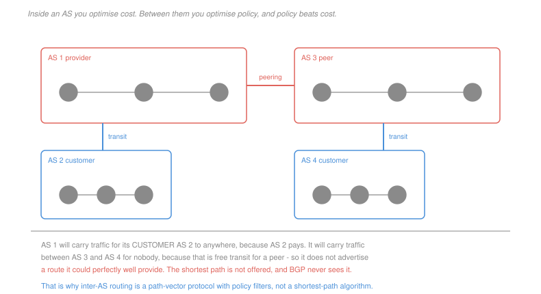

# Networking · Lesson 3.4: Routing in the Internet — OSPF, and a taste of BGP

> ⏱ ~15 min · Module 3: The network layer · Builds on: [3.3 (routing algorithms)](03-03-routing-algorithms-link-state-and-distance-vector.md), [3.2 (CIDR)](03-02-ip-addressing-subnets-cidr-and-nat.md) · Unlocks: 4.4 (security), and `distributed-systems`

## Why this matters

[3.3](03-03-routing-algorithms-link-state-and-distance-vector.md) gave two algorithms and neither of them scales to the Internet. Link state requires every router to know every link — a hundred thousand networks flooding their topology to each other is not a system, it is a weather event. Distance vector's message volume is manageable and its convergence is not.

The resolution is the most consequential structural decision in the Internet's design: **route in two tiers**. Inside an organisation, run link state on a topology you own and optimise for cost. Between organisations, run a protocol that optimises for **policy**, because the shortest path is frequently one that somebody has no commercial interest in providing.

That last sentence is the whole lesson. Inter-domain routing is not a shortest-path problem, and treating it as one gets everything wrong.

## The idea

The Internet is divided into **autonomous systems** — sets of routers under one administration, each with a number. There are roughly 75,000 of them.

**Inside an AS: an interior gateway protocol.** OSPF is the common one: link state, running Dijkstra, with costs an operator sets to express whatever they mean by "good" — capacity, latency, money. Large ASes divide into **areas**, with detailed topology flooded only within an area and summaries between, because flooding does not scale even inside one organisation. RIP, distance vector with an infinity of 16, is the older and simpler alternative.

**Between ASes: BGP**, and it is a different kind of protocol.

> **Path vector.** A BGP advertisement carries the destination prefix and the **entire sequence of ASes** the route traverses, not a distance.

Carrying the path solves two problems at once. **Loop prevention** becomes trivial: a router that sees its own AS number in a received path discards the route immediately, so the count-to-infinity of [3.3](03-03-routing-algorithms-link-state-and-distance-vector.md) cannot occur at any cycle length. And **policy becomes expressible**: you can decide what to do with a route based on who it came through, which a bare distance can never support.

**Policy is the point.** The relationships between ASes are commercial:

| relationship | who pays | what you advertise to them |
|---|---|---|
| **customer** | they pay you | everything you know — you want their traffic |
| **provider** | you pay them | only your own and your customers' prefixes |
| **peer** | neither pays | only your own and your customers' prefixes |

The rule that falls out is the one that governs the Internet's shape:

> **Advertise a route to a peer or a provider only if you learned it from a customer** (or it is your own). Otherwise you would be carrying their traffic for free.

That is why a perfectly good path can exist and not be offered. Two of your peers could reach each other through you; you will not tell them so, because transit between peers is a cost with no revenue. **BGP routinely does not choose the shortest AS path, and often is not told it exists.**

## The formal version

> **The BGP decision process**, in order, stopping at the first that discriminates:
> 1. Highest **local preference** — a number an operator assigns, expressing policy directly
> 2. Shortest **AS path**
> 3. Lowest **origin** type
> 4. Lowest multi-exit discriminator
> 5. Prefer **eBGP** over iBGP
> 6. Lowest interior cost to the egress router — **hot-potato routing**
> 7. Tie-breakers

Read the order. **Local preference comes first**, ahead of path length, which is the formal statement that policy outranks distance. A route through a customer is given a high local preference and wins over a shorter route through a provider, because the first earns money and the second costs it.

> **Hot-potato routing.** When several egress points offer equally good routes, send the traffic to whichever egress is cheapest *by the interior metric* — that is, get it out of your network as soon as possible.

It is rational and it is locally selfish: the sending AS minimises its own cost and hands the long haul to the next AS. Since both ends do it, traffic between two hosts frequently takes **different paths in each direction**, which is a fact worth carrying because it makes one-way delays unequal and makes debugging harder than it looks.

**Two BGP sessions, and the distinction matters.** **eBGP** runs between routers in different ASes and is where routes enter. **iBGP** distributes those learned routes to every router inside the AS, so that an interior router that never speaks to the outside knows which of its own egress routers to use. iBGP is not a routing protocol in the OSPF sense — it does not discover topology, it redistributes external information.

**Scale.** The global routing table holds roughly a million IPv4 prefixes. It is finite only because of the aggregation of [3.2](03-02-ip-addressing-subnets-cidr-and-nat.md): providers advertise short prefixes covering their customers, and the customers' detail stays local. Every organisation that arranges to be reachable through two providers must be advertised separately by both, which **deaggregates** and adds a permanent global entry — one organisation's redundancy is everyone's table growth.

## Picture

## Worked examples

**Example 1 — hot potato.** An AS has two egress routers, A and B, both of which have learned a route to the prefix `203.0.113.0/24` by eBGP. The AS-path length is 3 through both, and all higher decision steps tie. An interior router R has OSPF costs of 10 to A and 25 to B.

The decision falls through to step 6:

$$\min(10,\ 25) = 10 \;\Longrightarrow\; \text{R sends the traffic to egress } \mathbf{A}$$

Now suppose the operator learns that the route through B is over a customer link, which earns revenue, while A's is over a provider link, which costs money. Setting local preference to 200 on B's route and leaving A's at the default 100:

$$\text{step 1 discriminates: } 200 > 100 \;\Longrightarrow\; \text{R sends the traffic to egress } \mathbf{B}$$

even though B is two and a half times further by the interior metric, and even though nothing about the path changed. **One configured integer overrides every technical measure**, and that is by design — the operator, not the topology, decides.

**Example 2 — a shortest path that is never offered.** Four autonomous systems: AS1 is a large provider, AS2 and AS4 are its customers, and AS3 peers with AS1.

$$\text{AS2} \to \text{AS1} \to \text{AS3}: \quad \text{2 AS hops}$$

Now consider traffic from AS3 to AS4. AS4 is AS1's customer, so AS1 advertises AS4's prefixes to its peer AS3, and the route exists at 2 hops. Fine.

But consider traffic between AS3 and some *other* peer of AS1, call it AS5. Both are peers, neither is a customer:

| AS1's choice | consequence |
|---|---|
| advertise AS5's prefixes to AS3 | AS1 carries AS3-to-AS5 traffic across its network, earning nothing from either |
| **do not advertise** | AS3 and AS5 must find another path, or route through their own providers |

AS1 does not advertise. The two-hop path through AS1 is physically present, has capacity, and would be the shortest — and **AS3 never learns it exists**. Its BGP table contains no such route, so no algorithm it runs could select it.

That is the difference between inter-domain routing and shortest-path routing stated as sharply as it goes. Dijkstra requires the graph; BGP is not given the graph, it is given a filtered view constructed by parties with an economic interest in what you can see.

## Watch out

- **You might think BGP finds good paths.** It finds *permitted* paths and then prefers the ones its operators configured. AS-path length is the second criterion, and it counts autonomous systems rather than routers, distance or capacity — a one-AS path across an ocean beats a two-AS path across a city.
- **You might think routing is symmetric.** Hot-potato routing at both ends makes asymmetric paths the norm rather than the exception, so a traceroute shows you one direction only.
- **You might think iBGP is OSPF for BGP routes.** It has no topology discovery at all; it exists to flood externally learned routes inside the AS, and it depends on the interior protocol to know how to reach the egress routers it names.

## One-liner

> Route in two tiers because one protocol cannot serve both scale and autonomy: link state inside an organisation optimising cost, and a path-vector protocol between them optimising policy — where local preference outranks path length and a shortest path that earns nobody money is not advertised at all.

## Problems

**P1 (🟢)** Classify each as intra-AS or inter-AS, name the protocol family it belongs to, and give the quantity it optimises: (a) choosing between two internal links to reach a router in the same building; (b) deciding which of two upstream providers to send traffic for a foreign prefix; (c) distributing an externally learned route to interior routers; (d) recomputing paths after an internal link fails; (e) refusing to carry traffic between two other networks.

**P2 (🟡)** An AS has three egress routers X, Y and Z that have all learned a route to the same prefix. AS-path lengths are 4 via X, 3 via Y and 3 via Z. Local preferences are 100 on X, 100 on Y and 150 on Z. Interior costs from router R are 5 to X, 12 to Y and 40 to Z. (a) Give the egress R chooses, naming the decision step that settles it. (b) Give the choice if Z's local preference is reset to 100. (c) Give the choice if in addition Y's session goes down, and state which step now decides.

**P3 (🔴, optional)** (a) AS1 is a provider with customers AS2 and AS4, and peers with AS3. Construct a case in which a two-AS path between AS3 and a fourth network exists physically and is never advertised, and state the commercial reason. (b) A BGP router in AS7 receives an advertisement whose AS path is `AS3 AS7 AS9`. State what it does and why, and name the pathology of [3.3](03-03-routing-algorithms-link-state-and-distance-vector.md) this prevents at all cycle lengths. (c) An organisation arranges connectivity through two providers for redundancy. Explain the effect on the global routing table, and state why an operator cannot simply refuse such advertisements.

Solutions

**P1**

| | scope | protocol family | optimises |
|---|---|---|---|
| (a) two internal links to a router in the same building | **intra-AS** | interior gateway — OSPF, link state | the operator's own cost metric |
| (b) which upstream provider for a foreign prefix | **inter-AS** | BGP, path vector | policy first, then AS-path length |
| (c) distributing an externally learned route internally | **inter-AS information, carried by iBGP** | BGP | nothing — it is distribution, not selection |
| (d) recomputing after an internal link fails | **intra-AS** | OSPF | the cost metric, by rerunning Dijkstra |
| (e) refusing to carry traffic between two other networks | **inter-AS** | BGP export policy | revenue — it is a commercial decision expressed as a filter |

Row (e) is the one that has no analogue inside an AS. An interior protocol has no concept of declining to carry traffic that it could carry; the whole network belongs to one operator with one objective. The moment two operators are involved, "can I reach it" and "will anyone carry it" become different questions.

**P2** *(a) With Z at local preference 150.* The decision process stops at the first criterion that discriminates.

| step | X | Y | Z | discriminates? |
|---|---|---|---|---|
| 1. local preference | 100 | 100 | **150** | **yes** |

$$\boxed{\text{egress } Z}, \text{ settled at step 1, local preference}$$

Note that Z is worst by both of the technical measures available — its interior cost of 40 is eight times X's — and it wins anyway. That is local preference doing exactly what it is for.

*(b) With Z reset to 100.*

| step | X | Y | Z | discriminates? |
|---|---|---|---|---|
| 1. local preference | 100 | 100 | 100 | no |
| 2. AS-path length | 4 | **3** | **3** | narrows to Y and Z |
| 6. interior cost | — | **12** | 40 | **yes** |

$$\boxed{\text{egress } Y}, \text{ settled at step 6, hot-potato routing}$$

X is eliminated at step 2 despite having by far the lowest interior cost, because AS-path length is considered first. Only among the survivors does the interior metric get a say.

*(c) With Y's session also down.* The candidates are X, at path length 4 and interior cost 5, and Z, at path length 3 and interior cost 40.

| step | X | Z | discriminates? |
|---|---|---|---|
| 1. local preference | 100 | 100 | no |
| 2. AS-path length | 4 | **3** | **yes** |

$$\boxed{\text{egress } Z}, \text{ settled at step 2, AS-path length}$$

The AS now hauls traffic 40 units across its own network to save one AS hop outside it. Whether that is sensible depends on facts BGP cannot see — the AS hop it saves might be a short domestic link and the 40 units might be a transatlantic cable. **AS-path length is a hop count over administrative boundaries and correlates only loosely with anything physical**, which is the standing complaint about inter-domain routing and the reason operators reach for local preference so often.

**P3** *Accept criterion for (a): two networks in a peer or provider relationship to the same AS, with the export rule producing the omission. Any instance with that structure is correct.*

*(a) A path that exists and is never advertised.* Let AS5 be a second **peer** of AS1, alongside AS3.

| fact | |
|---|---|
| AS1 peers with AS3 | neither pays the other |
| AS1 peers with AS5 | neither pays the other |
| AS1 has capacity connecting them | the path AS3 → AS1 → AS5 is two AS hops and physically available |

AS1 applies the export rule: **advertise to a peer only routes learned from a customer, or your own.** AS5's prefixes were learned from a peer, not a customer, so AS1 does not advertise them to AS3, and symmetrically not AS3's to AS5.

$$\text{AS3's BGP table contains no route to AS5 through AS1}$$

*The commercial reason:* carrying that traffic is pure cost. AS1 would consume its own capacity moving bytes between two networks that pay it nothing, and would in effect be providing free transit — turning a peering relationship, which is a mutual convenience, into a service it gives away. AS3 and AS5 must instead reach each other through their respective providers, on a longer path that somebody pays for.

*(b) An advertisement with path `AS3 AS7 AS9`, received by a router in AS7.* It **discards the route immediately**, without further evaluation.

*Why:* its own AS number appears in the path, so accepting the route would mean forwarding toward a path that comes back through AS7 — a loop. Because the advertisement carries the *identities* of every AS traversed rather than a distance, the check is a membership test and it is exact.

*The pathology prevented:* **count to infinity, and routing loops generally, at every cycle length.** [3.3](03-03-routing-algorithms-link-state-and-distance-vector.md) showed that a distance vector cannot detect a loop because a distance carries no evidence of its path, that poisoned reverse eliminates only two-node cycles, and that longer cycles remain. A path vector eliminates all of them, because any cycle through this AS necessarily contains this AS's number and is visible in the advertisement itself.

The cost is bandwidth and memory: every advertisement carries a list rather than an integer, and a router holds those lists for a million prefixes across many peers. That is the trade — path vector buys exact loop detection and policy expressiveness with a much larger routing information base, and at the Internet's scale it is obviously worth it.

*(c) Multihoming and the global table.* An organisation reachable through two providers cannot be covered by either provider's aggregate alone: if provider A advertises only its own `/16` and the organisation is inside it, traffic arriving through provider B has no way to be attracted. So the organisation's prefix must be advertised **separately and specifically by both providers**, as a longer prefix that is not aggregated away.

$$\text{one multihomed organisation} \;\Longrightarrow\; \text{one permanent, globally visible entry, in every router on Earth}$$

Multiply by the number of organisations wanting redundancy and this is the dominant driver of routing-table growth — the table is near a million prefixes, and a large share of them are deaggregated announcements of exactly this kind.

*Why an operator cannot simply refuse them:* because accepting the specific prefix is what makes the customer's redundancy work, and refusing it means the traffic does not arrive. The costs and the benefits fall on different parties — the organisation gets the redundancy, and every router operator worldwide pays a slice of the memory and lookup cost. It is a textbook negative externality, there is no mechanism in BGP to price it, and the result is that the table grows and everyone buys bigger routers.

## Flashback

**From Lesson 3.2 (IP addressing, subnets, CIDR and NAT):** A provider holds `198.51.0.0/16` and assigns blocks to customers. (a) Give the number of `/22` blocks the provider can carve out, and the usable hosts in each. (b) A customer needs 900 hosts. Give the shortest prefix that suffices and the number of addresses wasted. (c) The provider advertises only the `/16` to the rest of the Internet. State how many entries a distant router holds for all of the provider's customers, and what changes if one customer multihomes.

Solution

*(a) The `/22` blocks.*
$$\text{blocks} = 2^{22-16} = \boxed{64}, \qquad \text{usable hosts each} = 2^{32-22} - 2 = 1024 - 2 = \boxed{1{,}022}$$

*(b) A customer needing 900 hosts.*
$$2^h - 2 \ge 900 \;\Longrightarrow\; 2^h \ge 902 \;\Longrightarrow\; h = 10 \;\Longrightarrow\; \boxed{/22}$$
$$\text{waste} = 1{,}022 - 900 = \boxed{122 \text{ addresses}}$$

A `/23` would give only 510, so the `/22` is forced. Twelve percent waste, which is the ordinary cost of rounding to a power of two — and far better than the fixed-class allocation that preceded CIDR, where the choice was between 254 and 65,534.

*(c) The distant router's view.*

$$\boxed{\text{one entry: } \texttt{198.51.0.0/16}}$$

All 64 customers, and every host inside them, are represented by that single line. The provider knows the detail; nobody else needs to. This is aggregation doing the work that keeps the global table finite.

*If one customer multihomes:* that customer's `/22` must be advertised **separately by both providers**, so it appears as an additional, more specific entry that cannot be aggregated into the `/16`.

$$\text{one entry becomes two, everywhere on Earth}$$

The distant router now holds `198.51.0.0/16` and `198.51.x.0/22`, and by longest-prefix matching ([3.2](03-02-ip-addressing-subnets-cidr-and-nat.md)) traffic for that customer follows the more specific route while everything else follows the aggregate. The mechanism works perfectly, and it is exactly why the routing table grows: every deliberate exception to aggregation is a permanent global cost, borne by everyone, for a benefit that accrues to one organisation.

## Connections

- **Backward:** the two algorithms of [3.3](03-03-routing-algorithms-link-state-and-distance-vector.md) appear here in their deployed forms, and the aggregation that keeps BGP's table finite is the longest-prefix machinery of [3.2](03-02-ip-addressing-subnets-cidr-and-nat.md).
- **Forward:** BGP is a large trust problem — an AS can advertise a prefix it does not own, and until recently nothing stopped it — which [4.4](04-04-network-security-tls-firewalls-attacks.md) takes up as route hijacking.
- **Sideways:** BGP is a system in which independent parties with conflicting objectives reach a shared outcome by local rules, which makes it a game rather than an optimisation — the export rule is an equilibrium strategy, and [`grad-game-theory` 6.3](../../grad-game-theory/lessons/06-03-stable-matching-market-design.md) supplies the framing for why a globally shortest path can be individually irrational to offer. The multihoming externality in P3 is the standard tragedy-of-the-commons shape, with no pricing mechanism available to internalise it.
