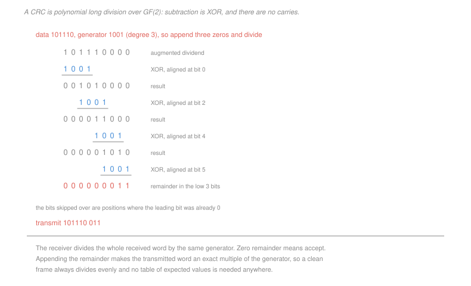

# Networking · Lesson 4.1: The link layer — framing and error detection

> ⏱ ~15 min · Module 4: The link layer, wireless and security · Builds on: [3.3 (routing algorithms)](03-03-routing-algorithms-link-state-and-distance-vector.md), [2.1 (the Internet checksum)](02-01-transport-services-multiplexing-and-udp.md) · Unlocks: 4.2 (Ethernet), 4.3 (wireless)

## Why this matters

The bottom of the stack, and the only layer that touches physical reality. A link carries a stream of bits between two directly connected devices, and two things must happen that no layer above can do: the stream must be divided into **frames**, and corruption must be **detected**.

Detection is where the interesting content is, because the mechanism is genuinely mathematical rather than a heuristic. A cyclic redundancy check is polynomial division over the two-element field, and which errors it catches is a question about which polynomials divide which — with an answer precise enough that choosing a bad generator can be shown to miss exactly twelve of the sixty-six possible double-bit errors in a twelve-bit frame, while a good one of the same length misses none.

This lesson owns **error detection**. Error *correction* — Hamming codes, syndromes, block codes — belongs to [`information-theory` 3.5](../../information-theory/lessons/03-05-codes-in-practice.md) and [`communications` 4.3](../../communications/lessons/04-03-block-codes.md), and is not repeated here.

## The idea

**Framing** is delimiting: the receiver sees a continuous stream of bits and must know where each frame begins and ends. The techniques are a preamble of known bits, an explicit length field, or a delimiter byte with an escape mechanism when that byte appears in the data. Nothing subtle, and it must exist before anything else can.

**Error detection** is the substance. Three mechanisms, in increasing order of both strength and cost:

**Parity.** One bit, chosen to make the total number of ones even. Catches any odd number of errors and **misses every even number**, which on a real link is a serious limitation: errors on physical media come in bursts, and a burst is as likely to flip two bits as one.

**The Internet checksum.** Sum the data as 16-bit words with end-around carry and send the complement ([2.1](02-01-transport-services-multiplexing-and-udp.md)). Cheap in software, and weak: any set of errors that cancels in the sum is invisible.

**The cyclic redundancy check.** Treat the data as the coefficients of a polynomial over $\mathrm{GF}(2)$, divide by a chosen **generator polynomial**, and send the remainder. Strong, and cheap in hardware — a shift register and a few XOR gates — which is why every link layer uses one.

The arithmetic is the two-element field: addition and subtraction are both XOR, and there are no carries. Everything else is ordinary long division.

## The formal version

> **Computing a CRC.** Let $D(x)$ be the data and $G(x)$ a generator of degree $r$. Append $r$ zeros — that is, form $x^r D(x)$ — divide by $G(x)$, and let $R(x)$ be the remainder. Transmit $x^r D(x) + R(x)$.

The transmitted word is then an exact multiple of $G(x)$, because subtracting the remainder is the same as adding it in $\mathrm{GF}(2)$. The receiver divides the whole received word by $G(x)$ and accepts on a zero remainder. No table of expected values is needed anywhere.

> **When an error escapes.** Write the received word as $T(x) + E(x)$, where $E(x)$ has a 1 in each corrupted position. Since $G \mid T$, the remainder is zero exactly when
> $$G(x) \mid E(x)$$

In words: **an error is missed precisely when its pattern is a multiple of the generator.** Every guarantee follows from that one statement:

| error pattern | detected when |
|---|---|
| a single bit, $E = x^i$ | $G$ has **at least two terms** — then $G\nmid x^i$ |
| two bits, $E = x^j(x^{k}+1)$ | $G \nmid x^k + 1$ for every $k$ shorter than the frame |
| any odd number of bits | $G$ has $(x+1)$ as a factor |
| any burst shorter than $r+1$ bits | always, since $E = x^j B(x)$ with $\deg B < r$ |

The second row is the one that decides whether a generator is good, and it is a question about the **order of $x$** modulo $G$. If $G$ is primitive of degree $r$, then $x$ has order $2^r - 1$, so $x^k + 1$ is divisible by $G$ only when $(2^r-1) \mid k$ — and no double error inside a frame shorter than $2^r - 1$ bits can escape. A reducible generator of the same degree has a much smaller order and misses double errors at that spacing. P3 constructs both.

That is why the standard generators are chosen and not invented. CRC-32, used by Ethernet, has degree 32 with $(x+1)$ as a factor, so it catches every single-bit error, every odd error pattern, every burst up to 32 bits, and every double error in any frame under $2^{31}-1$ bits.

## Picture

## Worked examples

**Example 1 — computing and checking a CRC.** Data $D = 101110$, generator $G = 1001$, so $r = 3$.

Append three zeros to get $101110000$, and divide, XOR-ing the generator in wherever the leading bit is 1:

| running value | XOR at position | result |
|---|---|---|
| $101110000$ | $1001$ at 0 | $001010000$ |
| $001010000$ | $1001$ at 2 | $000011000$ |
| $000011000$ | $1001$ at 4 | $000001010$ |
| $000001010$ | $1001$ at 5 | $000000011$ |

$$R = 011, \qquad \text{transmit } \boxed{101110\,011}$$

*The receiver's check.* Dividing $101110011$ by $1001$ leaves remainder $000$, so the frame is accepted.

*A corrupted frame.* Flip the fourth bit, giving $101010011$. Dividing leaves a nonzero remainder, so the frame is discarded. The error pattern is $E(x) = x^5$, a single bit, and $G$ has two terms so it cannot divide a bare power of $x$. **Every** single-bit error is caught here, which the table above guarantees without testing any of them.

**Example 2 — comparing the three mechanisms on one error.** A frame is corrupted by two bit flips, at positions 3 and 11.

| mechanism | catches it? | why |
|---|---|---|
| parity | **no** | two errors is an even number, and parity is blind to every even count |
| Internet checksum | **only sometimes** | if the two flips are in different 16-bit words at the same bit position in opposite directions, the sum is unchanged and it is missed |
| CRC with $G = x^4+x+1$ | **yes** | $E = x^{3}(x^{8}+1)$, and $x$ has order 15 modulo this $G$, so $G \nmid x^8+1$ |
| CRC with $G = x^4+1$ | **no** | $x^4+1$ divides $x^8+1$, since $8$ is a multiple of $4$ |

Same degree, same cost in gates, same number of check bits — and one of them catches this error and the other does not. **The strength of a CRC is entirely in the algebra of the polynomial**, not in its length, which is the point of standardising specific generators rather than letting each designer pick one.

## Watch out

- **You might think a longer CRC is automatically stronger.** Length sets the *maximum* achievable strength; the choice of polynomial decides whether you get it. A badly chosen 32-bit generator can be weaker than a well-chosen 16-bit one on the error patterns that actually occur.
- **You might think a CRC provides integrity.** It detects accidental corruption. It is a public function of the data, so an attacker who alters the data recomputes it instantly — the distinction [4.4](04-04-network-security-tls-firewalls-attacks.md) makes precise, and one of the most consequential confusions in the subject.
- **You might think the link layer's check makes the transport checksum redundant.** It does not. The link check covers one hop, and a router that corrupts a datagram in its own memory produces a frame with a perfectly valid CRC on the next hop. The end-to-end check is what catches that, which is the end-to-end principle of [1.1](01-01-packet-switching-and-layers.md) in its original 1984 formulation.

## One-liner

> A CRC is polynomial division over the two-element field, an error escapes exactly when its pattern is a multiple of the generator, and every guarantee about which errors are caught is a divisibility statement.

## Problems

**P1 (🟢)** Data $D = 110101$, generator $G = 1011$. (a) Give the augmented dividend and perform the division, showing each XOR step. (b) Give the CRC and the transmitted word. (c) Verify the receiver's division yields zero, then flip the leftmost bit and give the resulting remainder.

**P2 (🟡)** For each error pattern on a frame protected by a generator of degree 8 that has $(x+1)$ as a factor and at least two terms, state whether it is guaranteed detected, and name the row of the table that settles it: (a) one bit flipped; (b) three bits flipped; (c) a burst of six consecutive bits corrupted; (d) a burst of twelve consecutive bits corrupted; (e) two bits flipped, 60 positions apart, in a 100-bit frame.

**P3 (🔴, optional)** An 8-bit data word is protected by a degree-4 CRC, giving a 12-bit frame. Compare $G_1 = x^4 + x + 1$ (irreducible and primitive) with $G_2 = x^4 + 1$. (a) State how many of the 66 possible double-bit error patterns each generator fails to detect. (b) For $G_2$, characterise exactly which pairs escape, and verify your characterisation gives the count in (a). (c) State the algebraic property of $G_1$ that guarantees it misses none, and give the frame length beyond which it would begin to.

Solutions

**P1** *(a) The division.* $G = 1011$ has degree 3, so append three zeros: $110101\,000$.

| running value | XOR at position | result |
|---|---|---|
| $110101000$ | $1011$ at 0 | $011001000$ |
| $011001000$ | $1011$ at 1 | $001111000$ |
| $001111000$ | $1011$ at 2 | $000100000$ |
| $000100000$ | $1011$ at 3 | $000001100$ |
| $000001100$ | $1011$ at 5 | $000000111$ |

(Position 4 is skipped because the leading bit there is already 0.)

*(b) The CRC and the transmitted word.*
$$R = \boxed{111}, \qquad \text{transmit } \boxed{110101\,111}$$

*(c) Verification and a corrupted frame.* Dividing $110101111$ by $1011$:

| running value | XOR at | result |
|---|---|---|
| $110101111$ | 0 | $011001111$ |
| $011001111$ | 1 | $001111111$ |
| $001111111$ | 2 | $000100111$ |
| $000100111$ | 3 | $000001011$ |
| $000001011$ | 5 | $000000000$ |

$$\text{remainder} = \boxed{000}, \text{ accepted}$$

Flipping the leftmost bit gives $010101111$. The leading bit is now 0, so the first XOR falls at position 1:

| running value | XOR at | result |
|---|---|---|
| $010101111$ | 1 | $000011111$ |
| $000011111$ | 4 | $000001001$ |
| $000001001$ | 5 | $000000010$ |

$$\text{remainder} = \boxed{010} \ne 0, \text{ rejected}$$

As it must be: the error pattern is $E(x) = x^8$, and $G = x^3+x+1$ has more than one term, so it cannot divide a bare power of $x$.

**P2** Degree 8, at least two terms, and $(x+1)$ a factor.

| | guaranteed? | which row settles it |
|---|---|---|
| (a) one bit | **yes** | a generator with two or more terms cannot divide $x^i$ |
| (b) three bits | **yes** | an odd number of errors makes $E(1) = 1$, and any multiple of a polynomial containing $(x+1)$ has $E(1) = 0$ |
| (c) a burst of six | **yes** | any burst shorter than $r+1 = 9$ bits is $x^j B(x)$ with $\deg B < 8$, which $G$ cannot divide |
| (d) a burst of twelve | **not guaranteed** | longer than $r+1$, so $B(x)$ may itself be a multiple of $G$. Most such bursts are caught — the fraction missed is about $2^{-8}$ — but there is no guarantee |
| (e) two bits 60 apart in a 100-bit frame | **depends on the generator** | this is $E = x^j(x^{60}+1)$, and it escapes exactly if $G \mid x^{60}+1$. For a **primitive** degree-8 generator, $x$ has order 255 and $60$ is not a multiple of 255, so it is caught; for a non-primitive one of the same degree it may not be |

Row (b) is worth the extra line because the argument is so short. Over $\mathrm{GF}(2)$, evaluating a polynomial at $x = 1$ gives the parity of its coefficients. An odd-weight error pattern has $E(1) = 1$; anything divisible by $(x+1)$ has value 0 at $x=1$. So an odd-weight pattern can never be a multiple of $G$, and **including $(x+1)$ as a factor is exactly how a CRC subsumes a parity check**.

**P3** *(a) Double errors missed, out of 66.*
$$G_1 = x^4+x+1: \quad \boxed{0 \text{ of } 66}$$
$$G_2 = x^4+1: \quad \boxed{12 \text{ of } 66}$$

*(b) Characterising $G_2$'s failures.* A double error at positions $i > j$ is
$$E(x) = x^i + x^j = x^j\left(x^{i-j} + 1\right)$$
and since $G_2 = x^4+1$ has no factor of $x$, it divides $E$ exactly when it divides $x^k + 1$ with $k = i - j$.

Over $\mathrm{GF}(2)$, $x^4 + 1 = (x+1)^4$, and more usefully $x^4 \equiv 1 \pmod{G_2}$, so
$$x^k + 1 \equiv x^{k \bmod 4} + 1 \pmod{G_2}$$
which is zero exactly when $4 \mid k$.

$$\textbf{a double error escapes iff the two flipped bits are a multiple of 4 apart}$$

Counting in a 12-bit frame, with positions $0$ to $11$:

| spacing $k$ | pairs |
|---|---|
| 4 | $(0,4),(1,5),\ldots,(7,11)$ — **8 pairs** |
| 8 | $(0,8),(1,9),(2,10),(3,11)$ — **4 pairs** |
| 12 | none — the frame is only 12 bits |

$$8 + 4 = \boxed{12}, \text{ matching (a)}$$

*(c) Why $G_1$ misses none, and where it would start to.* $G_1 = x^4+x+1$ is **primitive**, so $x$ is a generator of the multiplicative group of $\mathrm{GF}(16)$ and its order is
$$2^4 - 1 = 15$$

Therefore $x^k \equiv 1 \pmod{G_1}$ — equivalently $G_1 \mid x^k+1$ — only when $15 \mid k$. The largest spacing available in a 12-bit frame is 11, so no double error can have $k = 15$, and none escapes.

$$\text{the guarantee holds for any frame of at most } \boxed{15 \text{ bits}}$$

At 16 bits the pair $(0, 15)$ becomes available and is missed, and beyond that every spacing that is a multiple of 15 is a hole.

The general statement is the design rule for CRCs: **a primitive generator of degree $r$ detects all double errors in any frame up to $2^r - 1$ bits**, which is why the standard generators are primitive polynomials, often multiplied by $(x+1)$ to pick up the odd-weight guarantee of P2(b) at the cost of one degree. CRC-32's $2^{31} - 1$ bits is 268 megabytes, comfortably beyond any frame, and that is the sense in which it is strong. The whole analysis is the theory of finite fields from [`abstract-algebra` 4.3](../../abstract-algebra/lessons/04-03-finite-fields.md) doing an entirely concrete engineering job.

## Flashback

**From Lesson 3.3 (routing algorithms):** Two routers $P$ and $Q$ are joined by a link of cost 1, and $P$ has a link to destination $S$ of cost 3. $Q$ reaches $S$ through $P$. The link $P$–$S$ then fails and is replaced by a path of cost 50 through other routers. (a) Give $D_P(S)$ and $D_Q(S)$ before the change, and the first three update rounds after it. (b) Give the number of rounds to converge and what happens to packets meanwhile. (c) State what poisoned reverse changes and why it would not help if a third router were involved.

Solution

*(a) Before, and the first three rounds.*
$$D_P(S) = 3 \text{ direct}, \qquad D_Q(S) = 4 \text{ via } P$$

The direct link fails and $P$'s best alternative is 50.

| round | who | computation | result |
|---|---|---|---|
| 1 | $P$ | $\min\{50,\ 1 + D_Q(S) = 1+4\}$ | $D_P(S) = \mathbf{5}$ **via $Q$** |
| 2 | $Q$ | $1 + D_P(S) = 1+5$ | $D_Q(S) = \mathbf{6}$ via $P$ |
| 3 | $P$ | $\min\{50,\ 1+6\}$ | $D_P(S) = \mathbf{7}$ via $Q$ |

The error is in round 1: $Q$'s advertised 4 was a route **through $P$**, and $P$ cannot see that, because a distance vector reports a number and not a path.

*(b) Rounds to converge, and the packets.* Each round adds 2, starting from 5, and $P$ abandons $Q$ once $1 + D_Q(S)$ exceeds 50:

$$5, 7, 9, \ldots \;\longrightarrow\; \text{the estimates pass } 50 \text{ after } \boxed{23 \text{ rounds}}$$

ending at $D_P(S) = 50$ over the alternative path and $D_Q(S) = 51$ via $P$.

Meanwhile packets for $S$ **loop between $P$ and $Q$** until their TTL expires ([3.1](03-01-forwarding-routing-and-the-ip-datagram.md)). Each packet crosses the link roughly TTL times before being discarded, so the loop consumes capacity in proportion to the traffic destined for $S$.

*(c) Poisoned reverse.* $Q$ routes to $S$ through $P$, so it advertises **to $P$** that its distance to $S$ is infinite. When the link fails, $P$ computes $\min\{50, 1+\infty\} = 50$ and adopts the alternative path immediately; $Q$ then learns 51. **One round.**

*Why it would not help with a third router.* Poisoned reverse suppresses the advertisement to exactly one neighbour — the one you route through. With a cycle of three, each router poisons only its own next hop, so a route can still be learned around the loop from a neighbour that is not poisoning you. The lie removes two-node cycles and nothing longer, which is why RIP additionally caps its metric at 16, and why BGP carries the whole AS path instead ([3.4](03-04-routing-in-the-internet-ospf-and-bgp.md)).

## Connections

- **Backward:** this is the check that makes the transport checksum of [2.1](02-01-transport-services-multiplexing-and-udp.md) a *last* line of defence rather than the only one, and the frames it delimits are what carry the datagrams of [3.1](03-01-forwarding-routing-and-the-ip-datagram.md) across one hop.
- **Forward:** [4.2](04-02-multiple-access-ethernet-and-switching.md) puts these frames on a shared medium and has to arbitrate who transmits; [4.4](04-04-network-security-tls-firewalls-attacks.md) draws the line between detecting accidental corruption and detecting deliberate alteration.
- **Sideways:** the whole analysis lives in [`abstract-algebra` 4.3](../../abstract-algebra/lessons/04-03-finite-fields.md)'s finite fields, with the order of $x$ modulo the generator deciding the double-error guarantee, and the division itself is the polynomial arithmetic of [`algebra-foundations` 3.3](../../algebra-foundations/lessons/03-03-polynomial-division.md) with coefficients mod 2. Error *correction* using the same algebra is [`information-theory` 3.5](../../information-theory/lessons/03-05-codes-in-practice.md) and [`communications` 4.3](../../communications/lessons/04-03-block-codes.md).
