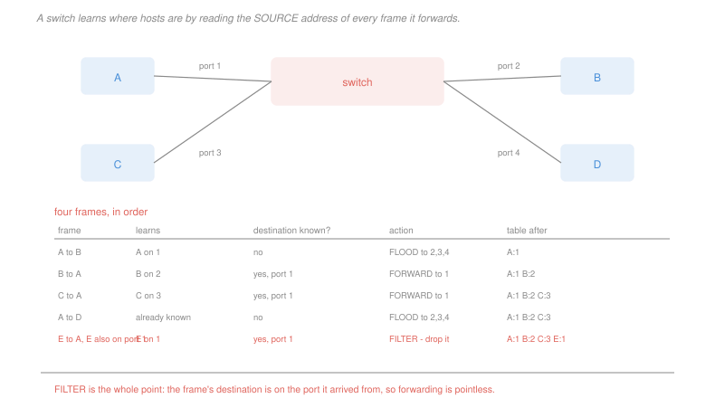

# Networking · Lesson 4.2: Multiple access, Ethernet, and switching

> ⏱ ~15 min · Module 4: The link layer, wireless and security · Builds on: [4.1 (framing and error detection)](04-01-framing-and-error-detection.md), [3.4 (BGP)](03-04-routing-in-the-internet-ospf-and-bgp.md) · Unlocks: 4.3 (wireless), 4.4 (security)

## Why this matters

A point-to-point link has one sender and needs no arbitration. A **shared** medium — the original Ethernet cable, a radio channel, a cable-television upstream — has many, and if two transmit at once both frames are destroyed.

There is no coordinator. Every station must decide alone when to transmit, using only what it can observe, and the collective outcome must be a working network. That is the same problem shape as TCP congestion control in [2.4](02-04-tcp-congestion-control.md) — many independent participants, one shared resource, no authority — and the solutions rhyme: sense, back off, retry, randomly.

The lesson ends with the device that made the whole question mostly historical. A switch gives every host its own collision-free link and learns the topology by watching traffic, with no configuration and no protocol.

**Scope.** This lesson owns **random access** — ALOHA, CSMA, CSMA/CD — and switching. Dividing a channel by frequency, time or code (FDMA, TDMA, CDMA, OFDM) is [`communications` 4.5](../../communications/lessons/04-05-multiplexing-multiple-access.md)'s subject and is not repeated.

## The idea

Three families of answer to "who transmits now":

**Channel partitioning** divides the medium in advance, so collisions cannot happen. It is efficient at full load and wastes the channel when a station has nothing to send, since its share goes unused.

**Taking turns** passes a token or polls in order. Efficient and it needs a coordinator or a token that can be lost.

**Random access** lets stations transmit whenever they like and resolves collisions afterwards. It is efficient at low load, degrades under contention, and needs no coordination whatsoever — which is why it won.

The random-access sequence is worth walking, because each step is a response to a measured weakness:

**Pure ALOHA.** Transmit whenever you have a frame. A frame is destroyed if any other transmission overlaps it at all, so its vulnerable window is *two* frame times, and the maximum efficiency is $1/2e \approx 18\%$.

**Slotted ALOHA.** Transmit only at slot boundaries. The vulnerable window halves, and efficiency doubles to $1/e \approx 37\%$.

**CSMA.** Listen before transmitting. A great improvement, and collisions still happen: two stations that both sense idle during the propagation delay before the other's signal arrives will both transmit. **Propagation delay is the entire reason carrier sense is not sufficient.**

**CSMA/CD.** Listen *while* transmitting, and abort the moment a collision is detected. This is Ethernet, and it turns a wasted frame time into a wasted fraction of one. On a collision each station waits a random number of slot times drawn from a range that **doubles after each successive collision** — binary exponential backoff, which adapts the contention window to the load without measuring the load.

## The formal version

> **Slotted ALOHA efficiency.** With $N$ stations each transmitting in a slot with probability $p$:
> $$\text{efficiency} = Np(1-p)^{N-1}, \qquad \text{maximised at } p = \frac{1}{N}, \qquad \xrightarrow[N\to\infty]{} \frac{1}{e} \approx 0.37$$

> **CSMA/CD efficiency**, with $t_{\text{prop}}$ the maximum propagation delay between stations and $t_{\text{trans}}$ the time to transmit a frame:
> $$\text{efficiency} \approx \frac{1}{1 + 5\,t_{\text{prop}}/t_{\text{trans}}}$$

Read what the ratio does. Efficiency is high when a frame takes much longer to transmit than the signal takes to cross the network, and it collapses when the two are comparable. A 100 Mb/s Ethernet over 500 m with 1500-byte frames is 91 percent efficient; the *same* network at 10 Gb/s is **9 percent**, because the frame now takes less time to send than the cable takes to traverse.

That single ratio is why shared-medium Ethernet stopped scaling and why switches took over.

> **Minimum frame size.** For a station to detect a collision it must still be transmitting when the collision signal returns:
> $$t_{\text{trans}} \ge 2\,t_{\text{prop}} \;\Longrightarrow\; L_{\min} \ge 2\,t_{\text{prop}}\,R$$

Ethernet's 64-byte minimum frame is this inequality evaluated for 10 Mb/s over 2,500 m — a number frozen into the standard forever, and the reason short frames are padded.

**MAC addresses and ARP.** A link-layer address is 48 bits, flat, and burned into the adapter. It is not hierarchical and cannot be aggregated, which is exactly why it works on one link and could never work across the Internet. **ARP** maps an IP address to a MAC address on the same link by broadcasting "who has this address?" and caching the reply.

**Switches.** A switch gives each port its own collision domain and forwards frames selectively. It builds its table by **self-learning**:

| on receiving a frame on port $p$ | |
|---|---|
| record the frame's **source** address as reachable on port $p$ | this is how it learns |
| destination in the table, on a **different** port | **forward** to that port only |
| destination in the table, on **port $p$ itself** | **filter** — drop it, the destination already heard it |
| destination not in the table | **flood** to every port but $p$ |

No configuration, no protocol, no addresses assigned. It is plug-and-play in a way routers never are, and the price is that it works only within one broadcast domain — a flat address space with no aggregation cannot scale, which is the whole reason the network layer exists.

## Picture

## Worked examples

**Example 1 — why shared Ethernet stopped scaling.** 1500-byte frames, stations up to 500 m apart, signal at $2\times 10^8$ m/s so $t_{\text{prop}} = 2.5\ \mu$s.

| rate | $t_{\text{trans}}$ | $5 t_{\text{prop}}/t_{\text{trans}}$ | efficiency |
|---|---|---|---|
| 10 Mb/s | 1,200 µs | 0.0104 | **99.0%** |
| 100 Mb/s | 120 µs | 0.104 | **90.6%** |
| 1 Gb/s | 12 µs | 1.04 | **49.0%** |
| 10 Gb/s | 1.2 µs | 10.4 | **8.8%** |

Ten Gb/s of shared cable delivers less usable throughput than 1 Gb/s does. Nothing about the protocol changed; the frame simply got shorter in *time* while the cable stayed the same length in *metres*, and the arbitration overhead is measured in propagation delays.

There are only two ways out. Make frames longer, which the standard did for a while with frame bursting, or **stop sharing the medium** — which is what a switch does, giving every host a private full-duplex link where collisions cannot occur and the efficiency formula does not apply at all.

**Example 2 — tracing a switch's table.** Hosts A, B, C, D on ports 1, 2, 3, 4, with an empty table.

| frame | learns | destination known? | action | table after |
|---|---|---|---|---|
| A → B | A on 1 | no | **flood** to 2, 3, 4 | A:1 |
| B → A | B on 2 | yes, port 1 | **forward** to 1 | A:1, B:2 |
| C → A | C on 3 | yes, port 1 | **forward** to 1 | A:1, B:2, C:3 |
| A → D | already known | no | **flood** to 2, 3, 4 | A:1, B:2, C:3 |
| E → A, with E also on port 1 | E on 1 | yes, port 1 | **filter** — drop | A:1, B:2, C:3, E:1 |

The last row is the mechanism's whole point. E and A share port 1 — they are on a hub or another switch below — so E's frame already reached A on that segment, and forwarding it anywhere would be pure waste. Filtering is what turns a switch from a repeater into something that actually reduces traffic.

Note also the second row: **one frame in the reverse direction is what makes the forward direction efficient.** The first A → B frame had to be flooded; after B answers, the switch knows where B is and never floods to it again. On a network with any two-way traffic the table populates within milliseconds and flooding essentially stops.

## Watch out

- **You might think collisions still matter.** On a modern switched network with full-duplex links there are none, and CSMA/CD is disabled. It matters historically, it matters on wireless ([4.3](04-03-wireless-and-mobility.md)), and it matters as an idea — but the collision domain of a wired LAN is now one host wide.
- **You might think a switch is a slow router.** They work at different layers on different addresses with different tables built in completely different ways. A switch learns by watching and floods when uncertain; a router computes with a protocol and drops when it has no route.
- **You might think exponential backoff is about fairness.** It is about **estimating contention without measuring it**. Each collision is evidence that more stations are competing, and doubling the window is a cheap adaptive response — the same reasoning as TCP's multiplicative decrease in [2.4](02-04-tcp-congestion-control.md).

## One-liner

> Random access needs no coordinator and pays for it in collisions, carrier sense fails only because of propagation delay, and the efficiency of the whole scheme is set by the ratio of that delay to a frame's transmission time — which is why switching replaced sharing.

## Problems

**P1 (🟢)** A slotted ALOHA channel has $N$ stations, each transmitting in a slot with probability $p$. (a) Give the efficiency for $N = 4$ and $p = 0.2$. (b) Give the $p$ that maximises efficiency for $N = 4$, and the resulting value. (c) Give the limiting efficiency as $N$ grows with $p = 1/N$, and state how pure ALOHA compares and why.

**P2 (🟡)** A shared Ethernet segment is 1,000 m long with a signal speed of $2\times 10^8$ m/s. (a) Give the propagation delay and the CSMA/CD efficiency for 1,000-byte frames at 10 Mb/s and at 1 Gb/s. (b) Give the minimum frame size needed at each rate for collision detection to work. (c) State the frame size that would restore the 10 Mb/s efficiency at 1 Gb/s, and say whether it is practical.

**P3 (🔴, optional)** Hosts P, Q, R and S are on switch ports 1, 2, 3 and 4, with an empty table. Frames arrive in this order: P → S, S → P, Q → R, R → Q, P → R. (a) Give the switch's action and resulting table after each frame. (b) Give the total number of ports that received a frame across the whole sequence, and compare with the number a hub would have used. (c) A sixth frame arrives from an unknown host T on port 2, addressed to P. State the action, the table afterwards, and the security consequence of the learning rule that a switch has no defence against.

Solutions

**P1** *(a) Efficiency at $N = 4$, $p = 0.2$.*
$$Np(1-p)^{N-1} = 4(0.2)(0.8)^3 = 0.8 \times 0.512 = \boxed{0.4096}$$

*(b) The optimal $p$.* Maximising $Np(1-p)^{N-1}$ over $p$ gives $p^{*} = 1/N$:
$$p^{*} = \frac{1}{4} = \boxed{0.25}, \qquad 4(0.25)(0.75)^3 = 1 \times 0.421875 = \boxed{0.4219}$$

*(c) The limit, and pure ALOHA.*
$$\lim_{N\to\infty}N\cdot\frac{1}{N}\left(1 - \frac{1}{N}\right)^{N-1} = \lim_{N\to\infty}\left(1-\frac{1}{N}\right)^{N-1} = \frac{1}{e} = \boxed{0.368}$$

Pure ALOHA reaches only $\boxed{1/2e = 0.184}$, exactly half.

*Why exactly half:* in slotted ALOHA a frame is destroyed only by another frame sent **in the same slot**, so the vulnerable window is one frame time. In pure ALOHA there are no slots, so a frame is destroyed by any transmission starting in the frame time before it *or* the frame time during it — a vulnerable window of **two** frame times. Doubling the window halves the success probability, and the factor of two survives to the limit.

Note also that at 37 percent, nearly two thirds of the channel is lost to collisions and idle slots even under optimal play. That is the price of needing no coordination at all, and it is why ALOHA is interesting rather than deployed.

**P2** *(a) Propagation delay and efficiency.*
$$t_{\text{prop}} = \frac{1{,}000}{2\times 10^8} = 5\ \mu\text{s}$$

**At 10 Mb/s:**
$$t_{\text{trans}} = \frac{1{,}000\times 8}{10^7} = 800\ \mu\text{s}, \qquad \text{efficiency} = \frac{1}{1 + 5(5/800)} = \frac{1}{1.03125} = \boxed{97.0\%}$$

**At 1 Gb/s:**
$$t_{\text{trans}} = \frac{8{,}000}{10^9} = 8\ \mu\text{s}, \qquad \text{efficiency} = \frac{1}{1 + 5(5/8)} = \frac{1}{4.125} = \boxed{24.2\%}$$

A hundredfold increase in link rate delivered a factor of $100 \times 0.242/0.970 = 25$ in useful throughput, and lost three quarters of the nominal capacity to arbitration.

*(b) Minimum frame size for collision detection.*
$$L_{\min} = 2\,t_{\text{prop}}\,R$$
$$10\ \text{Mb/s}: \quad 2(5\times 10^{-6})(10^7) = 100\ \text{bits} = \boxed{12.5\ \text{bytes}}$$
$$1\ \text{Gb/s}: \quad 2(5\times 10^{-6})(10^9) = 10{,}000\ \text{bits} = \boxed{1{,}250\ \text{bytes}}$$

The minimum frame scales **linearly with the rate**, which is the other face of the same problem: at 1 Gb/s a frame shorter than 1,250 bytes finishes transmitting before its own collision could be heard, so the collision is undetected and the frame is lost silently.

*(c) Restoring 97 percent at 1 Gb/s.* Require $5t_{\text{prop}}/t_{\text{trans}} = 0.03125$, so
$$t_{\text{trans}} = \frac{5(5\times 10^{-6})}{0.03125} = 800\ \mu\text{s}, \qquad L = 800\times 10^{-6}\times 10^9 = 8\times 10^5 \text{ bits} = \boxed{100{,}000 \text{ bytes}}$$

**Not practical.** A 100 kB frame is 66 times the standard maximum, would monopolise the channel for 800 µs at a stretch — ruining latency for everyone else — and a single bit error would cost the retransmission of all 100 kB. The efficiency formula can always be satisfied by making frames enormous, and every consequence of doing so is bad.

The real answer is the one the industry took: **stop sharing the medium**. A switched full-duplex link has no collisions, so there is no arbitration overhead to amortise and no minimum frame size, and the formula ceases to apply.

**P3** *(a) The trace.*

| frame | learns | destination known? | action | table after |
|---|---|---|---|---|
| P → S | P on 1 | no | **flood** to 2, 3, 4 | P:1 |
| S → P | S on 4 | yes, port 1 | **forward** to 1 | P:1, S:4 |
| Q → R | Q on 2 | no | **flood** to 1, 3, 4 | P:1, S:4, Q:2 |
| R → Q | R on 3 | yes, port 2 | **forward** to 2 | P:1, S:4, Q:2, R:3 |
| P → R | already known | yes, port 3 | **forward** to 3 | unchanged |

*(b) Ports that received a frame.*

| frame | ports delivered to |
|---|---|
| P → S | 3 (flood) |
| S → P | 1 |
| Q → R | 3 (flood) |
| R → Q | 1 |
| P → R | 1 |

$$\text{total} = 3+1+3+1+1 = \boxed{9 \text{ port deliveries}}$$

A hub repeats every frame to every other port, so each of the five frames would reach 3 ports:
$$5\times 3 = \boxed{15}$$

The switch used 60 percent of the hub's traffic, and the gap grows with time — the two floods were both first-contact frames, and every subsequent frame between known hosts costs exactly one delivery. On a settled network the ratio approaches $1/(n-1)$ for $n$ ports, and that reduction in traffic is *in addition to* the elimination of collisions.

*(c) The unknown host T on port 2, addressed to P.*

**Action:** learn T on port 2, find P in the table on port 1, and **forward to port 1**.

**Table after:** P:1, S:4, Q:2, R:3, **T:2**. Note that ports 2 now has two hosts recorded, Q and T, which is entirely normal — a port can lead to a whole further network.

*The security consequence.* The learning rule is: **believe the source address of every frame, unconditionally.** There is no authentication of any kind, so a host can claim any address it likes.

Two attacks follow directly:

- **MAC spoofing.** T sends a frame with Q's source address. The switch dutifully records Q on port 2 — or moves it, if T is on another port — and thereafter delivers Q's traffic to the attacker. Nothing detects this, because a host legitimately moving between ports produces exactly the same evidence.
- **Table overflow.** T floods the switch with frames from thousands of fabricated source addresses. The table is finite; once it is full, the switch cannot record new entries and **falls back to flooding**, turning itself into a hub and delivering every frame to the attacker's port.

Neither has a defence within the protocol, because the protocol has no notion of identity — a MAC address is a claim, not a credential. Real defences come from outside it: port security, which pins a limited set of addresses to each port, and 802.1X, which authenticates a device before the port carries traffic at all. This is the same shape of problem as ARP spoofing and BGP route hijacking ([3.4](03-04-routing-in-the-internet-ospf-and-bgp.md)), and it is one instance of the general fact that [4.4](04-04-network-security-tls-firewalls-attacks.md) opens with: **the protocols of the Internet were designed to work, not to be attacked.**

## Flashback

**From Lesson 3.4 (routing in the Internet):** An AS has two egress routers, M and N, both with eBGP routes to a prefix. Local preferences are 100 on M and 100 on N; AS-path lengths are 2 via M and 4 via N; interior costs from router R are 30 to M and 6 to N. (a) Give the egress R chooses and the deciding step. (b) Give the choice if N's local preference is raised to 200, and the step. (c) State the general reason an operator raises a local preference, and why it comes first in the decision process.

Solution

*(a) The default choice.*

| step | M | N | discriminates? |
|---|---|---|---|
| 1. local preference | 100 | 100 | no |
| 2. AS-path length | **2** | 4 | **yes** |

$$\boxed{\text{egress } M}, \text{ settled at step 2, AS-path length}$$

The interior cost of 30 to M against 6 to N never gets considered, because hot-potato routing is step 6 and the decision ended at step 2.

*(b) With N at local preference 200.*

| step | M | N | discriminates? |
|---|---|---|---|
| 1. local preference | 100 | **200** | **yes** |

$$\boxed{\text{egress } N}, \text{ settled at step 1, local preference}$$

N now wins despite having twice the AS-path length, and this time its lower interior cost is a coincidence rather than a reason.

*(c) Why operators raise local preference, and why it is first.*

The reason is almost always **commercial**: a route learned from a customer earns revenue, a route through a peer is free, and a route through a provider costs money. Raising the local preference on customer routes is the standard configuration, and it makes the AS prefer to earn rather than to spend — regardless of which path is shorter.

*Why it comes first:* because every criterion below it is a technical measure, and policy must be able to override all of them. If AS-path length came first, an operator could not express "always prefer the customer route" without also happening to be lucky about topology. Putting a single operator-assigned integer at the top of the decision process is the mechanism by which BGP is a **policy** protocol rather than a shortest-path protocol — the deliberate design choice that [3.4](03-04-routing-in-the-internet-ospf-and-bgp.md) argues is the defining property of inter-domain routing.

## Connections

- **Backward:** the frames arbitrated here are the ones [4.1](04-01-framing-and-error-detection.md) delimits and checks, and the backoff rule is [2.4](02-04-tcp-congestion-control.md)'s multiplicative response to congestion in a different setting — evidence of contention, met with an exponentially widening retry window.
- **Forward:** [4.3](04-03-wireless-and-mobility.md) removes the ability to detect collisions while transmitting and shows what that costs, and [4.4](04-04-network-security-tls-firewalls-attacks.md) takes up the unauthenticated-identity problem of P3.
- **Sideways:** channel partitioning — FDMA, TDMA, CDMA, OFDM — belongs to [`communications` 4.5](../../communications/lessons/04-05-multiplexing-multiple-access.md), which analyses it in terms of capacity rather than contention. The self-learning switch is a cache with no invalidation, exactly like the DNS cache of [1.3](01-03-dns-the-internets-directory.md), and it inherits the same weakness: entries expire on a timer and nothing can tell it that one is now wrong.
