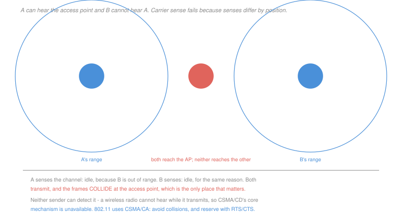

# Networking · Lesson 4.3: A taste of wireless and mobility

> ⏱ ~15 min · Module 4: The link layer, wireless and security · Builds on: [4.2 (multiple access and Ethernet)](04-02-multiple-access-ethernet-and-switching.md), [4.1 (error detection)](04-01-framing-and-error-detection.md) · Unlocks: 4.4 (security)

## Why this matters

Every mechanism in the course so far quietly assumed a wire. Wireless breaks four of those assumptions at once, and each break has a visible consequence.

A wire's error rate is negligible; a radio channel's is not. A wire is either connected or not; a radio link's quality varies continuously with distance, interference and someone walking past. Every station on a wire hears the same thing; on radio, **what you can hear depends on where you are standing**. And a transmitting station on a wire can listen at the same time; a radio cannot, because its own transmission is many orders of magnitude louder than anything it might receive.

That last one is the sharpest. **CSMA/CD's core mechanism is unavailable**, so the whole protocol had to be redesigned around avoiding collisions rather than detecting them.

## The idea

**Signal strength falls off with distance and is blocked by objects**, so a link is not binary. A station adapts by changing its modulation and coding rate — a distant station transmits more slowly and more robustly, a near one faster and more fragile. One consequence surprises people: **a single slow station reduces everyone's throughput**, because it occupies the channel for far longer per frame. That is a shared-medium effect with no wired analogue.

**The hidden terminal problem.** Stations A and B can both reach the access point and cannot hear each other. Both sense the channel idle — correctly, from where each stands — and both transmit. The frames collide at the access point, which is the only place that matters, and neither sender has any way to know.

Carrier sense fails here for a reason quite unlike the propagation-delay failure of [4.2](04-02-multiple-access-ethernet-and-switching.md). There, everybody heard the same channel and the information was merely *late*. Here **there is no such thing as "the channel state"** — it is a different quantity at every point in space, and sensing measures the wrong one.

**CSMA/CA** is the response, and the name states the change: avoidance, not detection.

- Sense idle for a fixed interval, then **wait a random backoff even when the channel is free**. On a wire, backoff is entered only after a collision; here it is unconditional, because collisions cannot be detected and must be made unlikely in advance.
- Every frame is **acknowledged**. With no collision detection, the acknowledgement is the only evidence a frame arrived, so the link layer implements the reliability that Ethernet leaves to the transport layer.
- The backoff counter **freezes** while the channel is busy and resumes when it clears, so a station that has already waited keeps its place.

**RTS and CTS** address the hidden terminal directly. A sender asks permission with a short request-to-send; the access point answers with a clear-to-send that **every station in its range hears**, including ones that cannot hear the sender. Those stations then stay quiet for the announced duration.

The reservation works because the CTS comes from the access point, which by construction is audible to everyone associated with it. It costs two extra frames per transmission, so it is used only above a configurable frame-size threshold — P3 works out where that threshold should sit.

## The formal version

> **Why a radio cannot detect collisions.** A transmitter's own signal at its own antenna is roughly $10^{10}$ times stronger than a received signal from across the room. Any receiver circuit listening during transmission is saturated by its own output and would detect nothing else.

This is a physical fact, not an engineering compromise, and everything about 802.11's design follows from it.

> **Time to send one frame under CSMA/CA:**
> $$T = \underbrace{\text{DIFS}}_{\text{idle wait}} + \underbrace{\overline{B}}_{\text{average backoff}} + \underbrace{T_{\text{data}}}_{\text{the frame}} + \underbrace{\text{SIFS}}_{\text{turnaround}} + \underbrace{T_{\text{ack}}}_{\text{acknowledgement}} + \text{overheads}$$

Everything except $T_{\text{data}}$ is pure overhead, and it does not shrink when the data rate rises — the interframe spaces and the slot time are fixed by the physics of switching a radio between transmitting and receiving. So the efficiency of 802.11 **falls as the nominal rate increases**, exactly as CSMA/CD's did in [4.2](04-02-multiple-access-ethernet-and-switching.md), and for a related reason: a fixed cost amortised over a frame that takes less and less time to send.

Example 1 computes it: a 54 Mb/s link delivering 30 Mb/s, which is why advertised wireless rates and observed throughput differ by roughly a factor of two, always.

**Mobility.** A device moving between access points must re-associate, and a device moving between *networks* faces a harder problem: its IP address identifies both **who it is** and **where it is** ([3.2](03-02-ip-addressing-subnets-cidr-and-nat.md)), so changing location changes the address and every open connection — identified by a four-tuple containing it ([2.1](02-01-transport-services-multiplexing-and-udp.md)) — breaks.

Solving it requires a level of indirection: a stable home address that forwards to a changing care-of address, which is what Mobile IP and the cellular core network each do in their own way. **Conflating identity with location is the underlying design flaw**, and it is the same one that makes multihoming hard in [3.4](03-04-routing-in-the-internet-ospf-and-bgp.md).

## Picture

## Worked examples

**Example 1 — where the advertised rate goes.** A station sends a 1,500-byte frame at 54 Mb/s. DIFS is 34 µs, SIFS 16 µs, the slot time 9 µs, the contention window 15 slots so the average backoff is 7.5 slots, each frame carries a 20 µs physical preamble, and the acknowledgement is 112 bits sent at the 6 Mb/s base rate.

$$T_{\text{data}} = \frac{1500\times 8}{54\times 10^6} = 222.2\ \mu\text{s}, \qquad T_{\text{ack}} = \frac{112}{6\times 10^6} = 18.7\ \mu\text{s}$$
$$\overline{B} = 7.5\times 9 = 67.5\ \mu\text{s}$$

$$T = 34 + 67.5 + 20 + 222.2 + 16 + 20 + 18.7 = 398.4\ \mu\text{s}$$

$$\text{efficiency} = \frac{222.2}{398.4} = 55.8\%, \qquad \text{throughput} = \frac{12{,}000\ \text{bits}}{398.4\ \mu\text{s}} = \boxed{30.1\ \text{Mb/s}}$$

Thirty megabits from a link sold as 54, with no interference, no competition and no errors. The 176 µs of overhead is fixed, so raising the nominal rate to 108 Mb/s would cut $T_{\text{data}}$ to 111 µs and give 42 Mb/s — **doubling the rate bought 40 percent**, and the returns keep diminishing.

**Example 2 — the hidden terminal, and what CTS fixes.** A and B are each 40 m from the access point on opposite sides, and 80 m apart, which is beyond their range.

*Without RTS/CTS.*

| step | A | B | outcome |
|---|---|---|---|
| 1 | senses the channel: **idle** | senses the channel: **idle** | both are correct about what they can hear |
| 2 | transmits | transmits | |
| 3 | | | frames **collide at the access point** |
| 4 | hears no acknowledgement, times out | hears no acknowledgement, times out | both retransmit after backoff |

Neither station ever learns why. Carrier sense gave each a true answer to the wrong question.

*With RTS/CTS.*

| step | A | B | outcome |
|---|---|---|---|
| 1 | sends RTS | | |
| 2 | | | AP replies **CTS**, which B hears |
| 3 | transmits its frame | defers for the announced duration | no collision |

The CTS is the whole mechanism, and note precisely why it works: **the access point is audible to every associated station by construction**, so a reservation it broadcasts reaches stations the original sender could never inform. The problem was that senders cannot hear each other; the solution routes the coordination through the one station everybody can hear.

## Watch out

- **You might think 802.11 uses CSMA/CD with extra steps.** It cannot detect collisions at all. Every difference — the mandatory acknowledgement, the unconditional backoff, RTS/CTS — exists to compensate for that one missing capability.
- **You might think the advertised rate is the throughput.** Expect a little over half of it in the best case, and less with competition. The gap is fixed overhead, not marketing exaggeration, and it widens as rates rise.
- **You might think a weak station only hurts itself.** It occupies the shared channel for far longer per frame, so it reduces the throughput available to everyone. On a shared medium, the slowest participant sets a cost that all the others pay.

## One-liner

> A radio cannot hear while it transmits and different stations hear different channels, so wireless replaces collision detection with mandatory backoff, per-frame acknowledgements, and a reservation broadcast by the one station everyone can hear.

## Problems

**P1 (🟢)** For each wired assumption, state whether it holds on a wireless link and name the wireless mechanism that compensates: (a) the bit error rate is negligible; (b) a station can detect a collision while transmitting; (c) every station hears the same channel state; (d) a link is either up or down; (e) the link layer need not acknowledge frames; (f) a station's address does not change while a connection is open.

**P2 (🟡)** A station sends a 500-byte frame at 24 Mb/s, with DIFS 34 µs, SIFS 16 µs, slot 9 µs, average backoff 7.5 slots, a 20 µs preamble on each of the data frame and the acknowledgement, and a 112-bit acknowledgement at 6 Mb/s. (a) Give the total time per frame and the efficiency. (b) Give the throughput in Mb/s. (c) Give the efficiency for a 1,500-byte frame at the same rate, and state the general relationship between frame size and efficiency here.

**P3 (🔴, optional)** Using the timings of Example 1, RTS takes 46.7 µs including its preamble and CTS takes 38.7 µs, each followed by a SIFS of 16 µs. (a) Give the total extra time RTS/CTS adds per frame. (b) A collision wastes the whole data transmission. Give the collision probability above which RTS/CTS is worth using, and show the comparison. (c) Repeat for a 200-byte frame at 54 Mb/s, and state the design rule this yields — then explain why the rule is expressed as a frame-size threshold rather than a probability.

Solutions

**P1**

| wired assumption | holds? | compensating mechanism |
|---|---|---|
| (a) negligible bit error rate | **no** | stronger error detection, link-layer retransmission, and rate adaptation to a more robust modulation |
| (b) collisions detectable while transmitting | **no** | CSMA/**CA** — unconditional random backoff plus mandatory acknowledgements, so a missing ACK stands in for a detected collision |
| (c) every station hears the same channel | **no** | RTS/CTS, routing the reservation through the access point that everyone can hear |
| (d) a link is up or down | **no** | rate adaptation, choosing modulation and coding to match the current signal quality |
| (e) no link-layer acknowledgement needed | **no** | every 802.11 data frame is individually acknowledged after a SIFS |
| (f) the address is stable for a connection's life | **no**, once the device moves between networks | a level of indirection — a stable home address forwarding to a changing care-of address |

Rows (b) and (c) are the two that reshape the protocol; (a), (d) and (e) change parameters and add retransmission; (f) is a layer-3 problem that wireless merely made common.

**P2** *(a) Total time and efficiency.*
$$T_{\text{data}} = \frac{500\times 8}{24\times 10^6} = 166.7\ \mu\text{s}, \qquad T_{\text{ack}} = \frac{112}{6\times 10^6} = 18.7\ \mu\text{s}$$
$$T = 34 + 67.5 + 20 + 166.7 + 16 + 20 + 18.7 = \boxed{342.9\ \mu\text{s}}$$
$$\text{efficiency} = \frac{166.7}{342.9} = \boxed{48.6\%}$$

*(b) Throughput.*
$$\frac{500\times 8\ \text{bits}}{342.9\times 10^{-6}\ \text{s}} = \boxed{11.7\ \text{Mb/s}}$$

Less than half of the nominal 24.

*(c) With a 1,500-byte frame at the same rate.*
$$T_{\text{data}} = \frac{12{,}000}{24\times 10^6} = 500\ \mu\text{s}, \qquad T = 34+67.5+20+500+16+20+18.7 = 676.2\ \mu\text{s}$$
$$\text{efficiency} = \frac{500}{676.2} = \boxed{73.9\%}$$

*The relationship.* The overhead is a **constant** 176.2 µs regardless of frame size, so
$$\text{efficiency} = \frac{T_{\text{data}}}{T_{\text{data}} + 176.2}$$
which rises monotonically toward 1 as frames grow. **Larger frames are always more efficient here**, and the constraint on making them larger is that a longer frame is more likely to be corrupted and costs more to retransmit — which is the same trade as [4.2](04-02-multiple-access-ethernet-and-switching.md) P2(c), reached from the opposite direction.

It is also why 802.11 gained **frame aggregation** in later versions: bundle many small frames into one transmission and pay the 176 µs once. That single change is responsible for a large share of the throughput improvement between 802.11g and 802.11n, more than the raw rate increase was.

**P3** *(a) The extra time.*
$$46.7 + 16 + 38.7 + 16 = \boxed{117.4\ \mu\text{s}}$$

*(b) The break-even collision probability.* Without RTS/CTS, a collision wastes the whole data transmission, $T_{\text{data}} = 222.2$ µs. With it, a collision wastes only the RTS, which is short, and the reservation prevents the hidden-terminal case entirely.

Compare the expected cost per frame:
$$\text{without: } p \times 222.2 \qquad \text{against} \qquad \text{with: } 117.4 \text{ always}$$
$$p\times 222.2 > 117.4 \;\Longrightarrow\; p > \frac{117.4}{222.2} = \boxed{0.528}$$

Above about a 53 percent collision probability, the reservation pays for itself — which is an extremely congested channel.

*(c) A 200-byte frame at 54 Mb/s.*
$$T_{\text{data}} = \frac{1600}{54\times 10^6} = 29.6\ \mu\text{s}$$
$$p > \frac{117.4}{29.6} = 3.96$$

**Impossible** — a probability cannot exceed 1. For a 200-byte frame, RTS/CTS can *never* pay for itself, because the handshake costs four times more than the transmission it protects.

*The design rule.* Setting $p = 1$, the worst case, and solving $T_{\text{data}} > 117.4$ µs gives
$$L > \frac{117.4\times 10^{-6}\times 54\times 10^6}{8} = \boxed{792 \text{ bytes}}$$

so **RTS/CTS is never worthwhile below about 800 bytes**, and above that it becomes worthwhile at a collision probability that falls as the frame grows.

*Why the threshold is expressed as a frame size rather than a probability:* because a station **cannot measure the collision probability**. It has no way to distinguish a collision from a weak signal, interference, or a hidden terminal — all it observes is a missing acknowledgement. The probability is exactly the quantity the hardware cannot know, and the frame size is a quantity it knows exactly, for free, before transmitting.

So the standard exposes `RTSThreshold` in bytes: a proxy for the real criterion, chosen because it is observable. That substitution — configure on the thing you can measure, not the thing you care about — is a recurring pattern in protocol design, and it is the same reasoning that makes TCP infer congestion from loss in [2.4](02-04-tcp-congestion-control.md) rather than from the queue occupancy it would actually like to know.

## Flashback

**From Lesson 4.1 (framing and error detection):** Data $D = 10011$, generator $G = 110$. (a) Compute the CRC and give the transmitted word. (b) Verify the receiver's division. (c) State whether this generator catches every single-bit error and every odd-weight error pattern, giving the reason for each from the divisibility criterion.

Solution

*(a) The CRC.* $G = 110$ has degree 2, so append two zeros: $1001100$.

| running value | XOR at position | result |
|---|---|---|
| $1001100$ | $110$ at 0 | $0101100$ |
| $0101100$ | $110$ at 1 | $0011100$ |
| $0011100$ | $110$ at 2 | $0000100$ |
| $0000100$ | $110$ at 4 | $0000010$ |

$$R = \boxed{10}, \qquad \text{transmit } \boxed{10011\,10}$$

*(b) The receiver's check.* Dividing $1001110$ by $110$:

| running value | XOR at | result |
|---|---|---|
| $1001110$ | 0 | $0101110$ |
| $0101110$ | 1 | $0011110$ |
| $0011110$ | 2 | $0000110$ |
| $0000110$ | 4 | $0000000$ |

$$\text{remainder} = \boxed{00}, \text{ accepted}$$

*(c) What this generator guarantees, and what it does not.* Factor it: $G(x) = x^2 + x = x(x+1)$.

**Single-bit errors: all detected.** The criterion from [4.1](04-01-framing-and-error-detection.md) is that $G$ has at least two terms, which $x^2+x$ does, so $G$ cannot divide a bare $x^i$. Concretely, $G \mid x^i$ would require $(x+1)\mid x^i$, and evaluating at $x=1$ gives $1 \ne 0$, so it never happens.

**Odd-weight errors: all detected.** $(x+1)$ is a factor of $G$, so every multiple of $G$ vanishes at $x=1$ while every odd-weight pattern evaluates to 1. This is the same argument as [4.1](04-01-framing-and-error-detection.md) P2(b) and it depends on nothing else.

**Double-bit errors: almost none detected**, and this is where the factor of $x$ does its damage. A double error is $E(x) = x^j(x^k+1)$, and $(x+1)$ divides $x^k+1$ for every $k \ge 1$. So $G = x(x+1)$ divides $E$ whenever $x \mid x^j$, which is to say whenever $j \ge 1$ — every double error except those involving the very last bit.

Counting on this 7-bit frame:
$$\boxed{15 \text{ of the } 21 \text{ double-bit patterns escape}}$$

Compare the *primitive* generator of the same degree, $x^2+x+1$. Its order is $2^2-1 = 3$, so by the rule of [4.1](04-01-framing-and-error-detection.md) only spacings that are multiples of 3 escape — 4 pairs at spacing 3 and 1 at spacing 6:
$$5 \text{ of } 21$$

Same degree, same two check bits, same gate count, and three times fewer missed double errors. The factor of $x$ contributes **nothing**: it cannot help detect anything, because every error pattern can be written with $x^j$ factored out. A generator with a zero constant term is wasting a degree, which is why every standardised polynomial has a constant term of 1.

## Connections

- **Backward:** CSMA/CA is [4.2](04-02-multiple-access-ethernet-and-switching.md)'s random access with detection removed, and the per-frame acknowledgement is the reliable-transfer machinery of [2.2](02-02-building-reliable-data-transfer.md) pushed all the way down to a single hop, because the loss rate at this layer is too high to leave to the endpoints.
- **Forward:** [4.4](04-04-network-security-tls-firewalls-attacks.md) takes up the consequence of broadcasting into a shared medium anyone can listen to, which makes encryption a requirement rather than an option.
- **Sideways:** the modulation and coding that rate adaptation selects between belong to [`communications`](../../communications/syllabus.md), which analyses the same channel in terms of signal-to-noise ratio and capacity. The identity-versus-location conflation in the mobility discussion is the same problem as multihoming in [3.4](03-04-routing-in-the-internet-ospf-and-bgp.md), and the fix is the same shape: a stable name and a level of indirection, which is what [1.3](01-03-dns-the-internets-directory.md)'s DNS already provides one layer up.
