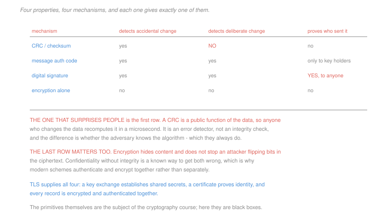

# Networking · Lesson 4.4: Network security — TLS, firewalls, and attacks

> ⏱ ~15 min · Module 4: The link layer, wireless and security · Builds on: [4.2 (switching)](04-02-multiple-access-ethernet-and-switching.md), [4.1 (error detection)](04-01-framing-and-error-detection.md) · Unlocks: this is the course's final lesson

## Why this matters

Every protocol in this course was designed by people who trusted each other. A switch believes the source address on every frame ([4.2](04-02-multiple-access-ethernet-and-switching.md)). A resolver believes the answer that arrives ([1.3](01-03-dns-the-internets-directory.md)). A router believes the prefixes its neighbour advertises ([3.4](03-04-routing-in-the-internet-ospf-and-bgp.md)). None of this was naive in 1983, when everyone on the network could be named.

The security layer is what was built afterwards, on the assumption that **the entire path is hostile**: every router may read and alter your traffic, every response may be forged, and the party you are talking to may not be who you think.

The organising idea of the lesson is that "secure" is not one property but four, that each mechanism supplies exactly one or two of them, and that the most common error in the field is assuming one of them implies another.

**Scope.** The cryptographic primitives here are black boxes. How AES, RSA and elliptic-curve key exchange actually work belongs to [`cryptography`](../../cryptography/syllabus.md), and the RSA construction specifically to [`number-theory` 5.4](../../number-theory/lessons/05-04-the-rsa-cryptosystem.md).

## The idea

Four properties, and they are independent:

> **Confidentiality** — nobody else can read it.
> **Integrity** — nobody can alter it undetected.
> **Authentication** — you know who you are talking to.
> **Availability** — the service responds at all.

Now match mechanisms to properties, and notice how little most of them supply:

| mechanism | detects accident | detects deliberate change | proves who sent it | hides content |
|---|---|---|---|---|
| CRC or checksum | yes | **no** | no | no |
| message authentication code | yes | yes | to holders of the shared key | no |
| digital signature | yes | yes | **to anyone** | no |
| encryption alone | no | **no** | no | yes |

The first row is the one worth staring at. A CRC is a **public function of the data**, so an attacker who alters the message recomputes it in a microsecond. It detects the channel being noisy and provides no defence whatsoever against the channel being adversarial. The difference between error detection and integrity is not strength — it is whether the adversary knows the algorithm, and the adversary always knows the algorithm.

The last row is nearly as important: encrypting a message does not stop someone flipping bits in the ciphertext. **Confidentiality without integrity is a known way to lose both**, which is why modern designs authenticate and encrypt as one operation rather than as two.

**TLS supplies all four for a connection.** In outline:

1. The client offers the cipher suites it supports and a key-exchange contribution.
2. The server replies with its choice, its own contribution, and a **certificate** — its public key, signed by an authority the client already trusts.
3. Both sides derive the same symmetric keys from the exchange, without ever sending them.
4. Every record thereafter is encrypted and authenticated together.

Read where each property comes from. **Confidentiality** from the symmetric keys. **Integrity** from the authentication tag on each record. **Authentication** from the certificate chain, and only from there — the encryption proves nothing about identity. And the key exchange is arranged so that the shared secret is never transmitted, so an eavesdropper who records the whole conversation cannot recover it later.

**Firewalls** filter traffic by rule. A **packet filter** examines addresses, ports and flags one packet at a time and holds no state. A **stateful filter** tracks connections, so it can allow inbound packets belonging to a connection you started while blocking new inbound connections. An **application gateway** parses the payload, which is more powerful and more expensive, and — as [3.2](03-02-ip-addressing-subnets-cidr-and-nat.md) noted — a protocol parser running on hostile input in the network path is its own risk.

## The formal version

**Three attacks, each exploiting a specific trust assumption:**

> **Spoofing.** IP has no mechanism to verify a source address ([3.1](03-01-forwarding-routing-and-the-ip-datagram.md)), so a sender may write any address it likes in the field. Every attack below rests on this.

> **Reflection and amplification.** Send a small request with a forged source address to a server that answers with a large response. The response goes to the victim, and the attacker's cost is the *request*, not the response.
> $$\text{amplification factor} = \frac{\text{response size}}{\text{request size}}$$

A DNS query of 60 bytes eliciting a 3,000-byte response is a factor of 50: an attacker with 1 Gb/s of upstream directs **50 Gb/s** at the victim, from thousands of legitimate servers that have done nothing wrong. The traffic is not forgeable garbage; it is real answers to real questions, from real resolvers, which is what makes it hard to filter.

> **DNS cache poisoning.** A resolver accepts the first response matching the query's identifier and port. An attacker who can guess or observe those, and answer before the real server does, installs a false record that persists for its whole TTL ([1.3](01-03-dns-the-internets-directory.md)).

> **Route hijacking.** An AS advertises a prefix it does not own, and BGP has no way to check ([3.4](03-04-routing-in-the-internet-ospf-and-bgp.md)). By longest-prefix matching ([3.2](03-02-ip-addressing-subnets-cidr-and-nat.md)), advertising a *more specific* prefix than the legitimate owner attracts the traffic worldwide.

Notice the common shape. **None of these breaks any cryptography.** Each exploits a protocol that was designed to answer "what is the route" or "what is the address" and was never designed to answer "and who says so". The retrofits — DNSSEC signing records, RPKI signing route origins, ingress filtering rejecting spoofed sources — are all the same fix: attach an identity to an assertion that previously had none, and they deploy slowly because they require everyone to participate before anyone is fully protected.

## Picture

## Worked examples

**Example 1 — what a CRC is not.** A frame carries a bank transfer and is protected by CRC-32.

*Against a noisy link.* A burst of corruption flips bits; the recomputed CRC does not match; the frame is discarded and the transport layer retransmits. The mechanism works exactly as designed.

*Against an attacker on the path.* The attacker changes the account number, recomputes CRC-32 over the modified frame — a public algorithm, a few microseconds of work — and forwards it. **The check passes.** Nothing anywhere in the stack notices.

Replacing the CRC with a message authentication code changes this completely: the tag is a function of the data *and a secret key*, so an attacker without the key cannot produce a valid one for altered data. Same amount of appended data, same kind of computation, and one is a defence and the other is not — the difference being entirely whether a secret is involved.

**Example 2 — pricing an amplification attack.** A DNS resolver answers a 60-byte query with a 3,000-byte response. An attacker controls a botnet with 1 Gb/s of aggregate upstream capacity.

$$\text{amplification} = \frac{3000}{60} = 50\times$$
$$\text{traffic at the victim} = 50 \times 1\ \text{Gb/s} = \boxed{50\ \text{Gb/s}}$$

$$\text{query rate needed} = \frac{10^9}{60\times 8} \approx 2.1\times 10^6 \text{ queries per second}$$

Spread across 100,000 open resolvers that is 21 queries per second each — utterly unremarkable traffic that no individual resolver would flag.

Three things make this hard to defend against, and all three follow from the arithmetic rather than from any cleverness:

- **The victim cannot block by source**, because the sources are thousands of legitimate resolvers whose answers are indistinguishable from ones it might actually want.
- **The resolvers cannot detect it**, because each sees a low rate of ordinary queries with a source address that looks fine.
- **Only the attacker's own network can stop it**, by refusing to forward packets whose source address does not belong to it — ingress filtering. That is a fix which costs the deployer something and benefits everyone else, which is exactly the class of fix that does not get deployed.

## Watch out

- **You might think encryption gives you integrity.** It does not. An attacker can flip bits in ciphertext and, depending on the mode, produce predictable changes in the plaintext. Authenticate as well as encrypt, together, always.
- **You might think a firewall makes a service safe.** It restricts *which* traffic arrives. A service reachable through the firewall is exactly as vulnerable as it was, and most compromises arrive through traffic the firewall was configured to permit.
- **You might think HTTPS means the site is trustworthy.** It means the connection is confidential and the certificate matches the name you typed. An attacker's own site has a perfectly valid certificate for the attacker's own name.

## One-liner

> Confidentiality, integrity, authentication and availability are four separate properties, a CRC provides none of them, encryption alone provides one, and the attacks that matter most exploit protocols that answer questions about routes and names without any way to say who is asserting the answer.

## Problems

**P1 (🟢)** For each pair, state which of the four properties the mechanism provides and which it does not: (a) a CRC on an Ethernet frame; (b) encrypting a file with a shared key and sending it in the clear over TCP; (c) a message authentication code appended to a plaintext message; (d) a firewall dropping all inbound connections; (e) a server's TLS certificate. Then name the single property that no cryptographic mechanism can provide on its own.

**P2 (🟡)** Put these TLS handshake events in order and name the property each supplies, or state that it supplies none: (i) both sides derive symmetric keys from the exchanged contributions; (ii) the client sends the cipher suites it supports; (iii) the server sends a certificate signed by an authority; (iv) the client verifies the certificate chain and the name it covers; (v) records are encrypted and authenticated. Then state which single step would have to fail for an attacker on the path to read the traffic.

**P3 (🔴, optional)** (a) An NTP server answers a 90-byte request with a 5,500-byte response. Give the amplification factor and the traffic an attacker with 200 Mb/s of upstream can direct at a victim. (b) Give the number of requests per second the attacker must send, and the per-server rate if spread across 20,000 servers. (c) Name the one defence that would eliminate this class of attack entirely, state where it must be deployed, and explain in two sentences why it has not been.

Solutions

**P1**

| | provides | does not provide |
|---|---|---|
| (a) a CRC on an Ethernet frame | detection of **accidental** corruption on one hop | integrity, authentication, confidentiality — it is a public function, recomputable by anyone |
| (b) encrypting a file, sending it in the clear over TCP | **confidentiality** | integrity — an attacker can alter the ciphertext; authentication — nothing says who encrypted it |
| (c) a MAC on a plaintext message | **integrity** and **authentication to holders of the key** | confidentiality — the message is still readable by anyone |
| (d) a firewall dropping inbound connections | a contribution to **availability**, by limiting exposure | confidentiality, integrity and authentication of anything it does allow through |
| (e) a TLS certificate | **authentication** of the server's identity | confidentiality and integrity, which come from the derived keys and the record tags, not the certificate |

Rows (b) and (c) together are the point: encryption and authentication are **orthogonal**, and you need both. A message can be unreadable and forgeable, or readable and unforgeable, and only combining them gives what people mean by "secure".

*The property no cryptography can provide alone:* **availability**. An attacker who floods the link, or who directs 50 Gb/s at it, has defeated the service without touching a single cipher. Availability is defended with capacity, filtering, rate limits and distribution — engineering and economics, not mathematics.

**P2** *The order.*

| # | event | property supplied |
|---|---|---|
| 1 | (ii) the client sends its supported cipher suites | **none** — negotiation, in the clear |
| 2 | (iii) the server sends a signed certificate | the *material* for authentication |
| 3 | (iv) the client verifies the chain and the name | **authentication** — this is where it is actually established |
| 4 | (i) both sides derive symmetric keys | the material for the other two |
| 5 | (v) records are encrypted and authenticated | **confidentiality** and **integrity** |

Steps 2 and 3 are separated deliberately. Receiving a certificate supplies nothing; a certificate is a claim, and the *verification* is where authentication happens. An implementation that skips step 4 — or accepts a certificate for the wrong name, or trusts an authority it should not — has an encrypted connection to whoever is on the path, and that failure has shipped in production software many times.

*Which step must fail for an attacker to read the traffic:* **step 4, the certificate verification.** An attacker on the path can freely intercept the connection and present their own certificate; the key exchange will then complete normally with them, and everything after is encrypted to the attacker. The only thing preventing this is the client refusing a certificate that is not signed by a trusted authority for the name it asked for.

Note what this implies: **the entire security of the connection rests on that one check** and on the trustworthiness of the authority list. The encryption is not what protects you from an interceptor; the identity check is, and the encryption merely protects what follows once identity is settled.

**P3** *(a) Amplification and delivered traffic.*
$$\text{amplification} = \frac{5{,}500}{90} = \boxed{61.1\times}$$
$$\text{traffic at the victim} = 61.1 \times 200\ \text{Mb/s} = \boxed{12.2\ \text{Gb/s}}$$

*(b) Request rate.*
$$\frac{200\times 10^6\ \text{bit/s}}{90\times 8\ \text{bit}} = \frac{2\times 10^8}{720} \approx \boxed{2.78\times 10^5 \text{ requests per second}}$$
$$\text{per server, across 20,000: } \frac{2.78\times 10^5}{2\times 10^4} = \boxed{\approx 14 \text{ requests per second each}}$$

Fourteen requests a second is nothing. No server would rate-limit it, log it, or notice it at all, and each is a well-formed request from an apparently ordinary client. **The attack is invisible everywhere except at the victim**, where it arrives as 12 Gb/s of legitimate responses from twenty thousand innocent servers.

*(c) The defence, where it goes, and why it has not happened.*

**Ingress filtering** — BCP 38. A network refuses to forward outbound packets whose **source address does not belong to it**. Since every reflection attack requires forging the victim's address as the source, a network that filters cannot be used to launch one.

*Where it must be deployed:* at **the edge network of the attacker**, that is, at every access provider, close to every originating host. Not at the victim, which cannot tell forged traffic from real; not at the reflectors, which see nothing wrong; only where the packet enters the Internet and the true owner of the source address is still known.

*Why it has not been deployed universally:*

The costs and benefits fall on different parties. A provider that implements filtering spends money on configuration and equipment, takes on the risk of breaking legitimate asymmetric routing for its own customers, and receives **no protection at all** — filtering your own outbound traffic protects everyone else from your customers and does nothing about attacks aimed at you. The benefit accrues entirely to third parties, and is zero until nearly everyone participates.

It is a collective-action problem of exactly the standard form, with no mechanism in the Internet's architecture to price it or enforce it. That is the same shape as the multihoming externality in [3.4](03-04-routing-in-the-internet-ospf-and-bgp.md) P3, and it is arguably the most important thing to understand about Internet security: **the hardest problems are not cryptographic, they are ones where the party who can fix it is not the party who suffers.**

## Flashback

**From Lesson 4.2 (multiple access, Ethernet and switching):** Hosts J, K and L are on switch ports 1, 2 and 3 with an empty table. Frames arrive: J → K, K → J, L → J, J → M where M is unknown. (a) Give the switch's action and table after each. (b) Give the total port deliveries, and compare with a hub. (c) State what the switch does if a frame arrives on port 3 with source address J, and the consequence.

Solution

*(a) The trace.*

| frame | learns | destination known? | action | table after |
|---|---|---|---|---|
| J → K | J on 1 | no | **flood** to 2, 3 | J:1 |
| K → J | K on 2 | yes, port 1 | **forward** to 1 | J:1, K:2 |
| L → J | L on 3 | yes, port 1 | **forward** to 1 | J:1, K:2, L:3 |
| J → M | already known | no | **flood** to 2, 3 | unchanged |

*(b) Port deliveries.*
$$2 + 1 + 1 + 2 = \boxed{6}$$

A hub repeats every frame to both other ports:
$$4\times 2 = \boxed{8}$$

The switch used 75 percent of the hub's traffic on this short trace, and the gap widens as the table fills — the two floods were a first-contact frame and a frame to an unknown destination, and neither recurs once the network settles.

*(c) A frame on port 3 with source address J.* The switch **updates its table**, moving J from port 1 to port 3, and forwards subsequent traffic for J out of port 3.

*The consequence:* **all of J's incoming traffic is now delivered to whoever sent that frame.** The switch has no way to distinguish this from J legitimately being moved to another port, because the learning rule is to believe the source address of every frame unconditionally — a MAC address is a claim, not a credential.

That is MAC spoofing, and it belongs to the same family as everything in this lesson: DNS cache poisoning, route hijacking and IP spoofing are all the same defect at different layers. **A protocol that accepts an assertion with no way to check who is asserting it can be lied to**, and the fix in every case is to attach an identity to the assertion — port security and 802.1X here, DNSSEC and RPKI elsewhere.

## Connections

- **Backward:** the trust assumptions exploited here were built in [3.1](03-01-forwarding-routing-and-the-ip-datagram.md) (an unverifiable source address), [1.3](01-03-dns-the-internets-directory.md) (a cached answer nobody signs), [3.4](03-04-routing-in-the-internet-ospf-and-bgp.md) (an unverifiable route advertisement) and [4.2](04-02-multiple-access-ethernet-and-switching.md) (an unverifiable source address again, one layer down).
- **Sideways:** the primitives are [`cryptography`](../../cryptography/syllabus.md)'s subject, with RSA specifically in [`number-theory` 5.4](../../number-theory/lessons/05-04-the-rsa-cryptosystem.md). The collective-action failure in P3 is the standard externality of [`grad-micro`](../../grad-micro/syllabus.md), and recognising it as an economics problem rather than a technical one is what explains why a fix specified in 2000 is still not universal.

## Closing the course

You began at the top of the stack, where a browser asks for a page, and ended at the bottom, where bits contend for a wire. Four things are worth carrying out of it.

**Count the round trips.** [1.1](01-01-packet-switching-and-layers.md) established that transmission depends on size, propagation on distance, and only the second is bounded by physics. Nearly every optimisation in the course is a way to cross the network fewer times: persistent connections and caching in [1.2](01-02-the-web-and-http.md), the DNS cache in [1.3](01-03-dns-the-internets-directory.md), the window in [2.2](02-02-building-reliable-data-transfer.md), a content delivery network moving the answer closer. When something is slow, count the round trips before buying bandwidth.

**Everything shared eventually needs a backoff rule.** TCP infers congestion from loss and halves ([2.4](02-04-tcp-congestion-control.md)). Ethernet infers contention from collisions and doubles its window ([4.2](04-02-multiple-access-ethernet-and-switching.md)). Wireless backs off before transmitting at all ([4.3](04-03-wireless-and-mobility.md)). None has a coordinator, none measures the load directly, and all three converge on something workable — which is the most remarkable engineering fact in the subject.

**Layering is what made it possible and where every seam shows.** The end-to-end principle kept the middle simple enough to scale, and every violation of it — a NAT rewriting ports ([3.2](03-02-ip-addressing-subnets-cidr-and-nat.md)), a firewall parsing payloads, a middlebox that refuses an unfamiliar transport ([2.1](02-01-transport-services-multiplexing-and-udp.md)) — bought something real and made the next change harder. That is why HTTP/3 is built on UDP: not because UDP is better, but because the middle is no longer simple and only UDP still passes through it unexamined.

**Ask who is asserting it.** The Internet's protocols answer "where is this name", "what is the route", "who sent this frame" — and none of them was built to answer "and how do you know". Every serious attack in [4.4](04-04-network-security-tls-firewalls-attacks.md) is that gap, and every retrofit is an identity attached to an assertion after the fact.

Where it leads: [`distributed-systems`](../../distributed-systems/syllabus.md) is the direct sequel and now unblocked. It takes the latency, loss and partition that this course treats as engineering realities and asks what can be *proven* about agreement in their presence — where the reliable transport of [2.2](02-02-building-reliable-data-transfer.md) becomes consensus and the caching of [1.3](01-03-dns-the-internets-directory.md) becomes replication and consistency. [`cryptography`](../../cryptography/syllabus.md) opens the primitives this lesson treated as black boxes, and [`databases`](../../databases/syllabus.md) builds the durable state that everything here was moving between machines.
