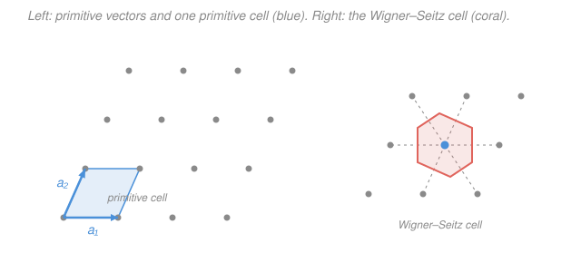

# Condensed Matter · Lesson 1.1: Lattices and bases — the Bravais idea

> ⏱ ~15 min · Module 1: Crystal structure and diffraction · Builds on: [`quantum-mechanics` syllabus](../../quantum-mechanics/syllabus.md), [`stat-mech` syllabus](../../stat-mech/syllabus.md) · Unlocks: [1.2 Common structures and Miller indices](01-02-structures-miller-indices.md)

## Why this matters

Everything in this course — how electrons form bands, how heat flows as phonons, why some solids are metals and others semiconductors — rests on one fact: the atoms sit on a *periodic* grid. Periodicity is the symmetry that makes the whole subject tractable. Bloch's theorem, the reciprocal lattice, X-ray diffraction, Brillouin zones: all of them are just consequences of the crystal looking the same after you slide it by the right amount. Before any of that, you need to say precisely what "the same after a slide" means and separate the two things a crystal is made of: a repeating *rule* and a repeated *thing*. Get that split clean now and the rest of Module 1 falls into place.

## The idea

Picture wallpaper. There's an abstract grid of positions where the pattern repeats — that's the **lattice** — and there's the little motif (a flower, a bird) stamped at each grid point — that's the **basis**. The grid tells you *where* to repeat; the motif tells you *what* to repeat. A crystal is exactly this:

$$\textbf{crystal} = \textbf{lattice} + \textbf{basis}.$$

The lattice is not made of atoms. It's an infinite set of mathematical *points*, chosen so that the view from every single point is identical — same neighbors, same distances, same directions, forever. That "looks identical from every point" is the entire definition of a **Bravais lattice**. The basis is the group of atoms you hang on each point. Table salt's grid is a simple cube-corner arrangement; its basis is one sodium plus one chlorine. Graphene's grid is a triangular lattice; its basis is two carbon atoms.

The payoff of the split: the honeycomb pattern of graphene *looks* like the fundamental object, but it is **not** a Bravais lattice — the two carbon sites have differently-oriented neighborhoods, so the view is not identical from every atom. The honeycomb is a triangular *lattice* carrying a *two-atom basis*. Confusing "the pattern of atoms" with "the lattice" is the single most common beginner error, and the lattice-plus-basis language is what keeps them apart.

## The formal version

**Bravais lattice.** A Bravais lattice is the infinite set of points with position vectors

$$\mathbf{R} = n_1\mathbf{a}_1 + n_2\mathbf{a}_2 + n_3\mathbf{a}_3, \qquad n_1, n_2, n_3 \in \mathbb{Z},$$

where the **primitive vectors** $\mathbf{a}_1, \mathbf{a}_2, \mathbf{a}_3$ are three non-coplanar vectors (in 2D, two non-collinear vectors) and $n_i$ range over all integers. *In words: start anywhere on the lattice, take any whole number of steps along each primitive vector, and you land on another lattice point — and the set of all such landing points looks the same seen from any one of them.* The two conditions — "integer combinations of $\mathbf{a}_i$" and "identical environment from every point" — are equivalent; either can serve as the definition.

**Basis.** The **basis** (or motif) is the set of atoms attached to each lattice point, specified by their positions $\mathbf{d}_1, \mathbf{d}_2, \dots, \mathbf{d}_s$ *relative to the point*. The actual atomic positions in the crystal are then all vectors $\mathbf{R} + \mathbf{d}_j$. *In words: place the same little cluster of $s$ atoms at every grid point.* A monatomic Bravais lattice is the special case $s = 1$ with $\mathbf{d}_1 = 0$.

**Primitive cell.** A **primitive cell** is any region that tiles all of space, without gaps or overlaps, under the lattice translations $\mathbf{R}$, and contains **exactly one** lattice point. The parallelepiped spanned by $\mathbf{a}_1, \mathbf{a}_2, \mathbf{a}_3$ is the standard example, with volume

$$V_{\text{cell}} = |\mathbf{a}_1 \cdot (\mathbf{a}_2 \times \mathbf{a}_3)|.$$

*In words: the smallest tile that, stamped at every lattice point, reproduces the whole crystal.* Every primitive cell has this same volume — it equals $1/n$ where $n$ is the density of lattice points — but its *shape* is not unique.

**Conventional cell.** A **conventional cell** is a larger, usually rectangular or cubic cell chosen to display the symmetry clearly, at the cost of containing more than one lattice point. Example: body-centered cubic (bcc) is drawn as a cube with a point at each corner plus one in the center (2 lattice points per cube), even though its primitive cell is a squat skewed parallelepiped of half the volume.

**Wigner–Seitz cell.** The **Wigner–Seitz cell** of a lattice point is the region of space closer to that point than to any other lattice point. You build it by drawing the perpendicular bisector plane of the line to each neighbor and keeping the innermost enclosed region. *In words: the point's "territory" — everywhere it is the nearest lattice point.* It is a primitive cell (one point, tiles space), it is unique, and it carries the full point-symmetry of the lattice. The identical construction in reciprocal space produces the **first Brillouin zone** ([1.3](01-03-reciprocal-lattice.md)) — so learn it well here.

**Coordination number.** The **coordination number** $Z$ is the number of nearest-neighbor lattice points. For a 2D square lattice $Z = 4$; simple cubic $Z = 6$; bcc $Z = 8$; fcc $Z = 12$. It measures how tightly packed the lattice is.

There are exactly **5 Bravais lattices in 2D** and **14 in 3D** — the complete list of distinct ways points can fill the plane or space with a self-identical environment. We meet the important 3D ones (sc, bcc, fcc, hcp) in [1.2](01-02-structures-miller-indices.md).

## Picture

The left panel is a genuine Bravais lattice: every grey point sees the identical arrangement. The blue parallelogram spanned by $\mathbf{a}_1$ and $\mathbf{a}_2$ is one primitive cell — it holds one point (four corners each shared among four cells: $4 \times \tfrac14 = 1$). The right panel bisects the lines to the six nearest neighbors; the coral hexagon they enclose is the Wigner–Seitz cell, a different-shaped but equal-area primitive cell centered on the point rather than hung off its corner.

## Worked examples

**Example 1 (lattice + basis — read a structure).** Consider the 2D honeycomb (graphene). Its carbon atoms sit at the vertices of a hexagonal tiling. Is that a Bravais lattice, and if not, what is it?

Look at two adjacent carbon atoms. One has its three nearest neighbors pointing *up-left, up-right, and down*; the other has them pointing *down-left, down-right, and up* — the neighborhoods are rotated 180° relative to each other. Two inequivalent environments means **not a Bravais lattice**. To fix it, group the atoms: take one of the two sublattices — say every "up-pointing" carbon — and *those* points **do** form a Bravais lattice, a **triangular** lattice with primitive vectors $\mathbf{a}_1 = a(1,0)$ and $\mathbf{a}_2 = a(\tfrac12, \tfrac{\sqrt3}{2})$. Attach a **two-atom basis** — the up-carbon at $\mathbf{d}_1 = 0$ and its partner down-carbon at $\mathbf{d}_2 = a(\tfrac12, \tfrac{1}{2\sqrt3})$ — and stamping this pair at every triangular-lattice point reproduces the honeycomb. So: honeycomb $=$ triangular lattice $+$ 2-atom basis. Coordination number *of the honeycomb pattern* (nearest carbons) is 3; coordination number *of the underlying triangular lattice* is 6. This distinction — pattern vs. lattice — is the whole lesson in one example.

**Example 2 (why you'd care — primitive-cell volume of fcc).** The face-centered cubic lattice, drawn conventionally as a cube of side $a$ with points at the 8 corners and 6 face centers, is the structure of copper, gold, aluminum, and (as a basis-decorated version) silicon and salt. How much space does one lattice point actually own? The conventional cube has volume $a^3$ but contains $8 \times \tfrac18 + 6 \times \tfrac12 = 1 + 3 = 4$ lattice points, so each owns $a^3/4$. Check against the primitive vectors: fcc's primitive vectors run from a corner to three adjacent face centers,

$$\mathbf{a}_1 = \tfrac{a}{2}(1,1,0), \quad \mathbf{a}_2 = \tfrac{a}{2}(0,1,1), \quad \mathbf{a}_3 = \tfrac{a}{2}(1,0,1).$$

The primitive volume is the scalar triple product:

$$V = |\mathbf{a}_1 \cdot (\mathbf{a}_2 \times \mathbf{a}_3)| = \left(\tfrac{a}{2}\right)^3 \left| \det\!\begin{pmatrix} 1 & 1 & 0 \\ 0 & 1 & 1 \\ 1 & 0 & 1 \end{pmatrix}\right| = \frac{a^3}{8}\,(2) = \frac{a^3}{4}.$$

The determinant is $1(1\cdot1 - 1\cdot0) - 1(0\cdot1 - 1\cdot1) + 0 = 1 + 1 = 2$. Both routes agree: the true repeating unit is a quarter of the conventional cube. That factor of 4 is why the conventional cell is worth its extra points — the cube shows the cubic symmetry that the skewed primitive parallelepiped hides.

## Watch out

- **You might think the lattice is made of atoms.** It isn't — the lattice is a set of geometric points, and the atoms live in the basis. A crystal with a one-atom basis happens to put an atom on every point, but the moment the basis has two or more atoms (honeycomb, diamond, NaCl), atomic positions and lattice points part ways. Always ask "is the environment identical from every point?" — if two sites differ, you've drawn the pattern, not the lattice.
- **You might think the conventional cubic cell is the primitive cell.** For bcc and fcc it is *not*: it contains 2 and 4 lattice points respectively. Its volume is 2× or 4× the primitive volume. Use the conventional cell to *see* symmetry, the primitive cell to *count* (points, electrons, states).
- **You might think there's one right primitive cell.** There are infinitely many shapes — any parallelogram enclosing one point works. They all share the same volume. The Wigner–Seitz cell is the canonical *symmetric* choice, not the *only* choice.

## One-liner

> A crystal is a lattice (an infinite grid of points identical from every point, $\mathbf{R} = \sum n_i \mathbf{a}_i$) decorated with a basis (the atoms hung on each point) — separate the "where to repeat" from the "what to repeat" and everything else follows.

## Problems

**P1 (🟢)** A 2D lattice has primitive vectors $\mathbf{a}_1 = (3, 0)$ and $\mathbf{a}_2 = (1, 2)$ (in ångström). Find the area of its primitive cell. How many lattice points does a $6 \times 6$ ångström rectangular region contain on average?

**P2 (🟡)** A student claims the set of points $(x, y)$ with $x, y$ integers *and* $x + y$ even (the "checkerboard" of black squares only) is not a Bravais lattice because you've thrown half the points away. Is it a Bravais lattice? If so, give primitive vectors and its coordination number.

**P3 (🔴, optional)** For the 3D bcc lattice — conventional cube of side $a$ with corner points plus one body-center point — the primitive vectors can be taken as $\mathbf{a}_1 = \tfrac{a}{2}(1,1,-1)$, $\mathbf{a}_2 = \tfrac{a}{2}(-1,1,1)$, $\mathbf{a}_3 = \tfrac{a}{2}(1,-1,1)$. Compute the primitive-cell volume and confirm it equals the conventional-cube volume divided by the number of lattice points the cube contains.

Solutions

**P1** In 2D the "volume" is the area, $|\mathbf{a}_1 \times \mathbf{a}_2| = |a_{1x} a_{2y} - a_{1y} a_{2x}|$:

$$A = |3 \cdot 2 - 0 \cdot 1| = 6\ \text{Å}^2.$$

The lattice-point density is one point per primitive cell, $n = 1/A = 1/6\ \text{Å}^{-2}$. A $6 \times 6 = 36\ \text{Å}^2$ region therefore holds on average $n \times 36 = 36/6 = 6$ points.

*Check.* Units: (Å)(Å) $=$ Ų for an area ✓. The shear component ($1$ in $\mathbf{a}_2$) slides the cell sideways but doesn't change its area — only the perpendicular spread ($a_{1x}=3$ times $a_{2y}=2$) sets it, matching the "base × height" of a parallelogram. ✓

**P2** It **is** a Bravais lattice. Keeping only $x+y$ even keeps a self-identical subset: from any kept point, the four nearest kept points sit diagonally at $(\pm1, \pm1)$, and this is true from *every* kept point — identical environments, so Bravais. Primitive vectors:

$$\mathbf{a}_1 = (1, 1), \qquad \mathbf{a}_2 = (1, -1),$$

since integer combinations $n_1(1,1) + n_2(1,-1) = (n_1+n_2,\, n_1-n_2)$ have coordinate sum $2n_1$, always even, and generate exactly the even-sum points. The four nearest neighbors are $(\pm1,\pm1)$, all at distance $\sqrt2$, so the **coordination number is 4**. (The student's error: throwing points away can still leave a Bravais lattice, as long as what remains is self-identical — here it's just a square lattice rotated 45° and scaled by $\sqrt2$.)

*Check.* Primitive-cell area $= |1\cdot(-1) - 1\cdot 1| = 2$, so density $1/2$ — exactly half the original unit-integer lattice's density of 1, consistent with keeping half the points. ✓

**P3** Scalar triple product with $\tfrac{a}{2}$ pulled out of each vector:

$$V = \left(\tfrac{a}{2}\right)^3 \left| \det\!\begin{pmatrix} 1 & 1 & -1 \\ -1 & 1 & 1 \\ 1 & -1 & 1 \end{pmatrix} \right|.$$

Expand along the first row:

$$\det = 1(1\cdot1 - 1\cdot(-1)) - 1((-1)\cdot1 - 1\cdot1) + (-1)((-1)\cdot(-1) - 1\cdot1) = 1(2) - 1(-2) + (-1)(0) = 4.$$

So $V = \tfrac{a^3}{8}\cdot 4 = \tfrac{a^3}{2}$. The conventional cube has volume $a^3$ and contains $8 \times \tfrac18 + 1 = 2$ lattice points (8 shared corners + 1 body center). Dividing, $a^3/2$ per point — matching the primitive volume exactly. ✓

*Check.* bcc's coordination number is 8 (the body center touches all 8 corners), and its primitive cell being half the cube is the 3D echo of the 2D fact that a centered lattice packs twice as densely as its conventional cell suggests. ✓

## Connections

- **Backward:** the "identical environment from every point" condition is translational symmetry — the same symmetry-under-a-transformation reasoning used for conserved quantities and good quantum numbers in [`quantum-mechanics`](../../quantum-mechanics/syllabus.md). Periodicity here is what will make the crystal momentum $\mathbf{k}$ a good quantum number in [3.3 Bloch's theorem](03-03-blochs-theorem.md).
- **Forward:** [1.2 Common structures and Miller indices](01-02-structures-miller-indices.md) fills in the specific 3D lattices (sc, bcc, fcc, hcp) and how to name lattice planes; [1.3 The reciprocal lattice](01-03-reciprocal-lattice.md) reuses the Wigner–Seitz construction verbatim to build the first Brillouin zone. Counting lattice points per cell (Example 2) is exactly the bookkeeping that later fixes electron and phonon state counts in [`stat-mech`](../../stat-mech/syllabus.md)-style density-of-states arguments ([3.6](03-06-bands-zones-dos.md)).
- **Sideways:** the same lattice-plus-basis decomposition is the geometric backbone of the periodic potential whose Fourier transform is the reciprocal lattice — the Fourier-analysis bridge developed in [1.3](01-03-reciprocal-lattice.md) and [`mathematical-methods-physics`](../../mathematical-methods-physics/syllabus.md).
