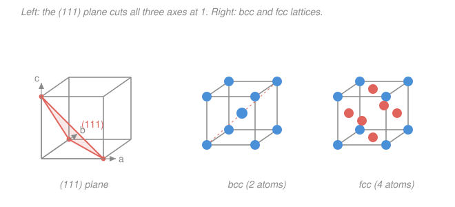

# Condensed Matter · Lesson 1.2: Common structures and Miller indices

> ⏱ ~15 min · Module 1: Crystal structure and diffraction · Builds on: [1.1 Lattices and bases: the Bravais idea](01-01-lattices-bases-bravais.md) · Unlocks: [1.3 The reciprocal lattice](01-03-reciprocal-lattice.md)

## Why this matters

Most metals, salts, and semiconductors you'll ever compute with crystallize in a handful of shapes: three cubic ones and a hexagonal one. Learn to spot them and you can read off density, coordination, and how tightly the atoms pack — before doing any physics. And to talk about *what a crystal does* — how it cleaves, how X-rays scatter off it (next lesson), how electrons move through it — you need a coordinate-free vocabulary for its planes and directions. That vocabulary is **Miller indices**, and it's the notation the rest of this course speaks in.

## The idea

Think of atoms as hard spheres you're trying to stack in a box. The dumbest stacking puts one at each corner of a cube — **simple cubic (sc)**. It wastes space: each atom touches only 6 neighbors and barely half the box is filled. Slip an extra atom into the *center* of every cube and you get **body-centered cubic (bcc)** — now each atom has 8 neighbors and packs tighter. Put atoms on the *faces* instead and you get **face-centered cubic (fcc)**, with 12 neighbors — the tightest a cube can do.

There's a competing way to be greedy about space that isn't cubic at all: lay down a triangular sheet of spheres (each surrounded by 6), then nest the next sheet into its dimples, and repeat. That's **close packing**, and it fills exactly 74% of space — the densest possible for equal spheres. The twist: there are two dimples to choose from on each layer, giving two close-packed crystals that tie for density. Stack `ABCABC…` and you've *rebuilt fcc* (viewed down its body diagonal); stack `ABAB…` and you get **hexagonal close-packed (hcp)**. Same packing fraction, different rhythm.

The second half of the lesson is bookkeeping: once atoms sit on a lattice, we need names for the flat sheets of atoms (**planes**) and the marching orders through them (**directions**). Miller indices give both.

## The formal version

### The four workhorse structures

The **coordination number** is how many nearest neighbors an atom has; the **packing fraction** is the volume of atoms divided by the volume of the cell (treating atoms as touching spheres of radius $r$, cell edge $a$).

| Structure | Bravais? | Atoms / conv. cell | Coordination | Packing fraction |
|---|---|---|---|---|
| sc | yes (simple cubic) | 1 | 6 | $\pi/6 \approx 0.52$ |
| bcc | yes | 2 | 8 | $\sqrt3\,\pi/8 \approx 0.68$ |
| fcc | yes | 4 | 12 | $\pi/(3\sqrt2) \approx 0.74$ |
| hcp | no (hex lattice + 2-atom basis) | 2 (primitive) | 12 | $\pi/(3\sqrt2) \approx 0.74$ |

*In words: bcc and fcc are true Bravais lattices — every atom sees an identical environment. hcp is not: it's a hexagonal lattice carrying a two-atom basis (recall the lattice-plus-basis split from [1.1](01-01-lattices-bases-bravais.md)), which is why it needs the extra description.*

**Counting atoms per cell.** A corner atom is shared among 8 cells (contributes $1/8$), a face atom between 2 ($1/2$), an edge atom among 4 ($1/4$), a body-center atom belongs wholly to its cell ($1$). So fcc gives $8\times\tfrac18 + 6\times\tfrac12 = 1 + 3 = 4$ atoms, and bcc gives $8\times\tfrac18 + 1 = 2$.

**Where atoms touch.** In each cubic cell the spheres kiss along a specific line, which fixes $a$ in terms of $r$:

- sc: along the **edge**, $a = 2r$.
- bcc: along the **body diagonal**, $a\sqrt3 = 4r$.
- fcc: along the **face diagonal**, $a\sqrt2 = 4r$.

Derive the fcc fraction: from $a\sqrt2 = 4r$ we get $a = 2\sqrt2\,r$, and with 4 atoms per cell

$$\text{PF}_{\text{fcc}} = \frac{4\cdot \tfrac43\pi r^3}{a^3} = \frac{\tfrac{16}{3}\pi r^3}{(2\sqrt2\,r)^3} = \frac{\tfrac{16}{3}\pi r^3}{16\sqrt2\,r^3} = \frac{\pi}{3\sqrt2} \approx 0.74.$$

*In words: pack 4 touching spheres into the fcc cube and they occupy 74% of it — the densest equal-sphere packing there is.*

### Miller indices: naming planes $(hkl)$

To label a lattice **plane**, follow a fixed recipe:

1. Find where the plane crosses the three axes, in units of the lattice constants — the **intercepts** $(x_1, x_2, x_3)$.
2. Take **reciprocals** $\left(\tfrac1{x_1}, \tfrac1{x_2}, \tfrac1{x_3}\right)$.
3. Clear fractions to the **smallest integers** $(h\,k\,l)$.

Write the result in round brackets: $(hkl)$. A plane *parallel* to an axis has intercept $\infty$, so its index is $0$. A **negative** intercept gets a bar: $\bar 1$ means $-1$. *In words: reciprocals turn "far away along an axis" into "small index", so a plane skimming an axis scores 0 there and a plane cutting close scores high.*

The reciprocal step isn't arbitrary bookkeeping — it's exactly what makes $(hkl)$ line up with the reciprocal lattice vector $\mathbf{G}_{hkl}$ you'll meet in [1.3](01-03-reciprocal-lattice.md).

### Directions $[uvw]$ and families

A **direction** is a vector, so you use the components directly (no reciprocals): reduce $\mathbf{R} = u\,\mathbf a + v\,\mathbf b + w\,\mathbf c$ to smallest integers and write $[uvw]$ in square brackets. Symmetry-equivalent sets get collective names:

- $\{hkl\}$ — all planes equivalent by the crystal's symmetry. In a cube, $\{100\}$ is the six faces $(100),(010),(001),(\bar100),(0\bar10),(00\bar1)$.
- $\langle uvw\rangle$ — all directions equivalent by symmetry, e.g. $\langle100\rangle$ = the three cube axes and their reverses.

**A cubic-only gift:** the plane $(hkl)$ is perpendicular to the direction $[hkl]$. So $[111]$ (the body diagonal) is normal to the $(111)$ plane. This fails in non-cubic crystals.

### Interplanar spacing (cubic)

Parallel copies of the $(hkl)$ plane are stacked a distance $d_{hkl}$ apart. For a **cubic** crystal of edge $a$,

$$\boxed{\,d_{hkl} = \frac{a}{\sqrt{h^2 + k^2 + l^2}}\,}$$

*In words: the more steeply a plane tilts (larger indices), the more closely spaced its stack.* This spacing is the length that goes straight into **Bragg's law** next lesson ([1.4](01-04-xray-diffraction-bragg.md)): X-rays diffract when $2d_{hkl}\sin\theta = n\lambda$.

## Picture

## Worked examples

**Example 1 (packing fraction of bcc).** Atoms touch along the body diagonal, so $a\sqrt3 = 4r \Rightarrow a = 4r/\sqrt3$. With 2 atoms per cell,

$$\text{PF}_{\text{bcc}} = \frac{2\cdot\tfrac43\pi r^3}{a^3} = \frac{\tfrac83\pi r^3}{(4r/\sqrt3)^3} = \frac{\tfrac83\pi r^3}{\tfrac{64}{3\sqrt3}r^3} = \frac{8\pi}{3}\cdot\frac{3\sqrt3}{64} = \frac{\sqrt3\,\pi}{8} \approx 0.68.$$

Denser than sc (0.52), looser than fcc (0.74) — bcc is the "good enough" compromise many metals (Fe, Na, W) settle into.

**Example 2 (Miller indices from intercepts).** A plane crosses the $a$-axis at $\tfrac12$, the $b$-axis at $1$, and runs **parallel** to the $c$-axis. Intercepts: $\left(\tfrac12, 1, \infty\right)$. Reciprocals: $\left(2, 1, 0\right)$ — already integers. Miller indices: $(210)$.

Now a direction: the vector from the origin to the far top corner of the cell is $\mathbf a + \mathbf b + \mathbf c$, components $(1,1,1)$, i.e. the direction $[111]$. In this cubic cell it's perpendicular to the $(111)$ plane drawn in the figure — the plane that clips the three unit intercepts.

## Watch out

- **You might apply reciprocals to directions too.** Don't — reciprocals are only for **planes** $(hkl)$. Directions $[uvw]$ use the raw components. Mixing them up is the single most common Miller-index error.
- **You might read $(210)$ as "two-hundred-ten".** Indices are read digit-by-digit: "two-one-zero". And a bar sits *over* the number, $\bar1$, meaning $-1$ — not a minus sign in front.
- **You might think hcp is just "another cubic".** It isn't a Bravais lattice at all — it needs a hexagonal lattice **plus a 2-atom basis**. fcc and hcp share the 0.74 packing fraction but differ in stacking (`ABCABC` vs `ABAB`); that difference changes real properties like slip systems and ductility.

## One-liner

> sc/bcc/fcc/hcp are just four ways to stack spheres (0.52 → 0.68 → 0.74 = 0.74); planes are named by reciprocal-intercepts $(hkl)$, directions by raw components $[uvw]$, and in a cube they align with spacing $d_{hkl} = a/\sqrt{h^2+k^2+l^2}$.

## Problems

**P1 (🟢)** A plane intercepts the crystal axes at $1$, $2$, and $2$ (in units of the lattice constants). Find its Miller indices $(hkl)$.

**P2 (🟢)** Copper is fcc with lattice constant $a = 3.61\ \text{Å}$. Compute the interplanar spacing $d_{hkl}$ for the $(111)$ and $(200)$ planes.

**P3 (🟡)** Sodium is bcc with $a = 4.29\ \text{Å}$. (a) How many atoms are in the conventional cubic cell? (b) Using the bcc touching condition, find the atomic radius $r$. (c) Confirm the packing fraction is $\approx 0.68$.

Solutions

**P1** Intercepts $(1, 2, 2)$. Reciprocals: $\left(1, \tfrac12, \tfrac12\right)$. Clear fractions by multiplying by 2: $(2\,1\,1)$. So the plane is $(211)$.

*Check.* All indices are integers with no common factor >1 (gcd of 2,1,1 is 1), so the form is fully reduced. ✓

**P2** Use $d_{hkl} = a/\sqrt{h^2+k^2+l^2}$ with $a = 3.61\ \text{Å}$.

$$d_{111} = \frac{3.61}{\sqrt{1+1+1}} = \frac{3.61}{\sqrt3} \approx 2.08\ \text{Å}, \qquad d_{200} = \frac{3.61}{\sqrt{4+0+0}} = \frac{3.61}{2} = 1.81\ \text{Å}.$$

*Check.* $(200)$ has larger indices than $(111)$ ($\sqrt4 > \sqrt3$), so its planes sit closer together — and indeed $1.81 < 2.08\ \text{Å}$. ✓ Both are a couple of ångströms, the right scale for atomic planes.

**P3**
(a) Corners contribute $8\times\tfrac18 = 1$, the body center contributes $1$: total **2 atoms**.

(b) Atoms touch along the body diagonal, length $a\sqrt3$, spanning $4r$: $a\sqrt3 = 4r \Rightarrow r = \dfrac{a\sqrt3}{4} = \dfrac{4.29\times1.732}{4} \approx 1.86\ \text{Å}.$

(c) 
$$\text{PF} = \frac{2\cdot\tfrac43\pi r^3}{a^3} = \frac{\tfrac83\pi (1.86)^3}{(4.29)^3} = \frac{\tfrac83\pi (6.43)}{78.9} \approx \frac{53.9}{78.9} \approx 0.68. \checkmark$$

*Check.* The number is independent of $a$ (it should be, since it's a ratio of geometric quantities that both scale as $a^3$), and equals the exact value $\sqrt3\,\pi/8 = 0.6802$. ✓

## Connections

- **Backward:** the lattice-plus-basis language from [1.1](01-01-lattices-bases-bravais.md) is what lets us say bcc/fcc are Bravais lattices while hcp is a hexagonal lattice with a 2-atom basis — same distinction, now applied to real crystals.
- **Forward:** $d_{hkl}$ is the length in **Bragg's law** ([1.4 X-ray diffraction](01-04-xray-diffraction-bragg.md)); the reciprocal-intercept recipe for $(hkl)$ foreshadows the **reciprocal lattice** vectors $\mathbf{G}_{hkl}$ of [1.3](01-03-reciprocal-lattice.md), which are literally perpendicular to these planes.
- **Sideways:** close packing and coordination number set up **bonding and mechanical properties** in [`materials-science`](../../materials-science/syllabus.md) — why fcc metals (Cu, Al) are ductile while the stacking of hcp (Zn, Mg) limits their slip planes.
