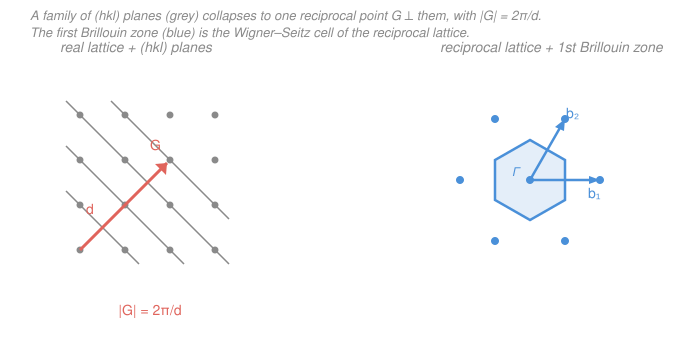

# Condensed Matter · Lesson 1.3: The reciprocal lattice

> ⏱ ~15 min · Module 1: Crystal structure and diffraction · Builds on: [1.2 Common structures and Miller indices](01-02-structures-miller-indices.md) · Unlocks: [1.4 X-ray diffraction and Bragg's law](01-04-xray-diffraction-bragg.md)

## Why this matters

Everything a crystal *does* — how it scatters X-rays, how electrons and phonons propagate through it, where band gaps open — is easiest to say not in the lattice you can see, but in a second lattice built from it: the **reciprocal lattice**. It is the crystal's natural home for anything wave-like, because a wave is labeled by a wavevector, and the reciprocal lattice is the set of special wavevectors that "fit" the crystal's periodicity. Diffraction spots (1.4), the first Brillouin zone where all of band structure and phonons live (Modules 2–3), and even the bookkeeping of Fourier analysis all reduce to points in this dual space. Build it once here and you'll use it for the rest of the course.

## The idea

A crystal is periodic: shift by any lattice vector $\mathbf{R}$ and you land on an identical copy. So *any* physical quantity that lives on the crystal — the electron density $n(\mathbf{r})$, the potential, the mass distribution — repeats with the same period: $n(\mathbf{r}+\mathbf{R}) = n(\mathbf{r})$.

Now recall the one fact Fourier analysis buys you: a periodic function is a sum of waves. But not *any* waves — only those whose wavelength divides the period exactly, so that they too repeat when you shift by $\mathbf{R}$. In one dimension with period $a$, the allowed wavenumbers are $k = 2\pi m/a$ for integer $m$. In three dimensions those allowed wavevectors form their own lattice. That lattice — the collection of wavevectors that share the crystal's periodicity — is the **reciprocal lattice**.

**In words: the reciprocal lattice is the set of wavevectors that "see" the crystal as perfectly repeating.** A wave $e^{i\mathbf{G}\cdot\mathbf{r}}$ with $\mathbf{G}$ in the reciprocal lattice looks *identical* after any lattice shift; a wave with any other wavevector does not. That single requirement generates the whole thing.

The payoff to hold onto: a family of parallel lattice *planes* in real space — infinitely many of them, one Miller label $(hkl)$ — corresponds to a *single point* $\mathbf{G}_{hkl}$ in reciprocal space, pointing perpendicular to those planes with length inversely proportional to their spacing. Planes become points. That collapse is what makes diffraction a dot-matching game.

## The formal version

**Defining condition.** Let $\mathbf{R} = n_1\mathbf{a}_1 + n_2\mathbf{a}_2 + n_3\mathbf{a}_3$ (integers $n_i$) be a general vector of the real (direct) lattice, built on primitive vectors $\mathbf{a}_i$. A vector $\mathbf{G}$ belongs to the **reciprocal lattice** if

$$e^{i\mathbf{G}\cdot\mathbf{R}} = 1 \quad\text{for every }\mathbf{R} \qquad\Longleftrightarrow\qquad \mathbf{G}\cdot\mathbf{R} = 2\pi \times(\text{integer}).$$

*In words: $\mathbf{G}$ is reciprocal-lattice if a plane wave $e^{i\mathbf{G}\cdot\mathbf{r}}$ comes back to itself under every lattice translation.* This is exactly the condition for $e^{i\mathbf{G}\cdot\mathbf{r}}$ to be a legal term in the Fourier series of any lattice-periodic function.

**Primitive reciprocal vectors.** The reciprocal lattice is spanned by $\mathbf{G} = m_1\mathbf{b}_1 + m_2\mathbf{b}_2 + m_3\mathbf{b}_3$ (integers $m_i$), where

$$\mathbf{b}_1 = 2\pi\,\frac{\mathbf{a}_2\times\mathbf{a}_3}{\mathbf{a}_1\cdot(\mathbf{a}_2\times\mathbf{a}_3)}, \qquad \mathbf{b}_2 = 2\pi\,\frac{\mathbf{a}_3\times\mathbf{a}_1}{V}, \qquad \mathbf{b}_3 = 2\pi\,\frac{\mathbf{a}_1\times\mathbf{a}_2}{V},$$

with $V = \mathbf{a}_1\cdot(\mathbf{a}_2\times\mathbf{a}_3)$ the volume of the real primitive cell. The defining property, checkable in one line, is

$$\boxed{\;\mathbf{b}_i\cdot\mathbf{a}_j = 2\pi\,\delta_{ij}\;}$$

where $\delta_{ij}$ is the Kronecker delta ($1$ if $i=j$, else $0$). *In words: each $\mathbf{b}_i$ is built to be perpendicular to the two $\mathbf{a}_j$ it doesn't match, and scaled so its dot product with its own partner is exactly $2\pi$.* From this, $\mathbf{G}\cdot\mathbf{R} = \sum_{i,j} m_i n_j\,(\mathbf{b}_i\cdot\mathbf{a}_j) = 2\pi\sum_i m_i n_i = 2\pi\times\text{integer}$ automatically — the box guarantees the defining condition.

**Some reciprocals to memorize.**

- Simple cubic (side $a$) → simple cubic, side $2\pi/a$.
- FCC → BCC (conventional side $4\pi/a$), and **BCC → FCC**. The two cubic centered lattices are each other's reciprocals.

**The key geometric fact.** Take the reciprocal vector $\mathbf{G}_{hkl} = h\mathbf{b}_1 + k\mathbf{b}_2 + l\mathbf{b}_3$ built from Miller indices $(hkl)$. Then

$$\mathbf{G}_{hkl}\ \perp\ \text{the }(hkl)\text{ planes}, \qquad |\mathbf{G}_{hkl}| = \frac{2\pi}{d_{hkl}},$$

where $d_{hkl}$ is the interplanar spacing from [1.2](01-02-structures-miller-indices.md). *In words: the reciprocal vector for a set of planes points straight across them, and the more tightly packed the planes (small $d$), the longer the vector.* So an entire family of planes ↔ one reciprocal point — the duality the rest of Module 1 runs on.

**The first Brillouin zone.** Apply the Wigner–Seitz construction from [1.1](01-01-lattices-bases-bravais.md) — the set of points closer to a chosen lattice point than to any other — but in *reciprocal* space. The resulting primitive cell of the reciprocal lattice is the **first Brillouin zone (BZ)**. *In words: the first BZ is the "home cell" for wavevectors $\mathbf{k}$* — every distinct wave state in the crystal can be labeled by a $\mathbf{k}$ inside it, and it is where all of band structure (Module 3) and phonon dispersion (Module 2) are drawn.

## Picture

## Worked examples

**Example 1 (build $\mathbf{b}_i$ and check the box — orthorhombic lattice).** Take a simple orthorhombic lattice with $\mathbf{a}_1 = a\,\hat{\mathbf{x}}$, $\mathbf{a}_2 = b\,\hat{\mathbf{y}}$, $\mathbf{a}_3 = c\,\hat{\mathbf{z}}$. The cell volume is $V = \mathbf{a}_1\cdot(\mathbf{a}_2\times\mathbf{a}_3) = abc$. Then

$$\mathbf{a}_2\times\mathbf{a}_3 = bc\,(\hat{\mathbf{y}}\times\hat{\mathbf{z}}) = bc\,\hat{\mathbf{x}} \;\Longrightarrow\; \mathbf{b}_1 = 2\pi\,\frac{bc\,\hat{\mathbf{x}}}{abc} = \frac{2\pi}{a}\,\hat{\mathbf{x}},$$

and cyclically $\mathbf{b}_2 = \dfrac{2\pi}{b}\,\hat{\mathbf{y}}$, $\mathbf{b}_3 = \dfrac{2\pi}{c}\,\hat{\mathbf{z}}$. Check the box: $\mathbf{b}_1\cdot\mathbf{a}_1 = \frac{2\pi}{a}\cdot a = 2\pi$ ✓, while $\mathbf{b}_1\cdot\mathbf{a}_2 = \frac{2\pi}{a}\,\hat{\mathbf{x}}\cdot b\,\hat{\mathbf{y}} = 0$ ✓. The reciprocal of an orthorhombic lattice is another orthorhombic lattice with the sides inverted (and a $2\pi$). Setting $a=b=c$ recovers "simple cubic → simple cubic, side $2\pi/a$."

**Example 2 (planes ↔ points, and $|\mathbf{G}| = 2\pi/d$).** Same lattice. The $(hkl)$ reciprocal vector is

$$\mathbf{G}_{hkl} = h\mathbf{b}_1 + k\mathbf{b}_2 + l\mathbf{b}_3 = 2\pi\left(\frac{h}{a}\,\hat{\mathbf{x}} + \frac{k}{b}\,\hat{\mathbf{y}} + \frac{l}{c}\,\hat{\mathbf{z}}\right).$$

Its length is $|\mathbf{G}_{hkl}| = 2\pi\sqrt{(h/a)^2 + (k/b)^2 + (l/c)^2}$. Compare to the orthorhombic interplanar spacing from [1.2](01-02-structures-miller-indices.md),

$$\frac{1}{d_{hkl}^2} = \frac{h^2}{a^2} + \frac{k^2}{b^2} + \frac{l^2}{c^2} \;\Longrightarrow\; |\mathbf{G}_{hkl}| = \frac{2\pi}{d_{hkl}}. \checkmark$$

For a cubic crystal ($a=b=c$) the $(110)$ planes give $|\mathbf{G}_{110}| = 2\pi\sqrt{2}/a$ and $d_{110} = a/\sqrt2$, so $|\mathbf{G}_{110}|\,d_{110} = 2\pi$ — one reciprocal point stands in for the whole infinite stack of $(110)$ sheets. That is precisely the substitution that turns 1.4's diffraction condition into "hit a reciprocal-lattice point."

## Watch out

- **You might think the reciprocal lattice is just "$1/a$" scaling.** It isn't a pure rescale unless the axes are orthogonal. Each $\mathbf{b}_i$ is defined by *cross products* — it points perpendicular to the other two real axes, so for a skewed (oblique/triclinic) cell the reciprocal lattice is rotated and sheared, not merely shrunk. Use the $\mathbf{a}_2\times\mathbf{a}_3$ formula, never eyeball it.
- **You might drop the $2\pi$.** Two conventions coexist: physicists put $2\pi$ in $\mathbf{b}_i$ (so $\mathbf{b}_i\cdot\mathbf{a}_j = 2\pi\delta_{ij}$ and $|\mathbf{G}| = 2\pi/d$); crystallographers omit it (so $\mathbf{b}_i\cdot\mathbf{a}_j = \delta_{ij}$ and $|\mathbf{G}| = 1/d$). This course uses the $2\pi$ convention throughout — matching wavevectors $k = 2\pi/\lambda$. Mixing them mangles every diffraction formula.
- **You might expect FCC's reciprocal to be FCC.** It's BCC (and vice versa). The reciprocal of a centered lattice is a *different* centered lattice — a fact worth carrying into 1.5, where it controls which diffraction peaks survive.

## One-liner

> The reciprocal lattice is the set of wavevectors $\mathbf{G}$ with $e^{i\mathbf{G}\cdot\mathbf{R}}=1$ for all $\mathbf{R}$, built from $\mathbf{b}_i\cdot\mathbf{a}_j = 2\pi\delta_{ij}$; it turns each family of $(hkl)$ planes into one point $\mathbf{G}_{hkl}\perp$ the planes with $|\mathbf{G}_{hkl}| = 2\pi/d_{hkl}$.

## Problems

**P1 (🟢)** A two-dimensional rectangular lattice has $\mathbf{a}_1 = 4\,\hat{\mathbf{x}}$ Å and $\mathbf{a}_2 = 2\,\hat{\mathbf{y}}$ Å. Find the reciprocal primitive vectors $\mathbf{b}_1,\mathbf{b}_2$ (use the 2D rule $\mathbf{b}_i\cdot\mathbf{a}_j = 2\pi\delta_{ij}$), and verify $\mathbf{b}_1\cdot\mathbf{a}_2 = 0$. Which real-space direction has the *shorter* reciprocal vector, and why does that make sense?

**P2 (🟡)** For a simple cubic lattice of side $a$, use $|\mathbf{G}_{hkl}| = 2\pi/d_{hkl}$ to find the spacing $d_{210}$ of the $(210)$ planes, and give the direction of $\mathbf{G}_{210}$. Confirm your $d$ against the cubic formula $d_{hkl} = a/\sqrt{h^2+k^2+l^2}$.

**P3 (🔴, optional)** Show that the reciprocal of the BCC lattice is the FCC lattice. Use the BCC primitive vectors $\mathbf{a}_1 = \tfrac{a}{2}(\hat{\mathbf{y}}+\hat{\mathbf{z}}-\hat{\mathbf{x}})$, $\mathbf{a}_2 = \tfrac{a}{2}(\hat{\mathbf{z}}+\hat{\mathbf{x}}-\hat{\mathbf{y}})$, $\mathbf{a}_3 = \tfrac{a}{2}(\hat{\mathbf{x}}+\hat{\mathbf{y}}-\hat{\mathbf{z}})$ and compute the $\mathbf{b}_i$; identify the result as FCC by its primitive vectors.

Solutions

**P1** With orthogonal axes the 2D reciprocal vectors are parallel to the real ones, scaled by $2\pi/(\text{length})$:

$$\mathbf{b}_1 = \frac{2\pi}{a_1}\,\hat{\mathbf{x}} = \frac{2\pi}{4}\,\hat{\mathbf{x}} = \frac{\pi}{2}\,\hat{\mathbf{x}}\ \text{Å}^{-1}, \qquad \mathbf{b}_2 = \frac{2\pi}{a_2}\,\hat{\mathbf{y}} = \frac{2\pi}{2}\,\hat{\mathbf{y}} = \pi\,\hat{\mathbf{y}}\ \text{Å}^{-1}.$$

Check: $\mathbf{b}_1\cdot\mathbf{a}_2 = \frac{\pi}{2}\,\hat{\mathbf{x}}\cdot 2\,\hat{\mathbf{y}} = 0$ ✓, and $\mathbf{b}_1\cdot\mathbf{a}_1 = \frac{\pi}{2}\cdot 4 = 2\pi$ ✓. The **$\hat{\mathbf{x}}$** direction, which is *longer* in real space ($4$ Å), has the *shorter* reciprocal vector ($\pi/2$ vs $\pi$). That's the defining inverse relationship: wide real spacing → tightly spaced (short-vector) reciprocal axis.

*Check.* Units are inverse length (Å$^{-1}$), correct for a wavevector, and the longer real axis maps to the shorter reciprocal axis as the $2\pi/\ell$ rule demands. ✓

**P2** By the key fact, $d_{210} = 2\pi/|\mathbf{G}_{210}|$ with $\mathbf{G}_{210} = \frac{2\pi}{a}(2\hat{\mathbf{x}} + 1\hat{\mathbf{y}} + 0\hat{\mathbf{z}})$ for simple cubic. So

$$|\mathbf{G}_{210}| = \frac{2\pi}{a}\sqrt{2^2 + 1^2 + 0^2} = \frac{2\pi\sqrt5}{a} \;\Longrightarrow\; d_{210} = \frac{2\pi}{|\mathbf{G}_{210}|} = \frac{a}{\sqrt5} \approx 0.447\,a.$$

Direction of $\mathbf{G}_{210}$: along $2\hat{\mathbf{x}}+\hat{\mathbf{y}}$, i.e. the $[210]$ direction — perpendicular to the $(210)$ planes, as it must be. Cubic-formula check: $d_{210} = a/\sqrt{2^2+1^2+0^2} = a/\sqrt5$ ✓.

*Check.* $d < a$ makes sense — higher-index planes are more finely spaced than the $(100)$ planes ($d_{100}=a$). Units of length. ✓

**P3** Write the vectors in components: $\mathbf{a}_1 = \frac{a}{2}(-1,1,1)$, $\mathbf{a}_2 = \frac{a}{2}(1,-1,1)$, $\mathbf{a}_3 = \frac{a}{2}(1,1,-1)$. The needed cross product is

$$\mathbf{a}_2\times\mathbf{a}_3 = \frac{a^2}{4}\,(1,-1,1)\times(1,1,-1) = \frac{a^2}{4}\,(0,\,2,\,2) = \frac{a^2}{2}\,(\hat{\mathbf{y}}+\hat{\mathbf{z}}),$$

taking the determinant component by component: $x$-comp $=(-1)(-1)-(1)(1)=0$, $y$-comp $=(1)(1)-(1)(-1)=2$, $z$-comp $=(1)(1)-(-1)(1)=2$. The primitive-cell volume is $V = \mathbf{a}_1\cdot(\mathbf{a}_2\times\mathbf{a}_3) = \frac{a}{2}(-1,1,1)\cdot\frac{a^2}{2}(0,1,1) = \frac{a^3}{4}(0+1+1) = \frac{a^3}{2}$ (half the conventional cube — one lattice point per primitive cell). Then

$$\mathbf{b}_1 = 2\pi\,\frac{\mathbf{a}_2\times\mathbf{a}_3}{V} = 2\pi\,\frac{\frac{a^2}{2}(\hat{\mathbf{y}}+\hat{\mathbf{z}})}{a^3/2} = \frac{2\pi}{a}\,(\hat{\mathbf{y}}+\hat{\mathbf{z}}),$$

and cyclically $\mathbf{b}_2 = \frac{2\pi}{a}(\hat{\mathbf{z}}+\hat{\mathbf{x}})$, $\mathbf{b}_3 = \frac{2\pi}{a}(\hat{\mathbf{x}}+\hat{\mathbf{y}})$. These are exactly the **FCC** primitive vectors (of the form $\frac{A}{2}(\hat{\mathbf{y}}+\hat{\mathbf{z}})$ etc.) with cube edge $A = 4\pi/a$. So the reciprocal of BCC is FCC. ∎

*Check.* Verify the box on one pair: $\mathbf{b}_1\cdot\mathbf{a}_1 = \frac{2\pi}{a}(\hat{\mathbf{y}}+\hat{\mathbf{z}})\cdot\frac{a}{2}(\hat{\mathbf{y}}+\hat{\mathbf{z}}-\hat{\mathbf{x}}) = \frac{2\pi}{a}\cdot\frac{a}{2}(1+1-0) = 2\pi$ ✓, and $\mathbf{b}_1\cdot\mathbf{a}_2 = \frac{2\pi}{a}\cdot\frac{a}{2}(\hat{\mathbf{y}}+\hat{\mathbf{z}})\cdot(\hat{\mathbf{z}}+\hat{\mathbf{x}}-\hat{\mathbf{y}}) = \pi(-1+1) = 0$ ✓. The reciprocity is symmetric, so FCC → BCC follows the same way.

## Flashback

**From Lesson 1.2 (Common structures and Miller indices):** In a cubic crystal with lattice constant $a = 3.6$ Å, compute the interplanar spacing $d_{111}$ of the $(111)$ planes, and state the direction perpendicular to those planes.

Solution

For a cubic lattice, $d_{hkl} = a/\sqrt{h^2+k^2+l^2}$. With $(hkl)=(111)$:

$$d_{111} = \frac{a}{\sqrt{1^2+1^2+1^2}} = \frac{3.6}{\sqrt3} \approx 2.08\ \text{Å}.$$

The normal to the $(111)$ planes is the $[111]$ direction — the cube's body diagonal. (Preview of this lesson: that normal is exactly the direction of $\mathbf{G}_{111}$, and indeed $|\mathbf{G}_{111}| = 2\pi/d_{111} \approx 3.02\ \text{Å}^{-1}$.)

*Check.* $d_{111} < d_{100} = 3.6$ Å, correct since higher-index planes pack more tightly; units of length. ✓

## Connections

- **Backward:** the interplanar spacing $d_{hkl}$ and Miller indices come straight from [1.2](01-02-structures-miller-indices.md), and the first Brillouin zone reuses the Wigner–Seitz construction from [1.1](01-01-lattices-bases-bravais.md) — only now applied in reciprocal space.
- **Forward:** [1.4 X-ray diffraction and Bragg's law](01-04-xray-diffraction-bragg.md) recasts constructive interference as the **Laue condition** $\Delta\mathbf{k} = \mathbf{G}$ — scattering happens exactly when the momentum transfer lands on a reciprocal-lattice point. The first Brillouin zone becomes the arena for phonon dispersion (Module 2) and electron bands (Module 3), where every wavevector $\mathbf{k}$ is folded back into this cell.
- **Sideways (Fourier analysis):** the reciprocal lattice *is* the support of the Fourier transform of the periodic crystal — the discrete set of wavevectors on which a lattice-periodic function has nonzero Fourier components. This is the same discrete-spectrum-of-a-periodic-function idea from [`mathematical-methods-physics`](../../mathematical-methods-physics/syllabus.md) and [`fourier-analysis`](../../fourier-analysis/syllabus.md), lifted to three dimensions.
