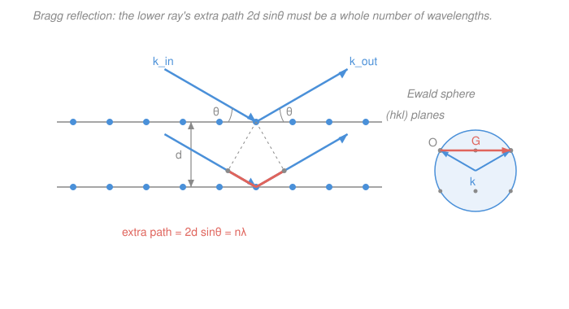

# Condensed Matter · Lesson 1.4: X-ray diffraction and Bragg's law

> ⏱ ~15 min · Module 1: Crystal structure and diffraction · Builds on: [1.3 The reciprocal lattice](01-03-reciprocal-lattice.md), [1.2 Common structures and Miller indices](01-02-structures-miller-indices.md) · Unlocks: [1.5 The structure factor: what diffraction can't see](01-05-structure-factor.md)

## Why this matters

Everything you built in the last three lessons — Bravais lattices, Miller planes, the reciprocal lattice — was theory about an arrangement of atoms you cannot see with your eyes. **X-ray diffraction is how we actually read it off.** Shine X-rays on a crystal and, at a handful of very sharp angles, an intense beam flashes out; everywhere else, nothing. The pattern of those angles is a direct fingerprint of the lattice, and decoding it is how essentially every crystal structure — from table salt to DNA to a new superconductor — has been solved. This lesson gives you the two equivalent rules for *where* the flashes appear (Bragg and Laue) and the geometric picture (Ewald) that ties them to the reciprocal lattice you just learned.

## The idea

Why X-rays specifically? Because their wavelength $\lambda \sim 1$ Å is comparable to the spacing between atoms. A wave only "sees" structure on the scale of its own wavelength — visible light ($\lambda \sim 5000$ Å) washes right over the atomic grid, but an X-ray is fine enough to resolve it. The X-ray's oscillating electric field shakes the electrons of each atom, and every atom re-radiates a tiny spherical wavelet. You now have millions of wavelets, one per atom, all interfering.

Here's the key intuition, due to Bragg: think of the atoms as lying on **parallel planes** (a family of Miller planes, spacing $d$). Each plane acts like a faint mirror. Waves reflecting off *one* plane always add up in the mirror direction. The question is whether the reflection off the *next* plane down arrives in step. That lower reflection travels a little farther — an extra distance you can read straight off the geometry — and only when that extra path is a **whole number of wavelengths** do all the planes reinforce into a sharp beam. Off by half a wavelength and they cancel. That single condition is Bragg's law, and it's why the flashes are so sharp: reinforcement is knife-edge selective in angle.

## The formal version

**Bragg's law.** Let a family of lattice planes have spacing $d$, and let the X-rays strike at a glancing angle $\theta$ measured *from the plane* (not from the normal). The ray bouncing off the plane below travels an extra path length $2d\sin\theta$ (see the Picture). Constructive interference requires this to be an integer number of wavelengths:

$$\boxed{\,2d\sin\theta = n\lambda\,}, \qquad n = 1, 2, 3, \dots$$

*In words: sharp beams come out only at the special angles where reflections from successive planes march in step — the extra path between adjacent planes is a whole number of wavelengths.* Here $n$ is the **order** of the reflection, $\lambda$ the X-ray wavelength, and $\theta$ the **Bragg angle**. Note the beam is deflected by $2\theta$ from its original direction (in by $\theta$, out by $\theta$), so a detector sits at the **scattering angle** $2\theta$.

One immediate consequence: since $\sin\theta \le 1$, we need $n\lambda \le 2d$. **Only wavelengths $\lambda \le 2d$ can diffract at all** — you cannot see structure finer than half your wavelength.

**The Laue condition.** Bragg's plane-mirror story is intuitive but slightly hides the lattice. The equivalent, more fundamental statement lives in reciprocal space. Write the incoming X-ray as a wavevector $\mathbf{k}_{\text{in}}$ (with $|\mathbf{k}_{\text{in}}| = k = 2\pi/\lambda$) and the outgoing one as $\mathbf{k}_{\text{out}}$. Scattering off electrons is **elastic** — no energy lost — so the wave keeps its wavelength: $|\mathbf{k}_{\text{out}}| = |\mathbf{k}_{\text{in}}| = k$. Define the **scattering vector** $\Delta\mathbf{k} = \mathbf{k}_{\text{out}} - \mathbf{k}_{\text{in}}$. The Laue condition for a diffraction peak is

$$\Delta\mathbf{k} = \mathbf{G},$$

where $\mathbf{G}$ is any **reciprocal lattice vector** from [1.3](01-03-reciprocal-lattice.md). *In words: a peak occurs exactly when the change in the X-ray's wavevector equals a reciprocal-lattice vector* — the lattice can only kick the wave by an amount the reciprocal lattice allows.

**Bragg $\Longleftrightarrow$ Laue.** These are the same statement. Recall from [1.3](01-03-reciprocal-lattice.md) that the reciprocal vector perpendicular to the $(hkl)$ planes has length $|\mathbf{G}| = 2\pi/d$. Geometrically, since $\mathbf{k}_{\text{in}}$ and $\mathbf{k}_{\text{out}}$ have equal length $k$ and are separated by the scattering angle $2\theta$, the length of their difference is

$$\Delta k = 2k\sin\theta.$$

Set $\Delta k = |\mathbf{G}|$:

$$2k\sin\theta = \frac{2\pi}{d} \;\Longrightarrow\; 2\cdot\frac{2\pi}{\lambda}\sin\theta = \frac{2\pi}{d} \;\Longrightarrow\; 2d\sin\theta = \lambda.$$

That is Bragg's law (with $n=1$). Higher orders $n$ come from taking $\mathbf{G}$ to be $n$ times longer — the reciprocal vector $(nh, nk, nl)$, whose length is $2\pi n/d_{hkl}$ — giving $2d\sin\theta = n\lambda$. **Bragg and Laue are one condition wearing two costumes.**

**The Ewald construction.** How do you find *all* the allowed reflections at once? Draw the reciprocal lattice. Pick the incoming beam and place the tip of $\mathbf{k}_{\text{in}}$ at a reciprocal lattice point (the origin). Now draw a **sphere of radius $k$** centered at the *tail* of $\mathbf{k}_{\text{in}}$. Because $|\mathbf{k}_{\text{out}}| = k$ too, any $\mathbf{k}_{\text{out}}$ from that same center reaches the sphere's surface. A diffraction peak occurs **wherever the sphere passes through another reciprocal lattice point** — then $\Delta\mathbf{k} = \mathbf{k}_{\text{out}} - \mathbf{k}_{\text{in}}$ lands exactly on that point's $\mathbf{G}$, satisfying Laue. *In words: the Ewald sphere is a geometric sieve — rotate the crystal (move the lattice relative to the sphere) and every point the sphere sweeps through lights up as a reflection.*

**The powder (Debye–Scherrer) method.** A single crystal in a fixed orientation usually has *no* reciprocal point sitting on the Ewald sphere — you'd have to rotate it just so. The powder trick: grind the crystal into millions of tiny randomly-oriented crystallites. Now every orientation is present at once, so for each family $(hkl)$ *some* crystallite is always aligned to satisfy Bragg. Each allowed reflection emerges as a **cone** of half-angle $2\theta$ about the beam; on a flat detector these are concentric **rings**. Measuring a ring's $2\theta$ gives you $d$ for that family via $d = \lambda/(2\sin\theta)$ — and the full set of rings, indexed by $(hkl)$, is the "powder pattern" that lets you determine the lattice type and constant. (That indexing is exactly Boss problem 1, and *which* rings are missing is the job of [1.5](01-05-structure-factor.md).)

## Picture

## Worked examples

**Example 1 (find the angle — the everyday calculation).** Copper is fcc with cubic lattice constant $a = 3.61$ Å. Using Cu K$\alpha$ X-rays, $\lambda = 1.54$ Å, at what scattering angle $2\theta$ does the first-order $(111)$ reflection appear?

First the spacing. For a cubic lattice (from [1.2](01-02-structures-miller-indices.md)), $d_{hkl} = a/\sqrt{h^2+k^2+l^2}$, so

$$d_{111} = \frac{3.61}{\sqrt{1+1+1}} = \frac{3.61}{\sqrt3} = 2.084\ \text{Å}.$$

Then Bragg with $n=1$:

$$\sin\theta = \frac{n\lambda}{2d} = \frac{1.54}{2(2.084)} = 0.3695 \;\Longrightarrow\; \theta = 21.7^\circ,\quad 2\theta = 43.4^\circ.$$

So a detector placed at $43.4^\circ$ from the beam catches the $(111)$ flash — a number you can look up in any copper diffraction table.

**Example 2 (read the structure back — why you'd care).** You run a powder pattern of an unknown cubic metal with the same $\lambda = 1.54$ Å and see the innermost ring at $2\theta = 50.4^\circ$. What is the interplanar spacing responsible?

Invert Bragg. Here $\theta = 25.2^\circ$, so

$$d = \frac{\lambda}{2\sin\theta} = \frac{1.54}{2\sin 25.2^\circ} = \frac{1.54}{2(0.4258)} = 1.808\ \text{Å}.$$

That single number is a rung on the ladder to the whole structure: collect several rings, get several $d$'s, and their *ratios* pin down the $(hkl)$ labels and hence the Bravais lattice — the program of Boss problem 1. Diffraction turns an angle you measure with a detector into a length inside the crystal.

## Watch out

- **You might measure $\theta$ from the surface normal, as in optics.** In Bragg's law $\theta$ is the **glancing angle from the plane itself**. The detector's scattering angle is $2\theta$, not $\theta$ — a factor-of-two trap that ruins every number if you mix it up.
- **You might think $n$ and $(hkl)$ are independent.** They're redundant: an $n$-th order reflection off $(hkl)$ is the *same* peak as a first-order reflection off the denser planes $(nh, nk, nl)$, since $d_{nh,nk,nl} = d_{hkl}/n$. Crystallographers usually absorb $n$ into the indices and just write $2d\sin\theta = \lambda$ with $\mathbf{G} = \mathbf{G}_{nh,nk,nl}$.
- **You might expect any wavelength to work.** It can't: $\sin\theta \le 1$ forces $\lambda \le 2d$. Visible light ($\lambda \sim 5000$ Å) fails on every crystal; you *need* X-rays (or neutrons, or electrons) with $\lambda$ down at the ångström scale.

## One-liner

> Sharp beams appear only when reflections off successive lattice planes march in step — $2d\sin\theta = n\lambda$ — which is the same as saying the scattering vector hits a reciprocal-lattice point, $\Delta\mathbf{k} = \mathbf{G}$.

## Problems

**P1 (🟢)** Aluminium is fcc with $a = 4.05$ Å. Using $\lambda = 1.54$ Å, find the glancing angle $\theta$ and the scattering angle $2\theta$ for the first-order $(200)$ reflection. (Use $d_{hkl} = a/\sqrt{h^2+k^2+l^2}$.)

**P2 (🟡)** A powder ring is measured at $2\theta = 44.7^\circ$ with $\lambda = 1.54$ Å. (a) Find the interplanar spacing $d$. (b) What is the highest diffraction order $n$ this same family of planes could ever produce, and what physical limit sets it?

**P3 (🔴)** For a cubic crystal with $a = 3.61$ Å and $\lambda = 1.54$ Å, consider the $(200)$ reflection. Starting from the **Laue condition** $\Delta k = |\mathbf{G}_{200}|$ with $|\mathbf{G}_{200}| = 2\pi/d_{200}$ and $\Delta k = 2k\sin\theta$, show explicitly that you recover Bragg's law $2d_{200}\sin\theta = \lambda$, and solve for $\theta$.

Solutions

**P1** Spacing first: $d_{200} = a/\sqrt{2^2+0+0} = 4.05/2 = 2.025$ Å. Then

$$\sin\theta = \frac{\lambda}{2d} = \frac{1.54}{2(2.025)} = 0.3802 \;\Longrightarrow\; \theta = 22.3^\circ,\quad 2\theta = 44.7^\circ.$$

*Check.* $\sin\theta = 0.38 < 1$, so the reflection is allowed. Denser planes (larger $\sqrt{h^2+k^2+l^2}$, smaller $d$) push $\theta$ higher — consistent with $(200)$ landing at a larger angle than $(111)$ would for the same crystal. ✓

**P2** (a) With $\theta = 22.35^\circ$:

$$d = \frac{\lambda}{2\sin\theta} = \frac{1.54}{2\sin 22.35^\circ} = \frac{1.54}{2(0.3803)} = 2.025\ \text{Å}.$$

(b) The order $n$ must satisfy $n\lambda = 2d\sin\theta \le 2d$, i.e. $n \le 2d/\lambda = 2(2.025)/1.54 = 2.63$. So $n_{\max} = 2$. The physical limit is $\sin\theta \le 1$: you cannot bend the geometry past a glancing angle of $90^\circ$, which is the same statement as "only $\lambda \le 2d$ diffracts."

*Check.* For $n=2$: $\sin\theta = 2\lambda/(2d) = 1.54/2.025 = 0.760$, giving $\theta = 49.5^\circ < 90^\circ$ — allowed. For $n=3$: $\sin\theta = 1.14 > 1$ — impossible, confirming $n_{\max}=2$. ✓

**P3** Interplanar spacing: $d_{200} = a/2 = 3.61/2 = 1.805$ Å, so $|\mathbf{G}_{200}| = 2\pi/d_{200} = 2\pi/1.805\ \text{Å}^{-1}$. The scattering vector length is $\Delta k = 2k\sin\theta$ with $k = 2\pi/\lambda$. Imposing Laue, $\Delta k = |\mathbf{G}_{200}|$:

$$2\cdot\frac{2\pi}{\lambda}\sin\theta = \frac{2\pi}{d_{200}}.$$

Cancel the common $2\pi$ and rearrange:

$$\frac{2\sin\theta}{\lambda} = \frac{1}{d_{200}} \;\Longrightarrow\; 2d_{200}\sin\theta = \lambda,$$

which is Bragg's law at $n=1$. Solving:

$$\sin\theta = \frac{\lambda}{2d_{200}} = \frac{1.54}{2(1.805)} = 0.4266 \;\Longrightarrow\; \theta = 25.3^\circ.$$

*Check.* Back-substitute: $2d\sin\theta = 2(1.805)(0.4266) = 1.540\ \text{Å} = \lambda$ ✓. The $2\pi$'s cancelling is the whole trick — Laue in reciprocal space *is* Bragg in real space, with $|\mathbf{G}| = 2\pi/d$ the bridge. ✓

## Flashback

**From Lesson 1.2 (Common structures and Miller indices):** Body-centred-cubic iron has $a = 2.87$ Å. Compute the interplanar spacings $d_{110}$ and $d_{211}$, and say which family gives a *larger* Bragg angle for a fixed wavelength. (Fresh variant — different indices and lattice constant than the worked examples.)

Solution

Cubic spacing formula $d_{hkl} = a/\sqrt{h^2+k^2+l^2}$:

$$d_{110} = \frac{2.87}{\sqrt{1+1+0}} = \frac{2.87}{\sqrt2} = 2.029\ \text{Å}, \qquad d_{211} = \frac{2.87}{\sqrt{4+1+1}} = \frac{2.87}{\sqrt6} = 1.172\ \text{Å}.$$

Since $\sin\theta = \lambda/(2d)$ at fixed $\lambda$, a *smaller* $d$ gives a *larger* $\sin\theta$ and hence a larger Bragg angle. The $(211)$ planes are more closely spaced, so they diffract at the larger angle.

*Check.* Larger $\sqrt{h^2+k^2+l^2}$ ⇒ smaller $d$ ⇒ larger $\theta$; the peaks march outward in $2\theta$ as the indices grow, exactly the ordering a powder pattern shows. ✓

## Connections

- **Backward:** this lesson cashes in the reciprocal lattice from [1.3](01-03-reciprocal-lattice.md) — the Laue condition $\Delta\mathbf{k}=\mathbf{G}$ *is* what the reciprocal lattice was built for — and reuses the cubic spacing $d_{hkl}$ from [1.2](01-02-structures-miller-indices.md). The "planes ↔ points" duality you met there becomes literal: each spot on the film is one reciprocal-lattice point.
- **Forward:** [1.5 The structure factor](01-05-structure-factor.md) explains why some Bragg-allowed peaks are nonetheless *dark* — the atoms inside the unit cell can interfere destructively even when the plane condition is met. Bragg tells you *where* peaks can be; the structure factor tells you *how bright*, feeding directly into Boss problem 1's indexing.
- **Sideways:** diffraction is a **Fourier transform** made physical — the scattered amplitude is the Fourier transform of the electron density, and the reciprocal lattice is its transform's support (see [`fourier-analysis`](../../fourier-analysis/syllabus.md) and [`mathematical-methods-physics`](../../mathematical-methods-physics/syllabus.md)). The same elastic-scattering, equal-$|\mathbf{k}|$ picture underlies neutron and electron diffraction, and the wave-interference reasoning is the crystal-lattice cousin of the multi-slit interference in [`waves-optics`](../../waves-optics/syllabus.md).
