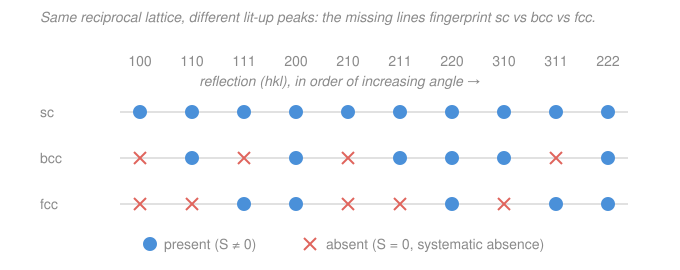

# Condensed Matter · Lesson 1.5: The structure factor — what diffraction can't see

> ⏱ ~15 min · Module 1: Crystal structure and diffraction · Builds on: [1.4 X-ray diffraction and Bragg's law](01-04-xray-diffraction-bragg.md), [1.3 The reciprocal lattice](01-03-reciprocal-lattice.md) · Unlocks: [2.1 Lattice vibrations: the 1D monatomic chain](02-01-monatomic-chain.md)

## Why this matters

Bragg's law told you *where* diffracted beams can appear: one spot for every reciprocal-lattice vector $\mathbf{G}_{hkl}$. But run the experiment and you find something Bragg never warned you about — **some of the allowed spots are missing.** Shine X-rays on body-centered iron and the $(100)$ reflection, dead center in the list of permitted angles, is simply gone. This isn't sloppy apparatus; it's information. Which spots go dark is a fingerprint of *how the atoms sit inside the unit cell*, and reading that fingerprint is how a crystallographer tells simple-cubic from bcc from fcc, or a rock-salt crystal from a cesium-chloride one, without ever seeing an atom. The tool that predicts the darkness is the **structure factor** — and it turns out to be a Fourier transform of the cell, our first taste of the theme that runs through all of diffraction.

## The idea

Picture two families of atomic planes. Bragg's condition lines up the reflections from *one* family so their waves add in phase — a bright beam. But a unit cell usually holds more than one atom, and each atom launches its own scattered wavelet. Those wavelets carry **phases** set by where the atom sits. If a second atom sits exactly halfway between the Bragg-satisfying planes, its wavelet arrives *half a wavelength late* — crest meets trough — and it **cancels** the first. The Bragg condition is still met, the geometry still says "peak here," yet the intensity is zero because the cell interferes with itself.

So think of it as two layers of interference. The **lattice** decides which directions are even in the running (that's Bragg / the reciprocal lattice from 1.3–1.4). The **basis** — the atoms decorating each lattice point — then votes each of those directions up (bright) or down (dark) by adding its wavelets with their phases. The structure factor is just that vote, tallied as a sum of complex numbers, one per atom. When the votes cancel, you get a **systematic absence**: a peak allowed by the lattice but killed by the basis.

## The formal version

**Atomic form factor.** A single atom isn't a point — it's a cloud of $Z$ electrons, and X-rays scatter off that charge density $\rho(\mathbf{r})$. The amplitude one atom scatters into a beam with scattering vector $\mathbf{G}$ is its **atomic form factor**

$$f_j(\mathbf{G}) = \int \rho_j(\mathbf{r})\, e^{-i\,\mathbf{G}\cdot\mathbf{r}}\, d^3r .$$

*In words: an atom's scattering strength is the Fourier transform of its own electron cloud.* Two consequences you only need qualitatively here: at zero angle ($\mathbf{G}=0$) the integral just counts electrons, so $f_j \to Z_j$ — **heavy atoms scatter harder**; and because a spread-out cloud has a narrower transform, $f_j$ **falls off as the scattering angle grows**. (This Fourier-transform-of-a-density statement is the bridge to 3.4 and to the `mathematical-methods-physics` toolkit — hold that thought for "Sideways.")

**Structure factor.** Now sum the wavelets from every atom in the (conventional) unit cell, each weighted by its form factor and phased by its position. Label atom $j$ by its **fractional coordinates** $(x_j, y_j, z_j)$ — its position measured in units of the cell edges, so each runs in $[0,1)$. For the reflection $\mathbf{G}_{hkl}$,

$$\boxed{\;S_{hkl} = \sum_{j} f_j\, \exp\!\big[\,2\pi i\,(h x_j + k y_j + l z_j)\,\big]\;}$$

*In words: add up each atom's scattering amplitude with a phase that records where the atom sits relative to the diffracting planes.* The measured intensity is

$$I_{hkl} \propto |S_{hkl}|^2 .$$

*In words: brightness is the squared magnitude of that complex sum — and when the sum is zero, the peak vanishes.* A **systematic absence** is exactly the case $S_{hkl}=0$: the lattice permits $\mathbf{G}_{hkl}$, but the basis cancels it for *every* cell in the crystal (hence "systematic," not random).

Two facts make the phase easy to handle: $h,k,l$ are integers, and the special positions in cubic cells are halves. So the exponent is always $i\pi\times(\text{integer})$, and $e^{i\pi n} = (-1)^n$. Every structure-factor sum below collapses to counting $+1$'s and $-1$'s.

## Picture

The lattice offers the same ladder of reflections to all three. The basis then strikes some out: bcc keeps only $h+k+l$ even, fcc keeps only the unmixed-parity ones. The *pattern of survivors* — not any single peak — is the signature you read off a powder film.

## Worked examples

**Example 1 (the bcc and fcc selection rules — the heart of the lesson).**

*Body-centered cubic.* The conventional cell has two identical atoms (form factor $f$): one at the corner $(0,0,0)$ and one at the body center $(\tfrac12,\tfrac12,\tfrac12)$. Then

$$S_{hkl} = f\Big[\,e^{2\pi i (0)} + e^{2\pi i (h/2 + k/2 + l/2)}\Big] = f\Big[\,1 + e^{i\pi(h+k+l)}\Big] = f\Big[\,1 + (-1)^{h+k+l}\Big].$$

$$S_{hkl} = \begin{cases} 2f, & h+k+l \ \text{even} \\ 0, & h+k+l \ \text{odd.}\end{cases}$$

*In words: the body-center atom sits on a set of planes exactly interleaving the corner planes; when $h+k+l$ is odd those extra planes fall halfway between, and every reflection they'd contribute cancels its partner.* The first few **allowed** bcc lines (increasing $h^2+k^2+l^2$) are

$$(110),\,(200),\,(211),\,(220),\,(310),\,(222),\dots \qquad\text{— note } (100),(111),(210) \text{ are absent.}$$

*Face-centered cubic.* Four identical atoms: $(0,0,0),\,(\tfrac12,\tfrac12,0),\,(\tfrac12,0,\tfrac12),\,(0,\tfrac12,\tfrac12)$. Then

$$S_{hkl} = f\Big[\,1 + e^{i\pi(h+k)} + e^{i\pi(h+l)} + e^{i\pi(k+l)}\Big].$$

Check the parities. If $h,k,l$ are **all even or all odd** ("unmixed"), each of $h+k,\,h+l,\,k+l$ is even, so all four terms are $+1$ and $S = 4f$. If the parity is **mixed** (say two even, one odd), then two of those pairwise sums are odd and one is even: $S = f[1 + 1 - 1 - 1] = 0$. So

$$S_{hkl} = \begin{cases} 4f, & h,k,l \ \text{all even or all odd} \\ 0, & \text{otherwise (mixed parity).}\end{cases}$$

The first few **allowed** fcc lines are

$$(111),\,(200),\,(220),\,(311),\,(222),\,(400),\dots$$

**The payoff — this is how you tell the cubic lattices apart.** A powder pattern's peaks come in order of $s \equiv h^2+k^2+l^2 = 1,2,3,4,5,6,8,\dots$ Simple cubic shows *every* one. bcc drops all the odd-$s$ lines — the first present peak is $(110)$, at $s=2$. fcc's first two survivors are $(111)$ and $(200)$, at $s=3$ then $4$, and the *ratio of the first two angles* betrays it instantly. **First allowed reflection: sc $\to (100)$, bcc $\to (110)$, fcc $\to (111)$.** (This is precisely the selection rule Boss Problem 1 asks you to justify before indexing a real pattern.)

**Example 2 (why you'd care — CsCl vs. a "true" bcc, the intensity contrast).** Cesium chloride *looks* body-centered: Cs$^+$ at $(0,0,0)$, Cl$^-$ at $(\tfrac12,\tfrac12,\tfrac12)$. But the two atoms are **different**, with form factors $f_{\text{Cs}} \neq f_{\text{Cl}}$. Redo the sum with distinct factors:

$$S_{hkl} = f_{\text{Cs}} + f_{\text{Cl}}\,e^{i\pi(h+k+l)} = f_{\text{Cs}} + (-1)^{h+k+l} f_{\text{Cl}} = \begin{cases} f_{\text{Cs}} + f_{\text{Cl}}, & h+k+l \ \text{even} \\ f_{\text{Cs}} - f_{\text{Cl}}, & h+k+l \ \text{odd.}\end{cases}$$

Now the odd-$h{+}k{+}l$ reflections **do not vanish** — they come back *weakly*, with amplitude $f_{\text{Cs}} - f_{\text{Cl}}$ instead of zero. So CsCl shows a full simple-cubic ladder of peaks, but alternating **strong** ($\propto (f_{\text{Cs}}+f_{\text{Cl}})^2$) and **weak** ($\propto (f_{\text{Cs}}-f_{\text{Cl}})^2$). Only in the imaginary limit $f_{\text{Cs}} = f_{\text{Cl}}$ (identical atoms) do the weak lines die completely — recovering the clean bcc rule of Example 1. The same logic runs NaCl (an fcc lattice with a Na–Cl basis): its "all-odd" lines like $(111)$ come out weak ($\propto (f_{\text{Na}} - f_{\text{Cl}})^2$) while "all-even" lines like $(200)$ are strong — the textbook rock-salt intensity alternation. **Systematic absences tell you the lattice type; the surviving intensities tell you what's decorating it.**

## Watch out

- **You might think a missing peak means the reciprocal-lattice point isn't there.** It is — $\mathbf{G}_{hkl}$ exists and Bragg's law is satisfied. The point is *unlit*: $S_{hkl}=0$ zeroes the intensity, not the geometry. Absence is an interference effect of the basis, not a gap in the lattice.
- **You might treat bcc/fcc as new Bravais lattices with their own reciprocal lattices.** A cleaner and equivalent view: take a *simple*-cubic lattice and put a 2-atom (bcc) or 4-atom (fcc) basis on it. The structure factor of that basis is exactly what deletes the extra sc reflections. Absences and "centering" are two descriptions of one fact. (Doing it the other way — bcc's true reciprocal lattice *is* fcc — gives the identical surviving spots.)
- **You might expect the form factors to drop out.** For *identical* atoms they factor out and only the phase geometry matters, so the rule is purely about $(hkl)$. The moment the atoms differ (Example 2), the $f_j$ stay in and set which "forbidden" lines reappear and how bright — don't cancel them prematurely.
- **Sign vs. magnitude.** $S_{hkl}$ is generally complex; what you measure is $|S_{hkl}|^2$. A reflection with $S = f_{\text{Cs}}-f_{\text{Cl}} < 0$ is perfectly visible — intensity cares only about magnitude. (That the *phase* of $S$ is unmeasurable is the famous "phase problem" of crystallography.)

## One-liner

> Bragg picks the reciprocal-lattice points where a peak *may* appear; the structure factor $S_{hkl}=\sum_j f_j e^{2\pi i(hx_j+ky_j+lz_j)}$ decides which are bright and which go dark — and the pattern of the dark ones fingerprints sc vs. bcc vs. fcc.

## Problems

**P1 (🟢)** For body-centered cubic, compute $S_{hkl}$ from the two-atom basis and list which of the reflections $(100),(110),(111),(200),(210),(211)$ are allowed. State the first present peak.

**P2 (🟡)** Explain, from the structure-factor sum, why fcc shows **no** $(100)$ reflection but **does** show $(200)$. Then give the first allowed reflection for bcc and for fcc, and state the ratio $s_{\text{fcc}}/s_{\text{bcc}}$ of their first-peak $h^2+k^2+l^2$ values. (This is the core of Boss Problem 1's lattice-typing step.)

**P3 (🔴, optional)** Diamond is fcc with a **two**-atom basis: identical carbons at $(0,0,0)$ and $(\tfrac14,\tfrac14,\tfrac14)$. Show that its structure factor factorizes into the fcc rule times a "basis factor," and find the extra condition under which an *fcc-allowed* reflection is nonetheless killed. Is $(200)$ present in diamond?

Solutions

**P1** Two identical atoms at $(0,0,0)$ and $(\tfrac12,\tfrac12,\tfrac12)$, form factor $f$:

$$S_{hkl} = f\big[1 + e^{i\pi(h+k+l)}\big] = f\big[1 + (-1)^{h+k+l}\big] = \begin{cases}2f, & h+k+l\ \text{even}\\ 0, & h+k+l\ \text{odd.}\end{cases}$$

Sum $h+k+l$ for each: $(100)\to 1$ odd → **absent**; $(110)\to 2$ even → **allowed**; $(111)\to 3$ odd → **absent**; $(200)\to 2$ even → **allowed**; $(210)\to 3$ odd → **absent**; $(211)\to 4$ even → **allowed**. First present peak: $(110)$.

*Check.* The allowed set $\{(110),(200),(211),\dots\}$ has $s = 2,4,6,\dots$ — all even, as $h+k+l$ even forces $h^2+k^2+l^2$ even. Consistent. ✓

**P2** With the fcc basis, $S_{hkl}= f[1 + (-1)^{h+k} + (-1)^{h+l} + (-1)^{k+l}]$.

For $(100)$: $h+k=1,\ h+l=1,\ k+l=0$, so $S = f[1 -1 -1 +1] = 0$ → **absent** (mixed parity: one odd index among two evens). For $(200)$: $h+k=2,\ h+l=2,\ k+l=0$, all even, so $S=f[1+1+1+1]=4f$ → **present** (all indices even = unmixed). The physical picture: $(100)$ would need corner planes spaced by the full cell edge, but the face-centering atoms sit exactly halfway and cancel them; $(200)$ refers to planes half as far apart, and the face atoms now land *on* those planes and add in phase.

First allowed: bcc $\to (110)$ with $s=2$; fcc $\to (111)$ with $s=3$. Ratio $s_{\text{fcc}}/s_{\text{bcc}} = 3/2 = 1.5$.

*Check.* Since $s \propto \sin^2\theta$ (from $2d\sin\theta=\lambda$ with $d = a/\sqrt{s}$), the first-peak angles satisfy $\sin^2\theta_{\text{fcc}}/\sin^2\theta_{\text{bcc}} = 3/2$ at equal $a$ and $\lambda$ — a directly measurable discriminator. ✓

**P3** Diamond = fcc lattice with a 2-atom basis, carbons at $\mathbf{d}_1=(0,0,0)$ and $\mathbf{d}_2=(\tfrac14,\tfrac14,\tfrac14)$. The structure factor of the full conventional cell (8 atoms) factorizes into (lattice-centering sum) $\times$ (basis sum):

$$S_{hkl} = \underbrace{f\big[1 + (-1)^{h+k}+(-1)^{h+l}+(-1)^{k+l}\big]}_{\text{fcc factor}}\times\underbrace{\big[1 + e^{i\pi(h+k+l)/2}\big]}_{\text{basis factor}}.$$

The first factor is the usual fcc rule (0 unless $h,k,l$ unmixed parity). The **basis factor** $1 + e^{i\pi(h+k+l)/2}$ vanishes when $e^{i\pi(h+k+l)/2} = -1$, i.e. when $(h+k+l)/2$ is an odd integer, i.e. $h+k+l \equiv 2 \pmod 4$. So an fcc-allowed reflection is *additionally* extinguished when $h+k+l = 2, 6, 10, \dots$

Test $(200)$: it is fcc-allowed (all even), and $h+k+l = 2 \equiv 2 \pmod 4$, so the basis factor is $1 + e^{i\pi} = 0$. **$(200)$ is absent in diamond.** (It is present in a plain fcc metal like copper — the extra carbon at $(\tfrac14,\tfrac14,\tfrac14)$ is what kills it. This is the famous "diamond glide" extinction.)

*Check.* Diamond's first few allowed lines are $(111),(220),(311),(400),\dots$ — $(200)$ and $(222)$ (where $h+k+l=6$) are gone, matching the $h+k+l\equiv 2\ (\mathrm{mod}\ 4)$ rule. ✓

## Flashback

**From Lesson 1.4 (X-ray diffraction and Bragg's law):** A simple-cubic crystal with lattice constant $a = 4.00$ Å is examined with X-rays of wavelength $\lambda = 1.54$ Å (Cu K$\alpha$). Using the cubic spacing $d_{hkl} = a/\sqrt{h^2+k^2+l^2}$ and Bragg's law $2d\sin\theta = \lambda$ (first order), find the diffraction angle $\theta$ for the $(110)$ reflection.

Solution

Interplanar spacing for $(110)$, so $h^2+k^2+l^2 = 2$:

$$d_{110} = \frac{a}{\sqrt{2}} = \frac{4.00}{1.414} = 2.83\ \text{Å}.$$

Bragg's law:

$$\sin\theta = \frac{\lambda}{2 d_{110}} = \frac{1.54}{2(2.83)} = \frac{1.54}{5.66} = 0.272,\qquad \theta = \arcsin(0.272) \approx 15.8^\circ.$$

*Check.* $\sin\theta < 1$, so the reflection is observable. ✓ A larger $s$ (smaller $d$) would push $\theta$ higher — exactly the ordering the powder pattern relies on. Note that $(110)$ being *geometrically* accessible here says nothing about whether it's *bright*: on a bcc lattice $(110)$ is the first allowed line (this lesson), while on sc every line including $(100)$ survives. ✓

## Connections

- **Backward:** the structure factor sits directly on top of [1.4 Bragg / Laue](01-04-xray-diffraction-bragg.md) and the reciprocal lattice of [1.3](01-03-reciprocal-lattice.md) — those give the *set* of possible $\mathbf{G}_{hkl}$; $S_{hkl}$ turns each on or off. The bcc/fcc bases and Miller indices come straight from [1.2](01-02-structures-miller-indices.md).
- **Forward:** this closes Module 1 and sets up **Boss Problem 1** (index a powder pattern, identify the lattice from allowed reflections, extract $a$). Next, [2.1 the 1D monatomic chain](02-01-monatomic-chain.md) leaves diffraction for dynamics — but the same "sum a phase over the basis" bookkeeping reappears when a two-atom basis splits phonons into acoustic and optical branches in 2.2.
- **Sideways (Fourier analysis):** $f_j$ is the Fourier transform of one atom's electron density and $S_{hkl}$ is the Fourier transform of the whole cell's density sampled at the reciprocal-lattice points — diffraction *is* a Fourier-transform machine, and inverting it (with the phases you can't measure) is how structures are solved. This is the same transform toolkit developed in [`mathematical-methods-physics`](../../mathematical-methods-physics/syllabus.md), and it returns in 3.4 when a weak periodic potential opens a gap through its Fourier component $U_{\mathbf{G}}$.
