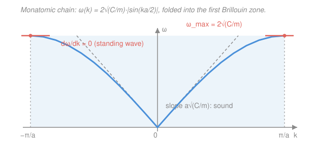

# Condensed Matter · Lesson 2.1: Lattice vibrations: the 1D monatomic chain

> ⏱ ~15 min · Module 2: Phonons and thermal properties · Builds on: [1.5 The structure factor: what diffraction can't see](01-05-structure-factor.md), [`waves-optics` syllabus](../../waves-optics/syllabus.md) · Unlocks: [2.2 The diatomic chain: acoustic and optical branches](02-02-diatomic-chain-branches.md)

## Why this matters

Module 1 froze the atoms in place and asked where they sit. But atoms are never still — they jiggle, and that jiggle *is* the heat content, the sound, and much of the electrical resistance of a solid. Before we can quantize those vibrations into **phonons** (2.3) and compute a heat capacity (2.4), we need the classical skeleton: how does a line of atoms coupled by springs actually move? The answer is a single, beautiful curve — the **dispersion relation** $\omega(k)$ — and it already contains sound waves, a maximum frequency, and the same Brillouin zone you built for diffraction in [1.3](01-03-reciprocal-lattice.md). This is the wave equation of [`waves-optics`](../../waves-optics/syllabus.md) run on a discrete grid.

## The idea

Picture a row of identical beads of mass $m$, spaced a distance $a$ apart, each tied to its two neighbors by identical springs of stiffness $C$. Nudge one bead sideways and it pulls on its neighbors, which pull on *their* neighbors — the disturbance travels. That's a wave on a chain.

The one twist that makes a *crystal* different from a continuous string: the medium is **discrete**. A string can carry a wave of any wavelength, however short. A chain cannot resolve anything finer than the bead spacing — a "wave" wigglier than about $2a$ just relabels the same set of bead displacements as a longer wave. This single fact forces every distinct vibration into a finite window of wavevectors (the first Brillouin zone) and puts a hard ceiling on the frequency. Everything below falls out of one line of algebra.

## The formal version

Label the atoms by integer $n$; let $u_n(t)$ be the displacement of atom $n$ from its rest position $na$ (we take longitudinal motion, along the chain). Atom $n$ feels a spring force from each neighbor proportional to how much that spring is stretched — i.e. to the *difference* in displacements. Newton's second law gives the **equation of motion**:

$$m\,\ddot u_n = C\,(u_{n+1} - u_n) - C\,(u_n - u_{n-1}) = C\,(u_{n+1} + u_{n-1} - 2u_n).$$

*In words: each atom is a mass on a spring whose "stretch" is set by how far it has drifted relative to its two neighbors.* Note the right side is the discrete second derivative — the chain is literally Hooke's law from [`mechanics-refresher` 3.1](../../mechanics-refresher/lessons/03-01-simple-harmonic-motion.md), coupled.

This is $N$ coupled ODEs, but they are all identical, so a **plane-wave ansatz** diagonalizes them. Try

$$u_n(t) = A\,e^{i(kna - \omega t)},$$

the displacement of the atom at position $na$, with amplitude $A$, wavevector $k$ (units $\mathrm{m^{-1}}$), and angular frequency $\omega$. *In words: guess that every atom does the same oscillation, just phase-shifted by $ka$ from its neighbor.* The magic is that neighbors differ only by a factor: $u_{n\pm 1} = u_n\,e^{\pm ika}$. Substituting, and using $\ddot u_n = -\omega^2 u_n$:

$$-m\omega^2 = C\left(e^{ika} + e^{-ika} - 2\right) = C\,(2\cos ka - 2) = -2C\,(1 - \cos ka).$$

The amplitude $A$ and index $n$ cancel completely — the hallmark of a normal mode. Now use the identity $1 - \cos ka = 2\sin^2(ka/2)$, so $2 - 2\cos ka = 4\sin^2(ka/2)$:

$$m\omega^2 = 4C\,\sin^2\!\left(\tfrac{ka}{2}\right) \qquad\Longrightarrow\qquad \boxed{\;\omega(k) = 2\sqrt{\tfrac{C}{m}}\;\left|\sin\!\left(\tfrac{ka}{2}\right)\right|\;}$$

*In words: the vibration frequency depends on the wavelength, rising from zero to a maximum of $\,\omega_{\max} = 2\sqrt{C/m}\,$ as the wave gets shorter.* This is **the dispersion relation**. Read four things off it:

- **Periodicity in $k$.** $\omega(k)$ repeats with period $2\pi/a$: replacing $k \to k + 2\pi/a$ shifts each atom's phase by $2\pi n$, i.e. not at all. So all *physically distinct* modes live in the **first Brillouin zone** $-\pi/a < k \le \pi/a$ — exactly the zone from [1.3](01-03-reciprocal-lattice.md). A $k$ outside is an alias of one inside; the discrete lattice cannot resolve wavelengths shorter than $2a$.
- **Long wavelength (small $k$) = sound.** For $ka \ll 1$, $\sin(ka/2) \approx ka/2$, so $\omega \approx \sqrt{C/m}\,a\,|k|$ — **linear**. A linear $\omega \propto |k|$ is a non-dispersive wave with speed the **sound speed** $v_s = a\sqrt{C/m}$. Here phase and group velocity coincide: these are ordinary sound waves.
- **Zone boundary $k = \pi/a$ = standing wave.** Here $\omega$ is maximal and the slope $d\omega/dk = 0$. Zero group velocity means the wave carries no energy — it is a **standing wave**, neighboring atoms exactly out of phase ($e^{i\pi} = -1$), the vibrational analogue of a Bragg reflection.
- **Group velocity carries the energy.** Differentiating, $v_g = d\omega/dk = a\sqrt{C/m}\,\cos(ka/2)$ (for $k>0$): equal to $v_s$ at $k=0$, falling to $0$ at the zone edge.

Finally, **how many modes?** Wrap the chain of $N$ atoms into a ring — **Born–von Kármán periodic boundary conditions**, $u_{n+N} = u_n$. Then $e^{ikNa} = 1$, so $k = \dfrac{2\pi p}{Na}$ for integer $p$. Counting these over one zone of width $2\pi/a$ gives exactly $N$ allowed $k$ — one mode per atom, as a system of $N$ masses must have $N$ degrees of freedom.

## Picture

## Worked examples

**Example 1 (the dispersion from scratch, plus scales).** Take $C = 15\ \mathrm{N/m}$, $m = 6.0\times10^{-26}\ \mathrm{kg}$ (a light atom), spacing $a = 3.0\times10^{-10}\ \mathrm{m}$. First the natural rate:

$$\sqrt{\frac{C}{m}} = \sqrt{\frac{15}{6.0\times10^{-26}}} = \sqrt{2.5\times10^{26}} = 1.58\times10^{13}\ \mathrm{s^{-1}}.$$

The maximum (zone-boundary) frequency is $\omega_{\max} = 2\sqrt{C/m} = 3.16\times10^{13}\ \mathrm{rad/s}$ — infrared, the right ballpark for lattice vibrations. The sound speed is

$$v_s = a\sqrt{\frac{C}{m}} = (3.0\times10^{-10})(1.58\times10^{13}) \approx 4.7\times10^{3}\ \mathrm{m/s},$$

a few kilometers per second — exactly what you measure for sound in a solid. Two atomic-scale inputs ($C$, $m$) and a spacing reproduce a macroscopic number.

**Example 2 (why the ceiling matters — connecting to waves).** On a *continuous* string, $\omega = v_s |k|$ with no upper limit: shorter waves just mean higher frequency, forever. The chain agrees at small $k$ but then bends over and flattens (see the figure). The reason is discreteness: a wave with $k$ just past $\pi/a$ is indistinguishable from one just inside, so there is nothing left to describe above $\omega_{\max}$. This is the physical origin of a *cutoff frequency* — and in [2.4](02-04-heat-capacity-einstein-debye.md) it becomes the Debye cutoff that makes a solid's heat capacity finite. The linear part is the wave equation of [`waves-optics`](../../waves-optics/syllabus.md); the bend-over is what discreteness adds.

## Watch out

- **You might think a larger $k$ always means a higher frequency.** Only up to the zone edge. Beyond $k=\pi/a$, $\omega$ *decreases* again by periodicity — but those $k$ aren't new modes, they're aliases. Always fold $k$ back into $-\pi/a < k \le \pi/a$ before interpreting it.
- **You might conflate phase and group velocity.** $v_p = \omega/k$ and $v_g = d\omega/dk$ agree only in the linear region. At the zone boundary $v_p$ is still finite but $v_g = 0$ — the wave pattern exists but transports no energy. Group velocity is what carries the signal.
- **You might expect atoms to move like a smooth curve.** The ansatz $e^{ikna}$ is defined *only* at integer $n$; the continuous sinusoid is just a bookkeeping envelope. Two envelopes differing by $2\pi/a$ in $k$ pass through the *same* atomic dots — that is aliasing made visual.

## One-liner

> A chain of springs gives $\omega(k) = 2\sqrt{C/m}\,|\sin(ka/2)|$: linear (sound) at small $k$, flat (a standing wave, $v_g=0$) at the zone edge $k=\pi/a$, and periodic — so all real modes live in one Brillouin zone, $N$ of them for $N$ atoms.

## Problems

**P1 (🟢)** For a monatomic chain with $C = 20\ \mathrm{N/m}$, $m = 5.0\times10^{-26}\ \mathrm{kg}$, and $a = 2.5\times10^{-10}\ \mathrm{m}$: (a) evaluate the zone-boundary (maximum) frequency $\omega_{\max}$, and (b) find the sound speed $v_s$.

**P2 (🟡)** Starting from $\omega(k) = 2\sqrt{C/m}\,\sin(ka/2)$ (take $0 \le k \le \pi/a$), derive the group velocity $v_g(k)$. (a) Show it equals the sound speed $v_s$ as $k\to 0$ and vanishes at $k=\pi/a$. (b) At what $k$ in the zone is $v_g$ exactly half of $v_s$?

**P3 (🔴, optional)** A chain of $N = 8$ atoms with spacing $a$ is closed into a ring (Born–von Kármán). (a) Write the allowed values of $k$ and confirm there are exactly $N$ of them in the first Brillouin zone. (b) What is the spacing $\Delta k$ between adjacent allowed modes, and how does it change as $N\to\infty$?

Solutions

**P1** First the natural rate: $\sqrt{C/m} = \sqrt{20/(5.0\times10^{-26})} = \sqrt{4.0\times10^{26}} = 2.0\times10^{13}\ \mathrm{s^{-1}}$.

(a) $\omega_{\max} = 2\sqrt{C/m} = 4.0\times10^{13}\ \mathrm{rad/s}$.

(b) $v_s = a\sqrt{C/m} = (2.5\times10^{-10})(2.0\times10^{13}) = 5.0\times10^{3}\ \mathrm{m/s}$.

*Check.* Units of $\sqrt{C/m}$: $\sqrt{(\mathrm{N/m})/\mathrm{kg}} = \sqrt{\mathrm{s^{-2}}} = \mathrm{s^{-1}}$ ✓; $v_s = \mathrm{m\cdot s^{-1}}$ ✓. Both numbers (tens of THz, ~5 km/s) are physically right for a solid.

**P2** Differentiate: $v_g = \dfrac{d\omega}{dk} = 2\sqrt{\dfrac{C}{m}}\cdot\dfrac{a}{2}\cos\!\left(\dfrac{ka}{2}\right) = a\sqrt{\dfrac{C}{m}}\,\cos\!\left(\dfrac{ka}{2}\right)$.

(a) As $k\to 0$: $\cos(ka/2)\to 1$, so $v_g \to a\sqrt{C/m} = v_s$ ✓. At $k=\pi/a$: $\cos(\pi/2) = 0$, so $v_g = 0$ — the standing wave, no energy transport ✓.

(b) Set $v_g = \tfrac12 v_s$: since $v_g = v_s\cos(ka/2)$, we need $\cos(ka/2) = \tfrac12$, i.e. $ka/2 = \pi/3$, so $k = \dfrac{2\pi}{3a}$. This lies inside the zone ($2\pi/3a < \pi/a$) ✓.

*Check.* $v_g$ starts at $v_s$ and decreases monotonically to $0$ across the zone, so a value of $v_s/2$ must occur once, at $k = 2\pi/3a \approx 0.67\,\pi/a$ — between the center and the edge, as found. ✓

**P3** (a) Born–von Kármán ($u_{n+N}=u_n$) forces $e^{ikNa}=1$, so $kNa = 2\pi p$ and $k = \dfrac{2\pi p}{Na}$ for integer $p$. Choosing the $N=8$ consecutive integers that land in $-\pi/a < k \le \pi/a$, take $p = -3,-2,-1,0,1,2,3,4$:

$$k = \frac{2\pi}{8a}\{-3,-2,-1,0,1,2,3,4\} = \frac{\pi}{a}\left\{-\tfrac34,-\tfrac12,-\tfrac14,0,\tfrac14,\tfrac12,\tfrac34,1\right\}.$$

That is exactly $N=8$ modes, the last ($p=4$) sitting on the zone boundary $k=\pi/a$ ✓ — one longitudinal mode per atom, matching the 8 degrees of freedom.

(b) Adjacent modes differ by $\Delta k = \dfrac{2\pi}{Na}$. As $N\to\infty$ this $\to 0$: the allowed $k$ densify into a continuum filling the zone, which is why for a macroscopic crystal we replace sums over $k$ by integrals (used throughout 2.3–2.4).

*Check.* Number of modes = (zone width)/$\Delta k$ = $(2\pi/a)/(2\pi/Na) = N$ ✓, independent of $a$ — the count is set by the atom number, exactly as degrees-of-freedom counting demands.

## Flashback

**From Lesson 1.3 (The reciprocal lattice):** A 1D crystal has lattice constant $a = 4.0\ \mathrm{\mathring A}$. (a) Give the magnitude of the primitive reciprocal lattice vector and state the first Brillouin zone. (b) A vibrational mode is quoted with wavevector $k = 2.2\,\pi/a$. Which equivalent $k$ inside the first zone does it represent?

Solution

(a) In 1D the reciprocal lattice vector has magnitude $G = \dfrac{2\pi}{a} = \dfrac{2\pi}{4.0\ \mathrm{\mathring A}} \approx 1.57\ \mathrm{\mathring A^{-1}}$. The first Brillouin zone is the set of $k$ with $-\pi/a < k \le \pi/a$, i.e. $-0.785 < k \le 0.785\ \mathrm{\mathring A^{-1}}$.

(b) Fold back by subtracting one reciprocal lattice vector: $k - \dfrac{2\pi}{a} = 2.2\,\dfrac{\pi}{a} - 2\,\dfrac{\pi}{a} = 0.2\,\dfrac{\pi}{a}$, which lies inside the zone. So $k = 2.2\pi/a$ is physically identical to $k = 0.2\pi/a \approx 0.157\ \mathrm{\mathring A^{-1}}$.

*Check.* This is precisely the phonon aliasing of this lesson: a wavevector outside the zone is redundant with one inside, differing by a reciprocal lattice vector $G = 2\pi/a$. The zone that organized diffraction peaks in Module 1 is the same zone that organizes vibrational modes here. ✓

## Connections

- **Backward:** each atom obeys the coupled version of Hooke's law and simple harmonic motion from [`mechanics-refresher` 3.1](../../mechanics-refresher/lessons/03-01-simple-harmonic-motion.md); the plane-wave ansatz and the "fold $k$ into the first zone" rule are the reciprocal lattice and Brillouin zone of [1.3](01-03-reciprocal-lattice.md) reused for dynamics instead of diffraction.
- **Forward:** [2.2 The diatomic chain](02-02-diatomic-chain-branches.md) adds a two-atom basis and splits this single branch into an *acoustic* and an *optical* branch with a gap; [2.3](02-03-phonons-quantization.md) quantizes each mode into phonons of energy $\hbar\omega$, and [2.4](02-04-heat-capacity-einstein-debye.md) sums over the $N$ modes (with the zone cutoff seen here) to get the heat capacity.
- **Sideways (waves & optics):** the small-$k$ linear region is the ordinary non-dispersive wave equation, and the zone-boundary standing wave is the same $v_g=0$ resonance you meet for waves in a periodic medium — see [`waves-optics`](../../waves-optics/syllabus.md) on dispersion, group velocity, and standing waves.
