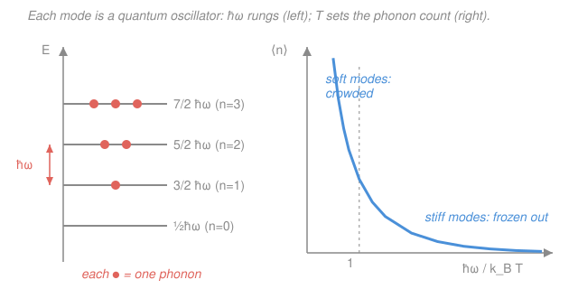

# Condensed Matter · Lesson 2.3: Phonons: quantizing the modes

> ⏱ ~15 min · Module 2: Phonons and thermal properties · Builds on: [2.2 The diatomic chain: acoustic and optical branches](02-02-diatomic-chain-branches.md), [`quantum-mechanics` syllabus](../../quantum-mechanics/syllabus.md), [`stat-mech` syllabus](../../stat-mech/syllabus.md) · Unlocks: [2.4 Heat capacity: Einstein and Debye models](02-04-heat-capacity-einstein-debye.md)

## Why this matters

Lessons 2.1 and 2.2 gave you the *classical* vibrations of a crystal: solve the coupled masses-on-springs and out comes a dispersion relation $\omega(\mathbf{k})$. But a classical crystal predicts the wrong heat capacity — it never freezes out, so it violates the third law of thermodynamics and disagrees with every low-temperature measurement. The fix is to quantize, and the payoff is enormous: the same quantum harmonic oscillator you solved in `quantum-mechanics` turns each vibrational mode into a stream of countable particles — **phonons**. Once vibrations are particles, thermodynamics becomes bookkeeping: count the phonons, add up their energy, differentiate. That machine is exactly what powers the Einstein and Debye heat capacities of [2.4](02-04-heat-capacity-einstein-debye.md), and phonon scattering is what limits thermal (and electrical) conductivity in [2.5](02-05-anharmonicity-thermal.md).

## The idea

Here is the trick in one breath. The atoms in a crystal are coupled — push one and its neighbors move — so you *cannot* treat them one at a time. But the **normal modes** of 2.1/2.2 do exactly that decoupling: a normal mode is a special collective wiggle in which *every* atom oscillates at the *same* frequency $\omega_\mathbf{k}$, and the modes don't talk to each other. In normal-mode coordinates the messy coupled crystal becomes a big pile of **independent** simple harmonic oscillators — one oscillator for each pair $(\mathbf{k}, \text{branch})$.

Now recall what quantum mechanics does to a single harmonic oscillator: its energy is not continuous. It comes in a ladder of equally spaced rungs, $E_n = (n+\tfrac12)\hbar\omega$. So each vibrational mode's energy is *quantized* too — it can only climb the ladder in steps of $\hbar\omega_\mathbf{k}$.

That indivisible step of energy gets a name: a **phonon**. A mode sitting on rung $n$ is said to hold $n$ phonons, each carrying energy $\hbar\omega_\mathbf{k}$. Just as light of frequency $\omega$ comes in photons of energy $\hbar\omega$, a lattice vibration of frequency $\omega_\mathbf{k}$ comes in phonons of energy $\hbar\omega_\mathbf{k}$. A phonon is a quantum of sound the way a photon is a quantum of light.

**In words:** a crystal's heat is not a continuous jiggle — it is a gas of particles, each one a packet of vibration.

## The formal version

**Decouple, then quantize.** The classical vibrational energy of the crystal, written in normal-mode coordinates $Q_\mathbf{k}$, is a sum of independent oscillators:

$$H = \sum_{\mathbf{k},s}\left(\frac{|P_{\mathbf{k},s}|^2}{2} + \frac12\,\omega_{\mathbf{k},s}^2\,|Q_{\mathbf{k},s}|^2\right),$$

where $s$ labels the branch (acoustic/optical from 2.2), $\omega_{\mathbf{k},s}$ is that mode's frequency, and $P_{\mathbf{k},s}$ is the conjugate momentum. *In words: the whole crystal is just a collection of ordinary oscillators, one per mode — no cross-terms, because normal modes don't interact.*

Quantizing each oscillator is the `quantum-mechanics` result, recycled verbatim:

$$\boxed{\,E_{\mathbf{k},s} = \left(n_{\mathbf{k},s} + \tfrac12\right)\hbar\,\omega_{\mathbf{k},s}, \qquad n_{\mathbf{k},s} = 0,1,2,\dots\,}$$

*In words: mode $(\mathbf{k},s)$ can hold any non-negative integer number $n$ of phonons; each phonon adds one quantum $\hbar\omega_{\mathbf{k},s}$ of energy.* The leftover $\tfrac12\hbar\omega$ is the **zero-point energy** — the mode is never fully still, even at $T=0$.

**Phonons are bosons.** Nothing caps $n_{\mathbf{k},s}$: you can pile arbitrarily many phonons into one mode. Particles you can stack without limit are **bosons**, so the thermal average occupation of a mode is the Bose–Einstein (Planck) distribution from `stat-mech`, evaluated at zero chemical potential (phonon number isn't conserved, so $\mu = 0$):

$$\boxed{\,\langle n_{\mathbf{k},s}\rangle = \frac{1}{e^{\hbar\omega_{\mathbf{k},s}/k_B T}-1}\,}$$

with $k_B$ Boltzmann's constant and $T$ the temperature. *In words: soft (low-$\omega$) modes are crowded with phonons; stiff (high-$\omega$) modes are nearly empty once $\hbar\omega$ exceeds $k_B T$.* The thermal energy stored in that one mode is $\hbar\omega_{\mathbf{k},s}\langle n_{\mathbf{k},s}\rangle$ (plus the zero-point $\tfrac12\hbar\omega$).

**Crystal momentum.** A phonon carries not just energy $\hbar\omega_\mathbf{k}$ but a momentum-like label $\hbar\mathbf{k}$, the **crystal momentum**. It behaves like ordinary momentum in scattering — with one twist from the periodic lattice (recall the reciprocal lattice of 1.3): $\mathbf{k}$ is only defined *modulo a reciprocal lattice vector* $\mathbf{G}$. So in a collision the conservation law is

$$\sum \mathbf{k}_{\text{in}} = \sum \mathbf{k}_{\text{out}} + \mathbf{G}.$$

If $\mathbf{G}=0$ the crystal momentum is strictly conserved — a **Normal (N) process**. If $\mathbf{G}\neq 0$, the total wavevector lands outside the first Brillouin zone and gets folded back in; the missing $\hbar\mathbf{G}$ is dumped into the crystal as a whole — an **Umklapp (U) process** ("flip-over"). Umklapp is what actually degrades a heat current, so it dominates thermal resistance (that's [2.5](02-05-anharmonicity-thermal.md)).

**Density of states.** To do thermodynamics we rarely need individual modes — we need *how many* modes sit near each frequency. The **phonon density of states** $g(\omega)$ is defined by

$$g(\omega)\,d\omega = \text{number of modes with frequency in } [\omega,\omega+d\omega].$$

It is obtained from the dispersion $\omega(\mathbf{k})$ by counting $\mathbf{k}$-points in each frequency shell. Wherever the dispersion goes flat ($\nabla_\mathbf{k}\omega = 0$, e.g. a branch top or a zone boundary), many $\mathbf{k}$ pile up at one frequency and $g(\omega)$ spikes — a **van Hove singularity**. With $g(\omega)$ in hand, the crystal's total vibrational energy is one integral:

$$U = \sum_{\mathbf{k},s}\hbar\omega_{\mathbf{k},s}\!\left(\langle n_{\mathbf{k},s}\rangle + \tfrac12\right) = \int_0^{\omega_{\max}} g(\omega)\,\hbar\omega\left[\frac{1}{e^{\hbar\omega/k_B T}-1} + \tfrac12\right]d\omega.$$

*In words: to get the thermal energy of the whole solid, weight each frequency by how many modes live there, how much energy each phonon carries, and how many phonons the temperature packs in.* Differentiate $U$ with respect to $T$ and you have the heat capacity — the entire agenda of [2.4](02-04-heat-capacity-einstein-debye.md).

## Picture

## Worked examples

**Example 1 (occupation and energy of one mode).** A phonon mode has $\hbar\omega = k_B T$ exactly — that is, $\hbar\omega/k_B T = 1$. How many phonons does it hold on average, and how much thermal energy does it store?

The occupation is the Bose factor at argument $1$:

$$\langle n\rangle = \frac{1}{e^{1}-1} = \frac{1}{2.71828 - 1} = \frac{1}{1.71828} \approx 0.582.$$

So on average a bit more than half a phonon. Its thermal energy (excluding zero-point) is

$$E_{\text{th}} = \hbar\omega\,\langle n\rangle = k_B T \times 0.582 \approx 0.58\,k_B T.$$

Compare the *classical* equipartition answer, $k_B T$ per oscillator: quantization has already suppressed the energy to 58% of the classical value once $\hbar\omega$ reaches $k_B T$. That suppression, mode by mode, is exactly why heat capacity falls below Dulong–Petit as you cool.

**Example 2 (the two limits — where Dulong–Petit and freeze-out come from).** Look at $\langle n\rangle$ in the two extremes of $x \equiv \hbar\omega/k_B T$.

*High temperature / soft mode* ($x \ll 1$): expand $e^{x} \approx 1 + x$, so

$$\langle n\rangle \approx \frac{1}{(1+x)-1} = \frac{1}{x} = \frac{k_B T}{\hbar\omega}\gg 1, \qquad \hbar\omega\langle n\rangle \approx k_B T.$$

Each mode stores $k_B T$ — classical equipartition is *recovered*, and summing over $3N$ modes gives the Dulong–Petit heat capacity $3Nk_B$ of [2.4](02-04-heat-capacity-einstein-debye.md).

*Low temperature / stiff mode* ($x \gg 1$): now $e^{x}-1 \approx e^{x}$, so

$$\langle n\rangle \approx e^{-\hbar\omega/k_B T}\to 0.$$

The occupation is exponentially small: a mode with $\hbar\omega \gg k_B T$ is essentially frozen in its ground state, contributing nothing to the heat capacity. This exponential **freeze-out** is precisely what a classical crystal misses — and why the Einstein model (which pretends all modes share one $\omega$) collapses too fast at low $T$, to be rescued by Debye's soft acoustic modes in 2.4.

**Example 3 (counting modes with $g(\omega)$ — a Debye-like branch).** For a linear acoustic branch in 3D, $\omega = v_s k$ with sound speed $v_s$. How many modes have frequency below $\omega$? In a box of volume $V$ the allowed $\mathbf{k}$-points fill $\mathbf{k}$-space at density $V/(2\pi)^3$. The modes with frequency $\le\omega$ occupy a sphere of radius $k = \omega/v_s$, so (one polarization)

$$N(\omega) = \frac{V}{(2\pi)^3}\cdot\frac{4}{3}\pi k^3 = \frac{V}{6\pi^2}\left(\frac{\omega}{v_s}\right)^3,\qquad g(\omega) = \frac{dN}{d\omega} = \frac{V}{2\pi^2}\frac{\omega^2}{v_s^3}.$$

*In words: for a linear branch the number of modes grows like $\omega^3$, so the density of states grows like $\omega^2$.* That $g(\omega)\propto\omega^2$ is the single fact behind the famous Debye $T^3$ law: few soft modes at low frequency means the heat capacity dies as a power of $T$, not the exponential of a single Einstein mode.

## Watch out

- **You might think a phonon lives at a point in the crystal.** It doesn't — a phonon is a quantum of a *delocalized* normal mode, spread over the whole lattice with wavevector $\mathbf{k}$. "A phonon here" is only meaningful as a wavepacket built from a spread of $\mathbf{k}$'s, and it then travels at the *group* velocity $\nabla_\mathbf{k}\omega$, not the phase velocity.
- **You might treat crystal momentum $\hbar\mathbf{k}$ as true momentum.** It isn't. A phonon carries essentially no real mechanical momentum (the atoms just oscillate in place); $\hbar\mathbf{k}$ is a bookkeeping label conserved only *modulo* $\mathbf{G}$. That modulo is the whole reason Umklapp scattering can exist and destroy a heat current — real momentum conservation would forbid it.
- **You might set $\mu\neq 0$ for phonons.** Phonon number is not conserved (heating the crystal creates phonons out of nothing), so the chemical potential is pinned at $\mu=0$. That is why the Bose factor has no $\mu$ — unlike electrons in `stat-mech`, where the Fermi level *is* the chemical potential.
- **You might drop the zero-point $\tfrac12\hbar\omega$ as irrelevant.** For the *heat capacity* you can, since it is $T$-independent and dies under $\partial/\partial T$. But it is real energy — it shifts phase-transition pressures and shows up in the total lattice energy.

## One-liner

> Each normal mode is a quantum oscillator whose rungs are phonons of energy $\hbar\omega$ and crystal momentum $\hbar\mathbf{k}$; temperature fills the modes by the Bose factor $1/(e^{\hbar\omega/k_BT}-1)$, and $g(\omega)$ turns that spectrum into the thermodynamics of a solid.

## Problems

**P1 (🟢)** A phonon mode has $\hbar\omega/k_B T = 2$. (a) Find its average occupation $\langle n\rangle$. (b) Find its thermal energy in units of $k_B T$. (c) Without recomputing, say roughly how $\langle n\rangle$ changes if the temperature is doubled, and name the limit you are heading toward.

**P2 (🟡)** Two phonons scatter to produce a third (a "$1+1\to$ ..." — actually take $\mathbf{k}_1 + \mathbf{k}_2 \to \mathbf{k}_3$). Work on a 1D chain with lattice constant $a$, so the first Brillouin zone is $-\pi/a < k \le \pi/a$ and the reciprocal lattice vectors are $G = 2\pi m/a$. Suppose $k_1 = k_2 = 0.7\,\pi/a$. (a) What is $k_1 + k_2$, and is it inside the first zone? (b) Find the physical $k_3$ inside the first zone and the reciprocal lattice vector $G$ involved. (c) Is this a Normal or an Umklapp process, and which way does $k_3$ point relative to the incoming phonons?

**P3 (🔴, optional)** For a 1D monatomic chain the dispersion is $\omega(k) = \omega_{\max}\,\lvert\sin(ka/2)\rvert$ (from 2.1), for $k$ in the first zone. The 1D density of states is $g(\omega) = \dfrac{L}{\pi}\left|\dfrac{dk}{d\omega}\right|$ (counting both $\pm k$), where $L$ is the chain length. Show that $g(\omega)$ diverges as $\omega\to\omega_{\max}$, and identify this as a van Hove singularity. What feature of the dispersion causes it?

Solutions

**P1** (a) With $x=\hbar\omega/k_B T = 2$:

$$\langle n\rangle = \frac{1}{e^{2}-1} = \frac{1}{7.389-1} = \frac{1}{6.389} \approx 0.157.$$

(b) Thermal energy $E_{\text{th}} = \hbar\omega\langle n\rangle = (2k_B T)(0.157) \approx 0.31\,k_B T$.

(c) Doubling $T$ halves $x$ to $1$, so $\langle n\rangle$ rises from $0.157$ to $1/(e^1-1)\approx 0.582$ — roughly a factor of 3.7 more phonons. Keep heating and $x\to 0$, where $\langle n\rangle\approx k_B T/\hbar\omega$ grows linearly: the classical / high-temperature (Dulong–Petit) limit.

*Check.* $\langle n\rangle$ should *increase* with $T$ (more thermal energy, more phonons) — it does, $0.157\to 0.582$. And at $x=2$ the mode holds well under one phonon: it is mostly frozen, consistent with $\hbar\omega$ being twice $k_BT$. ✓

**P2** (a) $k_1 + k_2 = 1.4\,\pi/a$. The first zone ends at $\pi/a$, so $1.4\,\pi/a$ lies *outside* it.

(b) Fold back by subtracting one reciprocal lattice vector $G = 2\pi/a$ (i.e. $m=1$):

$$k_3 = (k_1+k_2) - G = 1.4\,\frac{\pi}{a} - 2\,\frac{\pi}{a} = -0.6\,\frac{\pi}{a},$$

which is inside $(-\pi/a,\ \pi/a]$. So $k_3 = -0.6\,\pi/a$ and $G = 2\pi/a$.

(c) Because $G\neq 0$, this is an **Umklapp** process. The two incoming phonons both move in the $+k$ direction, but the resulting phonon has $k_3 < 0$ — it points *backward*. That reversal (crystal momentum $\hbar G$ handed to the lattice) is exactly how Umklapp scattering reverses a heat current and creates thermal resistance.

*Check.* $k_3$ landed in $(-\pi/a,\pi/a]$ as required, and one $G$ sufficed since $1.4\pi/a$ overshot the zone edge by less than $2\pi/a$. The sign flip is the signature "Umklapp = flip-over." ✓

**P3** Differentiate the dispersion: $\dfrac{d\omega}{dk} = \omega_{\max}\dfrac{a}{2}\cos(ka/2)$ for $0<k<\pi/a$. Hence

$$g(\omega) = \frac{L}{\pi}\left|\frac{dk}{d\omega}\right| = \frac{L}{\pi}\cdot\frac{2}{\omega_{\max}\,a\,\cos(ka/2)}.$$

As $k\to\pi/a$ (the zone boundary), $\cos(ka/2)\to\cos(\pi/2)=0$, so $g(\omega)\to\infty$. Express it in $\omega$: since $\sin(ka/2)=\omega/\omega_{\max}$, we have $\cos(ka/2)=\sqrt{1-(\omega/\omega_{\max})^2}$, giving

$$g(\omega) = \frac{2L}{\pi a\,\omega_{\max}}\,\frac{1}{\sqrt{1-(\omega/\omega_{\max})^2}},$$

which diverges as $\omega\to\omega_{\max}$. This is a **van Hove singularity**: it occurs because the group velocity $d\omega/dk\to 0$ at the zone boundary — the branch goes flat there, so a whole neighborhood of $k$-values crowds into an infinitesimal band of frequencies near $\omega_{\max}$.

*Check.* The singularity is integrable ($1/\sqrt{\ }$ form), so the total number of modes $\int g\,d\omega$ stays finite — as it must, equalling $N$ for the chain. Flat dispersion $\Rightarrow$ diverging $g(\omega)$ is the general rule; here it sits at the single maximum frequency. ✓

## Flashback

**From Lesson 2.2 (The diatomic chain: acoustic and optical branches):** A 1D diatomic chain has masses $M$ (heavy) and $m$ (light) on identical springs of constant $C$. At the very center of the Brillouin zone ($k=0$), the optical branch has frequency $\omega_{\text{opt}}(0) = \sqrt{2C\left(\tfrac1m + \tfrac1M\right)}$ and the acoustic branch has $\omega_{\text{ac}}(0)=0$. Take $C = 15\ \mathrm{N/m}$, $m = 1.0\times10^{-26}\ \mathrm{kg}$, $M = 3.0\times10^{-26}\ \mathrm{kg}$. (a) Compute $\omega_{\text{opt}}(0)$. (b) Now quantize it: what is the energy of a *single* optical phonon at $k=0$, in joules and in meV? (This is the bridge from 2.2's classical branch to 2.3's phonon.)

Solution

(a) Reduced-mass combination: $\dfrac1m + \dfrac1M = \dfrac{1}{1.0\times10^{-26}} + \dfrac{1}{3.0\times10^{-26}} = (1.0 + 0.333)\times10^{26} = 1.333\times10^{26}\ \mathrm{kg^{-1}}$.

$$\omega_{\text{opt}}(0) = \sqrt{2(15)(1.333\times10^{26})} = \sqrt{4.0\times10^{27}} \approx 6.3\times10^{13}\ \mathrm{rad/s}.$$

(b) One phonon carries $E = \hbar\omega$, with $\hbar = 1.055\times10^{-34}\ \mathrm{J\,s}$:

$$E = (1.055\times10^{-34})(6.3\times10^{13}) \approx 6.7\times10^{-21}\ \mathrm{J}.$$

Convert with $1\ \mathrm{eV} = 1.602\times10^{-19}\ \mathrm{J}$:

$$E = \frac{6.7\times10^{-21}}{1.602\times10^{-19}}\ \mathrm{eV} \approx 0.042\ \mathrm{eV} = 42\ \mathrm{meV}.$$

*Check.* Optical phonon energies in real solids are tens of meV (e.g. ~63 meV in silicon), so 42 meV is the right order of magnitude — a reassuring sign the numbers are physical. Units in (a): $\sqrt{(\mathrm{N/m})\cdot\mathrm{kg^{-1}}} = \sqrt{\mathrm{s^{-2}}} = \mathrm{s^{-1}}$ ✓. ✓

## Connections

- **Backward:** this lesson recycles two engines you already own. The energy ladder $E_n=(n+\tfrac12)\hbar\omega$ is the harmonic oscillator of [`quantum-mechanics`](../../quantum-mechanics/syllabus.md), applied not to one particle but to each normal mode of 2.1/2.2. The "$\mathbf{k}$ only up to $\mathbf{G}$" rule is the reciprocal-lattice periodicity of Module 1 (1.3), now governing scattering instead of diffraction.
- **Forward:** [2.4 Heat capacity](02-04-heat-capacity-einstein-debye.md) plugs $g(\omega)$ and the Bose factor straight into $U=\int g(\omega)\hbar\omega\langle n\rangle\,d\omega$ and differentiates — Einstein assumes a single $\omega$, Debye uses the $g(\omega)\propto\omega^2$ of Example 3 to get the $T^3$ law. [2.5](02-05-anharmonicity-thermal.md) turns Normal vs Umklapp into the temperature dependence of thermal conductivity.
- **Sideways:** the quantized oscillator ladder is the shared spine with [`quantum-mechanics`](../../quantum-mechanics/syllabus.md) (and the same math that quantizes the electromagnetic field into photons). The Bose–Einstein occupation with $\mu=0$ is the [`stat-mech`](../../stat-mech/syllabus.md) result for a non-conserved boson gas — the photon-gas / blackbody statistics wearing a crystal's clothes.
