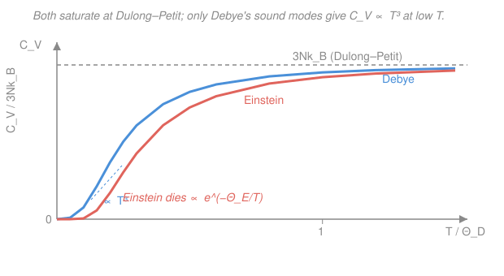

# Condensed Matter · Lesson 2.4: Heat capacity — Einstein and Debye models

> ⏱ ~15 min · Module 2: Phonons and thermal properties · Builds on: [2.3 Phonons: quantizing the modes](02-03-phonons-quantization.md) · Unlocks: [2.5 Anharmonicity: thermal expansion and conductivity](02-05-anharmonicity-thermal.md)

## Why this matters

Heat a solid by one degree and ask how much energy it took: that number, the **heat capacity**, is the most direct experimental window onto the phonons we just quantized. Classical physics makes one clean, wrong prediction — a constant heat capacity — and the *way* it fails at low temperature was one of the first hard clues that vibrations are quantized. Einstein cracked it in 1907 with a single-frequency guess; Debye fixed the low-temperature tail in 1912 with the $T^3$ law that still fits data across dozens of materials. This lesson is Boss problem 2, and it's the template for every "count the modes, weight by occupation, differentiate" calculation you'll do for electrons in Module 3.

## The idea

Every atom in a crystal is a spring near the bottom of its well (that's [2.1](02-01-monatomic-chain.md)), and a spring stores energy in two buckets — kinetic and potential. Classical **equipartition** hands each bucket $\tfrac12 k_B T$, so each atom, vibrating in 3 directions, carries $3 k_B T$. For $N$ atoms that's $U = 3 N k_B T$, and the heat capacity $C_V = dU/dT = 3 N k_B$ — a *constant*, the same for every solid, temperature be damned. This is **Dulong–Petit**, and near room temperature it's gorgeous: about $25\ \mathrm{J\,mol^{-1}K^{-1}}$ for almost any element.

Then you cool the solid down and $C_V$ collapses toward zero. Equipartition has no dial for this — it never mentions frequency or temperature scale, so it *cannot* bend. The fix is the quantization from [2.3](02-03-phonons-quantization.md): a vibrational mode of frequency $\omega$ can only take energy in lumps of $\hbar\omega$. When $k_B T$ drops below $\hbar\omega$, there isn't enough thermal energy to make even one phonon — the mode **freezes out** and stops storing heat. High-frequency modes freeze first; the solid's heat capacity is just a census of which modes are still awake. Einstein and Debye are two guesses about the mode spectrum.

## The formal version

**The setup.** From [2.3](02-03-phonons-quantization.md), a mode of frequency $\omega$ in thermal equilibrium holds mean energy $\hbar\omega\left(\langle n\rangle + \tfrac12\right)$ with the Bose occupation $\langle n\rangle = 1/(e^{\hbar\omega/k_B T}-1)$. Dropping the temperature-independent zero-point $\tfrac12$ (it doesn't affect $C_V$), the total internal energy is a sum over all modes,

$$U = \sum_{\text{modes}} \frac{\hbar\omega}{e^{\hbar\omega/k_B T}-1}, \qquad C_V = \frac{dU}{dT}.$$

*In words: add up $\hbar\omega$ times how many phonons each mode carries, then see how fast that total rises with temperature.* Everything below is a choice of which frequencies $\omega$ to sum over.

**Einstein model.** Pretend all $3N$ modes share one frequency $\omega_E$. Then

$$C_V = 3 N k_B \left(\frac{\hbar\omega_E}{k_B T}\right)^2 \frac{e^{\hbar\omega_E/k_B T}}{\left(e^{\hbar\omega_E/k_B T}-1\right)^2}.$$

Let $x \equiv \hbar\omega_E/k_B T$. **High $T$** ($x\to 0$): expand $e^x \approx 1+x$, so the fraction $\to x^2/x^2 = 1$ and $C_V \to 3Nk_B$ — Dulong–Petit is recovered. **Low $T$** ($x\gg 1$): $e^x-1\approx e^x$, so $C_V \approx 3Nk_B\,x^2 e^{-x}$ — it dies **exponentially**. *In words: Einstein gets the freeze-out right, but with every mode at one frequency the whole crystal switches off together, far too abruptly.* Experiment shows a gentler power-law fade.

**Debye model.** The flaw is that real crystals have *low*-frequency acoustic modes — long-wavelength sound waves — that never fully freeze. Debye keeps only the acoustic branch, idealized as a linear continuum $\omega = v_s k$ (sound speed $v_s$), and counts modes with the 3D density of states. Modes with wavevector below $k$ number $\propto k^3 \propto \omega^3$, so the **density of states** $g(\omega) = dN_{\text{modes}}/d\omega \propto \omega^2$. Normalizing to exactly $3N$ modes fixes a cutoff, the **Debye frequency** $\omega_D$:

$$g(\omega) = \frac{9N}{\omega_D^3}\,\omega^2 \quad (0 \le \omega \le \omega_D), \qquad \int_0^{\omega_D} g(\omega)\,d\omega = 3N.$$

Define the **Debye temperature** $\Theta_D \equiv \hbar\omega_D/k_B$ — the temperature at which the stiffest mode's quantum $\hbar\omega_D$ equals $k_B T$; it's the one material-specific number in the model. Putting $g(\omega)$ into $U$ and substituting $x = \hbar\omega/k_B T$,

$$U = 9 N k_B T \left(\frac{T}{\Theta_D}\right)^3 \int_0^{\Theta_D/T} \frac{x^3}{e^x - 1}\,dx \;\Longrightarrow\; \boxed{\,C_V = 9 N k_B \left(\frac{T}{\Theta_D}\right)^3 \int_0^{\Theta_D/T} \frac{x^4 e^x}{(e^x-1)^2}\,dx\,}$$

(the boxed $C_V$ is $dU/dT$; only the integrand's $T$-dependence survives the derivative). *In words: weight each frequency by how many modes sit there ($\propto\omega^2$) and how thermally active it is, then differentiate.*

**The two limits.**

- **High $T$** ($T \gg \Theta_D$): the upper limit is tiny, so $x$ stays small and $x^4 e^x/(e^x-1)^2 \approx x^2$. Then $\int_0^{\Theta_D/T} x^2\,dx = \tfrac13(\Theta_D/T)^3$, and $C_V \to 9Nk_B(T/\Theta_D)^3 \cdot \tfrac13(\Theta_D/T)^3 = 3Nk_B$. Dulong–Petit again — every model must reproduce it.
- **Low $T$** ($T \ll \Theta_D$): the upper limit $\to\infty$ and the integral becomes a constant, $\displaystyle\int_0^\infty \frac{x^4 e^x}{(e^x-1)^2}\,dx = \frac{4\pi^4}{15}$. So

$$\boxed{\,C_V = \frac{12\pi^4}{5}\,N k_B\left(\frac{T}{\Theta_D}\right)^3\,}\qquad (T \ll \Theta_D)$$

the **Debye $T^3$ law**. *In words: at low temperature only long-wavelength sound modes are still absorbing heat, and there are $\propto T^3$ of them thermally active — so $C_V$ fades as a gentle cubic, not Einstein's crash.* This matches insulators beautifully.

## Picture

Both curves climb to the same $3Nk_B$ plateau (grey dashed) at high $T$. At low $T$ they part ways: Debye (blue) hugs the data with its $T^3$ rise, while Einstein (coral) undershoots — its single frequency freezes the crystal out too fast.

## Worked examples

**Example 1 — the electron preview (why $T^3$ isn't the whole story in a metal).** In an insulator, phonons are all there is and $C_V \propto T^3$ all the way down. A *metal* also has conduction electrons, and (jumping to [3.2, the Fermi surface and electronic heat capacity](../syllabus.md)) only the sliver near the Fermi level can absorb heat, giving a **linear** electronic term $\gamma T$. So a metal at low $T$ obeys

$$C_V = \gamma T + \beta T^3, \qquad \beta = \frac{12\pi^4}{5}\frac{N k_B}{\Theta_D^3}.$$

Because $\gamma T$ falls off *slower* than $\beta T^3$, electrons win at the very bottom. The experimentalist's trick: plot $C_V/T$ against $T^2$ and you get a straight line — intercept $\gamma$ (electrons), slope $\beta$ (phonons, hence $\Theta_D$). One graph separates the two gases.

**Example 2 — estimate $\Theta_D$ from a measured low-$T$ heat capacity (this is Boss problem 2).** Per mole, $N = N_A$ and $Nk_B = R = 8.314\ \mathrm{J\,mol^{-1}K^{-1}}$, so the $T^3$ law reads

$$C_V = \frac{12\pi^4}{5} R \left(\frac{T}{\Theta_D}\right)^3 = 1944\left(\frac{T}{\Theta_D}\right)^3\ \mathrm{J\,mol^{-1}K^{-1}}.$$

Suppose an insulating crystal measures $C_V = 0.60\ \mathrm{J\,mol^{-1}K^{-1}}$ at $T = 20\ \mathrm{K}$ (safely in the $T^3$ regime). Invert:

$$\left(\frac{T}{\Theta_D}\right)^3 = \frac{0.60}{1944} = 3.09\times10^{-4} \;\Rightarrow\; \frac{T}{\Theta_D} = 0.0676 \;\Rightarrow\; \Theta_D = \frac{20}{0.0676} \approx 296\ \mathrm{K}.$$

A typical hard solid. Notice you needed *one* data point in the $T^3$ region — the whole low-$T$ curve is pinned by a single number $\Theta_D$.

## Watch out

- **You might think "low $T$" means room temperature is fine for $T^3$.** No — the $T^3$ law holds only for $T \lesssim \Theta_D/10$ or so. At $T = \Theta_D$ you're already near the plateau. Always check where $T$ sits relative to $\Theta_D$ before choosing a limit.
- **You might expect Einstein and Debye to agree at high $T$ but not low.** They agree at high $T$ (both give $3Nk_B$ — that's forced by the total mode count $3N$). The *low*-$T$ behavior is where the physics lives, and it's set entirely by the low-frequency end of $g(\omega)$: Einstein has none there, Debye has $g\propto\omega^2$.
- **You might use $\pi^4/15$ instead of $4\pi^4/15$ for the $C_V$ integral.** The $\int x^3/(e^x-1)\,dx = \pi^4/15$ is for the *energy*; differentiating (or integrating by parts) gives the extra factor of 4 in the *heat-capacity* integral, $\int x^4 e^x/(e^x-1)^2\,dx = 4\pi^4/15$. That factor is exactly why the coefficient is $12\pi^4/5$ and not $3\pi^4/5$.

## One-liner

> Equipartition gives the flat Dulong–Petit $3Nk_B$; quantization freezes modes out below $\hbar\omega \sim k_B T$, and because a real crystal keeps soft sound modes, $C_V$ fades as Debye's $T^3$ — not Einstein's exponential crash.

## Problems

**P1 (🟢)** Verify the high-temperature limit of the Einstein heat capacity. Starting from $C_V = 3Nk_B\,x^2 e^x/(e^x-1)^2$ with $x = \hbar\omega_E/k_B T$, expand for small $x$ (i.e. $T \gg \hbar\omega_E/k_B$) and show $C_V \to 3Nk_B$. Keep the next term to show whether Einstein approaches the plateau from above or below.

**P2 (🟡, Boss-aligned)** A crystal is measured to have a molar heat capacity $C_V = 2.9\ \mathrm{mJ\,mol^{-1}K^{-1}}$ at $T = 5\ \mathrm{K}$, deep in the Debye regime. Estimate its Debye temperature $\Theta_D$. Then predict $C_V$ at $T = 10\ \mathrm{K}$ without any new data.

**P3 (🔴)** For a metal, $C_V = \gamma T + \beta T^3$. For copper, $\gamma = 0.695\ \mathrm{mJ\,mol^{-1}K^{-2}}$ and $\Theta_D = 343\ \mathrm{K}$. Find the crossover temperature below which the electronic term exceeds the phonon term, and comment on why you'd need a cryostat to see it.

Solutions

**P1** With $x\to 0$ use $e^x = 1 + x + \tfrac{x^2}{2} + \cdots$. Numerator $x^2 e^x \approx x^2(1+x)$. Denominator $(e^x-1)^2 = \left(x + \tfrac{x^2}{2} + \cdots\right)^2 = x^2\left(1 + \tfrac{x}{2}\right)^2 \approx x^2(1 + x)$. The ratio is

$$\frac{x^2 e^x}{(e^x-1)^2} \approx \frac{x^2(1+x)}{x^2(1+x)} = 1 + O(x^2),$$

so $C_V \to 3Nk_B$. Carrying one more order gives $C_V = 3Nk_B\left(1 - \tfrac{1}{12}x^2 + \cdots\right)$, so the correction is **negative**: Einstein approaches the plateau from *below* as $T$ rises. *Check.* Dimensionless $x$ in, $3Nk_B$ (units of heat capacity) out ✓; and the leading term is exactly Dulong–Petit, as any model must give at high $T$.

**P2** Use $C_V = 1944\,(T/\Theta_D)^3\ \mathrm{J\,mol^{-1}K^{-1}}$ (from Example 2), with $C_V = 2.9\times10^{-3}\ \mathrm{J\,mol^{-1}K^{-1}}$:

$$\left(\frac{5}{\Theta_D}\right)^3 = \frac{2.9\times10^{-3}}{1944} = 1.49\times10^{-6} \;\Rightarrow\; \frac{5}{\Theta_D} = 1.14\times10^{-2} \;\Rightarrow\; \Theta_D \approx 437\ \mathrm{K}.$$

For $T = 10\ \mathrm{K}$, the $T^3$ law scales as temperature cubed: doubling $T$ multiplies $C_V$ by $2^3 = 8$, so $C_V(10\,\mathrm{K}) \approx 8 \times 2.9 = 23\ \mathrm{mJ\,mol^{-1}K^{-1}}$. *Check.* $\Theta_D \approx 437\ \mathrm{K}$ is a stiff, light solid (diamond-ish is much higher at ~2200 K; this is in the normal hard-material range) ✓. Both temperatures are $\ll \Theta_D/10 \approx 44\ \mathrm{K}$, so the $T^3$ law is valid at both ✓.

**P3** The electronic term dominates when $\gamma T > \beta T^3$, i.e. below $T^* = \sqrt{\gamma/\beta}$. Compute $\beta$:

$$\beta = \frac{12\pi^4}{5}\frac{R}{\Theta_D^3} = \frac{1944}{(343)^3}\ \mathrm{J\,mol^{-1}K^{-1}} = \frac{1944}{4.03\times10^{7}} = 4.82\times10^{-5}\ \mathrm{J\,mol^{-1}K^{-4}} = 0.0482\ \mathrm{mJ\,mol^{-1}K^{-4}}.$$

Then

$$T^* = \sqrt{\frac{\gamma}{\beta}} = \sqrt{\frac{0.695}{0.0482}} = \sqrt{14.4} \approx 3.8\ \mathrm{K}.$$

So only below about $3.8\ \mathrm{K}$ do electrons carry more heat than phonons — you need liquid helium ($4.2\ \mathrm{K}$) or below to reach it, which is exactly why the $C_V/T$-vs-$T^2$ plot in Example 1 is a cryogenic measurement. *Check.* Units: $\sqrt{(\mathrm{mJ\,mol^{-1}K^{-2}})/(\mathrm{mJ\,mol^{-1}K^{-4}})} = \sqrt{\mathrm{K^{2}}} = \mathrm{K}$ ✓. Order of magnitude: metals have their electron–phonon $C_V$ crossover at a few kelvin, as tabulated ✓.

## Flashback

**From Lesson 2.3 (Phonons: quantizing the modes):** A single phonon mode has frequency $\omega$ set by $\hbar\omega/k_B = 300\ \mathrm{K}$. At temperature $T = 300\ \mathrm{K}$, find the mean phonon number $\langle n\rangle$ in that mode, and its mean energy in units of $\hbar\omega$ (include the zero-point term). (Fresh variant — a single mode, not the full spectrum.)

Solution

Here $x = \hbar\omega/k_B T = 300/300 = 1$. Bose occupation:

$$\langle n\rangle = \frac{1}{e^{x}-1} = \frac{1}{e-1} = \frac{1}{1.718} \approx 0.58.$$

Mean energy including zero point: $\langle E\rangle = \hbar\omega\left(\langle n\rangle + \tfrac12\right) = (0.58 + 0.50)\,\hbar\omega \approx 1.08\,\hbar\omega.$

*Check.* At $x=1$ we're near the crossover from frozen ($\langle n\rangle \to 0$) to classical ($\langle n\rangle \to k_B T/\hbar\omega = 1/x$); indeed $\langle n\rangle = 0.58$ sits between those, and the classical estimate $1/x = 1$ is the right ballpark ✓. This single-mode occupation is precisely the weight each $g(\omega)$ slice carries in the Debye energy integral above.

## Connections

- **Backward:** the Bose occupation $\langle n\rangle = 1/(e^{\hbar\omega/k_B T}-1)$ and the phonon-as-quantum picture are straight from [2.3](02-03-phonons-quantization.md); the density of states $g(\omega)\propto\omega^2$ comes from counting the acoustic dispersion $\omega = v_s k$ of [2.1](02-01-monatomic-chain.md) in 3D. The Bose–Einstein statistics itself is the [`stat-mech`](../../stat-mech/syllabus.md) ideal Bose gas.
- **Forward:** [2.5](02-05-anharmonicity-thermal.md) asks what the *harmonic* crystal underlying all of this gets wrong — thermal expansion and finite conductivity both need anharmonicity. The electronic linear term $\gamma T$ previewed here is derived properly in [3.2 (the Fermi surface and electronic heat capacity)](../syllabus.md) via the same "count states near $E_F$, weight by occupation, differentiate" recipe — now with Fermi–Dirac instead of Bose.
- **Sideways:** the mode-counting $g(\omega)\propto\omega^2$ is identical to the photon density of states behind the **Planck blackbody law** — Debye's $T^3$ solid is literally a "phonon gas in a box" version of blackbody radiation, with a cutoff $\omega_D$ that photons lack. Same integral $\int x^3/(e^x-1)\,dx = \pi^4/15$ shows up in the Stefan–Boltzmann $T^4$ energy density.
