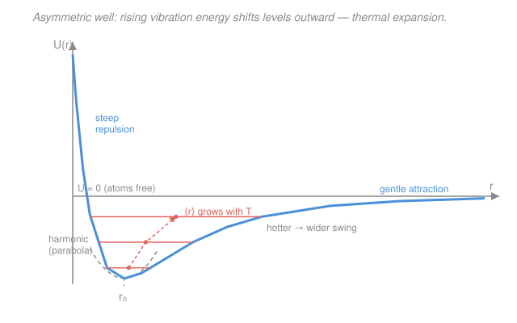

# Condensed Matter · Lesson 2.5: Anharmonicity — thermal expansion and conductivity

> ⏱ ~15 min · Module 2: Phonons and thermal properties · Builds on: [2.4 Heat capacity: Einstein and Debye models](02-04-heat-capacity-einstein-debye.md), [2.3 Phonons: quantizing the modes](02-03-phonons-quantization.md) · Unlocks: [3.1 The free-electron (Sommerfeld) gas](03-01-free-electron-gas.md)

## Why this matters

Everything in Module 2 so far — the dispersion $\omega(k)$, the phonons, the Debye heat capacity — was built on **springs**: a parabolic potential, forces strictly linear in displacement. That harmonic crystal is a triumph, but it is quietly *wrong* about three things you can check with a ruler and a thermometer. It predicts a solid that **never expands when heated**, that conducts heat **infinitely well**, and whose phonons **never scatter and live forever**. Reality does none of these. The fix is a single word — **anharmonicity** — and it turns the interatomic potential from a symmetric parabola into the lopsided, real shape of a chemical bond. That one asymmetry is why bridges have expansion joints and why a diamond feels cold to the touch.

## The idea

Picture two atoms joined by a bond. Push them together and the electron clouds resist *ferociously* — the energy shoots up. Pull them apart and the bond weakens *gently* — the energy tails off toward zero (the atoms come free). The potential well is therefore **asymmetric**: a steep repulsive wall on the near side, a soft attractive tail on the far side. A parabola, by contrast, is perfectly symmetric — same steepness either way.

Now heat the crystal. Each atom vibrates in its well with more energy, so it explores a horizontal slice higher up. In a **symmetric** well the midpoint of that slice sits right over the bottom no matter how high you go — the *average* position never moves, so **no expansion**. In the **asymmetric** well the soft side lets the atom wander farther out than in, so the midpoint of each slice **drifts outward** as the energy climbs. Average the wandering over a hot lattice and every bond sits a little longer: the solid **expands**. That's the whole mechanism — thermal expansion is a direct fingerprint of the well's lopsidedness.

The same asymmetry has a second consequence. In a perfect harmonic crystal the phonons (Module 2.3) are *independent* normal modes — they pass through each other like ghosts, never interacting. Anharmonic terms in the potential act like a coupling between modes: phonons can now **collide and scatter off one another**. A scattered phonon has a finite lifetime and travels only a finite distance before it's knocked off course — and that finite mean free path is exactly what gives a real solid a **finite** thermal conductivity instead of the infinite one the springs predict.

## The formal version

**Where anharmonicity lives.** Expand the interatomic potential about equilibrium $r_0$:

$$U(r) = U(r_0) + \tfrac12 U''(r_0)\,x^2 + \tfrac{1}{6}U'''(r_0)\,x^3 + \cdots, \qquad x \equiv r - r_0.$$

*In words: the $x^2$ term is the spring (harmonic); the $x^3$ term is the leading **anharmonic** correction.* The cubic term is the villain of this lesson: it makes the well asymmetric (with $U''' < 0$ the tail is softer than the wall), and it is the term that couples phonon modes. Everything below flows from it.

**Thermal expansion and the Grüneisen parameter.** Averaging the atom's position in the lopsided well gives a mean displacement that grows with temperature; carrying the Boltzmann average to first order in the cubic term yields $\langle x\rangle \propto T$. The clean, general way to package this uses how phonon frequencies shift when you squeeze the crystal. Define the **Grüneisen parameter**

$$\gamma \equiv -\frac{d\ln\omega}{d\ln V},$$

the fractional stiffening of a phonon mode per fractional *shrink* in volume $V$. *In words: $\gamma$ measures how much the lattice's vibrations care about being compressed* — for a harmonic crystal $\omega$ wouldn't depend on $V$ at all and $\gamma = 0$. A thermodynamic identity (equating the pressure from the vibrating phonon gas to the elastic response) then gives the **volume coefficient of thermal expansion**

$$\alpha_V \equiv \frac{1}{V}\frac{\partial V}{\partial T} = \frac{\gamma\,C_V}{B\,V},$$

with $C_V$ the heat capacity, $B$ the bulk modulus (stiffness against compression, in Pa), and $V$ the volume. *In words: expansion is heat capacity times the anharmonicity factor $\gamma$, divided by how hard the solid is to squeeze.* Two payoffs fall straight out:

- **$\alpha_V \propto C_V$.** Expansion tracks heat capacity. So $\alpha_V$ is roughly constant at high $T$ (where $C_V \to$ Dulong–Petit, lesson 2.4) and **vanishes as $T^3$ at low $T$** (the Debye $T^3$ law) — expansion freezes out exactly as heat capacity does.
- **$\gamma$ is typically $\sim 1$–$3$.** It is dimensionless and roughly constant across materials, which is why the Grüneisen relation is such a useful back-of-envelope tool.

**Phonon–phonon scattering: Normal vs Umklapp.** The cubic term lets **three phonons** meet at a point (two in, one out, or one in, two out). Energy is conserved, $\omega_1 + \omega_2 = \omega_3$, and crystal momentum is conserved **up to a reciprocal lattice vector** (lesson 2.3):

$$\mathbf{k}_1 + \mathbf{k}_2 = \mathbf{k}_3 + \mathbf{G}.$$

*In words: the total phonon wavevector is conserved only modulo a reciprocal-lattice jump $\mathbf{G}$.* Two cases:

- **Normal (N) process, $\mathbf{G} = 0$:** total crystal momentum $\sum\hbar\mathbf{k}$ is conserved. The phonon gas keeps drifting the same way — N processes reshuffle energy among modes but **do not degrade a heat current**, so by themselves they cause *no* thermal resistance.
- **Umklapp (U) process, $\mathbf{G} \neq 0$:** the outgoing phonon is folded back into the first Brillouin zone, and a chunk $\hbar\mathbf{G}$ of crystal momentum is **dumped into the lattice as a whole**. This *reverses/randomizes* the net phonon drift — U processes are the only ones that genuinely **resist heat flow**. ("Umklapp" = German *to flip over*.)

Umklapp needs two phonons whose wavevectors sum past the zone boundary, i.e. large-$k$ (high-energy, $\sim\hbar\omega \gtrsim k_B\Theta_D$) phonons. These **freeze out** at low $T$ as $e^{-\Theta_D/bT}$ (with $b$ a number of order 2), so Umklapp scattering shuts off exponentially as the crystal cools.

**Thermal conductivity.** Treat phonons as a gas carrying heat; elementary kinetic theory gives

$$\kappa = \tfrac13\, C\, v_s\, \ell,$$

with $C$ the heat capacity per volume, $v_s$ the (roughly constant) sound speed, and $\ell$ the phonon **mean free path** — the distance between scattering events. The temperature dependence of $\kappa$ is a tug-of-war between $C(T)$ and $\ell(T)$:

- **High $T$ (above $\sim\Theta_D$):** $C \to$ constant (Dulong–Petit), and Umklapp scattering is rampant with $\ell \propto 1/T$. So $\boxed{\kappa \propto 1/T}$ — hotter means *worse* heat conduction.
- **Low $T$:** Umklapp freezes out, so $\ell$ grows until it hits the **sample size or defect spacing** and saturates (constant). Then $\kappa \propto C \propto T^3$ — conductivity **rises** as $T^3$.
- **In between:** the two trends cross, producing a **peak** in $\kappa(T)$, typically near $T \sim \Theta_D/10$–$\Theta_D/20$. Pure crystals (large samples, few defects) have tall, sharp peaks; dirty or tiny ones have low, broad ones.

## Picture

The blue curve is the real bond: steep on compression, soft on extension. Each coral line is a thermal vibration level; its dot marks the *midpoint* (the average bond length at that energy). As you climb, the dots slide **right** — the bond lengthens with temperature. The grey dashed parabola is the harmonic approximation: symmetric, so its midpoints stack straight up over $r_0$ and it predicts **zero** expansion.

## Worked examples

**Example 1 (thermal expansion from Grüneisen — the copper estimate).** Estimate the linear expansion coefficient of a metal at room temperature given $\gamma = 2$, bulk modulus $B = 1.4\times10^{11}\ \mathrm{Pa}$, molar heat capacity $C_V = 25\ \mathrm{J\,mol^{-1}K^{-1}}$ (near the Dulong–Petit value $3R$), and molar volume $V = 7.1\times10^{-6}\ \mathrm{m^3\,mol^{-1}}$.

Use molar quantities throughout in $\alpha_V = \gamma C_V/(BV)$:

$$\alpha_V = \frac{2 \times 25}{(1.4\times10^{11})(7.1\times10^{-6})} = \frac{50}{9.94\times10^{5}} \approx 5.0\times10^{-5}\ \mathrm{K^{-1}}.$$

For an isotropic solid the **linear** coefficient is a third of the volume one, $\alpha_L = \alpha_V/3$:

$$\alpha_L \approx \frac{5.0\times10^{-5}}{3} \approx 1.7\times10^{-5}\ \mathrm{K^{-1}}.$$

That is essentially the textbook value for copper ($1.65\times10^{-5}\ \mathrm{K^{-1}}$) — from three numbers and one anharmonic parameter. Notice the harmonic crystal ($\gamma = 0$) would give $\alpha = 0$, flatly contradicting the measurement.

**Example 2 (reading the $\kappa(T)$ curve).** A pure insulating crystal has $\Theta_D = 400\ \mathrm{K}$. Sketch and explain $\kappa(T)$ from a few kelvin up to room temperature.

- **Low $T$ (say 5 K):** Umklapp is frozen out ($e^{-\Theta_D/bT}$ is astronomically small), so $\ell$ has grown to the crystal's own dimensions and sits *constant*. With $C \propto T^3$ (Debye), $\kappa \propto T^3$ — steeply **rising**.
- **Peak (near $\Theta_D/10 \approx 40\ \mathrm{K}$):** as $T$ climbs, enough high-$k$ phonons are thermally excited to switch Umklapp on; $\ell$ stops growing and starts *shrinking*. Where the rising $C$ meets the falling $\ell$, $\kappa$ maxes out.
- **High $T$ (300 K):** $C$ has flattened to Dulong–Petit and Umklapp dominates with $\ell \propto 1/T$, so $\kappa \propto 1/T$ — **falling**.

The curve is a single hump: up as $T^3$, over the top near $40\ \mathrm{K}$, down as $1/T$. This is exactly the measured shape for crystals like sapphire, quartz, and (spectacularly) diamond — whose stiff, light bonds push the peak high and make it an extraordinary heat conductor at room temperature.

## Watch out

- **You might think a harmonic crystal expands "a little."** It expands *exactly zero*. The average position in a parabola is dead center at every energy — expansion requires the cubic term. No anharmonicity, no expansion, full stop.
- **You might think all phonon collisions resist heat flow.** Only **Umklapp** does. Normal processes conserve total crystal momentum, so the phonon gas keeps drifting and the heat current survives untouched. A hypothetical crystal with N-only scattering would still have infinite $\kappa$ — you need the $\mathbf{G}$-jump to spill momentum into the lattice.
- **You might read "more scattering ⇒ lower $\kappa$" as the whole story and expect $\kappa$ to fall monotonically.** It doesn't: at low $T$ scattering keeps *decreasing* as it freezes out, but $\kappa$ still **rises** there — because it's $C(T)$, not $\ell$, that's controlling things once $\ell$ has hit the sample walls. The peak is the crossover between the two regimes.
- **You might confuse $\gamma = -d\ln\omega/d\ln V$ with a heat-capacity ratio.** Same letter, different beast — this Grüneisen $\gamma$ has nothing to do with $C_P/C_V$ from thermo. It measures how phonon frequencies stiffen under compression.

## One-liner

> A real bond's asymmetry ($U''' \neq 0$) does two jobs: it drifts atoms outward when heated (thermal expansion, $\alpha_V = \gamma C_V/BV$) and it lets phonons scatter — but only momentum-spilling **Umklapp** collisions resist heat flow, giving $\kappa = \tfrac13 C v_s \ell$ its rise-then-fall peak.

## Problems

**P1 (🟢)** A crystal has Grüneisen parameter $\gamma = 1.5$, bulk modulus $B = 5.0\times10^{10}\ \mathrm{Pa}$, molar heat capacity $C_V = 24\ \mathrm{J\,mol^{-1}K^{-1}}$, and molar volume $V = 1.0\times10^{-5}\ \mathrm{m^3\,mol^{-1}}$ near room temperature. Find the volume expansion coefficient $\alpha_V$ and the linear coefficient $\alpha_L$. What would $\alpha_V$ be if the crystal were perfectly harmonic?

**P2 (🟡)** For a pure dielectric crystal, state whether the thermal conductivity $\kappa$ **rises or falls** with temperature (i) well below the peak and (ii) well above it, give the leading power/dependence in each regime, and explain in one sentence what physically limits the phonon mean free path $\ell$ in each. Why is there a peak in between?

**P3 (🔴, optional)** In a three-phonon collision $\mathbf{k}_1 + \mathbf{k}_2 = \mathbf{k}_3 + \mathbf{G}$, explain why a **Normal** process ($\mathbf{G}=0$) cannot by itself establish a finite thermal conductivity, whereas an **Umklapp** process ($\mathbf{G}\neq 0$) can. As part of your answer, argue why Umklapp scattering — and hence the thermal resistance it creates — dies away exponentially as $T \to 0$.

Solutions

**P1** Use $\alpha_V = \gamma C_V/(BV)$ with consistent molar quantities:

$$\alpha_V = \frac{(1.5)(24)}{(5.0\times10^{10})(1.0\times10^{-5})} = \frac{36}{5.0\times10^{5}} = 7.2\times10^{-5}\ \mathrm{K^{-1}}.$$

Linear coefficient (isotropic solid): $\alpha_L = \alpha_V/3 = 2.4\times10^{-5}\ \mathrm{K^{-1}}$.

A perfectly harmonic crystal has $\gamma = 0$ (phonon frequencies don't depend on volume), so $\alpha_V = 0$ — no expansion at all.

*Check.* Units: $[\text{J\,mol}^{-1}\text{K}^{-1}]/([\text{Pa}][\text{m}^3\text{mol}^{-1}]) = [\text{J\,mol}^{-1}\text{K}^{-1}]/[\text{J\,mol}^{-1}] = \text{K}^{-1}$ ✓ (using $\mathrm{Pa} = \mathrm{J/m^3}$). Magnitude $\sim10^{-5}\ \mathrm{K^{-1}}$ is the right ballpark for a typical solid. ✓

**P2** (i) **Below the peak** (low $T$): $\kappa$ **rises**, as $\kappa \propto C \propto T^3$. Here Umklapp scattering has frozen out, so $\ell$ has grown to the **sample size / defect spacing** and is constant; the temperature dependence comes entirely from the Debye heat capacity. (ii) **Above the peak** (high $T$): $\kappa$ **falls**, as $\kappa \propto 1/T$. Here $C$ is flat (Dulong–Petit) and $\ell$ is limited by **Umklapp phonon–phonon scattering**, which gives $\ell \propto 1/T$. The **peak** occurs at the crossover: coming up from low $T$, $C$ rises while $\ell$ is still pinned at the sample size, so $\kappa$ climbs; once enough high-$k$ phonons are excited to turn on Umklapp, $\ell$ collapses faster than $C$ grows, so $\kappa$ turns over.

*Check.* Limiting behavior: as $T\to0$, $\kappa\to0$ (the $T^3$ factor wins — even an infinite-$\ell$ crystal carries no heat with no heat capacity); as $T\to\infty$, $\kappa\to0$ (scattering wins). A hump in between is forced. ✓

**P3** A heat current is carried by a phonon gas with a *net drift* — an excess of phonons moving down the temperature gradient, i.e. a nonzero total crystal momentum $\mathbf{P} = \sum_i \hbar\mathbf{k}_i$. A **Normal** process conserves $\mathbf{P}$ exactly ($\mathbf{k}_1+\mathbf{k}_2 = \mathbf{k}_3$), so it merely reshuffles which modes carry the drift while leaving the total drift — and thus the heat current — intact. Nothing relaxes back to equilibrium, so N processes alone give $\ell\to\infty$ and infinite $\kappa$. An **Umklapp** process ($\mathbf{G}\neq0$) folds the resultant back into the first Brillouin zone and hands $\hbar\mathbf{G}$ of momentum to the lattice as a whole; the surviving phonon can even point *backward*. This degrades the net drift toward zero, which is precisely what a finite thermal resistance requires.

Why Umklapp dies at low $T$: to have $\mathbf{k}_1+\mathbf{k}_2$ reach past the zone boundary you need phonons with wavevectors a sizeable fraction of $\pi/a$, hence energies $\hbar\omega \sim k_B\Theta_D$. The number of such phonons follows the Bose factor and is suppressed as $e^{-\Theta_D/bT}$ (with $b\sim2$) once $T \ll \Theta_D$. So Umklapp scattering — and the resistance it creates — shuts off exponentially, letting $\ell$ balloon until only the sample boundaries stop the phonons.

*Check.* Consistency with P2: the exponential freeze-out of Umklapp is exactly why $\ell$ saturates at the sample size below the peak, giving the $\kappa\propto T^3$ (not $1/T$) low-$T$ branch. ✓

## Flashback

**From Lesson 2.4 (Heat capacity: Einstein and Debye models):** A crystal has Debye temperature $\Theta_D = 300\ \mathrm{K}$ and $N = 6.0\times10^{23}$ atoms. Using the low-temperature Debye law $C_V = \tfrac{12\pi^4}{5} N k_B (T/\Theta_D)^3$, find $C_V$ at $T = 15\ \mathrm{K}$, and state by what factor $C_V$ changes if $T$ is doubled to $30\ \mathrm{K}$. (Take $k_B = 1.38\times10^{-23}\ \mathrm{J/K}$.)

Solution

At $T = 15\ \mathrm{K}$, the ratio $T/\Theta_D = 15/300 = 0.05$, so $(T/\Theta_D)^3 = 1.25\times10^{-4}$. The prefactor:

$$\tfrac{12\pi^4}{5} = \frac{12(97.41)}{5} \approx 233.8.$$

Then

$$C_V = 233.8 \times (6.0\times10^{23})(1.38\times10^{-23})(1.25\times10^{-4}) \approx 233.8 \times 8.28 \times 1.25\times10^{-4} \approx 0.24\ \mathrm{J/K}.$$

Doubling $T$ multiplies $C_V$ by $2^3 = \mathbf{8}$ (the $T^3$ law), giving $\approx 1.9\ \mathrm{J/K}$ at $30\ \mathrm{K}$.

*Check.* Units: $Nk_B$ has units J/K, and $(T/\Theta_D)^3$ is dimensionless, so $C_V$ is in J/K ✓. The Dulong–Petit ceiling is $3Nk_B \approx 24.8\ \mathrm{J/K}$; our low-$T$ value $0.24\ \mathrm{J/K}$ is far below it, as it must be at $T = \Theta_D/20$ ✓. This $T^3$ growth is the same one that makes $\alpha_V \propto C_V$ vanish as $T^3$ at low temperature — the link this lesson exploits.

## Connections

- **Backward:** this lesson repairs the harmonic model of [2.1](02-01-monatomic-chain.md)–[2.4](02-04-heat-capacity-einstein-debye.md). The Debye $T^3$ heat capacity of [2.4](02-04-heat-capacity-einstein-debye.md) reappears twice: as the $T^3$ freeze-out of thermal expansion ($\alpha_V \propto C_V$) and as the rising low-$T$ branch of $\kappa$. The reciprocal-lattice vector $\mathbf{G}$ that defines an Umklapp process is the crystal-momentum bookkeeping of [2.3](02-03-phonons-quantization.md).
- **Forward:** [3.1 The free-electron gas](03-01-free-electron-gas.md) starts the *other* heat- and charge-carrier — electrons — whose own scattering (off these very phonons) sets electrical resistivity; the phonon lifetimes introduced here return as the temperature-dependent resistivity of metals in Module 3, and as the electron–phonon coupling behind superconductivity later.
- **Sideways:** the $\tfrac12 U'' x^2 + \tfrac16 U''' x^3$ expansion is the same "every well is a parabola near its bottom, plus corrections" logic as [`mechanics-refresher` 3.1](../../mechanics-refresher/lessons/03-01-simple-harmonic-motion.md) — anharmonicity is exactly the term that lesson threw away. Three-phonon scattering is a nonlinear mode-coupling, the phonon analogue of anharmonic resonance in driven oscillators ([`waves-optics`](../../waves-optics/syllabus.md)).
