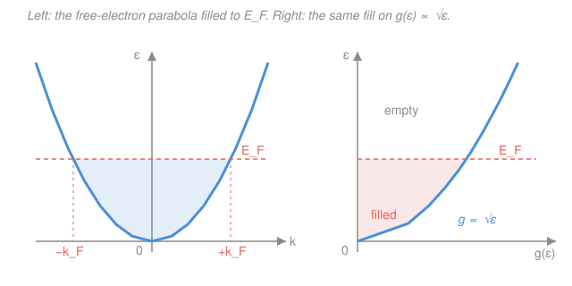

# Condensed Matter · Lesson 3.1: The free-electron (Sommerfeld) gas

> ⏱ ~15 min · Module 3: Electrons in solids · Builds on: [2.5 Anharmonicity: thermal expansion and conductivity](02-05-anharmonicity-thermal.md), [`quantum-mechanics` syllabus](../../quantum-mechanics/syllabus.md), [`stat-mech` syllabus](../../stat-mech/syllabus.md) · Unlocks: [3.2 The Fermi surface and electronic heat capacity](03-02-fermi-surface-heat-capacity.md)

## Why this matters

A copper wire has about $10^{23}$ mobile electrons per cubic centimeter, and yet the crudest possible model — pretend the ions aren't there and the electrons don't even see each other — nails the size of the Fermi energy, the electron speed, and (next lesson) the heat capacity to within a factor of two. That model is the **Sommerfeld free-electron gas**, and its one non-negotiable ingredient is quantum statistics: electrons are fermions, so they stack into energy levels like water filling a tank rather than all crashing to the bottom. This lesson fills the tank and reads off the four numbers — $k_F$, $E_F$, $v_F$, $T_F$ — that set the scale for everything electronic in a metal.

## The idea

Take a chunk of metal, throw away the ion lattice, throw away the electron–electron repulsion, and keep just one fact: each valence electron is a free quantum particle rattling around inside a box the size of the sample. A free particle in a box has plane-wave states, each labeled by a wavevector $\mathbf{k}$ (momentum $=\hbar\mathbf{k}$) and an energy that grows as $k^2$. So far this is a single particle from your quantum-mechanics course.

Now add $10^{23}$ of them. Here's the whole plot: electrons are **fermions**, so the Pauli principle lets at most one sit in each state (two, counting spin up/down). You can't pour them all into the lowest-energy state. Instead they fill states from the bottom up, like water rising in a tank, until you run out of electrons. The surface of the water — the boundary between filled and empty states — sits at an energy called the **Fermi energy** $E_F$. In $\mathbf{k}$-space the filled states form a solid ball, the **Fermi sphere**, and its radius is the **Fermi wavevector** $k_F$.

The punchline that surprises everyone the first time: this "water level" is *enormous*. For copper the electrons at the top of the fill are moving at $\sim 10^6$ m/s and carry an energy equivalent to a temperature of $\sim 80{,}000$ K — even at absolute zero. Room temperature is a rounding error on top of that. The metal is a **degenerate** gas: quantum-statistical stacking, not thermal jostling, sets its energy scale.

## The formal version

**The states.** Confine electrons to a cube of side $L$, volume $V=L^3$, and impose periodic (Born–von Kármán) boundary conditions. The single-particle states are normalized plane waves

$$\psi_\mathbf{k}(\mathbf{r}) = \frac{1}{\sqrt V}\, e^{i\mathbf{k}\cdot\mathbf{r}}, \qquad \varepsilon(\mathbf{k}) = \frac{\hbar^2 k^2}{2m},$$

with $m$ the electron mass and $\hbar$ the reduced Planck constant. Periodicity forces each component of $\mathbf{k}$ to be a multiple of $2\pi/L$:

$$k_x,\,k_y,\,k_z \in \left\{0,\ \pm\tfrac{2\pi}{L},\ \pm\tfrac{4\pi}{L},\ \dots\right\}.$$

*In words: the allowed wavevectors form a uniform grid in $\mathbf{k}$-space, one point every $(2\pi/L)^3=(2\pi)^3/V$ of volume.* Each such point holds **2** electrons (spin up and down).

**Filling the Fermi sphere.** At $T=0$ the electrons occupy every state inside a sphere of radius $k_F$ and none outside. Count them: the sphere's volume $\tfrac43\pi k_F^3$ divided by the volume per state, times 2 for spin, must equal the electron number $N$:

$$N = 2\cdot\frac{\tfrac43\pi k_F^3}{(2\pi)^3/V} = \frac{V k_F^3}{3\pi^2}.$$

Solve for $k_F$ in terms of the electron density $n=N/V$:

$$\boxed{\,k_F = \left(3\pi^2 n\right)^{1/3}\,}$$

*In words: pack more electrons in and the Fermi sphere swells — but only as the cube root, because $\mathbf{k}$-space is three-dimensional.* Note that **only the density matters**, not the sample size. From $k_F$ come the rest of the scales:

$$E_F = \frac{\hbar^2 k_F^2}{2m}, \qquad v_F = \frac{\hbar k_F}{m}, \qquad T_F = \frac{E_F}{k_B},$$

the **Fermi energy** (top of the fill), **Fermi velocity** (speed of an electron at the surface, $v_F=\hbar k_F/m$ since $p=\hbar k=mv$), and **Fermi temperature** ($k_B$ is Boltzmann's constant). For a typical metal $E_F$ is a few eV, $v_F\sim10^6$ m/s, and $T_F\sim10^4$–$10^5$ K.

**Degeneracy.** Because $T_F \gg 300$ K, the thermal energy $k_B T$ at room temperature is tiny compared with $E_F$. The occupation is governed by the **Fermi–Dirac distribution** from stat mech,

$$f(\varepsilon) = \frac{1}{e^{(\varepsilon-\mu)/k_BT}+1} \;\xrightarrow[T\to 0]{}\; \begin{cases}1 & \varepsilon < E_F\\[2pt] 0 & \varepsilon > E_F,\end{cases}$$

a hard **step** at $T=0$ (the chemical potential $\mu\to E_F$ there). *In words: at $T=0$ every state below $E_F$ is exactly full and every state above is exactly empty — no thermal smear.* A gas in this step-like regime is called **degenerate**, and it obeys Fermi–Dirac, not the classical Maxwell–Boltzmann statistics you'd use for a hot dilute gas.

**Density of states.** How many states lie in an energy window $[\varepsilon,\varepsilon+d\varepsilon]$? Count states inside radius $k$ first: $N(k)=Vk^3/3\pi^2$ (the boxed count above with $k_F\to k$). Convert to energy via $k=\sqrt{2m\varepsilon}/\hbar$, then differentiate:

$$N(\varepsilon) = \frac{V}{3\pi^2}\left(\frac{2m\varepsilon}{\hbar^2}\right)^{3/2}, \qquad g(\varepsilon) \equiv \frac{dN}{d\varepsilon} = \boxed{\;\frac{V}{2\pi^2}\left(\frac{2m}{\hbar^2}\right)^{3/2}\sqrt{\varepsilon}\;}\ \propto \sqrt{\varepsilon}.$$

*In words: the number of available electron states per unit energy grows like $\sqrt\varepsilon$ in 3D — states get denser as you go up.* This $g(\varepsilon)$ is the master function for every thermal and magnetic property in [3.2](03-02-fermi-surface-heat-capacity.md). A handy consequence, obtained by dividing $g(E_F)=\frac{V}{2\pi^2}(2m/\hbar^2)^{3/2}E_F^{1/2}$ by $N=\frac{V}{3\pi^2}(2m/\hbar^2)^{3/2}E_F^{3/2}$:

$$g(E_F) = \frac{3N}{2E_F}.$$

## Picture

## Worked examples

**Example 1 (the four scales for sodium).** Sodium is monovalent with electron density $n = 2.65\times10^{28}\ \mathrm{m^{-3}}$. Find $k_F$, $E_F$, $v_F$, $T_F$.

$$k_F = (3\pi^2 n)^{1/3} = \left(29.6 \times 2.65\times10^{28}\right)^{1/3} = \left(7.84\times10^{29}\right)^{1/3} \approx 9.2\times10^{9}\ \mathrm{m^{-1}}.$$

Then, with $\hbar=1.055\times10^{-34}\ \mathrm{J\,s}$ and $m=9.11\times10^{-31}\ \mathrm{kg}$,

$$E_F = \frac{\hbar^2 k_F^2}{2m} = \frac{(1.055\times10^{-34})^2(9.2\times10^{9})^2}{2(9.11\times10^{-31})} \approx 5.2\times10^{-19}\ \mathrm{J} \approx 3.2\ \mathrm{eV}.$$

$$v_F = \frac{\hbar k_F}{m} = \frac{(1.055\times10^{-34})(9.2\times10^{9})}{9.11\times10^{-31}} \approx 1.1\times10^{6}\ \mathrm{m/s}.$$

$$T_F = \frac{E_F}{k_B} = \frac{5.2\times10^{-19}}{1.38\times10^{-23}} \approx 3.7\times10^{4}\ \mathrm{K}.$$

So sodium's conduction electrons sit in a $3.2$ eV deep Fermi sea, the ones at the top move at $\sim0.4\%$ of light speed, and their energy scale is $37{,}000$ K — all at absolute zero.

**Example 2 (why "degenerate" is the whole story).** Compare thermal energy to the Fermi energy for sodium at room temperature, $T=300$ K:

$$\frac{k_B T}{E_F} = \frac{T}{T_F} = \frac{300}{3.7\times10^4} \approx 0.008.$$

Heating the metal from $0$ K to room temperature perturbs less than 1% of the energy scale. Only electrons within $\sim k_BT$ of the surface — a sliver of thickness $0.8\%$ of $E_F$ — can be thermally excited into empty states; the deep ones are Pauli-blocked, boxed in on all sides by filled neighbors. That single fact is why a metal's electronic heat capacity is $\sim100\times$ smaller than the classical $\tfrac32 N k_B$ you'd naively expect, and why we needed Fermi–Dirac rather than Boltzmann. [3.2](03-02-fermi-surface-heat-capacity.md) makes this "thin sliver near $E_F$" idea quantitative.

## Watch out

- **You might think a bigger metal has a bigger $E_F$.** It doesn't — $k_F=(3\pi^2 n)^{1/3}$ depends only on the *density* $n$, not on $N$ or $V$ separately. Double the sample and you double both $N$ and the available $\mathbf{k}$-states; the fill level is unchanged.
- **You might picture the electrons frozen at $T=0$.** The opposite: at $T=0$ the top electrons still scream along at $v_F\sim10^6$ m/s. This is **zero-point motion** forced by Pauli exclusion, not thermal motion — you cannot make them stop without violating the exclusion principle.
- **You might drop the factor of 2 for spin, or the $(2\pi)^3/V$ per state.** Both enter the counting $N = 2\cdot(\tfrac43\pi k_F^3)/((2\pi)^3/V)$. Forget the 2 and $k_F$ is off by $2^{1/3}$; the whole cascade of numbers shifts.
- **You might write $v_F = \sqrt{2E_F/m}$ and $p=\hbar k$ as if unrelated.** They agree — $v_F=\hbar k_F/m$ and $\tfrac12 m v_F^2 = E_F$ are the same statement. Just don't confuse $v_F$ (the *surface* speed) with any average speed; most electrons move slower.

## One-liner

> Fermions in a box stack up to the Fermi energy $E_F=\hbar^2(3\pi^2 n)^{2/3}/2m$, a several-eV, $\sim10^5$-K quantum "water level" that dwarfs room temperature — so a metal is a degenerate gas, and only the $\sqrt\varepsilon$ density of states near $E_F$ ever gets to do anything thermal.

## Problems

**P1 (🟢)** Copper has electron density $n = 8.47\times10^{28}\ \mathrm{m^{-3}}$ (one conduction electron per atom). Compute $k_F$, $E_F$ (in eV), and $v_F$.

**P2 (🟢)** Using your copper $E_F$ from P1, find the Fermi temperature $T_F$ and the ratio $k_BT/E_F$ at $T=300$ K. Is copper's electron gas degenerate at room temperature? At $T=1000$ K (near copper's melting point)?

**P3 (🟡)** (a) Show that the density of states can be written $g(E_F)=\tfrac{3N}{2E_F}$. (b) Evaluate $g(E_F)$ per unit volume for copper, i.e. $g(E_F)/V$, using $n$ and $E_F$ from P1. Give units.

Solutions

**P1** Fermi wavevector:

$$k_F = (3\pi^2 n)^{1/3} = \left(29.6\times 8.47\times10^{28}\right)^{1/3} = \left(2.51\times10^{30}\right)^{1/3} \approx 1.36\times10^{10}\ \mathrm{m^{-1}}.$$

Fermi energy:

$$E_F = \frac{\hbar^2 k_F^2}{2m} = \frac{(1.055\times10^{-34})^2(1.36\times10^{10})^2}{2(9.11\times10^{-31})} \approx 1.13\times10^{-18}\ \mathrm{J} \approx 7.0\ \mathrm{eV}.$$

Fermi velocity:

$$v_F = \frac{\hbar k_F}{m} = \frac{(1.055\times10^{-34})(1.36\times10^{10})}{9.11\times10^{-31}} \approx 1.6\times10^{6}\ \mathrm{m/s}.$$

*Check.* These are the standard textbook values for copper ($E_F\approx7$ eV, $v_F\approx1.6\times10^6$ m/s). Copper is denser in electrons than sodium, so its $E_F$ is correspondingly larger — as it must be, since $E_F\propto n^{2/3}$ and $8.47/2.65\approx3.2$, giving $3.2^{2/3}\approx2.2$, and indeed $7.0/3.2\approx2.2$. ✓

**P2** Fermi temperature:

$$T_F = \frac{E_F}{k_B} = \frac{1.13\times10^{-18}}{1.38\times10^{-23}} \approx 8.2\times10^{4}\ \mathrm{K}.$$

At $300$ K: $\dfrac{k_BT}{E_F}=\dfrac{T}{T_F}=\dfrac{300}{8.2\times10^4}\approx 3.7\times10^{-3}$.

At $1000$ K: $\dfrac{1000}{8.2\times10^4}\approx 1.2\times10^{-2}$.

Both ratios are $\ll 1$, so copper's electron gas is strongly degenerate not only at room temperature but all the way up to melting — thermal energy never comes close to $E_F$. Fermi–Dirac statistics apply throughout; Maxwell–Boltzmann would be badly wrong.

*Check.* $T_F\sim10^5$ K for a metal is the expected order of magnitude, and a metal melting far below $T_F$ is exactly why the free-electron model works across the whole solid range. ✓

**P3** (a) Total electrons and density of states at the top of the fill:

$$N = \int_0^{E_F} g(\varepsilon)\,d\varepsilon = \frac{V}{2\pi^2}\left(\frac{2m}{\hbar^2}\right)^{3/2}\int_0^{E_F}\!\sqrt\varepsilon\,d\varepsilon = \frac{V}{2\pi^2}\left(\frac{2m}{\hbar^2}\right)^{3/2}\frac{2}{3}E_F^{3/2},$$

while

$$g(E_F) = \frac{V}{2\pi^2}\left(\frac{2m}{\hbar^2}\right)^{3/2}E_F^{1/2}.$$

Dividing, the prefactor cancels: $\dfrac{g(E_F)}{N} = \dfrac{E_F^{1/2}}{\tfrac23 E_F^{3/2}} = \dfrac{3}{2E_F}$, hence $g(E_F)=\dfrac{3N}{2E_F}$.

(b) Per unit volume, using $n=8.47\times10^{28}\ \mathrm{m^{-3}}$ and $E_F=1.13\times10^{-18}\ \mathrm{J}$:

$$\frac{g(E_F)}{V} = \frac{3n}{2E_F} = \frac{3(8.47\times10^{28})}{2(1.13\times10^{-18})} \approx 1.1\times10^{47}\ \mathrm{J^{-1}\,m^{-3}}.$$

Equivalently, multiplying by $1.6\times10^{-19}$ J/eV, about $1.8\times10^{28}\ \mathrm{eV^{-1}\,m^{-3}}$ (roughly $0.2$ states per eV per atom).

*Check.* Units: $[g/V]=\mathrm{J^{-1}m^{-3}}$, correct for a states-per-energy-per-volume. Order of magnitude: $\sim n/E_F$ says there are of order one state per electron spread over the $\mathrm{eV}$-scale bandwidth — sensible, since $N$ states fill an energy range of order $E_F$. ✓

## Flashback

**From Lesson 2.1 (Lattice vibrations: the 1D monatomic chain):** A 1D monatomic chain of atoms (mass $M$, spacing $a$, spring constant $C$) has phonon dispersion $\omega(k) = \omega_{\max}\,\bigl|\sin(ka/2)\bigr|$ with $\omega_{\max}=2\sqrt{C/M}$. Find the group velocity $v_g=d\omega/dk$ at the zone center ($k\to0$) and at the zone boundary ($k=\pi/a$). Contrast the small-$k$ behavior with the free electron's $\varepsilon=\hbar^2k^2/2m$.

Solution

Differentiate: $v_g = \dfrac{d\omega}{dk} = \omega_{\max}\dfrac{a}{2}\cos(ka/2)$ for $0<k<\pi/a$.

- At $k\to0$: $\cos\to1$, so $v_g \to \omega_{\max}\,a/2 = \sqrt{C/M}\,a$. This is the finite **sound speed** — long-wavelength phonons are ordinary sound, $\omega\approx v_g k$ linear in $k$.
- At $k=\pi/a$ (zone boundary): $\cos(\pi/2)=0$, so $v_g=0$. The mode is a **standing wave** carrying no energy — group velocity vanishes at the Brillouin-zone edge.

Contrast: the phonon energy $\hbar\omega\propto|k|$ is *linear* at small $k$ (sound), whereas the free electron's $\varepsilon\propto k^2$ is *quadratic* (its group velocity $v=\hbar k/m$ rises linearly from zero, and there is no zone boundary until a lattice is introduced in [3.4](03-04-nearly-free-electron.md)).

*Check.* $v_g$ has units $[\omega\cdot a]=\mathrm{s^{-1}\,m}=\mathrm{m/s}$ ✓, and $v_g\ge0$ across the zone with a single maximum at $k=0$, consistent with a dispersion that flattens toward the zone edge. ✓

## Connections

- **Backward:** the states $\psi=e^{i\mathbf{k}\cdot\mathbf{r}}/\sqrt V$ with $\varepsilon=\hbar^2k^2/2m$ are the particle-in-a-box plane waves from [`quantum-mechanics`](../../quantum-mechanics/syllabus.md); the fermionic stacking and Fermi–Dirac step come straight from [`stat-mech`](../../stat-mech/syllabus.md), where the chemical potential $\mu$ *is* the Fermi level. Module 2 gave you the Bose gas of phonons; this is its Fermi-statistics cousin.
- **Forward:** [3.2 The Fermi surface and electronic heat capacity](03-02-fermi-surface-heat-capacity.md) uses $g(\varepsilon)\propto\sqrt\varepsilon$ and the "only a $k_BT$ sliver near $E_F$ participates" picture to derive the linear-in-$T$ electronic heat capacity and Pauli paramagnetism. [3.3 Bloch's theorem](03-03-blochs-theorem.md) then restores the ion lattice and shows what it does to these plane waves.
- **Sideways (stat mech & QM):** the whole "degenerate gas" concept — occupation set by Pauli exclusion, not temperature — is the electronic analog of a white dwarf's electron-degeneracy pressure and of a degenerate cold-atom Fermi gas; all three are the same Fermi–Dirac step from [`stat-mech`](../../stat-mech/syllabus.md) applied to plane-wave box states from [`quantum-mechanics`](../../quantum-mechanics/syllabus.md).
