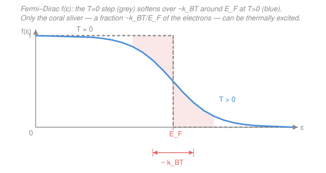

# Condensed Matter · Lesson 3.2: The Fermi surface and electronic heat capacity

> ⏱ ~15 min · Module 3: Electrons in solids · Builds on: [3.1 The free-electron (Sommerfeld) gas](03-01-free-electron-gas.md) · Unlocks: [3.3 Bloch's theorem](03-03-blochs-theorem.md)

## Why this matters

Here is a puzzle that broke classical physics. A metal has roughly one free electron per atom — a dense gas of charged particles. Equipartition says each should carry $\tfrac32 k_B T$ of thermal energy, so the electrons should add $\tfrac32 N k_B$ to the heat capacity, on top of the lattice's Dulong–Petit $3 N k_B$. But experiment says the electrons contribute almost **nothing** at room temperature — a hundred times less than predicted. Where did all that heat capacity go? Sommerfeld's answer, that only the electrons sitting near one special surface in $\mathbf{k}$-space can absorb heat at all, is one of the cleanest payoffs of Fermi–Dirac statistics — and it hands us a ruler for measuring the density of states of a real metal.

## The idea

Recall from [3.1](03-01-free-electron-gas.md): at $T=0$ the electrons fill every momentum state from $\mathbf{k}=0$ outward, stopping abruptly at radius $k_F$. The boundary between filled and empty — the sphere $|\mathbf{k}| = k_F$, i.e. the surface of energy $E_F$ — is the **Fermi surface**. For a free gas it's a sphere; in a real crystal it can be a wild shape, but it is always *the* dividing line between occupied and empty states, and essentially every electronic property (conduction, heat capacity, magnetism) is decided by the electrons living right at it.

Why *only* those electrons? Give the gas a little thermal energy $\sim k_B T$. An electron deep inside the sphere would love to absorb it — but every state a hair above it is already occupied. Pauli forbids the move; the electron is **blocked**, boxed in by its neighbors. The *only* electrons with empty states to jump into are the ones within about $k_B T$ of the surface. Everyone below is frozen out.

And here's the scale that makes it dramatic. The Fermi energy is huge — a few electron-volts, equivalent to a **Fermi temperature** $T_F = E_F/k_B \sim 10^4$–$10^5$ K. Room temperature is $T \ll T_F$, so the active shell of thickness $k_B T$ is a razor-thin skin on a giant sphere. The fraction of electrons that can do anything thermally is only about $k_B T / E_F = T/T_F \sim 1\%$. That tiny fraction is the whole story.

## The formal version

**The Fermi–Dirac distribution.** The probability that a state of energy $\varepsilon$ is occupied at temperature $T$ is

$$f(\varepsilon) = \frac{1}{e^{(\varepsilon - \mu)/k_B T} + 1},$$

where $\mu$ is the chemical potential (the Fermi level; $\mu \to E_F$ as $T\to 0$) and $k_B$ is Boltzmann's constant. *In words: states well below $\mu$ are full ($f\approx1$), states well above are empty ($f\approx0$), and the switch happens over an energy window of width a few $k_B T$ centered on $\mu$.* At $\varepsilon = \mu$, $f=\tfrac12$ exactly. As $T\to0$ the window shrinks to nothing and $f$ becomes a sharp step at $E_F$ — the $T=0$ picture of [3.1](03-01-free-electron-gas.md).

**Why the heat capacity is linear in $T$.** Take the estimate seriously. The number of "active" electrons — those within $\sim k_B T$ of $E_F$ — is roughly the density of states there times that window:

$$N_{\text{active}} \approx g(E_F)\, k_B T,$$

where $g(E_F)$ is the density of states (states per unit energy) at the Fermi level, from [3.1](03-01-free-electron-gas.md). Each of them picks up an energy of order $k_B T$. So the thermal energy stored in the electron gas is

$$U(T) - U(0) \;\sim\; N_{\text{active}}\times k_B T \;\approx\; g(E_F)\,(k_B T)^2.$$

*In words: energy grows as $T^2$, because both the number of excited electrons and the energy each one gains grow linearly with $T$.* Differentiate to get the heat capacity:

$$C_{\text{el}} = \frac{dU}{dT} \;\sim\; g(E_F)\, k_B^2\, T \;\propto\; T.$$

The electronic heat capacity is **linear in temperature**, not the constant $\tfrac32 N k_B$ classical physics predicted. The careful calculation — the **Sommerfeld expansion**, which systematically expands integrals of $f(\varepsilon)$ in powers of $k_B T / E_F$ (see the [`stat-mech` syllabus](../../stat-mech/syllabus.md)) — fixes the numerical coefficient:

$$\boxed{\,C_{\text{el}} = \gamma T, \qquad \gamma = \frac{\pi^2}{3}\, g(E_F)\, k_B^2\,}$$

*In words: measure the slope $\gamma$ and you have read off $g(E_F)$ directly.* For the free gas, $g(E_F) = \tfrac{3N}{2E_F}$ (from [3.1](03-01-free-electron-gas.md)), so equivalently $\gamma = \tfrac{\pi^2}{2}\,N k_B / T_F$ and

$$\frac{C_{\text{el}}}{C_{\text{classical}}} = \frac{\gamma T}{\tfrac32 N k_B} = \frac{\pi^2}{3}\,\frac{T}{T_F}\;\ll\;1.$$

That factor $T/T_F$ is exactly the suppression the experiments saw. The puzzle is solved: the classical answer is off by the ratio of room temperature to the Fermi temperature.

**Reading it off a real metal.** At low $T$ the electrons ($\gamma T$) and the phonons (the Debye $T^3$ law from [2.4](../syllabus.md)) both contribute:

$$C_V = \gamma T + A T^3.$$

Divide by $T$:

$$\frac{C_V}{T} = \gamma + A T^2.$$

*In words: plot $C_V/T$ against $T^2$ and you get a straight line — intercept $\gamma$, slope $A$.* This is the standard experimental route to $g(E_F)$ (the intercept) and the Debye temperature (the slope). Below a crossover temperature $T^\star = \sqrt{\gamma/A}$ the linear electronic term wins over the cubic phonon term — which is why the electronic term is easiest to see near absolute zero.

**Pauli paramagnetism (preview).** The same "only-near-$E_F$" logic governs magnetism. Put the gas in a field $B$: spin-up and spin-down electrons split in energy by $\sim \mu_B B$, but only electrons within that sliver of $E_F$ can actually flip to the lower-energy spin — the rest are Pauli-blocked. The result is a small, nearly **temperature-independent** susceptibility $\chi \propto g(E_F)$, unlike the $1/T$ Curie law of localized moments. Full treatment in [5.1](../syllabus.md); note that both $\gamma$ and $\chi$ are proportional to $g(E_F)$, so together they pin it down.

## Picture

## Worked examples

**Example 1 (the active fraction).** Copper has $E_F \approx 7$ eV. What fraction of its conduction electrons is thermally active at room temperature, $T = 300$ K?

The thermal energy is $k_B T = (8.62\times10^{-5}\ \mathrm{eV/K})(300\ \mathrm{K}) \approx 0.026$ eV. The Fermi temperature is

$$T_F = \frac{E_F}{k_B} = \frac{7\ \mathrm{eV}}{8.62\times10^{-5}\ \mathrm{eV/K}} \approx 8.1\times10^4\ \mathrm{K}.$$

The active fraction is

$$\frac{k_B T}{E_F} = \frac{T}{T_F} = \frac{0.026}{7} \approx 3.7\times10^{-3} \approx 0.4\%.$$

Only about four electrons in a thousand can absorb heat; the other 99.6% are Pauli-frozen. That is why the electronic heat capacity is roughly $T/T_F \sim 10^{-2}$–$10^{-3}$ of the naïve classical value. *The room-temperature electron gas is, thermally, almost dead.*

**Example 2 (electrons vs phonons at low $T$).** A metal has $\gamma = 1.0\ \mathrm{mJ\,mol^{-1}K^{-2}}$ and phonon coefficient $A = 0.05\ \mathrm{mJ\,mol^{-1}K^{-4}}$. Below what temperature do the electrons dominate the heat capacity?

Set the two terms equal, $\gamma T^\star = A (T^\star)^3$:

$$T^\star = \sqrt{\frac{\gamma}{A}} = \sqrt{\frac{1.0}{0.05}} = \sqrt{20} \approx 4.5\ \mathrm{K}.$$

Below $\sim 4.5$ K the linear electronic term is the larger of the two; above it the phonon $T^3$ term takes over and quickly dwarfs it. This is exactly why the electronic contribution is measured at liquid-helium temperatures, where it stands clear of the lattice.

## Watch out

- **You might think all the electrons share the heat.** They don't — an electron deep in the Fermi sea has no empty state within $k_B T$ to jump to, so it can't absorb energy at all. Only the $\sim g(E_F)k_B T$ electrons within a $k_B T$ skin of the Fermi surface participate. Forgetting Pauli blocking is precisely the classical mistake.
- **You might read $C_{\text{el}} = \gamma T$ as "heat capacity grows without bound."** It's the *low-temperature* form. Once $T$ approaches $T_F$ the Sommerfeld expansion (in powers of $T/T_F$) breaks down and the gas crosses over to the classical $\tfrac32 N k_B$ — but for any real metal that's tens of thousands of kelvin, far above melting, so in practice you only ever see the linear regime.
- **Don't conflate $\mu$ and $E_F$.** They coincide at $T=0$, but $\mu$ drifts slightly with temperature — $\mu(T) \approx E_F\!\left[1 - \tfrac{\pi^2}{12}(T/T_F)^2\right]$. The shift is tiny because $T/T_F \ll 1$, which is exactly why we can usually just write $E_F$.

## One-liner

> Only the electrons within $k_B T$ of the Fermi surface can move, so a fraction $\sim T/T_F$ of them carry the thermal load — making $C_{\text{el}} = \gamma T$ linear in $T$, with $\gamma = \tfrac{\pi^2}{3} g(E_F) k_B^2$.

## Problems

**P1 (🟢)** Sodium has a Fermi energy $E_F \approx 3.2$ eV. Estimate the fraction of its conduction electrons that are thermally active at $T = 300$ K, and state (qualitatively) how much larger that fraction would be at $T = 1200$ K.

**P2 (🟡)** Measured low-temperature heat capacity for a metal gives these two points of $C_V/T$ versus $T^2$:

| $T^2$ (K²) | $C_V/T$ (mJ mol⁻¹ K⁻²) |
|---|---|
| 10 | 1.50 |
| 30 | 2.50 |

Extract the Sommerfeld coefficient $\gamma$ and the phonon coefficient $A$. Then, using $\gamma = \tfrac{\pi^2}{3} g(E_F) k_B^2$, say what the intercept physically measures.

**P3 (🔴, optional)** Using the free-electron result $g(E_F) = \tfrac{3N}{2E_F}$, show that $\gamma = \tfrac{\pi^2}{2} N k_B / T_F$, and hence that $C_{\text{el}}/C_{\text{classical}} = \tfrac{\pi^2}{3}\,T/T_F$. Evaluate this ratio for sodium ($E_F = 3.2$ eV) at 300 K.

Solutions

**P1** With $k_B T = (8.62\times10^{-5})(300) \approx 0.0259$ eV,

$$\frac{k_B T}{E_F} = \frac{0.0259}{3.2} \approx 8.1\times10^{-3} \approx 0.8\%.$$

The active fraction scales linearly with $T$, so raising $T$ from 300 K to 1200 K (a factor of 4) makes it about four times larger, $\approx 3.2\%$ — still a small minority. *Check.* $T_F = 3.2/(8.62\times10^{-5}) \approx 3.7\times10^4$ K, and $300/T_F \approx 8\times10^{-3}$ agrees. Sodium's smaller $E_F$ gives a slightly larger active fraction than copper's (Example 1), as expected. ✓

**P2** The model is $C_V/T = \gamma + A T^2$: a straight line in $T^2$. The slope is

$$A = \frac{2.50 - 1.50}{30 - 10} = \frac{1.00}{20} = 0.050\ \mathrm{mJ\,mol^{-1}K^{-4}}.$$

The intercept (set $T^2=0$) uses either point:

$$\gamma = 1.50 - A(10) = 1.50 - 0.50 = 1.00\ \mathrm{mJ\,mol^{-1}K^{-2}}.$$

The intercept $\gamma = \tfrac{\pi^2}{3} g(E_F) k_B^2$ is proportional to the **density of states at the Fermi level** — so this plot is a direct experimental measurement of $g(E_F)$, the single number that controls the electronic thermal, magnetic, and transport response of the metal. *Check.* Units: $[C_V/T] = \mathrm{mJ\,mol^{-1}K^{-2}}$ matches $\gamma$; slope carries the extra $K^{-2}$ to give $A$ in $\mathrm{mJ\,mol^{-1}K^{-4}}$, matching a $T^3$ term. ✓

**P3** Substitute the free-electron density of states into $\gamma$:

$$\gamma = \frac{\pi^2}{3} g(E_F) k_B^2 = \frac{\pi^2}{3}\cdot\frac{3N}{2E_F}\cdot k_B^2 = \frac{\pi^2}{2}\,\frac{N k_B^2}{E_F} = \frac{\pi^2}{2}\,\frac{N k_B}{T_F},$$

using $E_F = k_B T_F$. Then

$$\frac{C_{\text{el}}}{C_{\text{classical}}} = \frac{\gamma T}{\tfrac32 N k_B} = \frac{\tfrac{\pi^2}{2}(N k_B/T_F)\,T}{\tfrac32 N k_B} = \frac{\pi^2}{3}\,\frac{T}{T_F}.$$

For sodium, $T_F \approx 3.7\times10^4$ K, so at 300 K

$$\frac{C_{\text{el}}}{C_{\text{classical}}} = \frac{\pi^2}{3}\cdot\frac{300}{3.7\times10^4} \approx (3.29)(8.1\times10^{-3}) \approx 0.027,$$

about 3% of the classical prediction. *Check.* Dimensionless as required, and of order $T/T_F$ — the ratio that resolves the heat-capacity puzzle. ✓

## Flashback

**From Lesson 3.1 (The free-electron gas):** A three-dimensional free-electron gas has electron number density $n = 8.5\times10^{28}\ \mathrm{m^{-3}}$ (copper). Compute the Fermi wavevector $k_F = (3\pi^2 n)^{1/3}$, and hence the Fermi energy $E_F = \hbar^2 k_F^2/2m$. (Fresh variant — a different density than the worked lesson.)

Solution

$$k_F = (3\pi^2 n)^{1/3} = \left(3\pi^2 \cdot 8.5\times10^{28}\right)^{1/3} = \left(2.52\times10^{30}\right)^{1/3} \approx 1.36\times10^{10}\ \mathrm{m^{-1}}.$$

Then with $\hbar = 1.055\times10^{-34}$ J·s and $m = 9.11\times10^{-31}$ kg,

$$E_F = \frac{\hbar^2 k_F^2}{2m} = \frac{(1.055\times10^{-34})^2 (1.36\times10^{10})^2}{2(9.11\times10^{-31})} \approx 1.13\times10^{-18}\ \mathrm{J} \approx 7.0\ \mathrm{eV}.$$

*Check.* Units: $\mathrm{(J\,s)^2\,m^{-2}/kg} = \mathrm{J^2 s^2 m^{-2} kg^{-1}} = \mathrm{J}$ (since $\mathrm{J = kg\,m^2 s^{-2}}$) ✓. The 7 eV matches copper's tabulated value — and it's this same $E_F$ that Example 1 turned into a Fermi temperature of $\sim 8\times10^4$ K. ✓

## Connections

- **Backward:** this lesson is the finite-$T$ sequel to [3.1](03-01-free-electron-gas.md). The $T=0$ Fermi sphere, $k_F$, $E_F$, and the density of states $g(E_F)$ built there are exactly the inputs here; all we added was the smearing of the step by $f(\varepsilon)$.
- **Forward:** [3.3 Bloch's theorem](03-03-blochs-theorem.md) lets the lattice potential deform the Fermi surface from a sphere into the intricate shapes of real metals — but "only electrons near the Fermi surface matter" survives intact and becomes the organizing principle of all of band theory and transport.
- **Sideways (`stat-mech`):** the linear $C_{\text{el}}$, the $T$-dependence of $\mu$, and the Pauli susceptibility all come from the **Sommerfeld expansion** of Fermi–Dirac integrals — the low-temperature, degenerate-gas machinery developed in the [`stat-mech` syllabus](../../stat-mech/syllabus.md). The Debye $T^3$ term it competes with is the Bose–Einstein counterpart from [2.4](../syllabus.md).
