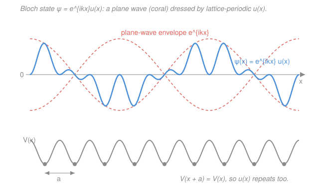

# Condensed Matter · Lesson 3.3: Bloch's theorem

> ⏱ ~15 min · Module 3: Electrons in solids · Builds on: [3.2 The Fermi surface and electronic heat capacity](03-02-fermi-surface-heat-capacity.md), [`quantum-mechanics` syllabus](../../quantum-mechanics/syllabus.md) · Unlocks: [3.4 The nearly-free-electron model](03-04-nearly-free-electron.md)

## Why this matters

In 3.1–3.2 we let electrons rattle around in an empty box and got shockingly far — the Fermi energy, the linear heat capacity, real numbers for real metals. But we cheated: we deleted the ions. Now put them back. Each electron feels the crystal's **periodic potential** $V(\mathbf{r})$ — deep wells at every ion, repeating forever with the lattice. Naively that should be a disaster: a wall of scatterers, electrons ricocheting every few ångströms, no free motion at all. Bloch's theorem is the profound rescue. It says a perfect periodic potential does **not** scatter an electron — it merely *dresses* its plane wave. This single result is why metals conduct at all, why band gaps exist, and why the entire language of "bands" (3.4–3.7) even makes sense. It is the load-bearing wall of solid-state physics.

## The idea

Here is the puzzle in one sentence: an electron is a wave, and a wave hitting a regular array of obstacles usually gets torn apart by scattering — so how does any electron cross a crystal?

The resolution is symmetry. A perfect crystal looks *exactly the same* if you slide it by any lattice vector $\mathbf{R}$. Nature loves this kind of symmetry, and quantum mechanics has a rule for it (you met it in `quantum-mechanics`): **when an operation leaves the Hamiltonian unchanged, you can find energy eigenstates that respond to that operation in the simplest possible way — by picking up a mere phase.** For translation by $\mathbf{R}$, "picking up a phase" means the wavefunction after the slide equals the wavefunction before, times a number of the form $e^{i\mathbf{k}\cdot\mathbf{R}}$. The probability $|\psi|^2$ is unchanged (the phase has magnitude 1), so the electron is *equally likely to be found* in every unit cell — it is spread across the whole crystal, exactly like a free plane wave. It is **not** trapped near one ion.

So the electron stays a travelling wave. What the lattice adds is texture: within each unit cell the wave gets sculpted — piling up charge near the attractive ions, thinning out between them — but that sculpting *repeats identically* cell to cell. Peel off that repeating texture and what remains underneath is a clean plane wave $e^{i\mathbf{k}\cdot\mathbf{r}}$. That is Bloch's theorem: **plane wave $\times$ a lattice-periodic modulation.** The lattice dresses the electron; it does not localize it.

## The formal version

**Setup.** An electron in a crystal obeys the Schrödinger equation $\hat{H}\psi = \varepsilon\psi$ with

$$\hat{H} = -\frac{\hbar^2}{2m}\nabla^2 + V(\mathbf{r}), \qquad V(\mathbf{r}+\mathbf{R}) = V(\mathbf{r}) \ \text{ for every lattice vector } \mathbf{R},$$

where $m$ is the electron mass, $\hbar$ the reduced Planck constant, $\nabla^2$ the Laplacian, and $\mathbf{R} = n_1\mathbf{a}_1 + n_2\mathbf{a}_2 + n_3\mathbf{a}_3$ (integers $n_i$, primitive vectors $\mathbf{a}_i$) runs over the Bravais lattice from [1.1](01-01-lattices-bases-bravais.md). *In words: the potential has the full periodicity of the crystal.*

**Bloch's theorem.** The eigenstates of such an $\hat{H}$ can be chosen in the form

$$\boxed{\;\psi_{n\mathbf{k}}(\mathbf{r}) = e^{i\mathbf{k}\cdot\mathbf{r}}\, u_{n\mathbf{k}}(\mathbf{r}), \qquad u_{n\mathbf{k}}(\mathbf{r}+\mathbf{R}) = u_{n\mathbf{k}}(\mathbf{r})\;}$$

*In words: every crystal eigenstate is a plane wave $e^{i\mathbf{k}\cdot\mathbf{r}}$ carrying a wavevector $\mathbf{k}$, modulated by a function $u_{n\mathbf{k}}$ that itself repeats with the lattice.* Here $\mathbf{k}$ is a wavevector labelling the state, $n$ is the **band index** (a discrete label, $n = 1, 2, 3,\dots$), and $u_{n\mathbf{k}}$ is the cell-periodic part. Equivalently, translating by any lattice vector just multiplies the whole wavefunction by a phase:

$$\psi_{n\mathbf{k}}(\mathbf{r}+\mathbf{R}) = e^{i\mathbf{k}\cdot\mathbf{R}}\,\psi_{n\mathbf{k}}(\mathbf{r}).$$

*In words: slide the electron over by a lattice vector and its wavefunction is unchanged except for a phase $e^{i\mathbf{k}\cdot\mathbf{R}}$.* These two boxed statements are equivalent — the second follows from the first because $e^{i\mathbf{k}\cdot(\mathbf{r}+\mathbf{R})}u(\mathbf{r}+\mathbf{R}) = e^{i\mathbf{k}\cdot\mathbf{R}}\,[e^{i\mathbf{k}\cdot\mathbf{r}}u(\mathbf{r})]$.

**Why it's true (the symmetry argument).** Define the **translation operator** $\hat{T}_{\mathbf{R}}$ that shifts any function by $\mathbf{R}$: $\hat{T}_{\mathbf{R}}f(\mathbf{r}) = f(\mathbf{r}+\mathbf{R})$. Because $V$ is periodic, $\hat{T}_{\mathbf{R}}$ leaves $\hat{H}$ alone, so $[\hat{H},\hat{T}_{\mathbf{R}}] = 0$, and translations by different lattice vectors commute with each other, $\hat{T}_{\mathbf{R}}\hat{T}_{\mathbf{R}'} = \hat{T}_{\mathbf{R}+\mathbf{R}'}$. A commuting set of operators shares a common eigenbasis (the simultaneous-eigenstate theorem from `quantum-mechanics`), so we can label states by the eigenvalues of the $\hat{T}_{\mathbf{R}}$. Those eigenvalues must be **pure phases**: $\hat{T}_{\mathbf{R}}\psi = c(\mathbf{R})\psi$ with $|c(\mathbf{R})| = 1$ (else repeated shifts would blow the wavefunction up or crush it to zero). The multiplication rule forces $c(\mathbf{R})c(\mathbf{R}') = c(\mathbf{R}+\mathbf{R}')$, and the only functions turning addition of vectors into multiplication of unit-magnitude numbers are exponentials $c(\mathbf{R}) = e^{i\mathbf{k}\cdot\mathbf{R}}$ for some vector $\mathbf{k}$. That is precisely the boxed phase law — Bloch's theorem *is* the statement that lattice translations are a symmetry.

**Crystal momentum $\hbar\mathbf{k}$ and the Brillouin zone.** The label $\mathbf{k}$ is called the **crystal momentum** (times $\hbar$). It is *not* true momentum — $\psi_{n\mathbf{k}}$ is not an eigenstate of $\hat{\mathbf{p}} = -i\hbar\nabla$, because the modulation $u_{n\mathbf{k}}$ spoils that. Crucially, $\mathbf{k}$ is defined only **modulo a reciprocal lattice vector** $\mathbf{G}$ (from [1.3](01-03-reciprocal-lattice.md), where $\mathbf{G}\cdot\mathbf{R} = 2\pi\times\text{integer}$). Replacing $\mathbf{k}\to\mathbf{k}+\mathbf{G}$ leaves the phase law untouched:

$$e^{i(\mathbf{k}+\mathbf{G})\cdot\mathbf{R}} = e^{i\mathbf{k}\cdot\mathbf{R}}\underbrace{e^{i\mathbf{G}\cdot\mathbf{R}}}_{=\,1} = e^{i\mathbf{k}\cdot\mathbf{R}}.$$

*In words: $\mathbf{k}$ and $\mathbf{k}+\mathbf{G}$ label the very same state.* So we only need $\mathbf{k}$ values inside **one** primitive cell of the reciprocal lattice — the **first Brillouin zone**. This redundancy is exactly why band structures are periodic in $\mathbf{k}$ and why energies from outside the zone get "folded" back in (the reduced-zone scheme of 3.6).

**Band index $n$.** Fix a $\mathbf{k}$ in the zone. Plugging the Bloch form into Schrödinger's equation gives an eigenvalue problem *for $u_{n\mathbf{k}}$ on a single unit cell* — a box with periodic walls. Any such confined problem has a discrete ladder of solutions, labelled $n = 1, 2, 3,\dots$, with energies $\varepsilon_1(\mathbf{k}) \le \varepsilon_2(\mathbf{k}) \le \cdots$. Each function $\varepsilon_n(\mathbf{k})$, traced across the zone, is an **energy band**. *In words: for each wavevector there is a whole tower of allowed energies, and stacking them gives the bands.*

**Born–von Kármán boundary conditions.** To count states, wrap the crystal into a torus: demand $\psi(\mathbf{r} + N_i\mathbf{a}_i) = \psi(\mathbf{r})$ across a block of $N = N_1 N_2 N_3$ cells. The phase law then requires $e^{i\mathbf{k}\cdot N_i\mathbf{a}_i} = 1$, quantizing $\mathbf{k}$ to exactly $N$ evenly spaced values inside the Brillouin zone — **one allowed $\mathbf{k}$ per unit cell of the crystal**, per band. (With spin, $2N$ electron states per band.) This is the same counting that gave the free-electron $\mathbf{k}$-grid in 3.1; the lattice just wraps it into the zone.

**The payoff.** A Bloch state is a *stationary* state of the crystal Hamiltonian: an electron placed in one stays there forever, carrying its crystal momentum across the whole solid without decay. A **perfect periodic lattice causes zero scattering.** Electrical resistance therefore cannot come from the ideal lattice — it comes only from things that *break* periodicity: defects, impurities, and thermal vibrations (phonons, Module 2). *In words: a clean, cold, perfect crystal would have infinite conductivity; resistance is the price of imperfection.*

## Picture

The grey curve is the periodic potential $V(x)$, dipping into a well at every ion (grey dots, spacing $a$). The blue curve is a Bloch wavefunction. Notice its two timescales: a **fast** wiggle that repeats every lattice spacing — that's the periodic $u(x)$, sculpted by the wells — and a **slow** overall sway traced by the coral dashed **envelope**, which is the plane wave $e^{ikx}$. The electron is a plane wave wearing lattice-periodic clothing.

## Worked examples

**Example 1 (verify a given state is Bloch — and read off its $\mathbf{k}$).** In one dimension with lattice constant $a$, is
$$\psi(x) = e^{i k x}\big(1 + \tfrac{1}{2}\cos\tfrac{2\pi x}{a}\big)$$
a Bloch state? If so, what is its crystal momentum?

Write it as $\psi = e^{ikx}u(x)$ with $u(x) = 1 + \tfrac12\cos(2\pi x/a)$. Check the periodicity of $u$: since $\cos\!\big(\tfrac{2\pi (x+a)}{a}\big) = \cos\!\big(\tfrac{2\pi x}{a} + 2\pi\big) = \cos\tfrac{2\pi x}{a}$, we have $u(x+a) = u(x)$. ✓ So $\psi$ is exactly the Bloch form: a plane wave $e^{ikx}$ times a lattice-periodic $u$. Its crystal momentum is $\hbar k$. (The extra $\cos(2\pi x/a) = \tfrac12(e^{iGx} + e^{-iGx})$ with $G = 2\pi/a$ a reciprocal-lattice vector — the modulation is built entirely from reciprocal-lattice waves, as it must be.)

Now confirm the phase law directly at $\mathbf{R} = a$:
$$\psi(x+a) = e^{ik(x+a)}u(x+a) = e^{ika}\,e^{ikx}u(x) = e^{ika}\,\psi(x). \checkmark$$
Sliding by one lattice constant multiplied $\psi$ by the phase $e^{ika}$, precisely as Bloch requires.

**Example 2 ($\mathbf{k}$ and $\mathbf{k}+\mathbf{G}$ are the same state — the redundancy made concrete).** Take a *free* electron (so $V = 0$, and genuinely $u=1$) in 1D, $\psi_k(x) = e^{ikx}$. Compare $k' = k + G$ with $G = 2\pi/a$. Then
$$\psi_{k'}(x) = e^{i(k+G)x} = e^{ikx}\,e^{iGx} = e^{ikx}\underbrace{e^{i2\pi x/a}}_{\text{periodic, }=\,\tilde u(x)}.$$
This is a *legitimate* Bloch state at wavevector $k$: a plane wave $e^{ikx}$ times the lattice-periodic factor $\tilde u(x) = e^{i2\pi x/a}$ (indeed $\tilde u(x+a) = e^{i2\pi(x+a)/a} = e^{i2\pi x/a}e^{i2\pi} = \tilde u(x)$). So the state we'd have called "$k+G$" in the empty-lattice extended zone is the *same physical state* as one sitting at $k$ in the first zone — it has just moved into a higher band $n$. This is the bookkeeping behind zone folding: the free-electron parabola $\varepsilon = \hbar^2 k^2/2m$, cut at the zone boundaries and folded back, becomes the empty-lattice band structure that 3.4 then splits open into real gaps.

## Watch out

- **You might think crystal momentum $\hbar\mathbf{k}$ is real momentum.** It isn't. A Bloch state is *not* a momentum eigenstate — apply $-i\hbar\nabla$ and the derivative also hits $u_{n\mathbf{k}}$, giving extra terms. $\hbar\mathbf{k}$ is a symmetry label (the eigenvalue of lattice translation), conserved in collisions only up to a reciprocal-lattice vector $\mathbf{G}$. Momentum is exchanged with the whole lattice in units of $\hbar\mathbf{G}$.
- **You might think adding the periodic potential must cause scattering.** The whole point of Bloch is the opposite: the *perfectly periodic* part of the potential is already baked into the stationary states $\psi_{n\mathbf{k}}$, which propagate forever. Only *deviations* from periodicity scatter. A common slip is to blame resistivity on the ions themselves rather than on their thermal wobble and misplacement.
- **You might treat $\mathbf{k}$ outside the first zone as a new state.** Since $\mathbf{k}$ and $\mathbf{k}+\mathbf{G}$ are identical, any $\mathbf{k}$ can be folded back into the first Brillouin zone; the price is relabelling which band $n$ you're on. Don't double-count — one $\mathbf{k}$ per cell per band is the honest tally.

## One-liner

> In a periodic potential every electron eigenstate is a plane wave dressed by a lattice-periodic modulation, $\psi_{n\mathbf{k}} = e^{i\mathbf{k}\cdot\mathbf{r}}u_{n\mathbf{k}}$ — so a perfect crystal never scatters its own electrons.

## Problems

**P1 (🟢)** In 1D with lattice constant $a$, consider $\psi(x) = e^{ikx}u(x)$ where $u(x) = 2 + \cos(2\pi x/a) + \tfrac13\sin(4\pi x/a)$. Verify that $\psi$ satisfies the Bloch phase law $\psi(x+a) = e^{ika}\psi(x)$, and state the crystal momentum.

**P2 (🟡)** A 1D crystal has $N = 1000$ unit cells of length $a = 3$ Å, wrapped in Born–von Kármán boundary conditions. (a) How many distinct allowed values of $k$ lie in the first Brillouin zone, and what is the spacing $\Delta k$ between neighbours? (b) Including spin, how many independent electron states does a single band hold? (c) The first Brillouin zone runs from $-\pi/a$ to $\pi/a$; check that your count of $k$-values fills it at spacing $\Delta k$.

**P3 (🔴, optional)** Show that a Bloch state is generally *not* an eigenstate of momentum $\hat{p} = -i\hbar\,d/dx$, by acting with $\hat p$ on $\psi = e^{ikx}u(x)$. Under what condition on $u(x)$ *would* it be a momentum eigenstate, and what does that condition correspond to physically?

Solutions

**P1** First check $u$ is lattice-periodic. Each piece has period $a$ in $x$: $\cos\!\big(\tfrac{2\pi(x+a)}{a}\big) = \cos\!\big(\tfrac{2\pi x}{a}+2\pi\big) = \cos\tfrac{2\pi x}{a}$, and $\sin\!\big(\tfrac{4\pi(x+a)}{a}\big) = \sin\!\big(\tfrac{4\pi x}{a}+4\pi\big) = \sin\tfrac{4\pi x}{a}$. So $u(x+a) = u(x)$. Then
$$\psi(x+a) = e^{ik(x+a)}u(x+a) = e^{ika}e^{ikx}u(x) = e^{ika}\psi(x). \checkmark$$
The crystal momentum is $\hbar k$.

*Check.* The modulation is built from $\cos(2\pi x/a)$ and $\sin(4\pi x/a)$ — harmonics at reciprocal-lattice vectors $G = 2\pi/a$ and $2G = 4\pi/a$. Every term in a legal $u$ must be such a reciprocal-lattice wave, and both are. ✓

**P2** (a) Born–von Kármán quantizes $k$ to $N$ values per band, one per unit cell, so **1000** distinct $k$. The zone has width $2\pi/a$, so the spacing is
$$\Delta k = \frac{2\pi/a}{N} = \frac{2\pi}{Na} = \frac{2\pi}{1000 \times 3\ \text{Å}} = \frac{2\pi}{3000\ \text{Å}} \approx 2.1\times10^{-3}\ \text{Å}^{-1}.$$
(b) Each $k$ holds 2 spin states, so a single band holds $2N = \mathbf{2000}$ electron states.
(c) The zone $[-\pi/a,\ \pi/a)$ has length $2\pi/a$; $N$ equal steps of $\Delta k = 2\pi/(Na)$ span $N\cdot\Delta k = 2\pi/a$ — exactly one zone width, no gaps or overlaps. ✓

*Check.* Units: $\Delta k \sim 1/\text{length}$ ✓. Order of magnitude: the zone half-width $\pi/a = \pi/3 \approx 1.05\ \text{Å}^{-1}$, and $\Delta k \approx 2.1\times10^{-3}\ \text{Å}^{-1}$ is about $1/1000$ of the full width — the $k$-grid is fine but discrete, exactly $N$ points, as it must be for $N$ cells. ✓

**P3** Act with $\hat p = -i\hbar\,d/dx$ on $\psi = e^{ikx}u(x)$, using the product rule:
$$\hat p\,\psi = -i\hbar\frac{d}{dx}\big(e^{ikx}u\big) = -i\hbar\big(ik\,e^{ikx}u + e^{ikx}u'\big) = \hbar k\,\psi \;-\; i\hbar\,e^{ikx}u'(x).$$
For $\psi$ to be a momentum eigenstate we'd need $\hat p\psi = (\text{const})\psi$, i.e. the second term must be proportional to $\psi$ — which requires $u'(x) = 0$, a **constant** $u$. A constant $u$ means no lattice modulation at all: the free-electron case ($V=0$), where $\psi = e^{ikx}$ is a genuine plane wave with momentum $\hbar k$. As soon as the periodic potential sculpts $u$ (so $u'\ne 0$), the extra $-i\hbar e^{ikx}u'$ term spoils it, and $\hbar k$ is only *crystal* momentum, not true momentum.

*Check.* Limiting case: turning off the potential returns $u\to\text{const}$ and recovers ordinary momentum $\hbar k$ — the crystal-momentum concept smoothly reduces to real momentum in the free limit, as it should. ✓

## Flashback

**From Lesson 3.2 (The Fermi surface and electronic heat capacity):** A 2D free-electron gas has $N$ electrons in area $A$, with single-particle energies $\varepsilon = \hbar^2 k^2/2m$. (a) Show the 2D density of states $g(\varepsilon)$ (states per unit energy per unit area, including spin) is a *constant*, independent of $\varepsilon$. (b) Using that, express the Fermi energy $E_F$ in terms of the areal density $n = N/A$.

Solution

(a) In 2D the allowed $\mathbf{k}$ fill $k$-space at density $A/(2\pi)^2$ per unit area (Born–von Kármán, same as 3.1 in one lower dimension). The number of states (with spin factor 2) inside a circle of radius $k$ is
$$N(k) = 2\cdot\frac{A}{(2\pi)^2}\cdot \pi k^2 = \frac{A\,k^2}{2\pi}.$$
Convert to energy with $k^2 = 2m\varepsilon/\hbar^2$: $N(\varepsilon) = \dfrac{A}{2\pi}\dfrac{2m\varepsilon}{\hbar^2} = \dfrac{A m\varepsilon}{\pi\hbar^2}$. Then
$$g(\varepsilon) = \frac{1}{A}\frac{dN}{d\varepsilon} = \frac{m}{\pi\hbar^2} = \text{constant}. \checkmark$$
The energy dependence cancels — a hallmark of two dimensions (in 3D, $g\propto\sqrt\varepsilon$; in 1D, $g\propto 1/\sqrt\varepsilon$).

(b) At $T=0$ fill states up to $E_F$: $n = \displaystyle\int_0^{E_F} g\,d\varepsilon = \frac{m}{\pi\hbar^2}E_F$, so
$$E_F = \frac{\pi\hbar^2 n}{m}.$$

*Check.* Units: $[\hbar^2 n/m] = \dfrac{(\text{J·s})^2 \cdot \text{m}^{-2}}{\text{kg}} = \dfrac{\text{J}^2\text{s}^2}{\text{kg·m}^2} = \text{J}$ ✓ (since $\text{kg·m}^2/\text{s}^2 = \text{J}$). And $E_F$ rising linearly with density $n$ is the 2D signature — contrast the 3D $E_F\propto n^{2/3}$ from 3.1. ✓

## Connections

- **Backward:** this rests on the reciprocal lattice and first Brillouin zone of [1.3](01-03-reciprocal-lattice.md) — the vectors $\mathbf{G}$ with $e^{i\mathbf{G}\cdot\mathbf{R}}=1$ are exactly what make $\mathbf{k}$ periodic — and on the free-electron $\mathbf{k}$-counting of 3.1, now wrapped into the zone by Born–von Kármán.
- **Forward:** [3.4 The nearly-free-electron model](03-04-nearly-free-electron.md) switches on a weak periodic $V$ and watches degenerate Bloch states at the zone boundary repel, opening the gap $2|U_\mathbf{G}|$; 3.5 (tight binding) builds the same bands from atomic orbitals; 3.6–3.7 fill them to decide metal vs. insulator. Every one of these lives inside the Bloch framework set up here.
- **Sideways (`quantum-mechanics`):** the engine is the simultaneous-eigenstate theorem for commuting operators — $[\hat H,\hat T_{\mathbf{R}}]=0$ lets energy and lattice-translation share an eigenbasis, and the translation eigenvalues are the phases $e^{i\mathbf{k}\cdot\mathbf{R}}$. This is the same symmetry-implies-conserved-label logic that ties rotational symmetry to angular momentum; see the [`quantum-mechanics` syllabus](../../quantum-mechanics/syllabus.md).
