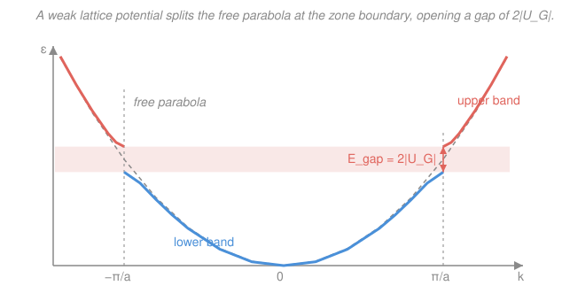

# Condensed Matter · Lesson 3.4: The nearly-free-electron model

> ⏱ ~15 min · Module 3: Electrons in solids · Builds on: [3.3 Bloch's theorem](03-03-blochs-theorem.md), [`quantum-mechanics` (degenerate perturbation theory)](../../quantum-mechanics/syllabus.md) · Unlocks: [3.5 The tight-binding model](03-05-tight-binding.md)

## Why this matters

In [3.1](03-01-free-electron-gas.md) we filled a box with free electrons and got metals right — heat capacity, Fermi velocity, the lot. But free electrons can't explain the single most important fact about solids: some conduct and some don't. A perfect free gas has no forbidden energies, so *every* material would be a metal. [3.3](03-03-blochs-theorem.md) told us the lattice merely *dresses* plane waves into Bloch states without destroying them — but it didn't yet show where the **band gaps** come from. This lesson does, from the gentlest possible starting point: take the free gas and switch on a *weak* periodic potential. Almost nothing happens — except at one special place, the Brillouin-zone boundary, where a gap tears open. That gap is the difference between a conductor and an insulator.

## The idea

Picture the free-electron energy $\varepsilon = \hbar^2 k^2/2m$ — a smooth parabola in $k$. Now sprinkle in the crystal's periodic potential, but keep it *weak*: the ion cores nudge the electrons rather than trapping them. For almost every $k$, a weak nudge barely moves the parabola — a plane wave sails through the lattice, slightly rippled but essentially free.

The exception is when the electron's wavelength lines up with the lattice spacing. An electron with $k = \pi/a$ has wavelength $\lambda = 2\pi/k = 2a$ — exactly the condition for **Bragg reflection** off the rows of atoms (Module 1). Such a wave can't just travel forward: the lattice keeps kicking it backward. Forward and backward waves of equal strength don't propagate at all — they lock into a **standing wave**. And there are *two* ways to build that standing wave: one that piles the electron's charge right on top of the positive ion cores, and one that piles it in the gaps between them. Sitting on a positive ion is low potential energy; sitting between them is high. Same $k$, two different energies — and the split between them is the band gap. Wherever an electron would Bragg-reflect, a forbidden energy window opens.

## The formal version

**The setup.** Write the weak periodic potential as a Fourier series over the reciprocal lattice (from [1.3](01-03-reciprocal-lattice.md)):

$$V(x) = \sum_{G} U_G\, e^{iGx}, \qquad G = \frac{2\pi n}{a}\ (n \in \mathbb{Z}),$$

where $U_G$ (units of energy) is the Fourier amplitude at reciprocal-lattice vector $G$, and $a$ is the lattice constant. *In words: because the potential repeats every $a$, only wavevectors that are reciprocal-lattice vectors survive in its Fourier expansion.* We take $U_0 = 0$ (absorb the average into the zero of energy) and $|U_G|$ small.

**Where degeneracy strikes.** The unperturbed states are plane waves $|k\rangle = e^{ikx}$ with energy $\varepsilon_k^{(0)} = \hbar^2 k^2/2m$. A single Fourier component $U_G$ can only connect states whose wavevectors differ by $G$: it couples $|k\rangle$ to $|k - G\rangle$. That coupling matters most when the two are **degenerate**, $\varepsilon_k^{(0)} = \varepsilon_{k-G}^{(0)}$, i.e.

$$k^2 = (k - G)^2 \;\Longrightarrow\; 2k = G \;\Longrightarrow\; k = \frac{G}{2} = \frac{\pi}{a}.$$

*In words: the two free states have equal energy exactly at the Brillouin-zone boundary* — and $2k = G$ is precisely the **Bragg condition** from [1.4](01-04-xray-diffraction-bragg.md). This is why we can't use ordinary perturbation theory here: it would divide by $\varepsilon_k^{(0)} - \varepsilon_{k-G}^{(0)} = 0$ and blow up. We need **degenerate perturbation theory** (from [`quantum-mechanics`](../../quantum-mechanics/syllabus.md)): diagonalize the potential *within* the degenerate pair.

**Diagonalize the $2\times 2$.** In the basis $\{|k\rangle, |k-G\rangle\}$, with $\langle k|V|k-G\rangle = U_G$ and $\langle k-G|V|k\rangle = U_G^{*}$, the Hamiltonian restricted to the pair is

$$H = \begin{pmatrix} \varepsilon_k^{(0)} & U_G \\ U_G^{*} & \varepsilon_{k-G}^{(0)} \end{pmatrix}.$$

Right at the boundary $\varepsilon_k^{(0)} = \varepsilon_{k-G}^{(0)} \equiv \varepsilon_0$, so the eigenvalues are

$$\varepsilon_\pm = \varepsilon_0 \pm |U_G|.$$

*In words: the two degenerate free states repel into one state pushed up by $|U_G|$ and one pushed down by $|U_G|$.* The energies $\varepsilon_0 - |U_G|$ and $\varepsilon_0 + |U_G|$ have nothing allowed between them, so the **gap** is

$$\boxed{\,E_{\text{gap}} = \varepsilon_+ - \varepsilon_- = 2|U_G|\,}$$

The gap is set entirely by the strength of the lattice's Fourier component that does the reflecting.

**The standing waves and why cos sits lower.** At the boundary the eigenvectors are the symmetric and antisymmetric combinations of $e^{i\pi x/a}$ and $e^{-i\pi x/a}$:

$$\psi_+ \propto e^{i\pi x/a} + e^{-i\pi x/a} \propto \cos\!\frac{\pi x}{a}, \qquad \psi_- \propto e^{i\pi x/a} - e^{-i\pi x/a} \propto \sin\!\frac{\pi x}{a}.$$

These are **standing** waves — no net momentum, exactly what a fully Bragg-reflected electron becomes. Their charge densities are

$$|\psi_+|^2 \propto \cos^2\!\frac{\pi x}{a} \ (\text{peaks at } x = 0, a, 2a\ldots), \qquad |\psi_-|^2 \propto \sin^2\!\frac{\pi x}{a}\ (\text{peaks between}).$$

Put the positive ion cores at $x = 0, a, 2a, \ldots$. Then $|\psi_+|^2$ piles electron density **on** the cores — deep in the attractive potential, so **lower** energy: this is the bottom of the gap. $|\psi_-|^2$ piles density **between** the cores — shallower potential, **higher** energy: the top of the gap. *In words: the cosine standing wave hugs the ions and wins the energy; the sine avoids them and pays for it — and the difference between them is exactly $2|U_G|$.* (Which of $\cos$/$\sin$ is lower flips if you put the ions at the midpoints instead; the physics is "charge on the attractive cores wins.")

## Picture

Away from $k = \pm\pi/a$ the bands (solid) track the free parabola (dashed) almost perfectly — the weak potential does nothing. Only at the zone boundary do they peel apart, the lower band flattening to a horizontal tangent below and the upper band lifting above, leaving the shaded forbidden strip that no $k$ can enter.

## Worked examples

**Example 1 (mechanical — gap from a Fourier component).** A 1D crystal has lattice constant $a = 3\ \text{\AA}$ and its potential's first Fourier component is $U_G = 1.5\ \text{eV}$ at $G = 2\pi/a$. Find the wavevector where the first gap opens and the size of that gap.

The first gap opens at the zone boundary,

$$k = \frac{G}{2} = \frac{\pi}{a} = \frac{\pi}{3\times 10^{-10}\ \text{m}} \approx 1.05\times 10^{10}\ \text{m}^{-1}.$$

Its size is $E_{\text{gap}} = 2|U_G| = 2(1.5\ \text{eV}) = 3.0\ \text{eV}$. That is a wide gap — this material would be an insulator, since a filled lower band can't be excited across 3 eV thermally ($k_B T \approx 0.025$ eV at room temperature).

**Example 2 (why you'd care — folding into bands).** How does one parabola become many bands? In the **extended-zone scheme** the free parabola runs on forever, but a gap opens at *every* zone boundary $k = n\pi/a$ (each from the coupling $U_G$ with $G = 2\pi n/a$). Chop the parabola at $k = \pm\pi/a, \pm 2\pi/a, \ldots$ and slide each segment back into the first Brillouin zone by subtracting the appropriate $G$ — the **reduced-zone scheme** (legal because [3.3](03-03-blochs-theorem.md) showed $k$ and $k+G$ label the *same* Bloch state). The single free parabola becomes a stack of bands over $[-\pi/a, \pi/a]$, each pair separated by a gap $2|U_{G}|$. *In words: gaps chop the free parabola into pieces, and crystal-momentum equivalence folds the pieces into a stack of bands.* Fill those bands with electrons and where the Fermi level lands — inside a band or inside a gap — decides metal vs. insulator ([3.7](03-07-metals-insulators-semiconductors.md)).

## Watch out

- **You might think the potential shifts every state a little, like ordinary perturbation theory.** It does *first order in $U_G$* almost everywhere — but at the zone boundary the first-order energy shift $\langle k|V|k\rangle = U_0 = 0$ vanishes, and the real effect is the *degenerate* splitting $\pm|U_G|$. The gap is a first-order effect *only* because the states are degenerate; ordinary non-degenerate perturbation theory would miss it entirely (and divide by zero trying).
- **You might think a bigger gap means a stronger potential everywhere.** The first gap is set by the *single* Fourier component $U_{G}$ with $G = 2\pi/a$ — not the total depth of $V(x)$. A potential can be deep yet have a tiny $U_{2\pi/a}$ (and hence a tiny first gap) if its shape happens to lack that harmonic.
- **You might expect the gap of $2|U_G|$ to appear at $k=0$.** No — it opens at the *boundary* $k=\pi/a$, where the Bragg condition $2k=G$ is met. At $k=0$ there is no degenerate partner to mix with, so the band bottom just shifts smoothly.

## One-liner

> Turn on a weak lattice and nothing changes until an electron Bragg-reflects at the zone boundary, where the forward and backward waves lock into a $\cos$ (on the ions, low) and a $\sin$ (between them, high) standing wave split by a gap $E_{\text{gap}} = 2|U_G|$.

## Problems

**P1 (🟢)** A 1D lattice has constant $a = 4\ \text{\AA}$. Its periodic potential has Fourier amplitude $|U_G| = 0.8$ eV at the smallest reciprocal-lattice vector $G = 2\pi/a$. (a) At what $k$ does the first band gap open? (b) How wide is it?

**P2 (🟡)** At the zone boundary the two eigenstates are $\psi_+ \propto \cos(\pi x/a)$ and $\psi_- \propto \sin(\pi x/a)$. The ion cores sit at $x = 0, a, 2a, \ldots$. Which state has the *lower* energy, and give the one-sentence physical reason. Which one sits at the top of the gap?

**P3 (🔴, optional)** Show that the second gap (between the second and third bands) opens at $k = 2\pi/a$ in the extended-zone scheme, and identify which Fourier component $U_G$ sets its size. In the reduced-zone scheme, where does this gap appear?

Solutions

**P1** (a) The first gap sits at the Brillouin-zone boundary, $k = G/2 = \pi/a$:

$$k = \frac{\pi}{4\times 10^{-10}\ \text{m}} \approx 7.85\times 10^{9}\ \text{m}^{-1}.$$

(b) $E_{\text{gap}} = 2|U_G| = 2(0.8\ \text{eV}) = 1.6\ \text{eV}$.

*Check.* Units: $|U_G|$ is an energy, so $2|U_G|$ is an energy ✓. Order of magnitude: an eV-scale gap is a typical semiconductor/insulator gap (Si is 1.1 eV, diamond 5.5 eV), so 1.6 eV is physically reasonable. Limiting case $|U_G|\to 0$ recovers the gapless free gas of [3.1](03-01-free-electron-gas.md) ✓.

**P2** $\psi_+ \propto \cos(\pi x/a)$ has $|\psi_+|^2 \propto \cos^2(\pi x/a)$, which peaks at $x = 0, a, 2a, \ldots$ — right on top of the ion cores. It therefore concentrates electron density where the attractive potential is deepest (most negative), giving it the **lower** energy: it sits at the *bottom* of the gap. The sine state $\psi_-$ concentrates density in the gaps between ions (shallower potential), so it has the higher energy and sits at the **top** of the gap.

*Check.* The two energies must straddle the free value $\varepsilon_0$ symmetrically at $\varepsilon_0 \pm |U_G|$; identifying $\cos$ as the lower one fixes which physical picture (charge on the cores) corresponds to $\varepsilon_0 - |U_G|$ ✓.

**P3** In the extended-zone scheme a gap opens wherever $\varepsilon_k^{(0)} = \varepsilon_{k-G}^{(0)}$, i.e. $2k = G$. Taking the next reciprocal-lattice vector $G = 4\pi/a$ gives $k = G/2 = 2\pi/a$ — the *second* zone boundary. Its size is $2|U_{G}|$ with $G = 4\pi/a$, i.e. it is set by the **second** Fourier component $U_{4\pi/a}$ of the potential (not the same one that sets the first gap). In the reduced-zone scheme, $k = 2\pi/a$ is folded back by subtracting $G = 2\pi/a$ to land at $k = 0$ — so the second gap appears at the **zone center** $k = 0$.

*Check.* Pattern: gaps alternate between the zone boundary ($k=\pi/a$, odd bands) and the zone center ($k=0$, even bands) as you fold. Consistent with the standard 1D reduced-zone band picture ✓.

## Flashback

**From Lesson 3.3 (Bloch's theorem):** A 1D crystal has lattice constant $a$. A Bloch state is labeled by crystal momentum $k = 0.9\,\pi/a$. Write down another value of $k$ (outside the first Brillouin zone) that labels the *same* physical state, and state the general rule. Why does this equivalence let us fold the extended-zone parabola of this lesson back into the first zone?

Solution

Bloch's theorem says $k$ and $k + G$ label the same state for any reciprocal-lattice vector $G = 2\pi n/a$. Adding $G = 2\pi/a$:

$$k' = \frac{0.9\pi}{a} + \frac{2\pi}{a} = \frac{2.9\pi}{a}$$

labels the identical Bloch state (as does $k = 0.9\pi/a - 2\pi/a = -1.1\pi/a$, and any $0.9\pi/a + 2\pi n/a$). Because a segment of the extended-zone parabola at some $k$ outside the first zone is *physically the same* as the state at $k - G$ inside it, we may subtract the appropriate $G$ to slide every segment back into $[-\pi/a, \pi/a]$ — that is exactly the reduced-zone folding, and it's legitimate precisely because crystal momentum is only defined modulo $G$.

*Check.* $k' = 2.9\pi/a$ lies in the second zone ($\pi/a < |k| < 2\pi/a$) and folds back to $0.9\pi/a$ by subtracting $2\pi/a$ ✓ — consistent with the folding used in Example 2.

## Connections

- **Backward:** this upgrades the free gas of [3.1](03-01-free-electron-gas.md) — the dashed parabola *is* the Sommerfeld dispersion — and it uses the reciprocal lattice and Fourier picture of the potential from [1.3](01-03-reciprocal-lattice.md). The gap opens exactly at the Bragg condition $2k = G$ of [1.4](01-04-xray-diffraction-bragg.md): band gaps and X-ray reflections are the *same* geometry seen by electrons.
- **Forward:** [3.5 The tight-binding model](03-05-tight-binding.md) builds the identical band structure from the *opposite* limit — isolated atomic orbitals broadened by weak hopping — and [3.6](03-06-bands-zones-dos.md)/[3.7](03-07-metals-insulators-semiconductors.md) fill these bands to decide metal, insulator, or semiconductor. The gap you just opened is the semiconductor gap of Module 4.
- **Sideways (quantum mechanics):** the whole calculation is **degenerate perturbation theory** from [`quantum-mechanics`](../../quantum-mechanics/syllabus.md) — a $2\times 2$ diagonalization of two degenerate states coupled by a perturbation, the same level-repulsion math behind avoided crossings and the two-level system.
